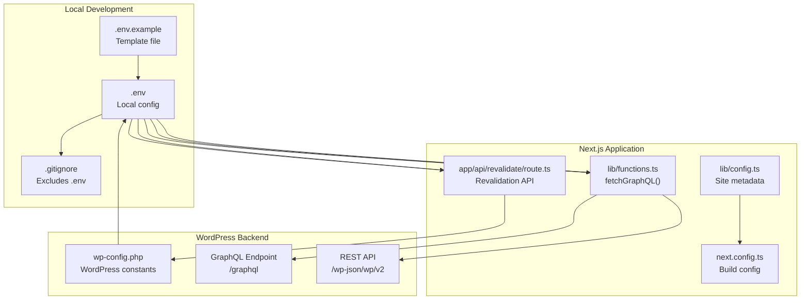
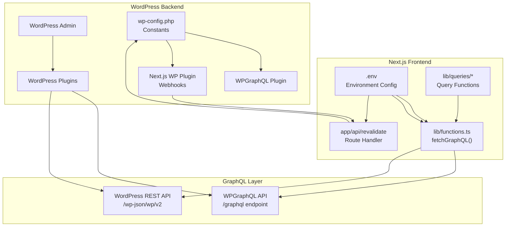
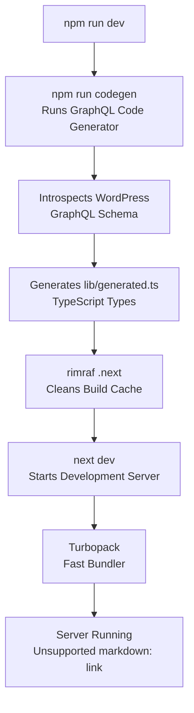

# Getting Started

> **Relevant source files**
> * [.env.example](https://github.com/gregrickaby/nextjs-wordpress/blob/63f3f2f5/.env.example)
> * [.gitignore](https://github.com/gregrickaby/nextjs-wordpress/blob/63f3f2f5/.gitignore)
> * [.vscode/extensions.json](https://github.com/gregrickaby/nextjs-wordpress/blob/63f3f2f5/.vscode/extensions.json)
> * [.vscode/settings.json](https://github.com/gregrickaby/nextjs-wordpress/blob/63f3f2f5/.vscode/settings.json)
> * [AGENTS.md](https://github.com/gregrickaby/nextjs-wordpress/blob/63f3f2f5/AGENTS.md)
> * [CONTRIBUTING.md](https://github.com/gregrickaby/nextjs-wordpress/blob/63f3f2f5/CONTRIBUTING.md)
> * [README.md](https://github.com/gregrickaby/nextjs-wordpress/blob/63f3f2f5/README.md)
> * [package-lock.json](https://github.com/gregrickaby/nextjs-wordpress/blob/63f3f2f5/package-lock.json)
> * [package.json](https://github.com/gregrickaby/nextjs-wordpress/blob/63f3f2f5/package.json)
> * [scripts/sonar-analysis.sh](https://github.com/gregrickaby/nextjs-wordpress/blob/63f3f2f5/scripts/sonar-analysis.sh)
> * [sonar-project.properties](https://github.com/gregrickaby/nextjs-wordpress/blob/63f3f2f5/sonar-project.properties)

This document guides you through the initial setup and configuration required to run the Next.js WordPress headless application locally. It covers project installation, environment configuration, WordPress backend setup, and starting the development server.

**Scope:** This page focuses on getting the application running for the first time. For detailed information about environment variables and secrets, see [Environment Configuration](/gregrickaby/nextjs-wordpress/2.1-environment-configuration). For a complete reference of development commands and scripts, see [Development Commands](/gregrickaby/nextjs-wordpress/2.2-development-commands).

---

## Prerequisites

Before setting up the project, ensure you have the following installed and configured:

| Requirement | Version | Purpose |
| --- | --- | --- |
| Node.js | v22.12.0 | JavaScript runtime for Next.js |
| npm | v10+ | Package manager (comes with Node.js) |
| WordPress | 5.9+ | Headless CMS backend |
| WPGraphQL | Latest | GraphQL API for WordPress |

**Node Version Manager (nvm):** The project includes a `.nvmrc` file specifying Node.js v22.12.0. Using nvm ensures consistent Node.js versions across development environments.

Sources: [package-lock.json L1-L6](https://github.com/gregrickaby/nextjs-wordpress/blob/63f3f2f5/package-lock.json#L1-L6)

 [README.md L58-L62](https://github.com/gregrickaby/nextjs-wordpress/blob/63f3f2f5/README.md#L58-L62)

---

## Initial Project Setup

### 1. Clone the Repository

```
git clone git@github.com:gregrickaby/nextjs-wordpress.git
cd nextjs-wordpress
```

### 2. Install Dependencies

```
nvm use && npm i
```

The `nvm use` command switches to the Node.js version specified in `.nvmrc`, and `npm i` installs all dependencies defined in `package.json`.

**What Gets Installed:**

| Dependency Type | Key Packages | Purpose |
| --- | --- | --- |
| Production | `next`, `react`, `react-dom` | Core Next.js framework |
| Development | `@graphql-codegen/cli`, `typescript`, `vitest` | Type generation, testing, tooling |
| Development | `eslint`, `prettier`, `lefthook` | Code quality and formatting |

Sources: [README.md L52-L62](https://github.com/gregrickaby/nextjs-wordpress/blob/63f3f2f5/README.md#L52-L62)

 [package.json L31-L71](https://github.com/gregrickaby/nextjs-wordpress/blob/63f3f2f5/package.json#L31-L71)

---

## Environment Configuration

### Creating the Environment File

```
cp .env.example .env
```

This creates a `.env` file from the template. The `.env` file contains sensitive configuration that is excluded from version control.

### Required Environment Variables

Configure the following variables in your `.env` file:

| Variable | Example Value | Required | Description |
| --- | --- | --- | --- |
| `NEXT_PUBLIC_WORDPRESS_GRAPHQL_URL` | `https://blog.nextjswp.com/graphql` | Yes | WordPress GraphQL endpoint (no trailing slash) |
| `NEXT_PUBLIC_WORDPRESS_REST_API_URL` | `https://blog.nextjswp.com/wp-json/wp/v2` | Yes | WordPress REST API endpoint (no trailing slash) |
| `NEXTJS_PREVIEW_SECRET` | `preview` | Yes | Secret key for draft preview functionality |
| `NEXTJS_REVALIDATION_SECRET` | `revalidate` | Yes | Secret key for on-demand revalidation |
| `NEXTJS_AUTH_REFRESH_TOKEN` | (generated token) | No | JWT refresh token for authenticated requests |

**Important Notes:**

* All `NEXT_PUBLIC_*` variables are exposed to the browser
* Secret values (`NEXTJS_PREVIEW_SECRET`, `NEXTJS_REVALIDATION_SECRET`) must match corresponding constants in WordPress `wp-config.php`
* The `NEXTJS_AUTH_REFRESH_TOKEN` is only required if you need to preview draft posts

### Environment Configuration Flow



**Diagram: Environment Configuration and Data Flow**

This diagram shows how environment variables connect the Next.js frontend to the WordPress backend. The `.env` file is copied from `.env.example` and excluded from version control by `.gitignore`. Environment variables are consumed by various parts of the application, particularly `fetchGraphQL()` for API communication and the revalidation route for cache invalidation.

Sources: [.env.example L1-L17](https://github.com/gregrickaby/nextjs-wordpress/blob/63f3f2f5/.env.example#L1-L17)

 [README.md L64-L90](https://github.com/gregrickaby/nextjs-wordpress/blob/63f3f2f5/README.md#L64-L90)

 [.gitignore L31](https://github.com/gregrickaby/nextjs-wordpress/blob/63f3f2f5/.gitignore#L31-L31)

---

## Next.js Application Configuration

### Image Domain Configuration

Edit `next.config.ts` to allow Next.js to optimize images from your WordPress domain:

```javascript
// next.config.ts
const nextConfig: NextConfig = {
  images: {
    formats: ['image/avif', 'image/webp'],
    remotePatterns: [
      {
        protocol: 'https',
        hostname: '*.nextjswp.**' // Update to your WordPress domain
      },
      {
        protocol: 'https',
        hostname: '*.gravatar.**' // For comment avatars
      }
    ]
  }
}
```

**Purpose:** Next.js Image Optimization requires explicitly allowed domains for remote images. The `remotePatterns` configuration enables Next.js to fetch and optimize images from WordPress and Gravatar.

### Site Metadata Configuration

Edit `lib/config.ts` to define your site's metadata:

```javascript
// lib/config.ts
const config = {
  siteName: 'Next.js WordPress',
  siteDescription: "It's headless WordPress!",
  siteUrl: 'https://nextjswp.com',
  revalidation: 3600 // ISR revalidation interval (seconds)
}
```

**Configuration Properties:**

| Property | Type | Purpose | Used By |
| --- | --- | --- | --- |
| `siteName` | string | Site title | `generateMetadata()`, RSS feed |
| `siteDescription` | string | Site description | `generateMetadata()`, SEO |
| `siteUrl` | string | Canonical URL | Sitemap, RSS feed |
| `revalidation` | number | ISR cache duration | `fetch()` next.revalidate option |

Sources: [README.md L91-L128](https://github.com/gregrickaby/nextjs-wordpress/blob/63f3f2f5/README.md#L91-L128)

---

## WordPress Backend Configuration

The WordPress backend must be configured with specific plugins and constants to enable GraphQL API access and webhook-based revalidation.

### Required WordPress Plugins

Install and activate the following plugins on your WordPress site:

| Plugin | Required | Purpose |
| --- | --- | --- |
| [WPGraphQL](https://www.wpgraphql.com/) | Yes | Exposes WordPress data via GraphQL |
| [Advanced Custom Fields](https://wordpress.org/plugins/advanced-custom-fields/) | Yes | Custom field management |
| [WPGraphQL for Advanced Custom Fields](https://wordpress.org/plugins/wpgraphql-acf/) | Yes | Exposes ACF fields in GraphQL |
| [Yoast SEO](https://wordpress.org/plugins/wordpress-seo/) | Yes | SEO metadata |
| [WPGraphQL Yoast SEO](https://wordpress.org/plugins/add-wpgraphql-seo/) | Yes | Exposes Yoast SEO data in GraphQL |
| [Next.js WordPress Plugin](https://github.com/gregrickaby/nextjs-wordpress/blob/63f3f2f5/Next.js WordPress Plugin) | Yes | Adds revalidation webhooks |
| [Next.js WordPress Theme](https://github.com/gregrickaby/nextjs-wordpress/blob/63f3f2f5/Next.js WordPress Theme) | Yes | Minimal WordPress theme |
| [WPGraphQL JWT Authentication](https://github.com/gregrickaby/nextjs-wordpress/blob/63f3f2f5/WPGraphQL JWT Authentication) | No | JWT auth for preview mode |

### WordPress Configuration Constants

Add the following constants to your WordPress `wp-config.php` file:

```
// WordPress wp-config.php

// The URL of your Next.js frontend. Include the trailing slash.
define( 'NEXTJS_FRONTEND_URL', 'https://nextjswp.com/' );

// Optional. JWT auth refresh token secret.
// define( 'GRAPHQL_JWT_AUTH_SECRET_KEY', 'generated-secret-key' );

// Preview secret. Must match NEXTJS_PREVIEW_SECRET in .env.
define( 'NEXTJS_PREVIEW_SECRET', 'preview' );

// Revalidation secret. Must match NEXTJS_REVALIDATION_SECRET in .env.
define( 'NEXTJS_REVALIDATION_SECRET', 'revalidate' );
```

**Critical Requirements:**

* `NEXTJS_PREVIEW_SECRET` must match the value in Next.js `.env`
* `NEXTJS_REVALIDATION_SECRET` must match the value in Next.js `.env`
* `NEXTJS_FRONTEND_URL` must include the trailing slash

### Permalink Structure

Configure WordPress permalinks:

1. Navigate to **Settings → Permalinks** in WordPress admin
2. Set permalink structure to: `/blog/%postname%/`

This permalink structure ensures URLs match the Next.js routing structure defined in `app/blog/[slug]/page.tsx`.

### WordPress Integration Architecture



**Diagram: WordPress Integration Points**

This diagram illustrates the connection between WordPress and Next.js. WordPress plugins expose data through the WPGraphQL API and REST API endpoints. The Next.js WordPress Plugin triggers webhooks to the revalidation API when content changes. Environment variables and `wp-config.php` constants must match to enable secure communication.

Sources: [README.md L130-L165](https://github.com/gregrickaby/nextjs-wordpress/blob/63f3f2f5/README.md#L130-L165)

 [README.md L146-L161](https://github.com/gregrickaby/nextjs-wordpress/blob/63f3f2f5/README.md#L146-L161)

---

## Running the Development Server

### Starting the Server

```
npm run dev
```

**What Happens:**



**Diagram: Development Server Startup Sequence**

When you run `npm run dev`, the following sequence executes:

1. **GraphQL Code Generation** (`npm run codegen`): * Introspects WordPress GraphQL schema * Generates TypeScript types in `lib/generated.ts` * Ensures type safety for all GraphQL operations
2. **Cache Cleaning** (`rimraf .next`): * Removes stale Next.js build cache * Prevents caching issues during development
3. **Next.js Development Server** (`next dev`): * Starts server on `http://localhost:3000` * Enables Turbopack for fast bundling * Watches files for hot module replacement

### Verification Steps

After starting the development server, verify the setup:

| Step | URL | Expected Result |
| --- | --- | --- |
| 1. Homepage | `http://localhost:3000` | Displays homepage with posts |
| 2. Single Post | `http://localhost:3000/blog/[post-slug]` | Displays post content |
| 3. GraphQL Types | Check `lib/generated.ts` exists | File is generated (gitignored) |
| 4. Console Output | Terminal shows "Ready in [time]" | No errors during startup |

**Common Issues:**

* **GraphQL Generation Fails:** Verify `NEXT_PUBLIC_WORDPRESS_GRAPHQL_URL` in `.env` is correct and WordPress is accessible
* **404 on Posts:** Check WordPress permalink structure is set to `/blog/%postname%/`
* **Image Optimization Errors:** Verify WordPress domain is added to `next.config.ts` remotePatterns

Sources: [package.json L16-L29](https://github.com/gregrickaby/nextjs-wordpress/blob/63f3f2f5/package.json#L16-L29)

 [README.md L226-L232](https://github.com/gregrickaby/nextjs-wordpress/blob/63f3f2f5/README.md#L226-L232)

 [AGENTS.md L84-L96](https://github.com/gregrickaby/nextjs-wordpress/blob/63f3f2f5/AGENTS.md#L84-L96)

---

## Optional: JWT Authentication for Preview Mode

Preview mode allows viewing draft WordPress posts in Next.js. This requires JWT authentication setup.

### Generating JWT Token

1. Install and activate [WPGraphQL JWT Authentication](https://github.com/gregrickaby/nextjs-wordpress/blob/63f3f2f5/WPGraphQL JWT Authentication)  plugin
2. Generate a random secret using [WordPress Salt Generator](https://api.wordpress.org/secret-key/1.1/salt/)
3. Add secret to WordPress `wp-config.php`:

```
// Optional. JWT auth refresh token.
define( 'GRAPHQL_JWT_AUTH_SECRET_KEY', 'generated-secret-from-salt-generator' );
```

1. In WordPress admin, navigate to **GraphQL → GraphiQL IDE**
2. Execute the following mutation (replace credentials):

```yaml
mutation Login {
  login(
    input: {
      clientMutationId: "uniqueId"
      password: "your_password"
      username: "your_username"
    }
  ) {
    refreshToken
  }
}
```

1. Copy the returned `refreshToken` value
2. Add token to Next.js `.env` file:

```markdown
# Optional. JWT auth refresh token.
NEXTJS_AUTH_REFRESH_TOKEN="refresh-token-from-graphql-query"
```

**Preview URL Structure:**

```yaml
https://your-nextjs-site.com/preview/[post-id]?secret=preview
```

The `secret` parameter must match `NEXTJS_PREVIEW_SECRET` in both `.env` and `wp-config.php`.

Sources: [README.md L184-L224](https://github.com/gregrickaby/nextjs-wordpress/blob/63f3f2f5/README.md#L184-L224)

 [.env.example L7-L8](https://github.com/gregrickaby/nextjs-wordpress/blob/63f3f2f5/.env.example#L7-L8)

---

## Next Steps

Once the development server is running successfully:

1. **Explore the Codebase:** * Review [Architecture](/gregrickaby/nextjs-wordpress/3-architecture) for system design patterns * Study [Type System](/gregrickaby/nextjs-wordpress/3.1-type-system) to understand GraphQL code generation * Examine [Data Flow](/gregrickaby/nextjs-wordpress/3.2-data-flow) to see how data moves through the application
2. **Development Workflow:** * See [Development Commands](/gregrickaby/nextjs-wordpress/2.2-development-commands) for available npm scripts * Review [Development Environment](/gregrickaby/nextjs-wordpress/7-development-environment) for editor configuration * Study [Testing](/gregrickaby/nextjs-wordpress/8-testing) for test-driven development practices
3. **Build Features:** * See [Frontend Application](/gregrickaby/nextjs-wordpress/4-frontend-application) for component architecture * Review [Data Access Layer](/gregrickaby/nextjs-wordpress/5-data-access-layer) for GraphQL query patterns * Study [WordPress Integration](/gregrickaby/nextjs-wordpress/6-wordpress-integration) for backend configuration
4. **Deploy to Production:** * Review [Build and Deployment](/gregrickaby/nextjs-wordpress/9-build-and-deployment) for CI/CD pipeline * See [SEO and Public Files](/gregrickaby/nextjs-wordpress/10-seo-and-public-files) for sitemap and RSS generation * Configure environment variables on your hosting platform

Sources: [README.md L1-L420](https://github.com/gregrickaby/nextjs-wordpress/blob/63f3f2f5/README.md#L1-L420)

 [AGENTS.md L1-L508](https://github.com/gregrickaby/nextjs-wordpress/blob/63f3f2f5/AGENTS.md#L1-L508)