# Type System

> **Relevant source files**
> * [.nvmrc](https://github.com/gregrickaby/nextjs-wordpress/blob/63f3f2f5/.nvmrc)
> * [app/feed.xml/route.ts](https://github.com/gregrickaby/nextjs-wordpress/blob/63f3f2f5/app/feed.xml/route.ts)
> * [app/robots.ts](https://github.com/gregrickaby/nextjs-wordpress/blob/63f3f2f5/app/robots.ts)
> * [app/sitemap.ts](https://github.com/gregrickaby/nextjs-wordpress/blob/63f3f2f5/app/sitemap.ts)
> * [codegen.ts](https://github.com/gregrickaby/nextjs-wordpress/blob/63f3f2f5/codegen.ts)
> * [eslint.config.mjs](https://github.com/gregrickaby/nextjs-wordpress/blob/63f3f2f5/eslint.config.mjs)
> * [lib/types.d.ts](https://github.com/gregrickaby/nextjs-wordpress/blob/63f3f2f5/lib/types.d.ts)
> * [tsconfig.json](https://github.com/gregrickaby/nextjs-wordpress/blob/63f3f2f5/tsconfig.json)

## Purpose and Scope

This document explains the TypeScript type system architecture in the Next.js WordPress headless application. It covers how types are generated from the WordPress GraphQL schema, how they are transformed and augmented, and how they flow through the application to ensure end-to-end type safety.

For information about how these types are used in data fetching, see [Data Flow](/gregrickaby/nextjs-wordpress/3.2-data-flow). For details on GraphQL query implementations, see [GraphQL Queries](/gregrickaby/nextjs-wordpress/5.1-graphql-queries).

---

## Type System Architecture

The type system operates as a multi-stage pipeline that transforms the WordPress GraphQL schema into TypeScript types that the Next.js application consumes. This ensures that changes to the WordPress schema are immediately reflected in TypeScript compilation errors, catching breaking changes at build time rather than runtime.

### Type Generation Pipeline

**Diagram: Type Generation Flow**


Sources: [codegen.ts L1-L22](https://github.com/gregrickaby/nextjs-wordpress/blob/63f3f2f5/codegen.ts#L1-L22)

 [lib/types.d.ts L1-L27](https://github.com/gregrickaby/nextjs-wordpress/blob/63f3f2f5/lib/types.d.ts#L1-L27)

The type generation process follows these stages:

1. **Schema Introspection**: The GraphQL Code Generator introspects the WordPress GraphQL endpoint specified in `NEXT_PUBLIC_WORDPRESS_GRAPHQL_URL`
2. **Document Processing**: All `.ts` files in `lib/queries/` and `lib/mutations/` are scanned for GraphQL documents
3. **Type Generation**: TypeScript types and operation types are generated into `lib/generated.ts`
4. **Type Facade**: `lib/types.d.ts` selectively re-exports WordPress types and adds custom application types
5. **Consumption**: Application code imports types exclusively from `lib/types.d.ts`, never directly from `lib/generated.ts`

---

## GraphQL Code Generation

The GraphQL Code Generator is configured via [codegen.ts L1-L22](https://github.com/gregrickaby/nextjs-wordpress/blob/63f3f2f5/codegen.ts#L1-L22)

 and runs as part of the development and build processes.

### Code Generator Configuration

**Configuration Structure:**

| Property | Value | Purpose |
| --- | --- | --- |
| `schema` | `process.env.NEXT_PUBLIC_WORDPRESS_GRAPHQL_URL` | WordPress GraphQL endpoint for schema introspection |
| `documents` | `['lib/queries/**/*.ts', 'lib/mutations/**/*.ts']` | Files containing GraphQL query/mutation documents |
| `generates` | `'./lib/generated.ts'` | Output path for generated TypeScript types |
| `plugins` | `['typescript', 'typescript-operations']` | Type generation and operation type plugins |
| `ignoreNoDocuments` | `true` | Prevents errors when no documents are found |

**Plugin Configuration:**

```yaml
config: {
  avoidOptionals: false,     // Generate optional fields as T | undefined
  maybeValue: 'T | null',    // Nullable fields as T | null
  skipTypename: true,        // Omit __typename fields
  enumsAsTypes: true         // Generate enums as union types
}
```

Sources: [codegen.ts L1-L22](https://github.com/gregrickaby/nextjs-wordpress/blob/63f3f2f5/codegen.ts#L1-L22)

### Generated Output

The code generator produces `lib/generated.ts` which contains:

* **Base Types**: TypeScript interfaces for all WordPress GraphQL types (Post, Page, Book, Category, Tag, etc.)
* **Operation Types**: Types for each query and mutation document, including variables and response shapes
* **Fragments**: Type definitions for any GraphQL fragments used in queries
* **Enums**: Union string literal types for WordPress enums

This file is excluded from version control via `.gitignore` and regenerated on each environment setup.

---

## Type Facade Pattern

The application does not import types directly from `lib/generated.ts`. Instead, [lib/types.d.ts L1-L27](https://github.com/gregrickaby/nextjs-wordpress/blob/63f3f2f5/lib/types.d.ts#L1-L27)

 acts as a type facade, providing a controlled interface to the generated types and application-specific types.

**Diagram: Type Facade Architecture**


Sources: [lib/types.d.ts L1-L27](https://github.com/gregrickaby/nextjs-wordpress/blob/63f3f2f5/lib/types.d.ts#L1-L27)

### Re-exported WordPress Types

The facade selectively re-exports four core WordPress types:

```javascript
export type {Book, Menu, Page, Post} from './generated'
```

This provides several benefits:

* **Encapsulation**: Application code is shielded from the generated file structure
* **Selective Exposure**: Only the types needed by the application are exposed
* **Migration Safety**: If the code generation tool changes, only the facade needs updating
* **Import Consistency**: All imports come from a single location

Sources: [lib/types.d.ts L2](https://github.com/gregrickaby/nextjs-wordpress/blob/63f3f2f5/lib/types.d.ts#L2-L2)

### Custom Application Types

The facade also defines four application-specific types that extend beyond WordPress entities:

#### DynamicPageProps

```typescript
export interface DynamicPageProps {
  params: Promise<{
    slug: string
  }>
}
```

Used by all dynamic route pages (`[slug]`) in the Next.js App Router. The `params` property is a Promise as per Next.js 15+ async params requirements.

**Usage locations:**

* `app/[slug]/page.tsx` - Archive pages
* `app/blog/[slug]/page.tsx` - Post pages
* `app/books/[slug]/page.tsx` - Book pages
* `app/blog/tag/[slug]/page.tsx` - Tag archives
* `app/blog/category/[slug]/page.tsx` - Category archives
* `app/preview/[slug]/page.tsx` - Preview pages

Sources: [lib/types.d.ts L5-L9](https://github.com/gregrickaby/nextjs-wordpress/blob/63f3f2f5/lib/types.d.ts#L5-L9)

#### SearchResults

```typescript
export interface SearchResults {
  id: number
  title: string
  url: string
  type: string
  subtype: string
}
```

Represents search results from the WordPress REST API. This type is not derived from GraphQL since search functionality uses the REST endpoint.

Sources: [lib/types.d.ts L11-L17](https://github.com/gregrickaby/nextjs-wordpress/blob/63f3f2f5/lib/types.d.ts#L11-L17)

#### Children

```typescript
export interface Children {
  children: React.ReactNode
}
```

A utility type for components that accept children props, used primarily in layout components.

Sources: [lib/types.d.ts L19-L21](https://github.com/gregrickaby/nextjs-wordpress/blob/63f3f2f5/lib/types.d.ts#L19-L21)

#### GraphQLResponse

```typescript
export interface GraphQLResponse<T = any> {
  data?: T
  errors?: Array<{message: string}>
}
```

Generic type representing the structure of GraphQL API responses. The `fetchGraphQL` utility returns this type, allowing type-safe error handling.

**Type parameters:**

* `T`: The expected data shape for successful responses

Sources: [lib/types.d.ts L23-L26](https://github.com/gregrickaby/nextjs-wordpress/blob/63f3f2f5/lib/types.d.ts#L23-L26)

---

## TypeScript Compiler Configuration

The [tsconfig.json L1-L36](https://github.com/gregrickaby/nextjs-wordpress/blob/63f3f2f5/tsconfig.json#L1-L36)

 configures the TypeScript compiler with strict settings optimized for Next.js development.

### Key Configuration Options

**Diagram: TypeScript Configuration Categories**

```mermaid
flowchart TD

T1["vitest/globals"]
T2["@testing-library/jest-dom"]
T3["next/types"]
P1["baseUrl: ."]
P2["paths: @/* → ./*"]
J1["jsx: react-jsx"]
M1["module: esnext"]
M2["moduleResolution: bundler"]
M3["esModuleInterop: true"]
M4["resolveJsonModule: true"]
S1["strict: true"]
S2["isolatedModules: true"]
S3["skipLibCheck: true"]

subgraph TYPES ["Type Inclusions"]
    T1
    T2
    T3
end

subgraph PATHS ["Path Aliases"]
    P1
    P2
end

subgraph JSX ["JSX Configuration"]
    J1
end

subgraph MODULE ["Module Resolution"]
    M1
    M2
    M3
    M4
end

subgraph STRICT ["Strict Type Checking"]
    S1
    S2
    S3
end
```



Sources: [tsconfig.json L1-L36](https://github.com/gregrickaby/nextjs-wordpress/blob/63f3f2f5/tsconfig.json#L1-L36)

### Critical Settings for Type Safety

| Setting | Value | Impact on Type System |
| --- | --- | --- |
| `strict` | `true` | Enables all strict type-checking options |
| `noEmit` | `true` | TypeScript only checks types, Next.js handles compilation |
| `skipLibCheck` | `true` | Skips type checking of declaration files for faster builds |
| `isolatedModules` | `true` | Ensures each file can be safely transpiled independently |
| `target` | `ES2017` | Compilation target for generated JavaScript |
| `lib` | `["dom", "dom.iterable", "esnext"]` | Available standard library types |

### Path Aliases

The configuration establishes `@/*` as an alias for the project root:

```
"baseUrl": ".",
"paths": {
  "@/*": ["./*"]
}
```

This enables imports like `import config from '@/lib/config'` instead of relative paths like `'../../lib/config'`.

### Type Augmentation

Additional type definitions are included from:

* `vitest/globals` - Global test functions (describe, it, expect)
* `@testing-library/jest-dom` - Custom Jest DOM matchers
* `.next/types/**/*.ts` - Next.js generated types for routes and metadata

Sources: [tsconfig.json L21-L33](https://github.com/gregrickaby/nextjs-wordpress/blob/63f3f2f5/tsconfig.json#L21-L33)

---

## Type Flow in Practice

The following diagram illustrates how types flow through a typical data fetching scenario:

**Diagram: Type Flow from Schema to Component**


Sources: [lib/types.d.ts L2](https://github.com/gregrickaby/nextjs-wordpress/blob/63f3f2f5/lib/types.d.ts#L2-L2)

 [codegen.ts L6](https://github.com/gregrickaby/nextjs-wordpress/blob/63f3f2f5/codegen.ts#L6-L6)

### Type Safety Guarantees

This type system provides the following guarantees:

1. **Schema Changes Break Builds**: If a WordPress field is removed or renamed, TypeScript compilation fails
2. **Query Type Safety**: GraphQL queries are validated against the schema at generation time
3. **Component Prop Safety**: Components receive correctly typed data from queries
4. **Null Safety**: Optional and nullable fields are properly typed as `T | null` or `T | undefined`
5. **Refactoring Safety**: IDE refactoring operations preserve type correctness across the codebase

---

## Type Generation Workflow

The type generation process integrates with the development workflow at multiple points:

**Diagram: When Types Are Generated**


Sources: [codegen.ts L1-L22](https://github.com/gregrickaby/nextjs-wordpress/blob/63f3f2f5/codegen.ts#L1-L22)

### Generation Triggers

Types are automatically generated in these scenarios:

1. **Initial Setup**: When running `npm install` on a fresh clone
2. **Development Server**: Before starting the Next.js dev server if `lib/generated.ts` is missing
3. **Production Build**: Before building for production if types are not up to date
4. **Manual Generation**: Running `npm run codegen` explicitly regenerates types

### Working with Type Changes

When the WordPress schema changes (e.g., a new field is added), follow this workflow:

1. Update the GraphQL query document in `lib/queries/` or `lib/mutations/` if needed
2. Run `npm run codegen` to regenerate types
3. TypeScript compiler will report any type errors in consuming code
4. Update the consuming code to handle the schema changes
5. Commit both the query changes and consuming code changes (but not `lib/generated.ts`)

---

## Type System Best Practices

### Import from the Facade

**Correct:**

```javascript
import type {Post, Page, Book} from '@/lib/types'
```

**Incorrect:**

```javascript
import type {Post} from '@/lib/generated' // Never import from generated.ts
```

### Use Explicit Type Annotations for Public APIs

Query functions should explicitly type their return values:

```javascript
export default async function getPostBySlug(
  slug: string
): Promise<Post | null> {
  // Implementation
}
```

This ensures that changes to `Post` type propagate to all consumers.

### Handle Null Values

WordPress data is often nullable. Always handle null cases:

```javascript
const post = await getPostBySlug(slug)

if (!post) {
  return notFound() // Next.js 404 handler
}

// post is now guaranteed to be Post, not Post | null
```

### Type Guard Utility

For complex null checks, create type guard functions:

```javascript
function isValidPost(post: Post | null): post is Post {
  return post !== null && post.title !== null && post.slug !== null
}

if (isValidPost(post)) {
  // post is Post with guaranteed non-null title and slug
}
```

---

## Type System Files Reference

| File | Purpose | Version Controlled |
| --- | --- | --- |
| [codegen.ts L1-L22](https://github.com/gregrickaby/nextjs-wordpress/blob/63f3f2f5/codegen.ts#L1-L22) | GraphQL Code Generator configuration | Yes |
| [lib/generated.ts](https://github.com/gregrickaby/nextjs-wordpress/blob/63f3f2f5/lib/generated.ts) | Auto-generated types from WordPress schema | No (in .gitignore) |
| [lib/types.d.ts L1-L27](https://github.com/gregrickaby/nextjs-wordpress/blob/63f3f2f5/lib/types.d.ts#L1-L27) | Type facade with re-exports and custom types | Yes |
| [tsconfig.json L1-L36](https://github.com/gregrickaby/nextjs-wordpress/blob/63f3f2f5/tsconfig.json#L1-L36) | TypeScript compiler configuration | Yes |
| `.graphqlconfig` | GraphQL IDE configuration (if present) | Yes |

---

## Related Documentation

* For how types are used in data fetching, see [Data Flow](/gregrickaby/nextjs-wordpress/3.2-data-flow)
* For GraphQL query implementations that use these types, see [GraphQL Queries](/gregrickaby/nextjs-wordpress/5.1-graphql-queries)
* For GraphQL mutation implementations, see [GraphQL Mutations](/gregrickaby/nextjs-wordpress/5.2-graphql-mutations)
* For TypeScript compiler settings and build process, see [Build Process](/gregrickaby/nextjs-wordpress/9.1-build-process)