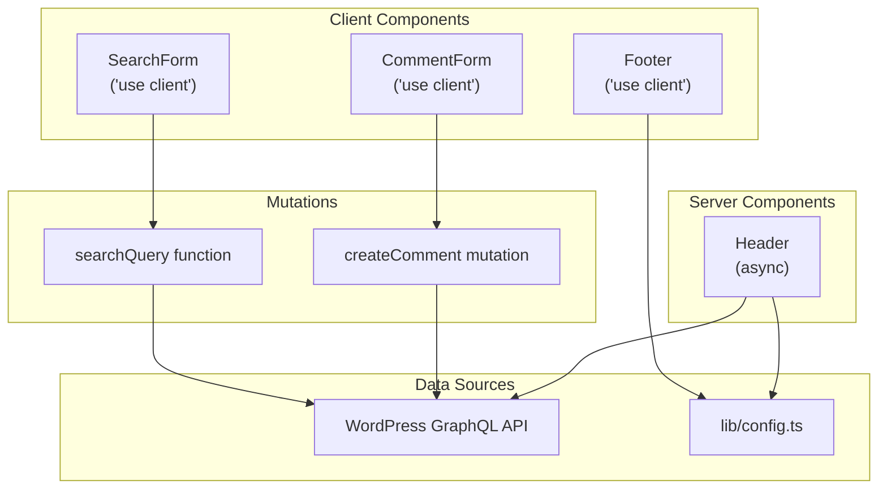
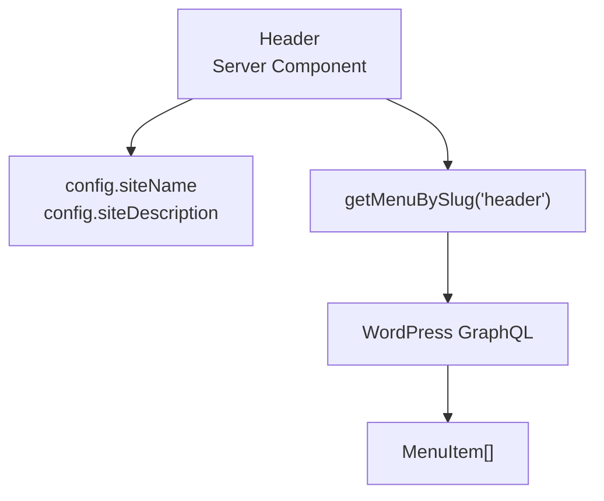
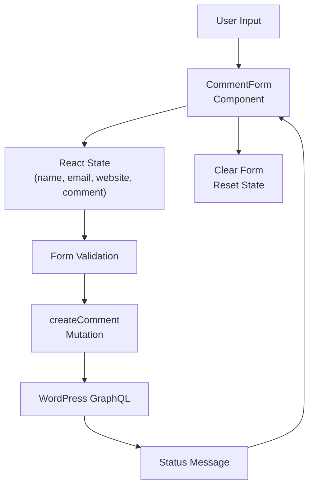
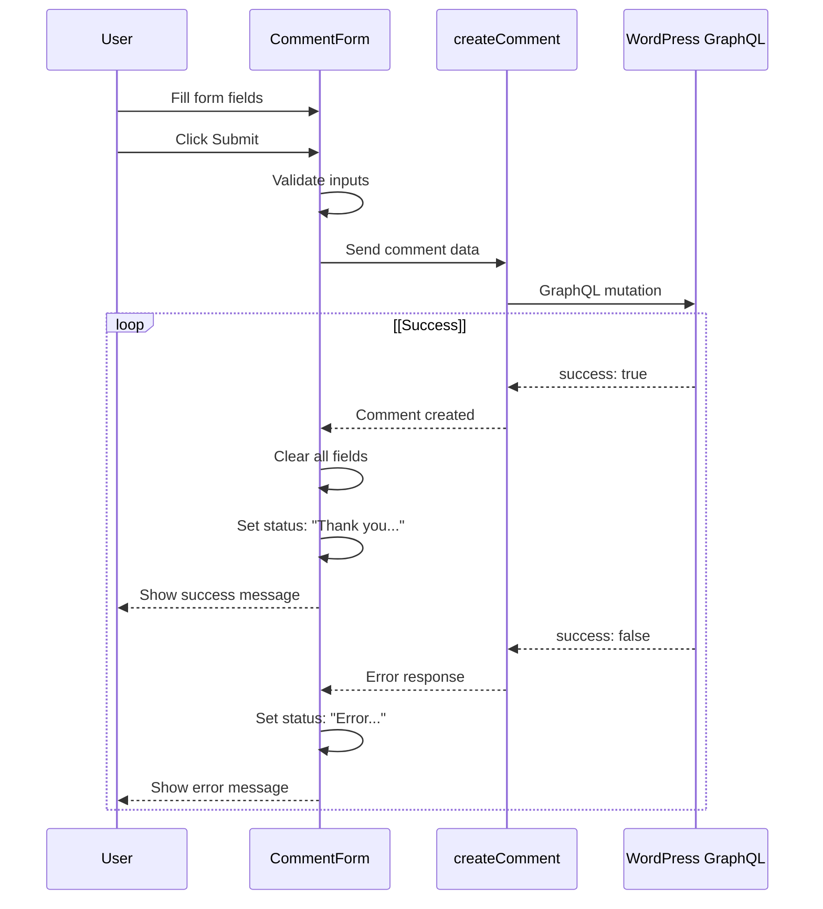
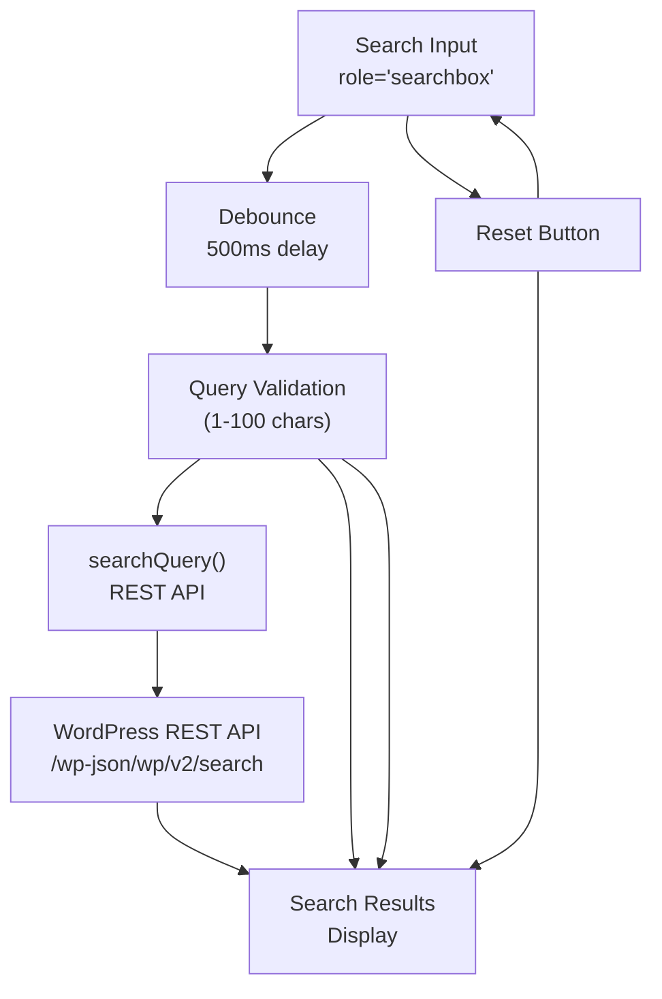
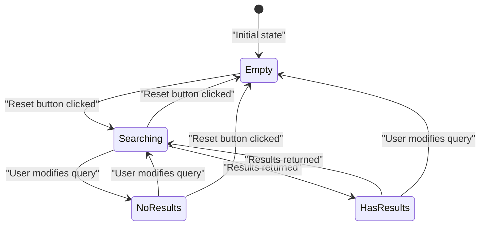

# Components

> **Relevant source files**
> * [AGENTS.md](https://github.com/gregrickaby/nextjs-wordpress/blob/63f3f2f5/AGENTS.md)
> * [CONTRIBUTING.md](https://github.com/gregrickaby/nextjs-wordpress/blob/63f3f2f5/CONTRIBUTING.md)
> * [README.md](https://github.com/gregrickaby/nextjs-wordpress/blob/63f3f2f5/README.md)
> * app/blog/[slug]/page.tsx
> * app/books/[slug]/page.tsx
> * [app/layout.tsx](https://github.com/gregrickaby/nextjs-wordpress/blob/63f3f2f5/app/layout.tsx)
> * [components/CommentForm.test.tsx](https://github.com/gregrickaby/nextjs-wordpress/blob/63f3f2f5/components/CommentForm.test.tsx)
> * [components/CommentForm.tsx](https://github.com/gregrickaby/nextjs-wordpress/blob/63f3f2f5/components/CommentForm.tsx)
> * [components/Footer.test.tsx](https://github.com/gregrickaby/nextjs-wordpress/blob/63f3f2f5/components/Footer.test.tsx)
> * [components/Footer.tsx](https://github.com/gregrickaby/nextjs-wordpress/blob/63f3f2f5/components/Footer.tsx)
> * [components/Header.test.tsx](https://github.com/gregrickaby/nextjs-wordpress/blob/63f3f2f5/components/Header.test.tsx)
> * [components/Header.tsx](https://github.com/gregrickaby/nextjs-wordpress/blob/63f3f2f5/components/Header.tsx)
> * [components/SearchForm.test.tsx](https://github.com/gregrickaby/nextjs-wordpress/blob/63f3f2f5/components/SearchForm.test.tsx)
> * [lib/functions.test.ts](https://github.com/gregrickaby/nextjs-wordpress/blob/63f3f2f5/lib/functions.test.ts)
> * [lib/mutations/createComment.ts](https://github.com/gregrickaby/nextjs-wordpress/blob/63f3f2f5/lib/mutations/createComment.ts)
> * [lib/queries/getAllPosts.test.ts](https://github.com/gregrickaby/nextjs-wordpress/blob/63f3f2f5/lib/queries/getAllPosts.test.ts)
> * [lib/queries/getPostBySlug.test.ts](https://github.com/gregrickaby/nextjs-wordpress/blob/63f3f2f5/lib/queries/getPostBySlug.test.ts)
> * [next.config.ts](https://github.com/gregrickaby/nextjs-wordpress/blob/63f3f2f5/next.config.ts)
> * [test-utils/domShims.ts](https://github.com/gregrickaby/nextjs-wordpress/blob/63f3f2f5/test-utils/domShims.ts)
> * [vitest.config.ts](https://github.com/gregrickaby/nextjs-wordpress/blob/63f3f2f5/vitest.config.ts)

This document describes the reusable React components in the Next.js WordPress application, including their props, usage patterns, and implementation details. All components are located in the [components/](https://github.com/gregrickaby/nextjs-wordpress/blob/63f3f2f5/components/)

 directory and follow Next.js 16 patterns with the App Router.

For information about page-level components and routing, see [Pages and Routing](/gregrickaby/nextjs-wordpress/4.1-pages-and-routing). For layout components and metadata generation, see [Layouts and Metadata](/gregrickaby/nextjs-wordpress/4.3-layouts-and-metadata).

---

## Overview

The application uses a minimal set of focused components that leverage Next.js 16's Server Components by default, with Client Components only where interactivity is required. The architecture prioritizes server-side rendering for performance and SEO, while maintaining client-side interactivity where necessary for forms and user input.

**Component Architecture:**



**Sources:** [components/Header.tsx L1-L30](https://github.com/gregrickaby/nextjs-wordpress/blob/63f3f2f5/components/Header.tsx#L1-L30)

 [components/Footer.tsx L1-L17](https://github.com/gregrickaby/nextjs-wordpress/blob/63f3f2f5/components/Footer.tsx#L1-L17)

 [components/CommentForm.tsx L1-L110](https://github.com/gregrickaby/nextjs-wordpress/blob/63f3f2f5/components/CommentForm.tsx#L1-L110)

 [components/SearchForm.test.tsx L1-L236](https://github.com/gregrickaby/nextjs-wordpress/blob/63f3f2f5/components/SearchForm.test.tsx#L1-L236)

---

## Component Types

### Server Components

Server Components render on the server and do not include client-side JavaScript. They can directly access backend resources like databases and APIs without exposing credentials to the client.

**Characteristics:**

* Can be `async` functions
* Can use `await` for data fetching
* Cannot use React hooks (`useState`, `useEffect`, etc.)
* Cannot use browser APIs or event handlers
* Default behavior in Next.js 16 App Router

**When to Use:**

* Fetching data from WordPress
* Rendering static content
* SEO-critical content
* Large dependencies that don't need client-side execution

### Client Components

Client Components execute in the browser and enable interactivity. They are marked with the `'use client'` directive at the top of the file.

**Characteristics:**

* Must include `'use client'` directive
* Can use React hooks and browser APIs
* Can handle user interactions (click, input, etc.)
* Bundle JavaScript to the client
* Cannot be `async` functions

**When to Use:**

* Form handling and validation
* User input with immediate feedback
* Interactive UI elements (dropdowns, modals, etc.)
* Browser APIs (localStorage, geolocation, etc.)
* Real-time updates

---

## Component Directory

| Component | Type | File | Purpose |
| --- | --- | --- | --- |
| Header | Server | [components/Header.tsx](https://github.com/gregrickaby/nextjs-wordpress/blob/63f3f2f5/components/Header.tsx) | Site header with navigation menu from WordPress |
| Footer | Client | [components/Footer.tsx](https://github.com/gregrickaby/nextjs-wordpress/blob/63f3f2f5/components/Footer.tsx) | Site footer with copyright and links |
| CommentForm | Client | [components/CommentForm.tsx](https://github.com/gregrickaby/nextjs-wordpress/blob/63f3f2f5/components/CommentForm.tsx) | Form for submitting comments on posts |
| SearchForm | Client | [components/SearchForm.tsx](https://github.com/gregrickaby/nextjs-wordpress/blob/63f3f2f5/components/SearchForm.tsx) | Search input with debounced WordPress search |

**Sources:** [components/Header.tsx L1-L30](https://github.com/gregrickaby/nextjs-wordpress/blob/63f3f2f5/components/Header.tsx#L1-L30)

 [components/Footer.tsx L1-L17](https://github.com/gregrickaby/nextjs-wordpress/blob/63f3f2f5/components/Footer.tsx#L1-L17)

 [components/CommentForm.tsx L1-L110](https://github.com/gregrickaby/nextjs-wordpress/blob/63f3f2f5/components/CommentForm.tsx#L1-L110)

 [components/SearchForm.test.tsx L1-L236](https://github.com/gregrickaby/nextjs-wordpress/blob/63f3f2f5/components/SearchForm.test.tsx#L1-L236)

---

## Header Component

The `Header` component is an async Server Component that renders the site header with branding and a navigation menu fetched from WordPress.

### Implementation



**File Location:** [components/Header.tsx L1-L30](https://github.com/gregrickaby/nextjs-wordpress/blob/63f3f2f5/components/Header.tsx#L1-L30)

### Data Fetching

The component fetches the navigation menu at render time:

```javascript
const menu = await getMenuBySlug('header')
```

**Menu Query:** [lib/queries/getMenuBySlug.ts](https://github.com/gregrickaby/nextjs-wordpress/blob/63f3f2f5/lib/queries/getMenuBySlug.ts)

### Props

The `Header` component accepts no props.

### Structure

| Element | Content |
| --- | --- |
| **Site Title** | `config.siteName` from [lib/config.ts](https://github.com/gregrickaby/nextjs-wordpress/blob/63f3f2f5/lib/config.ts) |
| **Site Description** | `config.siteDescription` from [lib/config.ts](https://github.com/gregrickaby/nextjs-wordpress/blob/63f3f2f5/lib/config.ts) |
| **Navigation** | Menu items from WordPress with label and URI |

### Null Safety

The component checks for menu existence before rendering:

```javascript
{!!menu && menu.menuItems?.edges?.map((item: {node: MenuItem}) => (...))}
```

Uses nullish coalescing for menu item properties: [components/Header.tsx L22-L23](https://github.com/gregrickaby/nextjs-wordpress/blob/63f3f2f5/components/Header.tsx#L22-L23)

### Usage

The `Header` component is used in the root layout wrapped in a Suspense boundary:

```xml
<Suspense fallback={null}>
  <Header />
</Suspense>
```

**Layout Location:** [app/layout.tsx L30-L32](https://github.com/gregrickaby/nextjs-wordpress/blob/63f3f2f5/app/layout.tsx#L30-L32)

### Testing

Component tests verify:

* Rendering with site branding
* Accessibility compliance (WCAG 2.1 AA)
* Async Server Component handling

**Test File:** [components/Header.test.tsx L1-L49](https://github.com/gregrickaby/nextjs-wordpress/blob/63f3f2f5/components/Header.test.tsx#L1-L49)

**Sources:** [components/Header.tsx L1-L30](https://github.com/gregrickaby/nextjs-wordpress/blob/63f3f2f5/components/Header.tsx#L1-L30)

 [components/Header.test.tsx L1-L49](https://github.com/gregrickaby/nextjs-wordpress/blob/63f3f2f5/components/Header.test.tsx#L1-L49)

 [app/layout.tsx L30-L32](https://github.com/gregrickaby/nextjs-wordpress/blob/63f3f2f5/app/layout.tsx#L30-L32)

---

## Footer Component

The `Footer` component is a Client Component that renders the site footer with copyright information and external links.

### Implementation

**File Location:** [components/Footer.tsx L1-L17](https://github.com/gregrickaby/nextjs-wordpress/blob/63f3f2f5/components/Footer.tsx#L1-L17)

**Component Type:** Client Component (uses `'use client'` directive)

### Props

The `Footer` component accepts no props.

### Content

| Element | Source |
| --- | --- |
| **Copyright Year** | Dynamic: `new Date().getFullYear()` |
| **Site Name** | `config.siteName` from [lib/config.ts](https://github.com/gregrickaby/nextjs-wordpress/blob/63f3f2f5/lib/config.ts) |
| **External Links** | Hardcoded links to Greg Rickaby's site and GitHub repo |

### Why Client Component?

The `Footer` is marked as a Client Component to calculate the current year dynamically on the client side using `new Date().getFullYear()`. While this could be done server-side, the client-side approach ensures the year updates without re-deploying.

### Styling

The footer uses Tailwind CSS classes:

* `border-t-2` - Top border
* `p-8` - Padding
* `text-center` - Centered text
* `text-sm` - Small font size

**CSS Location:** [components/Footer.tsx L10](https://github.com/gregrickaby/nextjs-wordpress/blob/63f3f2f5/components/Footer.tsx#L10-L10)

### Usage

The `Footer` component is used in the root layout wrapped in a Suspense boundary:

```xml
<Suspense fallback={null}>
  <Footer />
</Suspense>
```

**Layout Location:** [app/layout.tsx L34-L36](https://github.com/gregrickaby/nextjs-wordpress/blob/63f3f2f5/app/layout.tsx#L34-L36)

### Testing

Component tests verify:

* Footer element renders with `contentinfo` role
* Accessibility compliance (WCAG 2.1 AA)

**Test File:** [components/Footer.test.tsx L1-L20](https://github.com/gregrickaby/nextjs-wordpress/blob/63f3f2f5/components/Footer.test.tsx#L1-L20)

**Sources:** [components/Footer.tsx L1-L17](https://github.com/gregrickaby/nextjs-wordpress/blob/63f3f2f5/components/Footer.tsx#L1-L17)

 [components/Footer.test.tsx L1-L20](https://github.com/gregrickaby/nextjs-wordpress/blob/63f3f2f5/components/Footer.test.tsx#L1-L20)

 [app/layout.tsx L34-L36](https://github.com/gregrickaby/nextjs-wordpress/blob/63f3f2f5/app/layout.tsx#L34-L36)

---

## CommentForm Component

The `CommentForm` component is a Client Component that provides an interactive form for users to submit comments on WordPress posts.

### Component Flow



**File Location:** [components/CommentForm.tsx L1-L110](https://github.com/gregrickaby/nextjs-wordpress/blob/63f3f2f5/components/CommentForm.tsx#L1-L110)

### Props

| Prop | Type | Required | Description |
| --- | --- | --- | --- |
| `postID` | `string` | Yes | WordPress post database ID for comment association |

**Props Definition:** [components/CommentForm.tsx L9](https://github.com/gregrickaby/nextjs-wordpress/blob/63f3f2f5/components/CommentForm.tsx#L9-L9)

### State Management

The component manages five pieces of state using `useState`:

| State Variable | Type | Purpose |
| --- | --- | --- |
| `name` | `string` | Commenter's name |
| `email` | `string` | Commenter's email address |
| `website` | `string` | Commenter's website URL |
| `comment` | `string` | Comment content |
| `status` | `string` | Success/error message display |

**State Declarations:** [components/CommentForm.tsx L10-L14](https://github.com/gregrickaby/nextjs-wordpress/blob/63f3f2f5/components/CommentForm.tsx#L10-L14)

### Form Fields

#### Name Field

* **Type:** `text`
* **Validation:** Required
* **Element:** [components/CommentForm.tsx L65-L72](https://github.com/gregrickaby/nextjs-wordpress/blob/63f3f2f5/components/CommentForm.tsx#L65-L72)

#### Email Field

* **Type:** `email`
* **Validation:** Required, email pattern `[a-z0-9._%+-]+@[a-z0-9.-]+\.[a-z]{2,4}$`
* **Element:** [components/CommentForm.tsx L74-L83](https://github.com/gregrickaby/nextjs-wordpress/blob/63f3f2f5/components/CommentForm.tsx#L74-L83)

#### Website Field

* **Type:** `url`
* **Validation:** Required, valid URL format
* **Element:** [components/CommentForm.tsx L85-L93](https://github.com/gregrickaby/nextjs-wordpress/blob/63f3f2f5/components/CommentForm.tsx#L85-L93)

#### Comment Field

* **Type:** `textarea`
* **Validation:** Required
* **Element:** [components/CommentForm.tsx L95-L103](https://github.com/gregrickaby/nextjs-wordpress/blob/63f3f2f5/components/CommentForm.tsx#L95-L103)

### Submission Workflow



**Submission Handler:** [components/CommentForm.tsx L19-L58](https://github.com/gregrickaby/nextjs-wordpress/blob/63f3f2f5/components/CommentForm.tsx#L19-L58)

### Comment Creation

The form calls the `createComment` mutation with the following parameters:

```
await createComment({
  name,
  email,
  website,
  comment,
  postID
})
```

**Mutation Function:** [lib/mutations/createComment.ts L6-L64](https://github.com/gregrickaby/nextjs-wordpress/blob/63f3f2f5/lib/mutations/createComment.ts#L6-L64)

### Success Behavior

On successful submission:

1. All form fields are cleared
2. Status message displays: `"Thank you {name}! Your comment has been submitted and is awaiting moderation."`
3. Form state is reset to empty values

**Success Handler:** [components/CommentForm.tsx L33-L43](https://github.com/gregrickaby/nextjs-wordpress/blob/63f3f2f5/components/CommentForm.tsx#L33-L43)

### Error Handling

The component handles three error scenarios:

| Error Type | Condition | Message |
| --- | --- | --- |
| **Submission Error** | `status.success === false` | "There was an error submitting your comment: {message}" |
| **Mutation Exception** | `catch` block triggered | "There was an error submitting your comment. Please try again later." |
| **Null Response** | `!response?.data?.createComment` | Thrown by mutation as Error |

**Error Handler:** [components/CommentForm.tsx L46-L57](https://github.com/gregrickaby/nextjs-wordpress/blob/63f3f2f5/components/CommentForm.tsx#L46-L57)

### Usage

The `CommentForm` is used on individual post pages, passing the post's database ID:

```
<CommentForm postID={post.databaseId.toString()} />
```

**Usage Location:** app/blog/[slug]/page.tsx:137

### Testing

Component tests verify:

* Form field rendering and validation
* User input handling
* Successful submission and form clearing
* Error state display
* Required field validation
* Email and URL format validation
* Accessibility compliance

**Test File:** [components/CommentForm.test.tsx L1-L257](https://github.com/gregrickaby/nextjs-wordpress/blob/63f3f2f5/components/CommentForm.test.tsx#L1-L257)

**Test Patterns:**

* Uses `user` from `@/test-utils` for interactions: [components/CommentForm.test.tsx L27-L29](https://github.com/gregrickaby/nextjs-wordpress/blob/63f3f2f5/components/CommentForm.test.tsx#L27-L29)
* MSW v2 for mocking GraphQL mutations: [components/CommentForm.test.tsx L38-L60](https://github.com/gregrickaby/nextjs-wordpress/blob/63f3f2f5/components/CommentForm.test.tsx#L38-L60)
* Accessibility validation with jest-axe: [components/CommentForm.test.tsx L251-L255](https://github.com/gregrickaby/nextjs-wordpress/blob/63f3f2f5/components/CommentForm.test.tsx#L251-L255)

**Sources:** [components/CommentForm.tsx L1-L110](https://github.com/gregrickaby/nextjs-wordpress/blob/63f3f2f5/components/CommentForm.tsx#L1-L110)

 [components/CommentForm.test.tsx L1-L257](https://github.com/gregrickaby/nextjs-wordpress/blob/63f3f2f5/components/CommentForm.test.tsx#L1-L257)

 [lib/mutations/createComment.ts L1-L65](https://github.com/gregrickaby/nextjs-wordpress/blob/63f3f2f5/lib/mutations/createComment.ts#L1-L65)

 app/blog/[slug]/page.tsx:137

---

## SearchForm Component

The `SearchForm` component is a Client Component that provides a debounced search interface for querying WordPress content via the REST API.

### Implementation Details

**File Location:** [components/SearchForm.tsx](https://github.com/gregrickaby/nextjs-wordpress/blob/63f3f2f5/components/SearchForm.tsx)

 (inferred from tests)

**Component Type:** Client Component (requires `'use client'` directive for input handling)

### Search Architecture



**Sources:** [components/SearchForm.test.tsx L1-L236](https://github.com/gregrickaby/nextjs-wordpress/blob/63f3f2f5/components/SearchForm.test.tsx#L1-L236)

 [lib/functions.ts](https://github.com/gregrickaby/nextjs-wordpress/blob/63f3f2f5/lib/functions.ts)

### Features

| Feature | Implementation | Test Reference |
| --- | --- | --- |
| **Debouncing** | 500ms delay after user stops typing | [components/SearchForm.test.tsx L26-L42](https://github.com/gregrickaby/nextjs-wordpress/blob/63f3f2f5/components/SearchForm.test.tsx#L26-L42) |
| **Query Validation** | Minimum 1 character, maximum 100 characters | [components/SearchForm.test.tsx L177-L190](https://github.com/gregrickaby/nextjs-wordpress/blob/63f3f2f5/components/SearchForm.test.tsx#L177-L190) |
| **Empty Query Handling** | No search performed for empty input | [components/SearchForm.test.tsx L161-L175](https://github.com/gregrickaby/nextjs-wordpress/blob/63f3f2f5/components/SearchForm.test.tsx#L161-L175) |
| **Reset Functionality** | Button to clear input and results | [components/SearchForm.test.tsx L44-L59](https://github.com/gregrickaby/nextjs-wordpress/blob/63f3f2f5/components/SearchForm.test.tsx#L44-L59) |
| **Result Display** | Shows count and clickable result links | [components/SearchForm.test.tsx L97-L138](https://github.com/gregrickaby/nextjs-wordpress/blob/63f3f2f5/components/SearchForm.test.tsx#L97-L138) |

### State Management

Based on test assertions, the component manages:

| State | Purpose |
| --- | --- |
| Search query | User input value |
| Search results | Array of result objects |
| Loading state | "Searching..." indicator |
| Results count | Number of results found |

### Result States



**Sources:** [components/SearchForm.test.tsx L61-L95](https://github.com/gregrickaby/nextjs-wordpress/blob/63f3f2f5/components/SearchForm.test.tsx#L61-L95)

### Display Messages

| State | Message | Test Reference |
| --- | --- | --- |
| **Searching** | "Searching..." or similar | [components/SearchForm.test.tsx L61-L76](https://github.com/gregrickaby/nextjs-wordpress/blob/63f3f2f5/components/SearchForm.test.tsx#L61-L76) |
| **No Results** | "No results found" | [components/SearchForm.test.tsx L78-L95](https://github.com/gregrickaby/nextjs-wordpress/blob/63f3f2f5/components/SearchForm.test.tsx#L78-L95) |
| **Has Results** | "Nice! You found {count} result(s)." | [components/SearchForm.test.tsx L97-L138](https://github.com/gregrickaby/nextjs-wordpress/blob/63f3f2f5/components/SearchForm.test.tsx#L97-L138) |

### Search Query Function

The component calls the `searchQuery` function from [lib/functions.ts](https://github.com/gregrickaby/nextjs-wordpress/blob/63f3f2f5/lib/functions.ts)

 which queries the WordPress REST API:

**Endpoint:** `${NEXT_PUBLIC_WORDPRESS_REST_API_URL}/search`

**Query Parameter:** `search={query}`

**Response Structure:**

```yaml
interface SearchResult {
  id: number
  title: string
  url: string
  type: string
  subtype: string
}
```

**Search Function Tests:** [lib/functions.test.ts L137-L273](https://github.com/gregrickaby/nextjs-wordpress/blob/63f3f2f5/lib/functions.test.ts#L137-L273)

### Error Handling

The component handles errors gracefully by:

1. Catching API errors: [components/SearchForm.test.tsx L140-L159](https://github.com/gregrickaby/nextjs-wordpress/blob/63f3f2f5/components/SearchForm.test.tsx#L140-L159)
2. Logging errors to console
3. Preventing user-facing error display (fails silently)

### Accessibility

The search input uses the `searchbox` role for screen reader compatibility:

**Test Verification:** [components/SearchForm.test.tsx L13-L15](https://github.com/gregrickaby/nextjs-wordpress/blob/63f3f2f5/components/SearchForm.test.tsx#L13-L15)

 [components/SearchForm.test.tsx L230-L234](https://github.com/gregrickaby/nextjs-wordpress/blob/63f3f2f5/components/SearchForm.test.tsx#L230-L234)

### Testing

Component tests verify:

* Search input rendering
* User input handling
* Debouncing behavior
* Reset functionality
* Result display with count
* Empty query handling
* Maximum query length validation
* Error handling
* Accessibility compliance (WCAG 2.1 AA)

**Test File:** [components/SearchForm.test.tsx L1-L236](https://github.com/gregrickaby/nextjs-wordpress/blob/63f3f2f5/components/SearchForm.test.tsx#L1-L236)

**Test Utilities:**

* Uses `user` from `@/test-utils`: [components/SearchForm.test.tsx L2](https://github.com/gregrickaby/nextjs-wordpress/blob/63f3f2f5/components/SearchForm.test.tsx#L2-L2)
* MSW v2 not needed (uses `global.fetch` mock in tests)
* jest-axe for accessibility: [components/SearchForm.test.tsx L230-L234](https://github.com/gregrickaby/nextjs-wordpress/blob/63f3f2f5/components/SearchForm.test.tsx#L230-L234)

**Sources:** [components/SearchForm.test.tsx L1-L236](https://github.com/gregrickaby/nextjs-wordpress/blob/63f3f2f5/components/SearchForm.test.tsx#L1-L236)

 [lib/functions.test.ts L137-L273](https://github.com/gregrickaby/nextjs-wordpress/blob/63f3f2f5/lib/functions.test.ts#L137-L273)

---

## Component Usage Patterns

### Server Component Pattern

```javascript
// ✅ CORRECT - Async Server Component
export default async function MyServerComponent() {
  const data = await fetchFromWordPress()
  
  return (
    <div>
      {data.map(item => (
        <article key={item.id}>{item.title}</article>
      ))}
    </div>
  )
}
```

**Example:** [components/Header.tsx L9-L29](https://github.com/gregrickaby/nextjs-wordpress/blob/63f3f2f5/components/Header.tsx#L9-L29)

### Client Component Pattern

```javascript
// ✅ CORRECT - Client Component with 'use client' directive
'use client'

import {useState} from 'react'

export default function MyClientComponent() {
  const [value, setValue] = useState('')
  
  return (
    <input 
      value={value}
      onChange={(e) => setValue(e.target.value)}
    />
  )
}
```

**Examples:** [components/Footer.tsx L1-L17](https://github.com/gregrickaby/nextjs-wordpress/blob/63f3f2f5/components/Footer.tsx#L1-L17)

 [components/CommentForm.tsx L1-L110](https://github.com/gregrickaby/nextjs-wordpress/blob/63f3f2f5/components/CommentForm.tsx#L1-L110)

### Component Integration in Pages

```javascript
// Page component (Server Component)
export default async function Page() {
  const data = await fetchData()
  
  return (
    <main>
      {/* Server Component content */}
      <article>{data.content}</article>
      
      {/* Client Component for interactivity */}
      <CommentForm postID={data.id.toString()} />
    </main>
  )
}
```

**Example:** app/blog/[slug]/page.tsx:63-140

### Suspense Boundaries

Components that fetch data should be wrapped in Suspense boundaries in the layout:

```xml
<Suspense fallback={null}>
  <Header />
</Suspense>
```

**Layout Implementation:** [app/layout.tsx L30-L36](https://github.com/gregrickaby/nextjs-wordpress/blob/63f3f2f5/app/layout.tsx#L30-L36)

**Sources:** [components/Header.tsx L9-L29](https://github.com/gregrickaby/nextjs-wordpress/blob/63f3f2f5/components/Header.tsx#L9-L29)

 [components/Footer.tsx L1-L17](https://github.com/gregrickaby/nextjs-wordpress/blob/63f3f2f5/components/Footer.tsx#L1-L17)

 [components/CommentForm.tsx L1-L110](https://github.com/gregrickaby/nextjs-wordpress/blob/63f3f2f5/components/CommentForm.tsx#L1-L110)

 app/blog/[slug]/page.tsx:63-140, [app/layout.tsx L30-L36](https://github.com/gregrickaby/nextjs-wordpress/blob/63f3f2f5/app/layout.tsx#L30-L36)

---

## Testing Components

### Test File Locations

Component tests are co-located with their source files:

| Component | Test File |
| --- | --- |
| Header | [components/Header.test.tsx](https://github.com/gregrickaby/nextjs-wordpress/blob/63f3f2f5/components/Header.test.tsx) |
| Footer | [components/Footer.test.tsx](https://github.com/gregrickaby/nextjs-wordpress/blob/63f3f2f5/components/Footer.test.tsx) |
| CommentForm | [components/CommentForm.test.tsx](https://github.com/gregrickaby/nextjs-wordpress/blob/63f3f2f5/components/CommentForm.test.tsx) |
| SearchForm | [components/SearchForm.test.tsx](https://github.com/gregrickaby/nextjs-wordpress/blob/63f3f2f5/components/SearchForm.test.tsx) |

### Test Utilities

**Critical:** Always import from `@/test-utils`, never directly from libraries.

```javascript
// ✅ CORRECT
import {render, screen, user, server} from '@/test-utils'

// ❌ WRONG
import {render, screen} from '@testing-library/react'
```

**Test Utilities Configuration:** [test-utils/index.ts](https://github.com/gregrickaby/nextjs-wordpress/blob/63f3f2f5/test-utils/index.ts)

### Component Test Pattern

```javascript
import {render, screen, user} from '@/test-utils'
import {axe} from 'jest-axe'
import MyComponent from './MyComponent'

describe('MyComponent', () => {
  it('should render component', () => {
    render(<MyComponent />)
    expect(screen.getByRole('button')).toBeInTheDocument()
  })
  
  it('should handle user interaction', async () => {
    render(<MyComponent />)
    await user.click(screen.getByRole('button'))
    expect(screen.getByText('Success')).toBeInTheDocument()
  })
  
  it('should have no accessibility violations', async () => {
    const {container} = render(<MyComponent />)
    const results = await axe(container)
    expect(results).toHaveNoViolations()
  })
})
```

**Example:** [components/Footer.test.tsx L5-L19](https://github.com/gregrickaby/nextjs-wordpress/blob/63f3f2f5/components/Footer.test.tsx#L5-L19)

### Server Component Testing

Async Server Components must be awaited before rendering:

```javascript
it('should render async Server Component', async () => {
  // Server Components are async - must await
  const HeaderComponent = await Header()
  const {container} = render(HeaderComponent)
  
  expect(container).toBeInTheDocument()
})
```

**Example:** [components/Header.test.tsx L32-L40](https://github.com/gregrickaby/nextjs-wordpress/blob/63f3f2f5/components/Header.test.tsx#L32-L40)

### MSW v2 for API Mocking

Use MSW v2 to mock GraphQL mutations in component tests:

```javascript
import {server, http, HttpResponse} from '@/test-utils'

it('should submit form successfully', async () => {
  server.use(
    http.post(process.env.NEXT_PUBLIC_WORDPRESS_GRAPHQL_URL, () => {
      return HttpResponse.json({
        data: {createComment: {success: true}}
      })
    })
  )
  
  // Test form submission...
})
```

**Example:** [components/CommentForm.test.tsx L37-L60](https://github.com/gregrickaby/nextjs-wordpress/blob/63f3f2f5/components/CommentForm.test.tsx#L37-L60)

### Accessibility Testing

All components must pass WCAG 2.1 AA accessibility standards:

```javascript
it('should have no accessibility violations', async () => {
  const {container} = render(<MyComponent />)
  const results = await axe(container)
  expect(results).toHaveNoViolations()
})
```

**Examples:** [components/Header.test.tsx L42-L47](https://github.com/gregrickaby/nextjs-wordpress/blob/63f3f2f5/components/Header.test.tsx#L42-L47)

 [components/Footer.test.tsx L14-L18](https://github.com/gregrickaby/nextjs-wordpress/blob/63f3f2f5/components/Footer.test.tsx#L14-L18)

 [components/CommentForm.test.tsx L251-L255](https://github.com/gregrickaby/nextjs-wordpress/blob/63f3f2f5/components/CommentForm.test.tsx#L251-L255)

 [components/SearchForm.test.tsx L230-L234](https://github.com/gregrickaby/nextjs-wordpress/blob/63f3f2f5/components/SearchForm.test.tsx#L230-L234)

**Sources:** [components/Header.test.tsx L1-L49](https://github.com/gregrickaby/nextjs-wordpress/blob/63f3f2f5/components/Header.test.tsx#L1-L49)

 [components/Footer.test.tsx L1-L20](https://github.com/gregrickaby/nextjs-wordpress/blob/63f3f2f5/components/Footer.test.tsx#L1-L20)

 [components/CommentForm.test.tsx L1-L257](https://github.com/gregrickaby/nextjs-wordpress/blob/63f3f2f5/components/CommentForm.test.tsx#L1-L257)

 [components/SearchForm.test.tsx L1-L236](https://github.com/gregrickaby/nextjs-wordpress/blob/63f3f2f5/components/SearchForm.test.tsx#L1-L236)

 [test-utils/index.ts](https://github.com/gregrickaby/nextjs-wordpress/blob/63f3f2f5/test-utils/index.ts)

---

## Component File Structure

```markdown
components/
├── CommentForm.tsx         # Client Component - Comment submission form
├── CommentForm.test.tsx    # Component tests with MSW v2 mocking
├── Footer.tsx              # Client Component - Site footer
├── Footer.test.tsx         # Component tests with accessibility
├── Header.tsx              # Server Component - Site header with menu
├── Header.test.tsx         # Async Server Component tests
├── SearchForm.tsx          # Client Component - Debounced search
└── SearchForm.test.tsx     # Component tests with fetch mocking
```

**Key Points:**

* Test files are co-located with components
* Tests use `@/test-utils` for consistent setup
* All components have accessibility tests with jest-axe
* Server Components are async and require `await` in tests
* Client Components use `'use client'` directive

**Sources:** [components/Header.tsx L1-L30](https://github.com/gregrickaby/nextjs-wordpress/blob/63f3f2f5/components/Header.tsx#L1-L30)

 [components/Footer.tsx L1-L17](https://github.com/gregrickaby/nextjs-wordpress/blob/63f3f2f5/components/Footer.tsx#L1-L17)

 [components/CommentForm.tsx L1-L110](https://github.com/gregrickaby/nextjs-wordpress/blob/63f3f2f5/components/CommentForm.tsx#L1-L110)

 [components/Header.test.tsx L1-L49](https://github.com/gregrickaby/nextjs-wordpress/blob/63f3f2f5/components/Header.test.tsx#L1-L49)

 [components/Footer.test.tsx L1-L20](https://github.com/gregrickaby/nextjs-wordpress/blob/63f3f2f5/components/Footer.test.tsx#L1-L20)

 [components/CommentForm.test.tsx L1-L257](https://github.com/gregrickaby/nextjs-wordpress/blob/63f3f2f5/components/CommentForm.test.tsx#L1-L257)

 [components/SearchForm.test.tsx L1-L236](https://github.com/gregrickaby/nextjs-wordpress/blob/63f3f2f5/components/SearchForm.test.tsx#L1-L236)