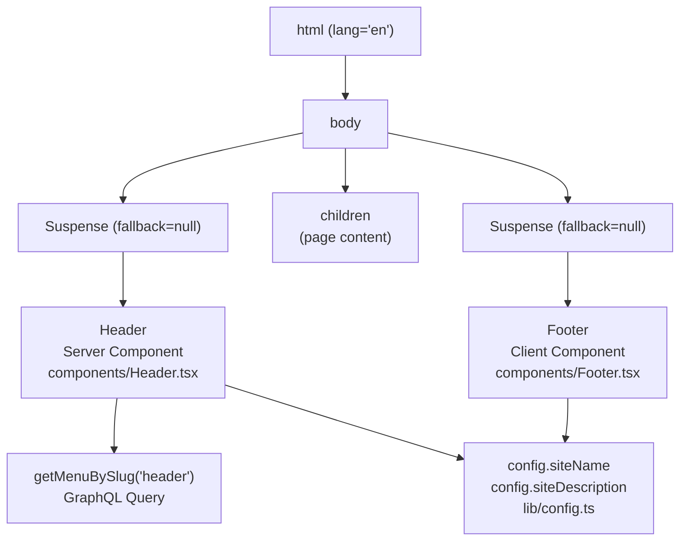
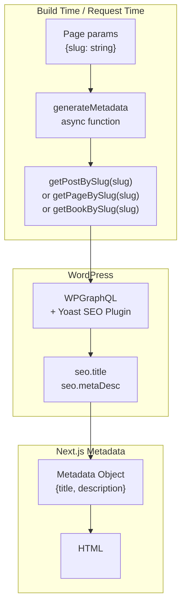
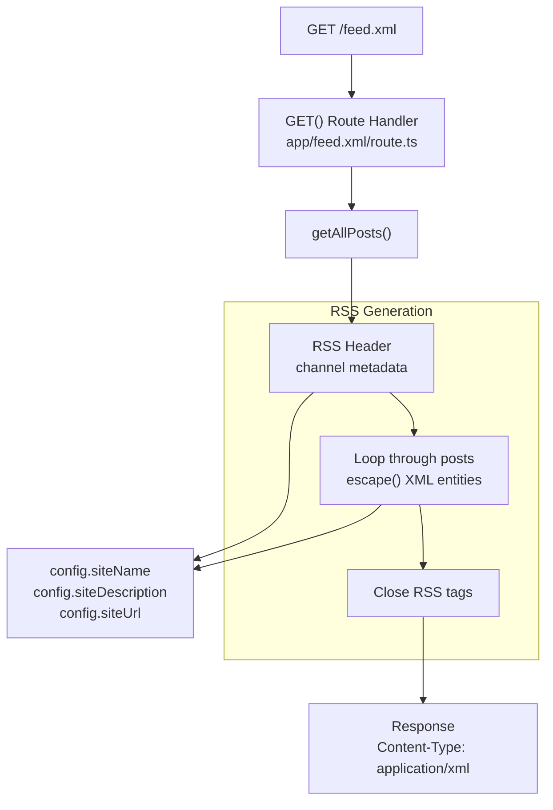
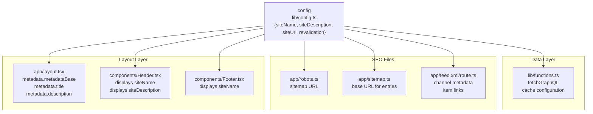

# Layouts and Metadata

> **Relevant source files**
> * [AGENTS.md](https://github.com/gregrickaby/nextjs-wordpress/blob/63f3f2f5/AGENTS.md)
> * [CONTRIBUTING.md](https://github.com/gregrickaby/nextjs-wordpress/blob/63f3f2f5/CONTRIBUTING.md)
> * [README.md](https://github.com/gregrickaby/nextjs-wordpress/blob/63f3f2f5/README.md)
> * app/blog/[slug]/page.tsx
> * app/books/[slug]/page.tsx
> * [app/feed.xml/route.ts](https://github.com/gregrickaby/nextjs-wordpress/blob/63f3f2f5/app/feed.xml/route.ts)
> * [app/layout.tsx](https://github.com/gregrickaby/nextjs-wordpress/blob/63f3f2f5/app/layout.tsx)
> * [app/robots.ts](https://github.com/gregrickaby/nextjs-wordpress/blob/63f3f2f5/app/robots.ts)
> * [app/sitemap.ts](https://github.com/gregrickaby/nextjs-wordpress/blob/63f3f2f5/app/sitemap.ts)
> * [codegen.ts](https://github.com/gregrickaby/nextjs-wordpress/blob/63f3f2f5/codegen.ts)
> * [components/CommentForm.tsx](https://github.com/gregrickaby/nextjs-wordpress/blob/63f3f2f5/components/CommentForm.tsx)
> * [components/Footer.tsx](https://github.com/gregrickaby/nextjs-wordpress/blob/63f3f2f5/components/Footer.tsx)
> * [components/Header.tsx](https://github.com/gregrickaby/nextjs-wordpress/blob/63f3f2f5/components/Header.tsx)
> * [lib/mutations/createComment.ts](https://github.com/gregrickaby/nextjs-wordpress/blob/63f3f2f5/lib/mutations/createComment.ts)
> * [next.config.ts](https://github.com/gregrickaby/nextjs-wordpress/blob/63f3f2f5/next.config.ts)

## Purpose and Scope

This document explains the layout structure and metadata generation system in the Next.js WordPress application. It covers the `RootLayout` component, metadata configuration for SEO, and public file generation for search engines. For information about individual page components, see [Pages and Routing](/gregrickaby/nextjs-wordpress/4.1-pages-and-routing). For reusable UI components, see [Components](/gregrickaby/nextjs-wordpress/4.2-components).

---

## Root Layout Architecture

The application uses Next.js App Router's layout system with a single root layout that wraps all pages. The layout provides consistent structure across the entire application while allowing individual pages to generate their own metadata.

### Layout Component Structure

The `RootLayout` component [app/layout.tsx L24-L40](https://github.com/gregrickaby/nextjs-wordpress/blob/63f3f2f5/app/layout.tsx#L24-L40)

 defines the HTML structure and includes the `Header` and `Footer` components wrapped in Suspense boundaries:

```javascript
export default function RootLayout({
  children
}: Readonly<{children: React.ReactNode}>) {
  return (
    <html lang="en">
      <body>
        <Suspense fallback={null}>
          <Header />
        </Suspense>
        {children}
        <Suspense fallback={null}>
          <Footer />
        </Suspense>
      </body>
    </html>
  )
}
```

**Diagram: Root Layout Component Hierarchy**



**Sources:** [app/layout.tsx L24-L40](https://github.com/gregrickaby/nextjs-wordpress/blob/63f3f2f5/app/layout.tsx#L24-L40)

 [components/Header.tsx L1-L29](https://github.com/gregrickaby/nextjs-wordpress/blob/63f3f2f5/components/Header.tsx#L1-L29)

 [components/Footer.tsx L1-L16](https://github.com/gregrickaby/nextjs-wordpress/blob/63f3f2f5/components/Footer.tsx#L1-L16)

### Suspense Boundaries

Both `Header` and `Footer` are wrapped in `Suspense` components [app/layout.tsx L30-L36](https://github.com/gregrickaby/nextjs-wordpress/blob/63f3f2f5/app/layout.tsx#L30-L36)

 to:

1. **Prevent layout blocking**: Each component can load independently without blocking page rendering
2. **Enable streaming**: Server Components can stream data as it becomes available
3. **Isolate errors**: Failures in Header or Footer don't crash the entire page

The `fallback={null}` configuration means no loading state is displayed while these components fetch data, which is appropriate since they load quickly and don't require visual loading indicators.

**Sources:** [app/layout.tsx L30-L36](https://github.com/gregrickaby/nextjs-wordpress/blob/63f3f2f5/app/layout.tsx#L30-L36)

---

## Metadata Generation

The application implements a two-tier metadata system: static metadata at the root level and dynamic metadata generated per page.

### Root Level Metadata

The root layout defines default metadata [app/layout.tsx L13-L17](https://github.com/gregrickaby/nextjs-wordpress/blob/63f3f2f5/app/layout.tsx#L13-L17)

 using Next.js `Metadata` API:

| Property | Source | Example Value |
| --- | --- | --- |
| `metadataBase` | `config.siteUrl` | `https://nextjswp.com` |
| `title` | `config.siteName` + `config.siteDescription` | `Next.js WordPress - It's headless WordPress!` |
| `description` | `config.siteDescription` | `It's headless WordPress!` |

The `metadataBase` URL [app/layout.tsx L14](https://github.com/gregrickaby/nextjs-wordpress/blob/63f3f2f5/app/layout.tsx#L14-L14)

 is crucial for generating absolute URLs in social media tags and canonical links. All relative URLs in metadata are resolved against this base.

**Sources:** [app/layout.tsx L13-L17](https://github.com/gregrickaby/nextjs-wordpress/blob/63f3f2f5/app/layout.tsx#L13-L17)

 [lib/config.ts L1-L7](https://github.com/gregrickaby/nextjs-wordpress/blob/63f3f2f5/lib/config.ts#L1-L7)

### Dynamic Page Metadata

Individual pages override root metadata using the `generateMetadata` async function. This function is called during static generation and on-demand for dynamic routes.

**Diagram: Metadata Generation Flow**



**Sources:** app/blog/[slug]/page.tsx:38-56, app/books/[slug]/page.tsx:35-53, [lib/queries/getPostBySlug.ts](https://github.com/gregrickaby/nextjs-wordpress/blob/63f3f2f5/lib/queries/getPostBySlug.ts)

### Example: Post Metadata Generation

The blog post page app/blog/[slug]/page.tsx:38-56 demonstrates the pattern:

```javascript
export async function generateMetadata({
  params
}: DynamicPageProps): Promise<Metadata | null> {
  const {slug} = await params
  const post = await getPostBySlug(slug)

  if (!post) {
    return {}
  }

  return {
    title: post.seo?.title ?? '',
    description: post.seo?.metaDesc ?? ''
  }
}
```

**Key patterns:**

* **Await params**: Next.js 16 requires awaiting the `params` promise
* **Null safety**: Use nullish coalescing (`??`) for `Maybe<T>` types from GraphQL
* **Empty object fallback**: Return `{}` when content is not found rather than throwing errors
* **Yoast SEO integration**: The `seo` field comes from the WPGraphQL Yoast SEO plugin

**Sources:** app/blog/[slug]/page.tsx:38-56, app/books/[slug]/page.tsx:35-53

### Metadata Type Definition

The `DynamicPageProps` type [lib/types.d.ts](https://github.com/gregrickaby/nextjs-wordpress/blob/63f3f2f5/lib/types.d.ts)

 standardizes the shape of props for dynamic routes:

```typescript
export type DynamicPageProps = {
  params: Promise<{slug: string}>
  searchParams?: Promise<{[key: string]: string | string[] | undefined}>
}
```

This type ensures consistency across all dynamic pages and enforces the Next.js 16 async params pattern.

**Sources:** [lib/types.d.ts](https://github.com/gregrickaby/nextjs-wordpress/blob/63f3f2f5/lib/types.d.ts)

 app/blog/[slug]/page.tsx:38, app/books/[slug]/page.tsx:35

---

## SEO and Public Files

The application generates three critical SEO files as route handlers and metadata routes in the App Router.

### Robots.txt Generation

The `robots.ts` file [app/robots.ts L9-L17](https://github.com/gregrickaby/nextjs-wordpress/blob/63f3f2f5/app/robots.ts#L9-L17)

 generates the `robots.txt` file using Next.js metadata route conventions:

| Directive | Value | Purpose |
| --- | --- | --- |
| `userAgent` | `*` | Allow all crawlers |
| `allow` | `/` | Allow crawling entire site |
| `sitemap` | `${config.siteUrl}/sitemap.xml` | Point crawlers to sitemap |

The robots file is generated at build time and served as a static file, making it available at `/robots.txt`.

**Sources:** [app/robots.ts L9-L17](https://github.com/gregrickaby/nextjs-wordpress/blob/63f3f2f5/app/robots.ts#L9-L17)

### Sitemap Generation

The `sitemap.ts` file [app/sitemap.ts L26-L45](https://github.com/gregrickaby/nextjs-wordpress/blob/63f3f2f5/app/sitemap.ts#L26-L45)

 generates XML sitemap entries by:

1. Fetching all posts via `getAllPosts()` [app/sitemap.ts L29](https://github.com/gregrickaby/nextjs-wordpress/blob/63f3f2f5/app/sitemap.ts#L29-L29)
2. Fetching all pages via `getAllPages()` [app/sitemap.ts L30](https://github.com/gregrickaby/nextjs-wordpress/blob/63f3f2f5/app/sitemap.ts#L30-L30)
3. Mapping each item to sitemap entry format [app/sitemap.ts L10-L18](https://github.com/gregrickaby/nextjs-wordpress/blob/63f3f2f5/app/sitemap.ts#L10-L18)
4. Combining entries into a single sitemap array [app/sitemap.ts L37](https://github.com/gregrickaby/nextjs-wordpress/blob/63f3f2f5/app/sitemap.ts#L37-L37)

**Sitemap Entry Structure:**

```yaml
{
  url: `${config.siteUrl}${urlPrefix}${item.slug}`,
  changeFrequency: 'monthly',
  priority: 0.5
}
```

The `generateWPEntries` helper function [app/sitemap.ts L10-L18](https://github.com/gregrickaby/nextjs-wordpress/blob/63f3f2f5/app/sitemap.ts#L10-L18)

 abstracts the mapping logic for reuse between posts and pages, with different URL prefixes (`/blog/` for posts, `/` for pages).

**Sources:** [app/sitemap.ts L10-L45](https://github.com/gregrickaby/nextjs-wordpress/blob/63f3f2f5/app/sitemap.ts#L10-L45)

### RSS Feed Generation

The RSS feed is generated via a route handler at `app/feed.xml/route.ts` [app/feed.xml/route.ts L10-L57](https://github.com/gregrickaby/nextjs-wordpress/blob/63f3f2f5/app/feed.xml/route.ts#L10-L57)

 Unlike robots.txt and sitemap.xml which use metadata routes, the RSS feed is a custom XML response.

**Diagram: RSS Feed Generation Process**



**Sources:** [app/feed.xml/route.ts L10-L57](https://github.com/gregrickaby/nextjs-wordpress/blob/63f3f2f5/app/feed.xml/route.ts#L10-L57)

**Key implementation details:**

* Uses `xml-escape` library [app/feed.xml/route.ts L3](https://github.com/gregrickaby/nextjs-wordpress/blob/63f3f2f5/app/feed.xml/route.ts#L3-L3)  to safely escape HTML entities in post titles and excerpts
* Sets proper `Content-Type: application/xml` header [app/feed.xml/route.ts L54](https://github.com/gregrickaby/nextjs-wordpress/blob/63f3f2f5/app/feed.xml/route.ts#L54-L54)
* Includes `<ttl>60</ttl>` (time to live) [app/feed.xml/route.ts L32](https://github.com/gregrickaby/nextjs-wordpress/blob/63f3f2f5/app/feed.xml/route.ts#L32-L32)  indicating crawlers should check every 60 minutes
* Returns fallback message if no posts found [app/feed.xml/route.ts L15-L20](https://github.com/gregrickaby/nextjs-wordpress/blob/63f3f2f5/app/feed.xml/route.ts#L15-L20)

**Sources:** [app/feed.xml/route.ts L10-L57](https://github.com/gregrickaby/nextjs-wordpress/blob/63f3f2f5/app/feed.xml/route.ts#L10-L57)

---

## Configuration System

The `lib/config.ts` file [lib/config.ts L1-L7](https://github.com/gregrickaby/nextjs-wordpress/blob/63f3f2f5/lib/config.ts#L1-L7)

 serves as the single source of truth for site-wide configuration values used in layouts, metadata, and SEO files.

**Configuration Values:**

| Key | Type | Usage |
| --- | --- | --- |
| `siteName` | `string` | Root layout title, RSS feed, footer |
| `siteDescription` | `string` | Root layout description, RSS feed |
| `siteUrl` | `string` | `metadataBase`, sitemap URLs, RSS feed links |
| `revalidation` | `number` | Cache revalidation interval (seconds) |

**Diagram: Configuration Usage Across System**



**Sources:** [lib/config.ts L1-L7](https://github.com/gregrickaby/nextjs-wordpress/blob/63f3f2f5/lib/config.ts#L1-L7)

 [app/layout.tsx L13-L17](https://github.com/gregrickaby/nextjs-wordpress/blob/63f3f2f5/app/layout.tsx#L13-L17)

 [components/Header.tsx L16-L17](https://github.com/gregrickaby/nextjs-wordpress/blob/63f3f2f5/components/Header.tsx#L16-L17)

 [components/Footer.tsx L11](https://github.com/gregrickaby/nextjs-wordpress/blob/63f3f2f5/components/Footer.tsx#L11-L11)

 [app/robots.ts L15](https://github.com/gregrickaby/nextjs-wordpress/blob/63f3f2f5/app/robots.ts#L15-L15)

 [app/sitemap.ts L15](https://github.com/gregrickaby/nextjs-wordpress/blob/63f3f2f5/app/sitemap.ts#L15-L15)

 [app/feed.xml/route.ts L27-L29](https://github.com/gregrickaby/nextjs-wordpress/blob/63f3f2f5/app/feed.xml/route.ts#L27-L29)

### Configuration Type Safety

The config object is typed and exported as a const [lib/config.ts L1-L7](https://github.com/gregrickaby/nextjs-wordpress/blob/63f3f2f5/lib/config.ts#L1-L7)

 ensuring TypeScript catches any typos or missing properties at compile time:

```javascript
const config = {
  siteName: 'Next.js WordPress',
  siteDescription: "It's headless WordPress!",
  siteUrl: 'https://nextjswp.com',
  revalidation: 3600
}

export default config
```

The `revalidation` value controls ISR (Incremental Static Regeneration) cache duration. See [Caching and Revalidation](/gregrickaby/nextjs-wordpress/3.3-caching-and-revalidation) for details on how this value is used in the data fetching layer.

**Sources:** [lib/config.ts L1-L7](https://github.com/gregrickaby/nextjs-wordpress/blob/63f3f2f5/lib/config.ts#L1-L7)

---

## Layout and Metadata Best Practices

### Metadata Nullish Coalescing

GraphQL types use `Maybe<T>` which can be `T | null`. Always use nullish coalescing (`??`) when accessing potentially null fields:

```yaml
// ✅ Correct
return {
  title: post.seo?.title ?? '',
  description: post.seo?.metaDesc ?? ''
}

// ❌ Wrong - may result in null values
return {
  title: post.seo?.title,
  description: post.seo?.metaDesc
}
```

**Sources:** app/blog/[slug]/page.tsx:52-54

### Suspense Fallback Strategies

The current implementation uses `fallback={null}` [app/layout.tsx L30-L36](https://github.com/gregrickaby/nextjs-wordpress/blob/63f3f2f5/app/layout.tsx#L30-L36)

 for Header and Footer, which means:

* No visual loading indicator
* Component renders when data is ready
* Appropriate for fast-loading layout components

For slower-loading content, consider using custom fallback components:

```xml
<Suspense fallback={<HeaderSkeleton />}>
  <Header />
</Suspense>
```

**Sources:** [app/layout.tsx L30-L36](https://github.com/gregrickaby/nextjs-wordpress/blob/63f3f2f5/app/layout.tsx#L30-L36)

### Metadata Base URL

Always configure `metadataBase` in the root layout [app/layout.tsx L14](https://github.com/gregrickaby/nextjs-wordpress/blob/63f3f2f5/app/layout.tsx#L14-L14)

 This ensures:

* Absolute URLs in Open Graph tags
* Proper canonical URLs
* Correct social media preview images
* Valid RSS feed links

**Sources:** [app/layout.tsx L14](https://github.com/gregrickaby/nextjs-wordpress/blob/63f3f2f5/app/layout.tsx#L14-L14)

### SEO File Error Handling

All SEO file generators include error handling to prevent build failures:

* **Sitemap**: Returns empty array on error [app/sitemap.ts L42-L44](https://github.com/gregrickaby/nextjs-wordpress/blob/63f3f2f5/app/sitemap.ts#L42-L44)
* **RSS Feed**: Returns "No posts found" message [app/feed.xml/route.ts L15-L20](https://github.com/gregrickaby/nextjs-wordpress/blob/63f3f2f5/app/feed.xml/route.ts#L15-L20)
* **Robots**: No error handling needed (static configuration)

**Sources:** [app/sitemap.ts L42-L44](https://github.com/gregrickaby/nextjs-wordpress/blob/63f3f2f5/app/sitemap.ts#L42-L44)

 [app/feed.xml/route.ts L15-L20](https://github.com/gregrickaby/nextjs-wordpress/blob/63f3f2f5/app/feed.xml/route.ts#L15-L20)