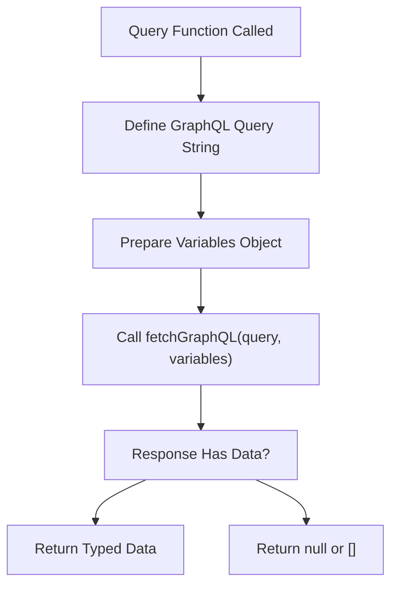
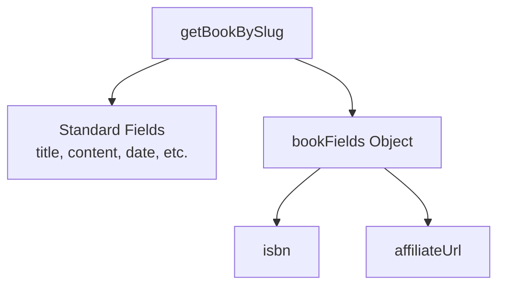
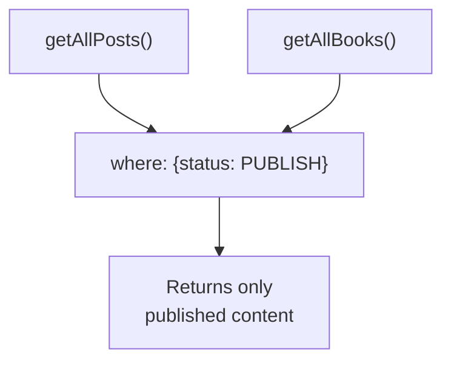
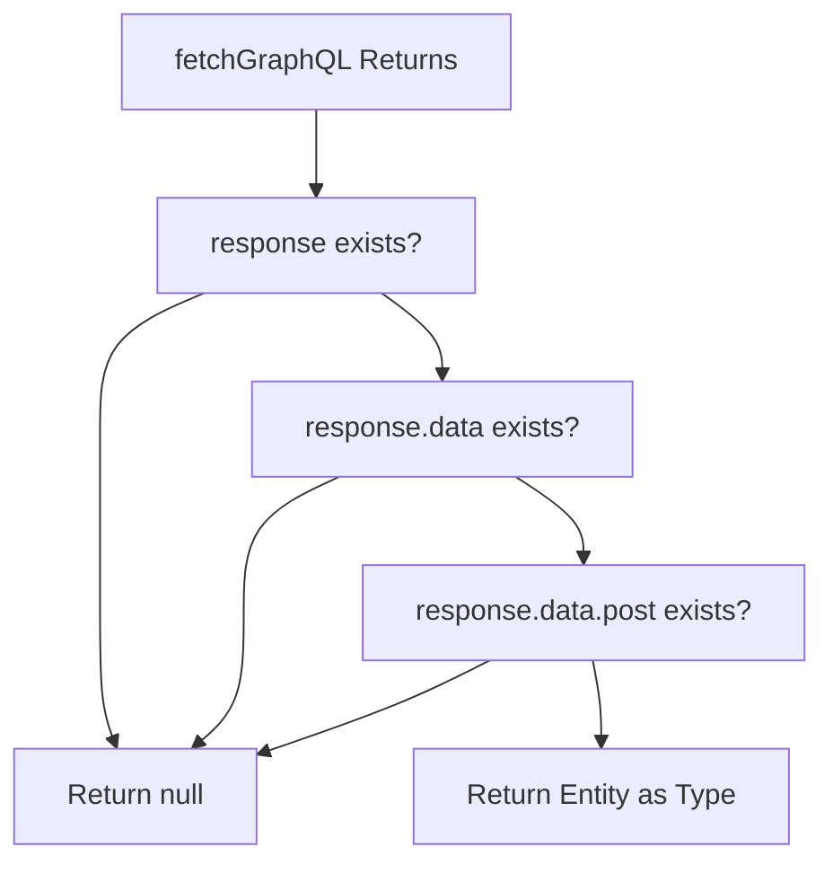
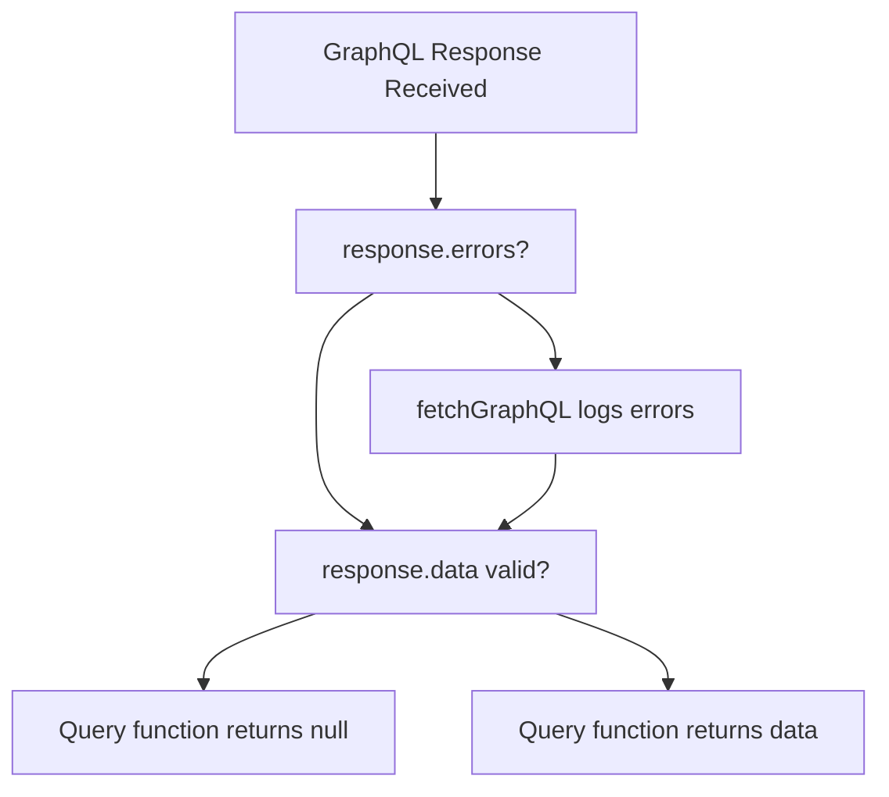
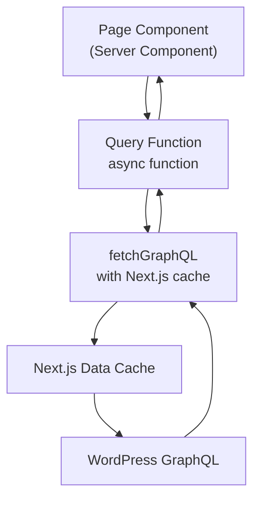

# GraphQL Queries

> **Relevant source files**
> * [components/CommentForm.test.tsx](https://github.com/gregrickaby/nextjs-wordpress/blob/63f3f2f5/components/CommentForm.test.tsx)
> * [components/Footer.test.tsx](https://github.com/gregrickaby/nextjs-wordpress/blob/63f3f2f5/components/Footer.test.tsx)
> * [components/Header.test.tsx](https://github.com/gregrickaby/nextjs-wordpress/blob/63f3f2f5/components/Header.test.tsx)
> * [components/SearchForm.test.tsx](https://github.com/gregrickaby/nextjs-wordpress/blob/63f3f2f5/components/SearchForm.test.tsx)
> * [lib/functions.test.ts](https://github.com/gregrickaby/nextjs-wordpress/blob/63f3f2f5/lib/functions.test.ts)
> * [lib/functions.ts](https://github.com/gregrickaby/nextjs-wordpress/blob/63f3f2f5/lib/functions.ts)
> * [lib/mutations/createComment.test.ts](https://github.com/gregrickaby/nextjs-wordpress/blob/63f3f2f5/lib/mutations/createComment.test.ts)
> * [lib/queries/getAllBooks.test.ts](https://github.com/gregrickaby/nextjs-wordpress/blob/63f3f2f5/lib/queries/getAllBooks.test.ts)
> * [lib/queries/getAllBooks.ts](https://github.com/gregrickaby/nextjs-wordpress/blob/63f3f2f5/lib/queries/getAllBooks.ts)
> * [lib/queries/getAllPages.test.ts](https://github.com/gregrickaby/nextjs-wordpress/blob/63f3f2f5/lib/queries/getAllPages.test.ts)
> * [lib/queries/getAllPosts.test.ts](https://github.com/gregrickaby/nextjs-wordpress/blob/63f3f2f5/lib/queries/getAllPosts.test.ts)
> * [lib/queries/getAllPosts.ts](https://github.com/gregrickaby/nextjs-wordpress/blob/63f3f2f5/lib/queries/getAllPosts.ts)
> * [lib/queries/getBookBySlug.test.ts](https://github.com/gregrickaby/nextjs-wordpress/blob/63f3f2f5/lib/queries/getBookBySlug.test.ts)
> * [lib/queries/getBookBySlug.ts](https://github.com/gregrickaby/nextjs-wordpress/blob/63f3f2f5/lib/queries/getBookBySlug.ts)
> * [lib/queries/getCategoryBySlug.test.ts](https://github.com/gregrickaby/nextjs-wordpress/blob/63f3f2f5/lib/queries/getCategoryBySlug.test.ts)
> * [lib/queries/getPageBySlug.test.ts](https://github.com/gregrickaby/nextjs-wordpress/blob/63f3f2f5/lib/queries/getPageBySlug.test.ts)
> * [lib/queries/getPageBySlug.ts](https://github.com/gregrickaby/nextjs-wordpress/blob/63f3f2f5/lib/queries/getPageBySlug.ts)
> * [lib/queries/getPostBySlug.test.ts](https://github.com/gregrickaby/nextjs-wordpress/blob/63f3f2f5/lib/queries/getPostBySlug.test.ts)
> * [lib/queries/getPostBySlug.ts](https://github.com/gregrickaby/nextjs-wordpress/blob/63f3f2f5/lib/queries/getPostBySlug.ts)
> * [lib/queries/getPreview.test.ts](https://github.com/gregrickaby/nextjs-wordpress/blob/63f3f2f5/lib/queries/getPreview.test.ts)
> * [lib/queries/getTagBySlug.test.ts](https://github.com/gregrickaby/nextjs-wordpress/blob/63f3f2f5/lib/queries/getTagBySlug.test.ts)
> * [test-utils/domShims.ts](https://github.com/gregrickaby/nextjs-wordpress/blob/63f3f2f5/test-utils/domShims.ts)
> * [vitest.config.ts](https://github.com/gregrickaby/nextjs-wordpress/blob/63f3f2f5/vitest.config.ts)

## Purpose and Scope

This document details the GraphQL query functions that fetch content from WordPress via the WPGraphQL API. These query functions provide a typed, abstracted interface for retrieving posts, pages, books, menus, categories, and tags. Each query function encapsulates a GraphQL query string and handles response parsing and error conditions.

For information about GraphQL mutations (creating/updating content), see [GraphQL Mutations](/gregrickaby/nextjs-wordpress/5.2-graphql-mutations). For details about the underlying `fetchGraphQL` utility and caching behavior, see [fetchGraphQL Utility](/gregrickaby/nextjs-wordpress/5.3-fetchgraphql-utility). For REST API search functionality, see [Search Functionality](/gregrickaby/nextjs-wordpress/5.4-search-functionality).

---

## Query Architecture Overview

The query layer sits between Next.js page components and the WordPress GraphQL API, providing a clean abstraction that enforces type safety and consistent error handling.

### Query Function Architecture

```mermaid
flowchart TD

HomePage["app/page.tsx"]
PostPage["app/blog/[slug]/page.tsx"]
BookPage["app/books/[slug]/page.tsx"]
ArchivePage["app/[slug]/page.tsx"]
TagPage["app/blog/tag/[slug]/page.tsx"]
CategoryPage["app/blog/category/[slug]/page.tsx"]
PreviewPage["app/preview/[slug]/page.tsx"]
GetPostBySlug["getPostBySlug()"]
GetAllPosts["getAllPosts()"]
GetPageBySlug["getPageBySlug()"]
GetBookBySlug["getBookBySlug()"]
GetAllBooks["getAllBooks()"]
GetAllPages["getAllPages()"]
GetMenuBySlug["getMenuBySlug()"]
GetTagBySlug["getTagBySlug()"]
GetCategoryBySlug["getCategoryBySlug()"]
GetPreview["getPreview()"]
FetchGraphQL["fetchGraphQL()"]
TypeDefs["Type Definitions<br>Post, Page, Book, Menu"]
WPGraphQL["WPGraphQL API Endpoint"]

HomePage --> GetPageBySlug
HomePage --> GetAllPosts
PostPage --> GetPostBySlug
BookPage --> GetBookBySlug
ArchivePage --> GetPageBySlug
ArchivePage --> GetAllPosts
ArchivePage --> GetAllBooks
TagPage --> GetTagBySlug
CategoryPage --> GetCategoryBySlug
PreviewPage --> GetPreview
GetPostBySlug --> FetchGraphQL
GetAllPosts --> FetchGraphQL
GetPageBySlug --> FetchGraphQL
GetBookBySlug --> FetchGraphQL
GetAllBooks --> FetchGraphQL
GetAllPages --> FetchGraphQL
GetMenuBySlug --> FetchGraphQL
GetTagBySlug --> FetchGraphQL
GetCategoryBySlug --> FetchGraphQL
GetPreview --> FetchGraphQL
FetchGraphQL --> WPGraphQL
TypeDefs --> GetPostBySlug
TypeDefs --> GetAllPosts
TypeDefs --> GetPageBySlug
TypeDefs --> GetBookBySlug
TypeDefs --> GetAllBooks

subgraph subGraph3 ["WordPress Backend"]
    WPGraphQL
end

subgraph subGraph2 ["Core Infrastructure"]
    FetchGraphQL
    TypeDefs
end

subgraph subGraph1 ["Query Functions - lib/queries/"]
    GetPostBySlug
    GetAllPosts
    GetPageBySlug
    GetBookBySlug
    GetAllBooks
    GetAllPages
    GetMenuBySlug
    GetTagBySlug
    GetCategoryBySlug
    GetPreview
end

subgraph subGraph0 ["Next.js Pages"]
    HomePage
    PostPage
    BookPage
    ArchivePage
    TagPage
    CategoryPage
    PreviewPage
end
```



**Sources:** [lib/queries/getPostBySlug.ts L1-L83](https://github.com/gregrickaby/nextjs-wordpress/blob/63f3f2f5/lib/queries/getPostBySlug.ts#L1-L83)

 [lib/queries/getAllPosts.ts L1-L45](https://github.com/gregrickaby/nextjs-wordpress/blob/63f3f2f5/lib/queries/getAllPosts.ts#L1-L45)

 [lib/queries/getPageBySlug.ts L1-L53](https://github.com/gregrickaby/nextjs-wordpress/blob/63f3f2f5/lib/queries/getPageBySlug.ts#L1-L53)

 [lib/queries/getBookBySlug.ts L1-L49](https://github.com/gregrickaby/nextjs-wordpress/blob/63f3f2f5/lib/queries/getBookBySlug.ts#L1-L49)

 [lib/queries/getAllBooks.ts L1-L44](https://github.com/gregrickaby/nextjs-wordpress/blob/63f3f2f5/lib/queries/getAllBooks.ts#L1-L44)

 [lib/functions.ts L7-L88](https://github.com/gregrickaby/nextjs-wordpress/blob/63f3f2f5/lib/functions.ts#L7-L88)

### Query Execution Flow

```mermaid
sequenceDiagram
  participant Page Component
  participant Query Function
  participant fetchGraphQL()
  participant Next.js Cache
  participant WordPress GraphQL

  Page Component->>Query Function: Call with parameters (e.g., slug)
  Query Function->>Query Function: Build GraphQL query string
  Query Function->>Query Function: Prepare variables object
  Query Function->>fetchGraphQL(): fetchGraphQL(query, variables)
  fetchGraphQL()->>Next.js Cache: Check cache tags
  loop [Cache Hit]
    Next.js Cache-->>fetchGraphQL(): Return cached data
    fetchGraphQL()->>WordPress GraphQL: POST GraphQL query
    WordPress GraphQL-->>fetchGraphQL(): JSON response
    fetchGraphQL()->>Next.js Cache: Store with cache tags
    fetchGraphQL()-->>Query Function: GraphQLResponse<T>
    Query Function->>Query Function: Validate response.data
    Query Function-->>Page Component: Return typed object (Post/Page/Book)
    Query Function-->>Page Component: Return null or empty array
  end
```

**Sources:** [lib/functions.ts L7-L88](https://github.com/gregrickaby/nextjs-wordpress/blob/63f3f2f5/lib/functions.ts#L7-L88)

 [lib/queries/getPostBySlug.ts L76-L82](https://github.com/gregrickaby/nextjs-wordpress/blob/63f3f2f5/lib/queries/getPostBySlug.ts#L76-L82)

---

## Query Function Catalog

All query functions are located in the `lib/queries/` directory. Each function follows a consistent pattern: construct a GraphQL query string, pass it to `fetchGraphQL`, validate the response, and return typed data or null/empty array.

### Single Entity Query Functions

These functions fetch a single content item by identifier (slug or ID).

| Function | File | Parameters | Return Type | Purpose |
| --- | --- | --- | --- | --- |
| `getPostBySlug` | [lib/queries/getPostBySlug.ts](https://github.com/gregrickaby/nextjs-wordpress/blob/63f3f2f5/lib/queries/getPostBySlug.ts) | `slug: string` | `Post \| null` | Fetch single blog post with full content, author, tags, categories, comments, and SEO data |
| `getPageBySlug` | [lib/queries/getPageBySlug.ts](https://github.com/gregrickaby/nextjs-wordpress/blob/63f3f2f5/lib/queries/getPageBySlug.ts) | `slug: string` | `Page \| null` | Fetch single page with content, author, featured image, and SEO data |
| `getBookBySlug` | [lib/queries/getBookBySlug.ts](https://github.com/gregrickaby/nextjs-wordpress/blob/63f3f2f5/lib/queries/getBookBySlug.ts) | `slug: string` | `Book \| null` | Fetch single book with custom fields (ISBN, affiliate URL), featured image, and SEO data |
| `getMenuBySlug` | Referenced in tests | `slug: string` | `Menu \| null` | Fetch navigation menu items by menu slug |
| `getPreview` | [lib/queries/getPreview.test.ts L52-L101](https://github.com/gregrickaby/nextjs-wordpress/blob/63f3f2f5/lib/queries/getPreview.test.ts#L52-L101) | `id: string` | `Post` | Fetch draft/preview content using JWT authentication |

**Sources:** [lib/queries/getPostBySlug.ts L7-L83](https://github.com/gregrickaby/nextjs-wordpress/blob/63f3f2f5/lib/queries/getPostBySlug.ts#L7-L83)

 [lib/queries/getPageBySlug.ts L7-L53](https://github.com/gregrickaby/nextjs-wordpress/blob/63f3f2f5/lib/queries/getPageBySlug.ts#L7-L53)

 [lib/queries/getBookBySlug.ts L7-L49](https://github.com/gregrickaby/nextjs-wordpress/blob/63f3f2f5/lib/queries/getBookBySlug.ts#L7-L49)

 [lib/queries/getPreview.test.ts L52-L101](https://github.com/gregrickaby/nextjs-wordpress/blob/63f3f2f5/lib/queries/getPreview.test.ts#L52-L101)

### Collection Query Functions

These functions fetch multiple content items, typically for listing pages.

| Function | File | Parameters | Return Type | Purpose |
| --- | --- | --- | --- | --- |
| `getAllPosts` | [lib/queries/getAllPosts.ts](https://github.com/gregrickaby/nextjs-wordpress/blob/63f3f2f5/lib/queries/getAllPosts.ts) | None | `Post[]` | Fetch all published posts for homepage and archive pages |
| `getAllBooks` | [lib/queries/getAllBooks.ts](https://github.com/gregrickaby/nextjs-wordpress/blob/63f3f2f5/lib/queries/getAllBooks.ts) | None | `Post[]` | Fetch all published books for book archive |
| `getAllPages` | [lib/queries/getAllPages.test.ts L6-L69](https://github.com/gregrickaby/nextjs-wordpress/blob/63f3f2f5/lib/queries/getAllPages.test.ts#L6-L69) | None | `Page[]` | Fetch all pages for sitemap generation |
| `getTagBySlug` | [lib/queries/getTagBySlug.test.ts L6-L118](https://github.com/gregrickaby/nextjs-wordpress/blob/63f3f2f5/lib/queries/getTagBySlug.test.ts#L6-L118) | `slug: string, limit?: number` | `Post[]` | Fetch posts filtered by tag (default limit: 10) |
| `getCategoryBySlug` | [lib/queries/getCategoryBySlug.test.ts L6-L96](https://github.com/gregrickaby/nextjs-wordpress/blob/63f3f2f5/lib/queries/getCategoryBySlug.test.ts#L6-L96) | `slug: string, limit?: number` | `Post[]` | Fetch posts filtered by category (default limit: 10) |

**Sources:** [lib/queries/getAllPosts.ts L7-L45](https://github.com/gregrickaby/nextjs-wordpress/blob/63f3f2f5/lib/queries/getAllPosts.ts#L7-L45)

 [lib/queries/getAllBooks.ts L7-L44](https://github.com/gregrickaby/nextjs-wordpress/blob/63f3f2f5/lib/queries/getAllBooks.ts#L7-L44)

 [lib/queries/getAllPages.test.ts L6-L69](https://github.com/gregrickaby/nextjs-wordpress/blob/63f3f2f5/lib/queries/getAllPages.test.ts#L6-L69)

 [lib/queries/getTagBySlug.test.ts L51-L80](https://github.com/gregrickaby/nextjs-wordpress/blob/63f3f2f5/lib/queries/getTagBySlug.test.ts#L51-L80)

 [lib/queries/getCategoryBySlug.test.ts L51-L80](https://github.com/gregrickaby/nextjs-wordpress/blob/63f3f2f5/lib/queries/getCategoryBySlug.test.ts#L51-L80)

---

## Query Structure and Patterns

### Standard Query Pattern

All query functions follow this structure:



**Sources:** [lib/queries/getPostBySlug.ts L7-L83](https://github.com/gregrickaby/nextjs-wordpress/blob/63f3f2f5/lib/queries/getPostBySlug.ts#L7-L83)

 [lib/queries/getAllPosts.ts L7-L45](https://github.com/gregrickaby/nextjs-wordpress/blob/63f3f2f5/lib/queries/getAllPosts.ts#L7-L45)

### Example: getPostBySlug Query Structure

The `getPostBySlug` function demonstrates the standard pattern:

1. **Query Definition** [lib/queries/getPostBySlug.ts L8-L70](https://github.com/gregrickaby/nextjs-wordpress/blob/63f3f2f5/lib/queries/getPostBySlug.ts#L8-L70)  - GraphQL query string with all required fields
2. **Variables Object** [lib/queries/getPostBySlug.ts L72-L74](https://github.com/gregrickaby/nextjs-wordpress/blob/63f3f2f5/lib/queries/getPostBySlug.ts#L72-L74)  - Parameters passed to GraphQL query
3. **Fetch Execution** [lib/queries/getPostBySlug.ts L76](https://github.com/gregrickaby/nextjs-wordpress/blob/63f3f2f5/lib/queries/getPostBySlug.ts#L76-L76)  - Call `fetchGraphQL` with query and variables
4. **Response Validation** [lib/queries/getPostBySlug.ts L78-L80](https://github.com/gregrickaby/nextjs-wordpress/blob/63f3f2f5/lib/queries/getPostBySlug.ts#L78-L80)  - Check if `response?.data?.post` exists
5. **Type Cast and Return** [lib/queries/getPostBySlug.ts L82](https://github.com/gregrickaby/nextjs-wordpress/blob/63f3f2f5/lib/queries/getPostBySlug.ts#L82-L82)  - Return data cast to `Post` type

**Sources:** [lib/queries/getPostBySlug.ts L7-L83](https://github.com/gregrickaby/nextjs-wordpress/blob/63f3f2f5/lib/queries/getPostBySlug.ts#L7-L83)

### Query Field Selection Strategy

Each query function requests specific fields based on where the data will be displayed:

#### Full Post Query Fields

The `getPostBySlug` query [lib/queries/getPostBySlug.ts L8-L70](https://github.com/gregrickaby/nextjs-wordpress/blob/63f3f2f5/lib/queries/getPostBySlug.ts#L8-L70)

 requests comprehensive data:

* **Core Fields**: `databaseId`, `date`, `modified`, `title`, `content`
* **Media**: `featuredImage` with `altText`, `sourceUrl`, `mediaDetails` (dimensions)
* **Relationships**: `author`, `tags`, `categories` with nested node structures
* **SEO**: `seo.metaDesc`, `seo.title`
* **Engagement**: `comments` (first 30, ascending order) with author details

#### List Post Query Fields

The `getAllPosts` query [lib/queries/getAllPosts.ts L8-L36](https://github.com/gregrickaby/nextjs-wordpress/blob/63f3f2f5/lib/queries/getAllPosts.ts#L8-L36)

 requests minimal data for list views:

* **Core Fields**: `databaseId`, `date`, `modified`, `title`, `slug`
* **Preview**: `excerpt` for post previews
* **Media**: `featuredImage` (same structure as full query)
* **Engagement**: `commentCount` (not full comment objects)
* **SEO**: `seo.metaDesc`, `seo.title`

**Sources:** [lib/queries/getPostBySlug.ts L8-L70](https://github.com/gregrickaby/nextjs-wordpress/blob/63f3f2f5/lib/queries/getPostBySlug.ts#L8-L70)

 [lib/queries/getAllPosts.ts L8-L36](https://github.com/gregrickaby/nextjs-wordpress/blob/63f3f2f5/lib/queries/getAllPosts.ts#L8-L36)

### Custom Post Type Queries

Book queries include custom fields through the `bookFields` object:



The `bookFields` object [lib/queries/getBookBySlug.ts L11-L14](https://github.com/gregrickaby/nextjs-wordpress/blob/63f3f2f5/lib/queries/getBookBySlug.ts#L11-L14)

 accesses Advanced Custom Fields (ACF) registered in WordPress:

* `isbn` - International Standard Book Number
* `affiliateUrl` - Purchase link for affiliate tracking

**Sources:** [lib/queries/getBookBySlug.ts L8-L36](https://github.com/gregrickaby/nextjs-wordpress/blob/63f3f2f5/lib/queries/getBookBySlug.ts#L8-L36)

---

## Query Variables and Parameters

### ID Type Handling

WordPress GraphQL supports multiple ID types for querying content. Query functions specify the appropriate `idType`:

| Query Function | ID Type | Variable Name | Example Value |
| --- | --- | --- | --- |
| `getPostBySlug` | `SLUG` | `slug` | `"hello-world"` |
| `getPageBySlug` | `URI` | `slug` | `"/about"` |
| `getBookBySlug` | `SLUG` | `slug` | `"clean-code"` |
| `getPreview` | `DATABASE_ID` | `id` | `"123"` |

**Slug vs URI**: Pages use `URI` type [lib/queries/getPageBySlug.ts L9](https://github.com/gregrickaby/nextjs-wordpress/blob/63f3f2f5/lib/queries/getPageBySlug.ts#L9-L9)

 to support hierarchical paths (e.g., `/parent/child`), while posts use `SLUG` type [lib/queries/getPostBySlug.ts L10](https://github.com/gregrickaby/nextjs-wordpress/blob/63f3f2f5/lib/queries/getPostBySlug.ts#L10-L10)

 for flat slug matching.

**Sources:** [lib/queries/getPostBySlug.ts L9-L10](https://github.com/gregrickaby/nextjs-wordpress/blob/63f3f2f5/lib/queries/getPostBySlug.ts#L9-L10)

 [lib/queries/getPageBySlug.ts L9-L10](https://github.com/gregrickaby/nextjs-wordpress/blob/63f3f2f5/lib/queries/getPageBySlug.ts#L9-L10)

 [lib/queries/getBookBySlug.ts L10](https://github.com/gregrickaby/nextjs-wordpress/blob/63f3f2f5/lib/queries/getBookBySlug.ts#L10-L10)

### Query Pagination Parameters

Taxonomy queries (`getTagBySlug`, `getCategoryBySlug`) support pagination through optional limit parameters:

* **Default Limit**: 10 posts per query [lib/queries/getTagBySlug.test.ts L97-L117](https://github.com/gregrickaby/nextjs-wordpress/blob/63f3f2f5/lib/queries/getTagBySlug.test.ts#L97-L117)
* **Custom Limit**: Passed as second parameter to override default
* **GraphQL Parameter**: Maps to `first` argument in WordPress GraphQL

This allows flexible control over archive page sizes without modifying the query function.

**Sources:** [lib/queries/getTagBySlug.test.ts L51-L80](https://github.com/gregrickaby/nextjs-wordpress/blob/63f3f2f5/lib/queries/getTagBySlug.test.ts#L51-L80)

 [lib/queries/getTagBySlug.test.ts L97-L117](https://github.com/gregrickaby/nextjs-wordpress/blob/63f3f2f5/lib/queries/getTagBySlug.test.ts#L97-L117)

### Query Filtering Parameters

Collection queries include WordPress status filters:



The `where: {status: PUBLISH}` clause [lib/queries/getAllPosts.ts L10](https://github.com/gregrickaby/nextjs-wordpress/blob/63f3f2f5/lib/queries/getAllPosts.ts#L10-L10)

 ensures draft and private content is excluded from public-facing queries. Preview functionality bypasses this filter [lib/queries/getPreview.test.ts L52-L101](https://github.com/gregrickaby/nextjs-wordpress/blob/63f3f2f5/lib/queries/getPreview.test.ts#L52-L101)

**Sources:** [lib/queries/getAllPosts.ts L10](https://github.com/gregrickaby/nextjs-wordpress/blob/63f3f2f5/lib/queries/getAllPosts.ts#L10-L10)

 [lib/queries/getAllBooks.ts L10](https://github.com/gregrickaby/nextjs-wordpress/blob/63f3f2f5/lib/queries/getAllBooks.ts#L10-L10)

---

## Type Safety and Response Handling

### Type Casting Strategy

Query functions enforce type safety by casting GraphQL responses to TypeScript types:

| Query Function | Cast Type | Type Source |
| --- | --- | --- |
| `getPostBySlug` | `Post` | [lib/types.d.ts](https://github.com/gregrickaby/nextjs-wordpress/blob/63f3f2f5/lib/types.d.ts) |
| `getAllPosts` | `Post[]` | [lib/types.d.ts](https://github.com/gregrickaby/nextjs-wordpress/blob/63f3f2f5/lib/types.d.ts) |
| `getPageBySlug` | `Page` | [lib/types.d.ts](https://github.com/gregrickaby/nextjs-wordpress/blob/63f3f2f5/lib/types.d.ts) |
| `getBookBySlug` | `Book` | [lib/types.d.ts](https://github.com/gregrickaby/nextjs-wordpress/blob/63f3f2f5/lib/types.d.ts) |
| `getAllBooks` | `Post[]` | [lib/types.d.ts](https://github.com/gregrickaby/nextjs-wordpress/blob/63f3f2f5/lib/types.d.ts) |

The cast happens after response validation [lib/queries/getPostBySlug.ts L82](https://github.com/gregrickaby/nextjs-wordpress/blob/63f3f2f5/lib/queries/getPostBySlug.ts#L82-L82)

 ensuring TypeScript consumers receive properly typed objects.

**Sources:** [lib/queries/getPostBySlug.ts L1-L2](https://github.com/gregrickaby/nextjs-wordpress/blob/63f3f2f5/lib/queries/getPostBySlug.ts#L1-L2)

 [lib/queries/getPostBySlug.ts L82](https://github.com/gregrickaby/nextjs-wordpress/blob/63f3f2f5/lib/queries/getPostBySlug.ts#L82-L82)

### Null Response Handling

Query functions implement defensive null checking:



The multi-level null check pattern [lib/queries/getPostBySlug.ts L78-L80](https://github.com/gregrickaby/nextjs-wordpress/blob/63f3f2f5/lib/queries/getPostBySlug.ts#L78-L80)

 uses optional chaining to safely traverse the response object:

```
if (!response?.data?.post) {
  return null
}
```

This prevents runtime errors when WordPress returns empty results or errors occur.

**Sources:** [lib/queries/getPostBySlug.ts L78-L82](https://github.com/gregrickaby/nextjs-wordpress/blob/63f3f2f5/lib/queries/getPostBySlug.ts#L78-L82)

 [lib/queries/getPageBySlug.ts L48-L52](https://github.com/gregrickaby/nextjs-wordpress/blob/63f3f2f5/lib/queries/getPageBySlug.ts#L48-L52)

### Empty Array Returns

Collection query functions return empty arrays instead of null for consistency:

* `getAllPosts` returns `[]` when no posts exist [lib/queries/getAllPosts.ts L40-L42](https://github.com/gregrickaby/nextjs-wordpress/blob/63f3f2f5/lib/queries/getAllPosts.ts#L40-L42)
* `getAllBooks` returns `[]` when no books exist [lib/queries/getAllBooks.ts L39-L41](https://github.com/gregrickaby/nextjs-wordpress/blob/63f3f2f5/lib/queries/getAllBooks.ts#L39-L41)
* `getTagBySlug` throws error on API failure [lib/queries/getTagBySlug.test.ts L82-L95](https://github.com/gregrickaby/nextjs-wordpress/blob/63f3f2f5/lib/queries/getTagBySlug.test.ts#L82-L95)

The empty array pattern simplifies component logic by eliminating null checks in map operations.

**Sources:** [lib/queries/getAllPosts.ts L40-L44](https://github.com/gregrickaby/nextjs-wordpress/blob/63f3f2f5/lib/queries/getAllPosts.ts#L40-L44)

 [lib/queries/getAllBooks.ts L39-L43](https://github.com/gregrickaby/nextjs-wordpress/blob/63f3f2f5/lib/queries/getAllBooks.ts#L39-L43)

---

## Error Handling Patterns

### GraphQL Error Responses

The `fetchGraphQL` utility handles GraphQL errors at the transport level [lib/functions.ts L68-L74](https://github.com/gregrickaby/nextjs-wordpress/blob/63f3f2f5/lib/functions.ts#L68-L74)

 but query functions implement additional validation:



**Error Handling Layers:**

1. `fetchGraphQL` logs GraphQL errors [lib/functions.ts L69](https://github.com/gregrickaby/nextjs-wordpress/blob/63f3f2f5/lib/functions.ts#L69-L69)  but still returns response
2. Query functions check for null/undefined data
3. TypeScript type system prevents invalid property access

**Sources:** [lib/functions.ts L68-L74](https://github.com/gregrickaby/nextjs-wordpress/blob/63f3f2f5/lib/functions.ts#L68-L74)

 [lib/queries/getPostBySlug.ts L78-L82](https://github.com/gregrickaby/nextjs-wordpress/blob/63f3f2f5/lib/queries/getPostBySlug.ts#L78-L82)

### Network and HTTP Errors

Network errors are caught by `fetchGraphQL` [lib/functions.ts L78-L87](https://github.com/gregrickaby/nextjs-wordpress/blob/63f3f2f5/lib/functions.ts#L78-L87)

 and converted to error responses. Query functions receive a response with `data: undefined` and can safely return null.

Test cases demonstrate error resilience:

* HTTP 404 responses return null [lib/queries/getPostBySlug.test.ts L77-L92](https://github.com/gregrickaby/nextjs-wordpress/blob/63f3f2f5/lib/queries/getPostBySlug.test.ts#L77-L92)
* Network errors return null [lib/functions.test.ts L60-L71](https://github.com/gregrickaby/nextjs-wordpress/blob/63f3f2f5/lib/functions.test.ts#L60-L71)
* Malformed responses return null [lib/queries/getPageBySlug.test.ts L87-L99](https://github.com/gregrickaby/nextjs-wordpress/blob/63f3f2f5/lib/queries/getPageBySlug.test.ts#L87-L99)

**Sources:** [lib/functions.ts L78-L87](https://github.com/gregrickaby/nextjs-wordpress/blob/63f3f2f5/lib/functions.ts#L78-L87)

 [lib/queries/getPostBySlug.test.ts L77-L92](https://github.com/gregrickaby/nextjs-wordpress/blob/63f3f2f5/lib/queries/getPostBySlug.test.ts#L77-L92)

---

## Query Testing Strategy

### Test File Organization

Each query function has a corresponding test file in `lib/queries/`:

| Query Function | Test File | Test Count |
| --- | --- | --- |
| `getPostBySlug` | [lib/queries/getPostBySlug.test.ts](https://github.com/gregrickaby/nextjs-wordpress/blob/63f3f2f5/lib/queries/getPostBySlug.test.ts) | 3 scenarios |
| `getAllPosts` | [lib/queries/getAllPosts.test.ts](https://github.com/gregrickaby/nextjs-wordpress/blob/63f3f2f5/lib/queries/getAllPosts.test.ts) | 4 scenarios |
| `getPageBySlug` | [lib/queries/getPageBySlug.test.ts](https://github.com/gregrickaby/nextjs-wordpress/blob/63f3f2f5/lib/queries/getPageBySlug.test.ts) | 4 scenarios |
| `getBookBySlug` | [lib/queries/getBookBySlug.test.ts](https://github.com/gregrickaby/nextjs-wordpress/blob/63f3f2f5/lib/queries/getBookBySlug.test.ts) | 4 scenarios |
| `getAllBooks` | [lib/queries/getAllBooks.test.ts](https://github.com/gregrickaby/nextjs-wordpress/blob/63f3f2f5/lib/queries/getAllBooks.test.ts) | 4 scenarios |
| `getPreview` | [lib/queries/getPreview.test.ts](https://github.com/gregrickaby/nextjs-wordpress/blob/63f3f2f5/lib/queries/getPreview.test.ts) | 3 scenarios |
| `getTagBySlug` | [lib/queries/getTagBySlug.test.ts](https://github.com/gregrickaby/nextjs-wordpress/blob/63f3f2f5/lib/queries/getTagBySlug.test.ts) | 4 scenarios |
| `getCategoryBySlug` | [lib/queries/getCategoryBySlug.test.ts](https://github.com/gregrickaby/nextjs-wordpress/blob/63f3f2f5/lib/queries/getCategoryBySlug.test.ts) | 3 scenarios |

**Sources:** [lib/queries/getPostBySlug.test.ts L5-L93](https://github.com/gregrickaby/nextjs-wordpress/blob/63f3f2f5/lib/queries/getPostBySlug.test.ts#L5-L93)

 [lib/queries/getAllPosts.test.ts L5-L93](https://github.com/gregrickaby/nextjs-wordpress/blob/63f3f2f5/lib/queries/getAllPosts.test.ts#L5-L93)

### Mock Service Worker Integration

Tests use MSW (Mock Service Worker) to intercept GraphQL requests:

```mermaid
sequenceDiagram
  participant Test Function
  participant MSW Server
  participant Query Function
  participant fetch()

  Test Function->>MSW Server: server.use(handler)
  Test Function->>Query Function: Call query function
  Query Function->>fetch(): POST to GraphQL URL
  MSW Server->>MSW Server: Intercept request
  MSW Server->>MSW Server: Match handler
  MSW Server-->>fetch(): Return mocked response
  fetch()-->>Query Function: Response data
  Query Function-->>Test Function: Typed result
  Test Function->>Test Function: Assert expectations
```

MSW handlers are configured in test setup [lib/queries/getPostBySlug.test.ts L43-L51](https://github.com/gregrickaby/nextjs-wordpress/blob/63f3f2f5/lib/queries/getPostBySlug.test.ts#L43-L51)

 to return predefined mock data that matches the expected GraphQL response structure.

**Sources:** [lib/queries/getPostBySlug.test.ts L43-L51](https://github.com/gregrickaby/nextjs-wordpress/blob/63f3f2f5/lib/queries/getPostBySlug.test.ts#L43-L51)

 [lib/functions.test.ts L17-L37](https://github.com/gregrickaby/nextjs-wordpress/blob/63f3f2f5/lib/functions.test.ts#L17-L37)

### Standard Test Scenarios

All query function tests follow this pattern:

1. **Success Case** - Valid data returned and properly typed [lib/queries/getPostBySlug.test.ts L42-L59](https://github.com/gregrickaby/nextjs-wordpress/blob/63f3f2f5/lib/queries/getPostBySlug.test.ts#L42-L59)
2. **Not Found Case** - Null data returns null [lib/queries/getPostBySlug.test.ts L61-L75](https://github.com/gregrickaby/nextjs-wordpress/blob/63f3f2f5/lib/queries/getPostBySlug.test.ts#L61-L75)
3. **API Error Case** - GraphQL errors handled gracefully [lib/queries/getPostBySlug.test.ts L77-L92](https://github.com/gregrickaby/nextjs-wordpress/blob/63f3f2f5/lib/queries/getPostBySlug.test.ts#L77-L92)
4. **Null Data Case** - Response with null data returns null [lib/queries/getBookBySlug.test.ts L84-L96](https://github.com/gregrickaby/nextjs-wordpress/blob/63f3f2f5/lib/queries/getBookBySlug.test.ts#L84-L96)

Collection queries add an additional scenario:
5. **Empty Results Case** - Empty array returned when no items exist [lib/queries/getAllPosts.test.ts L45-L61](https://github.com/gregrickaby/nextjs-wordpress/blob/63f3f2f5/lib/queries/getAllPosts.test.ts#L45-L61)

**Sources:** [lib/queries/getPostBySlug.test.ts L42-L92](https://github.com/gregrickaby/nextjs-wordpress/blob/63f3f2f5/lib/queries/getPostBySlug.test.ts#L42-L92)

 [lib/queries/getAllPosts.test.ts L6-L93](https://github.com/gregrickaby/nextjs-wordpress/blob/63f3f2f5/lib/queries/getAllPosts.test.ts#L6-L93)

### Mock Data Structures

Test files define mock objects that match WordPress GraphQL response structures [lib/queries/getPostBySlug.test.ts L6-L40](https://github.com/gregrickaby/nextjs-wordpress/blob/63f3f2f5/lib/queries/getPostBySlug.test.ts#L6-L40)

:

* Mock objects include all fields requested by the query
* Nested structures (author, featuredImage, etc.) match GraphQL schema
* Tests verify specific field access (e.g., `post?.author?.node?.name`)

This ensures query functions correctly parse WordPress response structures.

**Sources:** [lib/queries/getPostBySlug.test.ts L6-L40](https://github.com/gregrickaby/nextjs-wordpress/blob/63f3f2f5/lib/queries/getPostBySlug.test.ts#L6-L40)

 [lib/queries/getBookBySlug.test.ts L6-L30](https://github.com/gregrickaby/nextjs-wordpress/blob/63f3f2f5/lib/queries/getBookBySlug.test.ts#L6-L30)

---

## Query Usage in Page Components

### Server Component Integration

Query functions are designed for Next.js Server Components and run server-side:



Page components await query functions directly without needing client-side state management. The data is fetched during server-side rendering.

**Sources:** Referenced in architecture diagrams

### generateStaticParams Integration

Query functions support static generation by providing data for `generateStaticParams`:

* `getAllPosts` returns slug array for post page generation
* `getAllBooks` returns slug array for book page generation
* `getAllPages` returns slug array for page generation

This enables Next.js to pre-render all content at build time.

**Sources:** Referenced in system documentation

---

## Cache Tag Strategy

### Query-Level Cache Tagging

The `fetchGraphQL` utility automatically generates cache tags based on query content [lib/functions.ts L33-L54](https://github.com/gregrickaby/nextjs-wordpress/blob/63f3f2f5/lib/functions.ts#L33-L54)

:

| Content Type Detection | Cache Tags Applied |
| --- | --- |
| Query contains `posts` | `slug`, `graphql`, `type:post` |
| Query contains `pages` | `slug`, `graphql`, `type:page` |
| Query contains `books` | `slug`, `graphql`, `type:book` |
| Default | `slug`, `graphql`, `type:content` |

The slug value comes from query variables [lib/functions.ts L34](https://github.com/gregrickaby/nextjs-wordpress/blob/63f3f2f5/lib/functions.ts#L34-L34)

 enabling granular cache invalidation.

**Sources:** [lib/functions.ts L33-L54](https://github.com/gregrickaby/nextjs-wordpress/blob/63f3f2f5/lib/functions.ts#L33-L54)

### Cache Revalidation Integration

Cache tags enable selective revalidation:

1. **Slug-Specific**: Invalidate single content item (e.g., `revalidateTag('hello-world')`)
2. **Type-Specific**: Invalidate all posts/pages/books (e.g., `revalidateTag('type:post')`)
3. **Global**: Invalidate all GraphQL queries (e.g., `revalidateTag('graphql')`)

This three-tier strategy balances precision and coverage for content updates.

**Sources:** [lib/functions.ts L52-L55](https://github.com/gregrickaby/nextjs-wordpress/blob/63f3f2f5/lib/functions.ts#L52-L55)