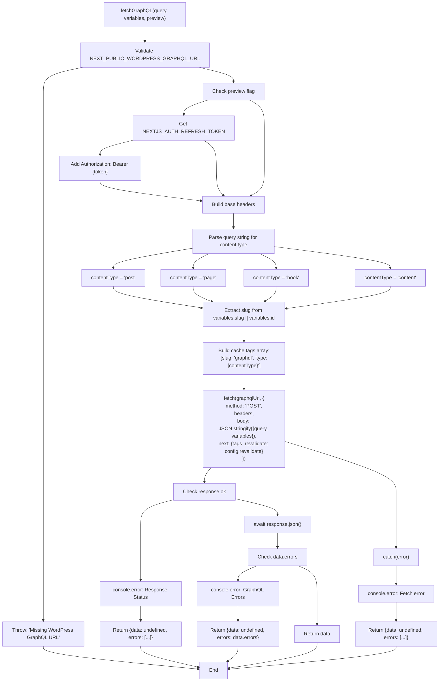
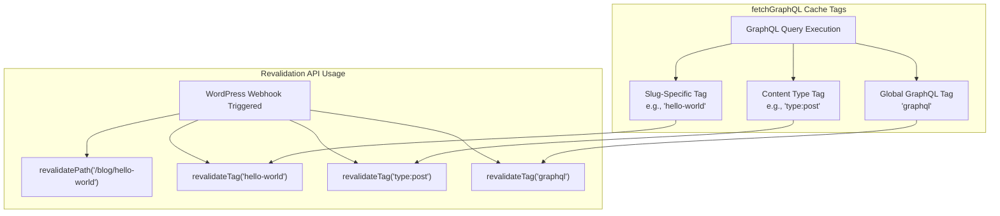
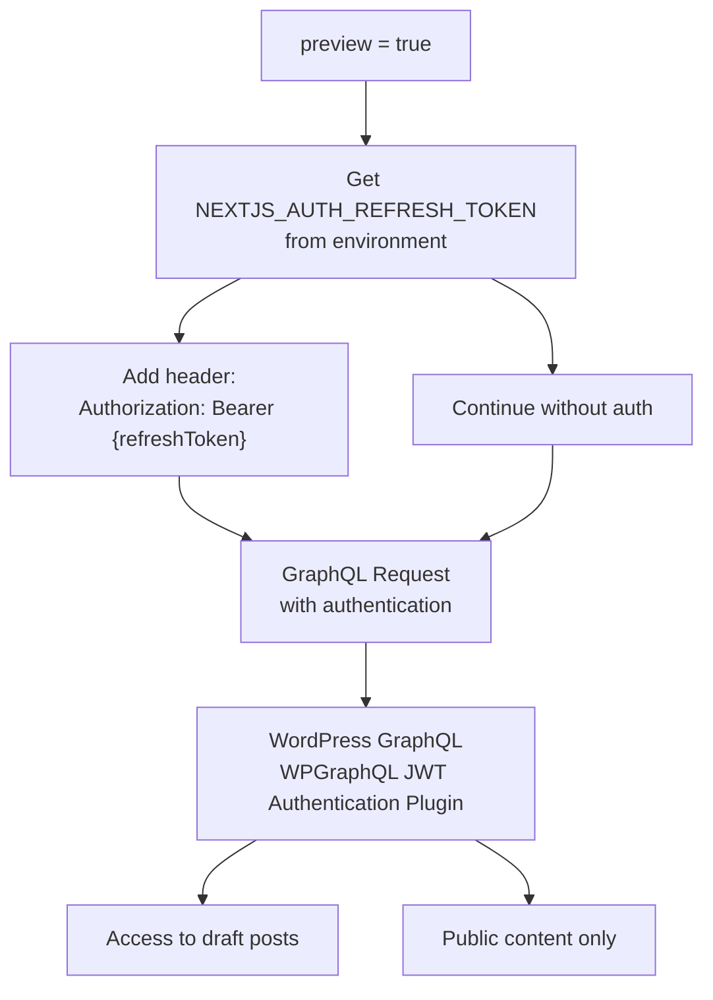
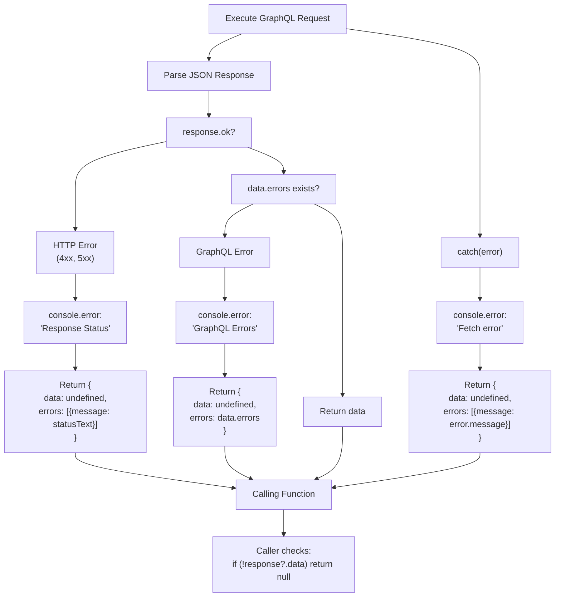
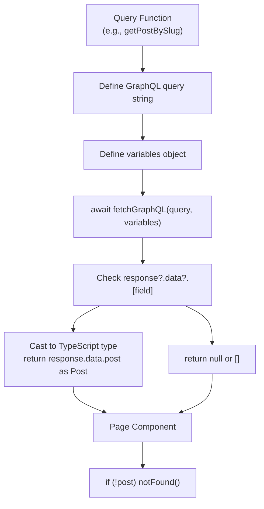
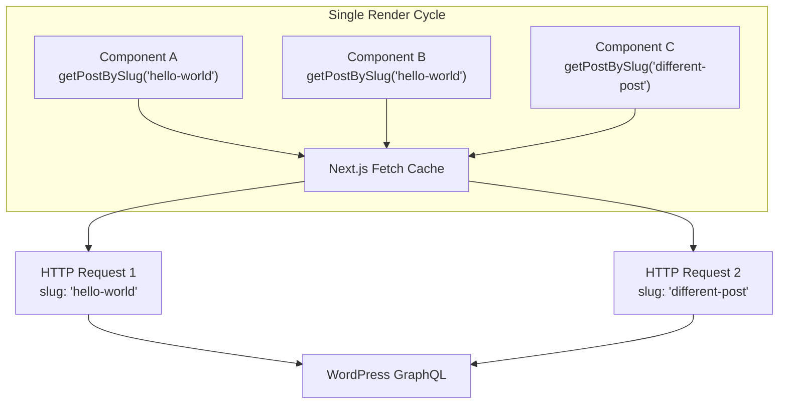

# fetchGraphQL Utility

> **Relevant source files**
> * [AGENTS.md](https://github.com/gregrickaby/nextjs-wordpress/blob/63f3f2f5/AGENTS.md)
> * [CONTRIBUTING.md](https://github.com/gregrickaby/nextjs-wordpress/blob/63f3f2f5/CONTRIBUTING.md)
> * [README.md](https://github.com/gregrickaby/nextjs-wordpress/blob/63f3f2f5/README.md)
> * [components/CommentForm.test.tsx](https://github.com/gregrickaby/nextjs-wordpress/blob/63f3f2f5/components/CommentForm.test.tsx)
> * [components/Footer.test.tsx](https://github.com/gregrickaby/nextjs-wordpress/blob/63f3f2f5/components/Footer.test.tsx)
> * [components/Header.test.tsx](https://github.com/gregrickaby/nextjs-wordpress/blob/63f3f2f5/components/Header.test.tsx)
> * [components/SearchForm.test.tsx](https://github.com/gregrickaby/nextjs-wordpress/blob/63f3f2f5/components/SearchForm.test.tsx)
> * [lib/functions.test.ts](https://github.com/gregrickaby/nextjs-wordpress/blob/63f3f2f5/lib/functions.test.ts)
> * [lib/functions.ts](https://github.com/gregrickaby/nextjs-wordpress/blob/63f3f2f5/lib/functions.ts)
> * [lib/queries/getAllBooks.ts](https://github.com/gregrickaby/nextjs-wordpress/blob/63f3f2f5/lib/queries/getAllBooks.ts)
> * [lib/queries/getAllPosts.test.ts](https://github.com/gregrickaby/nextjs-wordpress/blob/63f3f2f5/lib/queries/getAllPosts.test.ts)
> * [lib/queries/getAllPosts.ts](https://github.com/gregrickaby/nextjs-wordpress/blob/63f3f2f5/lib/queries/getAllPosts.ts)
> * [lib/queries/getBookBySlug.ts](https://github.com/gregrickaby/nextjs-wordpress/blob/63f3f2f5/lib/queries/getBookBySlug.ts)
> * [lib/queries/getPageBySlug.ts](https://github.com/gregrickaby/nextjs-wordpress/blob/63f3f2f5/lib/queries/getPageBySlug.ts)
> * [lib/queries/getPostBySlug.test.ts](https://github.com/gregrickaby/nextjs-wordpress/blob/63f3f2f5/lib/queries/getPostBySlug.test.ts)
> * [lib/queries/getPostBySlug.ts](https://github.com/gregrickaby/nextjs-wordpress/blob/63f3f2f5/lib/queries/getPostBySlug.ts)
> * [test-utils/domShims.ts](https://github.com/gregrickaby/nextjs-wordpress/blob/63f3f2f5/test-utils/domShims.ts)
> * [vitest.config.ts](https://github.com/gregrickaby/nextjs-wordpress/blob/63f3f2f5/vitest.config.ts)

## Purpose and Scope

The `fetchGraphQL` function is the core data access utility that serves as the single point of communication between the Next.js frontend and the WordPress GraphQL API. This page documents the function's implementation, caching strategy, error handling, authentication mechanism, and integration patterns.

For information about the GraphQL query functions that use this utility, see [GraphQL Queries](/gregrickaby/nextjs-wordpress/5.1-graphql-queries). For details about caching and revalidation strategies, see [Caching and Revalidation](/gregrickaby/nextjs-wordpress/3.3-caching-and-revalidation).

**Sources:** [lib/functions.ts L4-L88](https://github.com/gregrickaby/nextjs-wordpress/blob/63f3f2f5/lib/functions.ts#L4-L88)

---

## Function Overview

### Location and Signature

The `fetchGraphQL` function is exported from [lib/functions.ts L7-L11](https://github.com/gregrickaby/nextjs-wordpress/blob/63f3f2f5/lib/functions.ts#L7-L11)

 with the following signature:

```javascript
async function fetchGraphQL<T = any>(
  query: string,
  variables?: {[key: string]: any},
  preview = false
): Promise<GraphQLResponse<T>>
```

**Parameters:**

| Parameter | Type | Default | Description |
| --- | --- | --- | --- |
| `query` | `string` | Required | GraphQL query or mutation string |
| `variables` | `{[key: string]: any}` | `undefined` | Variables to pass to the GraphQL operation |
| `preview` | `boolean` | `false` | Enables JWT authentication for draft content access |

**Return Type:**

Returns `Promise<GraphQLResponse<T>>` where `GraphQLResponse` is defined in [lib/types.d.ts](https://github.com/gregrickaby/nextjs-wordpress/blob/63f3f2f5/lib/types.d.ts)

 as:

```
interface GraphQLResponse<T> {
  data?: T
  errors?: Array<{message: string}>
}
```

**Sources:** [lib/functions.ts L7-L11](https://github.com/gregrickaby/nextjs-wordpress/blob/63f3f2f5/lib/functions.ts#L7-L11)

 [lib/types.d.ts](https://github.com/gregrickaby/nextjs-wordpress/blob/63f3f2f5/lib/types.d.ts)

---

## Request Flow

### Complete Request Lifecycle



**Sources:** [lib/functions.ts L12-L88](https://github.com/gregrickaby/nextjs-wordpress/blob/63f3f2f5/lib/functions.ts#L12-L88)

---

## Environment Configuration

### Required Environment Variables

The function depends on environment variables defined in `.env.local`:

| Variable | Purpose | Required For | Example |
| --- | --- | --- | --- |
| `NEXT_PUBLIC_WORDPRESS_GRAPHQL_URL` | WordPress GraphQL endpoint | All requests | `https://blog.nextjswp.com/graphql` |
| `NEXTJS_AUTH_REFRESH_TOKEN` | JWT refresh token | Preview mode only | Generated via WordPress GraphiQL |
| `NEXT_PUBLIC_WORDPRESS_REST_API_URL` | WordPress REST API endpoint | Search functionality only | `https://blog.nextjswp.com/wp-json/wp/v2` |

**Validation:** The function validates `NEXT_PUBLIC_WORDPRESS_GRAPHQL_URL` at [lib/functions.ts L14-L17](https://github.com/gregrickaby/nextjs-wordpress/blob/63f3f2f5/lib/functions.ts#L14-L17)

 and throws an error if missing.

**Sources:** [lib/functions.ts L14-L17](https://github.com/gregrickaby/nextjs-wordpress/blob/63f3f2f5/lib/functions.ts#L14-L17)

 [README.md L73-L86](https://github.com/gregrickaby/nextjs-wordpress/blob/63f3f2f5/README.md#L73-L86)

---

## Cache Strategy

### Cache Tag Architecture

The function implements a three-tier cache tagging system to enable granular revalidation:



### Cache Tag Generation Logic

Located at [lib/functions.ts L33-L54](https://github.com/gregrickaby/nextjs-wordpress/blob/63f3f2f5/lib/functions.ts#L33-L54)

:

1. **Slug Extraction** [lib/functions.ts L34](https://github.com/gregrickaby/nextjs-wordpress/blob/63f3f2f5/lib/functions.ts#L34-L34) : * Extracts slug from `variables.slug` or `variables.id` * Defaults to `'unknown'` if neither exists
2. **Content Type Detection** [lib/functions.ts L35-L42](https://github.com/gregrickaby/nextjs-wordpress/blob/63f3f2f5/lib/functions.ts#L35-L42) : * Inspects query string for keywords * Sets `contentType` to `'post'`, `'page'`, `'book'`, or `'content'`
3. **Tag Array Construction** [lib/functions.ts L53](https://github.com/gregrickaby/nextjs-wordpress/blob/63f3f2f5/lib/functions.ts#L53-L53) : ``` tags: [slug, 'graphql', `type:${contentType}`] ```

### Time-Based Revalidation

The function uses Next.js ISR (Incremental Static Regeneration) via [lib/functions.ts L54](https://github.com/gregrickaby/nextjs-wordpress/blob/63f3f2f5/lib/functions.ts#L54-L54)

:

```yaml
next: {
  tags: [slug, 'graphql', `type:${contentType}`],
  revalidate: config.revalidate  // Default: 3600 seconds (1 hour)
}
```

**Configuration:** The `revalidate` value is set in [lib/config.ts](https://github.com/gregrickaby/nextjs-wordpress/blob/63f3f2f5/lib/config.ts)

 and defaults to 3600 seconds.

**Sources:** [lib/functions.ts L33-L56](https://github.com/gregrickaby/nextjs-wordpress/blob/63f3f2f5/lib/functions.ts#L33-L56)

 [lib/config.ts](https://github.com/gregrickaby/nextjs-wordpress/blob/63f3f2f5/lib/config.ts)

---

## Authentication and Preview Mode

### JWT Bearer Token Authentication

When `preview = true`, the function adds JWT authentication to access draft content:



**Implementation:** [lib/functions.ts L20-L31](https://github.com/gregrickaby/nextjs-wordpress/blob/63f3f2f5/lib/functions.ts#L20-L31)

```javascript
const refreshToken = process.env.NEXTJS_AUTH_REFRESH_TOKEN

const headers: {[key: string]: string} = {
  'Content-Type': 'application/json'
}

if (preview && refreshToken) {
  headers['Authorization'] = `Bearer ${refreshToken}`
}
```

**Usage Example:** The preview page calls `fetchGraphQL` with `preview = true` at [lib/queries/getPreview.ts](https://github.com/gregrickaby/nextjs-wordpress/blob/63f3f2f5/lib/queries/getPreview.ts)

**Sources:** [lib/functions.ts L20-L31](https://github.com/gregrickaby/nextjs-wordpress/blob/63f3f2f5/lib/functions.ts#L20-L31)

 [README.md L184-L224](https://github.com/gregrickaby/nextjs-wordpress/blob/63f3f2f5/README.md#L184-L224)

---

## Error Handling

### Graceful Degradation Strategy

The function implements a non-throwing error handling pattern that returns structured error responses:



### Error Response Structure

All error scenarios return a consistent `GraphQLResponse<T>` structure:

```yaml
{
  data: undefined,
  errors: Array<{message: string}>
}
```

**Error Types Handled:**

| Error Type | Location | Return Behavior |
| --- | --- | --- |
| Missing environment variable | [lib/functions.ts L14-L17](https://github.com/gregrickaby/nextjs-wordpress/blob/63f3f2f5/lib/functions.ts#L14-L17) | Throws Error (startup failure) |
| HTTP error (non-200 status) | [lib/functions.ts L59-L62](https://github.com/gregrickaby/nextjs-wordpress/blob/63f3f2f5/lib/functions.ts#L59-L62) | Returns `{data: undefined, errors: [...]}` |
| GraphQL errors in response | [lib/functions.ts L68-L74](https://github.com/gregrickaby/nextjs-wordpress/blob/63f3f2f5/lib/functions.ts#L68-L74) | Returns `{data: undefined, errors: data.errors}` |
| Network/fetch errors | [lib/functions.ts L78-L87](https://github.com/gregrickaby/nextjs-wordpress/blob/63f3f2f5/lib/functions.ts#L78-L87) | Returns `{data: undefined, errors: [...]}` |

### Consumer Pattern

Query functions that use `fetchGraphQL` follow this pattern for null safety [lib/queries/getPostBySlug.ts L76-L82](https://github.com/gregrickaby/nextjs-wordpress/blob/63f3f2f5/lib/queries/getPostBySlug.ts#L76-L82)

:

```javascript
const response = await fetchGraphQL(query, variables)

if (!response?.data?.post) {
  return null  // Graceful degradation
}

return response.data.post as Post
```

**Sources:** [lib/functions.ts L59-L87](https://github.com/gregrickaby/nextjs-wordpress/blob/63f3f2f5/lib/functions.ts#L59-L87)

 [lib/queries/getPostBySlug.ts L76-L82](https://github.com/gregrickaby/nextjs-wordpress/blob/63f3f2f5/lib/queries/getPostBySlug.ts#L76-L82)

---

## Integration with Query Layer

### Query Function Pattern

All GraphQL query functions follow a consistent pattern when calling `fetchGraphQL`:



### Example: getPostBySlug Integration

The [lib/queries/getPostBySlug.ts](https://github.com/gregrickaby/nextjs-wordpress/blob/63f3f2f5/lib/queries/getPostBySlug.ts)

 function demonstrates typical usage:

**Query Definition** [lib/queries/getPostBySlug.ts L8-L70](https://github.com/gregrickaby/nextjs-wordpress/blob/63f3f2f5/lib/queries/getPostBySlug.ts#L8-L70)

:

```javascript
const query = `
  query GetPost($slug: ID!) {
    post(id: $slug, idType: SLUG) {
      databaseId
      title
      // ... other fields
    }
  }
`
```

**Variables** [lib/queries/getPostBySlug.ts L72-L74](https://github.com/gregrickaby/nextjs-wordpress/blob/63f3f2f5/lib/queries/getPostBySlug.ts#L72-L74)

:

```javascript
const variables = {
  slug: slug
}
```

**Execution and Error Handling** [lib/queries/getPostBySlug.ts L76-L82](https://github.com/gregrickaby/nextjs-wordpress/blob/63f3f2f5/lib/queries/getPostBySlug.ts#L76-L82)

:

```javascript
const response = await fetchGraphQL(query, variables)

if (!response?.data?.post) {
  return null
}

return response.data.post as Post
```

### Query Function Locations

All query functions that use `fetchGraphQL` are located in `lib/queries/`:

| Query Function | Return Type | Error Behavior |
| --- | --- | --- |
| `getPostBySlug` | `Post \| null` | Returns `null` |
| `getAllPosts` | `Post[]` | Returns `[]` |
| `getPageBySlug` | `Page \| null` | Returns `null` |
| `getBookBySlug` | `Book \| null` | Returns `null` |
| `getAllBooks` | `Book[]` | Returns `[]` |
| `getMenuBySlug` | `Menu \| null` | Returns `null` |
| `getTagBySlug` | `Tag \| null` | Returns `null` |
| `getCategoryBySlug` | `Category \| null` | Returns `null` |
| `getPreview` | `Post \| Page \| null` | Returns `null` |

**Sources:** [lib/queries/getPostBySlug.ts L1-L84](https://github.com/gregrickaby/nextjs-wordpress/blob/63f3f2f5/lib/queries/getPostBySlug.ts#L1-L84)

 [lib/queries/getAllPosts.ts L1-L46](https://github.com/gregrickaby/nextjs-wordpress/blob/63f3f2f5/lib/queries/getAllPosts.ts#L1-L46)

 [lib/queries/getPageBySlug.ts L1-L54](https://github.com/gregrickaby/nextjs-wordpress/blob/63f3f2f5/lib/queries/getPageBySlug.ts#L1-L54)

 [lib/queries/getBookBySlug.ts L1-L50](https://github.com/gregrickaby/nextjs-wordpress/blob/63f3f2f5/lib/queries/getBookBySlug.ts#L1-L50)

---

## Next.js Fetch Integration

### Native Fetch Enhancement

The function uses Next.js's enhanced `fetch` API with automatic request memoization and caching:

```javascript
const response = await fetch(graphqlUrl, {
  method: 'POST',
  headers,
  body: JSON.stringify({ query, variables }),
  next: {
    tags: [slug, 'graphql', `type:${contentType}`],
    revalidate: config.revalidate
  }
})
```

**Key Features:**

1. **Automatic Memoization** [lib/functions.ts L45-L56](https://github.com/gregrickaby/nextjs-wordpress/blob/63f3f2f5/lib/functions.ts#L45-L56) : * Next.js automatically deduplicates identical `fetch` requests within a single render * Multiple calls to `getPostBySlug('same-slug')` result in only one network request
2. **Cache Tags for On-Demand Revalidation** [lib/functions.ts L53](https://github.com/gregrickaby/nextjs-wordpress/blob/63f3f2f5/lib/functions.ts#L53-L53) : * Enables targeted cache invalidation via `revalidateTag()` * Used by [app/api/revalidate/route.ts](https://github.com/gregrickaby/nextjs-wordpress/blob/63f3f2f5/app/api/revalidate/route.ts)  webhook endpoint
3. **Time-Based Revalidation** [lib/functions.ts L54](https://github.com/gregrickaby/nextjs-wordpress/blob/63f3f2f5/lib/functions.ts#L54-L54) : * Sets ISR revalidation period * Default: 3600 seconds (1 hour) from [lib/config.ts](https://github.com/gregrickaby/nextjs-wordpress/blob/63f3f2f5/lib/config.ts)

**Sources:** [lib/functions.ts L45-L56](https://github.com/gregrickaby/nextjs-wordpress/blob/63f3f2f5/lib/functions.ts#L45-L56)

 [README.md L340](https://github.com/gregrickaby/nextjs-wordpress/blob/63f3f2f5/README.md#L340-L340)

---

## Testing Considerations

### Test Utilities and MSW v2

Tests for code that uses `fetchGraphQL` must use MSW v2 for HTTP mocking. **Never mock `global.fetch` directly.**

**Correct Pattern** [lib/functions.test.ts L17-L37](https://github.com/gregrickaby/nextjs-wordpress/blob/63f3f2f5/lib/functions.test.ts#L17-L37)

:

```javascript
import {server, http, HttpResponse} from '@/test-utils'

it('should fetch GraphQL data successfully', async () => {
  server.use(
    http.post(`${process.env.NEXT_PUBLIC_WORDPRESS_GRAPHQL_URL}`, () => {
      return HttpResponse.json({
        data: {
          posts: {
            nodes: [
              {id: '1', title: 'Post 1'}
            ]
          }
        }
      })
    })
  )

  const response = await fetchGraphQL(testQuery)
  expect(response.data.posts.nodes).toHaveLength(1)
})
```

### Testing Error Scenarios

The test suite at [lib/functions.test.ts](https://github.com/gregrickaby/nextjs-wordpress/blob/63f3f2f5/lib/functions.test.ts)

 validates all error paths:

| Test Case | Scenario | Expected Behavior |
| --- | --- | --- |
| `should handle GraphQL errors` | Response contains `errors` array | Returns `{data: undefined, errors: [...]}` |
| `should handle network errors` | `HttpResponse.error()` | Returns error structure |
| `should handle malformed responses` | Empty JSON object `{}` | Returns `{data: undefined}` |
| `should handle empty response body` | `null` response | Handles gracefully |

**Error Simulation Example** [lib/functions.test.ts L60-L71](https://github.com/gregrickaby/nextjs-wordpress/blob/63f3f2f5/lib/functions.test.ts#L60-L71)

:

```javascript
it('should handle network errors', async () => {
  server.use(
    http.post(`${process.env.NEXT_PUBLIC_WORDPRESS_GRAPHQL_URL}`, () => {
      return HttpResponse.error()
    })
  )

  const response = await fetchGraphQL(testQuery)
  expect(response).toBeDefined()
})
```

### Testing Query Functions

Tests for query functions verify both success and error paths [lib/queries/getPostBySlug.test.ts L77-L92](https://github.com/gregrickaby/nextjs-wordpress/blob/63f3f2f5/lib/queries/getPostBySlug.test.ts#L77-L92)

:

```javascript
it('should return null on API error', async () => {
  server.use(
    http.post(`${process.env.NEXT_PUBLIC_WORDPRESS_GRAPHQL_URL}`, () => {
      return HttpResponse.json(
        { errors: [{message: 'Post not found'}] },
        { status: 404 }
      )
    })
  )

  const post = await getPostBySlug('error-post')
  expect(post).toBeNull()
})
```

**Sources:** [lib/functions.test.ts L5-L274](https://github.com/gregrickaby/nextjs-wordpress/blob/63f3f2f5/lib/functions.test.ts#L5-L274)

 [lib/queries/getPostBySlug.test.ts L1-L94](https://github.com/gregrickaby/nextjs-wordpress/blob/63f3f2f5/lib/queries/getPostBySlug.test.ts#L1-L94)

 [AGENTS.md L320-L414](https://github.com/gregrickaby/nextjs-wordpress/blob/63f3f2f5/AGENTS.md#L320-L414)

---

## Performance Characteristics

### Request Deduplication

Next.js automatically deduplicates identical `fetch` requests during server-side rendering:



**Result:** Components A and B share the same network request and cached result.

### Cache Hit Behavior

After initial generation, cached pages serve instantly until revalidation:

| Cache Status | Response Time | Source |
| --- | --- | --- |
| Cache hit (fresh) | ~1-5ms | Next.js cache |
| Cache hit (stale, regenerating) | ~1-5ms | Stale data served while background revalidation occurs |
| Cache miss | ~100-500ms | WordPress GraphQL request |
| Revalidation triggered | ~100-500ms | On-demand cache invalidation |

**Sources:** [lib/functions.ts L45-L56](https://github.com/gregrickaby/nextjs-wordpress/blob/63f3f2f5/lib/functions.ts#L45-L56)

 [README.md L340](https://github.com/gregrickaby/nextjs-wordpress/blob/63f3f2f5/README.md#L340-L340)

---

## Security Considerations

### Authentication Token Handling

The JWT refresh token is sensitive and must be properly secured:

**Environment Variable Pattern** [lib/functions.ts L20](https://github.com/gregrickaby/nextjs-wordpress/blob/63f3f2f5/lib/functions.ts#L20-L20)

:

* Token stored in `NEXTJS_AUTH_REFRESH_TOKEN` environment variable
* Never committed to version control (excluded via `.gitignore`)
* Only included in requests when `preview = true`

**Token Generation:** See [README.md L186-L224](https://github.com/gregrickaby/nextjs-wordpress/blob/63f3f2f5/README.md#L186-L224)

 for instructions on generating a refresh token via WordPress GraphiQL IDE.

### URL Validation

The function validates the WordPress GraphQL URL at startup [lib/functions.ts L14-L17](https://github.com/gregrickaby/nextjs-wordpress/blob/63f3f2f5/lib/functions.ts#L14-L17)

:

```javascript
const graphqlUrl = process.env.NEXT_PUBLIC_WORDPRESS_GRAPHQL_URL
if (!graphqlUrl) {
  throw new Error('Missing WordPress GraphQL URL environment variable!')
}
```

**Benefit:** Prevents runtime failures by catching configuration errors early.

**Sources:** [lib/functions.ts L14-L17](https://github.com/gregrickaby/nextjs-wordpress/blob/63f3f2f5/lib/functions.ts#L14-L17)

 [lib/functions.ts L20-L31](https://github.com/gregrickaby/nextjs-wordpress/blob/63f3f2f5/lib/functions.ts#L20-L31)

---

## Related Functions

### searchQuery Function

The [lib/functions.ts L95-L141](https://github.com/gregrickaby/nextjs-wordpress/blob/63f3f2f5/lib/functions.ts#L95-L141)

 file also exports `searchQuery`, which uses the WordPress REST API instead of GraphQL:

```javascript
export async function searchQuery(query: string): Promise<SearchResults[]>
```

**Key Differences from fetchGraphQL:**

| Aspect | `fetchGraphQL` | `searchQuery` |
| --- | --- | --- |
| API | WordPress GraphQL | WordPress REST API |
| Endpoint | `NEXT_PUBLIC_WORDPRESS_GRAPHQL_URL` | `NEXT_PUBLIC_WORDPRESS_REST_API_URL` |
| HTTP Method | `POST` | `GET` |
| Authentication | JWT Bearer token | None |
| Cache Tags | `[slug, 'graphql', 'type:{contentType}']` | `['search-{query}']` |
| Error Behavior | Returns structured error object | Returns `[]` |

**Rationale:** WordPress REST API's search functionality is more mature than WPGraphQL's search implementation.

**Sources:** [lib/functions.ts L95-L141](https://github.com/gregrickaby/nextjs-wordpress/blob/63f3f2f5/lib/functions.ts#L95-L141)

 [README.md L238](https://github.com/gregrickaby/nextjs-wordpress/blob/63f3f2f5/README.md#L238-L238)