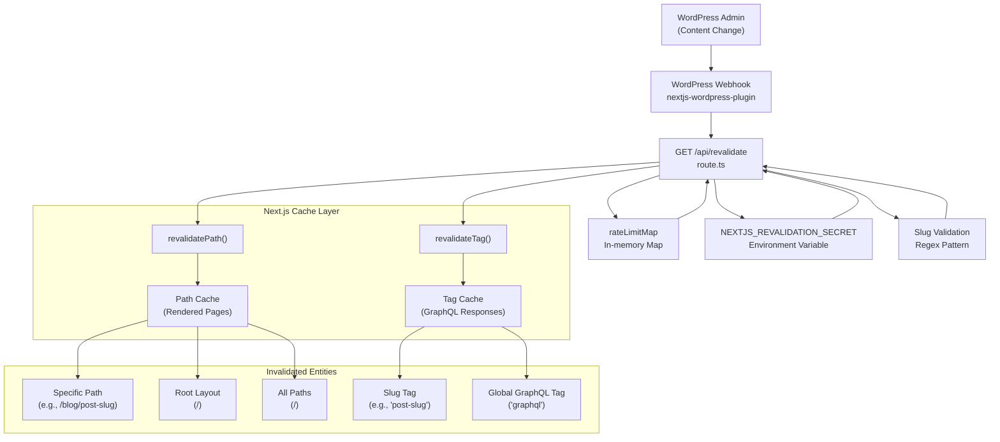
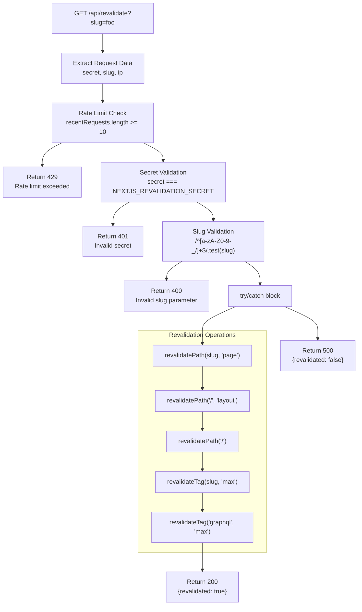
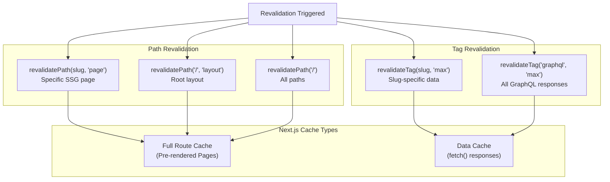

# On-Demand Revalidation

> **Relevant source files**
> * [AGENTS.md](https://github.com/gregrickaby/nextjs-wordpress/blob/63f3f2f5/AGENTS.md)
> * [CONTRIBUTING.md](https://github.com/gregrickaby/nextjs-wordpress/blob/63f3f2f5/CONTRIBUTING.md)
> * [README.md](https://github.com/gregrickaby/nextjs-wordpress/blob/63f3f2f5/README.md)
> * [app/api/revalidate/route.ts](https://github.com/gregrickaby/nextjs-wordpress/blob/63f3f2f5/app/api/revalidate/route.ts)
> * app/blog/category/[slug]/page.tsx
> * app/blog/tag/[slug]/page.tsx
> * app/preview/[slug]/page.tsx

## Purpose and Scope

This document describes the on-demand revalidation system that enables WordPress content changes to immediately invalidate Next.js cache entries. When content is created, updated, or deleted in WordPress, a webhook triggers the revalidation API endpoint, which purges stale cached data and pages.

For information about the overall caching architecture and ISR (Incremental Static Regeneration), see [Caching and Revalidation](/gregrickaby/nextjs-wordpress/3.3-caching-and-revalidation). For details about the `fetchGraphQL` caching implementation, see [fetchGraphQL Utility](/gregrickaby/nextjs-wordpress/5.3-fetchgraphql-utility). For WordPress webhook configuration, see [WordPress Configuration](/gregrickaby/nextjs-wordpress/6.1-wordpress-configuration).

**Sources:** [README.md L19-L34](https://github.com/gregrickaby/nextjs-wordpress/blob/63f3f2f5/README.md#L19-L34)

 [app/api/revalidate/route.ts L1-L149](https://github.com/gregrickaby/nextjs-wordpress/blob/63f3f2f5/app/api/revalidate/route.ts#L1-L149)

---

## System Architecture

The on-demand revalidation system consists of three primary components: the WordPress webhook trigger, the Next.js API route handler, and the cache invalidation logic. WordPress sends authenticated requests to the revalidation endpoint whenever content changes, triggering selective cache purges.

### Revalidation Flow Diagram



**Sources:** [app/api/revalidate/route.ts L1-L149](https://github.com/gregrickaby/nextjs-wordpress/blob/63f3f2f5/app/api/revalidate/route.ts#L1-L149)

 [README.md L149-L161](https://github.com/gregrickaby/nextjs-wordpress/blob/63f3f2f5/README.md#L149-L161)

---

## API Route Handler

The revalidation API is implemented as a Next.js Route Handler at `/app/api/revalidate/route.ts`. It accepts GET requests with specific query parameters and headers.

### Endpoint Details

| Property | Value |
| --- | --- |
| **Route Path** | `/api/revalidate` |
| **HTTP Method** | `GET` |
| **Handler Function** | `GET(request: NextRequest)` |
| **Required Header** | `x-revalidation-secret` |
| **Required Query Param** | `slug` |
| **Response Format** | JSON |

**Sources:** [app/api/revalidate/route.ts L43-L149](https://github.com/gregrickaby/nextjs-wordpress/blob/63f3f2f5/app/api/revalidate/route.ts#L43-L149)

### Request Processing Flow



**Sources:** [app/api/revalidate/route.ts L43-L149](https://github.com/gregrickaby/nextjs-wordpress/blob/63f3f2f5/app/api/revalidate/route.ts#L43-L149)

---

## Security Mechanisms

The revalidation endpoint implements three layers of security to prevent abuse and unauthorized cache invalidation.

### Rate Limiting

Rate limiting is implemented using an in-memory `Map<string, number[]>` that tracks request timestamps per IP address.

| Configuration | Value |
| --- | --- |
| **Storage** | `rateLimitMap` (in-memory Map) |
| **Window** | `RATE_LIMIT_WINDOW_MS` = 60,000 ms (1 minute) |
| **Max Requests** | `RATE_LIMIT_MAX_REQUESTS` = 10 per window |
| **Identifier** | IP address from `x-forwarded-for` header |
| **Response Status** | `429 Too Many Requests` |
| **Retry-After Header** | `60` seconds |

**Implementation:**

```javascript
// Extract from app/api/revalidate/route.ts:39-70
const rateLimitMap = new Map<string, number[]>()
const now = Date.now()
const requests = rateLimitMap.get(ip) || []
const recentRequests = requests.filter(
  (time) => now - time < RATE_LIMIT_WINDOW_MS
)

if (recentRequests.length >= RATE_LIMIT_MAX_REQUESTS) {
  return new Response(
    JSON.stringify({revalidated: false, message: 'Rate limit exceeded'}),
    {status: 429, headers: {'Retry-After': '60'}}
  )
}
```

**Production Warning:** The in-memory `Map` does not work across serverless instances (Vercel, AWS Lambda). For production, use Redis (Upstash), Vercel KV, or another distributed cache.

**Sources:** [app/api/revalidate/route.ts L29-L70](https://github.com/gregrickaby/nextjs-wordpress/blob/63f3f2f5/app/api/revalidate/route.ts#L29-L70)

 [README.md L389-L395](https://github.com/gregrickaby/nextjs-wordpress/blob/63f3f2f5/README.md#L389-L395)

### Secret Validation

The endpoint validates a secret token passed via the `x-revalidation-secret` header against the `NEXTJS_REVALIDATION_SECRET` environment variable.

**Validation Logic:**

```
// app/api/revalidate/route.ts:72-84
if (!secret || secret !== process.env.NEXTJS_REVALIDATION_SECRET) {
  return new Response(
    JSON.stringify({revalidated: false, message: 'Invalid secret'}),
    {status: 401}
  )
}
```

**Environment Configuration:**

| Location | Variable/Constant |
| --- | --- |
| **Next.js** | `NEXTJS_REVALIDATION_SECRET` in `.env` |
| **WordPress** | `NEXTJS_REVALIDATION_SECRET` in `wp-config.php` |
| **Required Match** | Values must be identical |

**Sources:** [app/api/revalidate/route.ts L72-L84](https://github.com/gregrickaby/nextjs-wordpress/blob/63f3f2f5/app/api/revalidate/route.ts#L72-L84)

 [README.md L85-L86](https://github.com/gregrickaby/nextjs-wordpress/blob/63f3f2f5/README.md#L85-L86)

 [README.md L159-L160](https://github.com/gregrickaby/nextjs-wordpress/blob/63f3f2f5/README.md#L159-L160)

### Slug Validation

The endpoint validates the `slug` query parameter using a regex pattern to prevent path traversal attacks and code injection.

**Validation Rules:**

| Property | Value |
| --- | --- |
| **Pattern** | `/^[a-zA-Z0-9-_/]+$/` |
| **Allowed Characters** | Alphanumeric, hyphens, underscores, forward slashes |
| **Disallowed** | Dots (`.`), backslashes (`\`), special characters |
| **Purpose** | Prevent path traversal and injection attacks |

**Implementation:**

```
// app/api/revalidate/route.ts:86-98
if (!slug || !/^[a-zA-Z0-9-_/]+$/.test(slug)) {
  return new Response(
    JSON.stringify({revalidated: false, message: 'Invalid slug parameter.'}),
    {status: 400}
  )
}
```

**Sources:** [app/api/revalidate/route.ts L86-L98](https://github.com/gregrickaby/nextjs-wordpress/blob/63f3f2f5/app/api/revalidate/route.ts#L86-L98)

---

## Revalidation Strategy

The revalidation API employs an aggressive cache invalidation strategy that targets multiple cache layers to ensure content freshness.

### Cache Invalidation Operations



**Sources:** [app/api/revalidate/route.ts L100-L112](https://github.com/gregrickaby/nextjs-wordpress/blob/63f3f2f5/app/api/revalidate/route.ts#L100-L112)

### Invalidation Execution Order

The revalidation operations execute in the following sequence:

1. **`revalidatePath(slug, 'page')`** - Invalidates the specific SSG page (e.g., `/blog/hello-world`)
2. **`revalidatePath('/', 'layout')`** - Invalidates the root layout cache
3. **`revalidatePath('/')`** - Invalidates all paths (broad invalidation)
4. **`revalidateTag(slug, 'max')`** - Invalidates GraphQL responses tagged with the slug
5. **`revalidateTag('graphql', 'max')`** - Invalidates all GraphQL responses tagged with `'graphql'`

**Tag Strategy:**

The `'graphql'` tag is applied to all `fetchGraphQL` responses in [lib/functions.ts](https://github.com/gregrickaby/nextjs-wordpress/blob/63f3f2f5/lib/functions.ts)

 When content changes, invalidating this global tag ensures that cached GraphQL data is refetched on the next request.

**Sources:** [app/api/revalidate/route.ts L100-L112](https://github.com/gregrickaby/nextjs-wordpress/blob/63f3f2f5/app/api/revalidate/route.ts#L100-L112)

 [app/api/revalidate/route.ts L8-L13](https://github.com/gregrickaby/nextjs-wordpress/blob/63f3f2f5/app/api/revalidate/route.ts#L8-L13)

### Response Format

#### Success Response (200)

```json
{
  "revalidated": true,
  "revalidatePath": "blog/hello-world",
  "revalidateTags": ["blog/hello-world", "graphql"],
  "revalidationTime": 1699999999999
}
```

#### Error Responses

| Status | Condition | Message |
| --- | --- | --- |
| `429` | Rate limit exceeded | `"Rate limit exceeded"` |
| `401` | Invalid secret | `"Invalid secret"` |
| `400` | Invalid slug | `"Invalid slug parameter."` |
| `500` | Revalidation error | Error message from exception |

**Sources:** [app/api/revalidate/route.ts L114-L148](https://github.com/gregrickaby/nextjs-wordpress/blob/63f3f2f5/app/api/revalidate/route.ts#L114-L148)

---

## WordPress Integration

The WordPress side triggers revalidation via webhooks using the **Next.js WordPress Plugin** and custom constants in `wp-config.php`.

### WordPress Configuration

#### Required wp-config.php Constants

```
// The URL of your Next.js frontend. Include the trailing slash.
define( 'NEXTJS_FRONTEND_URL', 'https://nextjswp.com/' );

// Any random string. This must match the .env variable in Next.js.
define( 'NEXTJS_REVALIDATION_SECRET', 'revalidate' );
```

**Sources:** [README.md L149-L161](https://github.com/gregrickaby/nextjs-wordpress/blob/63f3f2f5/README.md#L149-L161)

#### WordPress Plugin

The **Next.js WordPress Plugin** (GitHub: `gregrickaby/nextjs-wordpress-plugin`) handles webhook triggers when content is saved, updated, or deleted.

**Webhook Behavior:**

| Event | Action |
| --- | --- |
| Post published/updated | Triggers revalidation webhook |
| Page published/updated | Triggers revalidation webhook |
| Post/page deleted | Triggers revalidation webhook |
| Draft saved | No webhook (preview mode only) |

**Sources:** [README.md L133-L138](https://github.com/gregrickaby/nextjs-wordpress/blob/63f3f2f5/README.md#L133-L138)

### Webhook Request Format

The WordPress plugin sends GET requests to the Next.js revalidation endpoint:

```yaml
GET https://nextjswp.com/api/revalidate?slug=blog/hello-world
Headers:
  x-revalidation-secret: revalidate
```

**Query Parameters:**

* `slug` - The post/page slug (e.g., `blog/hello-world`, `about`, `books/book-slug`)

**Headers:**

* `x-revalidation-secret` - The shared secret for authentication

**Sources:** [app/api/revalidate/route.ts L18-L21](https://github.com/gregrickaby/nextjs-wordpress/blob/63f3f2f5/app/api/revalidate/route.ts#L18-L21)

 [README.md L149-L161](https://github.com/gregrickaby/nextjs-wordpress/blob/63f3f2f5/README.md#L149-L161)

---

## Environment Configuration

Both Next.js and WordPress require synchronized configuration for revalidation to function correctly.

### Next.js Environment Variables

**File:** `.env` or `.env.local`

```markdown
# Revalidation Secret. Must match the constant in wp-config.php.
NEXTJS_REVALIDATION_SECRET="revalidate"
```

**Sources:** [README.md L64-L87](https://github.com/gregrickaby/nextjs-wordpress/blob/63f3f2f5/README.md#L64-L87)

### WordPress Configuration

**File:** `wp-config.php`

```
// The URL of your Next.js frontend. Include the trailing slash.
define( 'NEXTJS_FRONTEND_URL', 'https://nextjswp.com/' );

// Any random string. This must match the .env variable in the Next.js frontend.
define( 'NEXTJS_REVALIDATION_SECRET', 'revalidate' );
```

**Configuration Requirements:**

| Requirement | Description |
| --- | --- |
| **Secret Match** | `NEXTJS_REVALIDATION_SECRET` must be identical in both environments |
| **Frontend URL** | WordPress must know the Next.js URL to send webhooks |
| **Plugin Installation** | `nextjs-wordpress-plugin` must be active |
| **Theme Installation** | `nextjs-wordpress-theme` recommended |

**Sources:** [README.md L149-L161](https://github.com/gregrickaby/nextjs-wordpress/blob/63f3f2f5/README.md#L149-L161)

---

## Production Considerations

### Rate Limiting in Serverless Environments

**Critical Production Issue:** The in-memory `rateLimitMap` does not persist across serverless function invocations. Each instance maintains its own `Map`, making the rate limiting ineffective.

**Recommended Solutions:**

| Solution | Use Case | Implementation |
| --- | --- | --- |
| **Upstash Redis** | Serverless environments (Vercel, Netlify) | Distributed key-value store with TTL support |
| **Vercel KV** | Vercel deployments | Native Vercel key-value storage |
| **Redis Cloud** | Any cloud environment | Self-hosted or managed Redis instance |
| **DynamoDB** | AWS Lambda | AWS-native key-value store |

**Implementation Pattern:**

```javascript
// Replace in-memory Map with distributed cache
const rateLimit = await redis.get(`rate_limit:${ip}`)
const requests = rateLimit ? JSON.parse(rateLimit) : []
// ... rate limiting logic
await redis.set(`rate_limit:${ip}`, JSON.stringify(requests), {ex: 60})
```

**Sources:** [app/api/revalidate/route.ts L29-L38](https://github.com/gregrickaby/nextjs-wordpress/blob/63f3f2f5/app/api/revalidate/route.ts#L29-L38)

 [README.md L389-L395](https://github.com/gregrickaby/nextjs-wordpress/blob/63f3f2f5/README.md#L389-L395)

### Security Headers

All revalidation responses include security headers to prevent indexing and caching:

```
headers: {
  'Content-Type': 'application/json',
  'X-Robots-Tag': 'noindex',
  'Retry-After': '60' // Only on 429 responses
}
```

**Sources:** [app/api/revalidate/route.ts L60-L64](https://github.com/gregrickaby/nextjs-wordpress/blob/63f3f2f5/app/api/revalidate/route.ts#L60-L64)

### Monitoring and Logging

The revalidation API returns detailed responses that can be used for monitoring:

```json
{
  "revalidated": true,
  "revalidatePath": "blog/hello-world",
  "revalidateTags": ["blog/hello-world", "graphql"],
  "revalidationTime": 1699999999999
}
```

**Recommended Monitoring:**

* Track `revalidated: false` responses (errors)
* Monitor 429 rate limit responses
* Alert on 401 authentication failures
* Log revalidation times for performance analysis

**Sources:** [app/api/revalidate/route.ts L114-L127](https://github.com/gregrickaby/nextjs-wordpress/blob/63f3f2f5/app/api/revalidate/route.ts#L114-L127)

---

## Usage Examples

### Testing the Endpoint Locally

```css
# Successful revalidation
curl -H "x-revalidation-secret: revalidate" \
  "http://localhost:3000/api/revalidate?slug=blog/hello-world"

# Response:
# {"revalidated":true,"revalidatePath":"blog/hello-world","revalidateTags":["blog/hello-world","graphql"],...}
```

### Error Scenarios

**Missing Secret:**

```css
curl "http://localhost:3000/api/revalidate?slug=blog/hello-world"
# {"revalidated":false,"message":"Invalid secret"}
# Status: 401
```

**Invalid Slug (Path Traversal Attempt):**

```css
curl -H "x-revalidation-secret: revalidate" \
  "http://localhost:3000/api/revalidate?slug=../../etc/passwd"
# {"revalidated":false,"message":"Invalid slug parameter."}
# Status: 400
```

**Rate Limit Exceeded:**

```css
# After 10 requests within 60 seconds
curl -H "x-revalidation-secret: revalidate" \
  "http://localhost:3000/api/revalidate?slug=blog/hello-world"
# {"revalidated":false,"message":"Rate limit exceeded"}
# Status: 429
```

**Sources:** [app/api/revalidate/route.ts L43-L149](https://github.com/gregrickaby/nextjs-wordpress/blob/63f3f2f5/app/api/revalidate/route.ts#L43-L149)

---

## Integration with Cache System

The revalidation API integrates with Next.js caching mechanisms documented in [Caching and Revalidation](/gregrickaby/nextjs-wordpress/3.3-caching-and-revalidation).

### Cache Tag Assignment

GraphQL queries in the `fetchGraphQL` function apply cache tags to `fetch()` responses:

```javascript
// In lib/functions.ts
const response = await fetch(url, {
  method: 'POST',
  headers: {...},
  body: JSON.stringify({query, variables}),
  next: {
    tags: ['graphql', slug] // Global and slug-specific tags
  }
})
```

When `revalidateTag('graphql')` is called, all responses tagged with `'graphql'` are invalidated, forcing Next.js to refetch data on the next request.

**Sources:** [app/api/revalidate/route.ts L110-L112](https://github.com/gregrickaby/nextjs-wordpress/blob/63f3f2f5/app/api/revalidate/route.ts#L110-L112)

### Path and Layout Invalidation

The `revalidatePath()` calls target the Full Route Cache:

| Call | Target | Effect |
| --- | --- | --- |
| `revalidatePath(slug, 'page')` | Specific SSG page | Invalidates single pre-rendered page |
| `revalidatePath('/', 'layout')` | Root layout | Invalidates layout (Header, Footer) |
| `revalidatePath('/')` | All paths | Invalidates entire route cache |

**Sources:** [app/api/revalidate/route.ts L101-L108](https://github.com/gregrickaby/nextjs-wordpress/blob/63f3f2f5/app/api/revalidate/route.ts#L101-L108)

---

## Related Systems

* **[Caching and Revalidation](/gregrickaby/nextjs-wordpress/3.3-caching-and-revalidation)** - Overall Next.js caching architecture and ISR configuration
* **[fetchGraphQL Utility](/gregrickaby/nextjs-wordpress/5.3-fetchgraphql-utility)** - How GraphQL responses are cached with tags
* **[WordPress Configuration](/gregrickaby/nextjs-wordpress/6.1-wordpress-configuration)** - WordPress plugin and wp-config.php setup
* **[Preview Mode](/gregrickaby/nextjs-wordpress/6.2-preview-mode)** - Previewing draft content without cache invalidation

**Sources:** [README.md L1-L420](https://github.com/gregrickaby/nextjs-wordpress/blob/63f3f2f5/README.md#L1-L420)

 [app/api/revalidate/route.ts L1-L149](https://github.com/gregrickaby/nextjs-wordpress/blob/63f3f2f5/app/api/revalidate/route.ts#L1-L149)