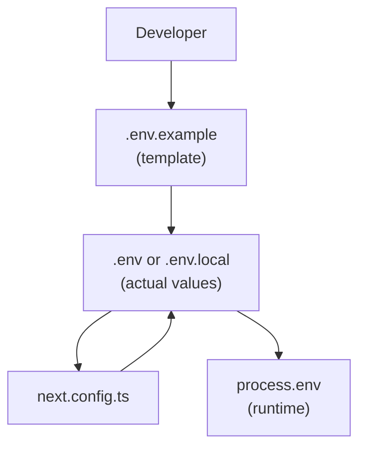
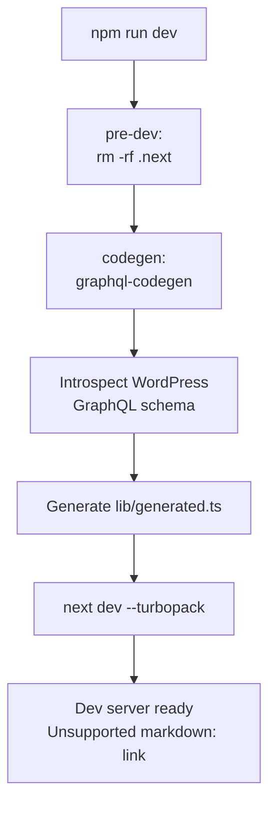
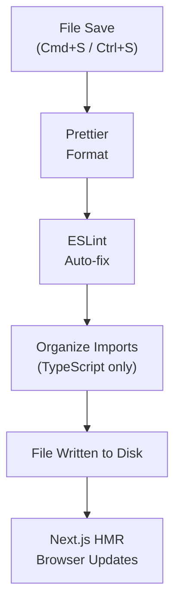
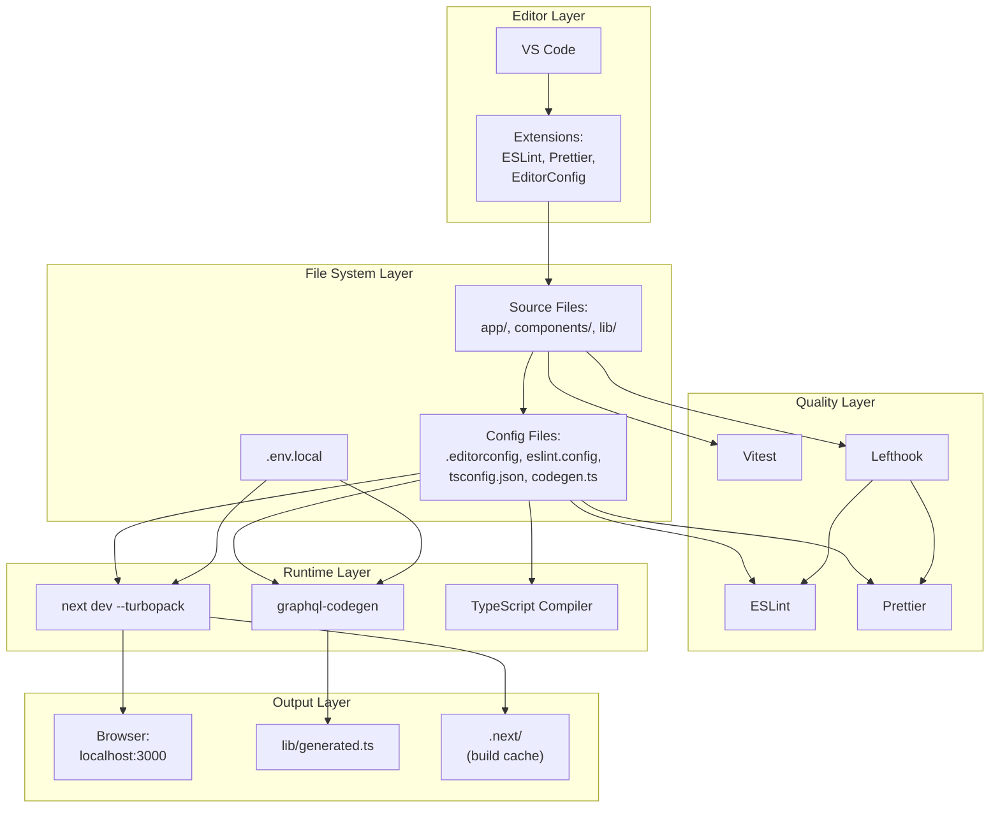
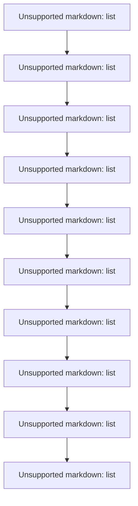
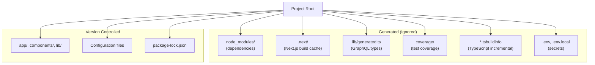

# Development Environment

> **Relevant source files**
> * [.editorconfig](https://github.com/gregrickaby/nextjs-wordpress/blob/63f3f2f5/.editorconfig)
> * [.env.example](https://github.com/gregrickaby/nextjs-wordpress/blob/63f3f2f5/.env.example)
> * [.gitignore](https://github.com/gregrickaby/nextjs-wordpress/blob/63f3f2f5/.gitignore)
> * [.vscode/extensions.json](https://github.com/gregrickaby/nextjs-wordpress/blob/63f3f2f5/.vscode/extensions.json)
> * [.vscode/settings.json](https://github.com/gregrickaby/nextjs-wordpress/blob/63f3f2f5/.vscode/settings.json)
> * [AGENTS.md](https://github.com/gregrickaby/nextjs-wordpress/blob/63f3f2f5/AGENTS.md)
> * [CONTRIBUTING.md](https://github.com/gregrickaby/nextjs-wordpress/blob/63f3f2f5/CONTRIBUTING.md)
> * [README.md](https://github.com/gregrickaby/nextjs-wordpress/blob/63f3f2f5/README.md)
> * [scripts/sonar-analysis.sh](https://github.com/gregrickaby/nextjs-wordpress/blob/63f3f2f5/scripts/sonar-analysis.sh)
> * [sonar-project.properties](https://github.com/gregrickaby/nextjs-wordpress/blob/63f3f2f5/sonar-project.properties)

## Purpose and Scope

This page documents the local development environment setup for the Next.js WordPress headless frontend. It covers Node.js requirements, package management, environment configuration, development server workflow, and the integration of quality tools during development.

For specific editor configuration details, see [VS Code Configuration](/gregrickaby/nextjs-wordpress/7.1-vs-code-configuration). For code quality tool configuration (ESLint, Prettier, SonarQube), see [Code Quality Tools](/gregrickaby/nextjs-wordpress/7.2-code-quality-tools). For pre-commit validation setup, see [Git Hooks](/gregrickaby/nextjs-wordpress/7.3-git-hooks).

---

## Node.js and Package Manager

### Node.js Version

The project requires **Node.js v22.12.0** as specified in [.nvmrc](https://github.com/gregrickaby/nextjs-wordpress/blob/63f3f2f5/.nvmrc)

 Using the exact version ensures consistency across development, CI, and production environments.

**Installation with nvm:**

```

```

The `nvm use` command reads [.nvmrc](https://github.com/gregrickaby/nextjs-wordpress/blob/63f3f2f5/.nvmrc)

 and switches to the required Node version. The `.nvmrc` file contains a single line specifying the version.

**Sources:** [README.md L58-L62](https://github.com/gregrickaby/nextjs-wordpress/blob/63f3f2f5/README.md#L58-L62)

### Package Manager

The project uses **npm** (bundled with Node.js) for dependency management. No alternative package managers (yarn, pnpm) are configured or supported.

**Sources:** [README.md L58-L62](https://github.com/gregrickaby/nextjs-wordpress/blob/63f3f2f5/README.md#L58-L62)

 [CONTRIBUTING.md L27-L30](https://github.com/gregrickaby/nextjs-wordpress/blob/63f3f2f5/CONTRIBUTING.md#L27-L30)

---

## Project Dependencies

### Dependency Categories

Dependencies are organized into several categories:

| Category | Purpose | Examples |
| --- | --- | --- |
| **Runtime** | Next.js application execution | `next`, `react`, `react-dom` |
| **Data Layer** | GraphQL and type generation | `@graphql-typed-document-node/core`, `graphql` |
| **Styling** | UI and CSS framework | `tailwindcss`, `@tailwindcss/typography` |
| **Development** | Build tools and code quality | `typescript`, `eslint`, `prettier`, `vitest` |
| **Testing** | Test framework and utilities | `vitest`, `@testing-library/react`, `msw` |
| **Code Generation** | GraphQL type generation | `@graphql-codegen/cli`, `@graphql-codegen/typescript` |

### Installation

Dependencies are installed via:

```

```

This reads [package.json](https://github.com/gregrickaby/nextjs-wordpress/blob/63f3f2f5/package.json)

 and installs all dependencies to `node_modules/`, which is excluded from version control via [.gitignore L4](https://github.com/gregrickaby/nextjs-wordpress/blob/63f3f2f5/.gitignore#L4-L4)

**Sources:** [README.md L58-L62](https://github.com/gregrickaby/nextjs-wordpress/blob/63f3f2f5/README.md#L58-L62)

 [CONTRIBUTING.md L27-L30](https://github.com/gregrickaby/nextjs-wordpress/blob/63f3f2f5/CONTRIBUTING.md#L27-L30)

 [.gitignore L4](https://github.com/gregrickaby/nextjs-wordpress/blob/63f3f2f5/.gitignore#L4-L4)

---

## Environment Configuration

### Environment Files

The project uses environment variables for configuration. Two file types exist:

| File | Purpose | Version Control |
| --- | --- | --- |
| `.env.example` | Template with all variables | Committed to Git |
| `.env` or `.env.local` | Actual configuration values | Excluded from Git |

**Setup:**

```

```

Then customize URLs to match your WordPress installation.

**Sources:** [README.md L64-L67](https://github.com/gregrickaby/nextjs-wordpress/blob/63f3f2f5/README.md#L64-L67)

 [.env.example](https://github.com/gregrickaby/nextjs-wordpress/blob/63f3f2f5/.env.example)

 [.gitignore L31](https://github.com/gregrickaby/nextjs-wordpress/blob/63f3f2f5/.gitignore#L31-L31)

### Required Environment Variables

From [.env.example](https://github.com/gregrickaby/nextjs-wordpress/blob/63f3f2f5/.env.example)

 the following variables are required:

| Variable | Purpose | Example Value | Required |
| --- | --- | --- | --- |
| `NEXT_PUBLIC_WORDPRESS_GRAPHQL_URL` | WordPress GraphQL endpoint | `https://blog.nextjswp.com/graphql` | Yes |
| `NEXT_PUBLIC_WORDPRESS_REST_API_URL` | WordPress REST API endpoint | `https://blog.nextjswp.com/wp-json/wp/v2` | Yes |
| `NEXTJS_PREVIEW_SECRET` | Secret for preview authentication | `preview` | Yes |
| `NEXTJS_REVALIDATION_SECRET` | Secret for revalidation API | `revalidate` | Yes |
| `NEXTJS_AUTH_REFRESH_TOKEN` | JWT refresh token for drafts | (generated from WordPress) | Optional |
| `SONAR_TOKEN` | SonarQube authentication | (generated from SonarQube) | Optional |

**Note:** Variables prefixed with `NEXT_PUBLIC_` are exposed to the browser. Server-only variables (like secrets) must not use this prefix.

**Sources:** [.env.example L1-L17](https://github.com/gregrickaby/nextjs-wordpress/blob/63f3f2f5/.env.example#L1-L17)

 [README.md L70-L87](https://github.com/gregrickaby/nextjs-wordpress/blob/63f3f2f5/README.md#L70-L87)

### Environment Variable Flow



**Diagram: Environment Variable Configuration Flow**

Environment variables are loaded by Next.js at build time and runtime. The [next.config.ts](https://github.com/gregrickaby/nextjs-wordpress/blob/63f3f2f5/next.config.ts)

 file may read environment variables to configure image domains and other settings.

**Sources:** [.env.example](https://github.com/gregrickaby/nextjs-wordpress/blob/63f3f2f5/.env.example)

 [README.md L91-L115](https://github.com/gregrickaby/nextjs-wordpress/blob/63f3f2f5/README.md#L91-L115)

---

## Development Server Workflow

### Starting the Development Server

```

```

This command executes a multi-step process:

**Development Server Startup Sequence:**



**Diagram: Development Server Startup Process**

**Step Details:**

1. **Pre-clean** (`pre-dev` script): Removes [.next/](https://github.com/gregrickaby/nextjs-wordpress/blob/63f3f2f5/.next/)  directory to ensure clean builds
2. **Code generation** (`codegen` script): Runs GraphQL Code Generator
3. **Schema introspection**: Queries WordPress GraphQL endpoint for schema
4. **Type generation**: Creates [lib/generated.ts](https://github.com/gregrickaby/nextjs-wordpress/blob/63f3f2f5/lib/generated.ts)  with TypeScript types
5. **Next.js server**: Starts development server with Turbopack bundler
6. **Ready**: Server listens on `http://localhost:3000`

**Sources:** [README.md L226-L232](https://github.com/gregrickaby/nextjs-wordpress/blob/63f3f2f5/README.md#L226-L232)

 [CONTRIBUTING.md L35-L40](https://github.com/gregrickaby/nextjs-wordpress/blob/63f3f2f5/CONTRIBUTING.md#L35-L40)

 [AGENTS.md L85](https://github.com/gregrickaby/nextjs-wordpress/blob/63f3f2f5/AGENTS.md#L85-L85)

### GraphQL Code Generation

The `codegen` command runs automatically before starting the dev server. It reads [codegen.ts](https://github.com/gregrickaby/nextjs-wordpress/blob/63f3f2f5/codegen.ts)

 configuration and:

1. Introspects the WordPress GraphQL schema at `NEXT_PUBLIC_WORDPRESS_GRAPHQL_URL`
2. Reads all GraphQL query/mutation documents from [lib/queries/](https://github.com/gregrickaby/nextjs-wordpress/blob/63f3f2f5/lib/queries/)  and [lib/mutations/](https://github.com/gregrickaby/nextjs-wordpress/blob/63f3f2f5/lib/mutations/)
3. Generates TypeScript types and typed document nodes in [lib/generated.ts](https://github.com/gregrickaby/nextjs-wordpress/blob/63f3f2f5/lib/generated.ts)

The generated file is excluded from version control ([.gitignore L41](https://github.com/gregrickaby/nextjs-wordpress/blob/63f3f2f5/.gitignore#L41-L41)

) and must be regenerated in each environment.

**Manual regeneration:**

```

```

**Sources:** [CONTRIBUTING.md L82-L88](https://github.com/gregrickaby/nextjs-wordpress/blob/63f3f2f5/CONTRIBUTING.md#L82-L88)

 [.gitignore L41](https://github.com/gregrickaby/nextjs-wordpress/blob/63f3f2f5/.gitignore#L41-L41)

 [README.md L236-L343](https://github.com/gregrickaby/nextjs-wordpress/blob/63f3f2f5/README.md#L236-L343)

### Hot Module Replacement (HMR)

Next.js development server includes Hot Module Replacement powered by Turbopack:

* **React Fast Refresh**: Component state is preserved during edits
* **CSS Hot Reload**: Styles update without full page refresh
* **Server Component Refresh**: Server components re-execute on file changes
* **Error Overlay**: Compilation and runtime errors appear in browser overlay

HMR monitors all files in [app/](https://github.com/gregrickaby/nextjs-wordpress/blob/63f3f2f5/app/)

 [components/](https://github.com/gregrickaby/nextjs-wordpress/blob/63f3f2f5/components/)

 and [lib/](https://github.com/gregrickaby/nextjs-wordpress/blob/63f3f2f5/lib/)

 directories.

**Sources:** [README.md L226-L232](https://github.com/gregrickaby/nextjs-wordpress/blob/63f3f2f5/README.md#L226-L232)

---

## Development Workflow Integration

### File Watching and Auto-Actions

When VS Code is configured (see [VS Code Configuration](/gregrickaby/nextjs-wordpress/7.1-vs-code-configuration)), the following happen automatically on file save:



**Diagram: File Save Workflow with Auto-formatting**

**Configuration locations:**

* Prettier: [.editorconfig](https://github.com/gregrickaby/nextjs-wordpress/blob/63f3f2f5/.editorconfig)
* ESLint: [eslintrc or eslint.config.*](https://github.com/gregrickaby/nextjs-wordpress/blob/63f3f2f5/eslintrc or eslint.config.*)
* VS Code: [.vscode/settings.json L2-L4](https://github.com/gregrickaby/nextjs-wordpress/blob/63f3f2f5/.vscode/settings.json#L2-L4)  [.vscode/settings.json L5](https://github.com/gregrickaby/nextjs-wordpress/blob/63f3f2f5/.vscode/settings.json#L5-L5)  [.vscode/settings.json L7](https://github.com/gregrickaby/nextjs-wordpress/blob/63f3f2f5/.vscode/settings.json#L7-L7)

This ensures code is consistently formatted before it reaches Git hooks.

**Sources:** [.vscode/settings.json L2-L27](https://github.com/gregrickaby/nextjs-wordpress/blob/63f3f2f5/.vscode/settings.json#L2-L27)

 [.editorconfig](https://github.com/gregrickaby/nextjs-wordpress/blob/63f3f2f5/.editorconfig)

### Pre-commit Validation

Before commits are recorded, lefthook runs validation on staged files (see [Git Hooks](/gregrickaby/nextjs-wordpress/7.3-git-hooks) for details):

1. **ESLint** on staged `.ts` and `.tsx` files
2. **Prettier** check on staged files

If validation fails, the commit is blocked and developer must fix issues.

**Sources:** [AGENTS.md L175-L220](https://github.com/gregrickaby/nextjs-wordpress/blob/63f3f2f5/AGENTS.md#L175-L220)

 [CONTRIBUTING.md L59-L67](https://github.com/gregrickaby/nextjs-wordpress/blob/63f3f2f5/CONTRIBUTING.md#L59-L67)

---

## Development Scripts Reference

### Core Development Commands

| Script | Command | Purpose | When to Use |
| --- | --- | --- | --- |
| `dev` | `npm run dev` | Start dev server with codegen | Daily development |
| `build` | `npm run build` | Production build with type checking | Pre-deployment validation |
| `start` | `npm run start` | Serve production build | Test production locally |
| `codegen` | `npm run codegen` | Generate GraphQL types | After schema changes |

**Sources:** [AGENTS.md L84-L95](https://github.com/gregrickaby/nextjs-wordpress/blob/63f3f2f5/AGENTS.md#L84-L95)

 [CONTRIBUTING.md L44-L56](https://github.com/gregrickaby/nextjs-wordpress/blob/63f3f2f5/CONTRIBUTING.md#L44-L56)

### Code Quality Commands

| Script | Command | Purpose | When to Use |
| --- | --- | --- | --- |
| `lint` | `npm run lint` | Run ESLint checks | Manual validation |
| `format` | `npm run format` | Format with Prettier + ESLint auto-fix | Fix formatting issues |
| `typecheck` | `npm run typecheck` | TypeScript compiler check | Verify type safety |
| `validate` | `npm run validate` | Run all checks (format → lint → typecheck → test) | Pre-commit comprehensive check |

**Sources:** [AGENTS.md L84-L95](https://github.com/gregrickaby/nextjs-wordpress/blob/63f3f2f5/AGENTS.md#L84-L95)

 [CONTRIBUTING.md L44-L56](https://github.com/gregrickaby/nextjs-wordpress/blob/63f3f2f5/CONTRIBUTING.md#L44-L56)

### Testing Commands

| Script | Command | Purpose | When to Use |
| --- | --- | --- | --- |
| `test` | `npm test` | Run all tests once | CI and pre-commit |
| `test:watch` | `npm run test:watch` | Run tests in watch mode | Active TDD development |
| `test:ui` | `npm run test:ui` | Interactive test UI | Debugging test failures |
| `test:coverage` | `npm run test:coverage` | Generate coverage report | Validate coverage threshold |

**Sources:** [AGENTS.md L84-L95](https://github.com/gregrickaby/nextjs-wordpress/blob/63f3f2f5/AGENTS.md#L84-L95)

 [README.md L368-L375](https://github.com/gregrickaby/nextjs-wordpress/blob/63f3f2f5/README.md#L368-L375)

 [CONTRIBUTING.md L106-L116](https://github.com/gregrickaby/nextjs-wordpress/blob/63f3f2f5/CONTRIBUTING.md#L106-L116)

### Code Quality Analysis

| Script | Command | Purpose | When to Use |
| --- | --- | --- | --- |
| `sonar` | `npm run sonar` | Run SonarQube analysis | End of feature development |

The `sonar` script executes [scripts/sonar-analysis.sh](https://github.com/gregrickaby/nextjs-wordpress/blob/63f3f2f5/scripts/sonar-analysis.sh)

 which:

1. Runs `test:coverage` to generate coverage data
2. Executes `sonar-scanner` with configuration from [sonar-project.properties](https://github.com/gregrickaby/nextjs-wordpress/blob/63f3f2f5/sonar-project.properties)
3. Uploads results to SonarQube server at `http://localhost:9000`

Requires SonarQube server running locally and `SONAR_TOKEN` environment variable.

**Sources:** [AGENTS.md L192-L206](https://github.com/gregrickaby/nextjs-wordpress/blob/63f3f2f5/AGENTS.md#L192-L206)

 [scripts/sonar-analysis.sh](https://github.com/gregrickaby/nextjs-wordpress/blob/63f3f2f5/scripts/sonar-analysis.sh)

 [sonar-project.properties](https://github.com/gregrickaby/nextjs-wordpress/blob/63f3f2f5/sonar-project.properties)

---

## Development Environment Layers

### Tool Integration Architecture



**Diagram: Development Environment Tool Stack**

This diagram shows how various development tools integrate with the codebase. Configuration files in the file system layer drive behavior in the runtime and quality layers, producing outputs that developers interact with.

**Sources:** [.vscode/settings.json](https://github.com/gregrickaby/nextjs-wordpress/blob/63f3f2f5/.vscode/settings.json)

 [.editorconfig](https://github.com/gregrickaby/nextjs-wordpress/blob/63f3f2f5/.editorconfig)

 [.gitignore](https://github.com/gregrickaby/nextjs-wordpress/blob/63f3f2f5/.gitignore)

 [scripts/sonar-analysis.sh](https://github.com/gregrickaby/nextjs-wordpress/blob/63f3f2f5/scripts/sonar-analysis.sh)

---

## Typical Developer Workflow

### Daily Development Cycle



**Diagram: Typical Developer Daily Workflow**

**Workflow Details:**

1. **Pull latest code**: Sync with main branch
2. **Install dependencies**: Run if `package.json` or `package-lock.json` changed
3. **Check environment**: Ensure `.env` file has correct WordPress URLs
4. **Start dev server**: Runs codegen, starts Next.js with HMR
5. **Edit code**: VS Code auto-formats on save
6. **Run tests**: Watch mode for immediate feedback
7. **Commit changes**: Lefthook validates staged files
8. **Full validation**: Comprehensive check before push
9. **Push to remote**: Send changes to GitHub
10. **CI validation**: GitHub Actions runs full test suite

**Sources:** [CONTRIBUTING.md L59-L67](https://github.com/gregrickaby/nextjs-wordpress/blob/63f3f2f5/CONTRIBUTING.md#L59-L67)

 [AGENTS.md L175-L220](https://github.com/gregrickaby/nextjs-wordpress/blob/63f3f2f5/AGENTS.md#L175-L220)

---

## Environment Differences

### Development vs. CI vs. Production

| Aspect | Local Development | GitHub Actions CI | Production |
| --- | --- | --- | --- |
| **Node Version** | v22.12.0 via nvm | v22.12.0 via setup-node | Vercel-managed |
| **Dependency Install** | `npm install` | `npm ci` (lockfile strict) | Automated by platform |
| **Environment Variables** | `.env.local` file | GitHub Secrets | Platform environment |
| **GraphQL Codegen** | Runs on `npm run dev` | Runs in workflow | Runs during build |
| **Build Output** | [.next/](https://github.com/gregrickaby/nextjs-wordpress/blob/63f3f2f5/.next/) <br>  (ephemeral) | [.next/](https://github.com/gregrickaby/nextjs-wordpress/blob/63f3f2f5/.next/) <br>  (cached) | Optimized production |
| **Error Overlay** | Enabled | N/A | Disabled |
| **Source Maps** | Full | Full | Production-optimized |
| **Hot Reload** | Enabled | N/A | N/A |

**Key Differences:**

* **Development** uses `npm install` which respects `package.json` ranges
* **CI** uses `npm ci` which strictly installs from `package-lock.json`
* **Production** deployments (Vercel/Netlify) handle builds automatically

**Sources:** [README.md L385-L395](https://github.com/gregrickaby/nextjs-wordpress/blob/63f3f2f5/README.md#L385-L395)

 [CONTRIBUTING.md L23-L67](https://github.com/gregrickaby/nextjs-wordpress/blob/63f3f2f5/CONTRIBUTING.md#L23-L67)

---

## File System Structure (Development)

### Generated and Cached Files

Several directories and files are generated during development and excluded from version control:



**Diagram: File System Organization**

**Exclusions from [.gitignore](https://github.com/gregrickaby/nextjs-wordpress/blob/63f3f2f5/.gitignore)

:**

* [node_modules/](https://github.com/gregrickaby/nextjs-wordpress/blob/63f3f2f5/node_modules/)  - Dependencies ([.gitignore L4](https://github.com/gregrickaby/nextjs-wordpress/blob/63f3f2f5/.gitignore#L4-L4) )
* [.next/](https://github.com/gregrickaby/nextjs-wordpress/blob/63f3f2f5/.next/)  - Next.js build artifacts ([.gitignore L15](https://github.com/gregrickaby/nextjs-wordpress/blob/63f3f2f5/.gitignore#L15-L15) )
* [lib/generated.ts](https://github.com/gregrickaby/nextjs-wordpress/blob/63f3f2f5/lib/generated.ts)  - Auto-generated GraphQL types ([.gitignore L41](https://github.com/gregrickaby/nextjs-wordpress/blob/63f3f2f5/.gitignore#L41-L41) )
* [coverage/](https://github.com/gregrickaby/nextjs-wordpress/blob/63f3f2f5/coverage/)  - Test coverage reports ([.gitignore L9](https://github.com/gregrickaby/nextjs-wordpress/blob/63f3f2f5/.gitignore#L9-L9) )
* `.env*` - Environment files with secrets ([.gitignore L31](https://github.com/gregrickaby/nextjs-wordpress/blob/63f3f2f5/.gitignore#L31-L31) )
* `*.tsbuildinfo` - TypeScript incremental build info ([.gitignore L37](https://github.com/gregrickaby/nextjs-wordpress/blob/63f3f2f5/.gitignore#L37-L37) )

**Why Files Are Generated:**

| File/Directory | Why Generated | Command |
| --- | --- | --- |
| `node_modules/` | Package installation | `npm install` |
| `.next/` | Next.js bundling and caching | `npm run dev` or `npm run build` |
| `lib/generated.ts` | GraphQL schema → TypeScript types | `npm run codegen` |
| `coverage/` | Test execution reports | `npm run test:coverage` |

**Sources:** [.gitignore](https://github.com/gregrickaby/nextjs-wordpress/blob/63f3f2f5/.gitignore)

 [CONTRIBUTING.md L82-L88](https://github.com/gregrickaby/nextjs-wordpress/blob/63f3f2f5/CONTRIBUTING.md#L82-L88)

---

## Performance Considerations

### Development Server Performance

**Turbopack Bundler:**

The development server uses Turbopack (`next dev --turbopack`), which provides:

* **Incremental compilation**: Only rebuilds changed modules
* **Faster startup**: First load is significantly faster than Webpack
* **Optimized HMR**: Near-instant hot module replacement
* **Native TypeScript**: Direct TypeScript compilation without transpilation step

**Caching Strategy:**

The [.next/](https://github.com/gregrickaby/nextjs-wordpress/blob/63f3f2f5/.next/)

 directory contains cached build artifacts:

* **Module cache**: Compiled JavaScript modules
* **Server cache**: Server-side rendered pages
* **Image optimization cache**: Processed images
* **Route handlers**: Compiled API routes

The `pre-dev` script removes this directory to ensure clean builds when needed.

**Sources:** [README.md L226-L232](https://github.com/gregrickaby/nextjs-wordpress/blob/63f3f2f5/README.md#L226-L232)

 [AGENTS.md L85](https://github.com/gregrickaby/nextjs-wordpress/blob/63f3f2f5/AGENTS.md#L85-L85)

### Memory and CPU Usage

**Typical Resource Usage:**

* **Node.js process**: 200-500 MB RAM (idle), up to 2 GB (heavy compilation)
* **CPU usage**: High during initial compilation, minimal during HMR
* **Port allocation**: Default 3000, configurable via `PORT` environment variable

**Memory-intensive Operations:**

1. Initial GraphQL code generation (introspection + type generation)
2. First Next.js compilation (all routes and components)
3. Large image optimization
4. Running full test suite with coverage

**Sources:** [README.md L226-L232](https://github.com/gregrickaby/nextjs-wordpress/blob/63f3f2f5/README.md#L226-L232)

---

## Troubleshooting Common Issues

### Development Server Won't Start

**Issue: GraphQL codegen fails**

```python
Error: Failed to load schema from https://...
```

**Solution:** Verify `NEXT_PUBLIC_WORDPRESS_GRAPHQL_URL` in `.env.local` is accessible and WordPress has WPGraphQL plugin active.

**Issue: Port 3000 already in use**

```yaml
Error: Port 3000 is already in use
```

**Solution:** Kill the process using port 3000 or set `PORT` environment variable:

```

```

**Issue: TypeScript errors after pulling code**

```yaml
Error: Cannot find module '@/lib/generated'
```

**Solution:** Run codegen manually:

```

```

**Sources:** [README.md L226-L232](https://github.com/gregrickaby/nextjs-wordpress/blob/63f3f2f5/README.md#L226-L232)

 [CONTRIBUTING.md L35-L40](https://github.com/gregrickaby/nextjs-wordpress/blob/63f3f2f5/CONTRIBUTING.md#L35-L40)

### Hot Reload Not Working

**Issue: Changes not reflecting in browser**

**Possible causes:**

1. File not watched (outside [app/](https://github.com/gregrickaby/nextjs-wordpress/blob/63f3f2f5/app/)  [components/](https://github.com/gregrickaby/nextjs-wordpress/blob/63f3f2f5/components/)  [lib/](https://github.com/gregrickaby/nextjs-wordpress/blob/63f3f2f5/lib/) )
2. Syntax error blocking compilation (check terminal)
3. Browser cache issue (hard refresh: Cmd+Shift+R / Ctrl+Shift+R)
4. [.next/](https://github.com/gregrickaby/nextjs-wordpress/blob/63f3f2f5/.next/)  directory corrupted

**Solution:** Restart dev server with cache clear:

```

```

**Sources:** [README.md L226-L232](https://github.com/gregrickaby/nextjs-wordpress/blob/63f3f2f5/README.md#L226-L232)

---

## Integration Points with Other Systems

### VS Code Editor

The development environment integrates tightly with VS Code through:

* **Settings**: [.vscode/settings.json](https://github.com/gregrickaby/nextjs-wordpress/blob/63f3f2f5/.vscode/settings.json)  configures auto-format, auto-fix, and organize imports
* **Extensions**: [.vscode/extensions.json](https://github.com/gregrickaby/nextjs-wordpress/blob/63f3f2f5/.vscode/extensions.json)  recommends ESLint, Prettier, EditorConfig, GraphQL syntax
* **Debugging**: VS Code launch configurations for Next.js debugging

See [VS Code Configuration](/gregrickaby/nextjs-wordpress/7.1-vs-code-configuration) for complete details.

**Sources:** [.vscode/settings.json](https://github.com/gregrickaby/nextjs-wordpress/blob/63f3f2f5/.vscode/settings.json)

 [.vscode/extensions.json](https://github.com/gregrickaby/nextjs-wordpress/blob/63f3f2f5/.vscode/extensions.json)

### Git Hooks

Pre-commit hooks via lefthook validate code before commits:

* Runs ESLint on staged TypeScript files
* Runs Prettier check on staged files
* Blocks commits if validation fails

See [Git Hooks](/gregrickaby/nextjs-wordpress/7.3-git-hooks) for configuration details.

**Sources:** [AGENTS.md L175-L220](https://github.com/gregrickaby/nextjs-wordpress/blob/63f3f2f5/AGENTS.md#L175-L220)

 [CONTRIBUTING.md L59-L67](https://github.com/gregrickaby/nextjs-wordpress/blob/63f3f2f5/CONTRIBUTING.md#L59-L67)

### Code Quality Tools

ESLint, Prettier, and TypeScript integrate into the development workflow:

* **ESLint**: Lints on save (VS Code), pre-commit (lefthook), CI (GitHub Actions)
* **Prettier**: Formats on save (VS Code), checked pre-commit (lefthook)
* **TypeScript**: Type-checks in editor (VS Code), explicitly via `npm run typecheck`

See [Code Quality Tools](/gregrickaby/nextjs-wordpress/7.2-code-quality-tools) for configuration details.

**Sources:** [.vscode/settings.json L2-L27](https://github.com/gregrickaby/nextjs-wordpress/blob/63f3f2f5/.vscode/settings.json#L2-L27)

 [AGENTS.md L84-L95](https://github.com/gregrickaby/nextjs-wordpress/blob/63f3f2f5/AGENTS.md#L84-L95)

### CI/CD Pipeline

The development environment mirrors CI requirements:

* Same Node.js version (v22.12.0)
* Same npm scripts (`lint`, `typecheck`, `test`, `build`)
* Same GraphQL codegen process
* Same environment variable structure

This ensures what works locally will work in CI. See [CI/CD Pipeline](/gregrickaby/nextjs-wordpress/9.2-cicd-pipeline) for GitHub Actions details.

**Sources:** [README.md L385-L395](https://github.com/gregrickaby/nextjs-wordpress/blob/63f3f2f5/README.md#L385-L395)

 [CONTRIBUTING.md L90](https://github.com/gregrickaby/nextjs-wordpress/blob/63f3f2f5/CONTRIBUTING.md#L90-L90)

---

**Sources for this entire document:** [README.md L50-L232](https://github.com/gregrickaby/nextjs-wordpress/blob/63f3f2f5/README.md#L50-L232)

 [AGENTS.md L1-L221](https://github.com/gregrickaby/nextjs-wordpress/blob/63f3f2f5/AGENTS.md#L1-L221)

 [CONTRIBUTING.md L1-L290](https://github.com/gregrickaby/nextjs-wordpress/blob/63f3f2f5/CONTRIBUTING.md#L1-L290)

 [.vscode/settings.json](https://github.com/gregrickaby/nextjs-wordpress/blob/63f3f2f5/.vscode/settings.json)

 [.vscode/extensions.json](https://github.com/gregrickaby/nextjs-wordpress/blob/63f3f2f5/.vscode/extensions.json)

 [.gitignore](https://github.com/gregrickaby/nextjs-wordpress/blob/63f3f2f5/.gitignore)

 [.env.example](https://github.com/gregrickaby/nextjs-wordpress/blob/63f3f2f5/.env.example)

 [.editorconfig](https://github.com/gregrickaby/nextjs-wordpress/blob/63f3f2f5/.editorconfig)

 [sonar-project.properties](https://github.com/gregrickaby/nextjs-wordpress/blob/63f3f2f5/sonar-project.properties)

 [scripts/sonar-analysis.sh](https://github.com/gregrickaby/nextjs-wordpress/blob/63f3f2f5/scripts/sonar-analysis.sh)