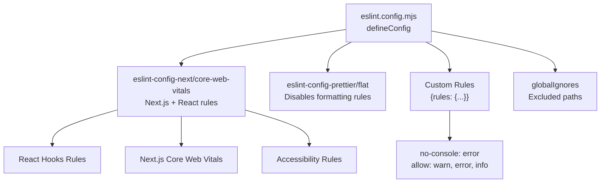
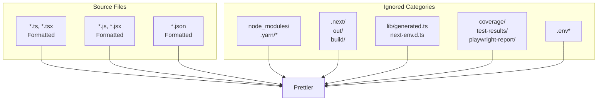
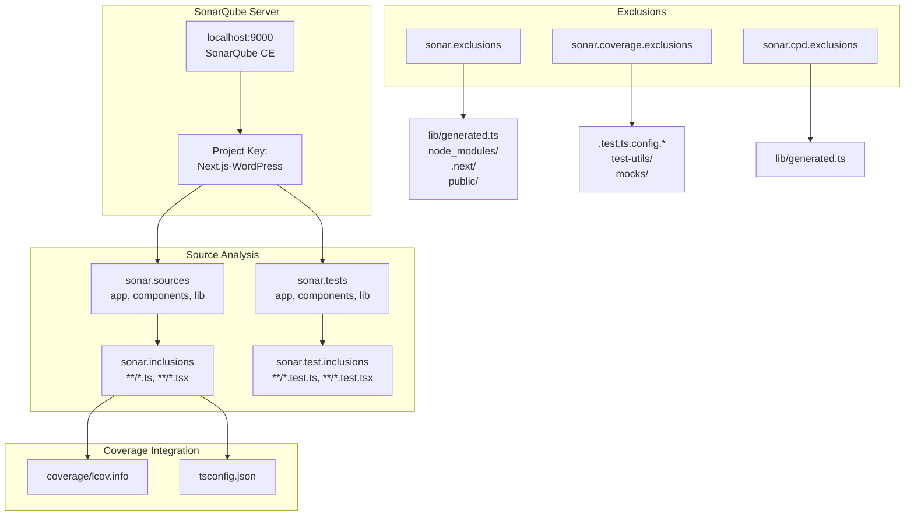
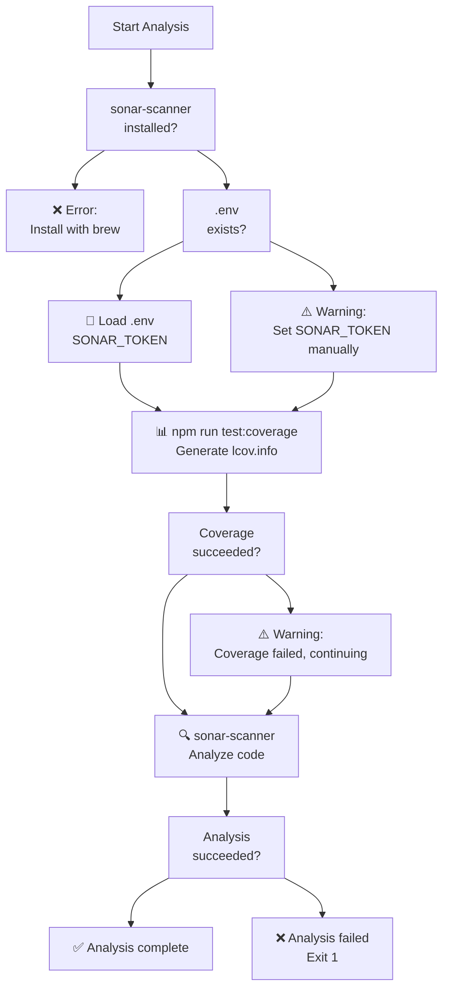
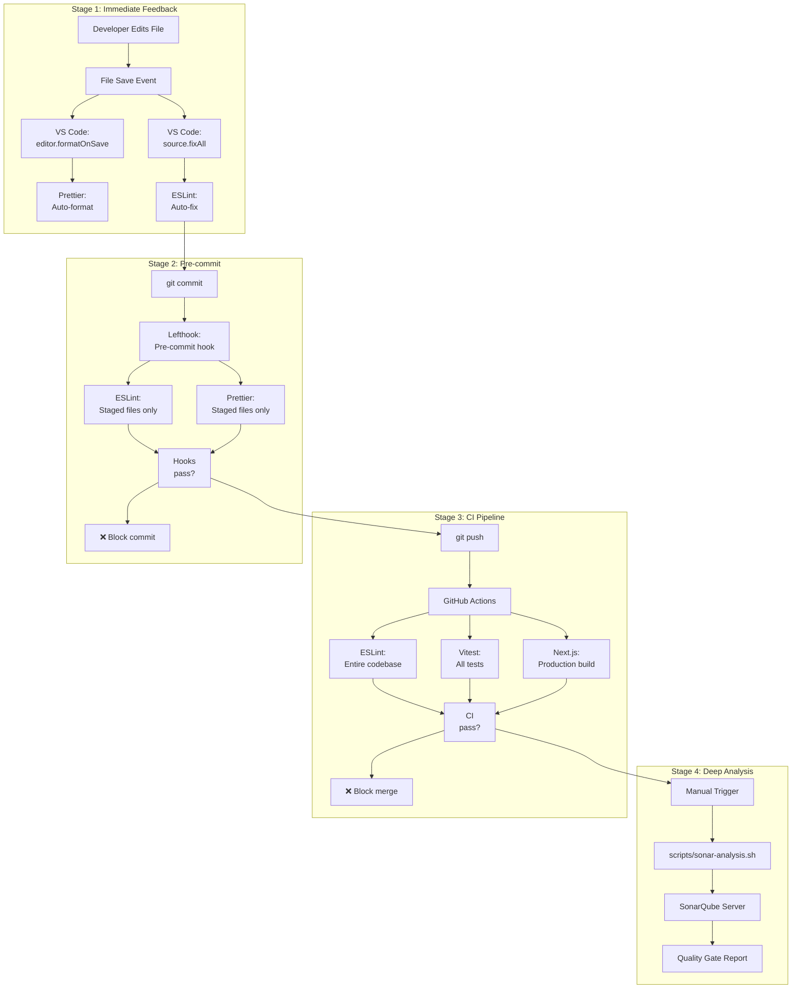
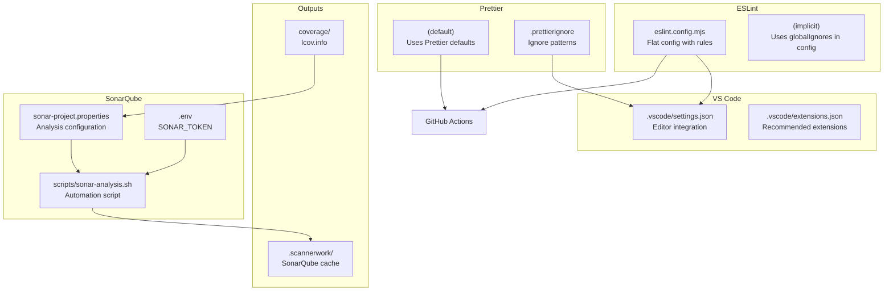

# Code Quality Tools

> **Relevant source files**
> * [.env.example](https://github.com/gregrickaby/nextjs-wordpress/blob/63f3f2f5/.env.example)
> * [.gitignore](https://github.com/gregrickaby/nextjs-wordpress/blob/63f3f2f5/.gitignore)
> * [.nvmrc](https://github.com/gregrickaby/nextjs-wordpress/blob/63f3f2f5/.nvmrc)
> * [.prettierignore](https://github.com/gregrickaby/nextjs-wordpress/blob/63f3f2f5/.prettierignore)
> * [.vscode/extensions.json](https://github.com/gregrickaby/nextjs-wordpress/blob/63f3f2f5/.vscode/extensions.json)
> * [.vscode/settings.json](https://github.com/gregrickaby/nextjs-wordpress/blob/63f3f2f5/.vscode/settings.json)
> * [eslint.config.mjs](https://github.com/gregrickaby/nextjs-wordpress/blob/63f3f2f5/eslint.config.mjs)
> * [scripts/sonar-analysis.sh](https://github.com/gregrickaby/nextjs-wordpress/blob/63f3f2f5/scripts/sonar-analysis.sh)
> * [sonar-project.properties](https://github.com/gregrickaby/nextjs-wordpress/blob/63f3f2f5/sonar-project.properties)
> * [tsconfig.json](https://github.com/gregrickaby/nextjs-wordpress/blob/63f3f2f5/tsconfig.json)

## Purpose and Scope

This document details the code quality tools used in the Next.js WordPress application: **ESLint**, **Prettier**, and **SonarQube**. It covers their configuration files, rule sets, ignore patterns, and how they integrate with the development workflow. This page focuses on the tool configurations themselves; for VS Code editor integration, see [VS Code Configuration](/gregrickaby/nextjs-wordpress/7.1-vs-code-configuration); for automated enforcement via Git hooks, see [Git Hooks](/gregrickaby/nextjs-wordpress/7.3-git-hooks); for CI/CD integration, see [CI/CD Pipeline](/gregrickaby/nextjs-wordpress/9.2-cicd-pipeline).

---

## ESLint Configuration

ESLint enforces code quality rules and catches potential bugs during development. The application uses the flat configuration format (ESLint 9+) with Next.js-specific rules.

### Configuration Structure

The ESLint configuration is defined in [eslint.config.mjs L1-L33](https://github.com/gregrickaby/nextjs-wordpress/blob/63f3f2f5/eslint.config.mjs#L1-L33)

 using the flat config format:



**ESLint Configuration Layers**

| Layer | Source | Purpose |
| --- | --- | --- |
| Base | `eslint-config-next/core-web-vitals` | Next.js best practices, React Hooks rules, accessibility |
| Formatting | `eslint-config-prettier/flat` | Disables ESLint rules that conflict with Prettier |
| Custom | `rules` object | Project-specific overrides |
| Exclusions | `globalIgnores` | Paths excluded from linting |

### Custom Rules

The configuration defines one custom rule in [eslint.config.mjs L9-L16](https://github.com/gregrickaby/nextjs-wordpress/blob/63f3f2f5/eslint.config.mjs#L9-L16)

:

* **`no-console`**: Set to `error` with exceptions for `console.warn`, `console.error`, and `console.info`. This prevents accidental `console.log` statements while allowing intentional logging.

### Global Ignores

The following paths are excluded from ESLint analysis via [eslint.config.mjs L18-L29](https://github.com/gregrickaby/nextjs-wordpress/blob/63f3f2f5/eslint.config.mjs#L18-L29)

:

| Pattern | Description |
| --- | --- |
| `.next/**` | Next.js build output |
| `out/**` | Static export output |
| `build/**` | Production build artifacts |
| `next-env.d.ts` | Next.js type declarations |
| `.*.js` | Hidden JavaScript files |
| `**/*.min.js` | Minified JavaScript files |
| `**/.*cache/` | Cache directories |
| `**/coverage/` | Test coverage reports |
| `**/node_modules/` | Dependencies |
| `**/public/` | Static assets |

**Sources:** [eslint.config.mjs L1-L33](https://github.com/gregrickaby/nextjs-wordpress/blob/63f3f2f5/eslint.config.mjs#L1-L33)

---

## Prettier Configuration

Prettier handles code formatting automatically. The project uses Prettier's default configuration with custom ignore patterns.

### VS Code Integration

Prettier is integrated into the VS Code workflow via [.vscode/settings.json L5-L7](https://github.com/gregrickaby/nextjs-wordpress/blob/63f3f2f5/.vscode/settings.json#L5-L7)

:

```
"editor.defaultFormatter": "esbenp.prettier-vscode"
"editor.formatOnPaste": true
"editor.formatOnSave": true
```

This configuration ensures code is automatically formatted when pasting and saving files. The `source.fixAll` action in [.vscode/settings.json L2-L4](https://github.com/gregrickaby/nextjs-wordpress/blob/63f3f2f5/.vscode/settings.json#L2-L4)

 runs both ESLint and Prettier fixes on save.

### Ignore Patterns

The [.prettierignore L1-L42](https://github.com/gregrickaby/nextjs-wordpress/blob/63f3f2f5/.prettierignore#L1-L42)

 file mirrors `.gitignore` patterns to prevent formatting generated and build files:



Key exclusions include:

* **Generated code**: `lib/generated.ts` (from GraphQL Code Generator)
* **Build artifacts**: `.next/`, `out/`, `build/`
* **Type declarations**: `next-env.d.ts`, `*.tsbuildinfo`
* **Test outputs**: `coverage/`, `test-results/`, `playwright-report/`
* **Dependencies**: `node_modules/`, `.yarn/*` (except patches, plugins, releases)

### Prettier-ESLint Interaction

The `eslint-config-prettier/flat` package in [eslint.config.mjs L3](https://github.com/gregrickaby/nextjs-wordpress/blob/63f3f2f5/eslint.config.mjs#L3-L3)

 disables all ESLint formatting rules that would conflict with Prettier. This ensures:

1. Prettier handles all formatting concerns
2. ESLint focuses on code quality and potential bugs
3. No conflicting fixes between tools

The VS Code setting `"eslint.format.enable": false` in [.vscode/settings.json L8](https://github.com/gregrickaby/nextjs-wordpress/blob/63f3f2f5/.vscode/settings.json#L8-L8)

 prevents ESLint from running its own formatter, delegating all formatting to Prettier.

**Sources:** [.vscode/settings.json L1-L33](https://github.com/gregrickaby/nextjs-wordpress/blob/63f3f2f5/.vscode/settings.json#L1-L33)

 [.prettierignore L1-L42](https://github.com/gregrickaby/nextjs-wordpress/blob/63f3f2f5/.prettierignore#L1-L42)

 [eslint.config.mjs L1-L33](https://github.com/gregrickaby/nextjs-wordpress/blob/63f3f2f5/eslint.config.mjs#L1-L33)

---

## SonarQube Configuration

SonarQube provides comprehensive static code analysis, code coverage tracking, and code quality metrics. The project is configured for local analysis against a SonarQube Community Edition instance.

### Project Configuration

The [sonar-project.properties L1-L35](https://github.com/gregrickaby/nextjs-wordpress/blob/63f3f2f5/sonar-project.properties#L1-L35)

 file defines the SonarQube analysis parameters:



**SonarQube Configuration Parameters**

| Parameter | Value | Purpose |
| --- | --- | --- |
| `sonar.projectKey` | `Next.js-WordPress` | Unique project identifier |
| `sonar.projectName` | `Next.js WordPress` | Display name |
| `sonar.projectVersion` | `2.0.0` | Version tracking |
| `sonar.host.url` | `http://localhost:9000` | SonarQube server URL |
| `sonar.sources` | `app,components,lib` | Source directories |
| `sonar.tests` | `app,components,lib` | Test directories |
| `sonar.inclusions` | `**/*.ts,**/*.tsx` | Files to analyze |
| `sonar.test.inclusions` | `**/*.test.ts,**/*.test.tsx` | Test files |
| `sonar.javascript.lcov.reportPaths` | `coverage/lcov.info` | Coverage report path |
| `sonar.typescript.tsconfigPath` | `tsconfig.json` | TypeScript config |
| `sonar.sourceEncoding` | `UTF-8` | File encoding |
| `sonar.scm.provider` | `git` | Version control system |

### Analysis Exclusions

SonarQube applies three types of exclusions defined in [sonar-project.properties L18-L28](https://github.com/gregrickaby/nextjs-wordpress/blob/63f3f2f5/sonar-project.properties#L18-L28)

:

**1. Source Exclusions** (`sonar.exclusions`)

* `**/*.module.css`, `**/*.css` - Style files
* `**/node_modules/**` - Dependencies
* `**/.next/**`, `**/dist/**`, `**/build/**` - Build outputs
* `**/coverage/**`, `**/public/**` - Test and static files
* `**/lib/generated.ts` - Auto-generated GraphQL types

**2. Coverage Exclusions** (`sonar.coverage.exclusions`)

* `**/*.test.ts`, `**/*.test.tsx` - Test files themselves
* `**/*.config.*` - Configuration files
* `**/test-utils/**`, `**/mocks/**`, `**/msw/**` - Test infrastructure

**3. Duplication Exclusions** (`sonar.cpd.exclusions`)

* `**/lib/generated.ts` - Auto-generated code expected to have patterns

### Analysis Script

The [scripts/sonar-analysis.sh L1-L43](https://github.com/gregrickaby/nextjs-wordpress/blob/63f3f2f5/scripts/sonar-analysis.sh#L1-L43)

 script automates the SonarQube analysis workflow:



The script performs the following steps:

1. **Dependency Check** ([scripts/sonar-analysis.sh L5-L10](https://github.com/gregrickaby/nextjs-wordpress/blob/63f3f2f5/scripts/sonar-analysis.sh#L5-L10) ): Verifies `sonar-scanner` is installed
2. **Environment Loading** ([scripts/sonar-analysis.sh L12-L20](https://github.com/gregrickaby/nextjs-wordpress/blob/63f3f2f5/scripts/sonar-analysis.sh#L12-L20) ): Loads `SONAR_TOKEN` from `.env` file
3. **Coverage Generation** ([scripts/sonar-analysis.sh L22-L29](https://github.com/gregrickaby/nextjs-wordpress/blob/63f3f2f5/scripts/sonar-analysis.sh#L22-L29) ): Runs `npm run test:coverage` to generate `coverage/lcov.info`
4. **SonarQube Analysis** ([scripts/sonar-analysis.sh L31-L42](https://github.com/gregrickaby/nextjs-wordpress/blob/63f3f2f5/scripts/sonar-analysis.sh#L31-L42) ): Executes `sonar-scanner` with configuration from `sonar-project.properties`

The script continues even if coverage generation fails, ensuring SonarQube can still analyze code quality without coverage data.

### Authentication

SonarQube authentication requires a token stored in the `SONAR_TOKEN` environment variable. This can be defined in the `.env` file as shown in [.env.example L16-L17](https://github.com/gregrickaby/nextjs-wordpress/blob/63f3f2f5/.env.example#L16-L17)

:

```markdown
# Optional. SonarQube authentication token (for local analysis).
SONAR_TOKEN=""
```

The token is used by the `sonar-scanner` CLI during analysis. For CI/CD integration, this would typically be stored as a GitHub secret.

**Sources:** [sonar-project.properties L1-L35](https://github.com/gregrickaby/nextjs-wordpress/blob/63f3f2f5/sonar-project.properties#L1-L35)

 [scripts/sonar-analysis.sh L1-L43](https://github.com/gregrickaby/nextjs-wordpress/blob/63f3f2f5/scripts/sonar-analysis.sh#L1-L43)

 [.env.example L16-L17](https://github.com/gregrickaby/nextjs-wordpress/blob/63f3f2f5/.env.example#L16-L17)

---

## Multi-Stage Code Quality Enforcement

Code quality is enforced at three progressive stages, each catching different types of issues:



**Enforcement Stage Comparison**

| Stage | Tools | Scope | Timing | Purpose |
| --- | --- | --- | --- | --- |
| **Immediate** | Prettier, ESLint | Current file | On save | Instant feedback, auto-fix |
| **Pre-commit** | Prettier, ESLint | Staged files | Before commit | Prevent bad code in history |
| **CI Pipeline** | ESLint, Vitest, Next.js | Entire codebase | On push | Ensure production readiness |
| **Deep Analysis** | SonarQube | Entire codebase | Manual | Comprehensive quality metrics |

### Stage 1: Immediate Feedback (VS Code)

When a developer saves a file, VS Code automatically:

1. Runs Prettier to format code ([.vscode/settings.json L7](https://github.com/gregrickaby/nextjs-wordpress/blob/63f3f2f5/.vscode/settings.json#L7-L7) )
2. Runs ESLint with auto-fix ([.vscode/settings.json L2-L4](https://github.com/gregrickaby/nextjs-wordpress/blob/63f3f2f5/.vscode/settings.json#L2-L4) )
3. Organizes TypeScript imports ([.vscode/settings.json L15-L27](https://github.com/gregrickaby/nextjs-wordpress/blob/63f3f2f5/.vscode/settings.json#L15-L27) )

This provides instant visual feedback without blocking work.

### Stage 2: Pre-commit Validation (Lefthook)

Before each commit, lefthook runs ESLint and Prettier on staged files only. This is documented in detail in [Git Hooks](/gregrickaby/nextjs-wordpress/7.3-git-hooks). This stage prevents broken code from entering the Git history.

### Stage 3: CI Pipeline (GitHub Actions)

On each push, GitHub Actions runs:

* ESLint on the entire codebase
* Vitest tests with coverage
* Next.js production build

This ensures the entire codebase remains in a deployable state. See [CI/CD Pipeline](/gregrickaby/nextjs-wordpress/9.2-cicd-pipeline) for details.

### Stage 4: Deep Analysis (SonarQube)

SonarQube analysis is run manually or on-demand to provide:

* **Code smell detection**: Maintainability issues
* **Security vulnerability scanning**: OWASP top 10, CWE
* **Bug detection**: Logic errors, null pointer issues
* **Code coverage tracking**: Line, branch, and condition coverage
* **Duplication detection**: Copy-paste code identification
* **Technical debt estimation**: Time to fix all issues

**Sources:** [.vscode/settings.json L1-L33](https://github.com/gregrickaby/nextjs-wordpress/blob/63f3f2f5/.vscode/settings.json#L1-L33)

 Diagrams 1 and 2 from high-level overview

---

## Configuration Files Reference

### File Locations and Purposes



**Configuration Files Summary**

| File | Purpose | Used By |
| --- | --- | --- |
| `eslint.config.mjs` | ESLint rules and ignores | VS Code, lefthook, GitHub Actions |
| `.prettierignore` | Prettier exclusion patterns | VS Code, lefthook, GitHub Actions |
| `.vscode/settings.json` | Editor-level tool integration | VS Code |
| `.vscode/extensions.json` | Recommended VS Code extensions | VS Code |
| `sonar-project.properties` | SonarQube analysis parameters | sonar-scanner |
| `scripts/sonar-analysis.sh` | SonarQube automation script | Manual execution |
| `.env` | Environment variables (SONAR_TOKEN) | All tools needing auth |
| `.gitignore` | Version control exclusions | Git |

### Ignored Paths Comparison

Different tools use slightly different ignore patterns, but they generally align:

| Path Pattern | `.gitignore` | `.prettierignore` | `eslint.config.mjs` | `sonar-project.properties` |
| --- | --- | --- | --- | --- |
| `node_modules/` | ✓ | ✓ | ✓ | ✓ |
| `.next/` | ✓ | ✓ | ✓ | ✓ |
| `coverage/` | ✓ | ✓ | ✓ | ✓ |
| `lib/generated.ts` | ✓ | ✓ | — | ✓ |
| `next-env.d.ts` | ✓ | ✓ | ✓ | — |
| `*.tsbuildinfo` | ✓ | ✓ | — | — |
| `.env*` | ✓ | ✓ | — | — |
| `.scannerwork/` | ✓ | — | — | — |
| `public/` | — | — | ✓ | ✓ |

**Sources:** [.gitignore L1-L42](https://github.com/gregrickaby/nextjs-wordpress/blob/63f3f2f5/.gitignore#L1-L42)

 [.prettierignore L1-L42](https://github.com/gregrickaby/nextjs-wordpress/blob/63f3f2f5/.prettierignore#L1-L42)

 [eslint.config.mjs L18-L29](https://github.com/gregrickaby/nextjs-wordpress/blob/63f3f2f5/eslint.config.mjs#L18-L29)

 [sonar-project.properties L18-L28](https://github.com/gregrickaby/nextjs-wordpress/blob/63f3f2f5/sonar-project.properties#L18-L28)

---

## Running Code Quality Checks

### Manual Execution

```markdown
# Run ESLint on entire codebase
npm run lint

# Run Prettier check (without fixing)
npx prettier --check .

# Run Prettier with auto-fix
npx prettier --write .

# Run SonarQube analysis (requires local SonarQube server)
npm run sonar
# or directly:
./scripts/sonar-analysis.sh
```

### Automated Execution

* **On file save**: Prettier and ESLint run automatically via VS Code
* **On commit**: ESLint and Prettier run on staged files via lefthook
* **On push**: Full lint, test, and build run via GitHub Actions

### VS Code Commands

* `Cmd/Ctrl + Shift + P` → "Format Document" - Manual Prettier format
* `Cmd/Ctrl + Shift + P` → "ESLint: Fix all auto-fixable Problems" - Manual ESLint fix

**Sources:** [package.json](https://github.com/gregrickaby/nextjs-wordpress/blob/63f3f2f5/package.json)

 (implied from npm scripts), [.vscode/settings.json L1-L33](https://github.com/gregrickaby/nextjs-wordpress/blob/63f3f2f5/.vscode/settings.json#L1-L33)