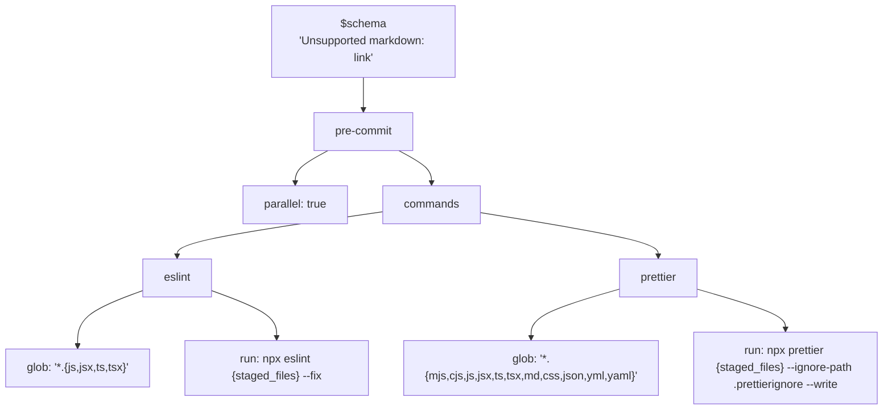
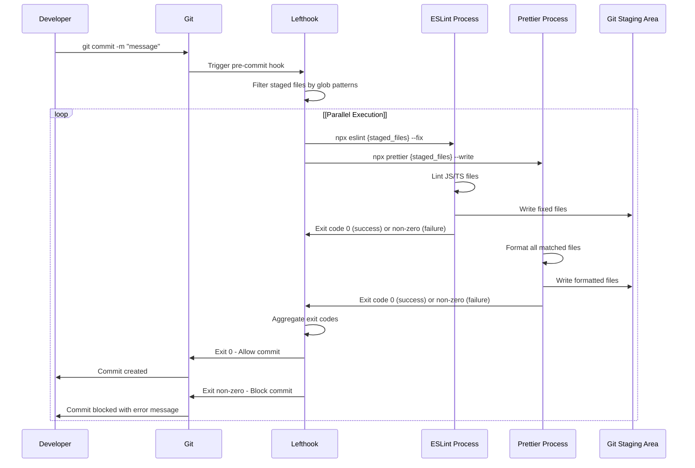
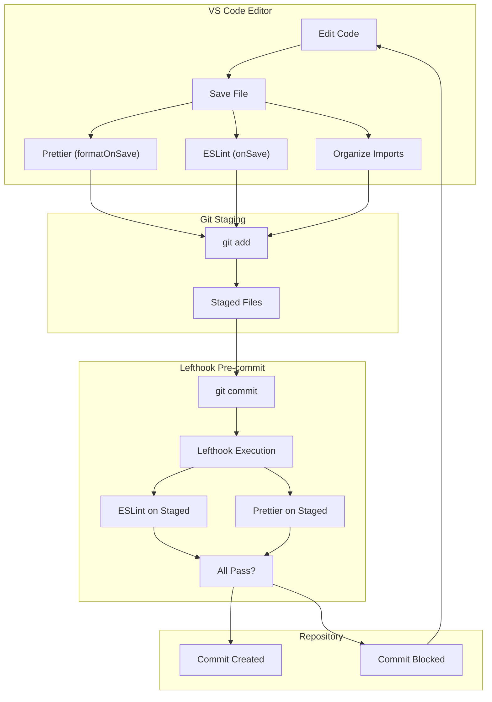
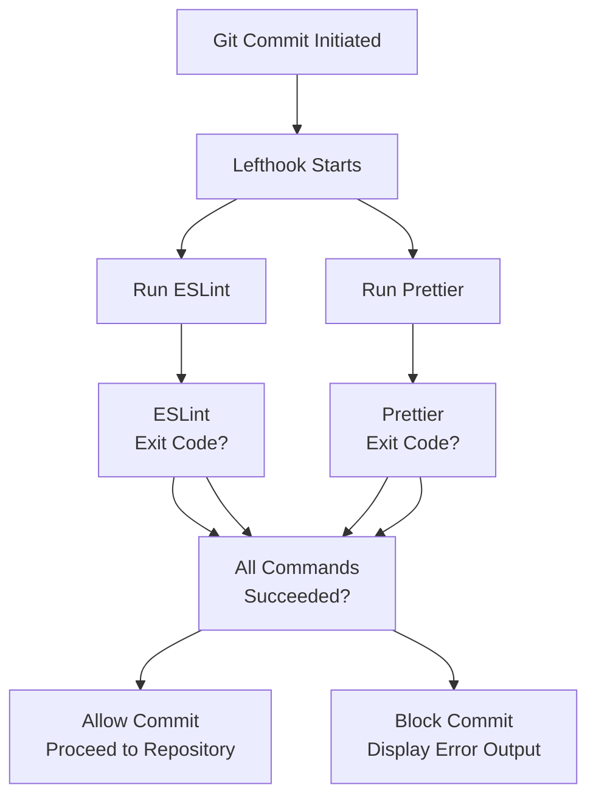

# Git Hooks

> **Relevant source files**
> * [.env.example](https://github.com/gregrickaby/nextjs-wordpress/blob/63f3f2f5/.env.example)
> * [.gitignore](https://github.com/gregrickaby/nextjs-wordpress/blob/63f3f2f5/.gitignore)
> * [.vscode/extensions.json](https://github.com/gregrickaby/nextjs-wordpress/blob/63f3f2f5/.vscode/extensions.json)
> * [.vscode/settings.json](https://github.com/gregrickaby/nextjs-wordpress/blob/63f3f2f5/.vscode/settings.json)
> * [lefthook.yml](https://github.com/gregrickaby/nextjs-wordpress/blob/63f3f2f5/lefthook.yml)
> * [scripts/sonar-analysis.sh](https://github.com/gregrickaby/nextjs-wordpress/blob/63f3f2f5/scripts/sonar-analysis.sh)
> * [sonar-project.properties](https://github.com/gregrickaby/nextjs-wordpress/blob/63f3f2f5/sonar-project.properties)

## Purpose and Scope

This page documents the Git hooks configuration managed by **lefthook** in this project. It covers pre-commit validation, the tools that run on staged files, and how hooks integrate with the development workflow. For VS Code editor integration, see [VS Code Configuration](/gregrickaby/nextjs-wordpress/7.1-vs-code-configuration). For the broader code quality tools ecosystem, see [Code Quality Tools](/gregrickaby/nextjs-wordpress/7.2-code-quality-tools).

## Overview

The project uses [lefthook](https://github.com/gregrickaby/nextjs-wordpress/blob/63f3f2f5/lefthook)

 to manage Git hooks. Lefthook is a fast, cross-platform Git hooks manager written in Go that runs linting and formatting tools on staged files before commits are allowed to proceed.

The primary configuration file is [lefthook.yml L1-L12](https://github.com/gregrickaby/nextjs-wordpress/blob/63f3f2f5/lefthook.yml#L1-L12)

 which defines hooks that execute automatically during Git operations.

**Sources:** [lefthook.yml L1-L12](https://github.com/gregrickaby/nextjs-wordpress/blob/63f3f2f5/lefthook.yml#L1-L12)

## Configuration Structure

The lefthook configuration uses a YAML schema and defines hook triggers, commands, and execution parameters.

### Diagram: Lefthook Configuration Schema



**Sources:** [lefthook.yml L1-L12](https://github.com/gregrickaby/nextjs-wordpress/blob/63f3f2f5/lefthook.yml#L1-L12)

### Configuration Properties

| Property | Value | Purpose |
| --- | --- | --- |
| `$schema` | `https://json.schemastore.org/lefthook.json` | Provides JSON schema validation and IDE autocomplete |
| `pre-commit` | Object | Defines commands that run before commit |
| `parallel` | `true` | Runs all commands simultaneously for faster execution |
| `commands` | Object | Contains named command definitions |

**Sources:** [lefthook.yml L1-L4](https://github.com/gregrickaby/nextjs-wordpress/blob/63f3f2f5/lefthook.yml#L1-L4)

## Pre-commit Hook Commands

The `pre-commit` hook executes two commands in parallel on staged files.

### ESLint Command

```yaml
eslint:
  glob: '*.{js,jsx,ts,tsx}'
  run: npx eslint {staged_files} --fix
```

**Configuration Details:**

* **Glob Pattern:** `*.{js,jsx,ts,tsx}` - Matches JavaScript and TypeScript files
* **Command:** `npx eslint {staged_files} --fix`
* **Behavior:** Lints staged files and automatically fixes issues where possible
* **Variables:** `{staged_files}` is replaced by lefthook with space-separated list of matching staged files

**Sources:** [lefthook.yml L6-L8](https://github.com/gregrickaby/nextjs-wordpress/blob/63f3f2f5/lefthook.yml#L6-L8)

### Prettier Command

```yaml
prettier:
  glob: '*.{mjs,cjs,js,jsx,ts,tsx,md,css,json,yml,yaml}'
  run: npx prettier {staged_files} --ignore-path .prettierignore --write
```

**Configuration Details:**

* **Glob Pattern:** `*.{mjs,cjs,js,jsx,ts,tsx,md,css,json,yml,yaml}` - Matches code, markdown, config, and style files
* **Command:** `npx prettier {staged_files} --ignore-path .prettierignore --write`
* **Behavior:** Formats staged files according to Prettier rules
* **Flags:** * `--ignore-path .prettierignore` - Respects ignore patterns * `--write` - Modifies files in place

**Sources:** [lefthook.yml L9-L11](https://github.com/gregrickaby/nextjs-wordpress/blob/63f3f2f5/lefthook.yml#L9-L11)

## Hook Execution Flow

### Diagram: Pre-commit Hook Execution



**Sources:** [lefthook.yml L3-L12](https://github.com/gregrickaby/nextjs-wordpress/blob/63f3f2f5/lefthook.yml#L3-L12)

## File Pattern Matching

The hooks use glob patterns to determine which files to process. Understanding these patterns is crucial for predicting hook behavior.

### Glob Pattern Coverage

| Pattern | Files Matched | Hook |
| --- | --- | --- |
| `*.{js,jsx,ts,tsx}` | JavaScript and TypeScript source files | ESLint |
| `*.{mjs,cjs,js,jsx,ts,tsx,md,css,json,yml,yaml}` | Source files, markdown, styles, config | Prettier |

### Pattern Overlap

Both hooks run on `.js`, `.jsx`, `.ts`, and `.tsx` files:

1. **ESLint** runs first (or in parallel) to fix linting issues
2. **Prettier** runs to format the already-linted code

Since `parallel: true` is set, both run simultaneously. However, this means if ESLint modifies a file, Prettier may also modify it in the same pass.

**Sources:** [lefthook.yml L3-L10](https://github.com/gregrickaby/nextjs-wordpress/blob/63f3f2f5/lefthook.yml#L3-L10)

## Integration with Development Workflow

### Diagram: Development Workflow with Hooks



**Sources:** [lefthook.yml L3-L12](https://github.com/gregrickaby/nextjs-wordpress/blob/63f3f2f5/lefthook.yml#L3-L12)

 [.vscode/settings.json L2-L9](https://github.com/gregrickaby/nextjs-wordpress/blob/63f3f2f5/.vscode/settings.json#L2-L9)

### Two-Stage Validation

The project implements two-stage code quality validation:

1. **VS Code On-Save Actions** [.vscode/settings.json L2-L17](https://github.com/gregrickaby/nextjs-wordpress/blob/63f3f2f5/.vscode/settings.json#L2-L17) * `editor.formatOnSave: true` - Formats code on every save * `eslint.run: "onSave"` - Runs ESLint on save * `source.organizeImports: "explicit"` - Organizes imports for TypeScript files
2. **Pre-commit Hooks** [lefthook.yml L3-L12](https://github.com/gregrickaby/nextjs-wordpress/blob/63f3f2f5/lefthook.yml#L3-L12) * Runs ESLint with `--fix` on staged JavaScript/TypeScript files * Runs Prettier with `--write` on staged files matching broader pattern

This two-stage approach provides:

* **Immediate feedback** during development (VS Code)
* **Final validation** before commit (Git hooks)
* **Safety net** for developers who don't use VS Code or have disabled auto-formatting

**Sources:** [.vscode/settings.json L2-L17](https://github.com/gregrickaby/nextjs-wordpress/blob/63f3f2f5/.vscode/settings.json#L2-L17)

 [lefthook.yml L3-L12](https://github.com/gregrickaby/nextjs-wordpress/blob/63f3f2f5/lefthook.yml#L3-L12)

## Bypassing Hooks

In rare cases, developers may need to bypass pre-commit hooks. Lefthook and Git provide mechanisms for this.

### Skip All Hooks

```
git commit --no-verify -m "emergency fix"
```

The `--no-verify` flag (or `-n` shorthand) tells Git to skip all pre-commit and commit-msg hooks.

### Skip Specific Lefthook Commands

```
LEFTHOOK_EXCLUDE=eslint git commit -m "skip eslint only"
```

The `LEFTHOOK_EXCLUDE` environment variable accepts comma-separated command names to skip.

### Disable Lefthook Entirely

```
LEFTHOOK=0 git commit -m "skip all lefthook"
```

**Warning:** Bypassing hooks should be exceptional. The CI pipeline will still enforce all checks, so bypassing locally only delays failure detection.

**Sources:** [lefthook.yml L1-L12](https://github.com/gregrickaby/nextjs-wordpress/blob/63f3f2f5/lefthook.yml#L1-L12)

## Lefthook Installation

Lefthook must be installed in the Git repository to activate hooks.

### Automatic Installation

When developers run `npm install`, lefthook is automatically installed via the `prepare` script if configured in `package.json`.

### Manual Installation

```
npx lefthook install
```

This creates Git hook files in `.git/hooks/` that delegate to lefthook.

### Verification

To verify lefthook is installed:

```
cat .git/hooks/pre-commit
```

The file should contain a script that invokes lefthook.

## Error Handling

### Diagram: Error Handling Flow



**Sources:** [lefthook.yml L3-L12](https://github.com/gregrickaby/nextjs-wordpress/blob/63f3f2f5/lefthook.yml#L3-L12)

### Common Failure Scenarios

| Scenario | Cause | Solution |
| --- | --- | --- |
| ESLint errors | Code violates linting rules that cannot be auto-fixed | Manually fix reported issues |
| Prettier format changes | Files modified by Prettier during hook | Re-stage modified files with `git add` |
| Glob pattern mismatch | File extension not covered by glob patterns | Ensure file types are in glob or add to configuration |
| Lefthook not installed | `.git/hooks/pre-commit` missing | Run `npx lefthook install` |
| Tool not found | `npx eslint` or `npx prettier` fails | Run `npm install` to install dependencies |

**Sources:** [lefthook.yml L6-L11](https://github.com/gregrickaby/nextjs-wordpress/blob/63f3f2f5/lefthook.yml#L6-L11)

## Modified Files During Hooks

Both ESLint (`--fix`) and Prettier (`--write`) modify files in place. This creates a workflow consideration:

### File Modification Workflow

1. Developer stages files with `git add`
2. Developer runs `git commit`
3. Lefthook runs ESLint and Prettier
4. Tools modify staged files
5. **Modified files are NOT automatically re-staged**
6. Commit proceeds with original staged content OR fails if modifications are significant

### Best Practice

After a successful commit where hooks modified files, re-stage and re-commit:

```sql
git commit -m "fix: update component"
# Lefthook modifies files
git add .
git commit --amend --no-edit
```

Alternatively, developers can rely on VS Code's on-save formatting [.vscode/settings.json L7](https://github.com/gregrickaby/nextjs-wordpress/blob/63f3f2f5/.vscode/settings.json#L7-L7)

 to pre-format files before staging, minimizing hook modifications.

**Sources:** [lefthook.yml L8-L11](https://github.com/gregrickaby/nextjs-wordpress/blob/63f3f2f5/lefthook.yml#L8-L11)

 [.vscode/settings.json L7](https://github.com/gregrickaby/nextjs-wordpress/blob/63f3f2f5/.vscode/settings.json#L7-L7)

## Relationship to CI Pipeline

Pre-commit hooks provide local validation before pushing to the remote repository. However, the CI pipeline re-runs all checks independently.

### Local vs CI Validation

| Check | Local (Lefthook) | CI (GitHub Actions) |
| --- | --- | --- |
| **Scope** | Only staged files | Entire codebase |
| **ESLint** | `npx eslint {staged_files}` | `npm run lint` (all files) |
| **Prettier** | `npx prettier {staged_files}` | `npm run format:check` (all files) |
| **Tests** | Not run | `npm run test` |
| **Build** | Not run | `npm run build` |
| **Enforcement** | Can be bypassed locally | Cannot be bypassed |

Pre-commit hooks catch issues early, but the CI pipeline is the authoritative gatekeeper. For CI pipeline details, see [CI/CD Pipeline](/gregrickaby/nextjs-wordpress/9.2-cicd-pipeline).

**Sources:** [lefthook.yml L3-L12](https://github.com/gregrickaby/nextjs-wordpress/blob/63f3f2f5/lefthook.yml#L3-L12)

## Performance Considerations

Lefthook optimizes hook performance through several mechanisms:

1. **Parallel Execution:** [lefthook.yml L4](https://github.com/gregrickaby/nextjs-wordpress/blob/63f3f2f5/lefthook.yml#L4-L4)  - ESLint and Prettier run simultaneously
2. **Staged Files Only:** [lefthook.yml L8-L11](https://github.com/gregrickaby/nextjs-wordpress/blob/63f3f2f5/lefthook.yml#L8-L11)  - Only files in staging area are processed, not entire codebase
3. **Glob Filtering:** [lefthook.yml L7-L10](https://github.com/gregrickaby/nextjs-wordpress/blob/63f3f2f5/lefthook.yml#L7-L10)  - Files are pre-filtered by extension before being passed to tools
4. **Native Performance:** Lefthook is written in Go and faster than alternatives like Husky

### Performance Comparison

| Hook Manager | Language | Startup Time |
| --- | --- | --- |
| Lefthook | Go | ~10ms |
| Husky | JavaScript/Node.js | ~100ms |
| Pre-commit (Python) | Python | ~50ms |

For projects with many staged files, the `parallel: true` setting significantly reduces total execution time.

**Sources:** [lefthook.yml L4](https://github.com/gregrickaby/nextjs-wordpress/blob/63f3f2f5/lefthook.yml#L4-L4)

## Excluded Files

The hooks only process files matched by glob patterns. Several important file types are excluded:

### Files Not Processed

* **Test files:** `*.test.ts`, `*.test.tsx` - Matched by glob, processed by hooks
* **Generated files:** `lib/generated.ts` - Excluded from source control [.gitignore L41](https://github.com/gregrickaby/nextjs-wordpress/blob/63f3f2f5/.gitignore#L41-L41)  so never staged
* **Configuration files:** `.env`, `.gitignore` - Not matched by glob patterns
* **Node modules:** `node_modules/**` - Not staged [.gitignore L4](https://github.com/gregrickaby/nextjs-wordpress/blob/63f3f2f5/.gitignore#L4-L4)
* **Build artifacts:** `.next/`, `out/`, `coverage/` - Not staged [.gitignore L9-L16](https://github.com/gregrickaby/nextjs-wordpress/blob/63f3f2f5/.gitignore#L9-L16)

Generated files are explicitly ignored by Git [.gitignore L41](https://github.com/gregrickaby/nextjs-wordpress/blob/63f3f2f5/.gitignore#L41-L41)

 and therefore cannot be staged, ensuring hooks never process them.

**Sources:** [lefthook.yml L7-L10](https://github.com/gregrickaby/nextjs-wordpress/blob/63f3f2f5/lefthook.yml#L7-L10)

 [.gitignore L4-L41](https://github.com/gregrickaby/nextjs-wordpress/blob/63f3f2f5/.gitignore#L4-L41)

## Troubleshooting

### Hook Not Running

**Symptom:** Committing without any validation

**Diagnosis:**

```markdown
# Check if lefthook is installed
ls -la .git/hooks/pre-commit

# Verify lefthook configuration
npx lefthook run pre-commit --verbose
```

**Solution:**

```
npx lefthook install
```

### ESLint Failures

**Symptom:** Commit blocked with ESLint errors

**Diagnosis:** Review error output showing rule violations

**Solution:**

```markdown
# Fix automatically where possible
npx eslint . --fix

# For remaining errors, manually fix code
# Then re-stage
git add .
git commit
```

### Prettier Format Conflicts

**Symptom:** Files modified after staging

**Solution:**

```markdown
# Re-stage modified files
git add .

# Amend commit
git commit --amend --no-edit
```

### Performance Issues

**Symptom:** Hooks take excessive time to run

**Diagnosis:**

```markdown
# Run with timing information
time git commit -m "test"
```

**Solution:**

* Reduce number of staged files
* Ensure `parallel: true` is set [lefthook.yml L4](https://github.com/gregrickaby/nextjs-wordpress/blob/63f3f2f5/lefthook.yml#L4-L4)
* Consider splitting large commits

**Sources:** [lefthook.yml L4-L12](https://github.com/gregrickaby/nextjs-wordpress/blob/63f3f2f5/lefthook.yml#L4-L12)

---

**Related Documentation:**

* [VS Code Configuration](/gregrickaby/nextjs-wordpress/7.1-vs-code-configuration) - Editor integration and on-save actions
* [Code Quality Tools](/gregrickaby/nextjs-wordpress/7.2-code-quality-tools) - ESLint, Prettier, and SonarQube configuration
* [CI/CD Pipeline](/gregrickaby/nextjs-wordpress/9.2-cicd-pipeline) - GitHub Actions validation workflow