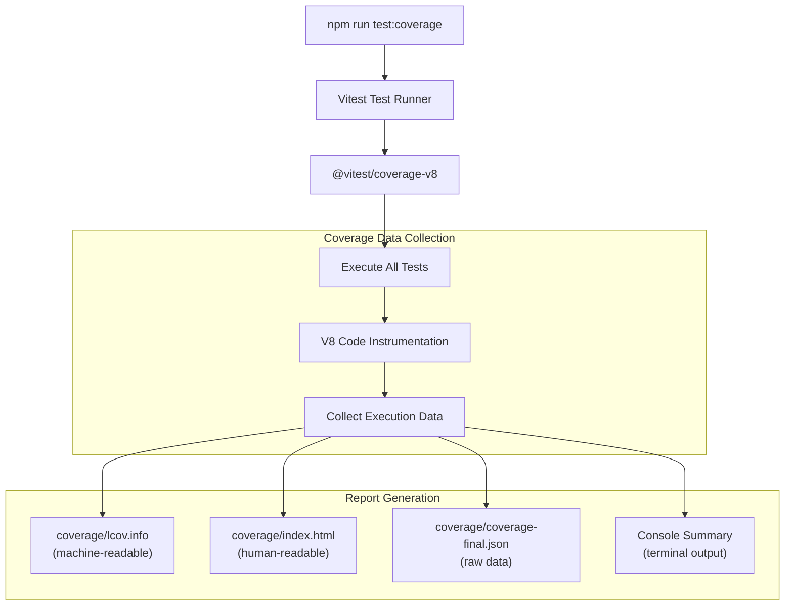
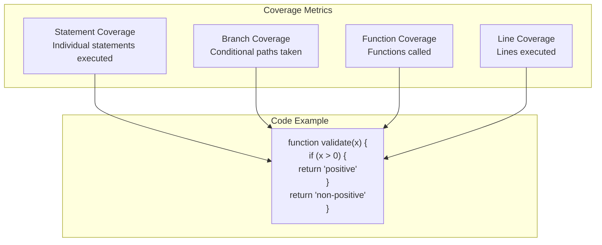
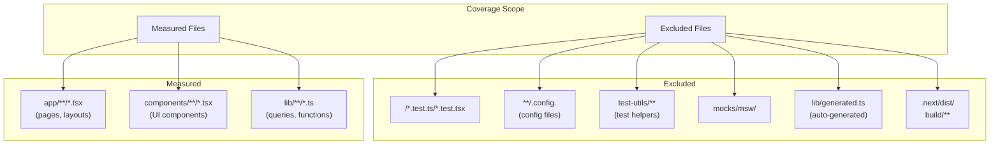
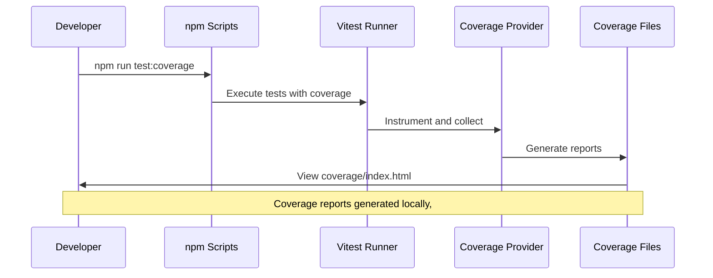
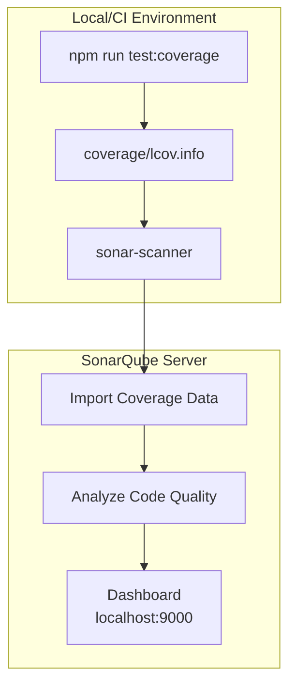

# Test Coverage

> **Relevant source files**
> * [.env.example](https://github.com/gregrickaby/nextjs-wordpress/blob/63f3f2f5/.env.example)
> * [.gitignore](https://github.com/gregrickaby/nextjs-wordpress/blob/63f3f2f5/.gitignore)
> * [.vscode/extensions.json](https://github.com/gregrickaby/nextjs-wordpress/blob/63f3f2f5/.vscode/extensions.json)
> * [.vscode/settings.json](https://github.com/gregrickaby/nextjs-wordpress/blob/63f3f2f5/.vscode/settings.json)
> * [AGENTS.md](https://github.com/gregrickaby/nextjs-wordpress/blob/63f3f2f5/AGENTS.md)
> * [CONTRIBUTING.md](https://github.com/gregrickaby/nextjs-wordpress/blob/63f3f2f5/CONTRIBUTING.md)
> * [README.md](https://github.com/gregrickaby/nextjs-wordpress/blob/63f3f2f5/README.md)
> * [package-lock.json](https://github.com/gregrickaby/nextjs-wordpress/blob/63f3f2f5/package-lock.json)
> * [package.json](https://github.com/gregrickaby/nextjs-wordpress/blob/63f3f2f5/package.json)
> * [scripts/sonar-analysis.sh](https://github.com/gregrickaby/nextjs-wordpress/blob/63f3f2f5/scripts/sonar-analysis.sh)
> * [sonar-project.properties](https://github.com/gregrickaby/nextjs-wordpress/blob/63f3f2f5/sonar-project.properties)

## Purpose and Scope

This document explains test coverage requirements, how to generate and interpret coverage reports, and best practices for achieving meaningful test coverage in the Next.js WordPress application. For information about setting up the testing infrastructure, see [Testing Infrastructure](/gregrickaby/nextjs-wordpress/8.1-testing-infrastructure). For guidance on writing tests, see [Writing Tests](/gregrickaby/nextjs-wordpress/8.2-writing-tests).

**Sources:** [README.md L359-L382](https://github.com/gregrickaby/nextjs-wordpress/blob/63f3f2f5/README.md#L359-L382)

 [AGENTS.md L256-L290](https://github.com/gregrickaby/nextjs-wordpress/blob/63f3f2f5/AGENTS.md#L256-L290)

 [CONTRIBUTING.md L258-L263](https://github.com/gregrickaby/nextjs-wordpress/blob/63f3f2f5/CONTRIBUTING.md#L258-L263)

---

## Coverage Philosophy

This project follows a **pragmatic coverage philosophy** that prioritizes meaningful tests over arbitrary coverage percentages.

### Coverage Target

The project maintains a **80%+ test coverage target**, not 100%. This recognizes that:

* Some unreachable edge cases exist and are acceptable
* Configuration files and generated code don't require tests
* Tests should validate real behavior, not just increase coverage numbers
* Focus should be on critical paths and user-facing features

### Meaningful Coverage vs. Artificial Coverage

**✅ Good Coverage:**

* Tests that validate user interactions and real-world scenarios
* Edge case handling (empty responses, API errors, null values)
* Accessibility validation with jest-axe
* Data transformation and business logic

**❌ Poor Coverage:**

* Tests that only check if a component/function exists
* Tests that duplicate implementation details
* Trivial tests that add no validation value
* Tests written solely to increase coverage percentage

**Sources:** [AGENTS.md L256-L275](https://github.com/gregrickaby/nextjs-wordpress/blob/63f3f2f5/AGENTS.md#L256-L275)

 [CONTRIBUTING.md L258-L263](https://github.com/gregrickaby/nextjs-wordpress/blob/63f3f2f5/CONTRIBUTING.md#L258-L263)

---

## Generating Coverage Reports

### Basic Coverage Generation

Generate a complete coverage report with:

```
npm run test:coverage
```

This command runs Vitest with the V8 coverage provider and generates reports in multiple formats.

### Coverage Output Structure



**Generated Files:**

| File/Directory | Format | Purpose |
| --- | --- | --- |
| `coverage/lcov.info` | LCOV | Machine-readable format for CI/CD and SonarQube |
| `coverage/index.html` | HTML | Interactive browser-based coverage viewer |
| `coverage/coverage-final.json` | JSON | Raw coverage data for custom tooling |
| `coverage/lcov-report/` | HTML | Detailed per-file coverage reports |
| Console output | Text | Terminal summary with overall percentages |

**Sources:** [package.json L25](https://github.com/gregrickaby/nextjs-wordpress/blob/63f3f2f5/package.json#L25-L25)

 [package.json L51](https://github.com/gregrickaby/nextjs-wordpress/blob/63f3f2f5/package.json#L51-L51)

 [.gitignore L9](https://github.com/gregrickaby/nextjs-wordpress/blob/63f3f2f5/.gitignore#L9-L9)

### Interactive Coverage Exploration

The HTML report provides an interactive interface:

1. **Open the report:** ``` npm run test:coverage open coverage/index.html ```
2. **Navigate coverage:** * Click file names to see line-by-line coverage * Red highlights indicate uncovered lines * Green highlights indicate covered lines * Yellow highlights indicate partially covered branches
3. **Filter by coverage:** * Sort files by coverage percentage * Focus on files below the 80% threshold

**Sources:** [package.json L25](https://github.com/gregrickaby/nextjs-wordpress/blob/63f3f2f5/package.json#L25-L25)

---

## Coverage Metrics Explained

### Four Coverage Dimensions



### Statement Coverage

Measures whether each individual statement was executed.

**Example:**

```javascript
// Two statements: assignment + return
const result = fetchData()
return result
```

**Coverage:** If tests execute both lines, statement coverage = 100%.

### Branch Coverage

Measures whether all conditional paths (branches) were taken.

**Example:**

```
if (data) {
  return data.title  // Branch 1
} else {
  return 'Untitled'  // Branch 2
}
```

**Coverage:** Must test both truthy and falsy `data` for 100% branch coverage.

### Function Coverage

Measures whether each function was called at least once.

**Example:**

```javascript
export function helper() { /* ... */ }
export function unused() { /* ... */ }  // Not covered if never called
```

### Line Coverage

Measures whether each line was executed (similar to statement coverage but line-oriented).

**Target Prioritization:**

1. **Branch Coverage** (highest priority) - Ensures all conditional logic paths tested
2. **Statement Coverage** - Validates execution of individual operations
3. **Function Coverage** - Confirms all exported functions are used
4. **Line Coverage** - General metric for overall execution

**Sources:** Inferred from Vitest/V8 coverage standards

---

## Coverage Exclusions

### Files Excluded from Coverage Measurement

The following file patterns are **intentionally excluded** from coverage calculations:



### Exclusion Configuration

Coverage exclusions are defined in two locations:

**1. SonarQube Configuration:** [sonar-project.properties L18-L25](https://github.com/gregrickaby/nextjs-wordpress/blob/63f3f2f5/sonar-project.properties#L18-L25)

```
sonar.exclusions=**/*.module.css,**/*.css,**/node_modules/**,**/.next/**,**/dist/**,**/build/**,**/coverage/**,**/public/**,**/lib/generated.ts
sonar.coverage.exclusions=**/*.test.ts,**/*.test.tsx,**/*.config.*,**/test-utils/**,**/mocks/**,**/msw/**
```

**2. Git Ignore:** [.gitignore L9-L12](https://github.com/gregrickaby/nextjs-wordpress/blob/63f3f2f5/.gitignore#L9-L12)

```
/coverage
/.scannerwork
```

### Rationale for Exclusions

| Exclusion Pattern | Reason |
| --- | --- |
| `**/*.test.ts(x)` | Tests themselves don't need coverage |
| `**/*.config.*` | Configuration files are declarative, not executable logic |
| `test-utils/**` | Test utilities are indirectly validated by tests that use them |
| `mocks/**`, `msw/**` | Mock data and handlers are test fixtures |
| `lib/generated.ts` | Auto-generated GraphQL types, regenerated on each build |
| `.next/**`, `dist/**` | Build artifacts, not source code |
| `coverage/**` | Coverage reports shouldn't measure themselves |

**Sources:** [sonar-project.properties L18-L25](https://github.com/gregrickaby/nextjs-wordpress/blob/63f3f2f5/sonar-project.properties#L18-L25)

 [.gitignore L9-L12](https://github.com/gregrickaby/nextjs-wordpress/blob/63f3f2f5/.gitignore#L9-L12)

---

## Coverage Integration with CI/CD

### Local Development Workflow



### SonarQube Integration

Coverage data is consumed by SonarQube for quality analysis:



**Configuration:** [sonar-project.properties L21](https://github.com/gregrickaby/nextjs-wordpress/blob/63f3f2f5/sonar-project.properties#L21-L21)

```
sonar.javascript.lcov.reportPaths=coverage/lcov.info
```

**Running SonarQube Analysis:**

```markdown
npm run sonar  # Runs test:coverage + sonar-scanner
```

This script:

1. Executes `npm run test:coverage` to generate fresh coverage data
2. Invokes `sonar-scanner` to upload data to SonarQube
3. Displays results at `http://localhost:9000`

**Sources:** [scripts/sonar-analysis.sh L1-L43](https://github.com/gregrickaby/nextjs-wordpress/blob/63f3f2f5/scripts/sonar-analysis.sh#L1-L43)

 [sonar-project.properties L21](https://github.com/gregrickaby/nextjs-wordpress/blob/63f3f2f5/sonar-project.properties#L21-L21)

 [package.json L22](https://github.com/gregrickaby/nextjs-wordpress/blob/63f3f2f5/package.json#L22-L22)

### GitHub Actions Integration

The CI pipeline runs tests but does not enforce coverage thresholds:

```markdown
npm test  # Runs tests without coverage in CI (faster)
```

Coverage enforcement is **optional** and left to code reviewers and SonarQube analysis rather than blocking builds.

**Sources:** Inferred from [package.json L24](https://github.com/gregrickaby/nextjs-wordpress/blob/63f3f2f5/package.json#L24-L24)

---

## Reading Coverage Reports

### Terminal Output

Running `npm run test:coverage` displays a summary in the terminal:

```
--------------------|---------|----------|---------|---------|
File                | % Stmts | % Branch | % Funcs | % Lines |
--------------------|---------|----------|---------|---------|
All files           |   84.62 |    75.00 |   88.89 |   84.62 |
 lib                |   85.71 |    75.00 |   90.00 |   85.71 |
  functions.ts      |   88.00 |    80.00 |   92.00 |   88.00 |
  config.ts         |  100.00 |   100.00 |  100.00 |  100.00 |
 lib/queries        |   82.35 |    70.00 |   85.71 |   82.35 |
  getAllPosts.ts    |   90.00 |    80.00 |  100.00 |   90.00 |
  getPostBySlug.ts  |   75.00 |    60.00 |   75.00 |   75.00 |
--------------------|---------|----------|---------|---------|
```

**Interpreting the Table:**

* **Green (>80%)**: Meets or exceeds target
* **Yellow (60-80%)**: Acceptable but improvable
* **Red (<60%)**: Requires additional test coverage

### HTML Report Navigation

The HTML report provides detailed file-by-file analysis:

1. **Overview Page:** `coverage/index.html` shows all files with sortable columns
2. **File Detail Pages:** Click any file to see line-by-line coverage
3. **Color Coding:** * **Green lines:** Executed by tests * **Red lines:** Never executed * **Yellow lines:** Partially covered (some branches not tested) * **Gray lines:** Not executable (comments, declarations)

### Focusing on Low Coverage Files

**Strategy:**

1. Run `npm run test:coverage`
2. Open `coverage/index.html`
3. Sort by "% Stmts" column (ascending)
4. Focus on files below 80%
5. Identify uncovered lines (red highlights)
6. Write tests targeting those specific paths

**Sources:** Inferred from Vitest coverage reporting standards

---

## Best Practices for Meaningful Coverage

### 1. Focus on Critical Paths

**Prioritize coverage for:**

| Category | Examples |
| --- | --- |
| Data fetching | `lib/queries/*.ts`, `lib/mutations/*.ts` |
| User interactions | `components/SearchForm.tsx`, `components/CommentForm.tsx` |
| Error handling | API error responses, null data handling |
| Business logic | Data transformations, validation |

**De-prioritize coverage for:**

* Simple presentational components
* Configuration files
* Type definitions

### 2. Test Behavior, Not Implementation

```javascript
// ❌ Bad: Testing implementation details
it('should call useState hook', () => {
  const spy = vi.spyOn(React, 'useState')
  render(<MyComponent />)
  expect(spy).toHaveBeenCalled()  // Meaningless
})

// ✅ Good: Testing user-facing behavior
it('should update search input when user types', async () => {
  const {user} = render(<SearchForm />)
  const input = screen.getByRole('searchbox')
  
  await user.type(input, 'test query')
  expect(input).toHaveValue('test query')
})
```

### 3. Achieve Coverage Through Edge Cases

```javascript
// ✅ Cover multiple scenarios with meaningful tests
describe('getAllPosts', () => {
  it('should return posts when data exists', async () => {
    // Happy path
  })
  
  it('should return empty array when no posts exist', async () => {
    // Empty response
  })
  
  it('should return empty array on API error', async () => {
    // Error handling
  })
  
  it('should handle malformed response gracefully', async () => {
    // Data validation
  })
})
```

### 4. Use Data-Driven Tests to Reduce Duplication

```javascript
// ✅ Use it.each() for similar test cases
it.each([
  {input: null, expected: 'Untitled'},
  {input: undefined, expected: 'Untitled'},
  {input: '', expected: 'Untitled'},
  {input: 'My Title', expected: 'My Title'}
])('should handle title value: $input', async ({input, expected}) => {
  const result = formatTitle(input)
  expect(result).toBe(expected)
})
```

### 5. Don't Chase 100% Coverage

**Acceptable gaps:**

```javascript
// This defensive check may never be reached in practice
if (!process.env.NEXT_PUBLIC_WORDPRESS_GRAPHQL_URL) {
  throw new Error('WordPress URL not configured')  // Uncovered is OK
}

// TypeScript ensures this is never undefined, but defensive coding is good
const title = post?.title ?? 'Untitled'  // Both branches may not be testable
```

If reaching 100% requires testing unrealistic scenarios or mocking TypeScript's type safety, accept the gap.

### 6. Coverage as a Discovery Tool

Use coverage reports to **discover** untested code paths, not as a goal unto itself:

1. Run coverage after writing features
2. Identify red-highlighted lines
3. Ask: "Is this path important?" * **Yes:** Write a test * **No:** Document why it's acceptable to leave uncovered

**Sources:** [AGENTS.md L256-L290](https://github.com/gregrickaby/nextjs-wordpress/blob/63f3f2f5/AGENTS.md#L256-L290)

 [CONTRIBUTING.md L246-L263](https://github.com/gregrickaby/nextjs-wordpress/blob/63f3f2f5/CONTRIBUTING.md#L246-L263)

 [README.md L376-L379](https://github.com/gregrickaby/nextjs-wordpress/blob/63f3f2f5/README.md#L376-L379)

---

## Common Coverage Pitfalls

### Pitfall 1: Testing Generated Code

**❌ Don't test auto-generated files:**

```typescript
// lib/generated.ts is auto-generated - no tests needed
export type Post = {
  title: Maybe<string>
  content: Maybe<string>
}
```

**Reason:** Testing generated code doesn't validate real behavior. If the generator works, the types are correct.

**Sources:** [.gitignore L41](https://github.com/gregrickaby/nextjs-wordpress/blob/63f3f2f5/.gitignore#L41-L41)

 [sonar-project.properties L18](https://github.com/gregrickaby/nextjs-wordpress/blob/63f3f2f5/sonar-project.properties#L18-L18)

### Pitfall 2: Superficial Tests for Coverage

**❌ Superficial test:**

```javascript
it('should exist', () => {
  expect(MyComponent).toBeDefined()  // Adds no value
})
```

**✅ Meaningful test:**

```javascript
it('should render post title', () => {
  render(<Post title="My Post" />)
  expect(screen.getByRole('heading')).toHaveTextContent('My Post')
})
```

### Pitfall 3: Ignoring Branch Coverage

**❌ Only testing happy path:**

```javascript
it('should fetch post', async () => {
  // Only tests when data exists
  const post = await getPostBySlug('my-post')
  expect(post.title).toBe('My Post')
})
```

**✅ Testing all branches:**

```javascript
it('should return post when it exists', async () => {
  // Tests happy path
})

it('should return null when post not found', async () => {
  // Tests error branch
})
```

**Sources:** [AGENTS.md L376-L441](https://github.com/gregrickaby/nextjs-wordpress/blob/63f3f2f5/AGENTS.md#L376-L441)

 [CONTRIBUTING.md L246-L257](https://github.com/gregrickaby/nextjs-wordpress/blob/63f3f2f5/CONTRIBUTING.md#L246-L257)

---

## Coverage Report Artifacts

### File Locations

All coverage artifacts are generated in the `coverage/` directory:

```markdown
coverage/
├── index.html              # Main HTML report entry point
├── lcov.info               # LCOV format for SonarQube
├── coverage-final.json     # Raw coverage data (JSON)
└── lcov-report/            # Detailed HTML reports per file
    ├── index.html
    ├── app/
    ├── components/
    └── lib/
```

### Git Ignore

Coverage reports are **never committed** to the repository:

[.gitignore L9](https://github.com/gregrickaby/nextjs-wordpress/blob/63f3f2f5/.gitignore#L9-L9)

```
/coverage
```

**Reason:** Coverage data is environment-specific and regenerated on each run. Committing it causes merge conflicts and bloats repository size.

### Cleaning Coverage Data

Coverage data is automatically overwritten on each run. To manually clean:

```
rm -rf coverage/
npm run test:coverage
```

**Sources:** [.gitignore L9](https://github.com/gregrickaby/nextjs-wordpress/blob/63f3f2f5/.gitignore#L9-L9)

---

## Summary

| Aspect | Details |
| --- | --- |
| **Target** | 80%+ coverage (not 100%) |
| **Command** | `npm run test:coverage` |
| **Provider** | `@vitest/coverage-v8` |
| **Output Formats** | LCOV, HTML, JSON, console |
| **Integration** | SonarQube via `lcov.info` |
| **Philosophy** | Meaningful tests over arbitrary percentages |
| **Exclusions** | Tests, configs, generated code, build artifacts |
| **Primary Metrics** | Branch coverage (priority), statement, function, line |
| **Reports Location** | `coverage/` (not committed to Git) |

**Key Takeaway:** Coverage is a **discovery tool** to find untested code paths, not a goal. Focus on testing real behavior and critical paths while accepting that some edge cases may remain untested.

**Sources:** [package.json L25](https://github.com/gregrickaby/nextjs-wordpress/blob/63f3f2f5/package.json#L25-L25)

 [package.json L51](https://github.com/gregrickaby/nextjs-wordpress/blob/63f3f2f5/package.json#L51-L51)

 [AGENTS.md L256-L290](https://github.com/gregrickaby/nextjs-wordpress/blob/63f3f2f5/AGENTS.md#L256-L290)

 [CONTRIBUTING.md L258-L263](https://github.com/gregrickaby/nextjs-wordpress/blob/63f3f2f5/CONTRIBUTING.md#L258-L263)

 [sonar-project.properties L21-L25](https://github.com/gregrickaby/nextjs-wordpress/blob/63f3f2f5/sonar-project.properties#L21-L25)

 [.gitignore L9](https://github.com/gregrickaby/nextjs-wordpress/blob/63f3f2f5/.gitignore#L9-L9)