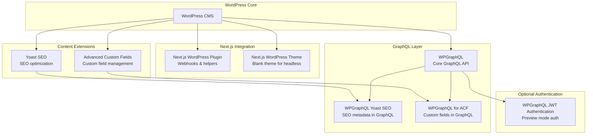
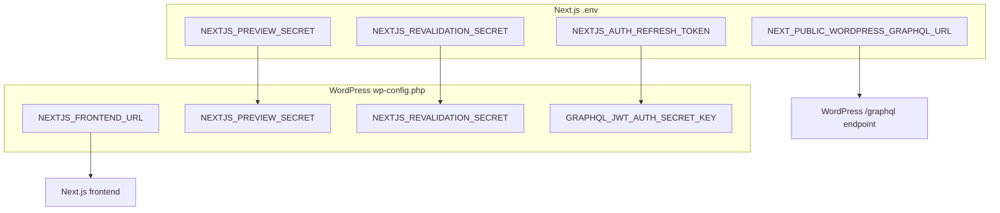
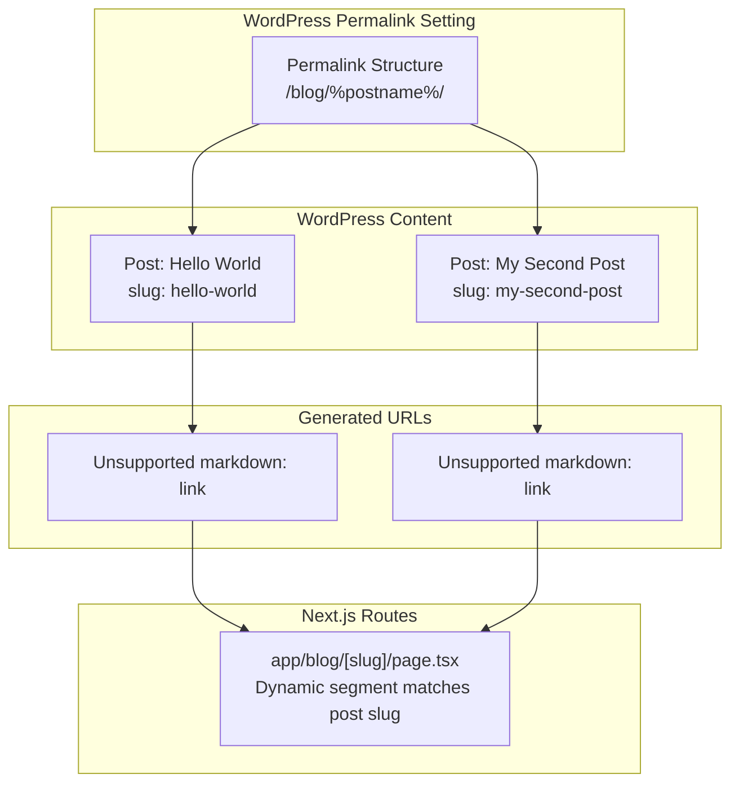
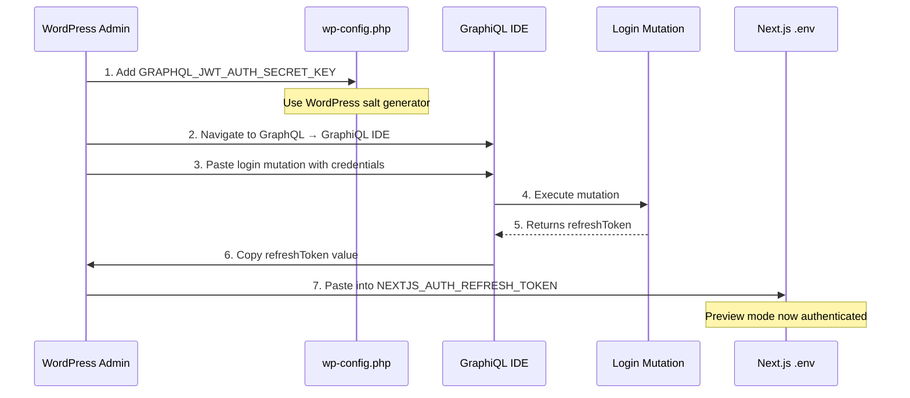
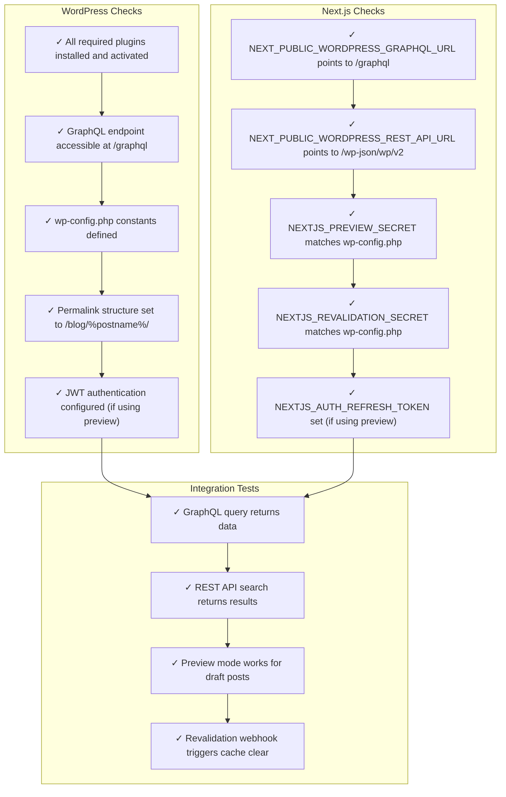

# WordPress Configuration

> **Relevant source files**
> * [.env.example](https://github.com/gregrickaby/nextjs-wordpress/blob/63f3f2f5/.env.example)
> * [.gitignore](https://github.com/gregrickaby/nextjs-wordpress/blob/63f3f2f5/.gitignore)
> * [.vscode/extensions.json](https://github.com/gregrickaby/nextjs-wordpress/blob/63f3f2f5/.vscode/extensions.json)
> * [.vscode/settings.json](https://github.com/gregrickaby/nextjs-wordpress/blob/63f3f2f5/.vscode/settings.json)
> * [AGENTS.md](https://github.com/gregrickaby/nextjs-wordpress/blob/63f3f2f5/AGENTS.md)
> * [CONTRIBUTING.md](https://github.com/gregrickaby/nextjs-wordpress/blob/63f3f2f5/CONTRIBUTING.md)
> * [README.md](https://github.com/gregrickaby/nextjs-wordpress/blob/63f3f2f5/README.md)
> * [scripts/sonar-analysis.sh](https://github.com/gregrickaby/nextjs-wordpress/blob/63f3f2f5/scripts/sonar-analysis.sh)
> * [sonar-project.properties](https://github.com/gregrickaby/nextjs-wordpress/blob/63f3f2f5/sonar-project.properties)

This document details the required WordPress backend configuration for the Next.js WordPress headless frontend. It covers plugin installation, wp-config.php settings, permalink structure, and optional JWT authentication setup.

For information about using JWT authentication for preview functionality, see [Preview Mode](/gregrickaby/nextjs-wordpress/6.2-preview-mode). For webhook configuration to trigger cache revalidation, see [On-Demand Revalidation](/gregrickaby/nextjs-wordpress/6.3-on-demand-revalidation).

---

## Overview

The Next.js frontend communicates with WordPress through two primary channels:

1. **WPGraphQL** - Primary data source for posts, pages, books, categories, tags, and menus
2. **WordPress REST API** - Secondary API used for search functionality

The WordPress backend must be configured with specific plugins, constants, and settings for the frontend to function correctly.

**Minimum Requirements:**

| Requirement | Purpose |
| --- | --- |
| WordPress 5.9+ | Core platform |
| PHP 7.4+ | Server-side processing |
| WPGraphQL plugin | GraphQL API endpoint |
| HTTPS | Required for production |
| Pretty permalinks | Required for slug-based routing |

Sources: [README.md L130-L166](https://github.com/gregrickaby/nextjs-wordpress/blob/63f3f2f5/README.md#L130-L166)

---

## WordPress Plugin Dependencies

### Required Plugins

The following plugins must be installed and activated on the WordPress backend:



**Plugin Dependencies Diagram**

Sources: [README.md L134-L143](https://github.com/gregrickaby/nextjs-wordpress/blob/63f3f2f5/README.md#L134-L143)

### Plugin Details

| Plugin | Repository | Required | Purpose |
| --- | --- | --- | --- |
| **WPGraphQL** | [wpgraphql.com](https://www.wpgraphql.com/) | ✅ Yes | Exposes WordPress data via GraphQL endpoint at `/graphql` |
| **Advanced Custom Fields** | [wordpress.org/plugins/advanced-custom-fields](https://wordpress.org/plugins/advanced-custom-fields/) | ✅ Yes | Manages custom fields (free version sufficient) |
| **WPGraphQL for ACF** | [wordpress.org/plugins/wpgraphql-acf](https://wordpress.org/plugins/wpgraphql-acf/) | ✅ Yes | Exposes ACF fields in GraphQL schema |
| **Yoast SEO** | [wordpress.org/plugins/wordpress-seo](https://wordpress.org/plugins/wordpress-seo/) | ✅ Yes | Provides SEO metadata for pages and posts |
| **WPGraphQL Yoast SEO** | [wordpress.org/plugins/add-wpgraphql-seo](https://wordpress.org/plugins/add-wpgraphql-seo/) | ✅ Yes | Exposes Yoast SEO metadata in GraphQL |
| **Next.js WordPress Plugin** | [github.com/gregrickaby/nextjs-wordpress-plugin](https://github.com/gregrickaby/nextjs-wordpress/blob/63f3f2f5/github.com/gregrickaby/nextjs-wordpress-plugin) | ✅ Yes | Provides webhooks for revalidation and helper functions |
| **Next.js WordPress Theme** | [github.com/gregrickaby/nextjs-wordpress-theme](https://github.com/gregrickaby/nextjs-wordpress/blob/63f3f2f5/github.com/gregrickaby/nextjs-wordpress-theme) | ✅ Yes | Blank theme optimized for headless operation |
| **WPGraphQL JWT Authentication** | [github.com/wp-graphql/wp-graphql-jwt-authentication](https://github.com/gregrickaby/nextjs-wordpress/blob/63f3f2f5/github.com/wp-graphql/wp-graphql-jwt-authentication) | ❌ Optional | Enables JWT authentication for preview mode |

### Plugin Installation Order

1. Install **WPGraphQL** first (core dependency)
2. Install **ACF** and **Yoast SEO** (content extensions)
3. Install **WPGraphQL for ACF** and **WPGraphQL Yoast SEO** (GraphQL extensions)
4. Install **Next.js WordPress Plugin** and **Theme**
5. Optionally install **WPGraphQL JWT Authentication** (for preview mode)

After activation, verify the GraphQL endpoint is accessible at `https://your-site.com/graphql`.

Sources: [README.md L134-L143](https://github.com/gregrickaby/nextjs-wordpress/blob/63f3f2f5/README.md#L134-L143)

---

## wp-config.php Configuration

### Required Constants

The following PHP constants must be added to `wp-config.php`:



**Environment Variable Mapping Diagram**

Sources: [README.md L145-L161](https://github.com/gregrickaby/nextjs-wordpress/blob/63f3f2f5/README.md#L145-L161)

 [.env.example L1-L14](https://github.com/gregrickaby/nextjs-wordpress/blob/63f3f2f5/.env.example#L1-L14)

### wp-config.php Example

Add these constants to your WordPress `wp-config.php` file (typically located at the root of your WordPress installation):

```
// The URL of your Next.js frontend. Include the trailing slash.
define( 'NEXTJS_FRONTEND_URL', 'https://nextjswp.com/' );

// Any random string. This must match the .env variable in the Next.js frontend.
define( 'NEXTJS_PREVIEW_SECRET', 'preview' );

// Any random string. This must match the .env variable in the Next.js frontend.
define( 'NEXTJS_REVALIDATION_SECRET', 'revalidate' );

// Optional. JWT auth refresh token.
// define( 'GRAPHQL_JWT_AUTH_SECRET_KEY', '' );
```

### Constant Definitions

| Constant | Type | Purpose | Example |
| --- | --- | --- | --- |
| `NEXTJS_FRONTEND_URL` | string | URL of Next.js frontend (with trailing slash) | `https://nextjswp.com/` |
| `NEXTJS_PREVIEW_SECRET` | string | Shared secret for preview authentication | `preview` |
| `NEXTJS_REVALIDATION_SECRET` | string | Shared secret for revalidation webhook | `revalidate` |
| `GRAPHQL_JWT_AUTH_SECRET_KEY` | string | JWT signing key (optional, for preview mode) | Generated from [WordPress salt generator](https://api.wordpress.org/secret-key/1.1/salt/) |

**Security Requirements:**

* **Production Secrets:** Use cryptographically strong random strings, not the example values
* **Secret Matching:** `NEXTJS_PREVIEW_SECRET` and `NEXTJS_REVALIDATION_SECRET` must match exactly between `wp-config.php` and `.env` in the Next.js app
* **Frontend URL:** Must include protocol (`https://`) and trailing slash
* **JWT Key:** Only needed if using preview mode (see [Preview Mode](/gregrickaby/nextjs-wordpress/6.2-preview-mode))

Sources: [README.md L145-L161](https://github.com/gregrickaby/nextjs-wordpress/blob/63f3f2f5/README.md#L145-L161)

 [.env.example L10-L14](https://github.com/gregrickaby/nextjs-wordpress/blob/63f3f2f5/.env.example#L10-L14)

---

## Permalink Structure

### Required Configuration

WordPress must use a custom permalink structure for the Next.js frontend to route content correctly.

**Settings Location:** WordPress Admin → Settings → Permalinks

**Required Structure:**

```
/blog/%postname%/
```



**Permalink Routing Flow**

### Why This Structure?

| Reason | Explanation |
| --- | --- |
| **Matches Next.js Routes** | The `/blog/` prefix corresponds to the `app/blog/[slug]/page.tsx` dynamic route |
| **Consistent URLs** | Maintains URL consistency between WordPress admin and frontend display |
| **SEO Preservation** | Preserves existing URL structure if migrating from a traditional WordPress site |
| **Clear Content Types** | Distinguishes posts (`/blog/`) from pages (root level) and books (`/books/`) |

### Verification

After setting the permalink structure:

1. Go to **WordPress Admin → Posts**
2. Click on any post
3. Verify the permalink shows as: `https://your-site.com/blog/post-slug/`
4. Test the URL in your Next.js frontend to ensure routing works

Sources: [README.md L163-L165](https://github.com/gregrickaby/nextjs-wordpress/blob/63f3f2f5/README.md#L163-L165)

---

## JWT Authentication (Optional)

JWT authentication is required only for preview mode functionality, which allows viewing draft posts before publishing.

For complete preview mode documentation, see [Preview Mode](/gregrickaby/nextjs-wordpress/6.2-preview-mode).

### Setup Process



**JWT Authentication Setup Flow**

### Step-by-Step Instructions

**1. Install WPGraphQL JWT Authentication Plugin**

Install and activate the [WPGraphQL JWT Authentication](https://github.com/gregrickaby/nextjs-wordpress/blob/63f3f2f5/WPGraphQL JWT Authentication)

 plugin.

**2. Generate JWT Secret Key**

Visit the [WordPress salt generator](https://api.wordpress.org/secret-key/1.1/salt/) and copy any of the generated strings.

**3. Add to wp-config.php**

```
// Optional. JWT auth refresh token.
define( 'GRAPHQL_JWT_AUTH_SECRET_KEY', 'paste-your-generated-string-here' );
```

**4. Execute Login Mutation**

Navigate to **WordPress Admin → GraphQL → GraphiQL IDE** and execute:

```yaml
mutation Login {
  login(
    input: {
      clientMutationId: "uniqueId"
      password: "your_password"
      username: "your_username"
    }
  ) {
    refreshToken
  }
}
```

Replace `your_username` and `your_password` with your WordPress admin credentials.

**5. Copy Refresh Token**

From the mutation response, copy the `refreshToken` value.

**6. Add to Next.js Environment**

In your Next.js `.env` file:

```markdown
# Optional. JWT auth refresh token.
NEXTJS_AUTH_REFRESH_TOKEN="paste-refresh-token-here"
```

### Verification

Test preview mode by:

1. Creating a draft post in WordPress
2. Clicking the **Preview** button
3. Verifying you're redirected to: `https://your-nextjs-site.com/preview/POST_ID?secret=your-preview-secret`
4. Confirming the draft content displays correctly

### Security Considerations

| Consideration | Implementation |
| --- | --- |
| **Token Rotation** | Refresh tokens don't expire; regenerate periodically for security |
| **Environment Variables** | Never commit `.env` files with actual tokens to version control |
| **Access Control** | Only users with WordPress credentials can generate refresh tokens |
| **HTTPS Required** | JWT authentication requires HTTPS in production |

Sources: [README.md L184-L224](https://github.com/gregrickaby/nextjs-wordpress/blob/63f3f2f5/README.md#L184-L224)

 [.env.example L7-L8](https://github.com/gregrickaby/nextjs-wordpress/blob/63f3f2f5/.env.example#L7-L8)

---

## Configuration Validation

### Verification Checklist

After completing WordPress configuration, verify all integrations:



**Configuration Validation Flow**

### GraphQL Endpoint Test

Verify the GraphQL endpoint is accessible:

```
curl -X POST https://your-site.com/graphql \
  -H "Content-Type: application/json" \
  -d '{"query": "{ generalSettings { title } }"}'
```

Expected response:

```json
{
  "data": {
    "generalSettings": {
      "title": "Your Site Name"
    }
  }
}
```

### REST API Test

Verify the REST API is accessible:

```
curl https://your-site.com/wp-json/wp/v2/posts?per_page=1
```

Should return JSON array with post data.

### Environment Variable Mapping

| Next.js Variable | WordPress Constant | Must Match |
| --- | --- | --- |
| `NEXT_PUBLIC_WORDPRESS_GRAPHQL_URL` | N/A (GraphQL endpoint URL) | Points to `/graphql` |
| `NEXT_PUBLIC_WORDPRESS_REST_API_URL` | N/A (REST API URL) | Points to `/wp-json/wp/v2` |
| `NEXTJS_PREVIEW_SECRET` | `NEXTJS_PREVIEW_SECRET` | ✅ Yes |
| `NEXTJS_REVALIDATION_SECRET` | `NEXTJS_REVALIDATION_SECRET` | ✅ Yes |
| `NEXTJS_AUTH_REFRESH_TOKEN` | Generated from `GRAPHQL_JWT_AUTH_SECRET_KEY` | Derived |

Sources: [README.md L70-L87](https://github.com/gregrickaby/nextjs-wordpress/blob/63f3f2f5/README.md#L70-L87)

 [.env.example L1-L14](https://github.com/gregrickaby/nextjs-wordpress/blob/63f3f2f5/.env.example#L1-L14)

---

## Common Configuration Issues

### Issue: GraphQL Endpoint Not Found (404)

**Symptoms:** Frontend cannot fetch data; GraphQL queries fail

**Solutions:**

* Verify WPGraphQL plugin is activated
* Check that WordPress permalinks are set (any structure, not "Plain")
* Flush WordPress rewrite rules: Settings → Permalinks → Save Changes
* Verify `NEXT_PUBLIC_WORDPRESS_GRAPHQL_URL` includes `/graphql` path

### Issue: Preview Mode Authentication Fails

**Symptoms:** Preview button redirects but shows 404; authorization errors

**Solutions:**

* Verify `GRAPHQL_JWT_AUTH_SECRET_KEY` is defined in `wp-config.php`
* Regenerate refresh token using login mutation
* Verify `NEXTJS_AUTH_REFRESH_TOKEN` matches generated token
* Check that WPGraphQL JWT Authentication plugin is activated
* Ensure secrets match between Next.js and WordPress

### Issue: Revalidation Webhook Not Triggering

**Symptoms:** Content updates don't appear on frontend; cache not invalidating

**Solutions:**

* Verify Next.js WordPress Plugin is installed and activated
* Check that `NEXTJS_REVALIDATION_SECRET` matches between environments
* Verify `NEXTJS_FRONTEND_URL` in `wp-config.php` includes trailing slash
* Test webhook manually via API route: `/api/revalidate?secret=your-secret&slug=post-slug`
* Check Next.js logs for webhook errors

### Issue: Custom Fields Not Appearing in GraphQL

**Symptoms:** ACF fields missing from GraphQL schema

**Solutions:**

* Verify WPGraphQL for ACF plugin is activated
* Check field group settings: "Show in GraphQL" must be enabled
* Set "GraphQL Field Name" for the field group
* Refresh GraphQL schema: Go to GraphQL → Settings → Save Changes
* Run `npm run codegen` to regenerate TypeScript types

### Issue: SEO Metadata Missing

**Symptoms:** Yoast SEO data not available in GraphQL queries

**Solutions:**

* Verify WPGraphQL Yoast SEO plugin is activated
* Check that Yoast SEO plugin is activated
* Add `seo { title metaDesc }` to GraphQL queries
* Run `npm run codegen` to regenerate types

Sources: [README.md L130-L224](https://github.com/gregrickaby/nextjs-wordpress/blob/63f3f2f5/README.md#L130-L224)

 [AGENTS.md L159-L168](https://github.com/gregrickaby/nextjs-wordpress/blob/63f3f2f5/AGENTS.md#L159-L168)

---

## Next.js Configuration

While this page focuses on WordPress configuration, the Next.js application must also be configured to connect to WordPress. Key configuration points:

### Environment Variables (.env)

Reference: [.env.example L1-L14](https://github.com/gregrickaby/nextjs-wordpress/blob/63f3f2f5/.env.example#L1-L14)

Must be set before running `npm run dev`:

```markdown
NEXT_PUBLIC_WORDPRESS_GRAPHQL_URL="https://your-site.com/graphql"
NEXT_PUBLIC_WORDPRESS_REST_API_URL="https://your-site.com/wp-json/wp/v2"
NEXTJS_PREVIEW_SECRET="your-preview-secret"
NEXTJS_REVALIDATION_SECRET="your-revalidation-secret"
NEXTJS_AUTH_REFRESH_TOKEN="your-refresh-token"  # Optional
```

### next.config.ts Remote Patterns

Reference: [README.md L91-L115](https://github.com/gregrickaby/nextjs-wordpress/blob/63f3f2f5/README.md#L91-L115)

Configure image domains in `next.config.ts`:

```yaml
images: {
  remotePatterns: [
    {
      protocol: 'https',
      hostname: '*.nextjswp.**'  // Change to your WordPress domain
    }
  ]
}
```

### Site Configuration (lib/config.ts)

Reference: [README.md L117-L128](https://github.com/gregrickaby/nextjs-wordpress/blob/63f3f2f5/README.md#L117-L128)

Set site metadata in `lib/config.ts`:

```javascript
const config = {
  siteName: 'Next.js WordPress',
  siteDescription: "It's headless WordPress!",
  siteUrl: 'https://nextjswp.com',
  revalidation: 3600  // ISR revalidation interval (seconds)
}
```

For detailed information on the Next.js data fetching layer, see [fetchGraphQL Utility](/gregrickaby/nextjs-wordpress/5.3-fetchgraphql-utility).

Sources: [README.md L70-L128](https://github.com/gregrickaby/nextjs-wordpress/blob/63f3f2f5/README.md#L70-L128)

---

## Related Documentation

* **[Preview Mode](/gregrickaby/nextjs-wordpress/6.2-preview-mode)** - JWT authentication and draft content preview
* **[On-Demand Revalidation](/gregrickaby/nextjs-wordpress/6.3-on-demand-revalidation)** - Webhook integration and cache invalidation
* **[fetchGraphQL Utility](/gregrickaby/nextjs-wordpress/5.3-fetchgraphql-utility)** - Core GraphQL client implementation
* **[GraphQL Queries](/gregrickaby/nextjs-wordpress/5.1-graphql-queries)** - Query patterns and data fetching
* **[Environment Configuration](/gregrickaby/nextjs-wordpress/2.1-environment-configuration)** - Complete environment variable reference

Sources: [README.md L1-L420](https://github.com/gregrickaby/nextjs-wordpress/blob/63f3f2f5/README.md#L1-L420)

 [AGENTS.md L1-L508](https://github.com/gregrickaby/nextjs-wordpress/blob/63f3f2f5/AGENTS.md#L1-L508)

 [CONTRIBUTING.md L1-L290](https://github.com/gregrickaby/nextjs-wordpress/blob/63f3f2f5/CONTRIBUTING.md#L1-L290)