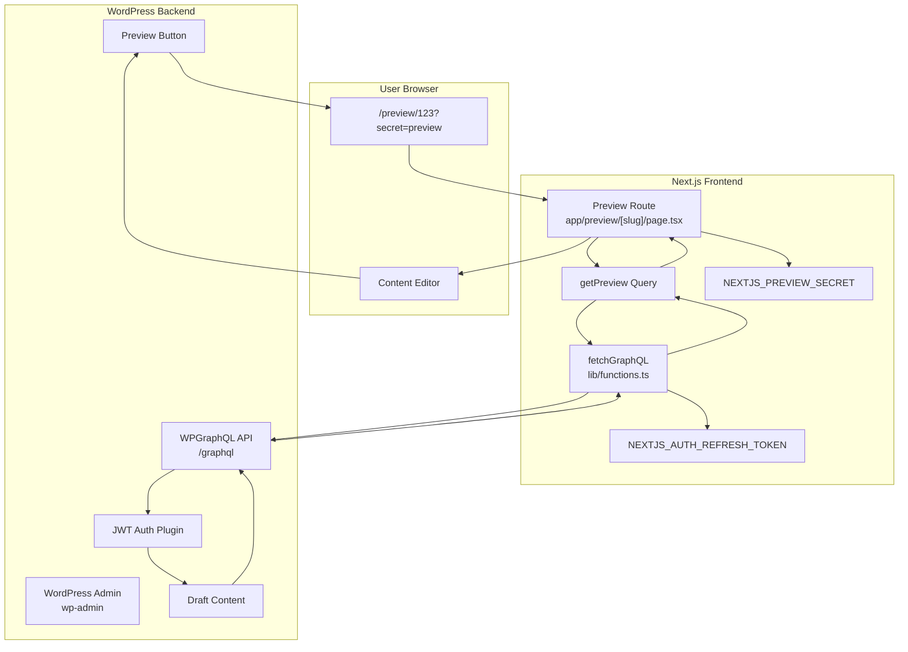
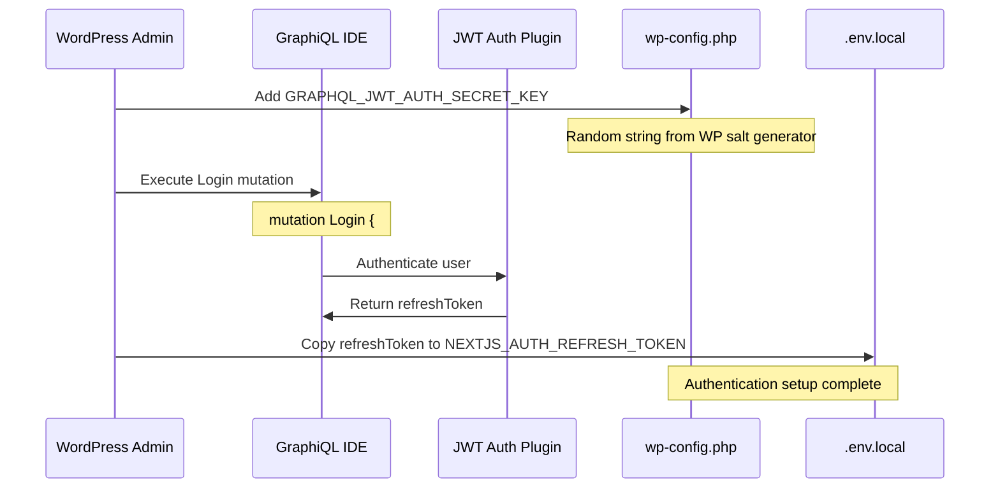
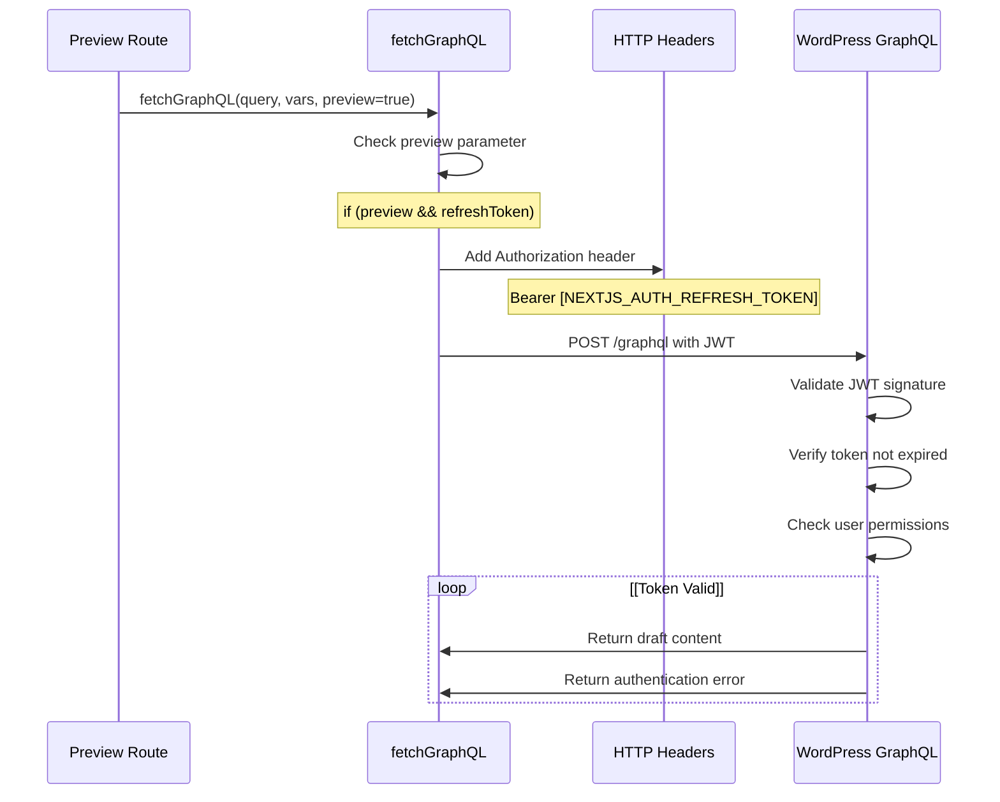
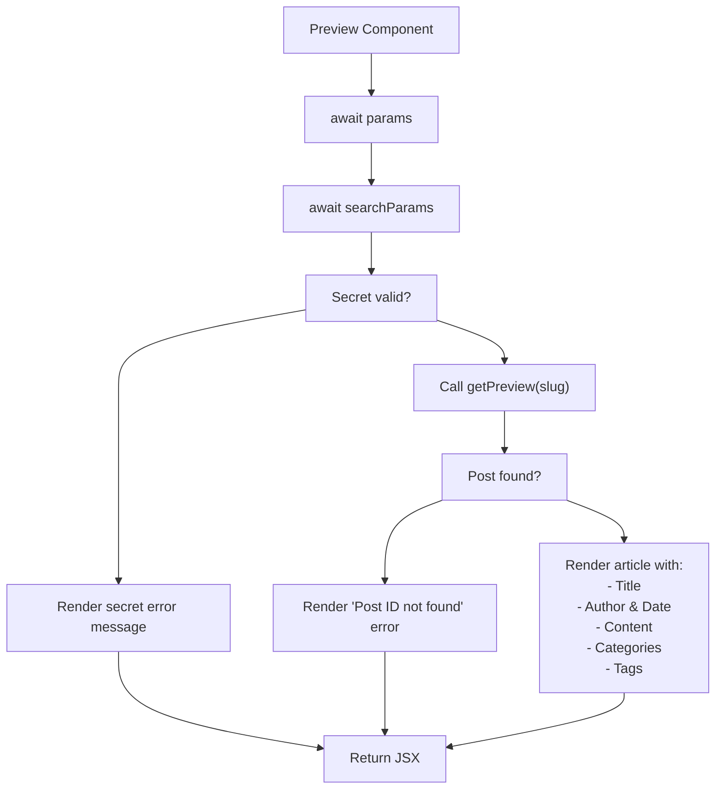
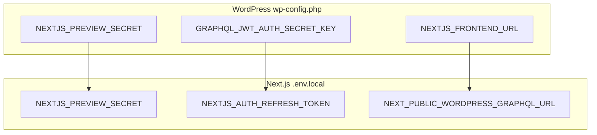
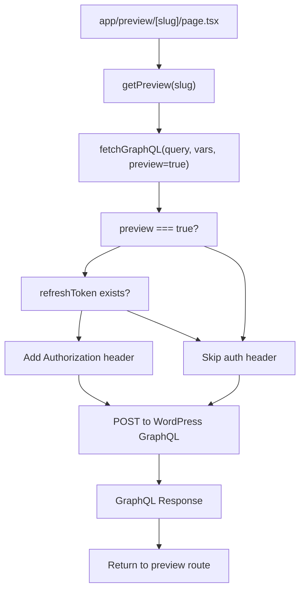

# Preview Mode

> **Relevant source files**
> * [AGENTS.md](https://github.com/gregrickaby/nextjs-wordpress/blob/63f3f2f5/AGENTS.md)
> * [CONTRIBUTING.md](https://github.com/gregrickaby/nextjs-wordpress/blob/63f3f2f5/CONTRIBUTING.md)
> * [README.md](https://github.com/gregrickaby/nextjs-wordpress/blob/63f3f2f5/README.md)
> * [app/api/revalidate/route.ts](https://github.com/gregrickaby/nextjs-wordpress/blob/63f3f2f5/app/api/revalidate/route.ts)
> * app/blog/category/[slug]/page.tsx
> * app/blog/tag/[slug]/page.tsx
> * app/preview/[slug]/page.tsx
> * [lib/functions.ts](https://github.com/gregrickaby/nextjs-wordpress/blob/63f3f2f5/lib/functions.ts)
> * [lib/queries/getAllBooks.ts](https://github.com/gregrickaby/nextjs-wordpress/blob/63f3f2f5/lib/queries/getAllBooks.ts)
> * [lib/queries/getAllPosts.ts](https://github.com/gregrickaby/nextjs-wordpress/blob/63f3f2f5/lib/queries/getAllPosts.ts)
> * [lib/queries/getBookBySlug.ts](https://github.com/gregrickaby/nextjs-wordpress/blob/63f3f2f5/lib/queries/getBookBySlug.ts)
> * [lib/queries/getPageBySlug.ts](https://github.com/gregrickaby/nextjs-wordpress/blob/63f3f2f5/lib/queries/getPageBySlug.ts)
> * [lib/queries/getPostBySlug.ts](https://github.com/gregrickaby/nextjs-wordpress/blob/63f3f2f5/lib/queries/getPostBySlug.ts)

## Purpose and Scope

Preview Mode enables viewing draft and unpublished WordPress content before it goes live. This system allows editors to review posts, pages, and custom post types in the Next.js frontend with the exact styling and layout they will have in production, without requiring publication.

This document covers the preview functionality implementation, JWT authentication flow, and route configuration. For information about cache invalidation after publishing previewed content, see [On-Demand Revalidation](/gregrickaby/nextjs-wordpress/6.3-on-demand-revalidation). For general WordPress backend configuration, see [WordPress Configuration](/gregrickaby/nextjs-wordpress/6.1-wordpress-configuration).

---

## System Architecture

Preview Mode operates as a separate route that bypasses the standard published content queries. It requires authentication because WordPress draft content is restricted to logged-in users with appropriate permissions.

### Preview Mode System Diagram



**Sources:** app/preview/[slug]/page.tsx:1-141, [lib/functions.ts L7-L88](https://github.com/gregrickaby/nextjs-wordpress/blob/63f3f2f5/lib/functions.ts#L7-L88)

 [README.md L184-L224](https://github.com/gregrickaby/nextjs-wordpress/blob/63f3f2f5/README.md#L184-L224)

---

## Authentication Flow

Preview Mode uses JWT (JSON Web Token) authentication to access restricted WordPress content. The authentication requires a one-time setup to generate a persistent refresh token.

### JWT Authentication Configuration

| Component | Purpose | Location |
| --- | --- | --- |
| `GRAPHQL_JWT_AUTH_SECRET_KEY` | WordPress constant for JWT signing | `wp-config.php` |
| `NEXTJS_AUTH_REFRESH_TOKEN` | Long-lived token for authentication | `.env.local` |
| `NEXTJS_PREVIEW_SECRET` | Validation key for preview requests | Both `wp-config.php` and `.env.local` |

### Authentication Setup Flow



**Sources:** [README.md L184-L224](https://github.com/gregrickaby/nextjs-wordpress/blob/63f3f2f5/README.md#L184-L224)

 [lib/functions.ts L19-L31](https://github.com/gregrickaby/nextjs-wordpress/blob/63f3f2f5/lib/functions.ts#L19-L31)

### Runtime Authentication Process

When a preview request is made, the authentication flow operates as follows:



**Sources:** [lib/functions.ts L19-L31](https://github.com/gregrickaby/nextjs-wordpress/blob/63f3f2f5/lib/functions.ts#L19-L31)

 [lib/functions.ts L45-L56](https://github.com/gregrickaby/nextjs-wordpress/blob/63f3f2f5/lib/functions.ts#L45-L56)

---

## Preview Route Implementation

The preview route is a dynamic Next.js route that accepts a slug (typically a WordPress post ID) and validates the request before fetching draft content.

### Route Structure

```
app/
  preview/
    [slug]/
      page.tsx      → Preview page component
```

### Request Validation

The preview route performs three validation checks before rendering content:

| Validation | Check | Error Response |
| --- | --- | --- |
| Secret presence | `searchParams.secret` exists | "This page requires a preview secret" |
| Secret match | `secret === NEXTJS_PREVIEW_SECRET` | "This page requires a preview secret" |
| Content exists | `getPreview(slug)` returns data | "Preview Error - Couldn't find post" |

**Implementation:** app/preview/[slug]/page.tsx:66-105

### Preview Component Flow



**Sources:** app/preview/[slug]/page.tsx:66-141

### Code Structure Analysis

The preview page component has three main sections:

**Props Interface:**

```
interface PreviewProps {
  params: Promise<{slug: string}>
  searchParams: Promise<{[key: string]: string | string[] | undefined}>
}
```

**Metadata Generation:** app/preview/[slug]/page.tsx:17-54

* Generates OpenGraph metadata for preview pages
* Sets `robots: 'noindex'` to prevent indexing
* Uses post title, excerpt, and featured image if available

**Component Rendering:** app/preview/[slug]/page.tsx:66-141

* Validates secret from query parameters
* Fetches preview data using `getPreview(slug)`
* Renders article markup with categories and tags
* Displays helpful error messages for invalid requests

---

## Configuration Requirements

Preview Mode requires synchronized configuration between WordPress and Next.js. Both systems must share secrets and have proper plugin setup.

### Environment Variables

| Variable | Required | Purpose | Example |
| --- | --- | --- | --- |
| `NEXTJS_PREVIEW_SECRET` | Yes | Validates preview requests | `"preview"` |
| `NEXTJS_AUTH_REFRESH_TOKEN` | Yes | Authenticates with WordPress | `"eyJhbGc..."` |
| `NEXT_PUBLIC_WORDPRESS_GRAPHQL_URL` | Yes | GraphQL endpoint | `"https://blog.example.com/graphql"` |

**Configuration:** [README.md L64-L87](https://github.com/gregrickaby/nextjs-wordpress/blob/63f3f2f5/README.md#L64-L87)

### WordPress Configuration

**Required Plugins:**

1. **WPGraphQL** - Provides GraphQL API
2. **WPGraphQL JWT Authentication** - Enables token-based auth
3. **Next.js WordPress Plugin** - Generates preview URLs

**wp-config.php Constants:**

```python
// Must match Next.js NEXTJS_PREVIEW_SECRET
define( 'NEXTJS_PREVIEW_SECRET', 'preview' );

// Optional: JWT signing key from WP salt generator
define( 'GRAPHQL_JWT_AUTH_SECRET_KEY', 'random-string' );

// Frontend URL for preview links
define( 'NEXTJS_FRONTEND_URL', 'https://example.com/' );
```

**Sources:** [README.md L145-L161](https://github.com/gregrickaby/nextjs-wordpress/blob/63f3f2f5/README.md#L145-L161)

 [README.md L184-L196](https://github.com/gregrickaby/nextjs-wordpress/blob/63f3f2f5/README.md#L184-L196)

### Configuration Validation



**Sources:** [README.md L64-L87](https://github.com/gregrickaby/nextjs-wordpress/blob/63f3f2f5/README.md#L64-L87)

 [README.md L145-L161](https://github.com/gregrickaby/nextjs-wordpress/blob/63f3f2f5/README.md#L145-L161)

---

## Security Considerations

Preview Mode implements multiple security layers to protect draft content from unauthorized access.

### Secret Validation

The preview secret acts as a shared key between WordPress and Next.js:

**Validation Logic:** app/preview/[slug]/page.tsx:76-88

```html
if (!secret || secret !== process.env.NEXTJS_PREVIEW_SECRET) {
  return (
    <div className="container mx-auto text-center">
      <h1>This page requires a preview secret.</h1>
      {/* ... error message ... */}
    </div>
  )
}
```

### Authorization Header Injection

When preview mode is enabled, the `fetchGraphQL` function conditionally adds authentication:

**Implementation:** [lib/functions.ts L27-L31](https://github.com/gregrickaby/nextjs-wordpress/blob/63f3f2f5/lib/functions.ts#L27-L31)

```
// If preview mode is enabled and we have a token.
if (preview && refreshToken) {
  // Add refresh token to fetch headers.
  headers['Authorization'] = `Bearer ${refreshToken}`
}
```

This ensures the JWT token is only sent when explicitly requesting preview content, not for public requests.

### Security Best Practices

| Practice | Implementation | Location |
| --- | --- | --- |
| Secret obfuscation | Use long random strings | `NEXTJS_PREVIEW_SECRET` env var |
| Token rotation | Regenerate refresh tokens periodically | WordPress GraphiQL |
| Slug validation | Validate slug format to prevent injection | Route parameter validation |
| No secret exposure | Never log or expose secrets in responses | Error messages omit secret values |

**Sources:** app/preview/[slug]/page.tsx:76-88, [lib/functions.ts L27-L31](https://github.com/gregrickaby/nextjs-wordpress/blob/63f3f2f5/lib/functions.ts#L27-L31)

---

## Usage Patterns

### Accessing Preview Content

**URL Structure:**

```yaml
https://example.com/preview/[slug]?secret=[NEXTJS_PREVIEW_SECRET]
```

**Examples:**

* Post preview by ID: `/preview/123?secret=preview`
* Page preview: `/preview/456?secret=preview`
* Book preview: `/preview/789?secret=preview`

**Sources:** [README.md L407-L409](https://github.com/gregrickaby/nextjs-wordpress/blob/63f3f2f5/README.md#L407-L409)

 app/preview/[slug]/page.tsx:62-63

### WordPress Preview Button Integration

When the Next.js WordPress Plugin is installed, WordPress automatically generates preview URLs with the correct format. The preview button in the WordPress editor will:

1. Construct the URL: `NEXTJS_FRONTEND_URL + /preview/ + POST_ID + ?secret= + NEXTJS_PREVIEW_SECRET`
2. Open the preview in a new tab
3. Display the draft content with frontend styling

**Configuration Dependency:** [README.md L145-L161](https://github.com/gregrickaby/nextjs-wordpress/blob/63f3f2f5/README.md#L145-L161)

### Error Handling Patterns

The preview route provides user-friendly error messages for common issues:

**Missing Secret Error:** app/preview/[slug]/page.tsx:78-87

* Displayed when `secret` parameter is missing or incorrect
* Instructs users to verify environment variable configuration
* Explains both `.env` and `wp-config.php` must have matching secrets

**Post Not Found Error:** app/preview/[slug]/page.tsx:95-104

* Displayed when `getPreview(slug)` returns null
* Shows the post ID being requested
* Suggests verifying the Post ID is correct

### Metadata Generation

Preview pages generate metadata but are marked as non-indexable:

**Key Metadata Features:** app/preview/[slug]/page.tsx:17-54

* Sets `robots: 'noindex'` to prevent search engine indexing
* Generates OpenGraph tags for social sharing
* Uses post title, excerpt, and featured image
* Includes fallback values for missing data

---

## Integration with Data Layer

Preview Mode integrates with the broader data fetching architecture through the `fetchGraphQL` function's `preview` parameter.

### Preview Query Flow



**Sources:** [lib/functions.ts L7-L88](https://github.com/gregrickaby/nextjs-wordpress/blob/63f3f2f5/lib/functions.ts#L7-L88)

 app/preview/[slug]/page.tsx:91

### Caching Behavior

Preview content bypasses the standard Next.js cache configuration:

**Cache Tags:** [lib/functions.ts L44-L56](https://github.com/gregrickaby/nextjs-wordpress/blob/63f3f2f5/lib/functions.ts#L44-L56)

```yaml
next: {
  tags: [slug, 'graphql', `type:${contentType}`],
  revalidate: config.revalidate
}
```

While preview requests use the same cache tag system, they fetch fresh data each time because:

1. Draft content changes frequently during editing
2. The JWT token provides access to current draft state
3. Preview routes are not pre-rendered at build time

### Relationship to Published Content

Preview Mode and published content queries share the same GraphQL schema but differ in execution:

| Aspect | Preview Mode | Published Content |
| --- | --- | --- |
| Authentication | JWT token required | No authentication |
| Query filter | `status: ANY` or by ID | `status: PUBLISH` |
| Caching | Fresh on each request | ISR with revalidation |
| Route | `/preview/[slug]` | Various published routes |
| Indexing | `noindex` | Indexed |

**Sources:** [lib/functions.ts L27-L31](https://github.com/gregrickaby/nextjs-wordpress/blob/63f3f2f5/lib/functions.ts#L27-L31)

 [lib/queries/getPostBySlug.ts L1-L83](https://github.com/gregrickaby/nextjs-wordpress/blob/63f3f2f5/lib/queries/getPostBySlug.ts#L1-L83)

 [lib/queries/getAllPosts.ts L10](https://github.com/gregrickaby/nextjs-wordpress/blob/63f3f2f5/lib/queries/getAllPosts.ts#L10-L10)

---

## Troubleshooting

### Common Issues

**Issue: "This page requires a preview secret" error**

* **Cause:** Secret mismatch between WordPress and Next.js
* **Solution:** Verify `NEXTJS_PREVIEW_SECRET` matches in both `.env.local` and `wp-config.php`
* **Check:** app/preview/[slug]/page.tsx:77, [README.md L82-L86](https://github.com/gregrickaby/nextjs-wordpress/blob/63f3f2f5/README.md#L82-L86)

**Issue: "Couldn't find a WordPress post" error**

* **Cause:** Invalid post ID or post doesn't exist
* **Solution:** Verify the post ID in WordPress admin, ensure post is saved as draft
* **Check:** app/preview/[slug]/page.tsx:94-104

**Issue: Preview shows published version instead of draft**

* **Cause:** Missing or invalid JWT refresh token
* **Solution:** Regenerate refresh token using Login mutation in GraphiQL
* **Check:** [README.md L184-L224](https://github.com/gregrickaby/nextjs-wordpress/blob/63f3f2f5/README.md#L184-L224)  [lib/functions.ts L20](https://github.com/gregrickaby/nextjs-wordpress/blob/63f3f2f5/lib/functions.ts#L20-L20)

**Issue: Authentication errors in preview**

* **Cause:** JWT token expired or invalid
* **Solution:** Generate new refresh token, update `NEXTJS_AUTH_REFRESH_TOKEN`
* **Check:** [README.md L198-L222](https://github.com/gregrickaby/nextjs-wordpress/blob/63f3f2f5/README.md#L198-L222)

### Debug Checklist

1. **Verify Environment Variables:** * `NEXTJS_PREVIEW_SECRET` is set in `.env.local` * `NEXTJS_AUTH_REFRESH_TOKEN` is set in `.env.local` * `NEXT_PUBLIC_WORDPRESS_GRAPHQL_URL` points to correct endpoint
2. **Verify WordPress Configuration:** * WPGraphQL JWT Authentication plugin is active * `GRAPHQL_JWT_AUTH_SECRET_KEY` is set in `wp-config.php` * `NEXTJS_PREVIEW_SECRET` matches Next.js value * `NEXTJS_FRONTEND_URL` points to Next.js frontend
3. **Test JWT Token:** * Run Login mutation in GraphiQL to verify credentials * Confirm returned `refreshToken` is valid * Update `NEXTJS_AUTH_REFRESH_TOKEN` with fresh token
4. **Verify URL Structure:** * Preview URL format: `/preview/[postId]?secret=[secret]` * Post ID is numeric (WordPress database ID) * Secret parameter is present in query string

**Sources:** [README.md L64-L87](https://github.com/gregrickaby/nextjs-wordpress/blob/63f3f2f5/README.md#L64-L87)

 [README.md L145-L161](https://github.com/gregrickaby/nextjs-wordpress/blob/63f3f2f5/README.md#L145-L161)

 [README.md L184-L224](https://github.com/gregrickaby/nextjs-wordpress/blob/63f3f2f5/README.md#L184-L224)