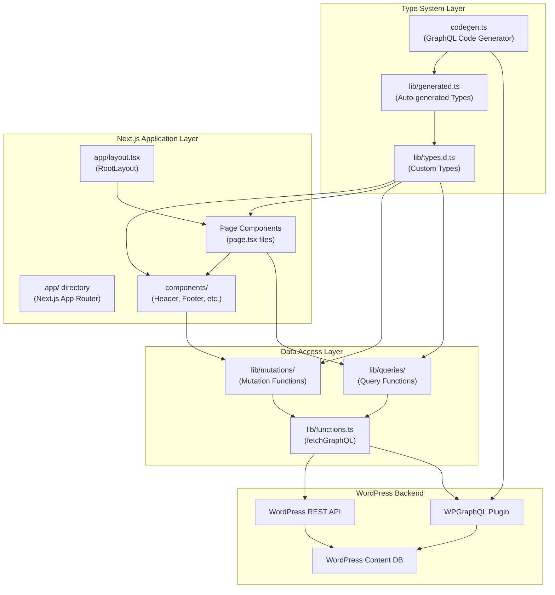
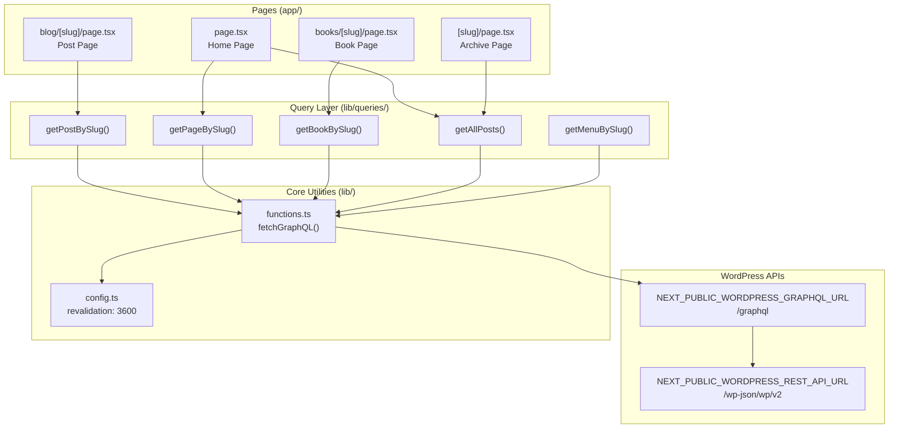
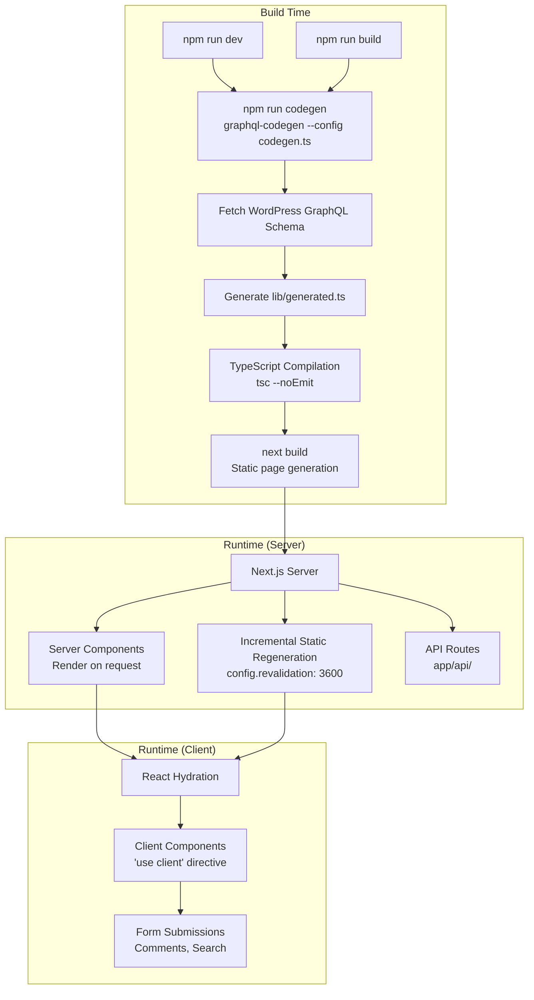
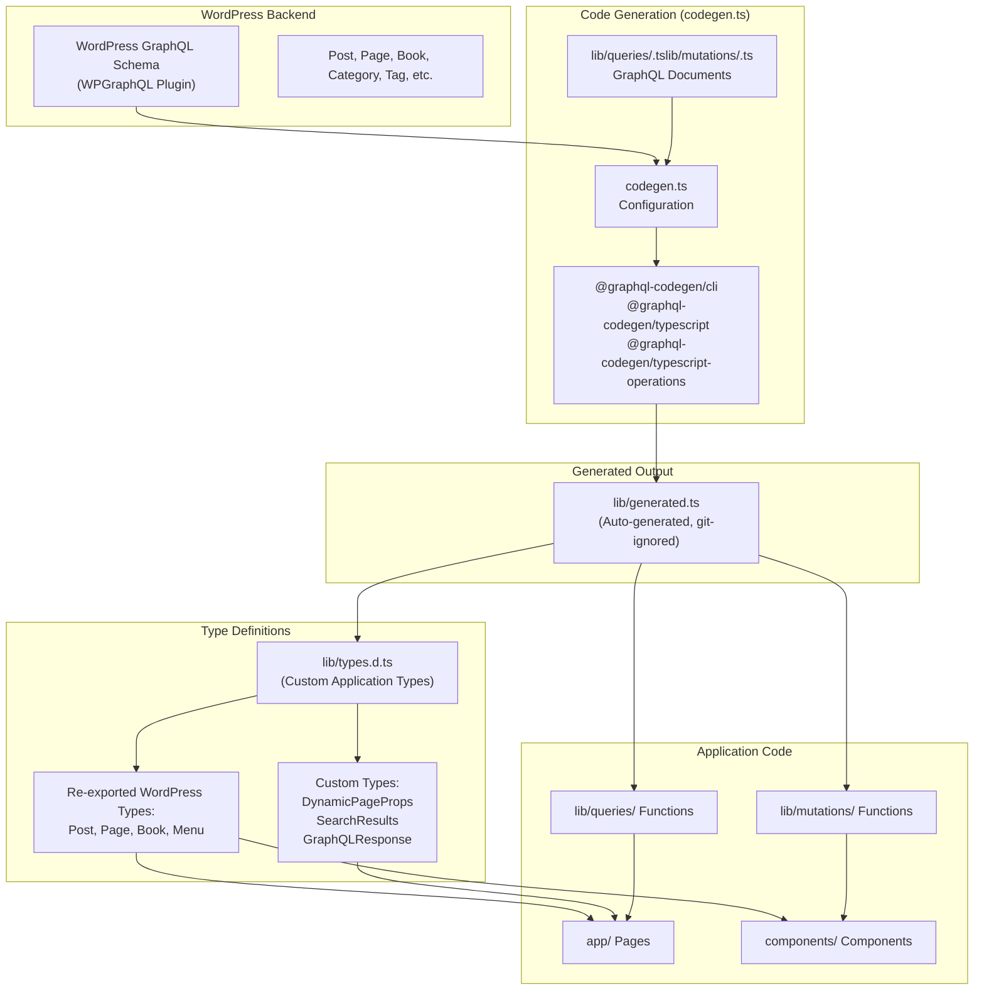

# Overview

> **Relevant source files**
> * [AGENTS.md](https://github.com/gregrickaby/nextjs-wordpress/blob/63f3f2f5/AGENTS.md)
> * [CONTRIBUTING.md](https://github.com/gregrickaby/nextjs-wordpress/blob/63f3f2f5/CONTRIBUTING.md)
> * [README.md](https://github.com/gregrickaby/nextjs-wordpress/blob/63f3f2f5/README.md)
> * [package-lock.json](https://github.com/gregrickaby/nextjs-wordpress/blob/63f3f2f5/package-lock.json)
> * [package.json](https://github.com/gregrickaby/nextjs-wordpress/blob/63f3f2f5/package.json)

This document provides a high-level introduction to the Next.js WordPress headless application. It covers the system architecture, technology stack, and core design concepts that underpin the entire codebase.

For detailed setup instructions and environment configuration, see [Getting Started](/gregrickaby/nextjs-wordpress/2-getting-started). For specific implementation details on components, queries, and testing, refer to the respective subsections throughout this wiki.

---

## What This System Does

This is a production-ready headless WordPress frontend built with Next.js 16. The application separates content management (WordPress) from content presentation (Next.js), enabling:

* **Server-side rendering** of WordPress content via GraphQL
* **Static site generation** with on-demand revalidation
* **Type-safe development** through auto-generated TypeScript definitions
* **Modern React patterns** using Server Components and the App Router

The system fetches content from a WordPress backend via the WPGraphQL plugin, renders it using React 19 Server Components, and serves optimized static pages with incremental regeneration.

**Sources:** [README.md L1-L48](https://github.com/gregrickaby/nextjs-wordpress/blob/63f3f2f5/README.md#L1-L48)

 [package.json L1-L72](https://github.com/gregrickaby/nextjs-wordpress/blob/63f3f2f5/package.json#L1-L72)

---

## Technology Stack

The following table summarizes the core technologies and their versions:

| Technology | Version | Purpose |
| --- | --- | --- |
| Next.js | 16.0.6 | App Router, React Compiler, Turbopack bundler |
| React | 19.2.0 | Server Components, client-side interactivity |
| TypeScript | 5.9.3 | Type safety across the codebase |
| Tailwind CSS | 4.1.17 | Utility-first styling framework |
| WordPress | N/A | Headless CMS via WPGraphQL |
| GraphQL Code Generator | 6.1.0 | Auto-generate TypeScript types from WordPress schema |
| Vitest | 4.0.14 | Unit and integration testing |
| MSW | 2.12.3 | API mocking for tests |

**Development Tools:**

* **ESLint** (9.39.1) - Code linting with Next.js config
* **Prettier** (3.7.3) - Code formatting
* **Lefthook** (2.0.4) - Git hooks for pre-commit validation
* **SonarQube** - Code quality analysis
* **GitHub Actions** - CI/CD pipeline

**Sources:** [package.json L31-L71](https://github.com/gregrickaby/nextjs-wordpress/blob/63f3f2f5/package.json#L31-L71)

 [README.md L9-L16](https://github.com/gregrickaby/nextjs-wordpress/blob/63f3f2f5/README.md#L9-L16)

---

## System Architecture

The system is organized into distinct layers, each with clear responsibilities:

### High-Level Component Layers



**Sources:** [README.md L50-L166](https://github.com/gregrickaby/nextjs-wordpress/blob/63f3f2f5/README.md#L50-L166)

 [AGENTS.md L66-L80](https://github.com/gregrickaby/nextjs-wordpress/blob/63f3f2f5/AGENTS.md#L66-L80)

---

### Data Flow Architecture

This diagram shows how data flows from WordPress through the application to rendered pages, using actual function and file names:



**Key Observations:**

* All page components in `app/` consume query functions from `lib/queries/`
* All GraphQL operations funnel through the single `fetchGraphQL()` function in [lib/functions.ts](https://github.com/gregrickaby/nextjs-wordpress/blob/63f3f2f5/lib/functions.ts)
* The `fetchGraphQL()` function handles caching, error handling, and Next.js cache tags
* Configuration values (like revalidation interval) are centralized in [lib/config.ts](https://github.com/gregrickaby/nextjs-wordpress/blob/63f3f2f5/lib/config.ts)

**Sources:** [AGENTS.md L66-L80](https://github.com/gregrickaby/nextjs-wordpress/blob/63f3f2f5/AGENTS.md#L66-L80)

 [README.md L236-L343](https://github.com/gregrickaby/nextjs-wordpress/blob/63f3f2f5/README.md#L236-L343)

---

### Build-Time vs Runtime Processes



**Build-Time Operations:**

* **Code Generation** (`npm run codegen`) runs automatically before `npm run dev` and `npm run build` [package.json L17-L19](https://github.com/gregrickaby/nextjs-wordpress/blob/63f3f2f5/package.json#L17-L19)
* The `codegen.ts` configuration introspects the WordPress GraphQL schema and generates TypeScript types in `lib/generated.ts`
* TypeScript compilation validates all type usage before the Next.js build begins
* Next.js build generates static pages using `generateStaticParams()` for dynamic routes

**Runtime Operations:**

* **Server Components** render on each request, fetching fresh data from WordPress via `fetchGraphQL()`
* **ISR (Incremental Static Regeneration)** caches rendered pages based on the `revalidation` value in [lib/config.ts](https://github.com/gregrickaby/nextjs-wordpress/blob/63f3f2f5/lib/config.ts)
* **API Routes** handle on-demand revalidation via `app/api/revalidate/route.ts`
* **Client Components** handle interactive features (forms, search) after hydration

**Sources:** [package.json L16-L29](https://github.com/gregrickaby/nextjs-wordpress/blob/63f3f2f5/package.json#L16-L29)

 [README.md L227-L233](https://github.com/gregrickaby/nextjs-wordpress/blob/63f3f2f5/README.md#L227-L233)

 [AGENTS.md L84-L96](https://github.com/gregrickaby/nextjs-wordpress/blob/63f3f2f5/AGENTS.md#L84-L96)

---

### Type System Flow



**Type System Key Points:**

* **Two-Stage Type Definition:** WordPress types are generated in `lib/generated.ts`, then re-exported and augmented in `lib/types.d.ts`
* **Git-Ignored Generation:** The `lib/generated.ts` file is excluded from version control and regenerated in each environment
* **Type Safety Enforcement:** All GraphQL queries and mutations reference types from `lib/generated.ts`, ensuring they match the WordPress schema
* **Null Safety:** Generated types use `Maybe<T>` for nullable fields, enforcing null checks with `??` operators

**Sources:** [README.md L236-L343](https://github.com/gregrickaby/nextjs-wordpress/blob/63f3f2f5/README.md#L236-L343)

 [AGENTS.md L126-L141](https://github.com/gregrickaby/nextjs-wordpress/blob/63f3f2f5/AGENTS.md#L126-L141)

---

## Core Concepts

### 1. Headless WordPress Architecture

The system separates WordPress (content management) from Next.js (content presentation). WordPress serves only as a data API via:

* **WPGraphQL Plugin** - GraphQL endpoint at `/graphql`
* **WordPress REST API** - Search functionality via `/wp-json/wp/v2/search`

This separation enables:

* Independent scaling of frontend and backend
* Multiple frontends consuming the same WordPress data
* Modern React patterns without WordPress PHP constraints

**Sources:** [README.md L1-L48](https://github.com/gregrickaby/nextjs-wordpress/blob/63f3f2f5/README.md#L1-L48)

---

### 2. Server Components First

Next.js 16 defaults to Server Components, which render on the server and do not ship JavaScript to the client. This project follows that pattern:

* **Server Components:** `app/layout.tsx`, all `page.tsx` files, `components/Header.tsx`
* **Client Components:** `components/Footer.tsx`, `components/SearchForm.tsx`, `components/CommentForm.tsx` (marked with `'use client'`)

Client Components are used only where interactivity is required (forms, event handlers).

**Sources:** [AGENTS.md L98-L125](https://github.com/gregrickaby/nextjs-wordpress/blob/63f3f2f5/AGENTS.md#L98-L125)

 [README.md L167-L182](https://github.com/gregrickaby/nextjs-wordpress/blob/63f3f2f5/README.md#L167-L182)

---

### 3. Type-Safe GraphQL Integration

All GraphQL operations are fully typed using `@graphql-codegen/cli`:

**Workflow:**

1. Write GraphQL query in `lib/queries/*.ts` or mutation in `lib/mutations/*.ts`
2. Run `npm run codegen` to generate TypeScript types from WordPress schema
3. Import types from `lib/generated.ts` or `lib/types.d.ts`
4. TypeScript compiler validates all type usage

**Example Pattern:**

```typescript
// lib/queries/getPostBySlug.ts uses generated Post type
import type {Post} from '@/lib/generated'

export default async function getPostBySlug(slug: string): Promise<Post | null> {
  const response = await fetchGraphQL(query, {slug})
  return response?.data?.post ?? null
}
```

**Sources:** [README.md L236-L343](https://github.com/gregrickaby/nextjs-wordpress/blob/63f3f2f5/README.md#L236-L343)

 [AGENTS.md L126-L141](https://github.com/gregrickaby/nextjs-wordpress/blob/63f3f2f5/AGENTS.md#L126-L141)

---

### 4. Caching and Revalidation Strategy

The system uses a multi-layer caching approach:

**Next.js ISR (Incremental Static Regeneration):**

* Pages are statically generated at build time
* Cached for `revalidation: 3600` seconds (1 hour) as defined in [lib/config.ts](https://github.com/gregrickaby/nextjs-wordpress/blob/63f3f2f5/lib/config.ts)
* Automatically regenerated after cache expires

**On-Demand Revalidation:**

* WordPress triggers revalidation via webhook to `app/api/revalidate/route.ts`
* Invalidates both path cache and tag cache
* Rate-limited to 10 requests per minute per IP

**Cache Tags:**

* Slug-specific tags: `post-hello-world`, `page-about`
* Type-specific tags: `posts`, `pages`, `books`
* Global tag: `graphql`

**Sources:** [README.md L19-L34](https://github.com/gregrickaby/nextjs-wordpress/blob/63f3f2f5/README.md#L19-L34)

 Diagram 5 from context

---

### 5. Test-Driven Development

All code changes must include co-located tests:

* **Unit Tests:** `.test.ts` files next to functions
* **Component Tests:** `.test.tsx` files next to components
* **API Mocking:** MSW v2 intercepts HTTP requests (never mock `global.fetch`)
* **Accessibility:** `jest-axe` validates WCAG 2.1 AA compliance

**Test Utilities:**

* All test imports come from `@/test-utils` (pre-configured)
* Pre-configured `user` instance for `userEvent.setup()`
* MSW `server` instance with global setup/teardown

**Sources:** [AGENTS.md L172-L221](https://github.com/gregrickaby/nextjs-wordpress/blob/63f3f2f5/AGENTS.md#L172-L221)

 [CONTRIBUTING.md L95-L265](https://github.com/gregrickaby/nextjs-wordpress/blob/63f3f2f5/CONTRIBUTING.md#L95-L265)

---

## Key Design Decisions

### Why No Third-Party GraphQL Client?

The codebase uses a custom `fetchGraphQL()` function in [lib/functions.ts](https://github.com/gregrickaby/nextjs-wordpress/blob/63f3f2f5/lib/functions.ts)

 instead of Apollo Client or URQL because:

* Next.js automatically memoizes and caches `fetch()` requests
* Simpler dependency tree (fewer packages)
* Full control over caching and error handling
* No need for React Context providers or client-side state management

**Sources:** [README.md L340-L343](https://github.com/gregrickaby/nextjs-wordpress/blob/63f3f2f5/README.md#L340-L343)

---

### Why GraphQL Code Generator?

Using `@graphql-codegen/cli` provides:

* **Type Safety:** All queries are validated against WordPress schema at build time
* **IntelliSense:** Full autocomplete for WordPress data structures
* **Refactoring Safety:** Type errors surface immediately when WordPress schema changes
* **Zero Runtime Cost:** Type generation happens at build time

**Sources:** [AGENTS.md L81-L96](https://github.com/gregrickaby/nextjs-wordpress/blob/63f3f2f5/AGENTS.md#L81-L96)

 [package.json L38-L40](https://github.com/gregrickaby/nextjs-wordpress/blob/63f3f2f5/package.json#L38-L40)

---

### Why Server Components?

Server Components are the default in Next.js 16 App Router because they:

* Reduce JavaScript bundle size (components don't ship to client)
* Improve performance (no hydration overhead)
* Enable direct database/API access without client-side exposure
* Simplify data fetching (async/await directly in components)

Client Components are used only where necessary (`'use client'` directive).

**Sources:** [AGENTS.md L98-L125](https://github.com/gregrickaby/nextjs-wordpress/blob/63f3f2f5/AGENTS.md#L98-L125)

 [README.md L167-L182](https://github.com/gregrickaby/nextjs-wordpress/blob/63f3f2f5/README.md#L167-L182)

---

### Why MSW v2 for Testing?

Mock Service Worker v2 is used for API mocking because:

* **No Fetch Mocking:** Tests use the real `fetch()` implementation
* **Request Interception:** MSW intercepts network requests at the network layer
* **Realistic Tests:** Tests behave more like production code
* **No Monkey Patching:** Doesn't modify global objects

**Sources:** [AGENTS.md L322-L354](https://github.com/gregrickaby/nextjs-wordpress/blob/63f3f2f5/AGENTS.md#L322-L354)

 [CONTRIBUTING.md L102-L104](https://github.com/gregrickaby/nextjs-wordpress/blob/63f3f2f5/CONTRIBUTING.md#L102-L104)

---

## Directory Structure Overview

```markdown
nextjs-wordpress/
├── app/                          # Next.js App Router
│   ├── layout.tsx                # Root layout with Header/Footer
│   ├── page.tsx                  # Home page
│   ├── blog/
│   │   ├── [slug]/page.tsx       # Single post page
│   │   ├── category/[slug]/page.tsx
│   │   └── tag/[slug]/page.tsx
│   ├── books/[slug]/page.tsx     # Custom post type
│   ├── preview/[slug]/page.tsx   # Draft preview with JWT auth
│   ├── api/
│   │   └── revalidate/route.ts   # On-demand revalidation API
│   ├── feed.xml/route.ts         # RSS feed generation
│   ├── sitemap.xml/route.ts      # Sitemap generation
│   └── robots.txt/route.ts       # Robots.txt generation
├── components/                   # React components
│   ├── Header.tsx                # Server Component
│   ├── Footer.tsx                # Client Component
│   ├── SearchForm.tsx            # Client Component
│   └── CommentForm.tsx           # Client Component
├── lib/
│   ├── queries/                  # GraphQL query functions
│   ├── mutations/                # GraphQL mutation functions
│   ├── functions.ts              # fetchGraphQL and utilities
│   ├── config.ts                 # Site configuration
│   ├── types.d.ts                # Custom TypeScript types
│   └── generated.ts              # Auto-generated (git-ignored)
├── public/                       # Static assets
├── .github/
│   ├── workflows/                # GitHub Actions CI/CD
│   └── agents/                   # AI agent definitions
├── codegen.ts                    # GraphQL Code Generator config
├── next.config.ts                # Next.js configuration
├── vitest.config.ts              # Vitest test configuration
└── test-utils.tsx                # Shared test utilities
```

**Sources:** [AGENTS.md L66-L80](https://github.com/gregrickaby/nextjs-wordpress/blob/63f3f2f5/AGENTS.md#L66-L80)

 [README.md L50-L166](https://github.com/gregrickaby/nextjs-wordpress/blob/63f3f2f5/README.md#L50-L166)

---

## Environment Variables

The system requires the following environment variables configured in `.env.local`:

| Variable | Purpose | Required |
| --- | --- | --- |
| `NEXT_PUBLIC_WORDPRESS_GRAPHQL_URL` | WordPress GraphQL endpoint URL | Yes |
| `NEXT_PUBLIC_WORDPRESS_REST_API_URL` | WordPress REST API URL for search | Yes |
| `NEXTJS_AUTH_REFRESH_TOKEN` | JWT refresh token for preview mode | Optional |
| `NEXTJS_PREVIEW_SECRET` | Secret key for draft previews | Yes |
| `NEXTJS_REVALIDATION_SECRET` | Secret key for on-demand revalidation | Yes |

All secrets must also be configured in `wp-config.php` on the WordPress backend to enable webhook integration.

**Sources:** [README.md L64-L90](https://github.com/gregrickaby/nextjs-wordpress/blob/63f3f2f5/README.md#L64-L90)

 [README.md L146-L161](https://github.com/gregrickaby/nextjs-wordpress/blob/63f3f2f5/README.md#L146-L161)

---

## Next Steps

For detailed information on specific subsystems, refer to:

* **[Getting Started](/gregrickaby/nextjs-wordpress/2-getting-started)** - Environment setup and development commands
* **[Architecture](/gregrickaby/nextjs-wordpress/3-architecture)** - Deep dive into type system, data flow, and caching
* **[Frontend Application](/gregrickaby/nextjs-wordpress/4-frontend-application)** - Pages, components, and routing details
* **[Data Access Layer](/gregrickaby/nextjs-wordpress/5-data-access-layer)** - GraphQL queries, mutations, and fetchGraphQL utility
* **[WordPress Integration](/gregrickaby/nextjs-wordpress/6-wordpress-integration)** - Required plugins, wp-config.php settings, and webhook configuration
* **[Testing](/gregrickaby/nextjs-wordpress/8-testing)** - Testing infrastructure, writing tests, and coverage goals
* **[Build and Deployment](/gregrickaby/nextjs-wordpress/9-build-and-deployment)** - Build process, CI/CD pipeline, and static generation