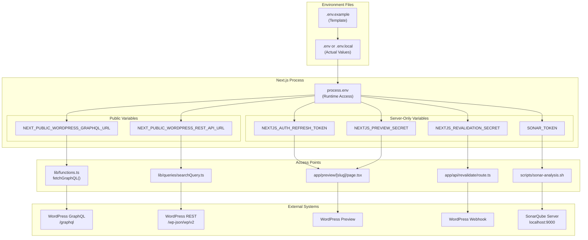
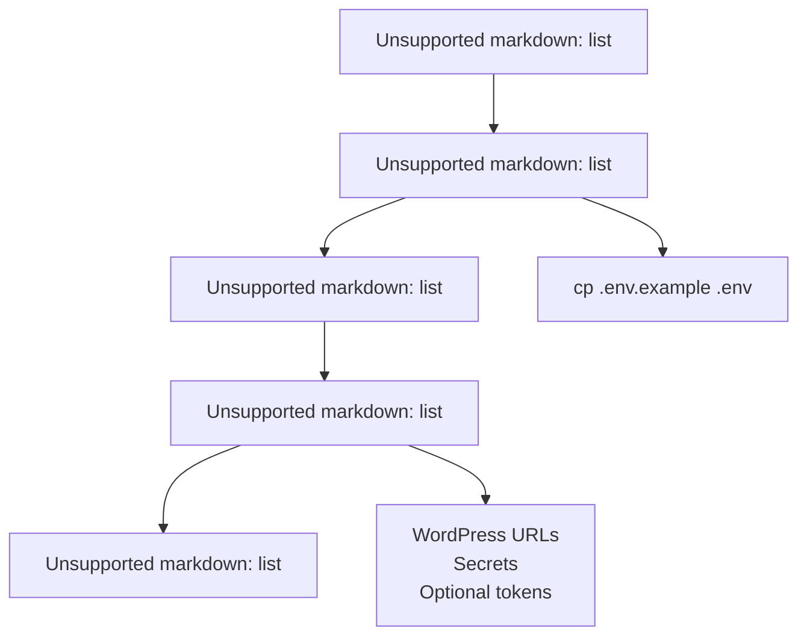
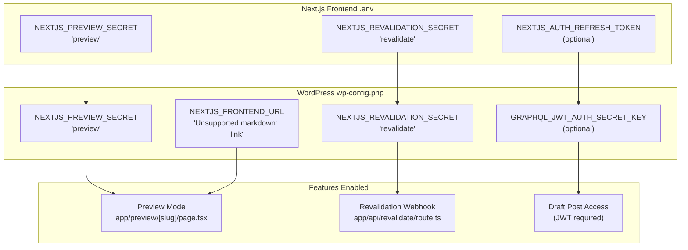
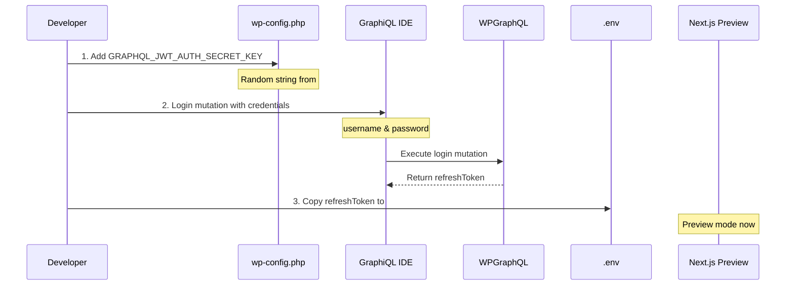
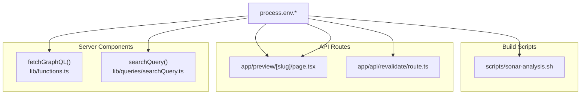
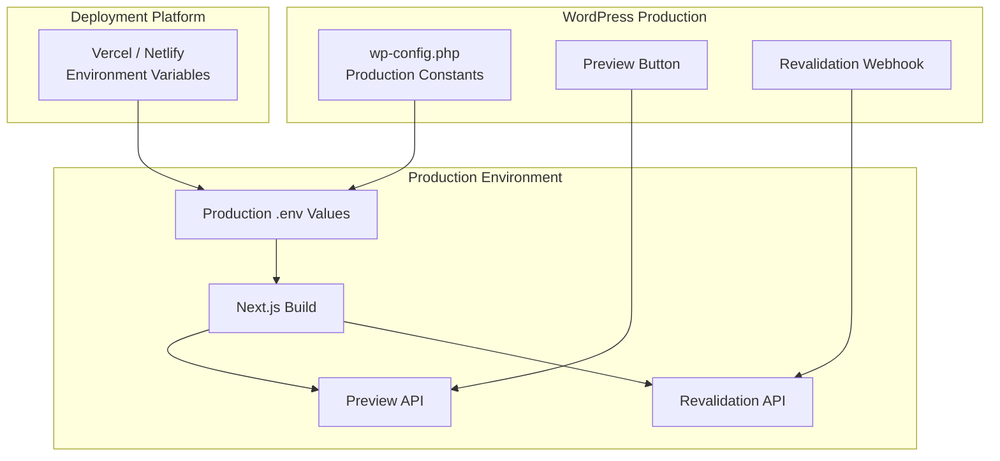

---
layout: default
title: Environment Configuration
parent: Getting Started
nav_order: 1
---

# Environment Configuration

> **Relevant source files**
> * [.env.example](https://github.com/gregrickaby/nextjs-wordpress/blob/63f3f2f5/.env.example)
> * [.gitignore](https://github.com/gregrickaby/nextjs-wordpress/blob/63f3f2f5/.gitignore)
> * [.vscode/extensions.json](https://github.com/gregrickaby/nextjs-wordpress/blob/63f3f2f5/.vscode/extensions.json)
> * [.vscode/settings.json](https://github.com/gregrickaby/nextjs-wordpress/blob/63f3f2f5/.vscode/settings.json)
> * [AGENTS.md](https://github.com/gregrickaby/nextjs-wordpress/blob/63f3f2f5/AGENTS.md)
> * [CONTRIBUTING.md](https://github.com/gregrickaby/nextjs-wordpress/blob/63f3f2f5/CONTRIBUTING.md)
> * [README.md](https://github.com/gregrickaby/nextjs-wordpress/blob/63f3f2f5/README.md)
> * [scripts/sonar-analysis.sh](https://github.com/gregrickaby/nextjs-wordpress/blob/63f3f2f5/scripts/sonar-analysis.sh)
> * [sonar-project.properties](https://github.com/gregrickaby/nextjs-wordpress/blob/63f3f2f5/sonar-project.properties)

This document details all environment variables, configuration files, and secrets required to run the Next.js WordPress headless application. It covers both the Next.js frontend environment and the required WordPress backend configuration that must be synchronized.

For information about running development commands after configuration, see [Development Commands](/gregrickaby/nextjs-wordpress/2.2-development-commands). For WordPress plugin setup and integration details, see [WordPress Configuration](/gregrickaby/nextjs-wordpress/6.1-wordpress-configuration).

---

## Overview

The application requires configuration at three levels:

1. **Environment variables** (`.env` or `.env.local`) - API endpoints and secrets
2. **Next.js configuration** (`next.config.ts`) - Image domains and framework settings
3. **Application configuration** (`lib/config.ts`) - Site metadata and caching behavior

All configuration must be synchronized between the Next.js frontend and WordPress backend for features like preview mode and on-demand revalidation to function correctly.

**Sources:** [README.md L64-L88](https://github.com/gregrickaby/nextjs-wordpress/blob/63f3f2f5/README.md#L64-L88)

 [.env.example L1-L18](https://github.com/gregrickaby/nextjs-wordpress/blob/63f3f2f5/.env.example#L1-L18)

---

## Environment Variables Reference

### Required Variables

| Variable | Visibility | Purpose | Example |
| --- | --- | --- | --- |
| `NEXT_PUBLIC_WORDPRESS_GRAPHQL_URL` | Public | WordPress GraphQL API endpoint | `https://blog.nextjswp.com/graphql` |
| `NEXT_PUBLIC_WORDPRESS_REST_API_URL` | Public | WordPress REST API endpoint | `https://blog.nextjswp.com/wp-json/wp/v2` |
| `NEXTJS_PREVIEW_SECRET` | Server-only | Secret for authenticating preview requests | `preview` |
| `NEXTJS_REVALIDATION_SECRET` | Server-only | Secret for authenticating revalidation webhook | `revalidate` |

**Sources:** [.env.example L1-L14](https://github.com/gregrickaby/nextjs-wordpress/blob/63f3f2f5/.env.example#L1-L14)

 [README.md L72-L87](https://github.com/gregrickaby/nextjs-wordpress/blob/63f3f2f5/README.md#L72-L87)

### Optional Variables

| Variable | Visibility | Purpose | Usage Context |
| --- | --- | --- | --- |
| `NEXTJS_AUTH_REFRESH_TOKEN` | Server-only | JWT refresh token for draft post access | Preview mode only (see [Preview Mode](/gregrickaby/nextjs-wordpress/6.2-preview-mode)) |
| `SONAR_TOKEN` | Server-only | SonarQube authentication token | Local code quality analysis |
| `NODE_TLS_REJECT_UNAUTHORIZED` | Server-only | Disable TLS certificate validation | **Local development with self-signed certs only** |

**Sources:** [.env.example L7-L17](https://github.com/gregrickaby/nextjs-wordpress/blob/63f3f2f5/.env.example#L7-L17)

 [README.md L89](https://github.com/gregrickaby/nextjs-wordpress/blob/63f3f2f5/README.md#L89-L89)

---

## Environment Variable Architecture

The following diagram shows how environment variables flow through the system and where they are accessed:

### Environment Variable Flow Diagram



**Key Observations:**

* **Public variables** (`NEXT_PUBLIC_*`) are embedded in client-side bundles and visible in browser DevTools
* **Server-only variables** are never exposed to the client and only accessible in Server Components and API Routes
* The `NEXTJS_AUTH_REFRESH_TOKEN` is only used when fetching draft posts via app/preview/[slug]/page.tsx:1-100
* Secrets must be synchronized between `.env` and WordPress `wp-config.php` constants

**Sources:** [.env.example L1-L18](https://github.com/gregrickaby/nextjs-wordpress/blob/63f3f2f5/.env.example#L1-L18)

 [lib/functions.ts L1-L100](https://github.com/gregrickaby/nextjs-wordpress/blob/63f3f2f5/lib/functions.ts#L1-L100)

 [app/api/revalidate/route.ts L1-L100](https://github.com/gregrickaby/nextjs-wordpress/blob/63f3f2f5/app/api/revalidate/route.ts#L1-L100)

 [scripts/sonar-analysis.sh L12-L20](https://github.com/gregrickaby/nextjs-wordpress/blob/63f3f2f5/scripts/sonar-analysis.sh#L12-L20)

---

## Environment File Setup

### File Locations and Priority

Next.js loads environment variables from multiple files with the following priority (highest to lowest):

| File | Priority | Use Case | Version Control |
| --- | --- | --- | --- |
| `.env.local` | 1 (highest) | Local development overrides | ❌ Excluded (`.gitignore`) |
| `.env` | 2 | Local development | ❌ Excluded (`.gitignore`) |
| `.env.example` | N/A | Template with example values | ✅ Committed |

**Sources:** [README.md L64-L68](https://github.com/gregrickaby/nextjs-wordpress/blob/63f3f2f5/README.md#L64-L68)

 [.gitignore L30-L31](https://github.com/gregrickaby/nextjs-wordpress/blob/63f3f2f5/.gitignore#L30-L31)

### Initial Setup Steps

The standard initialization sequence is:



**Command sequence:**

```sql
# 1. Clone repository
git clone git@github.com:gregrickaby/nextjs-wordpress.git

# 2. Copy environment template
cp .env.example .env

# 3. Edit with your WordPress URLs
# Update NEXT_PUBLIC_WORDPRESS_GRAPHQL_URL
# Update NEXT_PUBLIC_WORDPRESS_REST_API_URL
# Generate secrets for NEXTJS_PREVIEW_SECRET and NEXTJS_REVALIDATION_SECRET
```

**Sources:** [README.md L50-L87](https://github.com/gregrickaby/nextjs-wordpress/blob/63f3f2f5/README.md#L50-L87)

 [CONTRIBUTING.md L24-L32](https://github.com/gregrickaby/nextjs-wordpress/blob/63f3f2f5/CONTRIBUTING.md#L24-L32)

---

## Next.js Configuration Files

Beyond environment variables, the application requires configuration in two Next.js files:

### next.config.ts - Image Domains

The `next.config.ts` file must specify allowed image domains for Next.js Image Optimization:

| Configuration | Purpose | Required Update |
| --- | --- | --- |
| `images.remotePatterns[0].hostname` | WordPress media domain | Change `*.nextjswp.**` to your domain |
| `images.remotePatterns[1].hostname` | Gravatar avatars | Keep as `*.gravatar.**` |
| `images.formats` | Image formats | Keep default `['image/avif', 'image/webp']` |

**Example configuration pattern:**

```javascript
// next.config.ts structure (see next.config.ts:1-15)
const nextConfig: NextConfig = {
  images: {
    formats: ['image/avif', 'image/webp'],
    remotePatterns: [
      {
        protocol: 'https',
        hostname: '*.nextjswp.**' // Update to your WordPress domain
      },
      {
        protocol: 'https',
        hostname: '*.gravatar.**' // Keep for comment avatars
      }
    ]
  }
}
```

**Sources:** [README.md L91-L115](https://github.com/gregrickaby/nextjs-wordpress/blob/63f3f2f5/README.md#L91-L115)

### lib/config.ts - Application Settings

The `lib/config.ts` file contains site-wide configuration separate from environment variables:

| Property | Type | Purpose | Example |
| --- | --- | --- | --- |
| `siteName` | `string` | Site title for metadata | `'Next.js WordPress'` |
| `siteDescription` | `string` | Default meta description | `"It's headless WordPress!"` |
| `siteUrl` | `string` | Canonical site URL | `'https://nextjswp.com'` |
| `revalidation` | `number` | Default ISR revalidation interval (seconds) | `3600` |

**Sources:** [README.md L117-L128](https://github.com/gregrickaby/nextjs-wordpress/blob/63f3f2f5/README.md#L117-L128)

---

## WordPress Backend Configuration

The WordPress backend requires synchronized configuration in `wp-config.php`:

### WordPress Configuration Diagram



### Required WordPress Constants

The following constants must be defined in WordPress `wp-config.php`:

```
// wp-config.php constants (see README.md:149-161)

// Next.js frontend URL (include trailing slash)
define( 'NEXTJS_FRONTEND_URL', 'https://nextjswp.com/' );

// Must match NEXTJS_PREVIEW_SECRET in .env
define( 'NEXTJS_PREVIEW_SECRET', 'preview' );

// Must match NEXTJS_REVALIDATION_SECRET in .env
define( 'NEXTJS_REVALIDATION_SECRET', 'revalidate' );

// Optional: JWT authentication (for previews)
// define( 'GRAPHQL_JWT_AUTH_SECRET_KEY', 'your-secret-key' );
```

**Critical Synchronization Rules:**

1. `NEXTJS_PREVIEW_SECRET` must be identical in both `.env` and `wp-config.php`
2. `NEXTJS_REVALIDATION_SECRET` must be identical in both `.env` and `wp-config.php`
3. `NEXTJS_FRONTEND_URL` must point to the URL where Next.js is deployed
4. All secrets should be generated using cryptographically secure random strings

**Sources:** [README.md L145-L161](https://github.com/gregrickaby/nextjs-wordpress/blob/63f3f2f5/README.md#L145-L161)

---

## Authentication Token Generation

For preview mode with draft posts, a JWT refresh token must be generated from WordPress:

### JWT Token Flow



**GraphQL mutation used to generate token:**

```css
# Execute in WordPress GraphiQL IDE (see README.md:201-213)
mutation Login {
  login(
    input: {
      clientMutationId: "uniqueId"
      password: "your_password"
      username: "your_username"
    }
  ) {
    refreshToken
  }
}
```

**Process steps:**

1. Install and activate WPGraphQL JWT Authentication plugin
2. Generate random string using [WordPress salt generator](https://api.wordpress.org/secret-key/1.1/salt/)
3. Add `GRAPHQL_JWT_AUTH_SECRET_KEY` constant to `wp-config.php`
4. Execute login mutation in GraphiQL IDE
5. Copy returned `refreshToken` to `NEXTJS_AUTH_REFRESH_TOKEN` in `.env`

**Sources:** [README.md L184-L224](https://github.com/gregrickaby/nextjs-wordpress/blob/63f3f2f5/README.md#L184-L224)

 [AGENTS.md L160-L168](https://github.com/gregrickaby/nextjs-wordpress/blob/63f3f2f5/AGENTS.md#L160-L168)

---

## Environment Variable Usage in Code

The following table maps environment variables to their code usage locations:

| Variable | File(s) | Function/Component | Access Method |
| --- | --- | --- | --- |
| `NEXT_PUBLIC_WORDPRESS_GRAPHQL_URL` | [lib/functions.ts L1-L100](https://github.com/gregrickaby/nextjs-wordpress/blob/63f3f2f5/lib/functions.ts#L1-L100) | `fetchGraphQL()` | `process.env.NEXT_PUBLIC_WORDPRESS_GRAPHQL_URL` |
| `NEXT_PUBLIC_WORDPRESS_REST_API_URL` | [lib/queries/searchQuery.ts L1-L50](https://github.com/gregrickaby/nextjs-wordpress/blob/63f3f2f5/lib/queries/searchQuery.ts#L1-L50) | `searchQuery()` | `process.env.NEXT_PUBLIC_WORDPRESS_REST_API_URL` |
| `NEXTJS_AUTH_REFRESH_TOKEN` | app/preview/[slug]/page.tsx:1-100 | Preview page | `process.env.NEXTJS_AUTH_REFRESH_TOKEN` |
| `NEXTJS_PREVIEW_SECRET` | app/preview/[slug]/page.tsx:1-100 | Preview page | `searchParams.secret` validation |
| `NEXTJS_REVALIDATION_SECRET` | [app/api/revalidate/route.ts L1-L100](https://github.com/gregrickaby/nextjs-wordpress/blob/63f3f2f5/app/api/revalidate/route.ts#L1-L100) | Revalidation API | `searchParams.secret` validation |
| `SONAR_TOKEN` | [scripts/sonar-analysis.sh L12-L20](https://github.com/gregrickaby/nextjs-wordpress/blob/63f3f2f5/scripts/sonar-analysis.sh#L12-L20) | Bash script | Loaded from `.env` file |

### Code Access Pattern



**Sources:** [lib/functions.ts L1-L100](https://github.com/gregrickaby/nextjs-wordpress/blob/63f3f2f5/lib/functions.ts#L1-L100)

 [app/api/revalidate/route.ts L1-L100](https://github.com/gregrickaby/nextjs-wordpress/blob/63f3f2f5/app/api/revalidate/route.ts#L1-L100)

 [scripts/sonar-analysis.sh L12-L20](https://github.com/gregrickaby/nextjs-wordpress/blob/63f3f2f5/scripts/sonar-analysis.sh#L12-L20)

---

## Security Considerations

### Environment Variable Security Matrix

| Variable | Exposure Level | Security Risk | Recommendation |
| --- | --- | --- | --- |
| `NEXT_PUBLIC_WORDPRESS_GRAPHQL_URL` | ⚠️ Public (client bundle) | Low | Public endpoint, no secrets |
| `NEXT_PUBLIC_WORDPRESS_REST_API_URL` | ⚠️ Public (client bundle) | Low | Public endpoint, no secrets |
| `NEXTJS_PREVIEW_SECRET` | 🔒 Server-only | High | Use cryptographically random string |
| `NEXTJS_REVALIDATION_SECRET` | 🔒 Server-only | High | Use cryptographically random string |
| `NEXTJS_AUTH_REFRESH_TOKEN` | 🔒 Server-only | Critical | Never commit, rotate regularly |
| `SONAR_TOKEN` | 🔒 Server-only | Medium | Required for SonarQube authentication |

### Security Best Practices

1. **Never commit `.env` or `.env.local` files** - These are excluded via [.gitignore L30-L31](https://github.com/gregrickaby/nextjs-wordpress/blob/63f3f2f5/.gitignore#L30-L31)
2. **Generate secrets with WordPress salt generator** - Ensures cryptographic randomness
3. **Rotate JWT tokens regularly** - Especially if exposed or when team members leave
4. **Use different secrets per environment** - Development, staging, and production should have unique secrets
5. **Never use `NODE_TLS_REJECT_UNAUTHORIZED=0` in production** - Only for local development with self-signed certificates
6. **Validate secrets before use** - The revalidation API includes secret validation via [app/api/revalidate/route.ts L1-L100](https://github.com/gregrickaby/nextjs-wordpress/blob/63f3f2f5/app/api/revalidate/route.ts#L1-L100)

**Sources:** [README.md L89](https://github.com/gregrickaby/nextjs-wordpress/blob/63f3f2f5/README.md#L89-L89)

 [.gitignore L30-L31](https://github.com/gregrickaby/nextjs-wordpress/blob/63f3f2f5/.gitignore#L30-L31)

 [app/api/revalidate/route.ts L1-L100](https://github.com/gregrickaby/nextjs-wordpress/blob/63f3f2f5/app/api/revalidate/route.ts#L1-L100)

---

## Production Deployment

When deploying to production environments (Vercel, Netlify, etc.):

### Deployment Checklist

| Step | Action | Platform |
| --- | --- | --- |
| 1 | Add all environment variables from `.env` | Vercel/Netlify dashboard |
| 2 | Verify `NEXT_PUBLIC_*` variables are set | Platform environment settings |
| 3 | Generate production-specific secrets | New values, don't reuse dev secrets |
| 4 | Update WordPress `wp-config.php` with production secrets | WordPress server |
| 5 | Set `NEXTJS_FRONTEND_URL` to production URL | WordPress `wp-config.php` |
| 6 | Test preview and revalidation webhooks | WordPress admin |
| 7 | Verify image optimization works | Check image loading on production |

### Production Environment Configuration



**Important production notes:**

* The revalidation API uses in-memory rate limiting (10 requests/minute per IP) via [app/api/revalidate/route.ts L1-L100](https://github.com/gregrickaby/nextjs-wordpress/blob/63f3f2f5/app/api/revalidate/route.ts#L1-L100)
* In serverless environments, in-memory rate limiting won't work across multiple instances
* For production, consider Redis (Upstash) or Vercel KV for distributed rate limiting
* Never set `NODE_TLS_REJECT_UNAUTHORIZED=0` in production

**Sources:** [README.md L385-L395](https://github.com/gregrickaby/nextjs-wordpress/blob/63f3f2f5/README.md#L385-L395)

 [app/api/revalidate/route.ts L1-L100](https://github.com/gregrickaby/nextjs-wordpress/blob/63f3f2f5/app/api/revalidate/route.ts#L1-L100)

---

## Configuration Validation

### Validation Checklist

Before starting development, verify all configuration is correct:

```markdown
# 1. Check environment file exists
ls -la .env || ls -la .env.local

# 2. Verify required variables are set
grep NEXT_PUBLIC_WORDPRESS_GRAPHQL_URL .env
grep NEXT_PUBLIC_WORDPRESS_REST_API_URL .env
grep NEXTJS_PREVIEW_SECRET .env
grep NEXTJS_REVALIDATION_SECRET .env

# 3. Test GraphQL endpoint is accessible
curl https://your-wordpress-site.com/graphql

# 4. Test REST API endpoint is accessible  
curl https://your-wordpress-site.com/wp-json/wp/v2

# 5. Start development server
npm run dev

# 6. Verify TypeScript compilation
npm run typecheck
```

### Common Configuration Issues

| Issue | Symptom | Solution |
| --- | --- | --- |
| Missing `.env` file | `NEXT_PUBLIC_WORDPRESS_GRAPHQL_URL is undefined` | Copy `.env.example` to `.env` |
| Wrong GraphQL URL | `fetchGraphQL` returns null or errors | Verify `/graphql` endpoint exists in WordPress |
| Missing trailing slash | Image optimization fails | Check `next.config.ts` image patterns |
| Secret mismatch | Preview/revalidation returns 401 | Sync secrets between `.env` and `wp-config.php` |
| Expired JWT token | Preview shows published content, not drafts | Regenerate refresh token via GraphiQL |
| Wrong hostname in `next.config.ts` | Images don't load | Update `remotePatterns` to match WordPress domain |

**Sources:** [README.md L64-L233](https://github.com/gregrickaby/nextjs-wordpress/blob/63f3f2f5/README.md#L64-L233)

 [AGENTS.md L158-L168](https://github.com/gregrickaby/nextjs-wordpress/blob/63f3f2f5/AGENTS.md#L158-L168)

---

## SonarQube Configuration

For local code quality analysis, SonarQube requires additional configuration:

### SonarQube Environment Setup

| File | Configuration | Purpose |
| --- | --- | --- |
| [sonar-project.properties L1-L35](https://github.com/gregrickaby/nextjs-wordpress/blob/63f3f2f5/sonar-project.properties#L1-L35) | SonarQube project settings | Defines project key, coverage paths, exclusions |
| [.env L17](https://github.com/gregrickaby/nextjs-wordpress/blob/63f3f2f5/.env#L17-L17) | `SONAR_TOKEN` variable | Authentication token for SonarQube server |
| [scripts/sonar-analysis.sh L12-L20](https://github.com/gregrickaby/nextjs-wordpress/blob/63f3f2f5/scripts/sonar-analysis.sh#L12-L20) | Environment loading script | Loads `.env` and runs analysis |

**SonarQube server configuration:**

```markdown
# sonar-project.properties key settings (see sonar-project.properties:1-35)
sonar.projectKey=Next.js-WordPress
sonar.projectName=Next.js WordPress
sonar.host.url=http://localhost:9000

# Coverage report location
sonar.javascript.lcov.reportPaths=coverage/lcov.info

# Exclusions
sonar.exclusions=**/*.module.css,**/*.css,**/node_modules/**,**/.next/**,**/lib/generated.ts
```

**Running SonarQube analysis:**

```markdown
# The sonar-analysis.sh script handles environment loading
npm run sonar

# View results at:
# http://localhost:9000/dashboard?id=Next.js-WordPress
```

**Sources:** [sonar-project.properties L1-L35](https://github.com/gregrickaby/nextjs-wordpress/blob/63f3f2f5/sonar-project.properties#L1-L35)

 [scripts/sonar-analysis.sh L1-L43](https://github.com/gregrickaby/nextjs-wordpress/blob/63f3f2f5/scripts/sonar-analysis.sh#L1-L43)

 [.env.example L16-L17](https://github.com/gregrickaby/nextjs-wordpress/blob/63f3f2f5/.env.example#L16-L17)

---

## VS Code Environment Integration

VS Code automatically loads environment variables for TypeScript IntelliSense and debugging:

| Setting | Purpose | File |
| --- | --- | --- |
| Auto-import suggestions | Uses `NEXT_PUBLIC_*` variables for autocomplete | [.vscode/settings.json L10-L13](https://github.com/gregrickaby/nextjs-wordpress/blob/63f3f2f5/.vscode/settings.json#L10-L13) |
| SonarLint connection | Uses project key from `sonar-project.properties` | [.vscode/settings.json L29-L32](https://github.com/gregrickaby/nextjs-wordpress/blob/63f3f2f5/.vscode/settings.json#L29-L32) |
| Format on save | Applies Prettier with consistent formatting | [.vscode/settings.json L6-L7](https://github.com/gregrickaby/nextjs-wordpress/blob/63f3f2f5/.vscode/settings.json#L6-L7) |

**Sources:** [.vscode/settings.json L1-L34](https://github.com/gregrickaby/nextjs-wordpress/blob/63f3f2f5/.vscode/settings.json#L1-L34)

---

## Summary

### Required Configuration Steps

1. **Copy environment template:** `cp .env.example .env`
2. **Set WordPress API URLs** in `.env`: * `NEXT_PUBLIC_WORDPRESS_GRAPHQL_URL` * `NEXT_PUBLIC_WORDPRESS_REST_API_URL`
3. **Generate secrets** for preview and revalidation (use WordPress salt generator)
4. **Update `next.config.ts`** with WordPress image domain
5. **Configure `lib/config.ts`** with site metadata
6. **Sync secrets to WordPress `wp-config.php`**
7. **Optional: Generate JWT token** for preview mode
8. **Verify configuration** with `npm run dev`

All environment configuration must be complete before proceeding to [Development Commands](/gregrickaby/nextjs-wordpress/2.2-development-commands) or running the application.

**Sources:** [README.md L50-L233](https://github.com/gregrickaby/nextjs-wordpress/blob/63f3f2f5/README.md#L50-L233)

 [AGENTS.md L158-L168](https://github.com/gregrickaby/nextjs-wordpress/blob/63f3f2f5/AGENTS.md#L158-L168)

 [CONTRIBUTING.md L22-L56](https://github.com/gregrickaby/nextjs-wordpress/blob/63f3f2f5/CONTRIBUTING.md#L22-L56)