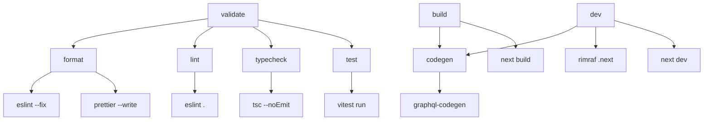
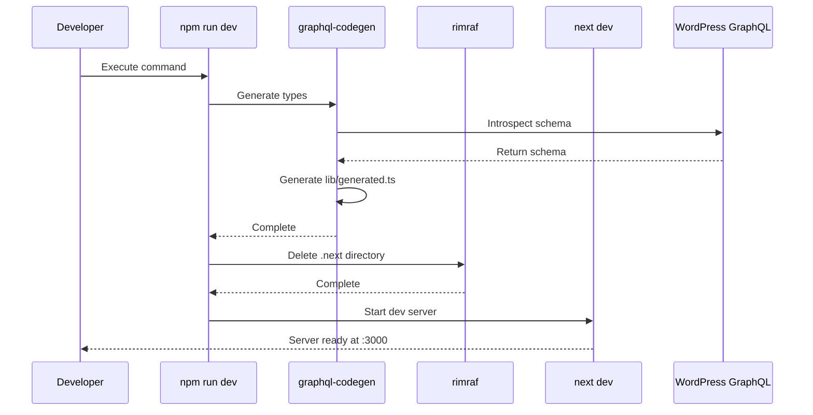
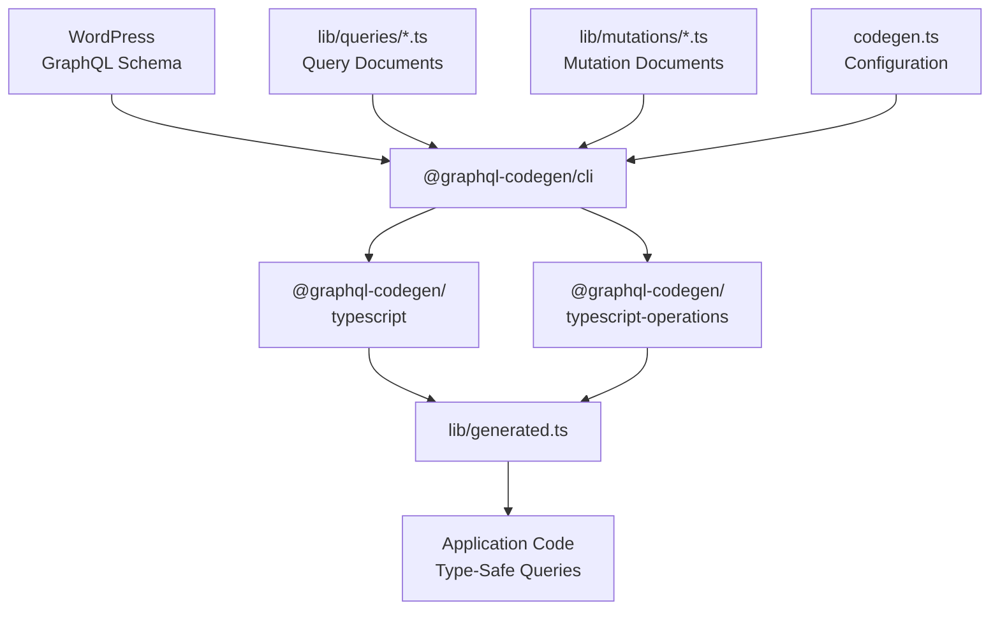
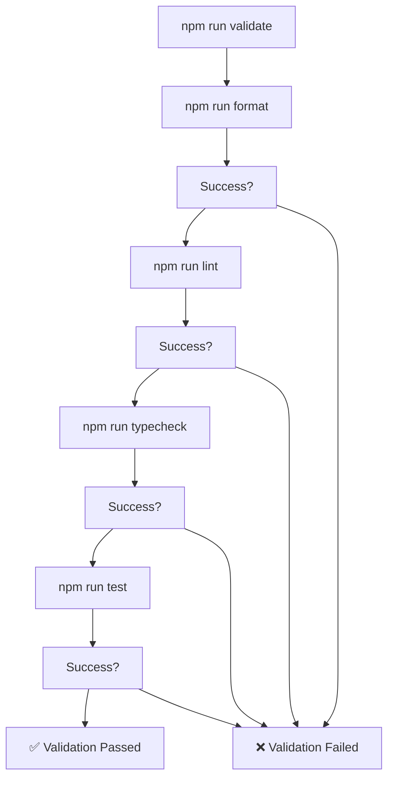
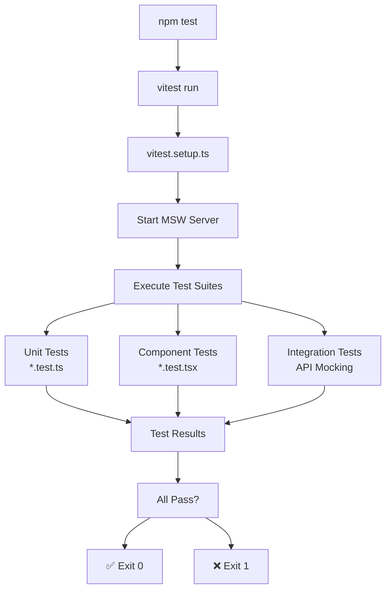
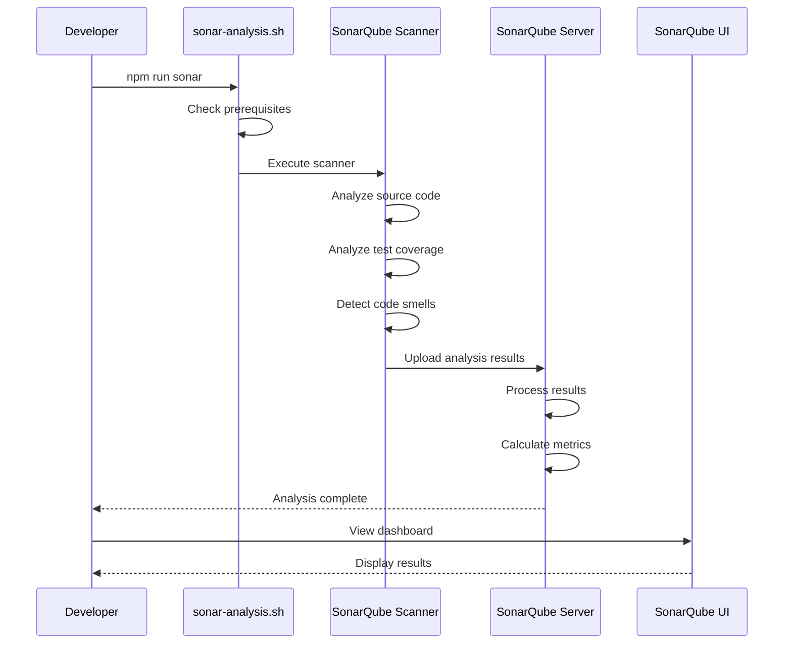
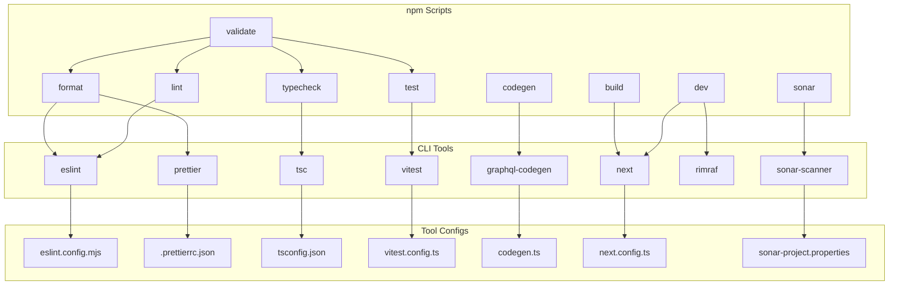

---
layout: default
title: Development Commands
parent: Getting Started
nav_order: 2
---

# Development Commands

> **Relevant source files**
> * [AGENTS.md](https://github.com/gregrickaby/nextjs-wordpress/blob/63f3f2f5/AGENTS.md)
> * [CONTRIBUTING.md](https://github.com/gregrickaby/nextjs-wordpress/blob/63f3f2f5/CONTRIBUTING.md)
> * [README.md](https://github.com/gregrickaby/nextjs-wordpress/blob/63f3f2f5/README.md)
> * [package-lock.json](https://github.com/gregrickaby/nextjs-wordpress/blob/63f3f2f5/package-lock.json)
> * [package.json](https://github.com/gregrickaby/nextjs-wordpress/blob/63f3f2f5/package.json)

This document provides a comprehensive reference for all npm scripts available in the Next.js WordPress project. These commands control development workflows, code generation, quality checks, testing, and production builds. For information about configuring environment variables that these commands use, see [Environment Configuration](/gregrickaby/nextjs-wordpress/2.1-environment-configuration).

---

## Overview

The project uses npm scripts as the primary interface for all development operations. All commands are defined in [package.json L16-L29](https://github.com/gregrickaby/nextjs-wordpress/blob/63f3f2f5/package.json#L16-L29)

 and orchestrate various tools including Next.js, GraphQL Code Generator, TypeScript, ESLint, Prettier, Vitest, and SonarQube.

### Command Categories

| Category | Commands | Purpose |
| --- | --- | --- |
| **Development** | `dev`, `build`, `start` | Run and build the application |
| **Code Generation** | `codegen` | Generate TypeScript types from GraphQL schema |
| **Quality Checks** | `lint`, `format`, `typecheck`, `validate` | Enforce code quality and standards |
| **Testing** | `test`, `test:watch`, `test:ui`, `test:coverage` | Run and manage test suites |
| **Analysis** | `sonar` | Perform comprehensive code quality analysis |

**Sources:** [package.json L16-L29](https://github.com/gregrickaby/nextjs-wordpress/blob/63f3f2f5/package.json#L16-L29)

---

## Command Dependency Graph



This diagram shows how high-level commands (`validate`, `build`, `dev`) compose lower-level operations. Commands in the middle layer invoke specific tools shown in the bottom layer.

**Sources:** [package.json L16-L29](https://github.com/gregrickaby/nextjs-wordpress/blob/63f3f2f5/package.json#L16-L29)

---

## Development Commands

### npm run dev

**Full Command:** `npm run codegen && rimraf .next && next dev`

Starts the Next.js development server with hot module reloading, Turbopack compilation, and React Fast Refresh.

**Execution Sequence:**

1. Runs `graphql-codegen` to generate TypeScript types from WordPress schema
2. Deletes `.next` directory to ensure clean build
3. Starts Next.js development server on `http://localhost:3000`

**When to Use:**

* Primary command for local development
* Use when WordPress schema changes to regenerate types
* Use after pulling code changes that modify GraphQL queries

**Key Features:**

* Automatic code regeneration before server start
* Turbopack for faster compilation (Next.js 16)
* React Compiler optimization (Next.js 16)
* Fast Refresh for instant feedback



**Sources:** [package.json L19](https://github.com/gregrickaby/nextjs-wordpress/blob/63f3f2f5/package.json#L19-L19)

 [README.md L226-L232](https://github.com/gregrickaby/nextjs-wordpress/blob/63f3f2f5/README.md#L226-L232)

---

### npm run build

**Full Command:** `npm run codegen && next build`

Creates an optimized production build with static page generation, route optimization, and asset bundling.

**Execution Sequence:**

1. Runs `graphql-codegen` to ensure types are current
2. Compiles TypeScript to JavaScript
3. Pre-renders static pages using `generateStaticParams`
4. Optimizes images, fonts, and assets
5. Creates production bundles in `.next` directory

**When to Use:**

* Before deploying to production
* To verify production build succeeds locally
* To test static generation and ISR behavior
* Required by CI/CD pipeline before deployment

**Build Outputs:**

* `.next/static/` - Static assets with content hashes
* `.next/server/` - Server-side bundles
* `.next/cache/` - Build cache for incremental builds

**Sources:** [package.json L17](https://github.com/gregrickaby/nextjs-wordpress/blob/63f3f2f5/package.json#L17-L17)

 [README.md L385-L395](https://github.com/gregrickaby/nextjs-wordpress/blob/63f3f2f5/README.md#L385-L395)

---

### npm run start

**Full Command:** `next start`

Starts the production server using the build from `.next` directory.

**When to Use:**

* After running `npm run build` to test production behavior locally
* To verify ISR (Incremental Static Regeneration) works correctly
* To test caching and revalidation logic

**Prerequisites:**

* Must run `npm run build` first
* Requires `.next` directory with production build

**Production Features:**

* Serves optimized static assets
* Handles ISR revalidation
* Executes API routes and server components
* Production-level caching headers

**Sources:** [package.json L23](https://github.com/gregrickaby/nextjs-wordpress/blob/63f3f2f5/package.json#L23-L23)

---

## Code Generation Commands

### npm run codegen

**Full Command:** `graphql-codegen --config codegen.ts`

Generates TypeScript types by introspecting the WordPress GraphQL schema and analyzing query documents.



**Generated Output:**

* **File:** `lib/generated.ts` (excluded from Git via `.gitignore`)
* **Contains:** TypeScript interfaces for WordPress types (Post, Page, Book, Category, Tag, Menu, etc.)
* **Imports:** Used by all query functions in `lib/queries/` and `lib/mutations/`

**Configuration:**

* **Schema Source:** Introspects `NEXT_PUBLIC_WORDPRESS_GRAPHQL_URL` from environment
* **Document Patterns:** Scans `lib/**/*.ts` for GraphQL queries and mutations
* **Plugins:** Uses `typescript` and `typescript-operations` generators

**When to Use:**

* Automatically run by `npm run dev` and `npm run build`
* Manually run when WordPress schema changes (new custom fields, post types)
* Run after modifying GraphQL query documents

**Type Safety Benefits:**

* Auto-completion for WordPress data structures
* Compile-time type checking for GraphQL responses
* Nullability detection via `Maybe<T>` types
* Prevents accessing undefined fields

**Sources:** [package.json L18](https://github.com/gregrickaby/nextjs-wordpress/blob/63f3f2f5/package.json#L18-L18)

 [AGENTS.md L82-L89](https://github.com/gregrickaby/nextjs-wordpress/blob/63f3f2f5/AGENTS.md#L82-L89)

 Architecture Diagram 4

---

## Quality Assurance Commands

### npm run validate

**Full Command:** `npm run format && npm run lint && npm run typecheck && npm run test`

Executes the complete validation pipeline that runs in CI/CD. This is the **single most important command** for ensuring code quality before committing.



**Validation Steps:**

1. **Format** - Auto-fixes code style with Prettier and ESLint
2. **Lint** - Checks for linting errors that cannot be auto-fixed
3. **TypeCheck** - Verifies TypeScript compilation without emitting files
4. **Test** - Runs all unit and integration tests

**When to Use:**

* **Before every commit** (required by lefthook pre-commit hook)
* Before opening a pull request
* After making significant code changes
* When CI/CD pipeline fails

**Exit Behavior:**

* Stops at first failure (fail-fast approach)
* Returns non-zero exit code on any failure
* Prevents proceeding if any step fails

**Sources:** [package.json L29](https://github.com/gregrickaby/nextjs-wordpress/blob/63f3f2f5/package.json#L29-L29)

 [AGENTS.md L176-L192](https://github.com/gregrickaby/nextjs-wordpress/blob/63f3f2f5/AGENTS.md#L176-L192)

---

### npm run format

**Full Command:** `eslint --fix && prettier '**/*.{js,jsx,ts,tsx,md,html,css,json,yml}' --ignore-path .gitignore --cache --write`

Auto-formats code to enforce consistent style across the codebase.

**Tools Invoked:**

| Tool | Purpose | Configuration |
| --- | --- | --- |
| **ESLint** | Fixes auto-fixable linting errors | `eslint.config.mjs` |
| **Prettier** | Formats code style | `.prettierrc.json` |

**File Patterns:**

* JavaScript/TypeScript: `**/*.{js,jsx,ts,tsx}`
* Markup/Styles: `**/*.{html,css}`
* Configuration: `**/*.{json,yml}`
* Documentation: `**/*.md`

**Features:**

* Uses `.gitignore` to exclude files from formatting
* Caches results for faster subsequent runs
* Modifies files in place (`--write`)

**When to Use:**

* Part of `npm run validate` (automatic)
* Triggered by VS Code on save (if configured)
* Run manually before commit if VS Code not used

**Sources:** [package.json L20](https://github.com/gregrickaby/nextjs-wordpress/blob/63f3f2f5/package.json#L20-L20)

---

### npm run lint

**Full Command:** `eslint .`

Checks code for linting errors without auto-fixing.

**Linting Rules:**

* Next.js recommended rules (`eslint-config-next`)
* Prettier compatibility rules (`eslint-config-prettier`)
* Custom project rules defined in `eslint.config.mjs`

**Checked Patterns:**

* Unused variables and imports
* Missing dependency arrays in hooks
* Incorrect hook usage
* Accessibility violations (React a11y)
* Next.js-specific anti-patterns

**When to Use:**

* Part of `npm run validate` (automatic)
* Run manually to check for unfixable linting issues
* Used by CI/CD pipeline as quality gate

**Exit Codes:**

* `0` - No linting errors
* `1` - Linting errors found

**Sources:** [package.json L21](https://github.com/gregrickaby/nextjs-wordpress/blob/63f3f2f5/package.json#L21-L21)

---

### npm run typecheck

**Full Command:** `npx tsc --noEmit`

Verifies TypeScript compilation without generating JavaScript output.

**Checked Errors:**

* Type mismatches and incompatibilities
* Missing type definitions
* Incorrect generic parameters
* Null/undefined access violations
* Invalid property access

**Configuration:**

* Uses `tsconfig.json` compiler options
* Strict mode enabled for maximum type safety
* Checks all `.ts` and `.tsx` files in project

**When to Use:**

* Part of `npm run validate` (automatic)
* After modifying TypeScript types
* Before committing TypeScript changes
* When debugging type errors

**Common Issues:**

* `Maybe<T>` types from GraphQL require `??` null coalescing
* Async params must be awaited in Next.js 16
* Generated types in `lib/generated.ts` must be regenerated after schema changes

**Sources:** [package.json L28](https://github.com/gregrickaby/nextjs-wordpress/blob/63f3f2f5/package.json#L28-L28)

---

## Testing Commands

### Command Overview

| Command | Purpose | Use Case |
| --- | --- | --- |
| `npm test` | Run all tests once | CI/CD, pre-commit validation |
| `npm run test:watch` | Run tests in watch mode | Active development, TDD workflow |
| `npm run test:ui` | Interactive test UI | Debugging failing tests |
| `npm run test:coverage` | Generate coverage report | Verify coverage targets |

**Sources:** [package.json L24-L27](https://github.com/gregrickaby/nextjs-wordpress/blob/63f3f2f5/package.json#L24-L27)

---

### npm test

**Full Command:** `vitest run`

Runs all test suites once and exits. This is the primary testing command used in CI/CD.



**Test Framework Stack:**

* **Vitest** - Fast test runner with ESM support
* **React Testing Library** - Component testing with user-centric queries
* **MSW v2** - API mocking without `global.fetch` mocking
* **jest-axe** - Accessibility testing

**Test Discovery:**

* Finds all `*.test.ts` and `*.test.tsx` files
* Co-located tests next to implementation files
* Executes in parallel for speed

**When to Use:**

* Part of `npm run validate` (required before commit)
* CI/CD pipeline verification
* Before opening pull request
* After implementing new features

**Sources:** [package.json L24](https://github.com/gregrickaby/nextjs-wordpress/blob/63f3f2f5/package.json#L24-L24)

 [CONTRIBUTING.md L96-L117](https://github.com/gregrickaby/nextjs-wordpress/blob/63f3f2f5/CONTRIBUTING.md#L96-L117)

---

### npm run test:watch

**Full Command:** `vitest`

Runs tests in watch mode, re-executing tests when files change.

**Watch Mode Features:**

* Re-runs only affected tests on file change
* Interactive mode with keyboard shortcuts
* Immediate feedback during development
* Supports filtering tests by pattern

**Keyboard Shortcuts:**

* `a` - Run all tests
* `f` - Run only failed tests
* `p` - Filter by filename pattern
* `t` - Filter by test name pattern
* `q` - Quit watch mode

**When to Use:**

* Primary mode for test-driven development (TDD)
* While writing new tests
* When fixing failing tests
* During active feature development

**Sources:** [package.json L27](https://github.com/gregrickaby/nextjs-wordpress/blob/63f3f2f5/package.json#L27-L27)

 [AGENTS.md L279-L289](https://github.com/gregrickaby/nextjs-wordpress/blob/63f3f2f5/AGENTS.md#L279-L289)

---

### npm run test:ui

**Full Command:** `vitest --ui`

Launches Vitest's interactive web UI for debugging and exploring tests.

**UI Features:**

* Visual test tree navigation
* Source code viewer with syntax highlighting
* Test execution timeline
* Error stack traces with source links
* Re-run individual tests or suites
* Filter and search tests

**Accessed At:** `http://localhost:51204` (default Vitest UI port)

**When to Use:**

* Debugging complex test failures
* Exploring test coverage visually
* Analyzing test execution performance
* Understanding test relationships

**Sources:** [package.json L26](https://github.com/gregrickaby/nextjs-wordpress/blob/63f3f2f5/package.json#L26-L26)

---

### npm run test:coverage

**Full Command:** `vitest run --coverage`

Generates comprehensive test coverage reports using V8 coverage provider.

**Coverage Metrics:**

* **Statements** - Percentage of executed code statements
* **Branches** - Percentage of executed conditional branches
* **Functions** - Percentage of called functions
* **Lines** - Percentage of executed code lines

**Output Locations:**

* **Terminal** - Summary table with percentages
* **HTML Report** - `coverage/index.html` (detailed, interactive)
* **JSON Report** - `coverage/coverage-final.json` (machine-readable)

**Coverage Targets:**

* **Goal:** 80%+ coverage on critical paths
* **Philosophy:** Meaningful tests over 100% coverage
* Some unreachable edge cases acceptable

**When to Use:**

* Before opening pull request
* After implementing new features
* Verifying coverage improvements
* Identifying untested code paths

**Sources:** [package.json L25](https://github.com/gregrickaby/nextjs-wordpress/blob/63f3f2f5/package.json#L25-L25)

 [AGENTS.md L256-L269](https://github.com/gregrickaby/nextjs-wordpress/blob/63f3f2f5/AGENTS.md#L256-L269)

---

## Analysis Commands

### npm run sonar

**Full Command:** `bash ./scripts/sonar-analysis.sh`

Executes comprehensive code quality analysis using SonarQube.

**Analysis Categories:**

| Category | Checks | Severity |
| --- | --- | --- |
| **Code Smells** | Maintainability issues, naming conventions, complexity | Info/Minor |
| **Bugs** | Logic errors, null pointer risks, resource leaks | Major/Critical |
| **Vulnerabilities** | Security risks, injection flaws, auth issues | Critical |
| **Security Hotspots** | Code requiring security review | Review Required |
| **Coverage** | Test coverage percentage | Metric |
| **Duplications** | Duplicate code blocks | Metric |
| **Technical Debt** | Estimated time to fix all issues | Metric |

**Execution Flow:**



**Prerequisites:**

* SonarQube server running (Docker or local)
* SonarQube scanner installed
* Project token configured
* Test coverage generated

**Dashboard URL:** `http://localhost:9000/dashboard?id=Next.js-WordPress`

**When to Use:**

* **End of feature development** (not every commit)
* Before releasing to production
* Periodic quality audits
* When refactoring large code sections

**Integration Points:**

* Reads test coverage from Vitest
* Analyzes TypeScript/JavaScript/CSS files
* Excludes `node_modules`, `.next`, `coverage` directories

**Sources:** [package.json L22](https://github.com/gregrickaby/nextjs-wordpress/blob/63f3f2f5/package.json#L22-L22)

 [AGENTS.md L192-L218](https://github.com/gregrickaby/nextjs-wordpress/blob/63f3f2f5/AGENTS.md#L192-L218)

---

## Tool Execution Map



This diagram maps each npm script to the CLI tools it invokes and the configuration files those tools read.

**Sources:** [package.json L16-L29](https://github.com/gregrickaby/nextjs-wordpress/blob/63f3f2f5/package.json#L16-L29)

---

## Common Workflows

### Daily Development Workflow

```markdown
# Start development session
npm run dev

# Make code changes...

# Run validation before commit
npm run validate

# If validation passes, commit changes
git add .
git commit -m "feat: add new feature"
```

**Sources:** [CONTRIBUTING.md L59-L67](https://github.com/gregrickaby/nextjs-wordpress/blob/63f3f2f5/CONTRIBUTING.md#L59-L67)

---

### Feature Development Workflow

```python
# 1. Generate types from WordPress schema
npm run codegen

# 2. Start dev server
npm run dev

# 3. Write code with TDD approach
npm run test:watch  # In separate terminal

# 4. Validate before committing
npm run validate

# 5. Run SonarQube analysis (end of feature)
npm run sonar

# 6. Create production build
npm run build

# 7. Test production build locally
npm run start
```

**Sources:** [AGENTS.md L223-L235](https://github.com/gregrickaby/nextjs-wordpress/blob/63f3f2f5/AGENTS.md#L223-L235)

---

### Debugging Workflow

```markdown
# Run tests in UI mode for visual debugging
npm run test:ui

# Check TypeScript errors
npm run typecheck

# Verify build works
npm run build

# Test production server
npm run start
```

---

### CI/CD Simulation Workflow

```markdown
# Simulate complete CI/CD pipeline locally
npm run validate  # Must pass
npm run build     # Must succeed
npm run sonar     # Code quality check
```

**Sources:** [AGENTS.md L176-L192](https://github.com/gregrickaby/nextjs-wordpress/blob/63f3f2f5/AGENTS.md#L176-L192)

---

## Command Composition Patterns

### Sequential Execution

Commands joined with `&&` execute sequentially and stop on first failure:

```python
# Example from validate command
npm run format && npm run lint && npm run typecheck && npm run test
```

**Behavior:**

* If `format` fails, subsequent commands do not run
* Exit code propagates from failed command
* Fail-fast approach for quality gates

**Sources:** [package.json L29](https://github.com/gregrickaby/nextjs-wordpress/blob/63f3f2f5/package.json#L29-L29)

---

### Chained Build Commands

```python
# Example from build command
npm run codegen && next build
```

**Execution Order:**

1. Generate GraphQL types
2. Only if successful, build Next.js application

This ensures generated types are always current before building.

**Sources:** [package.json L17](https://github.com/gregrickaby/nextjs-wordpress/blob/63f3f2f5/package.json#L17-L17)

---

## Environment-Specific Behavior

### Development vs Production

| Command | Environment | Optimizations |
| --- | --- | --- |
| `npm run dev` | Development | Fast Refresh, source maps, verbose errors |
| `npm run build` | Production | Minification, tree shaking, code splitting |
| `npm run start` | Production | Optimized serving, ISR caching |

**Sources:** [package.json L17-L23](https://github.com/gregrickaby/nextjs-wordpress/blob/63f3f2f5/package.json#L17-L23)

---

## Performance Optimizations

### Caching Strategies

1. **Prettier Cache** - `--cache` flag stores last format state
2. **ESLint Cache** - Stores lint results for unchanged files
3. **Next.js Cache** - `.next/cache` speeds up incremental builds
4. **Vitest Cache** - Caches test results between runs

### Parallel Execution

* **Vitest** runs tests in parallel by default
* **Next.js build** parallelizes route generation
* **GraphQL codegen** processes plugins concurrently

**Sources:** [package.json L20](https://github.com/gregrickaby/nextjs-wordpress/blob/63f3f2f5/package.json#L20-L20)

---

## Troubleshooting

### Common Issues

**Issue: `npm run dev` fails with type errors**

```markdown
# Solution: Regenerate GraphQL types
npm run codegen
```

**Issue: Tests fail with stale data**

```markdown
# Solution: Clear Vitest cache
npx vitest --clearCache
npm test
```

**Issue: Build fails after WordPress schema change**

```markdown
# Solution: Regenerate types and rebuild
npm run codegen
npm run build
```

**Issue: `npm run validate` hangs**

```markdown
# Solution: Run steps individually to isolate issue
npm run format
npm run lint
npm run typecheck
npm test
```

---

## Command Reference Table

| Command | Tool Chain | Duration | Frequency | CI/CD |
| --- | --- | --- | --- | --- |
| `npm run dev` | codegen → rimraf → next | 30s initial | Every session | No |
| `npm run build` | codegen → next | 2-5min | Before deploy | Yes |
| `npm run start` | next | 5s | Testing only | No |
| `npm run codegen` | graphql-codegen | 10s | Automatic | Yes |
| `npm run format` | eslint → prettier | 5-10s | Every commit | Yes |
| `npm run lint` | eslint | 5-10s | Every commit | Yes |
| `npm run typecheck` | tsc | 10-20s | Every commit | Yes |
| `npm test` | vitest | 30s-2min | Every commit | Yes |
| `npm run test:watch` | vitest | Continuous | Development | No |
| `npm run test:ui` | vitest | Interactive | Debugging | No |
| `npm run test:coverage` | vitest | 1-3min | Pre-PR | Optional |
| `npm run validate` | format → lint → typecheck → test | 1-3min | Every commit | Yes |
| `npm run sonar` | sonar-scanner | 2-5min | End of feature | Optional |

**Sources:** [package.json L16-L29](https://github.com/gregrickaby/nextjs-wordpress/blob/63f3f2f5/package.json#L16-L29)