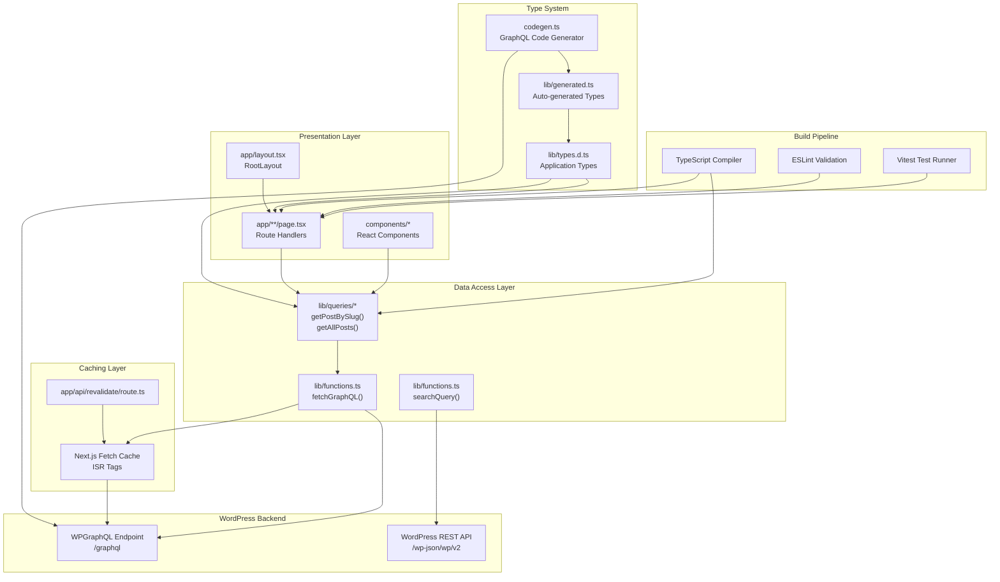
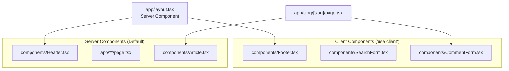
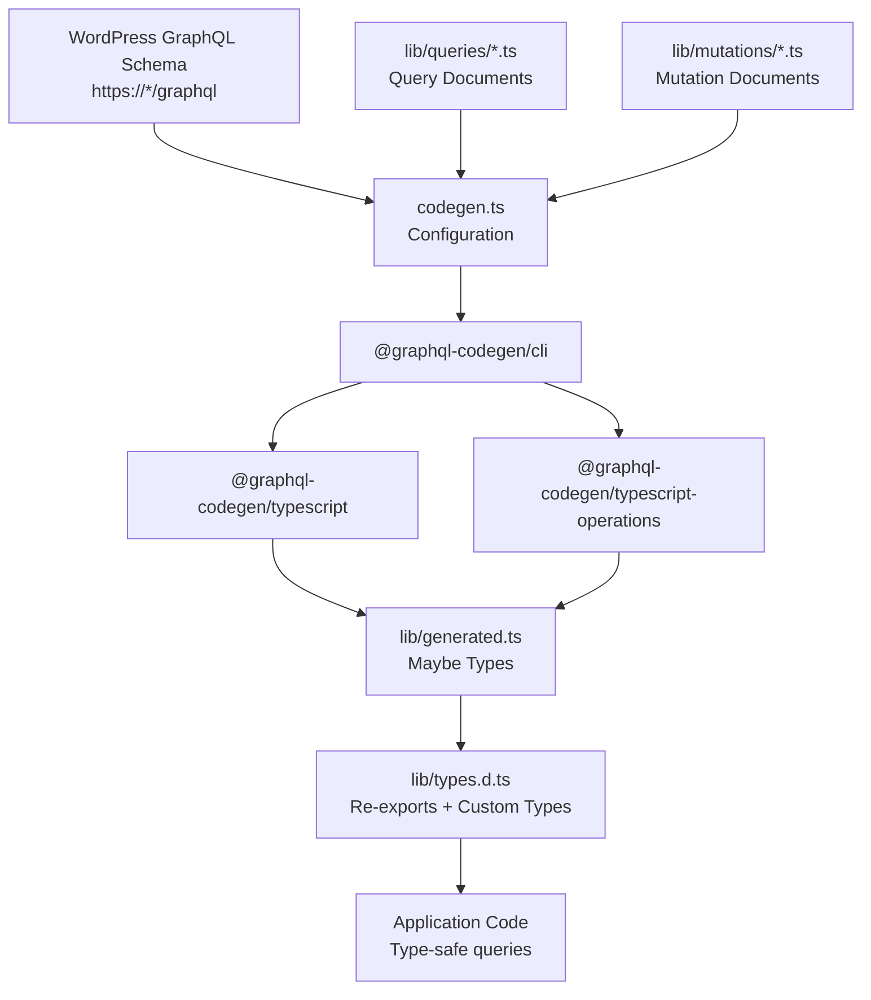
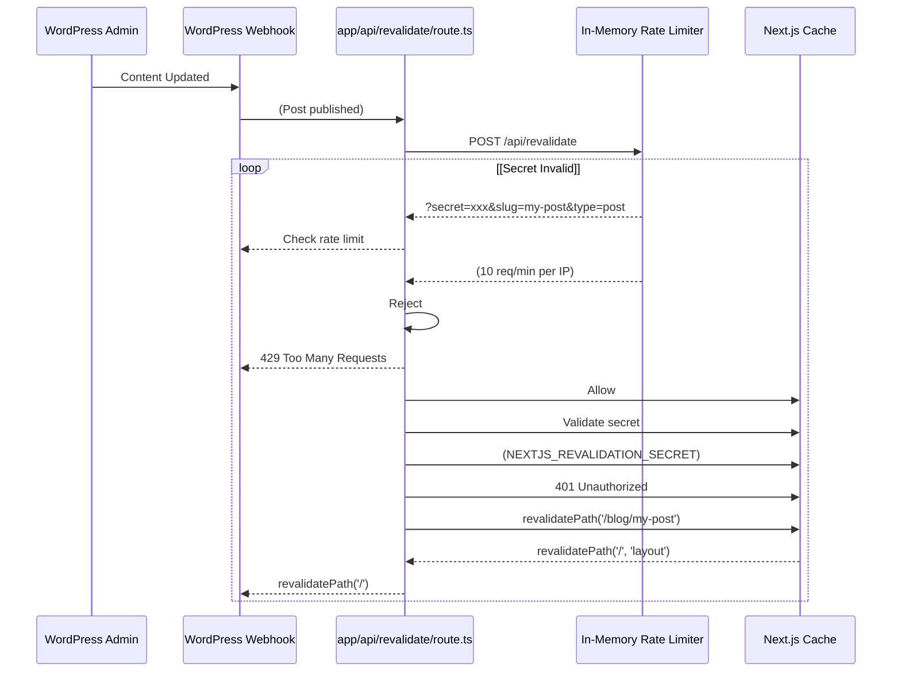

---
layout: default
title: Architecture
nav_order: 4
has_children: true
---

# Architecture

> **Relevant source files**
> * [AGENTS.md](https://github.com/gregrickaby/nextjs-wordpress/blob/63f3f2f5/AGENTS.md)
> * [CONTRIBUTING.md](https://github.com/gregrickaby/nextjs-wordpress/blob/63f3f2f5/CONTRIBUTING.md)
> * [README.md](https://github.com/gregrickaby/nextjs-wordpress/blob/63f3f2f5/README.md)
> * [lib/functions.ts](https://github.com/gregrickaby/nextjs-wordpress/blob/63f3f2f5/lib/functions.ts)
> * [lib/queries/getAllBooks.ts](https://github.com/gregrickaby/nextjs-wordpress/blob/63f3f2f5/lib/queries/getAllBooks.ts)
> * [lib/queries/getAllPosts.ts](https://github.com/gregrickaby/nextjs-wordpress/blob/63f3f2f5/lib/queries/getAllPosts.ts)
> * [lib/queries/getBookBySlug.ts](https://github.com/gregrickaby/nextjs-wordpress/blob/63f3f2f5/lib/queries/getBookBySlug.ts)
> * [lib/queries/getPageBySlug.ts](https://github.com/gregrickaby/nextjs-wordpress/blob/63f3f2f5/lib/queries/getPageBySlug.ts)
> * [lib/queries/getPostBySlug.ts](https://github.com/gregrickaby/nextjs-wordpress/blob/63f3f2f5/lib/queries/getPostBySlug.ts)
> * [lib/types.d.ts](https://github.com/gregrickaby/nextjs-wordpress/blob/63f3f2f5/lib/types.d.ts)

This document describes the high-level system architecture of the Next.js WordPress headless application, including its layered design, technology choices, and key architectural patterns. It provides an overview of how components interact and how requests flow through the system.

For detailed information about specific architectural aspects:

* Type system and GraphQL code generation: see [Type System](/gregrickaby/nextjs-wordpress/3.1-type-system)
* Data fetching and query patterns: see [Data Flow](/gregrickaby/nextjs-wordpress/3.2-data-flow)
* Caching strategy and ISR: see [Caching and Revalidation](/gregrickaby/nextjs-wordpress/3.3-caching-and-revalidation)

---

## System Overview

The application follows a **three-tier headless CMS architecture** with clear separation between the content management backend (WordPress), the presentation layer (Next.js), and the data access layer (GraphQL/REST API integration).

### Architectural Layers

The system is organized into distinct layers, each with specific responsibilities:

| Layer | Purpose | Key Technologies | Primary Files |
| --- | --- | --- | --- |
| **Presentation** | Server-rendered React pages and components | Next.js 16 App Router, React 19 | `app/**/*.tsx` |
| **Data Access** | GraphQL queries and WordPress integration | TypeScript, WPGraphQL | `lib/queries/*.ts`, `lib/functions.ts` |
| **Type System** | Type safety and schema synchronization | GraphQL Code Generator | `lib/generated.ts`, `lib/types.d.ts` |
| **Build Pipeline** | Code generation, validation, testing | TypeScript, ESLint, Vitest | `codegen.ts`, `tsconfig.json` |
| **Caching** | ISR and on-demand revalidation | Next.js Cache API | `app/api/revalidate/route.ts` |
| **Content Backend** | Headless CMS | WordPress, WPGraphQL plugin | External WordPress instance |

**System Layers Diagram**



Sources: [README.md L1-L420](https://github.com/gregrickaby/nextjs-wordpress/blob/63f3f2f5/README.md#L1-L420)

 [lib/types.d.ts L1-L27](https://github.com/gregrickaby/nextjs-wordpress/blob/63f3f2f5/lib/types.d.ts#L1-L27)

 [lib/functions.ts L1-L142](https://github.com/gregrickaby/nextjs-wordpress/blob/63f3f2f5/lib/functions.ts#L1-L142)

---

## Core Architecture Patterns

### Server-First Architecture

The application uses **Server Components by default**, with Client Components only where interactivity is required. This pattern minimizes JavaScript sent to the browser and improves performance.

**Component Classification**



Sources: [README.md L1-L420](https://github.com/gregrickaby/nextjs-wordpress/blob/63f3f2f5/README.md#L1-L420)

 [AGENTS.md L62-L80](https://github.com/gregrickaby/nextjs-wordpress/blob/63f3f2f5/AGENTS.md#L62-L80)

### GraphQL-First Data Fetching

All structured content queries use **GraphQL via WPGraphQL**, while search uses the **WordPress REST API**. This dual-API approach leverages the strengths of each protocol.

**Data Fetching Pattern**

| Use Case | Protocol | Rationale | Example Function |
| --- | --- | --- | --- |
| Structured content queries | GraphQL | Type safety, efficient batching, single endpoint | `getPostBySlug()` |
| Search functionality | REST API | WordPress search is mature in REST | `searchQuery()` |
| On-demand revalidation | Next.js Cache API | Native Next.js integration | `revalidatePath()` |

Sources: [README.md L236-L343](https://github.com/gregrickaby/nextjs-wordpress/blob/63f3f2f5/README.md#L236-L343)

 [lib/functions.ts L1-L142](https://github.com/gregrickaby/nextjs-wordpress/blob/63f3f2f5/lib/functions.ts#L1-L142)

### Type-Driven Development

The type system is **automatically generated** from the WordPress GraphQL schema using GraphQL Code Generator. This ensures type safety and keeps the frontend synchronized with backend schema changes.

**Type Generation Flow**



Sources: [AGENTS.md L79-L96](https://github.com/gregrickaby/nextjs-wordpress/blob/63f3f2f5/AGENTS.md#L79-L96)

 [lib/types.d.ts L1-L27](https://github.com/gregrickaby/nextjs-wordpress/blob/63f3f2f5/lib/types.d.ts#L1-L27)

 [README.md L236-L343](https://github.com/gregrickaby/nextjs-wordpress/blob/63f3f2f5/README.md#L236-L343)

---

## Request Lifecycle

### Static Page Generation

For posts, pages, and books with `generateStaticParams`, the build process pre-renders pages at build time using **Static Site Generation (SSG)**.

**Static Generation Flow**

```mermaid
sequenceDiagram
  participant npm run build
  participant app/blog/[slug]/page.tsx
  participant generateStaticParams()
  participant lib/queries/getAllPosts.ts
  participant lib/functions.ts
  participant fetchGraphQL()
  participant WordPress GraphQL

  npm run build->>app/blog/[slug]/page.tsx: Build route
  app/blog/[slug]/page.tsx->>generateStaticParams(): Call generateStaticParams()
  generateStaticParams()->>lib/queries/getAllPosts.ts: getAllPosts()
  lib/queries/getAllPosts.ts->>lib/functions.ts: fetchGraphQL(query)
  lib/functions.ts->>WordPress GraphQL: POST /graphql
  WordPress GraphQL-->>lib/functions.ts: [{slug: 'post-1'}, ...]
  lib/functions.ts-->>lib/queries/getAllPosts.ts: Post[]
  lib/queries/getAllPosts.ts-->>generateStaticParams(): Post[]
  generateStaticParams()-->>app/blog/[slug]/page.tsx: [{slug: 'post-1'}, ...]
  loop [For each slug]
    app/blog/[slug]/page.tsx->>lib/queries/getAllPosts.ts: getPostBySlug(slug)
    lib/queries/getAllPosts.ts->>lib/functions.ts: fetchGraphQL(query, {slug})
    lib/functions.ts->>WordPress GraphQL: POST /graphql
    WordPress GraphQL-->>lib/functions.ts: Post data
    lib/functions.ts-->>lib/queries/getAllPosts.ts: Post
    lib/queries/getAllPosts.ts-->>app/blog/[slug]/page.tsx: Post
    app/blog/[slug]/page.tsx->>app/blog/[slug]/page.tsx: Render HTML
  end
  app/blog/[slug]/page.tsx-->>npm run build: Static HTML files
```

Sources: [README.md L167-L183](https://github.com/gregrickaby/nextjs-wordpress/blob/63f3f2f5/README.md#L167-L183)

 [lib/queries/getAllPosts.ts L1-L46](https://github.com/gregrickaby/nextjs-wordpress/blob/63f3f2f5/lib/queries/getAllPosts.ts#L1-L46)

 [lib/queries/getPostBySlug.ts L1-L84](https://github.com/gregrickaby/nextjs-wordpress/blob/63f3f2f5/lib/queries/getPostBySlug.ts#L1-L84)

### Dynamic Page Request

For pages not pre-rendered, or after cache expiration, Next.js generates pages **on-demand** using Incremental Static Regeneration (ISR).

**Dynamic Request Flow**

```mermaid
sequenceDiagram
  participant Browser
  participant Next.js Server
  participant Next.js Cache
  participant (ISR)
  participant app/blog/[slug]/page.tsx
  participant getPostBySlug()
  participant fetchGraphQL()
  participant WordPress

  Browser->>Next.js Server: GET /blog/my-post
  Next.js Server->>Next.js Cache: Check cache
  loop [Fetch Cache Hit]
    Next.js Cache-->>Next.js Server: tags: ['my-post', 'graphql', 'type:post']
    Next.js Server-->>Browser: Return cached HTML
    Next.js Server->>app/blog/[slug]/page.tsx: 200 OK (Cached)
    app/blog/[slug]/page.tsx->>getPostBySlug(): Render page
    getPostBySlug()->>fetchGraphQL(): getPostBySlug('my-post')
    fetchGraphQL()->>Next.js Cache: fetchGraphQL(query, {slug: 'my-post'})
    Next.js Cache-->>fetchGraphQL(): Check fetch cache
    fetchGraphQL()->>WordPress: Return cached data
    WordPress-->>fetchGraphQL(): POST /graphql
    fetchGraphQL()->>Next.js Cache: Post data
    fetchGraphQL()-->>getPostBySlug(): Store with tags
    getPostBySlug()-->>app/blog/[slug]/page.tsx: revalidate: 3600s
    app/blog/[slug]/page.tsx->>app/blog/[slug]/page.tsx: Post
    app/blog/[slug]/page.tsx-->>Next.js Server: Post
    Next.js Server->>Next.js Cache: Render React components
    Next.js Server-->>Browser: HTML
  end
```

Sources: [lib/functions.ts L1-L88](https://github.com/gregrickaby/nextjs-wordpress/blob/63f3f2f5/lib/functions.ts#L1-L88)

 [lib/config.ts L1-L7](https://github.com/gregrickaby/nextjs-wordpress/blob/63f3f2f5/lib/config.ts#L1-L7)

 [lib/queries/getPostBySlug.ts L1-L84](https://github.com/gregrickaby/nextjs-wordpress/blob/63f3f2f5/lib/queries/getPostBySlug.ts#L1-L84)

### On-Demand Revalidation

When content changes in WordPress, a webhook triggers the **revalidation API** to invalidate specific cache entries, ensuring fresh content without waiting for the revalidation interval.

**Revalidation Request Flow**



Sources: [README.md L389-L395](https://github.com/gregrickaby/nextjs-wordpress/blob/63f3f2f5/README.md#L389-L395)

 [AGENTS.md L1-L505](https://github.com/gregrickaby/nextjs-wordpress/blob/63f3f2f5/AGENTS.md#L1-L505)

---

## Key Design Decisions

### 1. No Third-Party GraphQL Client

The application uses a **custom `fetchGraphQL` function** instead of Apollo Client or URQL because Next.js automatically memoizes `fetch()` requests, providing built-in caching without additional dependencies.

**Rationale:**

* Next.js 15+ has sophisticated fetch caching with tags and revalidation
* Reduces bundle size and complexity
* Full control over caching strategy
* Type safety via GraphQL Code Generator

**Implementation:** [lib/functions.ts L7-L88](https://github.com/gregrickaby/nextjs-wordpress/blob/63f3f2f5/lib/functions.ts#L7-L88)

Sources: [README.md L333-L343](https://github.com/gregrickaby/nextjs-wordpress/blob/63f3f2f5/README.md#L333-L343)

 [lib/functions.ts L1-L142](https://github.com/gregrickaby/nextjs-wordpress/blob/63f3f2f5/lib/functions.ts#L1-L142)

### 2. Hierarchical Cache Tags

The caching system uses **three levels of cache tags** for flexible invalidation:

| Tag Type | Example | Scope | Use Case |
| --- | --- | --- | --- |
| Slug-specific | `'my-post'` | Single content item | Invalidate one post |
| Type-specific | `'type:post'` | All content of type | Invalidate all posts |
| Global | `'graphql'` | All GraphQL requests | Full cache bust |

**Implementation:** [lib/functions.ts L34-L54](https://github.com/gregrickaby/nextjs-wordpress/blob/63f3f2f5/lib/functions.ts#L34-L54)

Sources: [lib/functions.ts L33-L56](https://github.com/gregrickaby/nextjs-wordpress/blob/63f3f2f5/lib/functions.ts#L33-L56)

### 3. Async Params (Next.js 15+)

Following Next.js 15+ conventions, all dynamic route parameters are **awaited Promises** rather than synchronous objects.

**Pattern:**

```javascript
// Modern Next.js 15+ pattern
export default async function Page({
  params
}: {
  params: Promise<{slug: string}>
}) {
  const {slug} = await params
  // ...
}
```

**Rationale:**

* Supports advanced caching strategies
* Enables partial prerendering
* Aligns with React Server Components async nature

Sources: [README.md L167-L183](https://github.com/gregrickaby/nextjs-wordpress/blob/63f3f2f5/README.md#L167-L183)

 [AGENTS.md L100-L112](https://github.com/gregrickaby/nextjs-wordpress/blob/63f3f2f5/AGENTS.md#L100-L112)

### 4. Null Safety Pattern

All GraphQL queries return **nullable types** (`Maybe<T>`) due to the generated types. The application enforces null safety through:

1. **Early returns** - Check for null data and return `null` or `[]`
2. **Nullish coalescing** - Use `??` for fallback values
3. **Optional chaining** - Use `?.` for nested nullable objects

**Example Pattern:**

```
// From getPostBySlug
if (!response?.data?.post) {
  return null
}
return response.data.post as Post
```

Sources: [lib/queries/getPostBySlug.ts L78-L82](https://github.com/gregrickaby/nextjs-wordpress/blob/63f3f2f5/lib/queries/getPostBySlug.ts#L78-L82)

 [lib/queries/getAllPosts.ts L40-L44](https://github.com/gregrickaby/nextjs-wordpress/blob/63f3f2f5/lib/queries/getAllPosts.ts#L40-L44)

 [AGENTS.md L114-L141](https://github.com/gregrickaby/nextjs-wordpress/blob/63f3f2f5/AGENTS.md#L114-L141)

### 5. Dual API Strategy

The application uses **GraphQL for structured content** and **REST API for search** rather than forcing everything through one protocol.

**Rationale:**

| Feature | GraphQL | REST API |
| --- | --- | --- |
| Type safety | ✅ Full via codegen | ❌ Manual typing |
| Query flexibility | ✅ Request only needed fields | ❌ Fixed responses |
| Batching | ✅ Multiple queries in one request | ❌ Multiple HTTP requests |
| Search | ❌ Complex to implement | ✅ Native WordPress support |
| Caching | ✅ Tag-based with Next.js | ✅ Tag-based with Next.js |

**Decision:** Use GraphQL by default, REST only for search where WordPress has mature built-in functionality.

Sources: [README.md L236-L240](https://github.com/gregrickaby/nextjs-wordpress/blob/63f3f2f5/README.md#L236-L240)

 [lib/functions.ts L90-L141](https://github.com/gregrickaby/nextjs-wordpress/blob/63f3f2f5/lib/functions.ts#L90-L141)

---

## Technology Stack Rationale

### Framework: Next.js 16 (App Router)

**Chosen for:**

* React Server Components for performance
* Built-in ISR with tag-based invalidation
* File-based routing with type-safe params
* Automatic code splitting and optimization
* Native TypeScript support
* Turbopack for fast development builds

Sources: [README.md L7-L16](https://github.com/gregrickaby/nextjs-wordpress/blob/63f3f2f5/README.md#L7-L16)

 [AGENTS.md L7-L9](https://github.com/gregrickaby/nextjs-wordpress/blob/63f3f2f5/AGENTS.md#L7-L9)

### Styling: Tailwind CSS 4

**Chosen for:**

* Utility-first CSS for rapid development
* Zero runtime (no CSS-in-JS overhead)
* Tree-shaking for minimal production CSS
* Design system consistency

Sources: [README.md L14](https://github.com/gregrickaby/nextjs-wordpress/blob/63f3f2f5/README.md#L14-L14)

### Data Layer: WPGraphQL

**Chosen for:**

* Type-safe schema introspection
* Efficient data fetching (no over/under-fetching)
* Single endpoint for all content queries
* Rich WordPress plugin ecosystem

Sources: [README.md L132-L144](https://github.com/gregrickaby/nextjs-wordpress/blob/63f3f2f5/README.md#L132-L144)

 [lib/queries/getPostBySlug.ts L1-L84](https://github.com/gregrickaby/nextjs-wordpress/blob/63f3f2f5/lib/queries/getPostBySlug.ts#L1-L84)

### Testing: Vitest + MSW v2

**Chosen for:**

* Fast test execution (SWC transpilation)
* Native ES modules support
* MSW v2 for realistic API mocking
* React Testing Library for component tests

Sources: [README.md L360-L382](https://github.com/gregrickaby/nextjs-wordpress/blob/63f3f2f5/README.md#L360-L382)

 [AGENTS.md L256-L494](https://github.com/gregrickaby/nextjs-wordpress/blob/63f3f2f5/AGENTS.md#L256-L494)

---

## Code Organization Principles

The codebase follows a **feature-based organization** with co-located tests and clear separation of concerns:

```markdown
app/                    # Next.js pages (one file per route)
├── blog/[slug]/        # Dynamic blog post route
├── preview/[slug]/     # Draft preview route
└── api/revalidate/     # Cache invalidation endpoint

components/             # Reusable React components
├── Header.tsx          # Navigation (Server Component)
├── Footer.tsx          # Footer (Client Component)
└── CommentForm.tsx     # Comment submission (Client Component)

lib/
├── queries/            # GraphQL query functions
│   ├── getAllPosts.ts
│   └── getPostBySlug.ts
├── mutations/          # GraphQL mutation functions
│   └── createComment.ts
├── functions.ts        # Core fetchGraphQL() and searchQuery()
├── generated.ts        # Auto-generated GraphQL types (don't edit)
├── types.d.ts          # Application-specific types
└── config.ts           # Site configuration

test-utils/             # Shared test utilities
└── index.ts            # Pre-configured render, user, server
```

**Key Principles:**

1. **Co-located tests** - Every `.ts`/`.tsx` has a `.test.ts`/`.test.tsx` sibling
2. **Single responsibility** - Each query file fetches one type of data
3. **Type imports** - Import from `@/lib/types` or `@/lib/generated`
4. **No barrel exports** - Import specific functions, not `index.ts` files

Sources: [AGENTS.md L62-L80](https://github.com/gregrickaby/nextjs-wordpress/blob/63f3f2f5/AGENTS.md#L62-L80)

 [CONTRIBUTING.md L118-L131](https://github.com/gregrickaby/nextjs-wordpress/blob/63f3f2f5/CONTRIBUTING.md#L118-L131)

---

## Performance Characteristics

### Build-Time Optimization

| Optimization | Mechanism | Impact |
| --- | --- | --- |
| Static generation | `generateStaticParams()` | Pre-renders common pages at build time |
| Type checking | TypeScript compiler | Catches errors before runtime |
| Code generation | GraphQL Code Generator | Type safety without runtime overhead |
| Tree shaking | Turbopack/Webpack | Removes unused code from bundles |

### Runtime Optimization

| Optimization | Mechanism | Impact |
| --- | --- | --- |
| Server Components | React 19 | Zero client JavaScript for static content |
| Fetch caching | Next.js cache with tags | Reuses data across components |
| ISR | `revalidate: 3600` | Serves cached pages, regenerates in background |
| Image optimization | `next/image` | Automatic WebP/AVIF conversion, lazy loading |
| Suspense boundaries | React Suspense | Streams HTML, prevents layout blocking |

Sources: [lib/functions.ts L52-L56](https://github.com/gregrickaby/nextjs-wordpress/blob/63f3f2f5/lib/functions.ts#L52-L56)

 [README.md L11-L15](https://github.com/gregrickaby/nextjs-wordpress/blob/63f3f2f5/README.md#L11-L15)

---

This architecture balances **performance, type safety, and developer experience** through clear separation of concerns, automatic code generation, and intelligent caching. The system is designed to scale from small blogs to large content sites while maintaining fast build times and excellent runtime performance.

For implementation details of specific architectural components, see the child pages under Architecture in the table of contents.