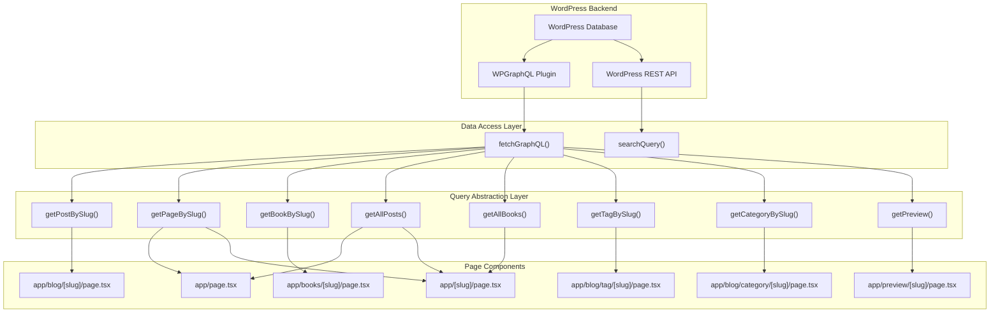
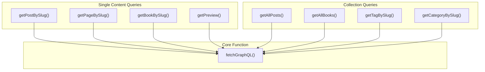
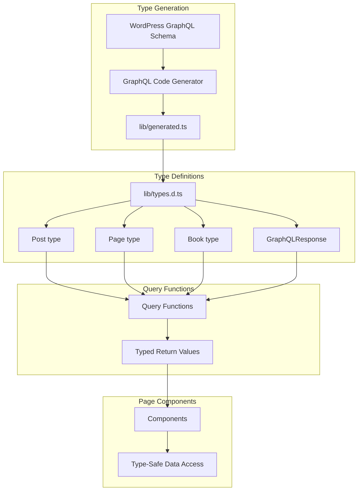
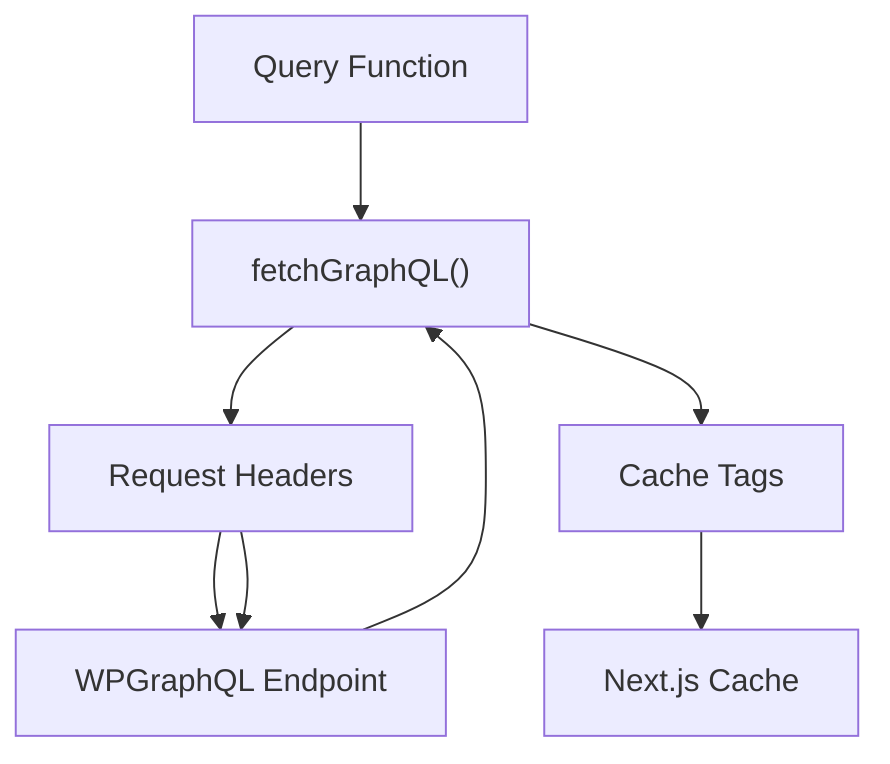
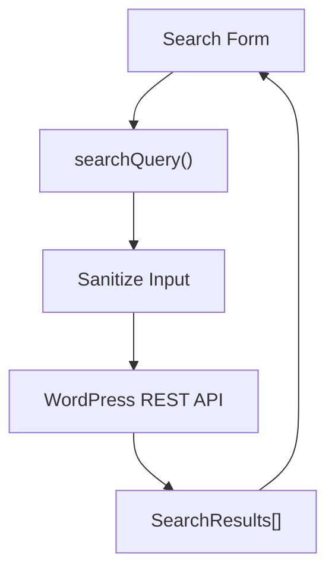
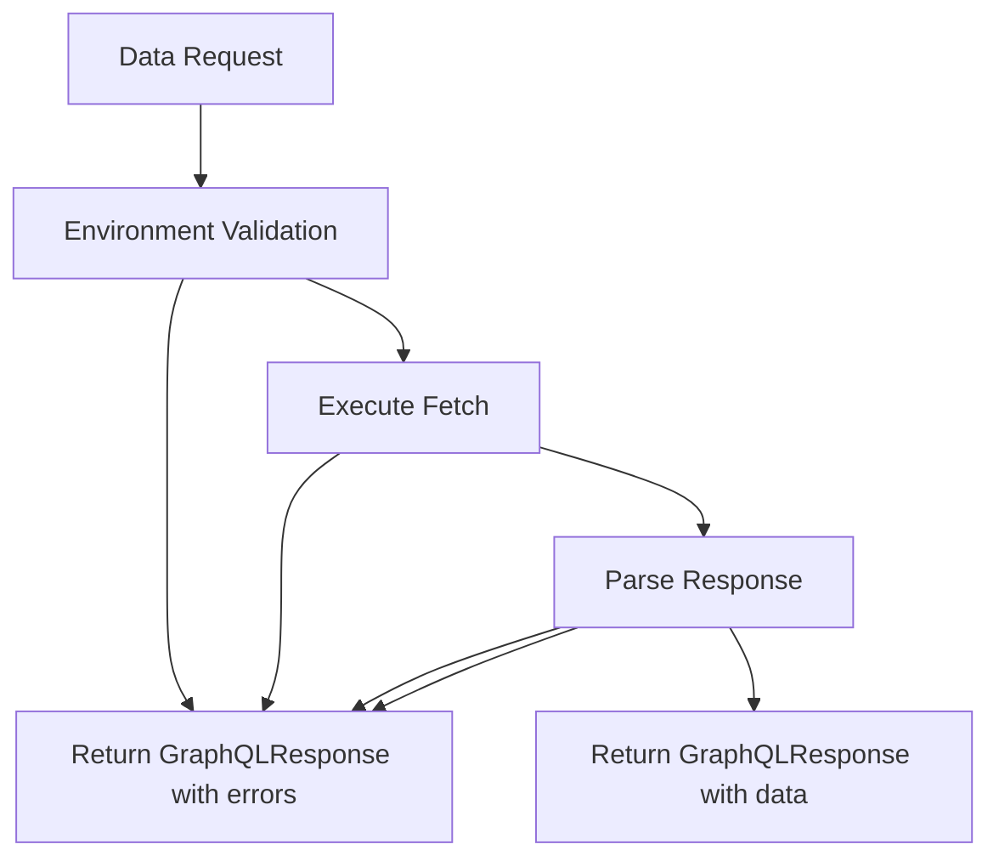

---
layout: default
title: Data Flow
parent: Architecture
nav_order: 2
---

# Data Flow

> **Relevant source files**
> * [lib/functions.ts](https://github.com/gregrickaby/nextjs-wordpress/blob/63f3f2f5/lib/functions.ts)
> * [lib/mutations/createComment.test.ts](https://github.com/gregrickaby/nextjs-wordpress/blob/63f3f2f5/lib/mutations/createComment.test.ts)
> * [lib/queries/getAllBooks.test.ts](https://github.com/gregrickaby/nextjs-wordpress/blob/63f3f2f5/lib/queries/getAllBooks.test.ts)
> * [lib/queries/getAllBooks.ts](https://github.com/gregrickaby/nextjs-wordpress/blob/63f3f2f5/lib/queries/getAllBooks.ts)
> * [lib/queries/getAllPages.test.ts](https://github.com/gregrickaby/nextjs-wordpress/blob/63f3f2f5/lib/queries/getAllPages.test.ts)
> * [lib/queries/getAllPosts.ts](https://github.com/gregrickaby/nextjs-wordpress/blob/63f3f2f5/lib/queries/getAllPosts.ts)
> * [lib/queries/getBookBySlug.test.ts](https://github.com/gregrickaby/nextjs-wordpress/blob/63f3f2f5/lib/queries/getBookBySlug.test.ts)
> * [lib/queries/getBookBySlug.ts](https://github.com/gregrickaby/nextjs-wordpress/blob/63f3f2f5/lib/queries/getBookBySlug.ts)
> * [lib/queries/getCategoryBySlug.test.ts](https://github.com/gregrickaby/nextjs-wordpress/blob/63f3f2f5/lib/queries/getCategoryBySlug.test.ts)
> * [lib/queries/getPageBySlug.test.ts](https://github.com/gregrickaby/nextjs-wordpress/blob/63f3f2f5/lib/queries/getPageBySlug.test.ts)
> * [lib/queries/getPageBySlug.ts](https://github.com/gregrickaby/nextjs-wordpress/blob/63f3f2f5/lib/queries/getPageBySlug.ts)
> * [lib/queries/getPostBySlug.ts](https://github.com/gregrickaby/nextjs-wordpress/blob/63f3f2f5/lib/queries/getPostBySlug.ts)
> * [lib/queries/getPreview.test.ts](https://github.com/gregrickaby/nextjs-wordpress/blob/63f3f2f5/lib/queries/getPreview.test.ts)
> * [lib/queries/getTagBySlug.test.ts](https://github.com/gregrickaby/nextjs-wordpress/blob/63f3f2f5/lib/queries/getTagBySlug.test.ts)
> * [lib/types.d.ts](https://github.com/gregrickaby/nextjs-wordpress/blob/63f3f2f5/lib/types.d.ts)

This document explains how data flows through the Next.js WordPress headless application, from WordPress backend to the user interface. It covers the abstraction layers, query patterns, type safety mechanisms, and the dual API strategy employed by the system.

For detailed information about the GraphQL code generation and type system, see [Type System](/gregrickaby/nextjs-wordpress/3.1-type-system). For caching strategies and on-demand revalidation, see [Caching and Revalidation](/gregrickaby/nextjs-wordpress/3.3-caching-and-revalidation). For implementation details of specific query functions, see [GraphQL Queries](/gregrickaby/nextjs-wordpress/5.1-graphql-queries) and the `fetchGraphQL` utility documentation at [fetchGraphQL Utility](/gregrickaby/nextjs-wordpress/5.3-fetchgraphql-utility).

## Data Flow Architecture

The application employs a layered architecture where data flows through three distinct layers before reaching the user:

| Layer | Components | Purpose |
| --- | --- | --- |
| **Presentation Layer** | Page components in `app/` directory | Render UI and initiate data requests |
| **Query Abstraction Layer** | Functions in `lib/queries/` | Provide content-specific query interfaces |
| **Data Access Layer** | `fetchGraphQL` and `searchQuery` functions | Execute API requests with caching and error handling |
| **Backend Layer** | WordPress with WPGraphQL plugin | Serve content via GraphQL and REST APIs |

**Sources:** [lib/functions.ts L1-L141](https://github.com/gregrickaby/nextjs-wordpress/blob/63f3f2f5/lib/functions.ts#L1-L141)

 [lib/queries/getPostBySlug.ts L1-L84](https://github.com/gregrickaby/nextjs-wordpress/blob/63f3f2f5/lib/queries/getPostBySlug.ts#L1-L84)

 [lib/queries/getPageBySlug.ts L1-L54](https://github.com/gregrickaby/nextjs-wordpress/blob/63f3f2f5/lib/queries/getPageBySlug.ts#L1-L54)

## Complete Data Flow Diagram

The following diagram illustrates the complete flow of data from WordPress to the rendered page:



**Sources:** [lib/functions.ts L7-L88](https://github.com/gregrickaby/nextjs-wordpress/blob/63f3f2f5/lib/functions.ts#L7-L88)

 [lib/queries/getPostBySlug.ts L7-L83](https://github.com/gregrickaby/nextjs-wordpress/blob/63f3f2f5/lib/queries/getPostBySlug.ts#L7-L83)

 [lib/queries/getAllPosts.ts L7-L45](https://github.com/gregrickaby/nextjs-wordpress/blob/63f3f2f5/lib/queries/getAllPosts.ts#L7-L45)

## Data Request Flow

### Request Initiation

Data requests originate from Server Components in the `app/` directory. These components call query functions during the rendering process. The request flow follows this pattern:

```mermaid
sequenceDiagram
  participant Page Component
  participant Query Function
  participant fetchGraphQL()
  participant Next.js Cache
  participant WordPress GraphQL

  Page Component->>Query Function: Call query function with slug
  Query Function->>fetchGraphQL(): Execute GraphQL query
  fetchGraphQL()->>Next.js Cache: Check cache tags
  loop [Cache Hit]
    Next.js Cache-->>fetchGraphQL(): Return cached data
    fetchGraphQL()->>WordPress GraphQL: POST GraphQL request
    WordPress GraphQL-->>fetchGraphQL(): Return data
    fetchGraphQL()->>Next.js Cache: Store with tags
  end
  fetchGraphQL()-->>Query Function: Return GraphQLResponse
  Query Function-->>Page Component: Return typed content
  Page Component->>Page Component: Render UI
```

**Sources:** [lib/queries/getPostBySlug.ts L7-L83](https://github.com/gregrickaby/nextjs-wordpress/blob/63f3f2f5/lib/queries/getPostBySlug.ts#L7-L83)

 [lib/functions.ts L7-L88](https://github.com/gregrickaby/nextjs-wordpress/blob/63f3f2f5/lib/functions.ts#L7-L88)

### Example: Fetching a Single Post

When a user navigates to `/blog/my-post-slug`, the data flow proceeds as follows:

1. **Page Component** (`app/blog/[slug]/page.tsx`) receives the slug from route parameters
2. **Query Function** `getPostBySlug()` is invoked with the slug [lib/queries/getPostBySlug.ts L7-L8](https://github.com/gregrickaby/nextjs-wordpress/blob/63f3f2f5/lib/queries/getPostBySlug.ts#L7-L8)
3. **GraphQL Query** is constructed with required fields [lib/queries/getPostBySlug.ts L8-L70](https://github.com/gregrickaby/nextjs-wordpress/blob/63f3f2f5/lib/queries/getPostBySlug.ts#L8-L70)
4. **Data Access** `fetchGraphQL()` executes the query with cache configuration [lib/queries/getPostBySlug.ts L76](https://github.com/gregrickaby/nextjs-wordpress/blob/63f3f2f5/lib/queries/getPostBySlug.ts#L76-L76)
5. **Response Handling** validates the response structure [lib/queries/getPostBySlug.ts L78-L82](https://github.com/gregrickaby/nextjs-wordpress/blob/63f3f2f5/lib/queries/getPostBySlug.ts#L78-L82)
6. **Type Casting** returns data as typed `Post` object [lib/queries/getPostBySlug.ts L82](https://github.com/gregrickaby/nextjs-wordpress/blob/63f3f2f5/lib/queries/getPostBySlug.ts#L82-L82)

**Sources:** [lib/queries/getPostBySlug.ts L7-L83](https://github.com/gregrickaby/nextjs-wordpress/blob/63f3f2f5/lib/queries/getPostBySlug.ts#L7-L83)

## Query Abstraction Layer

The query abstraction layer provides content-specific functions that hide GraphQL implementation details from page components. Each function follows a consistent pattern:

### Query Function Pattern

| Component | Purpose | Example |
| --- | --- | --- |
| **Query String** | Defines GraphQL query document | [lib/queries/getPostBySlug.ts L8-L70](https://github.com/gregrickaby/nextjs-wordpress/blob/63f3f2f5/lib/queries/getPostBySlug.ts#L8-L70) |
| **Variables Object** | Passes parameters to query | [lib/queries/getPostBySlug.ts L72-L74](https://github.com/gregrickaby/nextjs-wordpress/blob/63f3f2f5/lib/queries/getPostBySlug.ts#L72-L74) |
| **fetchGraphQL Call** | Executes query with caching | [lib/queries/getPostBySlug.ts L76](https://github.com/gregrickaby/nextjs-wordpress/blob/63f3f2f5/lib/queries/getPostBySlug.ts#L76-L76) |
| **Response Validation** | Checks for data existence | [lib/queries/getPostBySlug.ts L78-L80](https://github.com/gregrickaby/nextjs-wordpress/blob/63f3f2f5/lib/queries/getPostBySlug.ts#L78-L80) |
| **Type Casting** | Returns strongly-typed data | [lib/queries/getPostBySlug.ts L82](https://github.com/gregrickaby/nextjs-wordpress/blob/63f3f2f5/lib/queries/getPostBySlug.ts#L82-L82) |

### Content Type Query Functions



**Sources:** [lib/queries/getPostBySlug.ts L7-L83](https://github.com/gregrickaby/nextjs-wordpress/blob/63f3f2f5/lib/queries/getPostBySlug.ts#L7-L83)

 [lib/queries/getPageBySlug.ts L7-L53](https://github.com/gregrickaby/nextjs-wordpress/blob/63f3f2f5/lib/queries/getPageBySlug.ts#L7-L53)

 [lib/queries/getBookBySlug.ts L7-L49](https://github.com/gregrickaby/nextjs-wordpress/blob/63f3f2f5/lib/queries/getBookBySlug.ts#L7-L49)

 [lib/queries/getAllPosts.ts L7-L45](https://github.com/gregrickaby/nextjs-wordpress/blob/63f3f2f5/lib/queries/getAllPosts.ts#L7-L45)

 [lib/queries/getAllBooks.ts L7-L44](https://github.com/gregrickaby/nextjs-wordpress/blob/63f3f2f5/lib/queries/getAllBooks.ts#L7-L44)

### Query Function Responsibilities

Each query function in `lib/queries/` has specific responsibilities:

**Single Content Queries** retrieve individual content items:

* `getPostBySlug()` - Blog posts with comments, tags, categories [lib/queries/getPostBySlug.ts L7-L83](https://github.com/gregrickaby/nextjs-wordpress/blob/63f3f2f5/lib/queries/getPostBySlug.ts#L7-L83)
* `getPageBySlug()` - Static pages with author information [lib/queries/getPageBySlug.ts L7-L53](https://github.com/gregrickaby/nextjs-wordpress/blob/63f3f2f5/lib/queries/getPageBySlug.ts#L7-L53)
* `getBookBySlug()` - Book custom post type with custom fields [lib/queries/getBookBySlug.ts L7-L49](https://github.com/gregrickaby/nextjs-wordpress/blob/63f3f2f5/lib/queries/getBookBySlug.ts#L7-L49)
* `getPreview()` - Draft content with authentication [lib/queries/getPreview.test.ts L52-L102](https://github.com/gregrickaby/nextjs-wordpress/blob/63f3f2f5/lib/queries/getPreview.test.ts#L52-L102)

**Collection Queries** retrieve lists of content:

* `getAllPosts()` - All published blog posts [lib/queries/getAllPosts.ts L7-L45](https://github.com/gregrickaby/nextjs-wordpress/blob/63f3f2f5/lib/queries/getAllPosts.ts#L7-L45)
* `getAllBooks()` - All published books [lib/queries/getAllBooks.ts L7-L44](https://github.com/gregrickaby/nextjs-wordpress/blob/63f3f2f5/lib/queries/getAllBooks.ts#L7-L44)
* `getTagBySlug()` - Posts filtered by tag [lib/queries/getTagBySlug.test.ts L6-L118](https://github.com/gregrickaby/nextjs-wordpress/blob/63f3f2f5/lib/queries/getTagBySlug.test.ts#L6-L118)
* `getCategoryBySlug()` - Posts filtered by category [lib/queries/getCategoryBySlug.test.ts L6-L96](https://github.com/gregrickaby/nextjs-wordpress/blob/63f3f2f5/lib/queries/getCategoryBySlug.test.ts#L6-L96)

**Sources:** [lib/queries/getPostBySlug.ts L7-L83](https://github.com/gregrickaby/nextjs-wordpress/blob/63f3f2f5/lib/queries/getPostBySlug.ts#L7-L83)

 [lib/queries/getAllPosts.ts L7-L45](https://github.com/gregrickaby/nextjs-wordpress/blob/63f3f2f5/lib/queries/getAllPosts.ts#L7-L45)

 [lib/queries/getBookBySlug.ts L7-L49](https://github.com/gregrickaby/nextjs-wordpress/blob/63f3f2f5/lib/queries/getBookBySlug.ts#L7-L49)

## Type-Safe Data Flow

The data flow maintains type safety at every layer through TypeScript interfaces and type assertions:



**Sources:** [lib/types.d.ts L1-L27](https://github.com/gregrickaby/nextjs-wordpress/blob/63f3f2f5/lib/types.d.ts#L1-L27)

 [lib/queries/getPostBySlug.ts L82](https://github.com/gregrickaby/nextjs-wordpress/blob/63f3f2f5/lib/queries/getPostBySlug.ts#L82-L82)

### GraphQLResponse Interface

All data fetching operations return a `GraphQLResponse<T>` type that handles both successful responses and errors [lib/types.d.ts L23-L26](https://github.com/gregrickaby/nextjs-wordpress/blob/63f3f2f5/lib/types.d.ts#L23-L26)

:

```typescript
// From lib/types.d.ts:23-26
export interface GraphQLResponse<T = any> {
  data?: T
  errors?: Array<{message: string}>
}
```

This structure enables consistent error handling across all query functions. The `fetchGraphQL` function always returns this type [lib/functions.ts L7-L11](https://github.com/gregrickaby/nextjs-wordpress/blob/63f3f2f5/lib/functions.ts#L7-L11)

 allowing query functions to safely check for data existence before type casting [lib/queries/getPostBySlug.ts L78-L82](https://github.com/gregrickaby/nextjs-wordpress/blob/63f3f2f5/lib/queries/getPostBySlug.ts#L78-L82)

**Sources:** [lib/types.d.ts L23-L26](https://github.com/gregrickaby/nextjs-wordpress/blob/63f3f2f5/lib/types.d.ts#L23-L26)

 [lib/functions.ts L7-L11](https://github.com/gregrickaby/nextjs-wordpress/blob/63f3f2f5/lib/functions.ts#L7-L11)

### Type Re-Exports

WordPress content types are re-exported from `lib/generated.ts` through `lib/types.d.ts` [lib/types.d.ts L1-L2](https://github.com/gregrickaby/nextjs-wordpress/blob/63f3f2f5/lib/types.d.ts#L1-L2)

:

```javascript
// From lib/types.d.ts:1-2
export type {Book, Menu, Page, Post} from './generated'
```

This indirection allows the application to consume WordPress types without direct dependency on the generated file, which is excluded from version control and regenerated on each build.

**Sources:** [lib/types.d.ts L1-L2](https://github.com/gregrickaby/nextjs-wordpress/blob/63f3f2f5/lib/types.d.ts#L1-L2)

## Dual API Strategy

The application uses two separate WordPress APIs for different purposes:

### API Selection Matrix

| Use Case | API Used | Function | Cache Tags |
| --- | --- | --- | --- |
| Structured content queries | GraphQL | `fetchGraphQL()` | `[slug, 'graphql', 'type:X']` |
| Search queries | REST API | `searchQuery()` | `['search-{query}']` |
| Preview mode | GraphQL with JWT | `fetchGraphQL(preview=true)` | Same as GraphQL |

**Sources:** [lib/functions.ts L7-L88](https://github.com/gregrickaby/nextjs-wordpress/blob/63f3f2f5/lib/functions.ts#L7-L88)

 [lib/functions.ts L95-L141](https://github.com/gregrickaby/nextjs-wordpress/blob/63f3f2f5/lib/functions.ts#L95-L141)

### GraphQL API Flow

GraphQL is used for all structured content queries because it allows precise field selection and nested data retrieval:



The `fetchGraphQL` function [lib/functions.ts L7-L88](https://github.com/gregrickaby/nextjs-wordpress/blob/63f3f2f5/lib/functions.ts#L7-L88)

 performs these operations:

1. **URL Validation** - Ensures `NEXT_PUBLIC_WORDPRESS_GRAPHQL_URL` is configured [lib/functions.ts L14-L17](https://github.com/gregrickaby/nextjs-wordpress/blob/63f3f2f5/lib/functions.ts#L14-L17)
2. **Authentication** - Adds JWT token for preview mode [lib/functions.ts L19-L31](https://github.com/gregrickaby/nextjs-wordpress/blob/63f3f2f5/lib/functions.ts#L19-L31)
3. **Cache Tagging** - Derives content type from query and applies tags [lib/functions.ts L33-L55](https://github.com/gregrickaby/nextjs-wordpress/blob/63f3f2f5/lib/functions.ts#L33-L55)
4. **Error Handling** - Returns errors in `GraphQLResponse` format [lib/functions.ts L68-L86](https://github.com/gregrickaby/nextjs-wordpress/blob/63f3f2f5/lib/functions.ts#L68-L86)

**Sources:** [lib/functions.ts L7-L88](https://github.com/gregrickaby/nextjs-wordpress/blob/63f3f2f5/lib/functions.ts#L7-L88)

### REST API Flow

The WordPress REST API is used exclusively for search functionality [lib/functions.ts L95-L141](https://github.com/gregrickaby/nextjs-wordpress/blob/63f3f2f5/lib/functions.ts#L95-L141)

:



The `searchQuery` function handles search-specific concerns:

1. **Input Sanitization** - Encodes and trims search query [lib/functions.ts L97](https://github.com/gregrickaby/nextjs-wordpress/blob/63f3f2f5/lib/functions.ts#L97-L97)
2. **URL Construction** - Builds REST API endpoint with parameters [lib/functions.ts L107-L108](https://github.com/gregrickaby/nextjs-wordpress/blob/63f3f2f5/lib/functions.ts#L107-L108)
3. **Fresh Results** - Uses cache with revalidation strategy [lib/functions.ts L114-L117](https://github.com/gregrickaby/nextjs-wordpress/blob/63f3f2f5/lib/functions.ts#L114-L117)
4. **Error Tolerance** - Returns empty array on failure [lib/functions.ts L122-L139](https://github.com/gregrickaby/nextjs-wordpress/blob/63f3f2f5/lib/functions.ts#L122-L139)

**Sources:** [lib/functions.ts L95-L141](https://github.com/gregrickaby/nextjs-wordpress/blob/63f3f2f5/lib/functions.ts#L95-L141)

### Why Dual APIs?

The codebase uses both APIs for different strengths:

| Consideration | GraphQL | REST API |
| --- | --- | --- |
| Field Selection | Precise, only requested fields | Fixed response structure |
| Nested Data | Single request for related data | Multiple requests needed |
| Search Functionality | Limited in WPGraphQL | Mature, full-featured |
| Content Queries | ✓ Primary use | Not used |
| Search Queries | Not used | ✓ Primary use |

**Sources:** [lib/functions.ts L7-L141](https://github.com/gregrickaby/nextjs-wordpress/blob/63f3f2f5/lib/functions.ts#L7-L141)

## Error Handling and Graceful Degradation

The data flow architecture prioritizes graceful degradation over hard failures:

### Error Handling Strategy



**Sources:** [lib/functions.ts L12-L87](https://github.com/gregrickaby/nextjs-wordpress/blob/63f3f2f5/lib/functions.ts#L12-L87)

### Error Handling at Each Layer

**fetchGraphQL Layer** [lib/functions.ts L12-L87](https://github.com/gregrickaby/nextjs-wordpress/blob/63f3f2f5/lib/functions.ts#L12-L87)

:

* Validates environment variables before execution [lib/functions.ts L14-L17](https://github.com/gregrickaby/nextjs-wordpress/blob/63f3f2f5/lib/functions.ts#L14-L17)
* Catches network errors and returns structured response [lib/functions.ts L78-L86](https://github.com/gregrickaby/nextjs-wordpress/blob/63f3f2f5/lib/functions.ts#L78-L86)
* Logs errors to console for debugging [lib/functions.ts L60-L73](https://github.com/gregrickaby/nextjs-wordpress/blob/63f3f2f5/lib/functions.ts#L60-L73)
* Never throws exceptions, always returns `GraphQLResponse`

**Query Function Layer** [lib/queries/getPostBySlug.ts L78-L82](https://github.com/gregrickaby/nextjs-wordpress/blob/63f3f2f5/lib/queries/getPostBySlug.ts#L78-L82)

:

* Checks for data existence in response [lib/queries/getPostBySlug.ts L78-L80](https://github.com/gregrickaby/nextjs-wordpress/blob/63f3f2f5/lib/queries/getPostBySlug.ts#L78-L80)
* Returns `null` when content not found [lib/queries/getPostBySlug.ts L79](https://github.com/gregrickaby/nextjs-wordpress/blob/63f3f2f5/lib/queries/getPostBySlug.ts#L79-L79)
* Relies on optional chaining in response access [lib/queries/getPostBySlug.ts L78](https://github.com/gregrickaby/nextjs-wordpress/blob/63f3f2f5/lib/queries/getPostBySlug.ts#L78-L78)

**Page Component Layer**:

* Receives `null` or typed content object
* Can render fallback UI when data is `null`
* Maintains application stability even with backend failures

### SearchResults Error Handling

The `searchQuery` function [lib/functions.ts L95-L141](https://github.com/gregrickaby/nextjs-wordpress/blob/63f3f2f5/lib/functions.ts#L95-L141)

 follows a similar pattern:

1. **URL Validation** - Returns empty array if URL missing [lib/functions.ts L100-L104](https://github.com/gregrickaby/nextjs-wordpress/blob/63f3f2f5/lib/functions.ts#L100-L104)
2. **HTTP Error Handling** - Returns empty array on bad status [lib/functions.ts L122-L125](https://github.com/gregrickaby/nextjs-wordpress/blob/63f3f2f5/lib/functions.ts#L122-L125)
3. **Empty Results** - Returns empty array when no matches [lib/functions.ts L131-L133](https://github.com/gregrickaby/nextjs-wordpress/blob/63f3f2f5/lib/functions.ts#L131-L133)
4. **Exception Handling** - Catches and logs errors, returns empty array [lib/functions.ts L137-L140](https://github.com/gregrickaby/nextjs-wordpress/blob/63f3f2f5/lib/functions.ts#L137-L140)

This ensures search functionality degrades gracefully without breaking the page.

**Sources:** [lib/functions.ts L95-L141](https://github.com/gregrickaby/nextjs-wordpress/blob/63f3f2f5/lib/functions.ts#L95-L141)

 [lib/queries/getPostBySlug.ts L78-L82](https://github.com/gregrickaby/nextjs-wordpress/blob/63f3f2f5/lib/queries/getPostBySlug.ts#L78-L82)

## Data Flow Summary

The data flow architecture achieves several key objectives:

| Objective | Implementation |
| --- | --- |
| **Type Safety** | TypeScript types flow from WordPress schema to page components |
| **Abstraction** | Query functions hide GraphQL complexity from pages |
| **Error Resilience** | Graceful degradation at every layer |
| **Cache Efficiency** | Automatic cache tagging for granular invalidation |
| **API Optimization** | GraphQL for structured data, REST for search |
| **Testability** | Pure functions with mockable dependencies |

The three-layer architecture (pages → queries → data access) provides clear separation of concerns while maintaining end-to-end type safety from the WordPress backend to the rendered UI.

**Sources:** [lib/functions.ts L1-L141](https://github.com/gregrickaby/nextjs-wordpress/blob/63f3f2f5/lib/functions.ts#L1-L141)

 [lib/types.d.ts L1-L27](https://github.com/gregrickaby/nextjs-wordpress/blob/63f3f2f5/lib/types.d.ts#L1-L27)

 [lib/queries/getPostBySlug.ts L1-L83](https://github.com/gregrickaby/nextjs-wordpress/blob/63f3f2f5/lib/queries/getPostBySlug.ts#L1-L83)