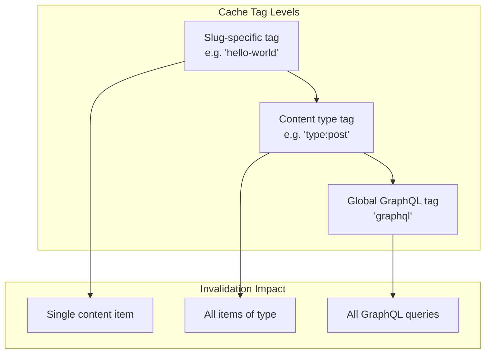
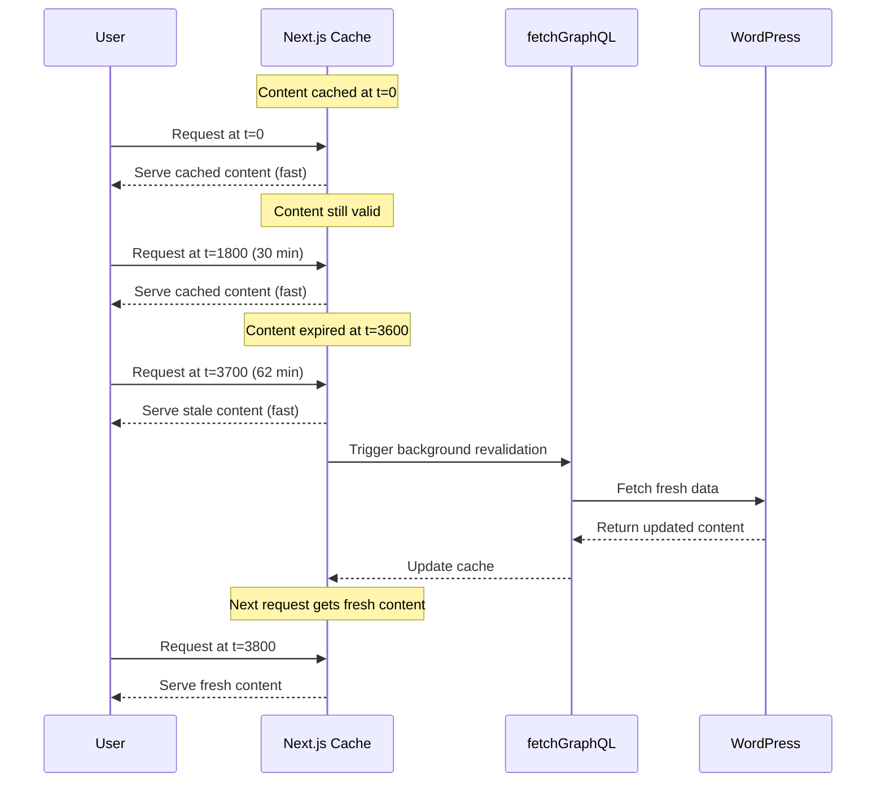
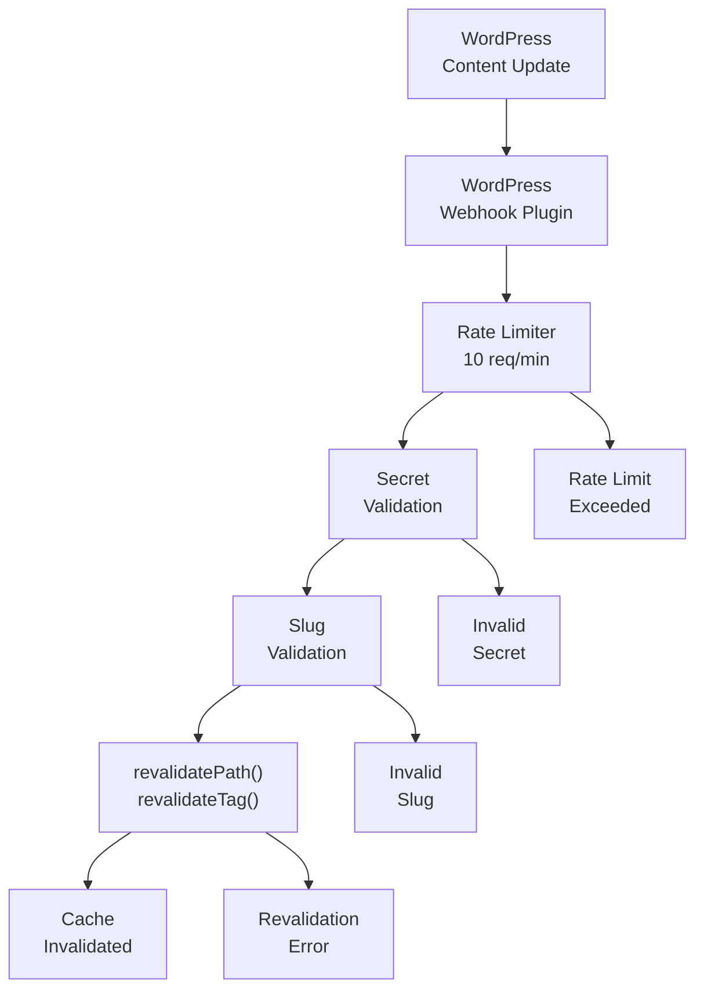

---
layout: default
title: Caching and Revalidation
parent: Architecture
nav_order: 3
---

# Caching and Revalidation

> **Relevant source files**
> * [AGENTS.md](https://github.com/gregrickaby/nextjs-wordpress/blob/63f3f2f5/AGENTS.md)
> * [CONTRIBUTING.md](https://github.com/gregrickaby/nextjs-wordpress/blob/63f3f2f5/CONTRIBUTING.md)
> * [README.md](https://github.com/gregrickaby/nextjs-wordpress/blob/63f3f2f5/README.md)
> * [app/api/revalidate/route.ts](https://github.com/gregrickaby/nextjs-wordpress/blob/63f3f2f5/app/api/revalidate/route.ts)
> * app/blog/category/[slug]/page.tsx
> * app/blog/tag/[slug]/page.tsx
> * app/preview/[slug]/page.tsx
> * [lib/functions.ts](https://github.com/gregrickaby/nextjs-wordpress/blob/63f3f2f5/lib/functions.ts)
> * [lib/queries/getAllBooks.ts](https://github.com/gregrickaby/nextjs-wordpress/blob/63f3f2f5/lib/queries/getAllBooks.ts)
> * [lib/queries/getAllPosts.ts](https://github.com/gregrickaby/nextjs-wordpress/blob/63f3f2f5/lib/queries/getAllPosts.ts)
> * [lib/queries/getBookBySlug.ts](https://github.com/gregrickaby/nextjs-wordpress/blob/63f3f2f5/lib/queries/getBookBySlug.ts)
> * [lib/queries/getPageBySlug.ts](https://github.com/gregrickaby/nextjs-wordpress/blob/63f3f2f5/lib/queries/getPageBySlug.ts)
> * [lib/queries/getPostBySlug.ts](https://github.com/gregrickaby/nextjs-wordpress/blob/63f3f2f5/lib/queries/getPostBySlug.ts)

## Purpose and Scope

This document explains the caching and revalidation architecture used in the Next.js WordPress application. It covers Next.js built-in caching mechanisms, the cache tagging strategy implemented in `fetchGraphQL`, the on-demand revalidation API endpoint, and integration with WordPress webhooks for automatic content updates.

For information about data fetching patterns and GraphQL queries, see [Data Flow](/gregrickaby/nextjs-wordpress/3.2-data-flow). For WordPress backend configuration including webhook setup, see [WordPress Configuration](/gregrickaby/nextjs-wordpress/6.1-wordpress-configuration).

---

## Next.js Caching Fundamentals

The application leverages Next.js's built-in fetch caching and Incremental Static Regeneration (ISR). Every GraphQL request made through `fetchGraphQL` is automatically cached by Next.js with configurable revalidation periods.

### Cache Configuration

The global revalidation period is configured in `lib/config.ts`:

```javascript
const config = {
  siteName: 'Next.js WordPress',
  siteDescription: "It's headless WordPress!",
  siteUrl: 'https://nextjswp.com',
  revalidation: 3600  // Time-based revalidation in seconds (1 hour)
}
```

This `revalidation` value determines how long cached data remains valid before Next.js automatically regenerates it in the background.

**Sources:** [lib/config.ts](https://github.com/gregrickaby/nextjs-wordpress/blob/63f3f2f5/lib/config.ts)

 [README.md L119-L128](https://github.com/gregrickaby/nextjs-wordpress/blob/63f3f2f5/README.md#L119-L128)

---

## Cache Tag Strategy

The application implements a hierarchical cache tagging system that enables granular cache invalidation. Tags are assigned during GraphQL fetch operations in the `fetchGraphQL` function.

### Tag Hierarchy



**Tag Assignment Logic**

The `fetchGraphQL` function automatically assigns three types of cache tags to each request:

| Tag Type | Example | Purpose |
| --- | --- | --- |
| **Slug-specific** | `"hello-world"` | Invalidate a single piece of content |
| **Content type** | `"type:post"` | Invalidate all posts, pages, or books |
| **Global** | `"graphql"` | Invalidate all GraphQL queries |

The tag assignment logic is implemented in [lib/functions.ts L33-L42](https://github.com/gregrickaby/nextjs-wordpress/blob/63f3f2f5/lib/functions.ts#L33-L42)

:

```javascript
// Get the slug and determine content type for better cache tagging.
const slug = variables?.slug || variables?.id || 'unknown'
let contentType = 'content'
if (query.includes('posts')) {
  contentType = 'post'
} else if (query.includes('pages')) {
  contentType = 'page'
} else if (query.includes('books')) {
  contentType = 'book'
}
```

These tags are then applied to the fetch request at [lib/functions.ts L52-L55](https://github.com/gregrickaby/nextjs-wordpress/blob/63f3f2f5/lib/functions.ts#L52-L55)

:

```yaml
next: {
  tags: [slug, 'graphql', `type:${contentType}`],
  revalidate: config.revalidate
}
```

**Sources:** [lib/functions.ts L1-L88](https://github.com/gregrickaby/nextjs-wordpress/blob/63f3f2f5/lib/functions.ts#L1-L88)

 Diagram 5: Caching & Revalidation System

---

## Time-Based Revalidation (ISR)

Incremental Static Regeneration (ISR) automatically revalidates cached data after the configured time period expires. This ensures content freshness without requiring manual intervention.

### Configuration

Every `fetchGraphQL` call includes the `revalidate` option:

```yaml
next: {
  tags: [slug, 'graphql', `type:${contentType}`],
  revalidate: config.revalidate  // Default: 3600 seconds (1 hour)
}
```

### How ISR Works



**Key Characteristics:**

* **Stale-While-Revalidate**: Users always get fast responses, even during revalidation
* **Background Updates**: Fresh data is fetched asynchronously
* **No Blocking**: User requests never wait for WordPress queries
* **Automatic**: No code changes needed to update content after the revalidation period

**Sources:** [lib/functions.ts L44-L56](https://github.com/gregrickaby/nextjs-wordpress/blob/63f3f2f5/lib/functions.ts#L44-L56)

 [README.md L119-L128](https://github.com/gregrickaby/nextjs-wordpress/blob/63f3f2f5/README.md#L119-L128)

---

## On-Demand Revalidation

While time-based revalidation ensures eventual consistency, on-demand revalidation provides immediate cache invalidation when content changes in WordPress. This is implemented via an API route that WordPress can trigger via webhooks.

### Revalidation API Endpoint

The revalidation endpoint is exposed at `/api/revalidate` and accepts GET requests with a slug parameter.

**Endpoint URL Pattern:**

```yaml
GET /api/revalidate?slug=<content-slug>
Header: x-revalidation-secret: <secret-value>
```

### Request Flow



### Validation Layers

The API route implements three security layers before invalidating caches:

#### 1. Rate Limiting

Implemented in [app/api/revalidate/route.ts L39-L70](https://github.com/gregrickaby/nextjs-wordpress/blob/63f3f2f5/app/api/revalidate/route.ts#L39-L70)

:

| Configuration | Value |
| --- | --- |
| Window | 60,000 ms (1 minute) |
| Max Requests | 10 per IP address |
| Response Code | 429 (Too Many Requests) |
| Retry-After | 60 seconds |

**Important:** The in-memory `rateLimitMap` does not work in serverless environments. See [Production Considerations](https://github.com/gregrickaby/nextjs-wordpress/blob/63f3f2f5/Production Considerations)

 below.

#### 2. Secret Validation

Validates the `x-revalidation-secret` header against `process.env.NEXTJS_REVALIDATION_SECRET` at [app/api/revalidate/route.ts L72-L84](https://github.com/gregrickaby/nextjs-wordpress/blob/63f3f2f5/app/api/revalidate/route.ts#L72-L84)

#### 3. Slug Validation

Validates the slug parameter using regex pattern at [app/api/revalidate/route.ts L86-L98](https://github.com/gregrickaby/nextjs-wordpress/blob/63f3f2f5/app/api/revalidate/route.ts#L86-L98)

:

```
if (!slug || !/^[a-zA-Z0-9-_/]+$/.test(slug)) {
  return new Response(
    JSON.stringify({revalidated: false, message: 'Invalid slug parameter.'}),
    {status: 400}
  )
}
```

This prevents path traversal attacks and injection attempts.

**Sources:** [app/api/revalidate/route.ts L1-L149](https://github.com/gregrickaby/nextjs-wordpress/blob/63f3f2f5/app/api/revalidate/route.ts#L1-L149)

 [README.md L83-L86](https://github.com/gregrickaby/nextjs-wordpress/blob/63f3f2f5/README.md#L83-L86)

---

## Cache Invalidation Strategy

When a revalidation request passes all validation checks, the API performs aggressive cache invalidation to ensure content freshness across the entire application.

### Invalidation Operations

The revalidation API executes five distinct invalidation operations in [app/api/revalidate/route.ts L100-L113](https://github.com/gregrickaby/nextjs-wordpress/blob/63f3f2f5/app/api/revalidate/route.ts#L100-L113)

:

```yaml
try {
  // 1. Revalidate the static page
  revalidatePath(slug, 'page')
  
  // 2. Revalidate the layout
  revalidatePath('/', 'layout')
  
  // 3. Revalidate everything
  revalidatePath('/')
  
  // 4. Revalidate the cached GraphQL queries
  revalidateTag(slug, 'max')
  revalidateTag('graphql', 'max')  // Global GraphQL tag
  
  return new Response(
    JSON.stringify({
      revalidated: true,
      revalidatePath: slug,
      revalidateTags: [slug, 'graphql'],
      revalidationTime: Date.now()
    })
  )
}
```

### Invalidation Scope

| Operation | Scope | Purpose |
| --- | --- | --- |
| `revalidatePath(slug, 'page')` | Single page at the given slug | Invalidate the specific static page |
| `revalidatePath('/', 'layout')` | Root layout | Invalidate layout cache (header/footer) |
| `revalidatePath('/')` | All paths | Invalidate all cached paths |
| `revalidateTag(slug, 'max')` | Slug-specific data | Invalidate GraphQL queries for this content |
| `revalidateTag('graphql', 'max')` | All GraphQL data | Invalidate all GraphQL queries globally |

The `'max'` parameter ensures maximum invalidation scope per Next.js documentation.

### Why Aggressive Invalidation?

This aggressive approach prioritizes **correctness over cache retention**:

1. **Content changes are unpredictable**: A post update might affect multiple pages (archives, related posts, etc.)
2. **Relationships are complex**: Categories, tags, and menus can reference updated content
3. **User experience priority**: Better to re-fetch than serve stale data
4. **Low penalty**: Next.js re-caches on next request, and WordPress queries are relatively fast

**Sources:** [app/api/revalidate/route.ts L100-L128](https://github.com/gregrickaby/nextjs-wordpress/blob/63f3f2f5/app/api/revalidate/route.ts#L100-L128)

 Diagram 5: Caching & Revalidation System

---

## WordPress Integration

Content updates in WordPress trigger automatic cache invalidation through webhook integration.

### WordPress Configuration Requirements

The WordPress site must have:

1. **Next.js WordPress Plugin** installed (provides webhook functionality)
2. **Environment constant** in `wp-config.php`:

```
// Any random string. Must match the .env variable in Next.js
define('NEXTJS_REVALIDATION_SECRET', 'revalidate');
```

1. **Frontend URL** configured in `wp-config.php`:

```
define('NEXTJS_FRONTEND_URL', 'https://nextjswp.com/');
```

### Webhook Trigger Events

The Next.js WordPress Plugin automatically sends webhook requests to the revalidation API when:

* A post/page/book is **published**
* A post/page/book is **updated**
* A post/page/book is **deleted**
* A menu is **modified**
* A category/tag is **updated**

### Webhook Request Format

```
GET https://nextjswp.com/api/revalidate?slug=hello-world HTTP/1.1
x-revalidation-secret: revalidate
```

**Sources:** [README.md L145-L161](https://github.com/gregrickaby/nextjs-wordpress/blob/63f3f2f5/README.md#L145-L161)

 [app/api/revalidate/route.ts L1-L27](https://github.com/gregrickaby/nextjs-wordpress/blob/63f3f2f5/app/api/revalidate/route.ts#L1-L27)

---

## End-to-End Revalidation Flow

```mermaid
sequenceDiagram
  participant WordPress Editor
  participant WordPress Backend
  participant Next.js WP Plugin
  participant /api/revalidate
  participant Next.js Cache
  participant End User

  WordPress Editor->>WordPress Backend: Update Post "hello-world"
  WordPress Backend->>Next.js WP Plugin: Trigger post_updated hook
  Next.js WP Plugin->>Next.js WP Plugin: Build webhook URL with slug
  Next.js WP Plugin->>/api/revalidate: GET /api/revalidate?slug=hello-world
  /api/revalidate->>/api/revalidate: Header: x-revalidation-secret
  /api/revalidate->>/api/revalidate: Check rate limit (10/min)
  /api/revalidate->>/api/revalidate: Validate secret
  /api/revalidate->>Next.js Cache: Validate slug pattern
  /api/revalidate->>Next.js Cache: revalidatePath('/hello-world', 'page')
  /api/revalidate->>Next.js Cache: revalidatePath('/', 'layout')
  /api/revalidate->>Next.js Cache: revalidatePath('/')
  /api/revalidate->>Next.js Cache: revalidateTag('hello-world', 'max')
  Next.js Cache->>Next.js Cache: revalidateTag('graphql', 'max')
  /api/revalidate-->>Next.js WP Plugin: Mark caches as stale
  Next.js WP Plugin-->>WordPress Backend: 200 OK {revalidated: true}
  note over Next.js Cache: Next request regenerates
  End User->>Next.js Cache: Success
  Next.js Cache->>Next.js Cache: GET /blog/hello-world
  Next.js Cache->>WordPress Backend: Cache miss - regenerate
  WordPress Backend-->>Next.js Cache: fetchGraphQL(GetPost)
  Next.js Cache->>Next.js Cache: Fresh post data
  Next.js Cache-->>End User: Cache response with tags
```

**Sources:** [app/api/revalidate/route.ts L1-L149](https://github.com/gregrickaby/nextjs-wordpress/blob/63f3f2f5/app/api/revalidate/route.ts#L1-L149)

 [lib/functions.ts L1-L88](https://github.com/gregrickaby/nextjs-wordpress/blob/63f3f2f5/lib/functions.ts#L1-L88)

 Diagram 5

---

## Query Function Integration

All query functions in the application automatically participate in the caching system by using `fetchGraphQL`.

### Example: getPostBySlug

The `getPostBySlug` query at [lib/queries/getPostBySlug.ts L1-L84](https://github.com/gregrickaby/nextjs-wordpress/blob/63f3f2f5/lib/queries/getPostBySlug.ts#L1-L84)

 demonstrates the pattern:

```javascript
export default async function getPostBySlug(slug: string) {
  const query = `
    query GetPost($slug: ID!) {
      post(id: $slug, idType: SLUG) {
        databaseId
        title
        content
        // ... rest of query
      }
    }
  `
  
  const variables = { slug: slug }
  
  // fetchGraphQL automatically applies caching with tags
  const response = await fetchGraphQL(query, variables)
  
  if (!response?.data?.post) {
    return null
  }
  
  return response.data.post as Post
}
```

**Automatic Cache Benefits:**

* Query is cached with tags: `[slug, 'graphql', 'type:post']`
* Time-based revalidation after 3600 seconds
* On-demand invalidation when webhook triggers
* No manual cache management required

### Cache Tag Resolution

| Query Function | Slug Variable | Content Type | Resulting Tags |
| --- | --- | --- | --- |
| `getPostBySlug('hello-world')` | `'hello-world'` | `'post'` | `['hello-world', 'graphql', 'type:post']` |
| `getPageBySlug('about')` | `'about'` | `'page'` | `['about', 'graphql', 'type:page']` |
| `getBookBySlug('my-book')` | `'my-book'` | `'book'` | `['my-book', 'graphql', 'type:book']` |
| `getAllPosts()` | `'unknown'` | `'post'` | `['unknown', 'graphql', 'type:post']` |

**Sources:** [lib/queries/getPostBySlug.ts L1-L84](https://github.com/gregrickaby/nextjs-wordpress/blob/63f3f2f5/lib/queries/getPostBySlug.ts#L1-L84)

 [lib/queries/getAllPosts.ts L1-L46](https://github.com/gregrickaby/nextjs-wordpress/blob/63f3f2f5/lib/queries/getAllPosts.ts#L1-L46)

 [lib/queries/getPageBySlug.ts L1-L54](https://github.com/gregrickaby/nextjs-wordpress/blob/63f3f2f5/lib/queries/getPageBySlug.ts#L1-L54)

 [lib/queries/getBookBySlug.ts L1-L50](https://github.com/gregrickaby/nextjs-wordpress/blob/63f3f2f5/lib/queries/getBookBySlug.ts#L1-L50)

---

## Search Functionality Caching

Search queries use the WordPress REST API instead of GraphQL and have their own caching strategy.

The `searchQuery` function at [lib/functions.ts L90-L141](https://github.com/gregrickaby/nextjs-wordpress/blob/63f3f2f5/lib/functions.ts#L90-L141)

 implements search-specific cache tags:

```javascript
const response = await fetch(
  `${process.env.NEXT_PUBLIC_WORDPRESS_REST_API_URL}/search?search=${query}`,
  {
    method: 'GET',
    headers: {'Content-Type': 'application/json'},
    next: {
      tags: [`search-${query}`],  // Query-specific tag
      revalidate: config.revalidate
    }
  }
)
```

**Search Cache Characteristics:**

* Each search query gets a unique tag: `search-<query>`
* Not affected by `revalidateTag('graphql')` invalidation
* Must be invalidated separately if needed
* Same 1-hour revalidation period as GraphQL queries

**Sources:** [lib/functions.ts L90-L141](https://github.com/gregrickaby/nextjs-wordpress/blob/63f3f2f5/lib/functions.ts#L90-L141)

---

## Production Considerations

### Rate Limiting in Serverless Environments

⚠️ **Critical Production Issue:** The in-memory rate limiting implementation at [app/api/revalidate/route.ts L39](https://github.com/gregrickaby/nextjs-wordpress/blob/63f3f2f5/app/api/revalidate/route.ts#L39-L39)

 will **not work correctly in serverless environments** (Vercel, AWS Lambda, Netlify Functions).

```javascript
// WARNING: This in-memory Map will NOT work in serverless
const rateLimitMap = new Map<string, number[]>()
```

**Problem:** Each serverless function invocation runs in a separate instance with its own memory space. The `rateLimitMap` is not shared across instances.

**Solutions for Production:**

| Solution | Use Case | Implementation |
| --- | --- | --- |
| **Upstash Redis** | Serverless (recommended) | Distributed Redis with REST API |
| **Vercel KV** | Vercel deployments | Built-in key-value store |
| **Redis (self-hosted)** | Dedicated server environments | Traditional Redis instance |
| **DynamoDB** | AWS Lambda | AWS-native distributed storage |

**Migration Example (Upstash Redis):**

```javascript
import {Redis} from '@upstash/redis'

const redis = Redis.fromEnv()

// Replace in-memory Map with Redis
const ip = request.headers.get('x-forwarded-for') || 'unknown'
const key = `ratelimit:revalidate:${ip}`
const requests = await redis.get<number[]>(key) || []
// ... rest of rate limiting logic
await redis.setex(key, 60, recentRequests)
```

### Monitoring and Observability

**Recommended Metrics to Track:**

* Revalidation request rate (per IP, globally)
* Failed revalidation attempts (401, 429, 500)
* Cache hit/miss ratios
* Average revalidation duration
* Webhook delivery success rate

**Logging Enhancements:**

The current implementation logs errors to console. In production, consider:

* Structured logging (JSON format)
* Log aggregation service (DataDog, LogRocket, Sentry)
* Alerting on repeated failures
* Webhook delivery confirmation to WordPress

### Webhook Reliability

**Consider implementing:**

* **Retry logic** in WordPress plugin for failed webhooks
* **Dead letter queue** for persistently failing requests
* **Webhook signature verification** to prevent spoofing
* **Idempotency keys** to handle duplicate webhook deliveries

**Sources:** [app/api/revalidate/route.ts L29-L41](https://github.com/gregrickaby/nextjs-wordpress/blob/63f3f2f5/app/api/revalidate/route.ts#L29-L41)

 [README.md L389-L394](https://github.com/gregrickaby/nextjs-wordpress/blob/63f3f2f5/README.md#L389-L394)

---

## Testing Cache Behavior

### Manual Revalidation Testing

Test the revalidation API manually using curl:

```
curl -X GET \
  'https://your-site.com/api/revalidate?slug=hello-world' \
  -H 'x-revalidation-secret: your-secret-here'
```

**Expected Response:**

```json
{
  "revalidated": true,
  "revalidatePath": "hello-world",
  "revalidateTags": ["hello-world", "graphql"],
  "revalidationTime": 1703001234567
}
```

### Verifying Cache Tags

To verify cache tags are working:

1. Deploy the application
2. Visit a page (e.g., `/blog/hello-world`)
3. Update the post in WordPress
4. WordPress should trigger webhook automatically
5. Refresh the page - content should update immediately
6. Check Next.js build logs for revalidation messages

### Cache Debugging

Enable Next.js cache debugging by setting environment variable:

```
DEBUG=next:* npm run dev
```

This shows detailed cache operations in the console.

**Sources:** [app/api/revalidate/route.ts L114-L127](https://github.com/gregrickaby/nextjs-wordpress/blob/63f3f2f5/app/api/revalidate/route.ts#L114-L127)

 [README.md L1-L420](https://github.com/gregrickaby/nextjs-wordpress/blob/63f3f2f5/README.md#L1-L420)

---

## Summary

The caching and revalidation system combines:

1. **Time-based revalidation (ISR)**: Background updates every 3600 seconds
2. **Hierarchical cache tags**: Granular invalidation via slug, type, and global tags
3. **On-demand revalidation API**: Immediate updates triggered by WordPress webhooks
4. **Security layers**: Rate limiting, secret validation, and slug validation
5. **Aggressive invalidation**: Prioritizes correctness over cache retention

This architecture ensures:

* ✅ Fast page loads (served from cache)
* ✅ Fresh content (automatic revalidation)
* ✅ Immediate updates (webhook-triggered invalidation)
* ✅ Graceful degradation (stale content served during revalidation)
* ✅ Security (rate limiting and authentication)

**Key Files:**

* [lib/functions.ts L1-L88](https://github.com/gregrickaby/nextjs-wordpress/blob/63f3f2f5/lib/functions.ts#L1-L88)  - Cache tag assignment in `fetchGraphQL`
* [app/api/revalidate/route.ts L1-L149](https://github.com/gregrickaby/nextjs-wordpress/blob/63f3f2f5/app/api/revalidate/route.ts#L1-L149)  - On-demand revalidation API
* [lib/config.ts](https://github.com/gregrickaby/nextjs-wordpress/blob/63f3f2f5/lib/config.ts)  - Revalidation period configuration

**Sources:** All files referenced throughout this document, Diagram 5: Caching & Revalidation System