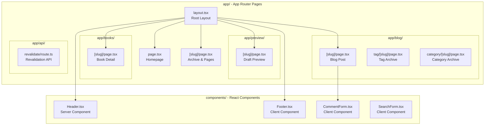
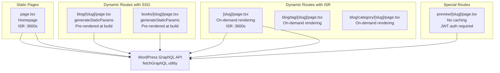
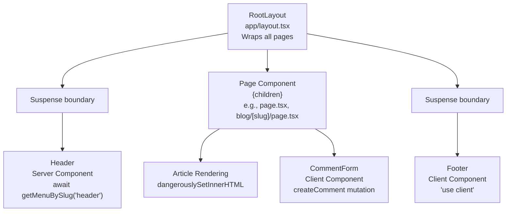

---
layout: default
title: Frontend Application
nav_order: 5
has_children: true
---

# Frontend Application

> **Relevant source files**
> * [AGENTS.md](https://github.com/gregrickaby/nextjs-wordpress/blob/63f3f2f5/AGENTS.md)
> * [CONTRIBUTING.md](https://github.com/gregrickaby/nextjs-wordpress/blob/63f3f2f5/CONTRIBUTING.md)
> * [README.md](https://github.com/gregrickaby/nextjs-wordpress/blob/63f3f2f5/README.md)
> * app/[slug]/page.tsx
> * app/blog/[slug]/page.tsx
> * app/books/[slug]/page.tsx
> * [app/layout.tsx](https://github.com/gregrickaby/nextjs-wordpress/blob/63f3f2f5/app/layout.tsx)
> * [app/page.tsx](https://github.com/gregrickaby/nextjs-wordpress/blob/63f3f2f5/app/page.tsx)
> * [components/CommentForm.tsx](https://github.com/gregrickaby/nextjs-wordpress/blob/63f3f2f5/components/CommentForm.tsx)
> * [components/Footer.tsx](https://github.com/gregrickaby/nextjs-wordpress/blob/63f3f2f5/components/Footer.tsx)
> * [components/Header.tsx](https://github.com/gregrickaby/nextjs-wordpress/blob/63f3f2f5/components/Header.tsx)
> * [lib/mutations/createComment.ts](https://github.com/gregrickaby/nextjs-wordpress/blob/63f3f2f5/lib/mutations/createComment.ts)
> * [next.config.ts](https://github.com/gregrickaby/nextjs-wordpress/blob/63f3f2f5/next.config.ts)

## Purpose and Scope

This document provides an architectural overview of the Next.js frontend application, including its structure, rendering strategies, and integration patterns. It covers the organization of pages, components, and routing mechanisms, as well as key conventions used throughout the codebase.

For detailed information about specific aspects:

* **Pages and Routing**: See [Pages and Routing](/gregrickaby/nextjs-wordpress/4.1-pages-and-routing) for route definitions and dynamic segments
* **Components**: See [Components](/gregrickaby/nextjs-wordpress/4.2-components) for reusable UI components and their props
* **Layouts and Metadata**: See [Layouts and Metadata](/gregrickaby/nextjs-wordpress/4.3-layouts-and-metadata) for RootLayout and SEO configuration
* **Data Access**: See [Data Access Layer](/gregrickaby/nextjs-wordpress/5-data-access-layer) for GraphQL queries and data fetching patterns

## Application Architecture

The application is built on **Next.js 16 App Router** with **React 19 Server Components** as the default rendering strategy. The architecture follows a server-first approach where components render on the server by default, with client-side interactivity added only where necessary.

**Sources:** [README.md L10-L15](https://github.com/gregrickaby/nextjs-wordpress/blob/63f3f2f5/README.md#L10-L15)

 [AGENTS.md L7-L9](https://github.com/gregrickaby/nextjs-wordpress/blob/63f3f2f5/AGENTS.md#L7-L9)

### Directory Structure



**Sources:** [app/layout.tsx L1-L40](https://github.com/gregrickaby/nextjs-wordpress/blob/63f3f2f5/app/layout.tsx#L1-L40)

 [app/page.tsx L1-L65](https://github.com/gregrickaby/nextjs-wordpress/blob/63f3f2f5/app/page.tsx#L1-L65)

 app/[slug]/page.tsx:1-119, app/blog/[slug]/page.tsx:1-141, [components/Header.tsx L1-L30](https://github.com/gregrickaby/nextjs-wordpress/blob/63f3f2f5/components/Header.tsx#L1-L30)

 [components/Footer.tsx L1-L17](https://github.com/gregrickaby/nextjs-wordpress/blob/63f3f2f5/components/Footer.tsx#L1-L17)

 [components/CommentForm.tsx L1-L110](https://github.com/gregrickaby/nextjs-wordpress/blob/63f3f2f5/components/CommentForm.tsx#L1-L110)

### Server vs Client Components

The application uses **Server Components by default**, minimizing JavaScript sent to the client. Client Components are explicitly marked with `'use client'` directive and used only where interactivity is required.

| Component Type | Directive | Use Cases | Examples |
| --- | --- | --- | --- |
| **Server Components** | None (default) | Data fetching, static rendering, SEO | `Header`, all page components |
| **Client Components** | `'use client'` | Form handling, state management, event handlers | `CommentForm`, `Footer`, `SearchForm` |

**Server Component Characteristics:**

* Execute only on the server
* Can directly call async functions for data fetching
* No state, effects, or event handlers
* Zero JavaScript bundle on client
* Located in: [app/layout.tsx L24-L40](https://github.com/gregrickaby/nextjs-wordpress/blob/63f3f2f5/app/layout.tsx#L24-L40)  [app/page.tsx L13-L64](https://github.com/gregrickaby/nextjs-wordpress/blob/63f3f2f5/app/page.tsx#L13-L64)  [components/Header.tsx L9-L29](https://github.com/gregrickaby/nextjs-wordpress/blob/63f3f2f5/components/Header.tsx#L9-L29)

**Client Component Characteristics:**

* Can use React hooks (`useState`, `useEffect`)
* Handle user interactions and form submissions
* Compiled and sent to browser
* Located in: [components/CommentForm.tsx L1-L110](https://github.com/gregrickaby/nextjs-wordpress/blob/63f3f2f5/components/CommentForm.tsx#L1-L110)  [components/Footer.tsx L1-L17](https://github.com/gregrickaby/nextjs-wordpress/blob/63f3f2f5/components/Footer.tsx#L1-L17)

**Sources:** [app/layout.tsx L1-L40](https://github.com/gregrickaby/nextjs-wordpress/blob/63f3f2f5/app/layout.tsx#L1-L40)

 [components/Header.tsx L1-L30](https://github.com/gregrickaby/nextjs-wordpress/blob/63f3f2f5/components/Header.tsx#L1-L30)

 [components/CommentForm.tsx L1-L10](https://github.com/gregrickaby/nextjs-wordpress/blob/63f3f2f5/components/CommentForm.tsx#L1-L10)

 [components/Footer.tsx L1-L8](https://github.com/gregrickaby/nextjs-wordpress/blob/63f3f2f5/components/Footer.tsx#L1-L8)

## Page Types and Rendering Strategies

### Page Type Classification



**Sources:** [app/page.tsx L1-L65](https://github.com/gregrickaby/nextjs-wordpress/blob/63f3f2f5/app/page.tsx#L1-L65)

 app/blog/[slug]/page.tsx:1-141, app/books/[slug]/page.tsx:1-84, app/[slug]/page.tsx:1-119

### Static Generation with generateStaticParams

Dynamic routes using `[slug]` parameters implement `generateStaticParams` to pre-render pages at build time. This function queries WordPress for all content items and returns an array of route parameters.

**Blog Post Implementation:**

```javascript
// app/blog/[slug]/page.tsx:16-31
export async function generateStaticParams() {
  const posts = await getAllPosts()
  if (!posts) return []
  
  return posts
    .filter((post) => post.slug)
    .map((post) => ({
      slug: post.slug as string
    }))
}
```

**Book Implementation:**

```javascript
// app/books/[slug]/page.tsx:13-28
export async function generateStaticParams() {
  const books = await getAllBooks()
  if (!books) return []
  
  return books
    .filter((book) => book.slug)
    .map((book) => ({
      slug: book.slug as string
    }))
}
```

This pattern enables **Static Site Generation (SSG)** where all blog posts and books are pre-rendered at build time, resulting in instant page loads.

**Sources:** app/blog/[slug]/page.tsx:16-31, app/books/[slug]/page.tsx:13-28

### Metadata Generation

All pages implement `generateMetadata` for SEO optimization. This function runs at build time (for static routes) or on-demand (for dynamic routes) to generate page-specific metadata.

**Pattern:**

```javascript
// app/blog/[slug]/page.tsx:38-56
export async function generateMetadata({
  params
}: DynamicPageProps): Promise<Metadata | null> {
  const {slug} = await params
  const post = await getPostBySlug(slug)
  
  if (!post) return {}
  
  return {
    title: post.seo?.title ?? '',
    description: post.seo?.metaDesc ?? ''
  }
}
```

The `seo` field is populated by **Yoast SEO** plugin data from WordPress, providing optimized meta titles and descriptions.

**Sources:** app/blog/[slug]/page.tsx:38-56, app/books/[slug]/page.tsx:35-53

## Page Component Patterns

### Next.js 16 Async Params Pattern

All dynamic routes must await the `params` prop due to Next.js 16 requirements. This is a **breaking change** from previous versions.

**Standard Pattern:**

```javascript
// app/blog/[slug]/page.tsx:63-65
export default async function Post({params}: Readonly<DynamicPageProps>) {
  const {slug} = await params
  // Use slug for data fetching
}
```

**Type Definition:**

```python
// lib/types.d.ts (inferred from usage)
type DynamicPageProps = {
  params: Promise<{slug: string}>
}
```

**Sources:** app/blog/[slug]/page.tsx:63-68, app/books/[slug]/page.tsx:60-65, app/[slug]/page.tsx:94-96, [README.md L169-L182](https://github.com/gregrickaby/nextjs-wordpress/blob/63f3f2f5/README.md#L169-L182)

 [AGENTS.md L100-L112](https://github.com/gregrickaby/nextjs-wordpress/blob/63f3f2f5/AGENTS.md#L100-L112)

### Data Fetching and Error Handling

Pages fetch data using query functions from `lib/queries/` and handle missing data with `notFound()`.

**Homepage Pattern:**

```javascript
// app/page.tsx:13-23
export default async function Home() {
  const homepage = await getPageBySlug('homepage')
  const posts = await getAllPosts()
  
  if (!posts?.length || !homepage) {
    notFound()
  }
  
  // Render page...
}
```

**Dynamic Route Pattern:**

```javascript
// app/blog/[slug]/page.tsx:63-73
export default async function Post({params}: Readonly<DynamicPageProps>) {
  const {slug} = await params
  const post = await getPostBySlug(slug)
  
  if (!post) {
    notFound()
  }
  
  // Render post...
}
```

This pattern ensures graceful 404 handling when content doesn't exist in WordPress.

**Sources:** [app/page.tsx L13-L23](https://github.com/gregrickaby/nextjs-wordpress/blob/63f3f2f5/app/page.tsx#L13-L23)

 app/blog/[slug]/page.tsx:63-73, app/books/[slug]/page.tsx:60-70

## Component Integration

### Layout Hierarchy



**Sources:** [app/layout.tsx L24-L40](https://github.com/gregrickaby/nextjs-wordpress/blob/63f3f2f5/app/layout.tsx#L24-L40)

 [components/Header.tsx L9-L29](https://github.com/gregrickaby/nextjs-wordpress/blob/63f3f2f5/components/Header.tsx#L9-L29)

 [components/Footer.tsx L8-L16](https://github.com/gregrickaby/nextjs-wordpress/blob/63f3f2f5/components/Footer.tsx#L8-L16)

### Layout Implementation

The `RootLayout` component wraps all pages and provides consistent structure:

```javascript
// app/layout.tsx:24-40
export default function RootLayout({
  children
}: Readonly<{children: React.ReactNode}>) {
  return (
    <html lang="en">
      <body>
        <Suspense fallback={null}>
          <Header />
        </Suspense>
        {children}
        <Suspense fallback={null}>
          <Footer />
        </Suspense>
      </body>
    </html>
  )
}
```

**Key Features:**

* `<Suspense>` boundaries around `Header` and `Footer` enable **progressive rendering**
* Header and Footer load independently without blocking page content
* Page content (`{children}`) renders immediately while layout components stream in

**Sources:** [app/layout.tsx L24-L40](https://github.com/gregrickaby/nextjs-wordpress/blob/63f3f2f5/app/layout.tsx#L24-L40)

### Server Component Data Fetching

Server Components can directly await async functions, eliminating the need for `useEffect` or client-side loading states.

**Header Component:**

```javascript
// components/Header.tsx:9-29
export default async function Header() {
  const menu = await getMenuBySlug('header')
  
  return (
    <header>
      <div>
        <h1>{config.siteName}</h1>
        <p>{config.siteDescription}</p>
      </div>
      <nav className="flex gap-4">
        {!!menu && menu.menuItems?.edges?.map((item: {node: MenuItem}) => (
          <Link key={item.node.databaseId} href={item.node.uri ?? '#'}>
            {item.node.label ?? ''}
          </Link>
        ))}
      </nav>
    </header>
  )
}
```

The `Header` component queries WordPress menu items directly without client-side state management.

**Sources:** [components/Header.tsx L9-L29](https://github.com/gregrickaby/nextjs-wordpress/blob/63f3f2f5/components/Header.tsx#L9-L29)

### Client Component Interactivity

Client Components handle user interactions and form submissions. They use React hooks and manage local state.

**CommentForm Pattern:**

```javascript
// components/CommentForm.tsx:9-58
export default function CommentForm({postID}: Readonly<{postID: string}>) {
  const [name, setName] = useState('')
  const [email, setEmail] = useState('')
  const [comment, setComment] = useState('')
  const [status, setStatus] = useState('')
  
  async function handleSubmit(e: React.FormEvent<HTMLFormElement>) {
    e.preventDefault()
    
    const status = await createComment({
      name, email, comment, postID
    })
    
    if (status?.success) {
      // Clear form and show success message
    }
  }
  
  return <form onSubmit={handleSubmit}>...</form>
}
```

**Sources:** [components/CommentForm.tsx L9-L58](https://github.com/gregrickaby/nextjs-wordpress/blob/63f3f2f5/components/CommentForm.tsx#L9-L58)

## Rendering Flow

### Request-to-Response Pipeline

```mermaid
sequenceDiagram
  participant Browser
  participant Next.js Server
  participant Page Component
  participant (Server Component)
  participant Query Function
  participant (e.g., getPostBySlug)
  participant fetchGraphQL
  participant lib/functions.ts
  participant Next.js Cache
  participant (ISR Layer)
  participant WordPress GraphQL API

  Browser->>Next.js Server: "GET /blog/hello-world"
  Next.js Server->>Page Component: "Render Post component"
  Page Component->>Page Component: "await params"
  Page Component->>Query Function: "await getPostBySlug('hello-world')"
  Query Function->>fetchGraphQL: "fetchGraphQL(query, variables)"
  loop [Cache Hit]
    fetchGraphQL->>Next.js Cache: "Check cache tags: ['post-hello-world']"
    Next.js Cache-->>fetchGraphQL: "Return cached data"
    fetchGraphQL->>WordPress GraphQL API: "POST /graphql"
    WordPress GraphQL API-->>fetchGraphQL: "Return post data"
    fetchGraphQL->>Next.js Cache: "Store with tags + revalidate: 3600"
  end
  fetchGraphQL-->>Query Function: "Return Post object"
  Query Function-->>Page Component: "Return Post object"
  Page Component->>Page Component: "Render JSX with data"
  Page Component-->>Next.js Server: "Return React elements"
  Next.js Server-->>Browser: "Send HTML response"
```

**Sources:** app/blog/[slug]/page.tsx:63-73, [lib/config.ts L1-L7](https://github.com/gregrickaby/nextjs-wordpress/blob/63f3f2f5/lib/config.ts#L1-L7)

 (implied revalidation setting)

### Cache Revalidation Flow

The application uses **Incremental Static Regeneration (ISR)** with on-demand revalidation triggered by WordPress webhooks.

**Revalidation Trigger:**

1. Content updated in WordPress admin
2. WordPress webhook calls `/api/revalidate` with secret
3. API route validates secret and slug
4. Calls `revalidatePath()` and `revalidateTag()` to clear cache
5. Next request regenerates the page with fresh data

**Sources:** Inferred from architecture diagrams, detailed in [On-Demand Revalidation](/gregrickaby/nextjs-wordpress/6.3-on-demand-revalidation)

## Content Rendering Patterns

### Null Safety and Optional Chaining

All WordPress data uses `Maybe<T>` types (nullable fields). The codebase employs **nullish coalescing** and **optional chaining** throughout.

**Featured Image Pattern:**

```
// app/page.tsx:37-46
{post.featuredImage?.node && (
  <Image
    alt={post.featuredImage.node.altText ?? post.title ?? ''}
    height={post.featuredImage.node.mediaDetails?.height ?? 230}
    src={post.featuredImage.node.sourceUrl ?? ''}
    width={post.featuredImage.node.mediaDetails?.width ?? 288}
    sizes="(max-width: 768px) 100vw, 288px"
    className="h-auto w-full object-cover"
    priority={index < 2}
  />
)}
```

**Key Patterns:**

* `post.featuredImage?.node` - Check existence before rendering
* `post.title ?? ''` - Provide fallback for null values
* `?? 230` - Numeric defaults for dimensions

**Sources:** [app/page.tsx L37-L46](https://github.com/gregrickaby/nextjs-wordpress/blob/63f3f2f5/app/page.tsx#L37-L46)

 app/[slug]/page.tsx:63-72, [README.md L334-L338](https://github.com/gregrickaby/nextjs-wordpress/blob/63f3f2f5/README.md#L334-L338)

 [AGENTS.md L114-L125](https://github.com/gregrickaby/nextjs-wordpress/blob/63f3f2f5/AGENTS.md#L114-L125)

### HTML Content Rendering

WordPress content is HTML and must be rendered with `dangerouslySetInnerHTML`. This is safe because WordPress sanitizes content on the backend.

**Pattern:**

```html
// app/blog/[slug]/page.tsx:78-83
<article>
  <header>
    <h2 dangerouslySetInnerHTML={{__html: post.title ?? ''}} />
  </header>
  <div dangerouslySetInnerHTML={{__html: post.content ?? ''}} />
</article>
```

All text content from WordPress (titles, content, excerpts) follows this pattern to preserve HTML formatting and entities.

**Sources:** app/blog/[slug]/page.tsx:76-83, [app/page.tsx L28-L29](https://github.com/gregrickaby/nextjs-wordpress/blob/63f3f2f5/app/page.tsx#L28-L29)

 app/books/[slug]/page.tsx:75-76

## Integration with Data Layer

### Query Function Integration

Pages import and call query functions that abstract GraphQL communication.

**Import Pattern:**

```javascript
// app/blog/[slug]/page.tsx:1-9
import CommentForm from '@/components/CommentForm'
import type {Category, Tag} from '@/lib/generated'
import getAllPosts from '@/lib/queries/getAllPosts'
import getPostBySlug from '@/lib/queries/getPostBySlug'
import type {DynamicPageProps} from '@/lib/types'
```

**Usage Pattern:**

```javascript
// app/page.tsx:14-18
const homepage = await getPageBySlug('homepage')
const posts = await getAllPosts()
```

Query functions return typed objects (from `@/lib/generated`) or empty arrays on error, ensuring type safety throughout the component tree.

**Sources:** app/blog/[slug]/page.tsx:1-9, [app/page.tsx L1-L6](https://github.com/gregrickaby/nextjs-wordpress/blob/63f3f2f5/app/page.tsx#L1-L6)

 [app/page.tsx L14-L18](https://github.com/gregrickaby/nextjs-wordpress/blob/63f3f2f5/app/page.tsx#L14-L18)

### Type Imports

The application imports types from two sources:

**WordPress Types (Generated):**

```javascript
import type {Post, Category, Tag, MenuItem} from '@/lib/generated'
```

**Application Types (Custom):**

```javascript
import type {DynamicPageProps, SearchResults} from '@/lib/types'
```

This separation keeps auto-generated WordPress types isolated from hand-written application types.

**Sources:** app/blog/[slug]/page.tsx:2-5, [components/Header.tsx L2](https://github.com/gregrickaby/nextjs-wordpress/blob/63f3f2f5/components/Header.tsx#L2-L2)

 [AGENTS.md L128-L141](https://github.com/gregrickaby/nextjs-wordpress/blob/63f3f2f5/AGENTS.md#L128-L141)

## Configuration

### Next.js Configuration

The application configures image optimization and remote patterns for WordPress and Gravatar images.

**Configuration:**

```javascript
// next.config.ts:3-23
const nextConfig: NextConfig = {
  reactCompiler: true,
  images: {
    formats: ['image/avif', 'image/webp'],
    remotePatterns: [
      {
        protocol: 'https',
        hostname: '*.nextjswp.**'
      },
      {
        protocol: 'https',
        hostname: '*.gravatar.**'
      }
    ]
  },
  logging: {
    fetches: {
      fullUrl: true
    }
  }
}
```

**Key Settings:**

* `reactCompiler: true` - Enables React 19 Compiler for automatic optimization
* `formats` - Serves AVIF and WebP for optimal image delivery
* `remotePatterns` - Allows loading images from WordPress and Gravatar domains
* `logging.fetches.fullUrl` - Logs full fetch URLs for debugging

**Sources:** [next.config.ts L3-L23](https://github.com/gregrickaby/nextjs-wordpress/blob/63f3f2f5/next.config.ts#L3-L23)

### Site Configuration

Global site settings are centralized in `lib/config.ts`:

```javascript
// lib/config.ts (referenced structure)
const config = {
  siteName: 'Next.js WordPress',
  siteDescription: "It's headless WordPress!",
  siteUrl: 'https://nextjswp.com',
  revalidation: 3600
}
```

These values are used in:

* [app/layout.tsx L13-L16](https://github.com/gregrickaby/nextjs-wordpress/blob/63f3f2f5/app/layout.tsx#L13-L16)  - Metadata configuration
* [components/Header.tsx L16-L17](https://github.com/gregrickaby/nextjs-wordpress/blob/63f3f2f5/components/Header.tsx#L16-L17)  - Site name and description
* [components/Footer.tsx L11](https://github.com/gregrickaby/nextjs-wordpress/blob/63f3f2f5/components/Footer.tsx#L11-L11)  - Site name in footer

**Sources:** [app/layout.tsx L13-L16](https://github.com/gregrickaby/nextjs-wordpress/blob/63f3f2f5/app/layout.tsx#L13-L16)

 [components/Header.tsx L1-L4](https://github.com/gregrickaby/nextjs-wordpress/blob/63f3f2f5/components/Header.tsx#L1-L4)

 [components/Footer.tsx L1-L3](https://github.com/gregrickaby/nextjs-wordpress/blob/63f3f2f5/components/Footer.tsx#L1-L3)

 [README.md L117-L128](https://github.com/gregrickaby/nextjs-wordpress/blob/63f3f2f5/README.md#L117-L128)

## Key Conventions

### Naming Conventions

| Entity | Convention | Example |
| --- | --- | --- |
| **Page Components** | PascalCase | `Post`, `Home`, `Archive` |
| **Query Functions** | camelCase with prefix | `getPostBySlug`, `getAllPosts` |
| **Mutation Functions** | camelCase with verb | `createComment` |
| **Types** | PascalCase | `Post`, `Category`, `DynamicPageProps` |
| **Route Segments** | kebab-case | `blog/[slug]`, `books/[slug]` |

**Sources:** app/blog/[slug]/page.tsx:63, [app/page.tsx L13](https://github.com/gregrickaby/nextjs-wordpress/blob/63f3f2f5/app/page.tsx#L13-L13)

 [lib/queries/getAllPosts.ts L1-L10](https://github.com/gregrickaby/nextjs-wordpress/blob/63f3f2f5/lib/queries/getAllPosts.ts#L1-L10)

 (inferred), [lib/mutations/createComment.ts L6](https://github.com/gregrickaby/nextjs-wordpress/blob/63f3f2f5/lib/mutations/createComment.ts#L6-L6)

### File Naming Conventions

| File Type | Convention | Example |
| --- | --- | --- |
| **Page Routes** | `page.tsx` | `app/blog/[slug]/page.tsx` |
| **Layout Routes** | `layout.tsx` | `app/layout.tsx` |
| **API Routes** | `route.ts` | `app/api/revalidate/route.ts` |
| **Components** | PascalCase.tsx | `Header.tsx`, `CommentForm.tsx` |
| **Query Files** | camelCase.ts | `getPostBySlug.ts` |
| **Test Files** | `*.test.tsx` / `*.test.ts` | `Header.test.tsx` |

**Sources:** [app/layout.tsx L1](https://github.com/gregrickaby/nextjs-wordpress/blob/63f3f2f5/app/layout.tsx#L1-L1)

 app/blog/[slug]/page.tsx:1, [components/Header.tsx L1](https://github.com/gregrickaby/nextjs-wordpress/blob/63f3f2f5/components/Header.tsx#L1-L1)

 [components/CommentForm.tsx L1](https://github.com/gregrickaby/nextjs-wordpress/blob/63f3f2f5/components/CommentForm.tsx#L1-L1)

### Error Handling Convention

All pages handle missing data by returning `notFound()`, which displays Next.js 404 page:

```
if (!post) {
  notFound()
}
```

Query functions return empty arrays or `null` on errors rather than throwing:

```python
// Pattern from documentation
if (!response?.data?.posts?.nodes) {
  return []
}
```

This convention ensures graceful degradation throughout the application.

**Sources:** [app/page.tsx L21-L23](https://github.com/gregrickaby/nextjs-wordpress/blob/63f3f2f5/app/page.tsx#L21-L23)

 app/blog/[slug]/page.tsx:71-73, [README.md L323-L329](https://github.com/gregrickaby/nextjs-wordpress/blob/63f3f2f5/README.md#L323-L329)

 [AGENTS.md L143-L156](https://github.com/gregrickaby/nextjs-wordpress/blob/63f3f2f5/AGENTS.md#L143-L156)