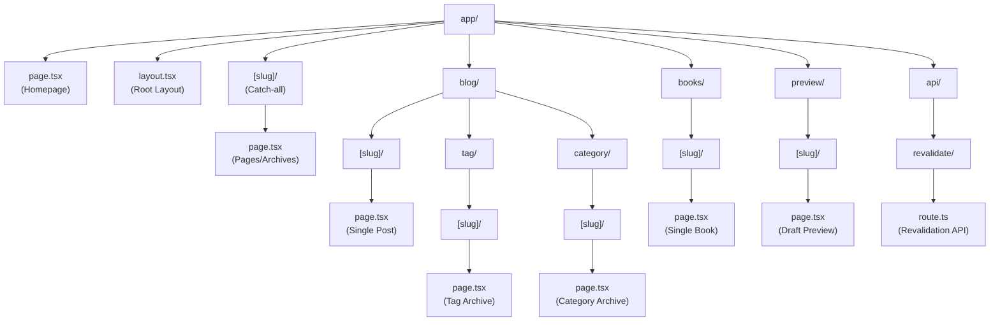
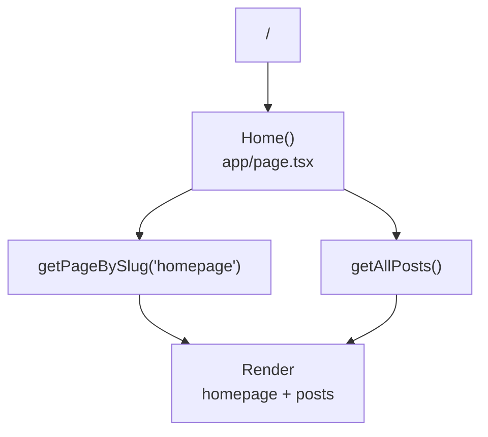
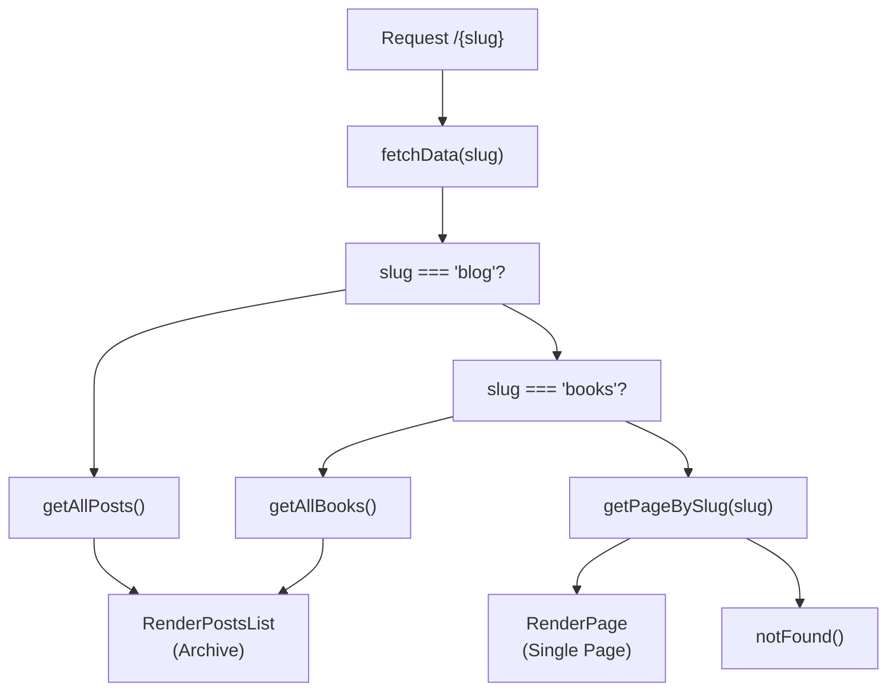
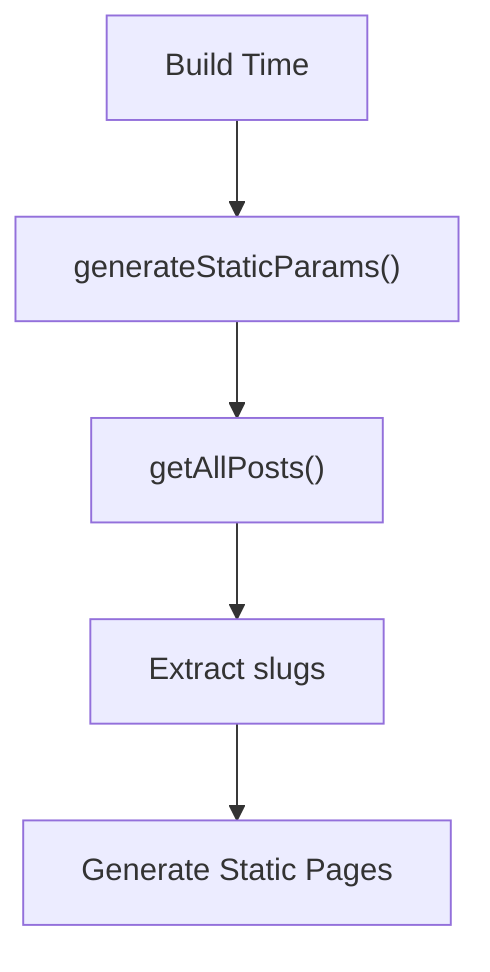
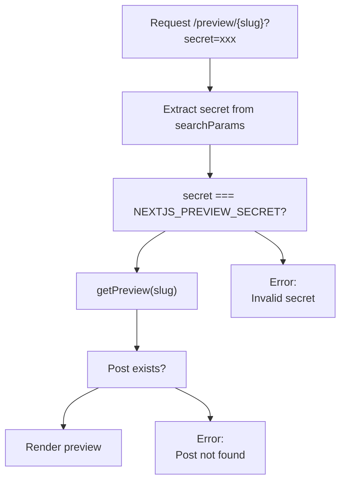
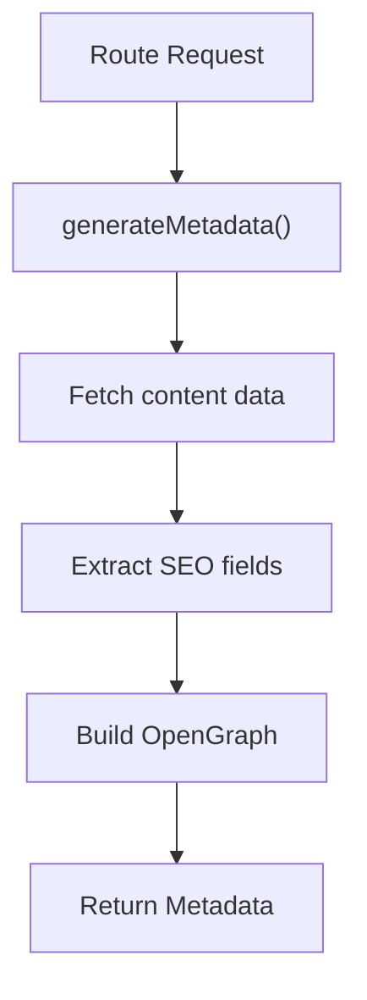

---
layout: default
title: Pages and Routing
parent: Frontend Application
nav_order: 1
---

# Pages and Routing

> **Relevant source files**
> * app/[slug]/page.tsx
> * [app/api/revalidate/route.ts](https://github.com/gregrickaby/nextjs-wordpress/blob/63f3f2f5/app/api/revalidate/route.ts)
> * app/blog/[slug]/page.tsx
> * app/blog/category/[slug]/page.tsx
> * app/blog/tag/[slug]/page.tsx
> * app/books/[slug]/page.tsx
> * [app/layout.tsx](https://github.com/gregrickaby/nextjs-wordpress/blob/63f3f2f5/app/layout.tsx)
> * [app/page.tsx](https://github.com/gregrickaby/nextjs-wordpress/blob/63f3f2f5/app/page.tsx)
> * app/preview/[slug]/page.tsx
> * [components/CommentForm.tsx](https://github.com/gregrickaby/nextjs-wordpress/blob/63f3f2f5/components/CommentForm.tsx)
> * [components/Footer.tsx](https://github.com/gregrickaby/nextjs-wordpress/blob/63f3f2f5/components/Footer.tsx)
> * [components/Header.tsx](https://github.com/gregrickaby/nextjs-wordpress/blob/63f3f2f5/components/Header.tsx)
> * [lib/mutations/createComment.ts](https://github.com/gregrickaby/nextjs-wordpress/blob/63f3f2f5/lib/mutations/createComment.ts)
> * [next.config.ts](https://github.com/gregrickaby/nextjs-wordpress/blob/63f3f2f5/next.config.ts)

This document details all routes, dynamic segments, and page components in the Next.js application. It explains how the App Router file system conventions map URLs to page components, how dynamic routes are generated at build time, and how the catch-all route pattern resolves different content types.

For information about layout structure and metadata configuration, see [Layouts and Metadata](/gregrickaby/nextjs-wordpress/4.3-layouts-and-metadata). For static generation and build-time rendering strategies, see [Static Generation](/gregrickaby/nextjs-wordpress/9.3-static-generation).

---

## Overview

The application uses Next.js 13+ App Router with file-based routing. Route handlers are defined in `page.tsx` files within the `app` directory, and dynamic segments use bracket notation for parameterization.

**Route Structure Diagram**



Sources: [app/page.tsx L1-L65](https://github.com/gregrickaby/nextjs-wordpress/blob/63f3f2f5/app/page.tsx#L1-L65)

 [app/layout.tsx L1-L41](https://github.com/gregrickaby/nextjs-wordpress/blob/63f3f2f5/app/layout.tsx#L1-L41)

 app/[slug]/page.tsx:1-119, app/blog/[slug]/page.tsx:1-141, app/blog/tag/[slug]/page.tsx:1-76, app/blog/category/[slug]/page.tsx:1-78, app/books/[slug]/page.tsx:1-84, app/preview/[slug]/page.tsx:1-142, [app/api/revalidate/route.ts L1-L150](https://github.com/gregrickaby/nextjs-wordpress/blob/63f3f2f5/app/api/revalidate/route.ts#L1-L150)

---

## Route Types

The application implements three categories of routes:

| Route Type | Description | Example Files |
| --- | --- | --- |
| **Static** | Pre-rendered at build time, no dynamic segments | `app/page.tsx` |
| **Dynamic** | Generated using `generateStaticParams`, URL contains variable segments | `app/blog/[slug]/page.tsx` |
| **Catch-all** | Handles multiple content types based on slug | `app/[slug]/page.tsx` |
| **API Routes** | Server-side endpoints using `route.ts` convention | `app/api/revalidate/route.ts` |

---

## Homepage Route

**URL Pattern:** `/`

**File:** [app/page.tsx L1-L65](https://github.com/gregrickaby/nextjs-wordpress/blob/63f3f2f5/app/page.tsx#L1-L65)

The homepage is a static route that displays page content from WordPress along with a list of recent blog posts. It fetches data using `getPageBySlug('homepage')` and `getAllPosts()`.

**Key Characteristics:**

* Server Component (async function)
* Fetches homepage page content and all posts
* Returns 404 if data is unavailable
* Displays featured images with priority loading for first two posts



Sources: [app/page.tsx L13-L64](https://github.com/gregrickaby/nextjs-wordpress/blob/63f3f2f5/app/page.tsx#L13-L64)

---

## Catch-all Archive Route

**URL Pattern:** `/[slug]`

**File:** app/[slug]/page.tsx:1-119

This dynamic route handles three distinct content types based on the slug parameter:

1. **Blog Archive** (`/blog`) - Displays all blog posts
2. **Books Archive** (`/books`) - Displays all books
3. **Single Page** (any other slug) - Displays a WordPress page

**Route Resolution Flow**



The `fetchData` function app/[slug]/page.tsx:13-34 implements conditional logic to determine which query function to invoke based on the slug value.

Sources: app/[slug]/page.tsx:13-118

---

## Blog Post Route

**URL Pattern:** `/blog/[slug]`

**File:** app/blog/[slug]/page.tsx:1-141

Displays individual blog posts with comments and a comment form. This route uses `generateStaticParams` to pre-render all posts at build time.

**Static Generation**



The `generateStaticParams` function app/blog/[slug]/page.tsx:16-31 fetches all posts and returns an array of slug objects:

```javascript
return posts
  .filter((post) => post.slug)
  .map((post) => ({
    slug: post.slug as string
  }))
```

**Page Components:**

* **Header:** Post title, author, and date app/blog/[slug]/page.tsx:77-82
* **Content:** Post body rendered as HTML app/blog/[slug]/page.tsx:83
* **Footer:** Categories and tags with links app/blog/[slug]/page.tsx:84-108
* **Comments Section:** Displays existing comments with avatars app/blog/[slug]/page.tsx:109-136
* **Comment Form:** Client component for submitting new comments app/blog/[slug]/page.tsx:137

Sources: app/blog/[slug]/page.tsx:1-141, [components/CommentForm.tsx L1-L110](https://github.com/gregrickaby/nextjs-wordpress/blob/63f3f2f5/components/CommentForm.tsx#L1-L110)

---

## Tag Archive Route

**URL Pattern:** `/blog/tag/[slug]`

**File:** app/blog/tag/[slug]/page.tsx:1-76

Displays all posts associated with a specific tag. Uses `getTagBySlug(slug)` to fetch filtered posts.

**Metadata Generation:**

The `generateMetadata` function app/blog/tag/[slug]/page.tsx:14-24 creates SEO metadata dynamically:

```
return {
  title: `${slug} Archives - ${config.siteName}`,
  description: `The tag archive for ${slug}`
}
```

Sources: app/blog/tag/[slug]/page.tsx:1-76

---

## Category Archive Route

**URL Pattern:** `/blog/category/[slug]`

**File:** app/blog/category/[slug]/page.tsx:1-78

Displays all posts associated with a specific category. Uses `getCategoryBySlug(slug)` to fetch filtered posts.

**Implementation:** Nearly identical to tag archives but queries categories instead of tags.

Sources: app/blog/category/[slug]/page.tsx:1-78

---

## Book Route

**URL Pattern:** `/books/[slug]`

**File:** app/books/[slug]/page.tsx:1-84

Displays individual book content with custom field data. Like blog posts, this route uses `generateStaticParams` to pre-render all books at build time.

**Static Generation:**

```javascript
export async function generateStaticParams() {
  const books = await getAllBooks()
  return books
    .filter((book) => book.slug)
    .map((book) => ({
      slug: book.slug as string
    }))
}
```

**Custom Fields:** Books include custom ACF fields accessed via `book.bookFields?.affiliateUrl` app/books/[slug]/page.tsx:77.

Sources: app/books/[slug]/page.tsx:1-84

---

## Preview Route

**URL Pattern:** `/preview/[slug]?secret=<secret>`

**File:** app/preview/[slug]/page.tsx:1-142

Enables previewing draft content before publication. This route requires authentication via a secret query parameter.

**Authentication Flow**



**Key Differences from Published Posts:**

* Uses database ID instead of slug for lookup
* Requires `NEXTJS_PREVIEW_SECRET` environment variable app/preview/[slug]/page.tsx:77
* Metadata includes `robots: 'noindex'` app/preview/[slug]/page.tsx:34
* Does not include comment form

Sources: app/preview/[slug]/page.tsx:1-142

---

## Revalidation API Route

**URL Pattern:** `/api/revalidate?slug=<slug>`

**File:** [app/api/revalidate/route.ts L1-L150](https://github.com/gregrickaby/nextjs-wordpress/blob/63f3f2f5/app/api/revalidate/route.ts#L1-L150)

A GET endpoint that triggers on-demand revalidation of cached pages when WordPress content changes. This route handler implements security and rate limiting.

**Security Layers:**

| Layer | Implementation | Reference |
| --- | --- | --- |
| Rate Limiting | 10 requests per minute per IP | [app/api/revalidate/route.ts L39-L70](https://github.com/gregrickaby/nextjs-wordpress/blob/63f3f2f5/app/api/revalidate/route.ts#L39-L70) |
| Secret Validation | Checks `x-revalidation-secret` header | [app/api/revalidate/route.ts L72-L84](https://github.com/gregrickaby/nextjs-wordpress/blob/63f3f2f5/app/api/revalidate/route.ts#L72-L84) |
| Slug Validation | Regex pattern prevents path traversal | [app/api/revalidate/route.ts L86-L98](https://github.com/gregrickaby/nextjs-wordpress/blob/63f3f2f5/app/api/revalidate/route.ts#L86-L98) |

**Revalidation Strategy:**

The endpoint invalidates multiple cache layers [app/api/revalidate/route.ts L100-L113](https://github.com/gregrickaby/nextjs-wordpress/blob/63f3f2f5/app/api/revalidate/route.ts#L100-L113)

:

```
// Revalidate the static page
revalidatePath(slug, 'page')

// Revalidate the layout
revalidatePath('/', 'layout')

// Revalidate everything
revalidatePath('/')

// Revalidate the cached GraphQL queries
revalidateTag(slug, 'max')
revalidateTag('graphql', 'max')
```

**Usage Example:**

```
curl -H "x-revalidation-secret: your-secret" \
  "https://example.com/api/revalidate?slug=my-post"
```

Sources: [app/api/revalidate/route.ts L1-L150](https://github.com/gregrickaby/nextjs-wordpress/blob/63f3f2f5/app/api/revalidate/route.ts#L1-L150)

---

## Dynamic Parameter Resolution

All dynamic routes receive a `DynamicPageProps` type that contains the `params` promise:

```
type DynamicPageProps = {
  params: Promise<{slug: string}>
}
```

**Parameter Access Pattern:**

Every page component follows this pattern app/blog/[slug]/page.tsx:63-65:

```javascript
export default async function Post({params}: Readonly<DynamicPageProps>) {
  const {slug} = await params
  // Use slug to fetch data...
}
```

This async params pattern is required in Next.js 15+ for proper type safety and server component support.

Sources: [lib/types.d.ts](https://github.com/gregrickaby/nextjs-wordpress/blob/63f3f2f5/lib/types.d.ts)

 app/blog/[slug]/page.tsx:63-65, app/books/[slug]/page.tsx:60-62, app/preview/[slug]/page.tsx:66-71

---

## Metadata Generation

Most routes implement `generateMetadata` to create page-specific SEO metadata. This function runs at build time for static pages and at request time for dynamic pages.

**Metadata Generation Flow**



**Example Implementation** app/blog/[slug]/page.tsx:38-56:

```javascript
export async function generateMetadata({
  params
}: DynamicPageProps): Promise<Metadata | null> {
  const {slug} = await params
  const post = await getPostBySlug(slug)
  
  if (!post) {
    return {}
  }
  
  return {
    title: post.seo?.title ?? '',
    description: post.seo?.metaDesc ?? ''
  }
}
```

Sources: app/blog/[slug]/page.tsx:38-56, app/books/[slug]/page.tsx:35-53, app/preview/[slug]/page.tsx:17-54, app/blog/tag/[slug]/page.tsx:14-24, app/blog/category/[slug]/page.tsx:14-24

---

## Route Handler Summary

**Complete Route to File Mapping**

| URL Pattern | File Path | Content Type | Generation Method |
| --- | --- | --- | --- |
| `/` | `app/page.tsx` | Homepage | Static |
| `/blog` | `app/[slug]/page.tsx` | Blog archive | Static catch-all |
| `/books` | `app/[slug]/page.tsx` | Books archive | Static catch-all |
| `/blog/[slug]` | `app/blog/[slug]/page.tsx` | Single post | SSG via `generateStaticParams` |
| `/blog/tag/[slug]` | `app/blog/tag/[slug]/page.tsx` | Tag archive | Dynamic |
| `/blog/category/[slug]` | `app/blog/category/[slug]/page.tsx` | Category archive | Dynamic |
| `/books/[slug]` | `app/books/[slug]/page.tsx` | Single book | SSG via `generateStaticParams` |
| `/preview/[slug]` | `app/preview/[slug]/page.tsx` | Draft preview | Dynamic with auth |
| `/{slug}` | `app/[slug]/page.tsx` | Single page | Dynamic catch-all |
| `/api/revalidate` | `app/api/revalidate/route.ts` | Revalidation API | Route handler |

Sources: All page files referenced above

---

## Not Found Handling

All page components use Next.js `notFound()` function to trigger 404 pages when data is unavailable. This function short-circuits rendering and displays the nearest `not-found.tsx` file.

**Usage Pattern:**

```
if (!post) {
  notFound()
}
```

Sources: [app/page.tsx L22](https://github.com/gregrickaby/nextjs-wordpress/blob/63f3f2f5/app/page.tsx#L22-L22)

 app/[slug]/page.tsx:103-117, app/blog/[slug]/page.tsx:72, app/blog/tag/[slug]/page.tsx:40, app/blog/category/[slug]/page.tsx:42, app/books/[slug]/page.tsx:69