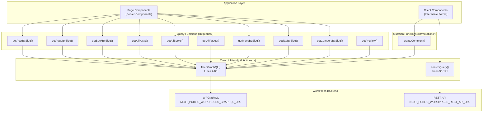
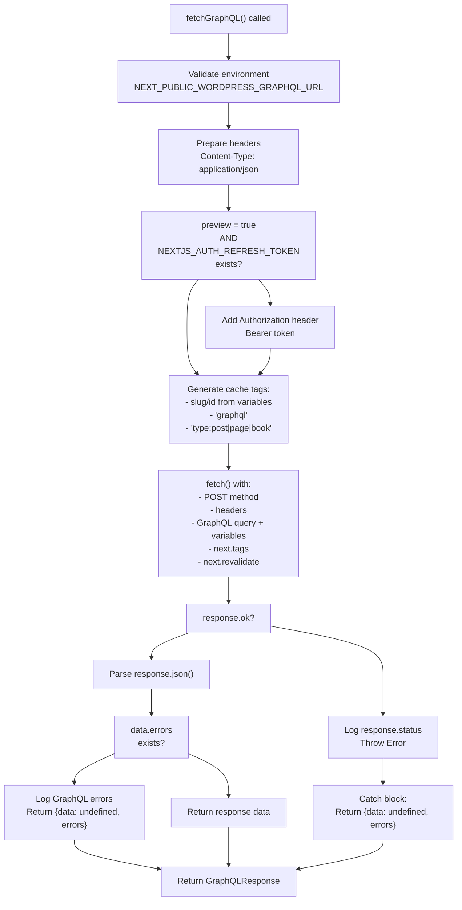
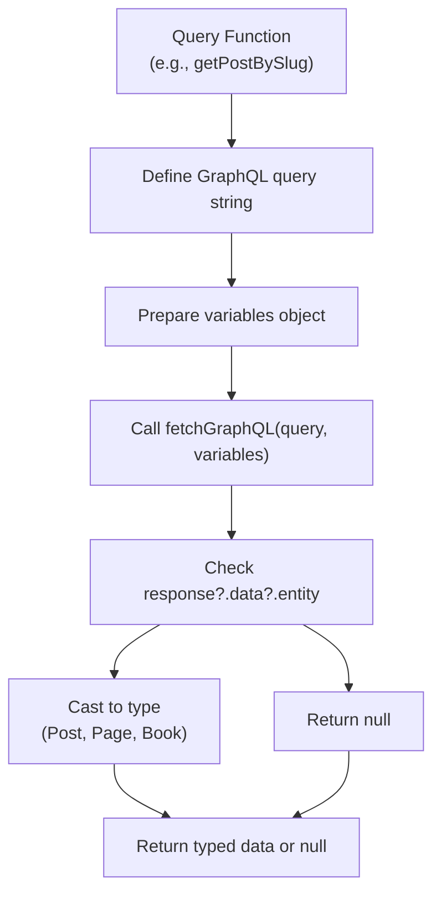
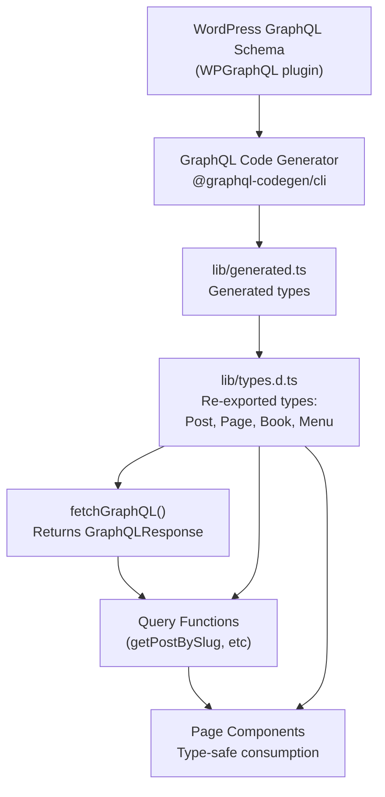

---
layout: default
title: Data Access Layer
nav_order: 6
has_children: true
---

# Data Access Layer

> **Relevant source files**
> * [lib/functions.ts](https://github.com/gregrickaby/nextjs-wordpress/blob/63f3f2f5/lib/functions.ts)
> * [lib/mutations/createComment.test.ts](https://github.com/gregrickaby/nextjs-wordpress/blob/63f3f2f5/lib/mutations/createComment.test.ts)
> * [lib/queries/getAllBooks.test.ts](https://github.com/gregrickaby/nextjs-wordpress/blob/63f3f2f5/lib/queries/getAllBooks.test.ts)
> * [lib/queries/getAllBooks.ts](https://github.com/gregrickaby/nextjs-wordpress/blob/63f3f2f5/lib/queries/getAllBooks.ts)
> * [lib/queries/getAllPages.test.ts](https://github.com/gregrickaby/nextjs-wordpress/blob/63f3f2f5/lib/queries/getAllPages.test.ts)
> * [lib/queries/getAllPosts.ts](https://github.com/gregrickaby/nextjs-wordpress/blob/63f3f2f5/lib/queries/getAllPosts.ts)
> * [lib/queries/getBookBySlug.test.ts](https://github.com/gregrickaby/nextjs-wordpress/blob/63f3f2f5/lib/queries/getBookBySlug.test.ts)
> * [lib/queries/getBookBySlug.ts](https://github.com/gregrickaby/nextjs-wordpress/blob/63f3f2f5/lib/queries/getBookBySlug.ts)
> * [lib/queries/getCategoryBySlug.test.ts](https://github.com/gregrickaby/nextjs-wordpress/blob/63f3f2f5/lib/queries/getCategoryBySlug.test.ts)
> * [lib/queries/getPageBySlug.test.ts](https://github.com/gregrickaby/nextjs-wordpress/blob/63f3f2f5/lib/queries/getPageBySlug.test.ts)
> * [lib/queries/getPageBySlug.ts](https://github.com/gregrickaby/nextjs-wordpress/blob/63f3f2f5/lib/queries/getPageBySlug.ts)
> * [lib/queries/getPostBySlug.ts](https://github.com/gregrickaby/nextjs-wordpress/blob/63f3f2f5/lib/queries/getPostBySlug.ts)
> * [lib/queries/getPreview.test.ts](https://github.com/gregrickaby/nextjs-wordpress/blob/63f3f2f5/lib/queries/getPreview.test.ts)
> * [lib/queries/getTagBySlug.test.ts](https://github.com/gregrickaby/nextjs-wordpress/blob/63f3f2f5/lib/queries/getTagBySlug.test.ts)
> * [lib/types.d.ts](https://github.com/gregrickaby/nextjs-wordpress/blob/63f3f2f5/lib/types.d.ts)

## Purpose and Scope

The Data Access Layer provides a centralized, type-safe interface for fetching and mutating WordPress content through GraphQL and REST APIs. This layer abstracts the complexity of API communication, caching, authentication, and error handling, exposing simple query and mutation functions to the application.

For details on how GraphQL types are generated from the WordPress schema, see [Type System](/gregrickaby/nextjs-wordpress/3.1-type-system). For documentation of individual query functions and their parameters, see [GraphQL Queries](/gregrickaby/nextjs-wordpress/5.1-graphql-queries) and [GraphQL Mutations](/gregrickaby/nextjs-wordpress/5.2-graphql-mutations). For the core `fetchGraphQL` implementation details, see [fetchGraphQL Utility](/gregrickaby/nextjs-wordpress/5.3-fetchgraphql-utility).

**Sources:** Diagram 3 and 5 from system architecture overview

---

## Architecture Overview

The data access layer consists of three primary components: the core `fetchGraphQL` utility that handles all GraphQL communication, a set of specialized query and mutation functions, and a separate REST API search interface.

**Data Access Layer Architecture**



**Sources:** [lib/functions.ts L1-L142](https://github.com/gregrickaby/nextjs-wordpress/blob/63f3f2f5/lib/functions.ts#L1-L142)

 [lib/queries/getPostBySlug.ts L1-L84](https://github.com/gregrickaby/nextjs-wordpress/blob/63f3f2f5/lib/queries/getPostBySlug.ts#L1-L84)

 [lib/queries/getPageBySlug.ts L1-L54](https://github.com/gregrickaby/nextjs-wordpress/blob/63f3f2f5/lib/queries/getPageBySlug.ts#L1-L54)

 [lib/queries/getBookBySlug.ts L1-L50](https://github.com/gregrickaby/nextjs-wordpress/blob/63f3f2f5/lib/queries/getBookBySlug.ts#L1-L50)

---

## Core Data Fetching

### The fetchGraphQL Function

The `fetchGraphQL` function in [lib/functions.ts L7-L88](https://github.com/gregrickaby/nextjs-wordpress/blob/63f3f2f5/lib/functions.ts#L7-L88)

 is the singular point of communication with the WordPress GraphQL endpoint. All query and mutation functions route through this utility, which provides:

* **Environment validation**: Verifies `NEXT_PUBLIC_WORDPRESS_GRAPHQL_URL` is configured
* **Authentication**: Conditionally includes JWT bearer token for preview mode
* **Cache tagging**: Applies hierarchical cache tags (slug-specific, content-type, and global)
* **Revalidation**: Configures Next.js ISR revalidation interval
* **Error handling**: Gracefully handles HTTP errors and GraphQL errors
* **Type safety**: Generic type parameter for typed responses

**Function Signature**

```javascript
async function fetchGraphQL<T = any>(
  query: string,
  variables?: {[key: string]: any},
  preview = false
): Promise<GraphQLResponse<T>>
```

**Sources:** [lib/functions.ts L7-L88](https://github.com/gregrickaby/nextjs-wordpress/blob/63f3f2f5/lib/functions.ts#L7-L88)

 [lib/types.d.ts L23-L26](https://github.com/gregrickaby/nextjs-wordpress/blob/63f3f2f5/lib/types.d.ts#L23-L26)

### Request Flow

**fetchGraphQL Request Processing**



**Sources:** [lib/functions.ts L7-L88](https://github.com/gregrickaby/nextjs-wordpress/blob/63f3f2f5/lib/functions.ts#L7-L88)

### Cache Tagging Strategy

The function implements a three-tier cache tagging strategy at [lib/functions.ts L33-L55](https://github.com/gregrickaby/nextjs-wordpress/blob/63f3f2f5/lib/functions.ts#L33-L55)

:

| Tag Type | Example | Purpose | Revalidation Scope |
| --- | --- | --- | --- |
| **Slug-specific** | `about`, `hello-world`, `my-book` | Granular invalidation of specific content | Single item |
| **Content type** | `type:post`, `type:page`, `type:book` | Invalidate all items of a type | All posts/pages/books |
| **Global** | `graphql` | Invalidate all GraphQL data | Entire data layer |

The content type is inferred by detecting keywords in the GraphQL query string (`posts`, `pages`, `books`).

**Sources:** [lib/functions.ts L33-L55](https://github.com/gregrickaby/nextjs-wordpress/blob/63f3f2f5/lib/functions.ts#L33-L55)

### Authentication for Preview Mode

When `preview = true` and `NEXTJS_AUTH_REFRESH_TOKEN` is configured, the function adds a JWT bearer token to the request headers at [lib/functions.ts L28-L31](https://github.com/gregrickaby/nextjs-wordpress/blob/63f3f2f5/lib/functions.ts#L28-L31)

 This allows fetching draft/private content from WordPress.

**Sources:** [lib/functions.ts L19-L31](https://github.com/gregrickaby/nextjs-wordpress/blob/63f3f2f5/lib/functions.ts#L19-L31)

### Error Handling

The function provides graceful error handling at multiple levels:

1. **Environment validation** [lib/functions.ts L14-L17](https://github.com/gregrickaby/nextjs-wordpress/blob/63f3f2f5/lib/functions.ts#L14-L17) : Returns error response if GraphQL URL is missing
2. **HTTP errors** [lib/functions.ts L59-L62](https://github.com/gregrickaby/nextjs-wordpress/blob/63f3f2f5/lib/functions.ts#L59-L62) : Logs status and returns error response
3. **GraphQL errors** [lib/functions.ts L68-L74](https://github.com/gregrickaby/nextjs-wordpress/blob/63f3f2f5/lib/functions.ts#L68-L74) : Logs errors and returns them in response structure
4. **Network exceptions** [lib/functions.ts L78-L87](https://github.com/gregrickaby/nextjs-wordpress/blob/63f3f2f5/lib/functions.ts#L78-L87) : Catches all errors and returns formatted error response

All error paths return a `GraphQLResponse` with `data: undefined` and an `errors` array, never throwing exceptions. This allows calling code to handle errors gracefully.

**Sources:** [lib/functions.ts L12-L88](https://github.com/gregrickaby/nextjs-wordpress/blob/63f3f2f5/lib/functions.ts#L12-L88)

---

## Query Functions

Query functions in the `lib/queries/` directory provide specialized interfaces for fetching different types of WordPress content. Each function constructs a GraphQL query, calls `fetchGraphQL`, and returns typed data or null.

### Query Function Pattern

All query functions follow a consistent pattern:

**Common Query Function Structure**



**Sources:** [lib/queries/getPostBySlug.ts L1-L84](https://github.com/gregrickaby/nextjs-wordpress/blob/63f3f2f5/lib/queries/getPostBySlug.ts#L1-L84)

 [lib/queries/getPageBySlug.ts L1-L54](https://github.com/gregrickaby/nextjs-wordpress/blob/63f3f2f5/lib/queries/getPageBySlug.ts#L1-L54)

 [lib/queries/getBookBySlug.ts L1-L50](https://github.com/gregrickaby/nextjs-wordpress/blob/63f3f2f5/lib/queries/getBookBySlug.ts#L1-L50)

### Query Function Inventory

| Function | File | Purpose | Return Type |
| --- | --- | --- | --- |
| `getPostBySlug()` | [lib/queries/getPostBySlug.ts](https://github.com/gregrickaby/nextjs-wordpress/blob/63f3f2f5/lib/queries/getPostBySlug.ts) | Fetch single blog post with comments | `Post \| null` |
| `getPageBySlug()` | [lib/queries/getPageBySlug.ts](https://github.com/gregrickaby/nextjs-wordpress/blob/63f3f2f5/lib/queries/getPageBySlug.ts) | Fetch single page | `Page \| null` |
| `getBookBySlug()` | [lib/queries/getBookBySlug.ts](https://github.com/gregrickaby/nextjs-wordpress/blob/63f3f2f5/lib/queries/getBookBySlug.ts) | Fetch single book with custom fields | `Book \| null` |
| `getAllPosts()` | [lib/queries/getAllPosts.ts](https://github.com/gregrickaby/nextjs-wordpress/blob/63f3f2f5/lib/queries/getAllPosts.ts) | Fetch all published posts | `Post[]` |
| `getAllBooks()` | [lib/queries/getAllBooks.ts](https://github.com/gregrickaby/nextjs-wordpress/blob/63f3f2f5/lib/queries/getAllBooks.ts) | Fetch all published books | `Post[]` |
| `getAllPages()` | Referenced in tests | Fetch all published pages | `Page[]` |
| `getMenuBySlug()` | Referenced in diagrams | Fetch navigation menu | `Menu \| null` |
| `getTagBySlug()` | Referenced in tests | Fetch posts by tag | `Post[]` |
| `getCategoryBySlug()` | Referenced in tests | Fetch posts by category | `Post[]` |
| `getPreview()` | Referenced in tests | Fetch draft content (authenticated) | `Post` |

**Sources:** [lib/queries/getPostBySlug.ts L7-L83](https://github.com/gregrickaby/nextjs-wordpress/blob/63f3f2f5/lib/queries/getPostBySlug.ts#L7-L83)

 [lib/queries/getAllPosts.ts L7-L45](https://github.com/gregrickaby/nextjs-wordpress/blob/63f3f2f5/lib/queries/getAllPosts.ts#L7-L45)

 [lib/queries/getBookBySlug.ts L7-L49](https://github.com/gregrickaby/nextjs-wordpress/blob/63f3f2f5/lib/queries/getBookBySlug.ts#L7-L49)

### Single Entity Queries

Functions like `getPostBySlug`, `getPageBySlug`, and `getBookBySlug` fetch individual content items by slug. They include comprehensive field selections:

**Fields Fetched by getPostBySlug**

* Core fields: `databaseId`, `date`, `modified`, `content`, `title`
* Media: `featuredImage` with `altText`, `sourceUrl`, `mediaDetails`
* Author: `name`, `avatar.url`
* Taxonomy: `tags.nodes`, `categories.nodes`
* SEO: `metaDesc`, `title` (via Yoast)
* Comments: First 30 comments with author details

**Example Usage**

```javascript
const post = await getPostBySlug('hello-world')
if (post) {
  console.log(post.title) // Type-safe access
  console.log(post.author?.node?.name)
}
```

**Sources:** [lib/queries/getPostBySlug.ts L8-L76](https://github.com/gregrickaby/nextjs-wordpress/blob/63f3f2f5/lib/queries/getPostBySlug.ts#L8-L76)

### Collection Queries

Functions like `getAllPosts` and `getAllBooks` fetch arrays of content. They query `nodes` arrays without pagination, fetching all published items:

**Example: getAllPosts Query Structure**

```
query GetAllPosts {
  posts(where: {status: PUBLISH}) {
    nodes {
      commentCount
      databaseId
      date
      modified
      title
      slug
      excerpt(format: RENDERED)
      featuredImage { ... }
      seo { ... }
    }
  }
}
```

These functions return empty arrays on error rather than null, ensuring safe iteration.

**Sources:** [lib/queries/getAllPosts.ts L8-L38](https://github.com/gregrickaby/nextjs-wordpress/blob/63f3f2f5/lib/queries/getAllPosts.ts#L8-L38)

 [lib/queries/getAllBooks.ts L8-L35](https://github.com/gregrickaby/nextjs-wordpress/blob/63f3f2f5/lib/queries/getAllBooks.ts#L8-L35)

### Taxonomy Queries

`getTagBySlug` and `getCategoryBySlug` filter posts by taxonomy terms. They accept an optional `limit` parameter (default: 10):

```javascript
// Fetch posts with specific tag
const posts = await getTagBySlug('javascript', 20)

// Fetch posts in category
const posts = await getCategoryBySlug('tutorials')
```

**Sources:** Referenced in [lib/queries/getTagBySlug.test.ts L44-L49](https://github.com/gregrickaby/nextjs-wordpress/blob/63f3f2f5/lib/queries/getTagBySlug.test.ts#L44-L49)

 [lib/queries/getCategoryBySlug.test.ts L44-L49](https://github.com/gregrickaby/nextjs-wordpress/blob/63f3f2f5/lib/queries/getCategoryBySlug.test.ts#L44-L49)

---

## Mutation Functions

Mutation functions in `lib/mutations/` directory handle content creation and updates. Currently, the codebase implements comment creation.

### createComment Function

The `createComment` function submits user comments to WordPress via GraphQL mutation. It is called from client components where users submit comment forms.

**Function Interface**

```javascript
async function createComment(data: {
  name: string
  email: string
  website?: string
  comment: string
  postID: string
})
```

**GraphQL Mutation**

The function constructs a `createComment` mutation with these variables:

* `authorName`: Comment author's name
* `authorEmail`: Author's email address
* `authorUrl`: Author's website (optional)
* `comment`: Comment text content
* `postID`: Database ID of the post being commented on

The mutation returns the created comment with author details and content, or throws an error if creation fails.

**Sources:** Referenced in [lib/mutations/createComment.test.ts L6-L12](https://github.com/gregrickaby/nextjs-wordpress/blob/63f3f2f5/lib/mutations/createComment.test.ts#L6-L12)

---

## Search Functionality

### searchQuery Function

The `searchQuery` function at [lib/functions.ts L95-L141](https://github.com/gregrickaby/nextjs-wordpress/blob/63f3f2f5/lib/functions.ts#L95-L141)

 provides search capabilities via the WordPress REST API instead of GraphQL. This is because WordPress's native search is more mature and performant through the REST API.

**Function Signature**

```javascript
async function searchQuery(query: string): Promise<SearchResults[]>
```

**SearchResults Type**

```yaml
interface SearchResults {
  id: number
  title: string
  url: string
  type: string      // 'post' | 'page' | etc.
  subtype: string   // post type details
}
```

**Sources:** [lib/functions.ts L95-L141](https://github.com/gregrickaby/nextjs-wordpress/blob/63f3f2f5/lib/functions.ts#L95-L141)

 [lib/types.d.ts L11-L17](https://github.com/gregrickaby/nextjs-wordpress/blob/63f3f2f5/lib/types.d.ts#L11-L17)

### Search Implementation Details

The function implements the following behavior:

1. **Query sanitization** [lib/functions.ts L97](https://github.com/gregrickaby/nextjs-wordpress/blob/63f3f2f5/lib/functions.ts#L97-L97) : URL-encodes and trims the search query
2. **Environment validation** [lib/functions.ts L101-L104](https://github.com/gregrickaby/nextjs-wordpress/blob/63f3f2f5/lib/functions.ts#L101-L104) : Checks for `NEXT_PUBLIC_WORDPRESS_REST_API_URL`
3. **Endpoint construction**: Calls `/wp-json/wp/v2/search` with parameters: * `search`: The search query * `subtype=any`: Search all post types * `per_page=100`: Return up to 100 results
4. **Cache tagging** [lib/functions.ts L115-L117](https://github.com/gregrickaby/nextjs-wordpress/blob/63f3f2f5/lib/functions.ts#L115-L117) : Tags with `search-${query}` for invalidation
5. **Error handling**: Returns empty array on any error, never throws

**REST API Endpoint Used**

```
${WORDPRESS_REST_API_URL}/search?search=${query}&subtype=any&per_page=100
```

**Sources:** [lib/functions.ts L95-L141](https://github.com/gregrickaby/nextjs-wordpress/blob/63f3f2f5/lib/functions.ts#L95-L141)

### Search vs GraphQL Decision

| Aspect | GraphQL (fetchGraphQL) | REST API (searchQuery) |
| --- | --- | --- |
| **Use case** | Structured content queries | Full-text search |
| **Endpoint** | WPGraphQL plugin | WordPress core REST API |
| **Performance** | Optimized for specific fields | Optimized for search indexing |
| **Caching** | Hierarchical cache tags | Search-specific tags |
| **Authentication** | Supports JWT for previews | Public only |

**Sources:** [lib/functions.ts L7-L141](https://github.com/gregrickaby/nextjs-wordpress/blob/63f3f2f5/lib/functions.ts#L7-L141)

---

## Type Safety Integration

### GraphQL Response Types

The data access layer integrates with the type system through the `GraphQLResponse` interface at [lib/types.d.ts L23-L26](https://github.com/gregrickaby/nextjs-wordpress/blob/63f3f2f5/lib/types.d.ts#L23-L26)

:

```
interface GraphQLResponse<T = any> {
  data?: T
  errors?: Array<{message: string}>
}
```

This interface ensures:

* **Nullable data**: `data` is optional, present only on successful queries
* **Error array**: `errors` contains GraphQL error messages
* **Generic type parameter**: `T` specifies the expected data structure

**Sources:** [lib/types.d.ts L23-L26](https://github.com/gregrickaby/nextjs-wordpress/blob/63f3f2f5/lib/types.d.ts#L23-L26)

### WordPress Entity Types

Query functions return typed WordPress entities imported from `lib/types.d.ts`, which re-exports types from the generated file:

```javascript
// Re-exports from lib/generated.ts
export type {Book, Menu, Page, Post} from './generated'
```

These types are automatically generated by GraphQL Code Generator from the WordPress schema, ensuring the data access layer always matches the backend schema.

**Sources:** [lib/types.d.ts L1-L2](https://github.com/gregrickaby/nextjs-wordpress/blob/63f3f2f5/lib/types.d.ts#L1-L2)

### Type Flow Through Layers

**Type Safety Flow**



**Sources:** [lib/types.d.ts L1-L27](https://github.com/gregrickaby/nextjs-wordpress/blob/63f3f2f5/lib/types.d.ts#L1-L27)

 Diagram 4 from system architecture

---

## Error Handling Patterns

### Graceful Degradation

The data access layer prioritizes graceful degradation over throwing exceptions:

**Error Handling Strategy by Function Type**

| Function Category | Error Behavior | Return Value | Rationale |
| --- | --- | --- | --- |
| **fetchGraphQL** | Returns `{data: undefined, errors: [...]}` | `GraphQLResponse<T>` | Allows caller to decide handling |
| **Single entity queries** | Returns `null` | `Entity \| null` | Indicates "not found" clearly |
| **Collection queries** | Returns `[]` | `Entity[]` | Safe for iteration, empty = none found |
| **searchQuery** | Returns `[]` | `SearchResults[]` | Search errors shouldn't break UI |

**Sources:** [lib/functions.ts L78-L87](https://github.com/gregrickaby/nextjs-wordpress/blob/63f3f2f5/lib/functions.ts#L78-L87)

 [lib/queries/getPostBySlug.ts L78-L80](https://github.com/gregrickaby/nextjs-wordpress/blob/63f3f2f5/lib/queries/getPostBySlug.ts#L78-L80)

 [lib/queries/getAllPosts.ts L40-L42](https://github.com/gregrickaby/nextjs-wordpress/blob/63f3f2f5/lib/queries/getAllPosts.ts#L40-L42)

### Error Logging

All error conditions are logged to the console for debugging:

* **fetchGraphQL** [lib/functions.ts L60-L79](https://github.com/gregrickaby/nextjs-wordpress/blob/63f3f2f5/lib/functions.ts#L60-L79) : Logs response status, GraphQL errors, and fetch errors
* **searchQuery** [lib/functions.ts L103-L138](https://github.com/gregrickaby/nextjs-wordpress/blob/63f3f2f5/lib/functions.ts#L103-L138) : Logs missing config, bad responses, and fetch errors

This provides visibility into data access issues during development while maintaining runtime stability.

**Sources:** [lib/functions.ts L60-L79](https://github.com/gregrickaby/nextjs-wordpress/blob/63f3f2f5/lib/functions.ts#L60-L79)

 [lib/functions.ts L103-L138](https://github.com/gregrickaby/nextjs-wordpress/blob/63f3f2f5/lib/functions.ts#L103-L138)

---

## Revalidation Configuration

All data fetching functions use the same revalidation interval, configured in `lib/config` and applied through the `next.revalidate` option:

```yaml
next: {
  tags: [slug, 'graphql', `type:${contentType}`],
  revalidate: config.revalidate  // ISR interval
}
```

This enables Incremental Static Regeneration (ISR), where cached data automatically refreshes after the specified interval. The revalidation can also be triggered on-demand via the `/api/revalidate` endpoint.

For details on how revalidation works and webhook configuration, see [Caching and Revalidation](/gregrickaby/nextjs-wordpress/3.3-caching-and-revalidation) and [On-Demand Revalidation](/gregrickaby/nextjs-wordpress/6.3-on-demand-revalidation).

**Sources:** [lib/functions.ts L52-L55](https://github.com/gregrickaby/nextjs-wordpress/blob/63f3f2f5/lib/functions.ts#L52-L55)

 [lib/functions.ts L114-L117](https://github.com/gregrickaby/nextjs-wordpress/blob/63f3f2f5/lib/functions.ts#L114-L117)