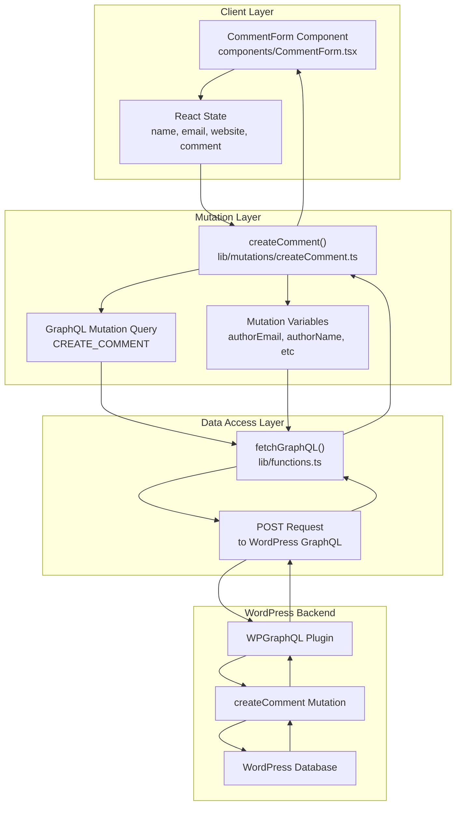
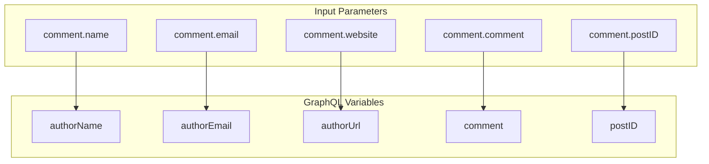
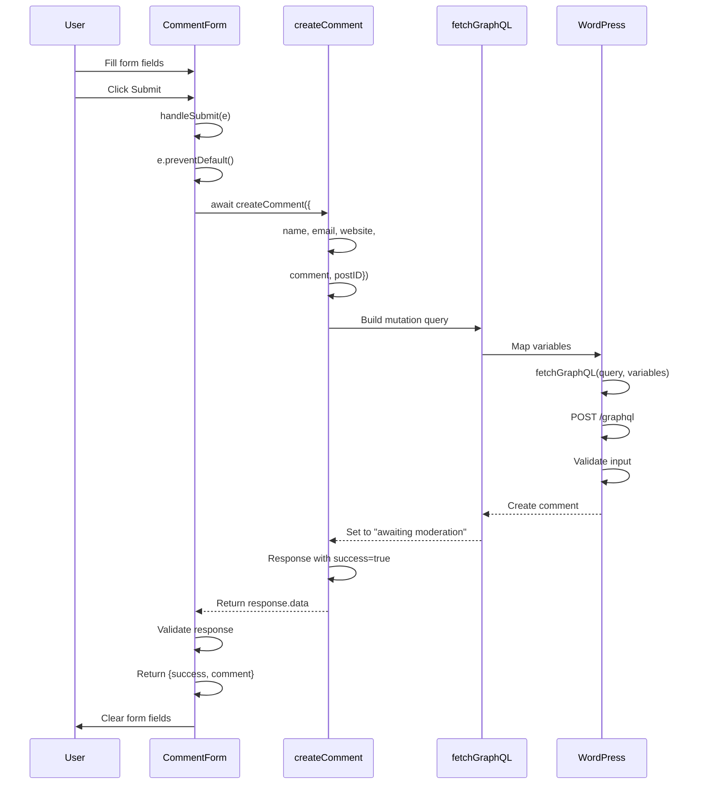
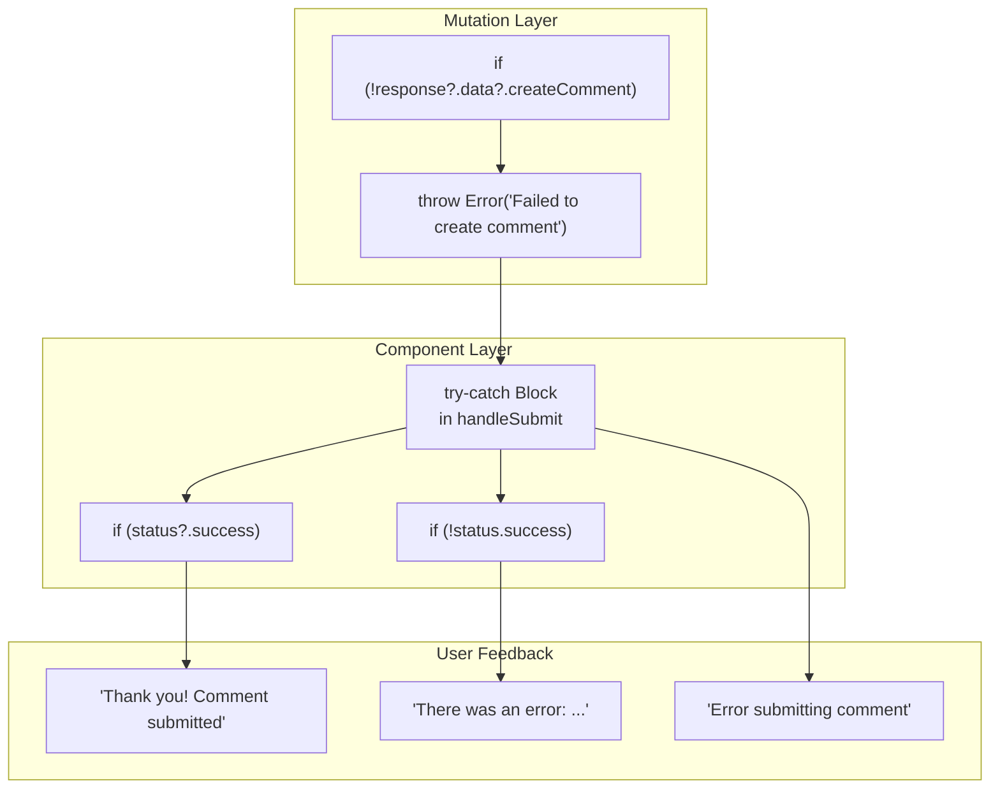

---
layout: default
title: GraphQL Mutations
parent: Data Access Layer
nav_order: 2
---

# GraphQL Mutations

> **Relevant source files**
> * app/blog/[slug]/page.tsx
> * app/books/[slug]/page.tsx
> * [app/layout.tsx](https://github.com/gregrickaby/nextjs-wordpress/blob/63f3f2f5/app/layout.tsx)
> * [components/CommentForm.test.tsx](https://github.com/gregrickaby/nextjs-wordpress/blob/63f3f2f5/components/CommentForm.test.tsx)
> * [components/CommentForm.tsx](https://github.com/gregrickaby/nextjs-wordpress/blob/63f3f2f5/components/CommentForm.tsx)
> * [components/Footer.test.tsx](https://github.com/gregrickaby/nextjs-wordpress/blob/63f3f2f5/components/Footer.test.tsx)
> * [components/Footer.tsx](https://github.com/gregrickaby/nextjs-wordpress/blob/63f3f2f5/components/Footer.tsx)
> * [components/Header.test.tsx](https://github.com/gregrickaby/nextjs-wordpress/blob/63f3f2f5/components/Header.test.tsx)
> * [components/Header.tsx](https://github.com/gregrickaby/nextjs-wordpress/blob/63f3f2f5/components/Header.tsx)
> * [components/SearchForm.test.tsx](https://github.com/gregrickaby/nextjs-wordpress/blob/63f3f2f5/components/SearchForm.test.tsx)
> * [lib/functions.test.ts](https://github.com/gregrickaby/nextjs-wordpress/blob/63f3f2f5/lib/functions.test.ts)
> * [lib/mutations/createComment.test.ts](https://github.com/gregrickaby/nextjs-wordpress/blob/63f3f2f5/lib/mutations/createComment.test.ts)
> * [lib/mutations/createComment.ts](https://github.com/gregrickaby/nextjs-wordpress/blob/63f3f2f5/lib/mutations/createComment.ts)
> * [lib/queries/getAllBooks.test.ts](https://github.com/gregrickaby/nextjs-wordpress/blob/63f3f2f5/lib/queries/getAllBooks.test.ts)
> * [lib/queries/getAllPages.test.ts](https://github.com/gregrickaby/nextjs-wordpress/blob/63f3f2f5/lib/queries/getAllPages.test.ts)
> * [lib/queries/getAllPosts.test.ts](https://github.com/gregrickaby/nextjs-wordpress/blob/63f3f2f5/lib/queries/getAllPosts.test.ts)
> * [lib/queries/getBookBySlug.test.ts](https://github.com/gregrickaby/nextjs-wordpress/blob/63f3f2f5/lib/queries/getBookBySlug.test.ts)
> * [lib/queries/getCategoryBySlug.test.ts](https://github.com/gregrickaby/nextjs-wordpress/blob/63f3f2f5/lib/queries/getCategoryBySlug.test.ts)
> * [lib/queries/getPageBySlug.test.ts](https://github.com/gregrickaby/nextjs-wordpress/blob/63f3f2f5/lib/queries/getPageBySlug.test.ts)
> * [lib/queries/getPostBySlug.test.ts](https://github.com/gregrickaby/nextjs-wordpress/blob/63f3f2f5/lib/queries/getPostBySlug.test.ts)
> * [lib/queries/getPreview.test.ts](https://github.com/gregrickaby/nextjs-wordpress/blob/63f3f2f5/lib/queries/getPreview.test.ts)
> * [lib/queries/getTagBySlug.test.ts](https://github.com/gregrickaby/nextjs-wordpress/blob/63f3f2f5/lib/queries/getTagBySlug.test.ts)
> * [next.config.ts](https://github.com/gregrickaby/nextjs-wordpress/blob/63f3f2f5/next.config.ts)
> * [test-utils/domShims.ts](https://github.com/gregrickaby/nextjs-wordpress/blob/63f3f2f5/test-utils/domShims.ts)
> * [vitest.config.ts](https://github.com/gregrickaby/nextjs-wordpress/blob/63f3f2f5/vitest.config.ts)

This document covers GraphQL mutations in the application - operations that create or modify data in WordPress. Mutations are write operations that complement the read-only queries documented in [GraphQL Queries](/gregrickaby/nextjs-wordpress/5.1-graphql-queries). While queries fetch content from WordPress, mutations submit new data such as comments, ratings, or other user-generated content.

For information about the underlying `fetchGraphQL` utility that executes both queries and mutations, see [fetchGraphQL Utility](/gregrickaby/nextjs-wordpress/5.3-fetchgraphql-utility).

---

## Mutation Architecture

GraphQL mutations in this application follow a consistent architectural pattern that separates concerns between user interface, mutation functions, and the WordPress backend.

### System Components



**Sources:** [components/CommentForm.tsx L1-L109](https://github.com/gregrickaby/nextjs-wordpress/blob/63f3f2f5/components/CommentForm.tsx#L1-L109)

 [lib/mutations/createComment.ts L1-L64](https://github.com/gregrickaby/nextjs-wordpress/blob/63f3f2f5/lib/mutations/createComment.ts#L1-L64)

---

## Available Mutations

The application currently implements one GraphQL mutation for creating user-generated content.

### createComment Mutation

The `createComment` mutation submits a new comment to a WordPress post. It is the only mutation currently implemented in the codebase.

#### Function Signature

```javascript
async function createComment(comment: {
  name: string
  email: string
  website: string
  comment: string
  postID: string
})
```

**Location:** [lib/mutations/createComment.ts L6-L12](https://github.com/gregrickaby/nextjs-wordpress/blob/63f3f2f5/lib/mutations/createComment.ts#L6-L12)

#### Mutation Query

The function constructs a GraphQL mutation with the following structure:

| Parameter | Type | Description |
| --- | --- | --- |
| `authorEmail` | `String!` | Required. Commenter's email address |
| `authorName` | `String!` | Required. Commenter's display name |
| `authorUrl` | `String` | Optional. Commenter's website URL |
| `comment` | `String!` | Required. Comment content |
| `postID` | `Int!` | Required. Database ID of the post |

The mutation returns a response containing:

* `success` - Boolean indicating if comment was created
* `comment` - Object with author details, content, and date
* `author.node.avatar.url` - Gravatar URL for the commenter
* `author.node.email` - Commenter's email
* `author.node.name` - Commenter's name
* `content` - Rendered HTML content of the comment
* `date` - ISO 8601 timestamp of comment creation

**Sources:** [lib/mutations/createComment.ts L13-L47](https://github.com/gregrickaby/nextjs-wordpress/blob/63f3f2f5/lib/mutations/createComment.ts#L13-L47)

#### Variable Mapping



**Sources:** [lib/mutations/createComment.ts L49-L55](https://github.com/gregrickaby/nextjs-wordpress/blob/63f3f2f5/lib/mutations/createComment.ts#L49-L55)

#### Response Handling

The function validates the response and throws an error if the mutation fails:

```sql
if (!response?.data?.createComment) {
  throw new Error('Failed to create comment')
}

return response.data.createComment
```

**Source:** [lib/mutations/createComment.ts L59-L63](https://github.com/gregrickaby/nextjs-wordpress/blob/63f3f2f5/lib/mutations/createComment.ts#L59-L63)

---

## Mutation Flow

The complete flow from user interaction to WordPress database update follows a multi-stage process.

### Comment Creation Flow



**Sources:** [components/CommentForm.tsx L19-L58](https://github.com/gregrickaby/nextjs-wordpress/blob/63f3f2f5/components/CommentForm.tsx#L19-L58)

 [lib/mutations/createComment.ts L6-L64](https://github.com/gregrickaby/nextjs-wordpress/blob/63f3f2f5/lib/mutations/createComment.ts#L6-L64)

### State Management in CommentForm

The `CommentForm` component manages form state using React hooks:

| State Variable | Type | Purpose |
| --- | --- | --- |
| `name` | `string` | Commenter's name input |
| `email` | `string` | Commenter's email input |
| `website` | `string` | Commenter's website URL input |
| `comment` | `string` | Comment content textarea |
| `status` | `string` | Success/error message display |

**Source:** [components/CommentForm.tsx L10-L14](https://github.com/gregrickaby/nextjs-wordpress/blob/63f3f2f5/components/CommentForm.tsx#L10-L14)

### Form Submission Handler

The `handleSubmit` function coordinates the mutation execution:

1. Prevents default form submission
2. Wraps mutation call in try-catch block
3. Awaits `createComment` response
4. On success: clears form and displays success message
5. On failure: displays error message without clearing form

**Source:** [components/CommentForm.tsx L19-L58](https://github.com/gregrickaby/nextjs-wordpress/blob/63f3f2f5/components/CommentForm.tsx#L19-L58)

---

## Error Handling

Mutations implement multiple layers of error handling to provide graceful degradation and user feedback.

### Error Handling Layers



**Sources:** [components/CommentForm.tsx L19-L58](https://github.com/gregrickaby/nextjs-wordpress/blob/63f3f2f5/components/CommentForm.tsx#L19-L58)

 [lib/mutations/createComment.ts L59-L63](https://github.com/gregrickaby/nextjs-wordpress/blob/63f3f2f5/lib/mutations/createComment.ts#L59-L63)

### Error Scenarios

The mutation handles three distinct error scenarios:

#### 1. Network Errors

When the HTTP request to WordPress fails entirely:

```
catch (error) {
  console.error('Comment submission error:', error)
  setStatus('There was an error submitting your comment. Please try again later.')
}
```

**Source:** [components/CommentForm.tsx L52-L57](https://github.com/gregrickaby/nextjs-wordpress/blob/63f3f2f5/components/CommentForm.tsx#L52-L57)

#### 2. GraphQL Errors

When WordPress returns a GraphQL error response, `fetchGraphQL` returns the error in the response object. The mutation function throws an error:

```sql
if (!response?.data?.createComment) {
  throw new Error('Failed to create comment')
}
```

**Source:** [lib/mutations/createComment.ts L59-L61](https://github.com/gregrickaby/nextjs-wordpress/blob/63f3f2f5/lib/mutations/createComment.ts#L59-L61)

#### 3. Business Logic Errors

When WordPress successfully receives the request but returns `success: false` (e.g., spam detection):

```
if (status && !status.success) {
  setStatus(`There was an error submitting your comment: ${status.message}`)
}
```

**Source:** [components/CommentForm.tsx L47-L50](https://github.com/gregrickaby/nextjs-wordpress/blob/63f3f2f5/components/CommentForm.tsx#L47-L50)

---

## Validation

The application implements validation at multiple levels to ensure data integrity.

### Client-Side Validation

HTML5 form validation attributes enforce basic constraints:

| Field | Validation Rules |
| --- | --- |
| Name | `required`, `type="text"` |
| Email | `required`, `type="email"`, `pattern="[a-z0-9._%+-]+@[a-z0-9.-]+\.[a-z]{2,4}$"` |
| Website | `required`, `type="url"` |
| Comment | `required`, `<textarea>` |

**Sources:** [components/CommentForm.tsx L66-L102](https://github.com/gregrickaby/nextjs-wordpress/blob/63f3f2f5/components/CommentForm.tsx#L66-L102)

### Server-Side Validation

WordPress performs additional validation:

* Email format verification
* Comment content spam checking
* Post existence verification (via `postID`)
* Rate limiting (WordPress native)

These validations occur within WordPress and the WPGraphQL plugin before the comment is created.

---

## Usage Example

To use the `createComment` mutation in a React component:

```javascript
import {createComment} from '@/lib/mutations/createComment'

async function handleCommentSubmit(formData) {
  try {
    const result = await createComment({
      name: formData.name,
      email: formData.email,
      website: formData.website,
      comment: formData.commentText,
      postID: postId.toString()
    })
    
    if (result.success) {
      // Handle success
    }
  } catch (error) {
    // Handle error
  }
}
```

The `CommentForm` component provides a complete implementation reference at [components/CommentForm.tsx L1-L109](https://github.com/gregrickaby/nextjs-wordpress/blob/63f3f2f5/components/CommentForm.tsx#L1-L109)

---

## Testing

Mutations are tested at both the function level and the component integration level.

### Mutation Function Tests

The `createComment` function has comprehensive unit tests covering:

| Test Scenario | Location |
| --- | --- |
| Successful comment creation | [lib/mutations/createComment.test.ts L14-L47](https://github.com/gregrickaby/nextjs-wordpress/blob/63f3f2f5/lib/mutations/createComment.test.ts#L14-L47) |
| Comment without website URL | [lib/mutations/createComment.test.ts L49-L82](https://github.com/gregrickaby/nextjs-wordpress/blob/63f3f2f5/lib/mutations/createComment.test.ts#L49-L82) |
| API error handling | [lib/mutations/createComment.test.ts L84-L101](https://github.com/gregrickaby/nextjs-wordpress/blob/63f3f2f5/lib/mutations/createComment.test.ts#L84-L101) |
| Network error handling | [lib/mutations/createComment.test.ts L103-L111](https://github.com/gregrickaby/nextjs-wordpress/blob/63f3f2f5/lib/mutations/createComment.test.ts#L103-L111) |
| Variable mapping verification | [lib/mutations/createComment.test.ts L113-L160](https://github.com/gregrickaby/nextjs-wordpress/blob/63f3f2f5/lib/mutations/createComment.test.ts#L113-L160) |

### Component Integration Tests

The `CommentForm` component tests verify end-to-end mutation flow:

| Test Scenario | Location |
| --- | --- |
| Form field rendering | [components/CommentForm.test.tsx L11-L18](https://github.com/gregrickaby/nextjs-wordpress/blob/63f3f2f5/components/CommentForm.test.tsx#L11-L18) |
| User input handling | [components/CommentForm.test.tsx L20-L34](https://github.com/gregrickaby/nextjs-wordpress/blob/63f3f2f5/components/CommentForm.test.tsx#L20-L34) |
| Successful submission | [components/CommentForm.test.tsx L36-L84](https://github.com/gregrickaby/nextjs-wordpress/blob/63f3f2f5/components/CommentForm.test.tsx#L36-L84) |
| Error message display | [components/CommentForm.test.tsx L86-L123](https://github.com/gregrickaby/nextjs-wordpress/blob/63f3f2f5/components/CommentForm.test.tsx#L86-L123) |
| Form clearing after success | [components/CommentForm.test.tsx L125-L178](https://github.com/gregrickaby/nextjs-wordpress/blob/63f3f2f5/components/CommentForm.test.tsx#L125-L178) |
| API error handling | [components/CommentForm.test.tsx L180-L215](https://github.com/gregrickaby/nextjs-wordpress/blob/63f3f2f5/components/CommentForm.test.tsx#L180-L215) |
| Field validation | [components/CommentForm.test.tsx L217-L249](https://github.com/gregrickaby/nextjs-wordpress/blob/63f3f2f5/components/CommentForm.test.tsx#L217-L249) |

### Mock Service Worker Setup

Tests use MSW (Mock Service Worker) to mock WordPress GraphQL responses:

```javascript
server.use(
  http.post(`${process.env.NEXT_PUBLIC_WORDPRESS_GRAPHQL_URL}`, async ({request}) => {
    const body = await request.json() as {query: string}
    
    if (body.query.includes('createComment')) {
      return HttpResponse.json({
        data: {
          createComment: {
            success: true,
            comment: { /* ... */ }
          }
        }
      })
    }
  })
)
```

**Source:** [components/CommentForm.test.tsx L37-L60](https://github.com/gregrickaby/nextjs-wordpress/blob/63f3f2f5/components/CommentForm.test.tsx#L37-L60)

---

## Adding New Mutations

To add a new mutation to the application, follow this pattern established by `createComment`:

### 1. Create Mutation Function

Create a new file in `lib/mutations/` following this structure:

```javascript
import {fetchGraphQL} from '@/lib/functions'

export async function mutationName(params: MutationParams) {
  const query = `
    mutation MUTATION_NAME($param1: Type!, $param2: Type!) {
      mutationName(input: {
        field1: $param1
        field2: $param2
      }) {
        success
        data {
          field1
          field2
        }
      }
    }
  `
  
  const variables = {
    param1: params.param1,
    param2: params.param2
  }
  
  const response = await fetchGraphQL(query, variables)
  
  if (!response?.data?.mutationName) {
    throw new Error('Failed to execute mutation')
  }
  
  return response.data.mutationName
}
```

### 2. Create Tests

Create a corresponding test file in `lib/mutations/` to verify mutation behavior.

### 3. Integrate in Components

Import and use the mutation in client components with proper error handling and user feedback.

**Pattern Sources:** [lib/mutations/createComment.ts L1-L64](https://github.com/gregrickaby/nextjs-wordpress/blob/63f3f2f5/lib/mutations/createComment.ts#L1-L64)

 [components/CommentForm.tsx L1-L109](https://github.com/gregrickaby/nextjs-wordpress/blob/63f3f2f5/components/CommentForm.tsx#L1-L109)

---

## Mutation vs Query Differences

Understanding the key differences between mutations and queries:

| Aspect | Queries (Page 5.1) | Mutations (Page 5.2) |
| --- | --- | --- |
| **Purpose** | Read data from WordPress | Create/update data in WordPress |
| **HTTP Method** | POST (GraphQL standard) | POST (GraphQL standard) |
| **Caching** | Cached with Next.js tags | Not cached |
| **Location** | `lib/queries/` | `lib/mutations/` |
| **Usage** | Server Components, static generation | Client Components, user interactions |
| **Return Type** | Content data (posts, pages, etc.) | Success status + created data |
| **Error Handling** | Returns `null` on error | Throws error or returns status object |

**Sources:** [lib/queries/](https://github.com/gregrickaby/nextjs-wordpress/blob/63f3f2f5/lib/queries/)

 [lib/mutations/createComment.ts L1-L64](https://github.com/gregrickaby/nextjs-wordpress/blob/63f3f2f5/lib/mutations/createComment.ts#L1-L64)

---

## Related Documentation

* **[GraphQL Queries](/gregrickaby/nextjs-wordpress/5.1-graphql-queries)** - Read operations for fetching WordPress content
* **[fetchGraphQL Utility](/gregrickaby/nextjs-wordpress/5.3-fetchgraphql-utility)** - Core function that executes both queries and mutations
* **[Components](/gregrickaby/nextjs-wordpress/4.2-components)** - React components including `CommentForm`
* **[Testing Infrastructure](/gregrickaby/nextjs-wordpress/8.1-testing-infrastructure)** - MSW setup and testing utilities