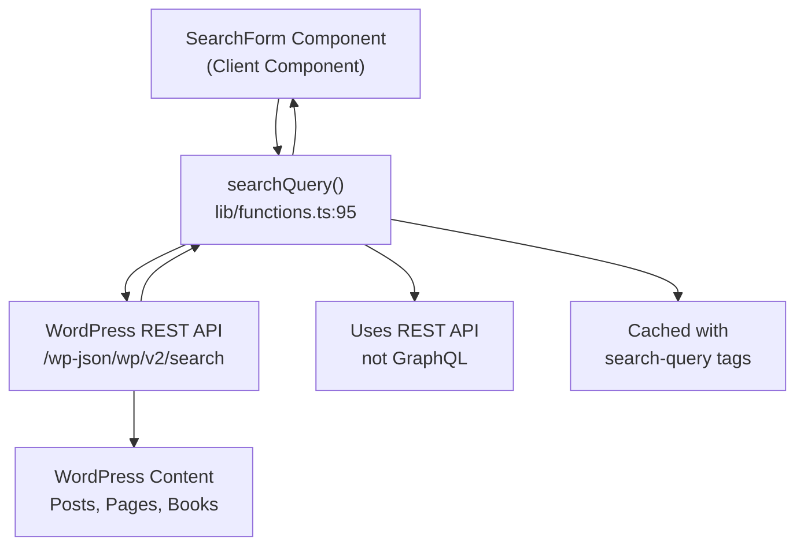
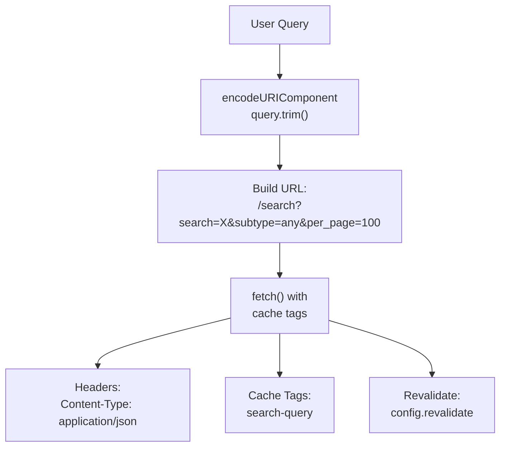
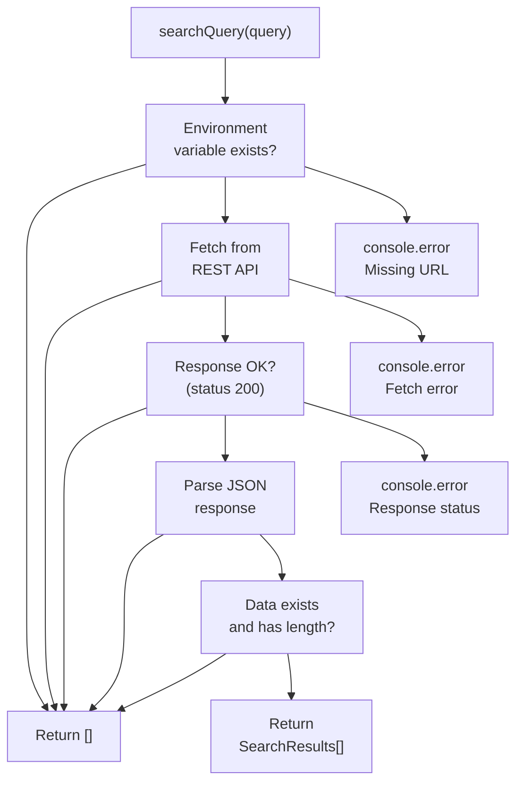
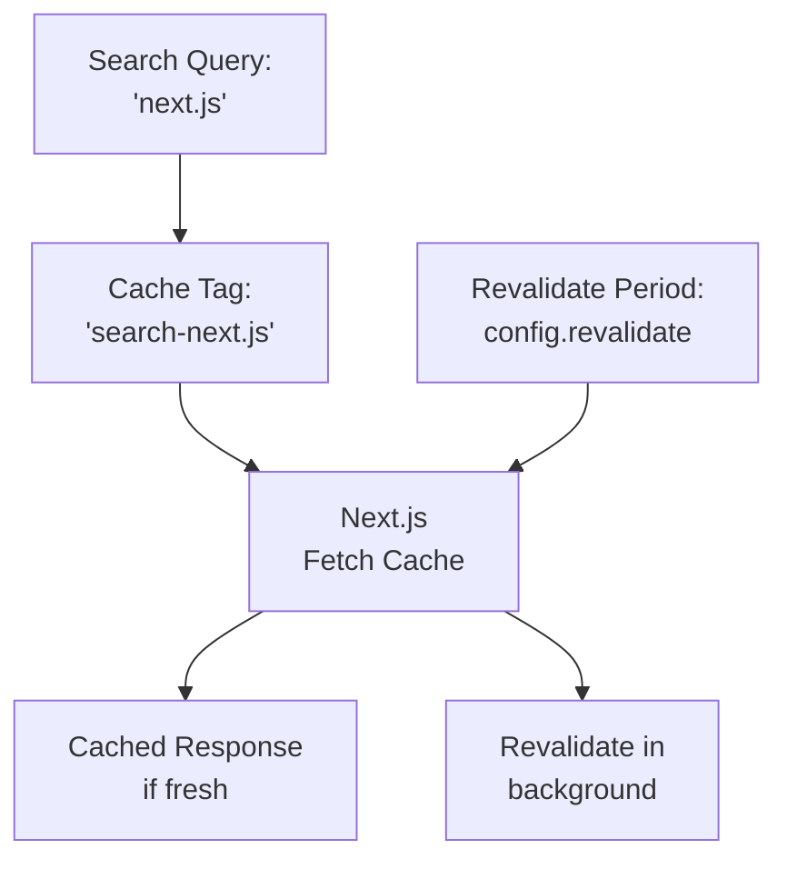
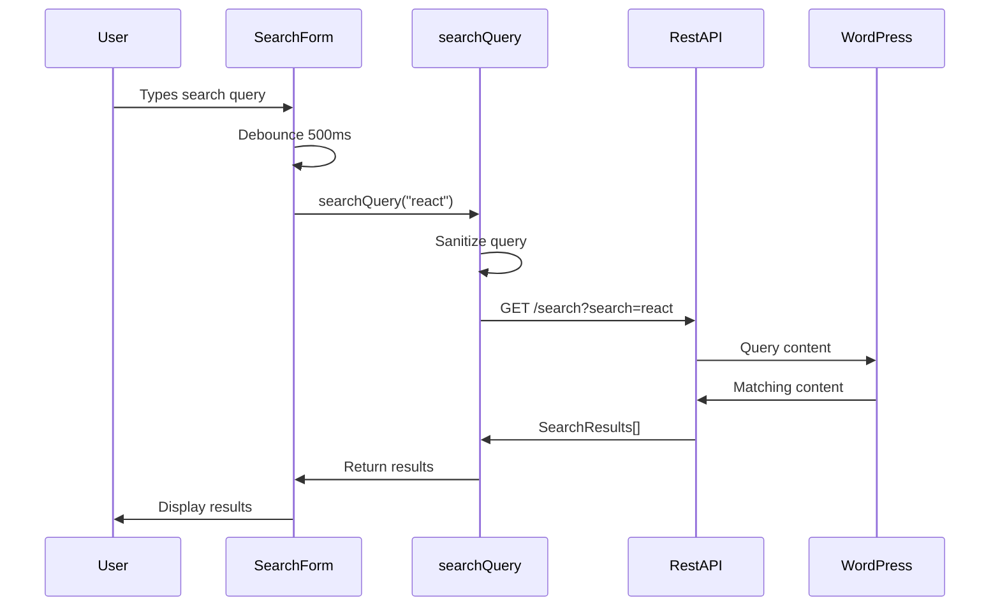

---
layout: default
title: Search Functionality
parent: Data Access Layer
nav_order: 4
---

# Search Functionality

> **Relevant source files**
> * [components/CommentForm.test.tsx](https://github.com/gregrickaby/nextjs-wordpress/blob/63f3f2f5/components/CommentForm.test.tsx)
> * [components/Footer.test.tsx](https://github.com/gregrickaby/nextjs-wordpress/blob/63f3f2f5/components/Footer.test.tsx)
> * [components/Header.test.tsx](https://github.com/gregrickaby/nextjs-wordpress/blob/63f3f2f5/components/Header.test.tsx)
> * [components/SearchForm.test.tsx](https://github.com/gregrickaby/nextjs-wordpress/blob/63f3f2f5/components/SearchForm.test.tsx)
> * [lib/functions.test.ts](https://github.com/gregrickaby/nextjs-wordpress/blob/63f3f2f5/lib/functions.test.ts)
> * [lib/functions.ts](https://github.com/gregrickaby/nextjs-wordpress/blob/63f3f2f5/lib/functions.ts)
> * [lib/queries/getAllBooks.ts](https://github.com/gregrickaby/nextjs-wordpress/blob/63f3f2f5/lib/queries/getAllBooks.ts)
> * [lib/queries/getAllPosts.test.ts](https://github.com/gregrickaby/nextjs-wordpress/blob/63f3f2f5/lib/queries/getAllPosts.test.ts)
> * [lib/queries/getAllPosts.ts](https://github.com/gregrickaby/nextjs-wordpress/blob/63f3f2f5/lib/queries/getAllPosts.ts)
> * [lib/queries/getBookBySlug.ts](https://github.com/gregrickaby/nextjs-wordpress/blob/63f3f2f5/lib/queries/getBookBySlug.ts)
> * [lib/queries/getPageBySlug.ts](https://github.com/gregrickaby/nextjs-wordpress/blob/63f3f2f5/lib/queries/getPageBySlug.ts)
> * [lib/queries/getPostBySlug.test.ts](https://github.com/gregrickaby/nextjs-wordpress/blob/63f3f2f5/lib/queries/getPostBySlug.test.ts)
> * [lib/queries/getPostBySlug.ts](https://github.com/gregrickaby/nextjs-wordpress/blob/63f3f2f5/lib/queries/getPostBySlug.ts)
> * [lib/types.d.ts](https://github.com/gregrickaby/nextjs-wordpress/blob/63f3f2f5/lib/types.d.ts)
> * [test-utils/domShims.ts](https://github.com/gregrickaby/nextjs-wordpress/blob/63f3f2f5/test-utils/domShims.ts)
> * [vitest.config.ts](https://github.com/gregrickaby/nextjs-wordpress/blob/63f3f2f5/vitest.config.ts)

## Purpose and Scope

This document describes the search functionality in the Next.js WordPress headless application, which enables users to query WordPress content via the WordPress REST API. This covers the `searchQuery` function, the `SearchResults` type definition, caching strategy, and error handling patterns.

For information about GraphQL-based content queries, see [GraphQL Queries](/gregrickaby/nextjs-wordpress/5.1-graphql-queries). For the client-side search form component, see [Components](/gregrickaby/nextjs-wordpress/4.2-components).

---

## Overview

The search functionality differs from other data access patterns in this application by using the WordPress REST API instead of GraphQL. This architectural decision leverages WordPress's mature REST API search endpoint (`/wp-json/wp/v2/search`) which provides comprehensive full-text search across multiple content types.

**Key Characteristics:**

* Uses WordPress REST API endpoint `/search`
* Returns up to 100 results per query
* Searches across all content types (`subtype=any`)
* Implements ISR caching with query-specific tags
* Gracefully handles errors by returning empty arrays
* URL-encodes and sanitizes all queries

Sources: [lib/functions.ts L90-L141](https://github.com/gregrickaby/nextjs-wordpress/blob/63f3f2f5/lib/functions.ts#L90-L141)

---

## Search Architecture

### REST API vs GraphQL

Unlike the GraphQL queries used for structured content retrieval (posts, pages, books), search functionality uses the WordPress REST API. This dual-API approach is shown in the system architecture diagrams.



Sources: [lib/functions.ts L95-L141](https://github.com/gregrickaby/nextjs-wordpress/blob/63f3f2f5/lib/functions.ts#L95-L141)

 [lib/types.d.ts L11-L17](https://github.com/gregrickaby/nextjs-wordpress/blob/63f3f2f5/lib/types.d.ts#L11-L17)

---

## The searchQuery Function

The `searchQuery` function is defined in [lib/functions.ts L95-L141](https://github.com/gregrickaby/nextjs-wordpress/blob/63f3f2f5/lib/functions.ts#L95-L141)

 and serves as the primary interface for searching WordPress content.

### Function Signature

```javascript
export async function searchQuery(query: string): Promise<SearchResults[]>
```

### Implementation Details

| Aspect | Implementation |
| --- | --- |
| **Location** | `lib/functions.ts` lines 95-141 |
| **Parameters** | `query: string` - The search term |
| **Return Type** | `Promise<SearchResults[]>` |
| **HTTP Method** | GET |
| **Endpoint** | `${WORDPRESS_REST_API_URL}/search` |
| **Query Parameters** | `search`, `subtype`, `per_page` |

### Query Sanitization

The function sanitizes user input before making the API request:

[lib/functions.ts L97](https://github.com/gregrickaby/nextjs-wordpress/blob/63f3f2f5/lib/functions.ts#L97-L97)

```
query = encodeURIComponent(query.trim())
```

This ensures:

* Leading/trailing whitespace is removed
* Special characters are properly URL-encoded
* The query is safe for inclusion in the URL

Sources: [lib/functions.ts L95-L97](https://github.com/gregrickaby/nextjs-wordpress/blob/63f3f2f5/lib/functions.ts#L95-L97)

### Request Configuration



The fetch request configuration in [lib/functions.ts L107-L118](https://github.com/gregrickaby/nextjs-wordpress/blob/63f3f2f5/lib/functions.ts#L107-L118)

:

```javascript
const response = await fetch(
  `${process.env.NEXT_PUBLIC_WORDPRESS_REST_API_URL}/search?search=${query}&subtype=any&per_page=100`,
  {
    method: 'GET',
    headers: {
      'Content-Type': 'application/json'
    },
    next: {
      tags: [`search-${query}`],
      revalidate: config.revalidate
    }
  }
)
```

**Query Parameters:**

* `search` - The encoded search term
* `subtype=any` - Search across all content types (posts, pages, books, etc.)
* `per_page=100` - Maximum 100 results per request

Sources: [lib/functions.ts L107-L118](https://github.com/gregrickaby/nextjs-wordpress/blob/63f3f2f5/lib/functions.ts#L107-L118)

---

## SearchResults Type

The `SearchResults` interface defines the structure of each search result returned by the WordPress REST API.

### Type Definition

[lib/types.d.ts L11-L17](https://github.com/gregrickaby/nextjs-wordpress/blob/63f3f2f5/lib/types.d.ts#L11-L17)

```typescript
export interface SearchResults {
  id: number
  title: string
  url: string
  type: string
  subtype: string
}
```

### Field Descriptions

| Field | Type | Description |
| --- | --- | --- |
| `id` | `number` | WordPress database ID of the content |
| `title` | `string` | Rendered title of the content |
| `url` | `string` | Full URL to the content |
| `type` | `string` | Content type (e.g., "post") |
| `subtype` | `string` | Content subtype (e.g., "post", "page", "book") |

### Example Response Data

```yaml
[
  {
    id: 42,
    title: "Getting Started with Next.js",
    url: "https://blog.nextjswp.com/getting-started",
    type: "post",
    subtype: "post"
  },
  {
    id: 17,
    title: "About Us",
    url: "https://blog.nextjswp.com/about",
    type: "post",
    subtype: "page"
  }
]
```

Sources: [lib/types.d.ts L11-L17](https://github.com/gregrickaby/nextjs-wordpress/blob/63f3f2f5/lib/types.d.ts#L11-L17)

 [lib/functions.test.ts L144-L159](https://github.com/gregrickaby/nextjs-wordpress/blob/63f3f2f5/lib/functions.test.ts#L144-L159)

---

## Error Handling Strategy

The `searchQuery` function implements a graceful degradation strategy where all errors result in an empty array return value, never throwing exceptions.



### Error Scenarios

**1. Missing Environment Variable**

[lib/functions.ts L100-L104](https://github.com/gregrickaby/nextjs-wordpress/blob/63f3f2f5/lib/functions.ts#L100-L104)

```
if (!process.env.NEXT_PUBLIC_WORDPRESS_REST_API_URL) {
  console.error('Missing WordPress REST API URL environment variable!')
  return []
}
```

**2. HTTP Error Response**

[lib/functions.ts L122-L125](https://github.com/gregrickaby/nextjs-wordpress/blob/63f3f2f5/lib/functions.ts#L122-L125)

```
if (!response.ok) {
  console.error('Search API Response Status:', response.status)
  return []
}
```

**3. Empty or Invalid Data**

[lib/functions.ts L131-L133](https://github.com/gregrickaby/nextjs-wordpress/blob/63f3f2f5/lib/functions.ts#L131-L133)

```
if (!data || data.length === 0) {
  return []
}
```

**4. Network or Runtime Errors**

[lib/functions.ts L137-L140](https://github.com/gregrickaby/nextjs-wordpress/blob/63f3f2f5/lib/functions.ts#L137-L140)

```
} catch (error) {
  console.error('Error fetching search data:', error)
  return []
}
```

Sources: [lib/functions.ts L95-L141](https://github.com/gregrickaby/nextjs-wordpress/blob/63f3f2f5/lib/functions.ts#L95-L141)

 [lib/functions.test.ts L193-L221](https://github.com/gregrickaby/nextjs-wordpress/blob/63f3f2f5/lib/functions.test.ts#L193-L221)

---

## Caching Strategy

The search functionality implements Next.js Incremental Static Regeneration (ISR) with query-specific cache tags.

### Cache Configuration



[lib/functions.ts L114-L117](https://github.com/gregrickaby/nextjs-wordpress/blob/63f3f2f5/lib/functions.ts#L114-L117)

```yaml
next: {
  tags: [`search-${query}`],
  revalidate: config.revalidate
}
```

### Cache Tag Format

Each search query has a unique cache tag in the format `search-${query}`:

* `search-react` - Caches results for "react"
* `search-typescript` - Caches results for "typescript"
* `search-next.js` - Caches results for "next.js"

This allows targeted cache invalidation on a per-query basis.

### Revalidation

The search cache respects the global `config.revalidate` setting, which is documented in [Caching and Revalidation](/gregrickaby/nextjs-wordpress/3.3-caching-and-revalidation). The cache can be invalidated through:

1. **Time-based**: Automatic revalidation after `config.revalidate` seconds
2. **Tag-based**: Manual revalidation via the `/api/revalidate` endpoint with the specific tag

Sources: [lib/functions.ts L114-L117](https://github.com/gregrickaby/nextjs-wordpress/blob/63f3f2f5/lib/functions.ts#L114-L117)

 [lib/config.ts](https://github.com/gregrickaby/nextjs-wordpress/blob/63f3f2f5/lib/config.ts)

---

## Integration with SearchForm Component

The `searchQuery` function is consumed by the `SearchForm` client component, which provides the user interface for search functionality.

### Component Interaction Flow



### Client-Side Usage Pattern

While the `SearchForm` component implementation is documented in [Components](/gregrickaby/nextjs-wordpress/4.2-components), the interaction with `searchQuery` follows this pattern:

1. **User Input**: User types in the search field
2. **Debouncing**: Input is debounced (500ms) to avoid excessive API calls
3. **Query Execution**: `searchQuery()` is called with the sanitized input
4. **Result Display**: Results are rendered as a list of links

Sources: [components/SearchForm.test.tsx L1-L235](https://github.com/gregrickaby/nextjs-wordpress/blob/63f3f2f5/components/SearchForm.test.tsx#L1-L235)

---

## Testing

### Unit Tests

The `searchQuery` function has comprehensive unit tests in [lib/functions.test.ts L137-L273](https://github.com/gregrickaby/nextjs-wordpress/blob/63f3f2f5/lib/functions.test.ts#L137-L273)

**Test Coverage:**

| Test Case | Purpose | Location |
| --- | --- | --- |
| Successful search | Verifies API call returns results | [lib/functions.test.ts L143-L175](https://github.com/gregrickaby/nextjs-wordpress/blob/63f3f2f5/lib/functions.test.ts#L143-L175) |
| Empty query handling | Tests empty string input | [lib/functions.test.ts L177-L191](https://github.com/gregrickaby/nextjs-wordpress/blob/63f3f2f5/lib/functions.test.ts#L177-L191) |
| API errors | Tests 500 status code handling | [lib/functions.test.ts L193-L206](https://github.com/gregrickaby/nextjs-wordpress/blob/63f3f2f5/lib/functions.test.ts#L193-L206) |
| Network errors | Tests network failure handling | [lib/functions.test.ts L208-L221](https://github.com/gregrickaby/nextjs-wordpress/blob/63f3f2f5/lib/functions.test.ts#L208-L221) |
| Search parameter | Validates URL encoding | [lib/functions.test.ts L223-L239](https://github.com/gregrickaby/nextjs-wordpress/blob/63f3f2f5/lib/functions.test.ts#L223-L239) |
| Malformed JSON | Tests invalid response handling | [lib/functions.test.ts L241-L257](https://github.com/gregrickaby/nextjs-wordpress/blob/63f3f2f5/lib/functions.test.ts#L241-L257) |
| Null response | Tests null data handling | [lib/functions.test.ts L259-L272](https://github.com/gregrickaby/nextjs-wordpress/blob/63f3f2f5/lib/functions.test.ts#L259-L272) |

### Mock Service Worker Integration

Tests use MSW (Mock Service Worker) to intercept and mock REST API requests:

[lib/functions.test.ts L161-L168](https://github.com/gregrickaby/nextjs-wordpress/blob/63f3f2f5/lib/functions.test.ts#L161-L168)

```javascript
server.use(
  http.get(
    `${process.env.NEXT_PUBLIC_WORDPRESS_REST_API_URL}/search`,
    () => {
      return HttpResponse.json(mockResults)
    }
  )
)
```

### SearchForm Component Tests

The `SearchForm` component has extensive tests in [components/SearchForm.test.tsx L1-L235](https://github.com/gregrickaby/nextjs-wordpress/blob/63f3f2f5/components/SearchForm.test.tsx#L1-L235)

 covering:

* Input rendering and user interaction
* Debounced search execution
* Result display
* Empty result handling
* Error handling
* Reset functionality
* Accessibility compliance

Sources: [lib/functions.test.ts L137-L273](https://github.com/gregrickaby/nextjs-wordpress/blob/63f3f2f5/lib/functions.test.ts#L137-L273)

 [components/SearchForm.test.tsx L1-L235](https://github.com/gregrickaby/nextjs-wordpress/blob/63f3f2f5/components/SearchForm.test.tsx#L1-L235)

---

## Environment Configuration

The search functionality requires the `NEXT_PUBLIC_WORDPRESS_REST_API_URL` environment variable to be configured.

### Required Variable

```
NEXT_PUBLIC_WORDPRESS_REST_API_URL=https://your-wordpress-site.com/wp-json/wp/v2
```

**Important Notes:**

* Must include the `/wp-json/wp/v2` base path
* The `NEXT_PUBLIC_` prefix makes it available to client-side code
* If missing, `searchQuery` returns an empty array and logs an error

For complete environment configuration, see [Environment Configuration](/gregrickaby/nextjs-wordpress/2.1-environment-configuration).

Sources: [lib/functions.ts L101](https://github.com/gregrickaby/nextjs-wordpress/blob/63f3f2f5/lib/functions.ts#L101-L101)

 [lib/functions.test.ts L139-L141](https://github.com/gregrickaby/nextjs-wordpress/blob/63f3f2f5/lib/functions.test.ts#L139-L141)

---

## WordPress REST API Endpoint

The search functionality uses the WordPress REST API Search endpoint, which is documented at:
[https://developer.wordpress.org/rest-api/reference/search-results/](https://developer.wordpress.org/rest-api/reference/search-results/)

### Endpoint Structure

```
GET /wp-json/wp/v2/search
```

### Supported Parameters

| Parameter | Value | Description |
| --- | --- | --- |
| `search` | string | The search term (URL-encoded) |
| `subtype` | `any` | Search across all content types |
| `per_page` | `100` | Maximum results per page |

### Response Format

The WordPress REST API returns an array of search result objects matching the `SearchResults` interface structure.

Sources: [lib/functions.ts L90-L94](https://github.com/gregrickaby/nextjs-wordpress/blob/63f3f2f5/lib/functions.ts#L90-L94)

---

## Comparison with GraphQL Queries

Understanding the differences between search and GraphQL queries helps clarify architectural decisions:

| Aspect | Search (REST API) | GraphQL Queries |
| --- | --- | --- |
| **Protocol** | REST API | GraphQL |
| **Function** | `searchQuery()` | `fetchGraphQL()` |
| **Endpoint** | `/wp-json/wp/v2/search` | `/graphql` |
| **Method** | GET | POST |
| **Use Case** | Full-text search | Structured content retrieval |
| **Cache Tags** | `search-${query}` | `slug`, `type:${contentType}`, `graphql` |
| **Authentication** | Not supported | JWT for previews |
| **Content Types** | All types via `subtype=any` | Specific queries per type |
| **Error Handling** | Return `[]` | Return `{data: undefined, errors: [...]}` |

For detailed information on GraphQL queries, see [fetchGraphQL Utility](/gregrickaby/nextjs-wordpress/5.3-fetchgraphql-utility).

Sources: [lib/functions.ts L7-L88](https://github.com/gregrickaby/nextjs-wordpress/blob/63f3f2f5/lib/functions.ts#L7-L88)

 [lib/functions.ts L95-L141](https://github.com/gregrickaby/nextjs-wordpress/blob/63f3f2f5/lib/functions.ts#L95-L141)