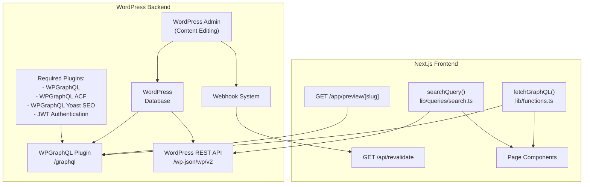
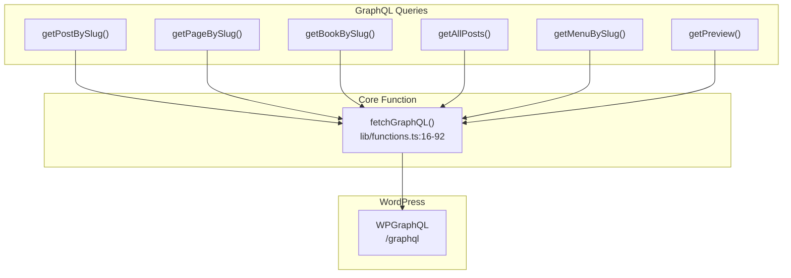
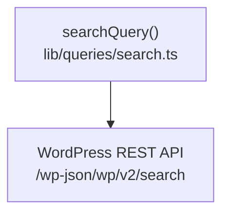
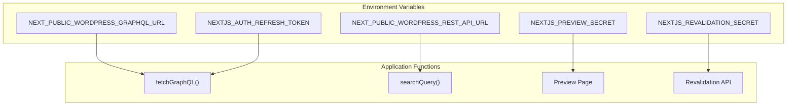
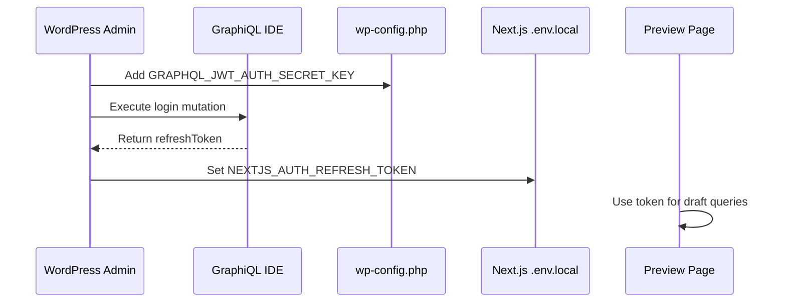
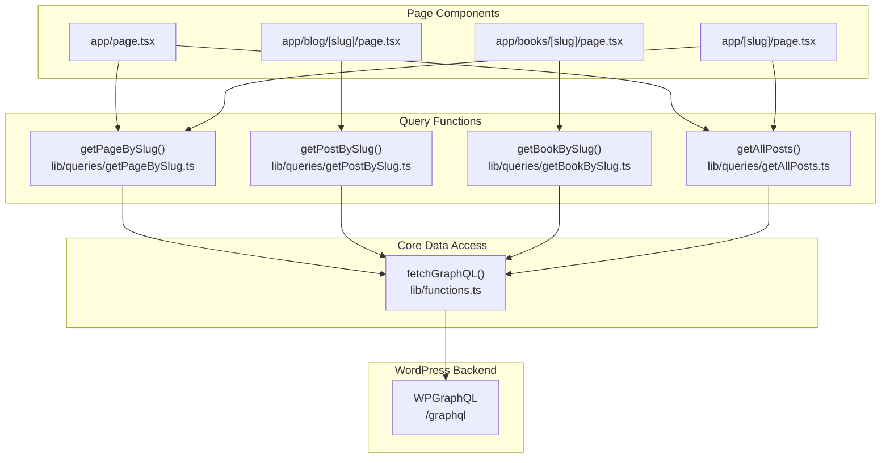

---
layout: default
title: WordPress Integration
nav_order: 7
has_children: true
---

# WordPress Integration

> **Relevant source files**
> * [.env.example](https://github.com/gregrickaby/nextjs-wordpress/blob/63f3f2f5/.env.example)
> * [.gitignore](https://github.com/gregrickaby/nextjs-wordpress/blob/63f3f2f5/.gitignore)
> * [.vscode/extensions.json](https://github.com/gregrickaby/nextjs-wordpress/blob/63f3f2f5/.vscode/extensions.json)
> * [.vscode/settings.json](https://github.com/gregrickaby/nextjs-wordpress/blob/63f3f2f5/.vscode/settings.json)
> * [AGENTS.md](https://github.com/gregrickaby/nextjs-wordpress/blob/63f3f2f5/AGENTS.md)
> * [CONTRIBUTING.md](https://github.com/gregrickaby/nextjs-wordpress/blob/63f3f2f5/CONTRIBUTING.md)
> * [README.md](https://github.com/gregrickaby/nextjs-wordpress/blob/63f3f2f5/README.md)
> * [app/api/revalidate/route.ts](https://github.com/gregrickaby/nextjs-wordpress/blob/63f3f2f5/app/api/revalidate/route.ts)
> * app/blog/category/[slug]/page.tsx
> * app/blog/tag/[slug]/page.tsx
> * app/preview/[slug]/page.tsx
> * [scripts/sonar-analysis.sh](https://github.com/gregrickaby/nextjs-wordpress/blob/63f3f2f5/scripts/sonar-analysis.sh)
> * [sonar-project.properties](https://github.com/gregrickaby/nextjs-wordpress/blob/63f3f2f5/sonar-project.properties)

This document provides an overview of how WordPress is integrated with the Next.js frontend application. It covers the WordPress backend configuration, API endpoints, authentication mechanisms, and the communication patterns between WordPress and Next.js.

For detailed WordPress plugin installation and configuration, see [WordPress Configuration](/gregrickaby/nextjs-wordpress/6.1-wordpress-configuration). For preview functionality implementation, see [Preview Mode](/gregrickaby/nextjs-wordpress/6.2-preview-mode). For cache invalidation and webhook setup, see [On-Demand Revalidation](/gregrickaby/nextjs-wordpress/6.3-on-demand-revalidation).

---

## Architecture Overview

The application operates as a headless WordPress implementation where WordPress serves as the content management system and data source, while Next.js handles the presentation layer. WordPress exposes content through two primary APIs: WPGraphQL for structured content queries and the WordPress REST API for search functionality.

## WordPress to Next.js Communication Model



**Sources:** [README.md L19-L34](https://github.com/gregrickaby/nextjs-wordpress/blob/63f3f2f5/README.md#L19-L34)

 [README.md L132-L144](https://github.com/gregrickaby/nextjs-wordpress/blob/63f3f2f5/README.md#L132-L144)

---

## Required WordPress Components

### WordPress Plugins

The WordPress backend requires the following plugins to function correctly:

| Plugin | Purpose | Source |
| --- | --- | --- |
| `WPGraphQL` | Core GraphQL API server | WordPress.org |
| `Advanced Custom Fields` | Custom field management | WordPress.org (free) |
| `WPGraphQL for Advanced Custom Fields` | Exposes ACF fields to GraphQL | WordPress.org |
| `WPGraphQL Yoast SEO` | Exposes Yoast SEO metadata to GraphQL | WordPress.org |
| `WPGraphQL JWT Authentication` | JWT tokens for preview authentication | GitHub (optional) |
| `Next.js WordPress Plugin` | Webhook automation and helpers | GitHub repository |
| `Next.js WordPress Theme` | Minimal WordPress theme | GitHub repository |
| `Yoast SEO` | SEO metadata management | WordPress.org |

**Sources:** [README.md L134-L143](https://github.com/gregrickaby/nextjs-wordpress/blob/63f3f2f5/README.md#L134-L143)

### WordPress Configuration Constants

The WordPress `wp-config.php` file must define the following constants to enable communication with the Next.js frontend:

```
// The URL of your Next.js frontend. Include the trailing slash.
define( 'NEXTJS_FRONTEND_URL', 'https://nextjswp.com/' );

// Optional. JWT auth refresh token.
define( 'GRAPHQL_JWT_AUTH_SECRET_KEY', '' );

// Any random string. This must match the .env variable in the Next.js frontend.
define( 'NEXTJS_PREVIEW_SECRET', 'preview' );

// Any random string. This must match the .env variable in the Next.js frontend.
define( 'NEXTJS_REVALIDATION_SECRET', 'revalidate' );
```

These constants are referenced in [README.md L147-L161](https://github.com/gregrickaby/nextjs-wordpress/blob/63f3f2f5/README.md#L147-L161)

**Sources:** [README.md L145-L161](https://github.com/gregrickaby/nextjs-wordpress/blob/63f3f2f5/README.md#L145-L161)

---

## API Endpoints

### GraphQL Endpoint

The primary data access mechanism is the WPGraphQL endpoint exposed at `/graphql`. All structured content queries (posts, pages, books, categories, tags, menus) use this endpoint.



The `fetchGraphQL()` function centralizes all GraphQL communication and implements Next.js caching strategies using cache tags.

**Sources:** [README.md L236-L343](https://github.com/gregrickaby/nextjs-wordpress/blob/63f3f2f5/README.md#L236-L343)

 [AGENTS.md L72-L76](https://github.com/gregrickaby/nextjs-wordpress/blob/63f3f2f5/AGENTS.md#L72-L76)

### REST API Endpoint

The WordPress REST API at `/wp-json/wp/v2` is used exclusively for search functionality. The search implementation uses the native WordPress search capabilities exposed through the REST API.



**Sources:** [README.md L73-L77](https://github.com/gregrickaby/nextjs-wordpress/blob/63f3f2f5/README.md#L73-L77)

 [.env.example L4-L5](https://github.com/gregrickaby/nextjs-wordpress/blob/63f3f2f5/.env.example#L4-L5)

---

## Environment Variables

### Next.js Environment Configuration

The Next.js application requires the following environment variables in `.env.local`:

| Variable | Description | Example |
| --- | --- | --- |
| `NEXT_PUBLIC_WORDPRESS_GRAPHQL_URL` | WordPress GraphQL endpoint (no trailing slash) | `https://blog.nextjswp.com/graphql` |
| `NEXT_PUBLIC_WORDPRESS_REST_API_URL` | WordPress REST API endpoint (no trailing slash) | `https://blog.nextjswp.com/wp-json/wp/v2` |
| `NEXTJS_AUTH_REFRESH_TOKEN` | JWT refresh token for preview authentication (optional) | Generated via GraphQL mutation |
| `NEXTJS_PREVIEW_SECRET` | Shared secret for preview mode | Must match wp-config.php |
| `NEXTJS_REVALIDATION_SECRET` | Shared secret for on-demand revalidation | Must match wp-config.php |

These variables are defined in [.env.example L1-L14](https://github.com/gregrickaby/nextjs-wordpress/blob/63f3f2f5/.env.example#L1-L14)

 and documented in [README.md L70-L87](https://github.com/gregrickaby/nextjs-wordpress/blob/63f3f2f5/README.md#L70-L87)

**Sources:** [.env.example L1-L14](https://github.com/gregrickaby/nextjs-wordpress/blob/63f3f2f5/.env.example#L1-L14)

 [README.md L70-L87](https://github.com/gregrickaby/nextjs-wordpress/blob/63f3f2f5/README.md#L70-L87)

 [AGENTS.md L159-L168](https://github.com/gregrickaby/nextjs-wordpress/blob/63f3f2f5/AGENTS.md#L159-L168)

### Environment Variable Usage



**Sources:** [.env.example L1-L14](https://github.com/gregrickaby/nextjs-wordpress/blob/63f3f2f5/.env.example#L1-L14)

 [README.md L70-L87](https://github.com/gregrickaby/nextjs-wordpress/blob/63f3f2f5/README.md#L70-L87)

---

## Authentication Mechanism

### JWT Authentication for Previews

Preview functionality requires JWT authentication to access draft content that is not publicly available. The authentication flow involves:

1. Installing the `WPGraphQL JWT Authentication` plugin
2. Generating a random secret key for `GRAPHQL_JWT_AUTH_SECRET_KEY` in `wp-config.php`
3. Executing a GraphQL login mutation to obtain a refresh token
4. Storing the refresh token in `NEXTJS_AUTH_REFRESH_TOKEN` environment variable



The complete authentication setup is documented in [README.md L184-L224](https://github.com/gregrickaby/nextjs-wordpress/blob/63f3f2f5/README.md#L184-L224)

**Sources:** [README.md L184-L224](https://github.com/gregrickaby/nextjs-wordpress/blob/63f3f2f5/README.md#L184-L224)

 app/preview/[slug]/page.tsx:1-141

---

## Integration Points

### Content Query Integration

Content queries follow a consistent pattern where page components call query functions, which use `fetchGraphQL()` to communicate with WordPress:



**Sources:** [AGENTS.md L66-L79](https://github.com/gregrickaby/nextjs-wordpress/blob/63f3f2f5/AGENTS.md#L66-L79)

 [README.md L236-L343](https://github.com/gregrickaby/nextjs-wordpress/blob/63f3f2f5/README.md#L236-L343)

### Revalidation Integration

WordPress webhooks trigger the Next.js revalidation API endpoint when content is updated. The revalidation endpoint validates the request using a shared secret, applies rate limiting, and invalidates Next.js caches:

```mermaid
sequenceDiagram
  participant WordPress
  participant Webhook Plugin
  participant /api/revalidate
  participant Next.js Cache
  participant Static Pages

  WordPress->>Webhook Plugin: Content Updated
  Webhook Plugin->>/api/revalidate: GET /api/revalidate?slug=post-slug
  /api/revalidate->>/api/revalidate: Header: x-revalidation-secret
  /api/revalidate->>/api/revalidate: Validate secret
  /api/revalidate->>Next.js Cache: Check rate limit
  /api/revalidate->>Next.js Cache: revalidatePath(slug)
  /api/revalidate->>Next.js Cache: revalidateTag(slug)
  Next.js Cache->>Static Pages: revalidateTag('graphql')
  /api/revalidate-->>Webhook Plugin: Mark stale
```

The revalidation implementation is in [app/api/revalidate/route.ts L1-L149](https://github.com/gregrickaby/nextjs-wordpress/blob/63f3f2f5/app/api/revalidate/route.ts#L1-L149)

 and uses rate limiting defined at [app/api/revalidate/route.ts L39-L41](https://github.com/gregrickaby/nextjs-wordpress/blob/63f3f2f5/app/api/revalidate/route.ts#L39-L41)

**Sources:** [app/api/revalidate/route.ts L1-L149](https://github.com/gregrickaby/nextjs-wordpress/blob/63f3f2f5/app/api/revalidate/route.ts#L1-L149)

 [README.md L389-L395](https://github.com/gregrickaby/nextjs-wordpress/blob/63f3f2f5/README.md#L389-L395)

---

## WordPress Data Types

The WordPress GraphQL schema exposes structured content types that are auto-generated into TypeScript types via GraphQL Code Generator:

| WordPress Type | TypeScript Type | Location | Description |
| --- | --- | --- | --- |
| Post | `Post` | `lib/generated.ts` | Blog posts with categories, tags, comments |
| Page | `Page` | `lib/generated.ts` | Static pages |
| Book | `Book` | `lib/generated.ts` | Custom post type example |
| Category | `Category` | `lib/generated.ts` | Post taxonomy |
| Tag | `Tag` | `lib/generated.ts` | Post taxonomy |
| MenuItem | `MenuItem` | `lib/generated.ts` | Navigation menu items |
| Comment | `Comment` | `lib/generated.ts` | Post comments |

These types are generated by running `npm run codegen` which introspects the WordPress GraphQL schema. The generated types are referenced in [AGENTS.md L127-L141](https://github.com/gregrickaby/nextjs-wordpress/blob/63f3f2f5/AGENTS.md#L127-L141)

**Sources:** [AGENTS.md L127-L141](https://github.com/gregrickaby/nextjs-wordpress/blob/63f3f2f5/AGENTS.md#L127-L141)

 [README.md L236-L343](https://github.com/gregrickaby/nextjs-wordpress/blob/63f3f2f5/README.md#L236-L343)

---

## Permalink Structure

WordPress must be configured with the permalink structure `/blog/%postname%/` to ensure URL consistency between WordPress and Next.js. This configuration is set in **Settings → Permalinks** in the WordPress admin.

The permalink structure ensures that:

* WordPress post URLs match Next.js route structure at `app/blog/[slug]/page.tsx`
* GraphQL queries can fetch posts by slug consistently
* Revalidation webhooks can target the correct Next.js paths

**Sources:** [README.md L163-L165](https://github.com/gregrickaby/nextjs-wordpress/blob/63f3f2f5/README.md#L163-L165)

---

## Content Type Examples

### Post Structure

WordPress posts fetched via GraphQL include the following structure:

```yaml
interface Post {
  databaseId: number
  title: string
  slug: string
  date: string
  modified: string
  content: string
  excerpt: string
  featuredImage?: {
    node: {
      sourceUrl: string
      altText: string
      mediaDetails: {
        height: number
        width: number
      }
    }
  }
  author: {
    node: {
      name: string
      avatar: {
        url: string
      }
    }
  }
  categories: {
    nodes: Category[]
  }
  tags: {
    nodes: Tag[]
  }
  seo: {
    title: string
    metaDesc: string
  }
  comments: {
    nodes: Comment[]
  }
}
```

This structure is defined in the GraphQL query at [README.md L244-L314](https://github.com/gregrickaby/nextjs-wordpress/blob/63f3f2f5/README.md#L244-L314)

**Sources:** [README.md L244-L330](https://github.com/gregrickaby/nextjs-wordpress/blob/63f3f2f5/README.md#L244-L330)

---

## Null Safety Patterns

WordPress data structures use `Maybe<T>` types which require explicit null checking. The application follows consistent null safety patterns:

```javascript
// Featured image null checking
{post.featuredImage?.node && (
  <Image
    alt={post.featuredImage.node.altText ?? post.title ?? ''}
    src={post.featuredImage.node.sourceUrl ?? ''}
  />
)}

// Nullish coalescing for strings
const title = post.title ?? 'Untitled'
const description = post.excerpt ?? ''
```

These patterns are documented in [README.md L333-L338](https://github.com/gregrickaby/nextjs-wordpress/blob/63f3f2f5/README.md#L333-L338)

 and [AGENTS.md L114-L126](https://github.com/gregrickaby/nextjs-wordpress/blob/63f3f2f5/AGENTS.md#L114-L126)

**Sources:** [README.md L333-L338](https://github.com/gregrickaby/nextjs-wordpress/blob/63f3f2f5/README.md#L333-L338)

 [AGENTS.md L114-L126](https://github.com/gregrickaby/nextjs-wordpress/blob/63f3f2f5/AGENTS.md#L114-L126)

---

## Error Handling

Query functions implement graceful error handling by returning empty arrays or `null` instead of throwing exceptions:

```javascript
export default async function getAllPosts(): Promise<Post[]> {
  const response = await fetchGraphQL(query)

  // Handle errors gracefully - return empty array
  if (!response?.data?.posts?.nodes) {
    return []
  }

  return response.data.posts.nodes as Post[]
}
```

This pattern ensures that pages can render even when WordPress is unavailable, as documented in [README.md L324-L338](https://github.com/gregrickaby/nextjs-wordpress/blob/63f3f2f5/README.md#L324-L338)

**Sources:** [README.md L324-L338](https://github.com/gregrickaby/nextjs-wordpress/blob/63f3f2f5/README.md#L324-L338)

 [AGENTS.md L144-L156](https://github.com/gregrickaby/nextjs-wordpress/blob/63f3f2f5/AGENTS.md#L144-L156)