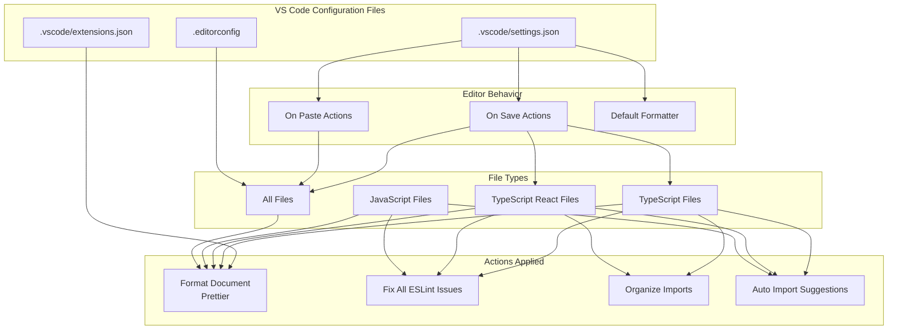
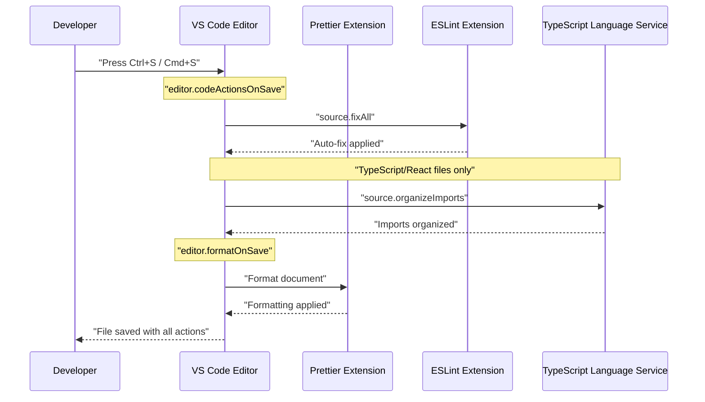
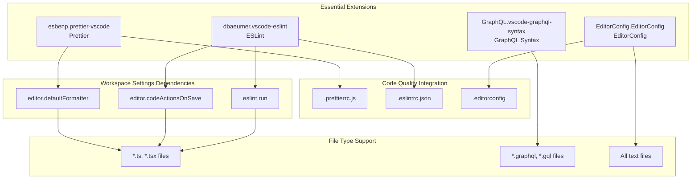
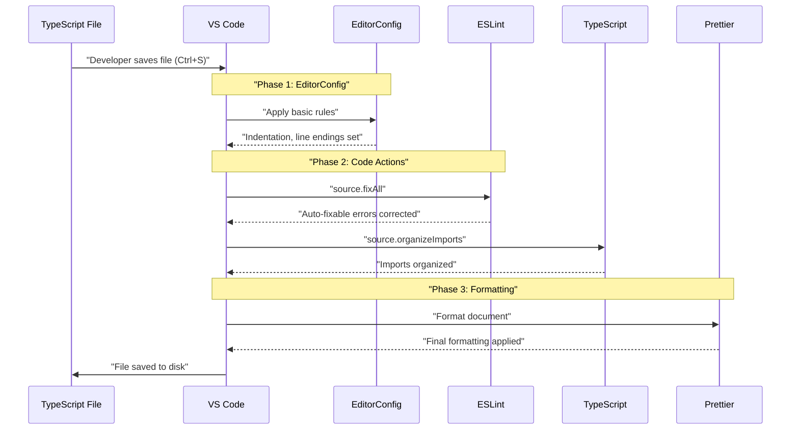
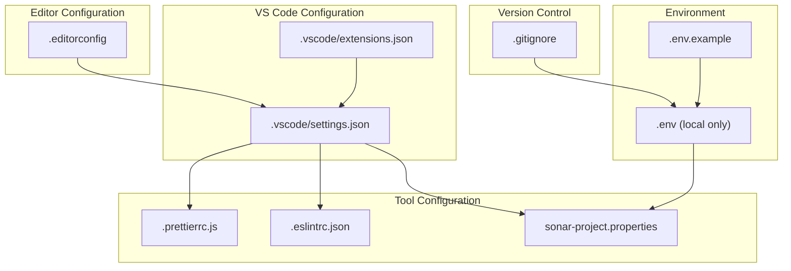

---
layout: default
title: VS Code Configuration
parent: Development Environment
nav_order: 1
---

# VS Code Configuration

> **Relevant source files**
> * [.editorconfig](https://github.com/gregrickaby/nextjs-wordpress/blob/63f3f2f5/.editorconfig)
> * [.env.example](https://github.com/gregrickaby/nextjs-wordpress/blob/63f3f2f5/.env.example)
> * [.gitignore](https://github.com/gregrickaby/nextjs-wordpress/blob/63f3f2f5/.gitignore)
> * [.vscode/extensions.json](https://github.com/gregrickaby/nextjs-wordpress/blob/63f3f2f5/.vscode/extensions.json)
> * [.vscode/settings.json](https://github.com/gregrickaby/nextjs-wordpress/blob/63f3f2f5/.vscode/settings.json)
> * [scripts/sonar-analysis.sh](https://github.com/gregrickaby/nextjs-wordpress/blob/63f3f2f5/scripts/sonar-analysis.sh)
> * [sonar-project.properties](https://github.com/gregrickaby/nextjs-wordpress/blob/63f3f2f5/sonar-project.properties)

## Purpose and Scope

This document details the Visual Studio Code workspace configuration, including editor settings, recommended extensions, and their integration with the development workflow. The configuration ensures consistent formatting, automatic code quality enforcement, and seamless TypeScript development.

For code quality tool configuration (ESLint, Prettier, SonarQube), see [Code Quality Tools](/gregrickaby/nextjs-wordpress/7.2-code-quality-tools). For Git hooks and pre-commit validation, see [Git Hooks](/gregrickaby/nextjs-wordpress/7.3-git-hooks).

---

## Workspace Settings Overview

The VS Code configuration consists of two primary files:

| File | Purpose | Version Control |
| --- | --- | --- |
| `.vscode/settings.json` | Workspace-specific editor settings | Committed to repository |
| `.vscode/extensions.json` | Recommended extension list | Committed to repository |
| `.editorconfig` | Cross-editor formatting rules | Committed to repository |

These files ensure all developers have a consistent editing experience regardless of their personal VS Code settings.

**Sources:** [.vscode/settings.json L1-L34](https://github.com/gregrickaby/nextjs-wordpress/blob/63f3f2f5/.vscode/settings.json#L1-L34)

 [.vscode/extensions.json L1-L9](https://github.com/gregrickaby/nextjs-wordpress/blob/63f3f2f5/.vscode/extensions.json#L1-L9)

 [.editorconfig L1-L11](https://github.com/gregrickaby/nextjs-wordpress/blob/63f3f2f5/.editorconfig#L1-L11)

---

## Editor Configuration

### Diagram: VS Code Settings Architecture



**Sources:** [.vscode/settings.json L1-L34](https://github.com/gregrickaby/nextjs-wordpress/blob/63f3f2f5/.vscode/settings.json#L1-L34)

 [.editorconfig L1-L11](https://github.com/gregrickaby/nextjs-wordpress/blob/63f3f2f5/.editorconfig#L1-L11)

### Format On Save

The workspace enables automatic formatting on every file save:

```
"editor.formatOnSave": true
```

This setting triggers the default formatter (Prettier) immediately when `Ctrl+S` / `Cmd+S` is pressed.

**Sources:** [.vscode/settings.json L7](https://github.com/gregrickaby/nextjs-wordpress/blob/63f3f2f5/.vscode/settings.json#L7-L7)

### Format On Paste

Automatic formatting also applies to pasted content:

```
"editor.formatOnPaste": true
```

This ensures pasted code matches the project's formatting standards without manual intervention.

**Sources:** [.vscode/settings.json L6](https://github.com/gregrickaby/nextjs-wordpress/blob/63f3f2f5/.vscode/settings.json#L6-L6)

### Default Formatter

Prettier is configured as the default formatter for all file types:

```
"editor.defaultFormatter": "esbenp.prettier-vscode"
```

This setting requires the `esbenp.prettier-vscode` extension to be installed (see [Recommended Extensions](https://github.com/gregrickaby/nextjs-wordpress/blob/63f3f2f5/Recommended Extensions)

).

**Sources:** [.vscode/settings.json L5](https://github.com/gregrickaby/nextjs-wordpress/blob/63f3f2f5/.vscode/settings.json#L5-L5)

---

## Code Actions On Save

### Diagram: Code Actions Workflow



**Sources:** [.vscode/settings.json L2-L28](https://github.com/gregrickaby/nextjs-wordpress/blob/63f3f2f5/.vscode/settings.json#L2-L28)

### General Code Actions

All file types receive automatic ESLint fixes on save:

```
"editor.codeActionsOnSave": {
  "source.fixAll": "explicit"
}
```

The `"explicit"` value ensures this action only runs when explicitly triggered by save (not on auto-save).

**Sources:** [.vscode/settings.json L2-L4](https://github.com/gregrickaby/nextjs-wordpress/blob/63f3f2f5/.vscode/settings.json#L2-L4)

### TypeScript-Specific Actions

TypeScript and TypeScript React files receive additional organize imports action:

```
"[typescript]": {
  "editor.codeActionsOnSave": {
    "source.organizeImports": "explicit"
  }
},
"[typescriptreact]": {
  "editor.codeActionsOnSave": {
    "source.organizeImports": "explicit"
  }
}
```

This action:

* Removes unused imports
* Sorts imports alphabetically
* Groups imports by source (external libraries, internal modules, relative imports)

**Sources:** [.vscode/settings.json L14-L23](https://github.com/gregrickaby/nextjs-wordpress/blob/63f3f2f5/.vscode/settings.json#L14-L23)

### Combined TypeScript Configuration

A combined configuration ensures the organize imports action applies to both TypeScript file types:

```
"[typescript][typescriptreact]": {
  "editor.codeActionsOnSave": {
    "source.organizeImports": "explicit"
  }
}
```

**Sources:** [.vscode/settings.json L24-L28](https://github.com/gregrickaby/nextjs-wordpress/blob/63f3f2f5/.vscode/settings.json#L24-L28)

---

## TypeScript and JavaScript Settings

### Auto Import Configuration

| Setting | Value | Description |
| --- | --- | --- |
| `javascript.suggest.autoImports` | `true` | Enable auto-import suggestions for JavaScript |
| `typescript.suggest.autoImports` | `true` | Enable auto-import suggestions for TypeScript |
| `javascript.updateImportsOnFileMove.enabled` | `"always"` | Update imports when files are moved |
| `typescript.updateImportsOnFileMove.enabled` | `"always"` | Update imports when files are moved |

**Sources:** [.vscode/settings.json L10-L13](https://github.com/gregrickaby/nextjs-wordpress/blob/63f3f2f5/.vscode/settings.json#L10-L13)

### Auto Import Behavior

When typing a symbol name that isn't imported:

1. VS Code displays the symbol in autocomplete with a lightning bolt icon
2. Selecting the symbol automatically adds the import statement at the top of the file
3. The import path is calculated based on the file's location

### Update Imports On File Move

When a file is moved or renamed:

1. VS Code automatically updates all import statements that reference the file
2. The `"always"` value ensures this happens without prompting
3. Applies to both JavaScript and TypeScript files

**Sources:** [.vscode/settings.json L11-L13](https://github.com/gregrickaby/nextjs-wordpress/blob/63f3f2f5/.vscode/settings.json#L11-L13)

---

## ESLint Integration

### Run Configuration

ESLint runs automatically on save:

```
"eslint.run": "onSave"
```

This triggers ESLint validation when a file is saved, displaying errors and warnings in the Problems panel.

**Sources:** [.vscode/settings.json L9](https://github.com/gregrickaby/nextjs-wordpress/blob/63f3f2f5/.vscode/settings.json#L9-L9)

### Format Disable

ESLint's built-in formatter is explicitly disabled:

```
"eslint.format.enable": false
```

This prevents conflicts with Prettier, which handles all formatting. ESLint focuses solely on code quality rules (not formatting rules).

**Sources:** [.vscode/settings.json L8](https://github.com/gregrickaby/nextjs-wordpress/blob/63f3f2f5/.vscode/settings.json#L8-L8)

---

## SonarLint Integration

### Connected Mode Configuration

SonarLint is configured to connect to a local SonarQube server:

```
"sonarlint.connectedMode.project": {
  "connectionId": "http-localhost-9000",
  "projectKey": "Next.js-WordPress"
}
```

| Property | Value | Description |
| --- | --- | --- |
| `connectionId` | `"http-localhost-9000"` | SonarQube server URL identifier |
| `projectKey` | `"Next.js-WordPress"` | Project key from SonarQube |

**Sources:** [.vscode/settings.json L29-L32](https://github.com/gregrickaby/nextjs-wordpress/blob/63f3f2f5/.vscode/settings.json#L29-L32)

 [sonar-project.properties L4-L9](https://github.com/gregrickaby/nextjs-wordpress/blob/63f3f2f5/sonar-project.properties#L4-L9)

### Connected Mode Benefits

When connected to SonarQube:

1. **Real-time analysis**: Issues appear in VS Code as you type
2. **Shared quality rules**: Same rules as CI/CD pipeline
3. **Synchronized suppressions**: Suppressions marked in SonarQube apply in VS Code
4. **Issue tracking**: View issue history and status

### SonarQube Server Setup

The SonarQube server runs locally on port 9000. The project configuration is defined in `sonar-project.properties`:

* **Project Key**: `Next.js-WordPress`
* **Project Name**: `Next.js WordPress`
* **Server URL**: `http://localhost:9000`

**Sources:** [sonar-project.properties L4-L9](https://github.com/gregrickaby/nextjs-wordpress/blob/63f3f2f5/sonar-project.properties#L4-L9)

---

## Recommended Extensions

### Diagram: Extension Dependencies



**Sources:** [.vscode/extensions.json L1-L9](https://github.com/gregrickaby/nextjs-wordpress/blob/63f3f2f5/.vscode/extensions.json#L1-L9)

 [.vscode/settings.json L1-L34](https://github.com/gregrickaby/nextjs-wordpress/blob/63f3f2f5/.vscode/settings.json#L1-L34)

### Extension List

The workspace recommends four essential extensions:

| Extension ID | Name | Purpose |
| --- | --- | --- |
| `EditorConfig.EditorConfig` | EditorConfig | Cross-editor formatting consistency |
| `GraphQL.vscode-graphql-syntax` | GraphQL Syntax | Syntax highlighting for GraphQL files |
| `dbaeumer.vscode-eslint` | ESLint | JavaScript/TypeScript linting |
| `esbenp.prettier-vscode` | Prettier | Code formatting |

**Sources:** [.vscode/extensions.json L2-L7](https://github.com/gregrickaby/nextjs-wordpress/blob/63f3f2f5/.vscode/extensions.json#L2-L7)

### Installation Prompt

When opening the workspace, VS Code displays a notification:

> "This workspace has extension recommendations."

Clicking "Install All" installs all four extensions. This ensures consistent tooling across the team.

### Extension Purposes

#### EditorConfig (EditorConfig.EditorConfig)

Enforces formatting rules from `.editorconfig`:

* **Indent style**: Spaces
* **Indent size**: 2 spaces
* **Charset**: UTF-8
* **Trailing whitespace**: Trimmed
* **Line endings**: LF (Unix-style)
* **Final newline**: Inserted

**Sources:** [.editorconfig L4-L10](https://github.com/gregrickaby/nextjs-wordpress/blob/63f3f2f5/.editorconfig#L4-L10)

#### GraphQL Syntax (GraphQL.vscode-graphql-syntax)

Provides syntax highlighting for GraphQL query and mutation files:

* Query documents in `lib/queries/*.ts`
* Mutation documents in `lib/mutations/*.ts`
* GraphQL schema introspection files

**Sources:** [.vscode/extensions.json L4](https://github.com/gregrickaby/nextjs-wordpress/blob/63f3f2f5/.vscode/extensions.json#L4-L4)

#### ESLint (dbaeumer.vscode-eslint)

Integrates ESLint linting into the editor:

* Displays errors and warnings inline
* Runs on save via `"eslint.run": "onSave"`
* Auto-fixes issues via `"source.fixAll": "explicit"`

**Sources:** [.vscode/extensions.json L5](https://github.com/gregrickaby/nextjs-wordpress/blob/63f3f2f5/.vscode/extensions.json#L5-L5)

 [.vscode/settings.json L8-L9](https://github.com/gregrickaby/nextjs-wordpress/blob/63f3f2f5/.vscode/settings.json#L8-L9)

#### Prettier (esbenp.prettier-vscode)

Formats code on save and paste:

* Acts as default formatter via `"editor.defaultFormatter"`
* Triggered by `"editor.formatOnSave": true`
* Triggered by `"editor.formatOnPaste": true`

**Sources:** [.vscode/extensions.json L6](https://github.com/gregrickaby/nextjs-wordpress/blob/63f3f2f5/.vscode/extensions.json#L6-L6)

 [.vscode/settings.json L5-L7](https://github.com/gregrickaby/nextjs-wordpress/blob/63f3f2f5/.vscode/settings.json#L5-L7)

---

## EditorConfig Cross-Editor Consistency

### Configuration

The `.editorconfig` file ensures consistent formatting across different editors and IDEs:

```
root = true

[*]
indent_style = space
indent_size = 2
charset = utf-8
trim_trailing_whitespace = true
end_of_line = lf
insert_final_newline = true
```

**Sources:** [.editorconfig L1-L11](https://github.com/gregrickaby/nextjs-wordpress/blob/63f3f2f5/.editorconfig#L1-L11)

### Settings Explained

| Setting | Value | Effect |
| --- | --- | --- |
| `root` | `true` | Stop searching for .editorconfig in parent directories |
| `indent_style` | `space` | Use spaces (not tabs) for indentation |
| `indent_size` | `2` | 2 spaces per indentation level |
| `charset` | `utf-8` | UTF-8 encoding for all files |
| `trim_trailing_whitespace` | `true` | Remove trailing spaces on save |
| `end_of_line` | `lf` | Unix-style line endings (not CRLF) |
| `insert_final_newline` | `true` | Ensure files end with newline |

### Interaction with Prettier

EditorConfig settings complement (not conflict with) Prettier:

* EditorConfig handles basic whitespace rules
* Prettier handles advanced formatting (semicolons, quotes, etc.)
* The `EditorConfig.EditorConfig` extension ensures VS Code respects these settings

**Sources:** [.editorconfig L1-L11](https://github.com/gregrickaby/nextjs-wordpress/blob/63f3f2f5/.editorconfig#L1-L11)

---

## Development Workflow Integration

### Diagram: Save Action Execution Order



**Sources:** [.vscode/settings.json L2-L28](https://github.com/gregrickaby/nextjs-wordpress/blob/63f3f2f5/.vscode/settings.json#L2-L28)

 [.editorconfig L1-L11](https://github.com/gregrickaby/nextjs-wordpress/blob/63f3f2f5/.editorconfig#L1-L11)

### Phase Breakdown

#### Phase 1: EditorConfig (Immediate)

EditorConfig rules apply as characters are typed:

* Indentation converts to spaces
* Line endings normalize to LF

#### Phase 2: Code Actions (On Save)

Code actions execute in this order:

1. **ESLint auto-fix** (`source.fixAll`) * Fixes auto-fixable ESLint errors * Adds missing semicolons, removes unused variables, etc.
2. **Organize imports** (`source.organizeImports`) * Removes unused imports * Sorts remaining imports * Groups by import source

#### Phase 3: Formatting (After Code Actions)

Prettier formats the file after all code actions complete:

* Ensures consistent style (quotes, spacing, line breaks)
* Respects EditorConfig settings
* Does not conflict with ESLint (formatting rules disabled in ESLint)

**Sources:** [.vscode/settings.json L2-L28](https://github.com/gregrickaby/nextjs-wordpress/blob/63f3f2f5/.vscode/settings.json#L2-L28)

---

## Configuration Files Summary

### File Relationships



**Sources:** [.vscode/settings.json L1-L34](https://github.com/gregrickaby/nextjs-wordpress/blob/63f3f2f5/.vscode/settings.json#L1-L34)

 [.vscode/extensions.json L1-L9](https://github.com/gregrickaby/nextjs-wordpress/blob/63f3f2f5/.vscode/extensions.json#L1-L9)

 [.editorconfig L1-L11](https://github.com/gregrickaby/nextjs-wordpress/blob/63f3f2f5/.editorconfig#L1-L11)

 [.gitignore L1-L42](https://github.com/gregrickaby/nextjs-wordpress/blob/63f3f2f5/.gitignore#L1-L42)

 [.env.example L1-L18](https://github.com/gregrickaby/nextjs-wordpress/blob/63f3f2f5/.env.example#L1-L18)

 [sonar-project.properties L1-L35](https://github.com/gregrickaby/nextjs-wordpress/blob/63f3f2f5/sonar-project.properties#L1-L35)

### Configuration File Overview

| File | Purpose | Committed |
| --- | --- | --- |
| `.vscode/settings.json` | VS Code workspace settings | Yes |
| `.vscode/extensions.json` | Recommended extensions list | Yes |
| `.editorconfig` | Cross-editor formatting rules | Yes |
| `.prettierrc.js` | Prettier formatting configuration | Yes |
| `.eslintrc.json` | ESLint linting rules | Yes |
| `sonar-project.properties` | SonarQube analysis configuration | Yes |
| `.env.example` | Environment variable template | Yes |
| `.env` | Local environment variables | No (in .gitignore) |

**Sources:** [.gitignore L30-L31](https://github.com/gregrickaby/nextjs-wordpress/blob/63f3f2f5/.gitignore#L30-L31)

 [.env.example L1-L18](https://github.com/gregrickaby/nextjs-wordpress/blob/63f3f2f5/.env.example#L1-L18)

---

## SonarQube Analysis Integration

### Local Analysis Workflow

The SonarQube integration enables local code quality analysis before pushing to CI:

1. **Install SonarQube locally** * SonarQube Community Edition on `http://localhost:9000` * Create project with key `Next.js-WordPress`
2. **Configure SonarLint connected mode** * Settings already configured in `.vscode/settings.json` * SonarLint syncs with local SonarQube server
3. **Run analysis script** ``` npm run sonar-analysis ```
4. **View results** * In SonarQube web UI at `http://localhost:9000` * In VS Code via SonarLint extension

**Sources:** [.vscode/settings.json L29-L32](https://github.com/gregrickaby/nextjs-wordpress/blob/63f3f2f5/.vscode/settings.json#L29-L32)

 [sonar-project.properties L4-L9](https://github.com/gregrickaby/nextjs-wordpress/blob/63f3f2f5/sonar-project.properties#L4-L9)

 [scripts/sonar-analysis.sh L1-L43](https://github.com/gregrickaby/nextjs-wordpress/blob/63f3f2f5/scripts/sonar-analysis.sh#L1-L43)

### Analysis Script Components

The `scripts/sonar-analysis.sh` script performs:

1. **Prerequisite check**: Verifies `sonar-scanner` is installed
2. **Environment loading**: Loads `SONAR_TOKEN` from `.env`
3. **Test coverage**: Runs `npm run test:coverage` to generate `coverage/lcov.info`
4. **SonarQube scan**: Executes `sonar-scanner` with configuration from `sonar-project.properties`

**Sources:** [scripts/sonar-analysis.sh L5-L42](https://github.com/gregrickaby/nextjs-wordpress/blob/63f3f2f5/scripts/sonar-analysis.sh#L5-L42)

### SonarQube Configuration

Key settings from `sonar-project.properties`:

| Property | Value | Description |
| --- | --- | --- |
| `sonar.projectKey` | `Next.js-WordPress` | Matches VS Code connected mode |
| `sonar.host.url` | `http://localhost:9000` | Local SonarQube server |
| `sonar.sources` | `app,components,lib` | Directories to analyze |
| `sonar.inclusions` | `**/*.ts,**/*.tsx` | TypeScript files only |
| `sonar.exclusions` | `**/lib/generated.ts` | Exclude generated types |
| `sonar.javascript.lcov.reportPaths` | `coverage/lcov.info` | Coverage report location |

**Sources:** [sonar-project.properties L4-L22](https://github.com/gregrickaby/nextjs-wordpress/blob/63f3f2f5/sonar-project.properties#L4-L22)

---

## Best Practices

### Save Frequently

With auto-formatting and auto-fix enabled, saving frequently keeps code consistently formatted:

* No manual formatting needed
* Import statements stay organized
* ESLint issues fixed immediately

### Trust the Tools

The configuration is designed to handle formatting automatically:

* Don't manually format code
* Don't manually organize imports
* Let the tools do the work on save

### Extension Updates

Keep recommended extensions updated:

* VS Code notifies when updates are available
* Updates may include bug fixes and performance improvements
* Extension updates won't break the configuration

### Cross-Platform Consistency

The configuration ensures consistent behavior across operating systems:

* Line endings always LF (Unix-style)
* File encodings always UTF-8
* Indentation always 2 spaces

**Sources:** [.editorconfig L4-L10](https://github.com/gregrickaby/nextjs-wordpress/blob/63f3f2f5/.editorconfig#L4-L10)

 [.vscode/settings.json L1-L34](https://github.com/gregrickaby/nextjs-wordpress/blob/63f3f2f5/.vscode/settings.json#L1-L34)