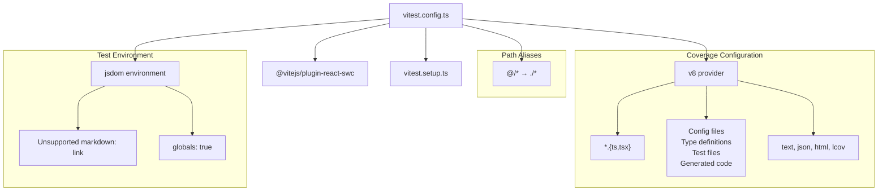
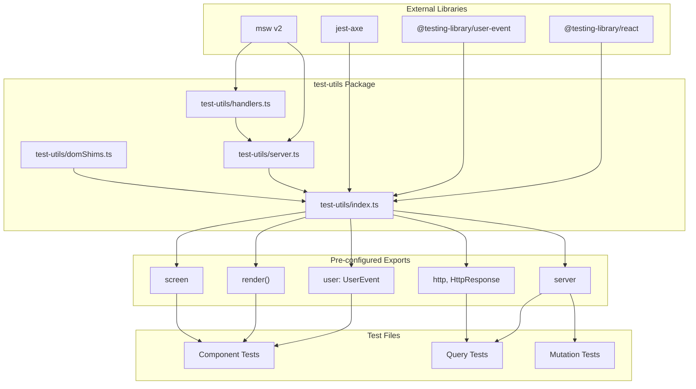
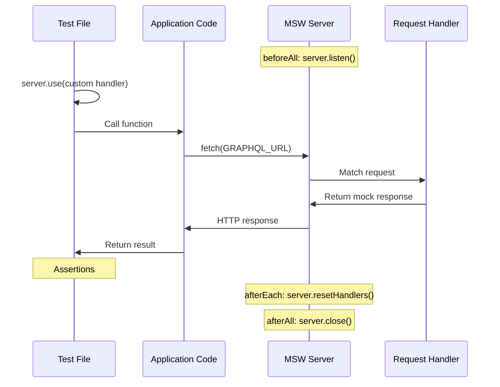
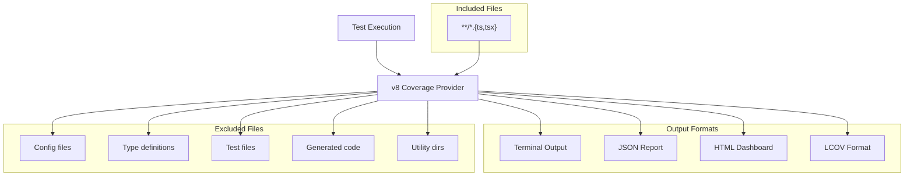
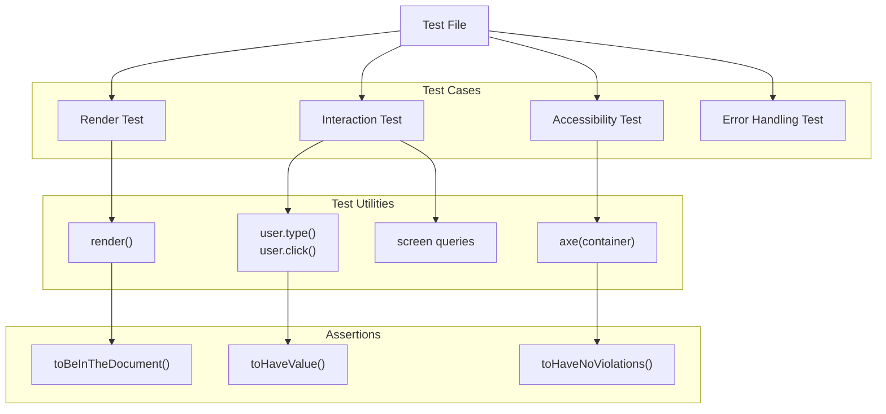
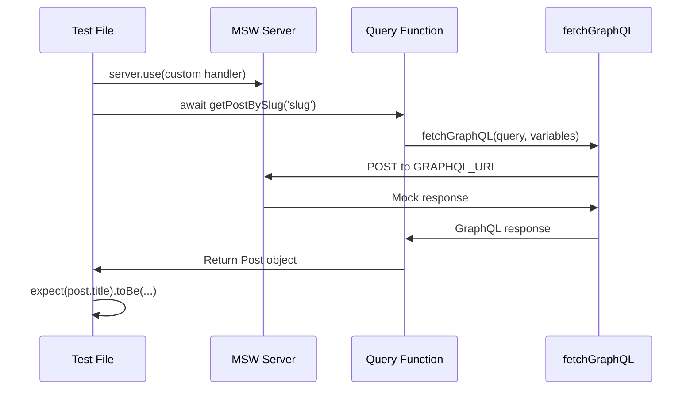
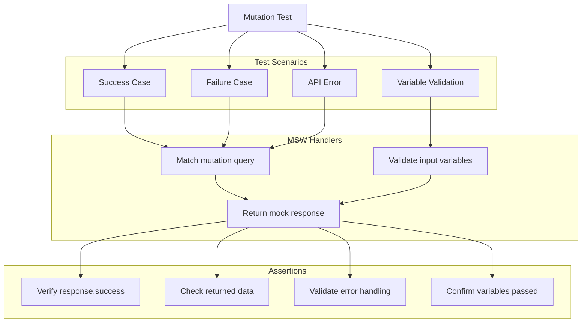
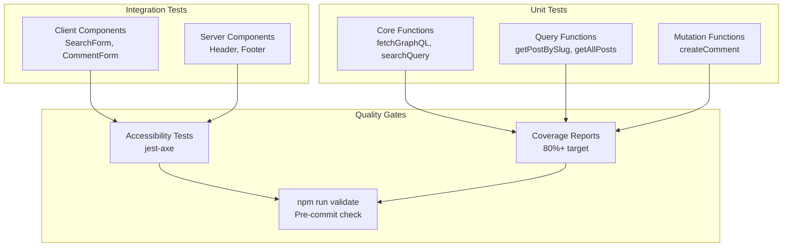
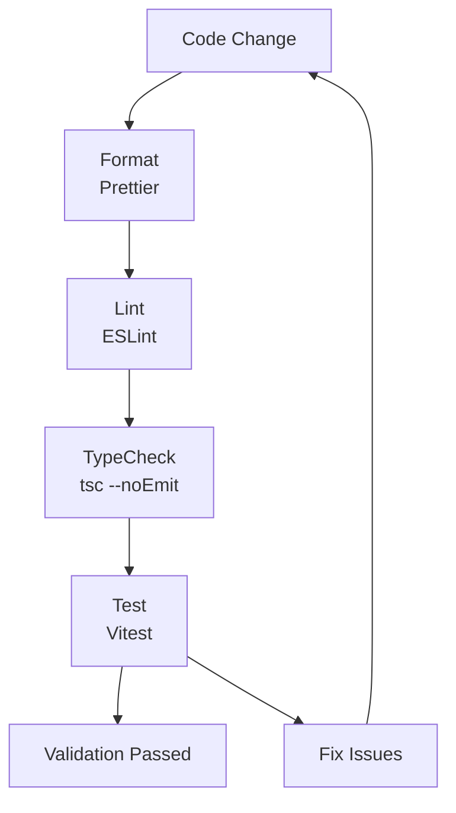

# Testing

> **Relevant source files**
> * [AGENTS.md](https://github.com/gregrickaby/nextjs-wordpress/blob/63f3f2f5/AGENTS.md)
> * [CONTRIBUTING.md](https://github.com/gregrickaby/nextjs-wordpress/blob/63f3f2f5/CONTRIBUTING.md)
> * [README.md](https://github.com/gregrickaby/nextjs-wordpress/blob/63f3f2f5/README.md)
> * [components/CommentForm.test.tsx](https://github.com/gregrickaby/nextjs-wordpress/blob/63f3f2f5/components/CommentForm.test.tsx)
> * [components/Footer.test.tsx](https://github.com/gregrickaby/nextjs-wordpress/blob/63f3f2f5/components/Footer.test.tsx)
> * [components/Header.test.tsx](https://github.com/gregrickaby/nextjs-wordpress/blob/63f3f2f5/components/Header.test.tsx)
> * [components/SearchForm.test.tsx](https://github.com/gregrickaby/nextjs-wordpress/blob/63f3f2f5/components/SearchForm.test.tsx)
> * [lib/functions.test.ts](https://github.com/gregrickaby/nextjs-wordpress/blob/63f3f2f5/lib/functions.test.ts)
> * [lib/mutations/createComment.test.ts](https://github.com/gregrickaby/nextjs-wordpress/blob/63f3f2f5/lib/mutations/createComment.test.ts)
> * [lib/queries/getAllBooks.test.ts](https://github.com/gregrickaby/nextjs-wordpress/blob/63f3f2f5/lib/queries/getAllBooks.test.ts)
> * [lib/queries/getAllPages.test.ts](https://github.com/gregrickaby/nextjs-wordpress/blob/63f3f2f5/lib/queries/getAllPages.test.ts)
> * [lib/queries/getAllPosts.test.ts](https://github.com/gregrickaby/nextjs-wordpress/blob/63f3f2f5/lib/queries/getAllPosts.test.ts)
> * [lib/queries/getBookBySlug.test.ts](https://github.com/gregrickaby/nextjs-wordpress/blob/63f3f2f5/lib/queries/getBookBySlug.test.ts)
> * [lib/queries/getCategoryBySlug.test.ts](https://github.com/gregrickaby/nextjs-wordpress/blob/63f3f2f5/lib/queries/getCategoryBySlug.test.ts)
> * [lib/queries/getPageBySlug.test.ts](https://github.com/gregrickaby/nextjs-wordpress/blob/63f3f2f5/lib/queries/getPageBySlug.test.ts)
> * [lib/queries/getPostBySlug.test.ts](https://github.com/gregrickaby/nextjs-wordpress/blob/63f3f2f5/lib/queries/getPostBySlug.test.ts)
> * [lib/queries/getPreview.test.ts](https://github.com/gregrickaby/nextjs-wordpress/blob/63f3f2f5/lib/queries/getPreview.test.ts)
> * [lib/queries/getTagBySlug.test.ts](https://github.com/gregrickaby/nextjs-wordpress/blob/63f3f2f5/lib/queries/getTagBySlug.test.ts)
> * [test-utils/domShims.ts](https://github.com/gregrickaby/nextjs-wordpress/blob/63f3f2f5/test-utils/domShims.ts)
> * [vitest.config.ts](https://github.com/gregrickaby/nextjs-wordpress/blob/63f3f2f5/vitest.config.ts)

This document describes the testing infrastructure, patterns, and best practices for the Next.js WordPress headless application. Testing is a core part of the development workflow, with comprehensive test coverage required for all components, queries, mutations, and API routes.

For information about code quality tools and validation workflows, see [Code Quality Tools](/gregrickaby/nextjs-wordpress/7.2-code-quality-tools). For CI/CD pipeline integration, see [CI/CD Pipeline](/gregrickaby/nextjs-wordpress/9.2-cicd-pipeline).

---

## Purpose and Scope

This document covers:

* Testing infrastructure setup (Vitest, React Testing Library, MSW)
* Test utilities and helper functions
* Patterns for testing components, queries, and mutations
* API mocking strategy with MSW v2
* Accessibility testing with jest-axe
* Coverage configuration and goals

---

## Testing Infrastructure

### Technology Stack

The application uses a modern testing stack designed for React Server Components and GraphQL integration:

| Technology | Purpose | Version |
| --- | --- | --- |
| **Vitest** | Fast unit test framework with SWC compilation | Latest |
| **React Testing Library** | Component testing with user-centric queries | Latest |
| **MSW v2** | HTTP request interception and mocking | v2.x |
| **jest-axe** | Accessibility testing (WCAG 2.1 AA) | Latest |
| **jsdom** | Browser environment simulation | Latest |

**Test-Driven Development Philosophy**

This is a test-driven codebase where tests must be written alongside code changes, not as an afterthought. The target is **80%+ test coverage** on critical paths, focusing on meaningful tests that validate real behavior rather than achieving 100% coverage.

Sources: [README.md L359-L382](https://github.com/gregrickaby/nextjs-wordpress/blob/63f3f2f5/README.md#L359-L382)

 [AGENTS.md L256-L276](https://github.com/gregrickaby/nextjs-wordpress/blob/63f3f2f5/AGENTS.md#L256-L276)

 [CONTRIBUTING.md L94-L105](https://github.com/gregrickaby/nextjs-wordpress/blob/63f3f2f5/CONTRIBUTING.md#L94-L105)

---

### Vitest Configuration

The Vitest configuration is defined in `vitest.config.ts` and provides:

**Configuration Diagram**



**Key Configuration Settings:**

* **Environment**: jsdom with URL set to `http://localhost:3000`
* **Globals**: Enabled for Vitest globals (describe, it, expect, etc.)
* **Setup File**: [vitest.setup.ts](https://github.com/gregrickaby/nextjs-wordpress/blob/63f3f2f5/vitest.setup.ts)  runs before all tests
* **SWC Plugin**: Fast TypeScript/JSX compilation with [@vitejs/plugin-react-swc](https://github.com/gregrickaby/nextjs-wordpress/blob/63f3f2f5/@vitejs/plugin-react-swc)
* **Path Alias**: `@/` maps to project root for consistent imports

**Coverage Exclusions:**

The configuration explicitly excludes from coverage:

* Configuration files (`*.config.*`)
* Type definitions (`*.d.ts`)
* Test files (`*.{spec,test}.{ts,tsx}`)
* Generated code (`codegen.ts`, `generated.ts`)
* Utility directories (`scripts/`, `test-utils/`, `types/`)

Sources: [vitest.config.ts L1-L47](https://github.com/gregrickaby/nextjs-wordpress/blob/63f3f2f5/vitest.config.ts#L1-L47)

---

### Test Utilities Architecture

The `test-utils` directory provides a centralized export point for all testing utilities, ensuring consistency across the test suite.

**Test Utilities Structure Diagram**



**Critical Import Pattern**

All test files **MUST** import from `@/test-utils`, never directly from external libraries:

```

```

**Pre-configured `user` Instance**

The test-utils package exports a pre-configured `user` instance created with `userEvent.setup()`. This provides:

* Consistent setup across all tests
* Single source of truth for user-event configuration
* Eliminates duplicate `setup()` calls in test files

**DOM Shims**

The [test-utils/domShims.ts](https://github.com/gregrickaby/nextjs-wordpress/blob/63f3f2f5/test-utils/domShims.ts)

 file provides polyfills for missing jsdom APIs:

* `scrollIntoView()` - No-op implementation for tests
* Installed globally in `vitest.setup.ts`

Sources: [AGENTS.md L291-L322](https://github.com/gregrickaby/nextjs-wordpress/blob/63f3f2f5/AGENTS.md#L291-L322)

 [CONTRIBUTING.md L207-L227](https://github.com/gregrickaby/nextjs-wordpress/blob/63f3f2f5/CONTRIBUTING.md#L207-L227)

 [test-utils/domShims.ts L1-L22](https://github.com/gregrickaby/nextjs-wordpress/blob/63f3f2f5/test-utils/domShims.ts#L1-L22)

---

### MSW Request Mocking Strategy

**MSW v2 Architecture**

Mock Service Worker (MSW) intercepts HTTP requests at the network level, providing a realistic testing environment without mocking `global.fetch`.



**Global MSW Setup**

MSW server lifecycle is managed in `vitest.setup.ts`:

* **`beforeAll()`**: Start MSW server with `server.listen()`
* **`afterEach()`**: Reset handlers to defaults with `server.resetHandlers()`
* **`afterAll()`**: Shut down server with `server.close()`

**Request Handler Pattern**

Tests override default handlers for specific scenarios:

```

```

**When to Override Handlers:**

* Edge cases: 404, 500, network errors
* Empty/null responses
* Malformed data
* GraphQL errors
* Specific test scenarios

**Critical Rule: Never Mock `global.fetch`**

```

```

Sources: [AGENTS.md L323-L363](https://github.com/gregrickaby/nextjs-wordpress/blob/63f3f2f5/AGENTS.md#L323-L363)

 [CONTRIBUTING.md L230-L246](https://github.com/gregrickaby/nextjs-wordpress/blob/63f3f2f5/CONTRIBUTING.md#L230-L246)

---

## Running Tests

### Test Commands

The application provides several npm scripts for running tests:

| Command | Purpose |
| --- | --- |
| `npm test` | Run all tests once (CI mode) |
| `npm run test:watch` | Run tests in watch mode for development |
| `npm run test:ui` | Launch interactive Vitest UI for debugging |
| `npm run test:coverage` | Generate coverage report |
| `npm run validate` | Run complete validation suite (format → lint → typecheck → test) |

**Most Common Workflow:**

```

```

Sources: [README.md L367-L375](https://github.com/gregrickaby/nextjs-wordpress/blob/63f3f2f5/README.md#L367-L375)

 [AGENTS.md L277-L289](https://github.com/gregrickaby/nextjs-wordpress/blob/63f3f2f5/AGENTS.md#L277-L289)

 [CONTRIBUTING.md L106-L117](https://github.com/gregrickaby/nextjs-wordpress/blob/63f3f2f5/CONTRIBUTING.md#L106-L117)

---

### Coverage Configuration

**Coverage Reporting Flow**



**Coverage Goals:**

* **Target**: 80%+ test coverage on critical paths
* **Philosophy**: Focus on meaningful tests, not 100% coverage
* **Acceptable**: Some unreachable edge cases may be uncovered
* **Priority**: Tests should validate real behavior and add value

**Coverage Report Location:**

After running `npm run test:coverage`, reports are generated in:

* Terminal: Immediate summary output
* HTML: `coverage/index.html` (detailed interactive report)
* LCOV: `coverage/lcov.info` (for CI integration)

Sources: [vitest.config.ts L32-L44](https://github.com/gregrickaby/nextjs-wordpress/blob/63f3f2f5/vitest.config.ts#L32-L44)

 [AGENTS.md L256-L276](https://github.com/gregrickaby/nextjs-wordpress/blob/63f3f2f5/AGENTS.md#L256-L276)

 [CONTRIBUTING.md L256-L264](https://github.com/gregrickaby/nextjs-wordpress/blob/63f3f2f5/CONTRIBUTING.md#L256-L264)

---

## Writing Tests

### Component Testing Pattern

Component tests validate rendering, user interactions, and accessibility compliance.

**Component Test Structure**



**Example: Client Component Test**

The [components/SearchForm.test.tsx](https://github.com/gregrickaby/nextjs-wordpress/blob/63f3f2f5/components/SearchForm.test.tsx)

 demonstrates comprehensive component testing:

Key patterns in this test file:

* **Rendering**: Verify elements appear with `screen.getByRole()`
* **User Input**: Type with `await user.type(searchInput, 'query')`
* **Debouncing**: Wait for async operations with `waitFor()`
* **Accessibility**: Check with `await axe(container)`
* **Error Handling**: Mock failures and verify graceful degradation

**Example: Server Component Test**

Server Components require special handling because they are async functions:

```

```

See [components/Header.test.tsx L32-L40](https://github.com/gregrickaby/nextjs-wordpress/blob/63f3f2f5/components/Header.test.tsx#L32-L40)

 for full example.

Sources: [components/SearchForm.test.tsx L1-L236](https://github.com/gregrickaby/nextjs-wordpress/blob/63f3f2f5/components/SearchForm.test.tsx#L1-L236)

 [components/CommentForm.test.tsx L1-L257](https://github.com/gregrickaby/nextjs-wordpress/blob/63f3f2f5/components/CommentForm.test.tsx#L1-L257)

 [components/Header.test.tsx L1-L49](https://github.com/gregrickaby/nextjs-wordpress/blob/63f3f2f5/components/Header.test.tsx#L1-L49)

 [AGENTS.md L364-L435](https://github.com/gregrickaby/nextjs-wordpress/blob/63f3f2f5/AGENTS.md#L364-L435)

 [CONTRIBUTING.md L132-L159](https://github.com/gregrickaby/nextjs-wordpress/blob/63f3f2f5/CONTRIBUTING.md#L132-L159)

---

### Query Function Testing Pattern

GraphQL query functions are tested using MSW to mock the WordPress GraphQL endpoint.

**Query Test Flow**



**Example: Query Test Structure**

The [lib/queries/getPostBySlug.test.ts](https://github.com/gregrickaby/nextjs-wordpress/blob/63f3f2f5/lib/queries/getPostBySlug.test.ts)

 shows the standard query testing pattern:

**Test Cases Covered:**

1. **Success Case**: Mock valid response, verify data extraction
2. **Not Found**: Mock null response, verify `null` return
3. **API Error**: Mock error response, verify graceful handling

**Key Patterns:**

* Use `server.use()` to override default handlers
* Mock `process.env.NEXT_PUBLIC_WORDPRESS_GRAPHQL_URL` endpoint
* Test both data path (`response.data.post`) and error path
* Verify null safety and graceful degradation

**Additional Query Tests:**

* [lib/queries/getAllPosts.test.ts](https://github.com/gregrickaby/nextjs-wordpress/blob/63f3f2f5/lib/queries/getAllPosts.test.ts)  - Collection queries returning arrays
* [lib/queries/getPageBySlug.test.ts](https://github.com/gregrickaby/nextjs-wordpress/blob/63f3f2f5/lib/queries/getPageBySlug.test.ts)  - Page queries with author data
* [lib/queries/getBookBySlug.test.ts](https://github.com/gregrickaby/nextjs-wordpress/blob/63f3f2f5/lib/queries/getBookBySlug.test.ts)  - Custom post types with ACF fields
* [lib/queries/getPreview.test.ts](https://github.com/gregrickaby/nextjs-wordpress/blob/63f3f2f5/lib/queries/getPreview.test.ts)  - Preview with JWT authentication
* [lib/queries/getTagBySlug.test.ts](https://github.com/gregrickaby/nextjs-wordpress/blob/63f3f2f5/lib/queries/getTagBySlug.test.ts)  - Taxonomy queries with limit parameter
* [lib/queries/getCategoryBySlug.test.ts](https://github.com/gregrickaby/nextjs-wordpress/blob/63f3f2f5/lib/queries/getCategoryBySlug.test.ts)  - Category archive queries

Sources: [lib/queries/getPostBySlug.test.ts L1-L94](https://github.com/gregrickaby/nextjs-wordpress/blob/63f3f2f5/lib/queries/getPostBySlug.test.ts#L1-L94)

 [lib/queries/getAllPosts.test.ts L1-L94](https://github.com/gregrickaby/nextjs-wordpress/blob/63f3f2f5/lib/queries/getAllPosts.test.ts#L1-L94)

 [lib/queries/getBookBySlug.test.ts L1-L98](https://github.com/gregrickaby/nextjs-wordpress/blob/63f3f2f5/lib/queries/getBookBySlug.test.ts#L1-L98)

 [AGENTS.md L385-L415](https://github.com/gregrickaby/nextjs-wordpress/blob/63f3f2f5/AGENTS.md#L385-L415)

 [CONTRIBUTING.md L161-L204](https://github.com/gregrickaby/nextjs-wordpress/blob/63f3f2f5/CONTRIBUTING.md#L161-L204)

---

### Mutation Testing Pattern

GraphQL mutations are tested similarly to queries but focus on write operations and success/failure handling.

**Mutation Test Pattern**



**Example: Comment Mutation Test**

The [lib/mutations/createComment.test.ts](https://github.com/gregrickaby/nextjs-wordpress/blob/63f3f2f5/lib/mutations/createComment.test.ts)

 demonstrates mutation testing:

**Test Cases:**

1. **Successful Creation** ([line 14-47](https://github.com/gregrickaby/nextjs-wordpress/blob/63f3f2f5/line 14-47) ): Mock success response, verify comment data returned
2. **Without Website** ([line 49-82](https://github.com/gregrickaby/nextjs-wordpress/blob/63f3f2f5/line 49-82) ): Test optional field handling
3. **API Errors** ([line 84-101](https://github.com/gregrickaby/nextjs-wordpress/blob/63f3f2f5/line 84-101) ): Verify error throwing on GraphQL errors
4. **Network Errors** ([line 103-111](https://github.com/gregrickaby/nextjs-wordpress/blob/63f3f2f5/line 103-111) ): Test network failure handling
5. **Variable Validation** ([line 113-161](https://github.com/gregrickaby/nextjs-wordpress/blob/63f3f2f5/line 113-161) ): Capture and verify input variables

**Key Mutation Patterns:**

* Check request body to verify correct variables sent
* Test both success and failure response shapes
* Verify error handling with `expect().rejects.toThrow()`
* Validate optional vs required fields

Sources: [lib/mutations/createComment.test.ts L1-L162](https://github.com/gregrickaby/nextjs-wordpress/blob/63f3f2f5/lib/mutations/createComment.test.ts#L1-L162)

---

### Core Function Testing

The core data fetching utilities are tested to ensure proper caching and error handling.

**fetchGraphQL Test Coverage**

The [lib/functions.test.ts](https://github.com/gregrickaby/nextjs-wordpress/blob/63f3f2f5/lib/functions.test.ts)

 validates the core GraphQL fetching function:

**Test Scenarios:**

* **Success** ([line 17-37](https://github.com/gregrickaby/nextjs-wordpress/blob/63f3f2f5/line 17-37) ): Verify data extraction from GraphQL response
* **GraphQL Errors** ([line 39-58](https://github.com/gregrickaby/nextjs-wordpress/blob/63f3f2f5/line 39-58) ): Handle `errors` array in response
* **Network Errors** ([line 60-71](https://github.com/gregrickaby/nextjs-wordpress/blob/63f3f2f5/line 60-71) ): Graceful degradation on network failure
* **Variables** ([line 73-92](https://github.com/gregrickaby/nextjs-wordpress/blob/63f3f2f5/line 73-92) ): Verify variables passed correctly to GraphQL
* **Malformed Response** ([line 111-122](https://github.com/gregrickaby/nextjs-wordpress/blob/63f3f2f5/line 111-122) ): Handle missing `data` field
* **Empty Response** ([line 124-134](https://github.com/gregrickaby/nextjs-wordpress/blob/63f3f2f5/line 124-134) ): Handle null HTTP body

**searchQuery Test Coverage**

REST API search function tests ([line 137-273](https://github.com/gregrickaby/nextjs-wordpress/blob/63f3f2f5/line 137-273)

):

* Search parameter encoding
* Empty query handling
* API error responses (500)
* Network errors
* Malformed JSON responses
* Null response data

Sources: [lib/functions.test.ts L1-L274](https://github.com/gregrickaby/nextjs-wordpress/blob/63f3f2f5/lib/functions.test.ts#L1-L274)

---

## Testing Best Practices

### Co-located Test Files

All test files are co-located with the code they test:

```
components/
  Header.tsx
  Header.test.tsx        ✅ Test next to component

lib/
  queries/
    getPostBySlug.ts
    getPostBySlug.test.ts  ✅ Test next to query
  
  mutations/
    createComment.ts
    createComment.test.ts  ✅ Test next to mutation
```

This organization ensures:

* Tests are easy to find when modifying code
* Clear relationship between source and test
* Easier to identify missing test coverage

Sources: [CONTRIBUTING.md L118-L130](https://github.com/gregrickaby/nextjs-wordpress/blob/63f3f2f5/CONTRIBUTING.md#L118-L130)

---

### Accessibility Testing

Every component must include accessibility tests using jest-axe:

**Accessibility Test Pattern**

```

```

**WCAG Compliance Target**: WCAG 2.1 AA

This validates:

* Proper semantic HTML structure
* ARIA attributes and roles
* Keyboard navigation support
* Color contrast ratios
* Form label associations

Examples:

* [components/SearchForm.test.tsx L230-L235](https://github.com/gregrickaby/nextjs-wordpress/blob/63f3f2f5/components/SearchForm.test.tsx#L230-L235)
* [components/CommentForm.test.tsx L251-L256](https://github.com/gregrickaby/nextjs-wordpress/blob/63f3f2f5/components/CommentForm.test.tsx#L251-L256)
* [components/Header.test.tsx L42-L47](https://github.com/gregrickaby/nextjs-wordpress/blob/63f3f2f5/components/Header.test.tsx#L42-L47)
* [components/Footer.test.tsx L14-L19](https://github.com/gregrickaby/nextjs-wordpress/blob/63f3f2f5/components/Footer.test.tsx#L14-L19)

Sources: [AGENTS.md L368-L377](https://github.com/gregrickaby/nextjs-wordpress/blob/63f3f2f5/AGENTS.md#L368-L377)

 [CONTRIBUTING.md L153-L158](https://github.com/gregrickaby/nextjs-wordpress/blob/63f3f2f5/CONTRIBUTING.md#L153-L158)

---

### Test Data-Driven Testing

Use `it.each()` to minimize test duplication with data-driven patterns:

**Benefits:**

* Reduces code duplication
* Makes test cases more visible
* Easier to add new test scenarios
* Improves maintainability

**Example Pattern:**

```

```

Sources: [AGENTS.md L436-L443](https://github.com/gregrickaby/nextjs-wordpress/blob/63f3f2f5/AGENTS.md#L436-L443)

---

### Error Handling Tests

Always test error scenarios alongside happy paths:

**Error Test Checklist:**

* ✅ Network errors (connection failures)
* ✅ HTTP errors (404, 500, 503)
* ✅ GraphQL errors in response
* ✅ Null/undefined data
* ✅ Malformed responses
* ✅ Empty arrays/objects
* ✅ Missing optional fields

**Example Error Test:**

```

```

Sources: [lib/queries/getAllPosts.test.ts L63-L78](https://github.com/gregrickaby/nextjs-wordpress/blob/63f3f2f5/lib/queries/getAllPosts.test.ts#L63-L78)

 [lib/functions.test.ts L60-L71](https://github.com/gregrickaby/nextjs-wordpress/blob/63f3f2f5/lib/functions.test.ts#L60-L71)

---

## Test Organization Summary

**Testing Layers:**



**File Structure:**

| Directory | Test Types | Examples |
| --- | --- | --- |
| `components/` | Component tests | `SearchForm.test.tsx`, `CommentForm.test.tsx` |
| `lib/queries/` | Query function tests | `getPostBySlug.test.ts`, `getAllPosts.test.ts` |
| `lib/mutations/` | Mutation tests | `createComment.test.ts` |
| `lib/` | Utility tests | `functions.test.ts` |
| `test-utils/` | Testing utilities | `index.ts`, `domShims.ts`, `server.ts` |

Sources: [vitest.config.ts L26-L42](https://github.com/gregrickaby/nextjs-wordpress/blob/63f3f2f5/vitest.config.ts#L26-L42)

 [CONTRIBUTING.md L118-L130](https://github.com/gregrickaby/nextjs-wordpress/blob/63f3f2f5/CONTRIBUTING.md#L118-L130)

---

## Validation Workflow

**Complete Validation Pipeline:**



**Single Command Validation:**

```

```

This runs sequentially:

1. **Format** - Apply Prettier and ESLint auto-fixes
2. **Lint** - Check for linting errors
3. **TypeCheck** - Verify TypeScript compilation
4. **Test** - Run all unit tests

**Pre-commit Enforcement:**

Lefthook runs validation checks on staged files before allowing commits (see [Git Hooks](/gregrickaby/nextjs-wordpress/7.3-git-hooks)).

Sources: [AGENTS.md L173-L221](https://github.com/gregrickaby/nextjs-wordpress/blob/63f3f2f5/AGENTS.md#L173-L221)

 [CONTRIBUTING.md L106-L117](https://github.com/gregrickaby/nextjs-wordpress/blob/63f3f2f5/CONTRIBUTING.md#L106-L117)

---

## Summary

The testing infrastructure provides:

* **Comprehensive Framework**: Vitest + React Testing Library + MSW v2
* **Pre-configured Utilities**: Centralized test-utils with consistent patterns
* **API Mocking**: MSW v2 for realistic HTTP interception (no fetch mocking)
* **Accessibility**: Mandatory jest-axe checks for WCAG 2.1 AA compliance
* **Coverage Tracking**: v8 provider with 80%+ target on critical paths
* **Co-located Tests**: Tests live next to source files for easy maintenance
* **Validation Pipeline**: Automated quality gates via `npm run validate`

**Key Testing Principles:**

1. ✅ Always import from `@/test-utils`
2. ✅ Use MSW v2 for HTTP mocking (never mock `global.fetch`)
3. ✅ Use pre-configured `user` instance for interactions
4. ✅ Test accessibility with jest-axe on all components
5. ✅ Focus on behavior, not implementation
6. ✅ Test error cases alongside happy paths
7. ✅ Target 80%+ coverage on meaningful tests
8. ✅ Write tests alongside code changes (TDD)

Sources: [README.md L359-L382](https://github.com/gregrickaby/nextjs-wordpress/blob/63f3f2f5/README.md#L359-L382)

 [AGENTS.md L256-L494](https://github.com/gregrickaby/nextjs-wordpress/blob/63f3f2f5/AGENTS.md#L256-L494)

 [CONTRIBUTING.md L94-L264](https://github.com/gregrickaby/nextjs-wordpress/blob/63f3f2f5/CONTRIBUTING.md#L94-L264)