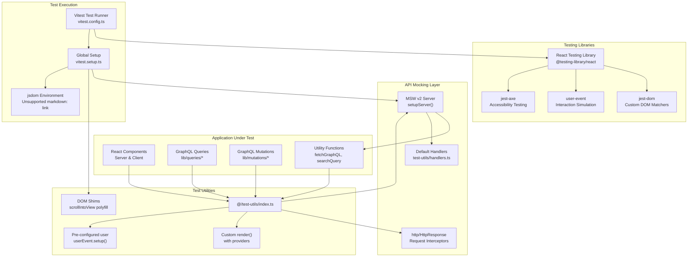
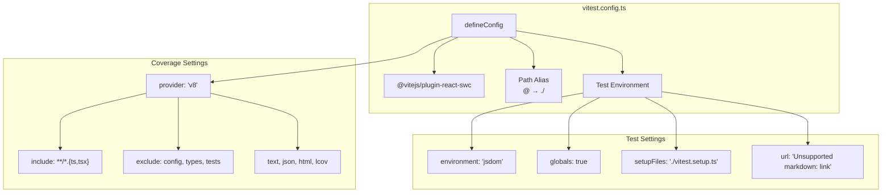
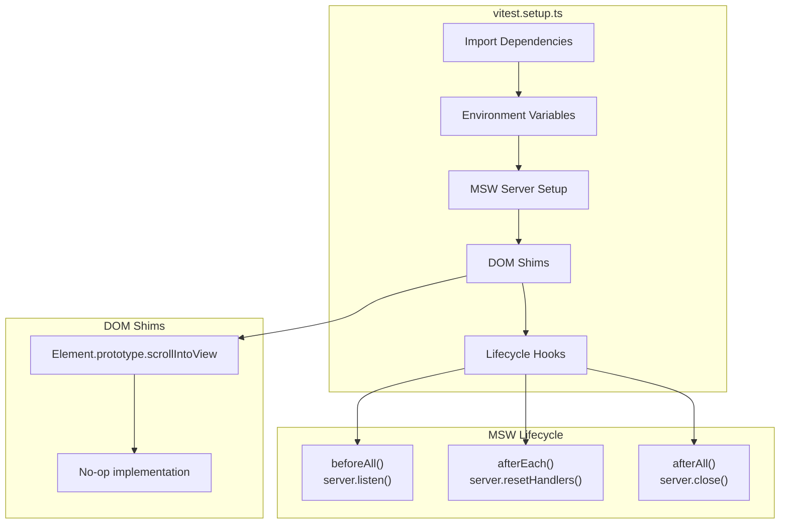
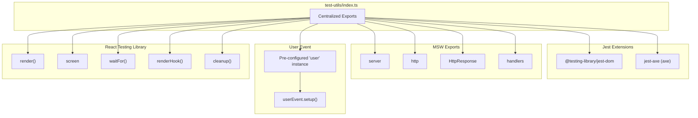
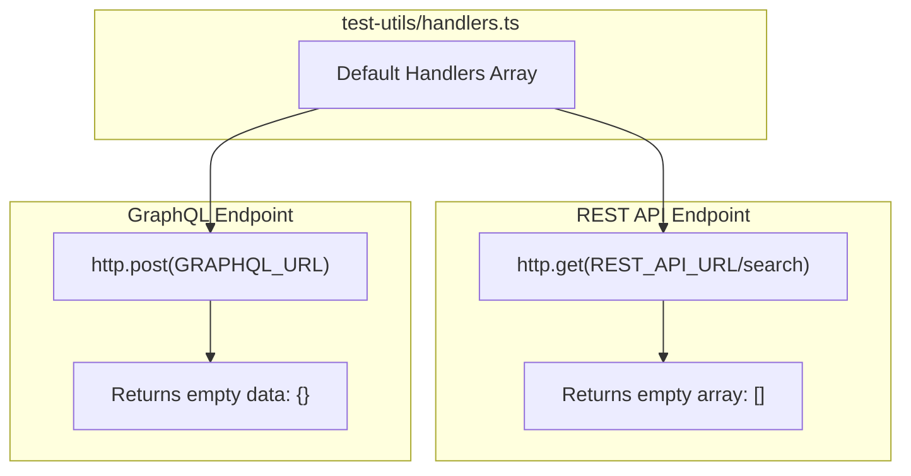
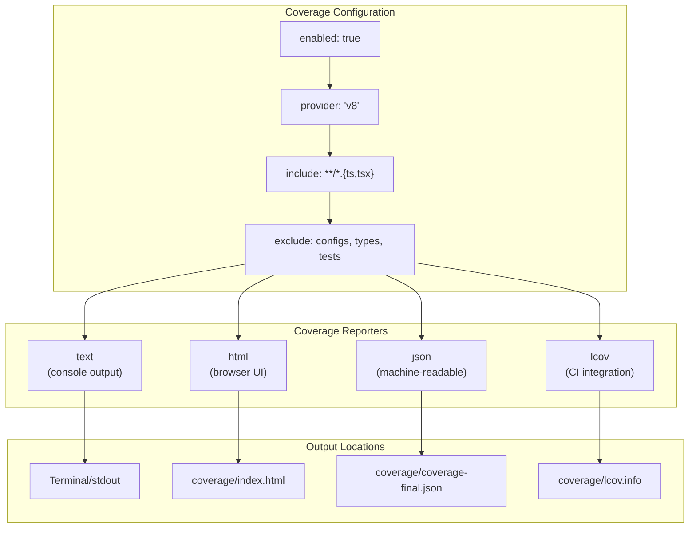
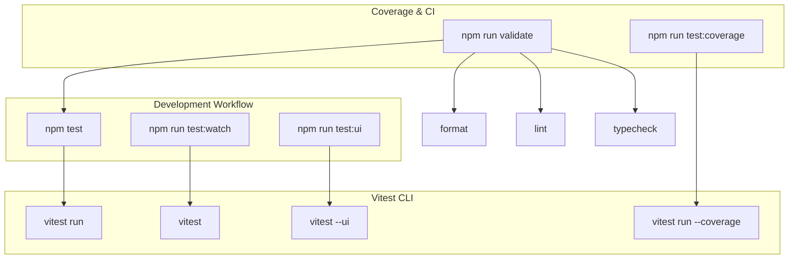
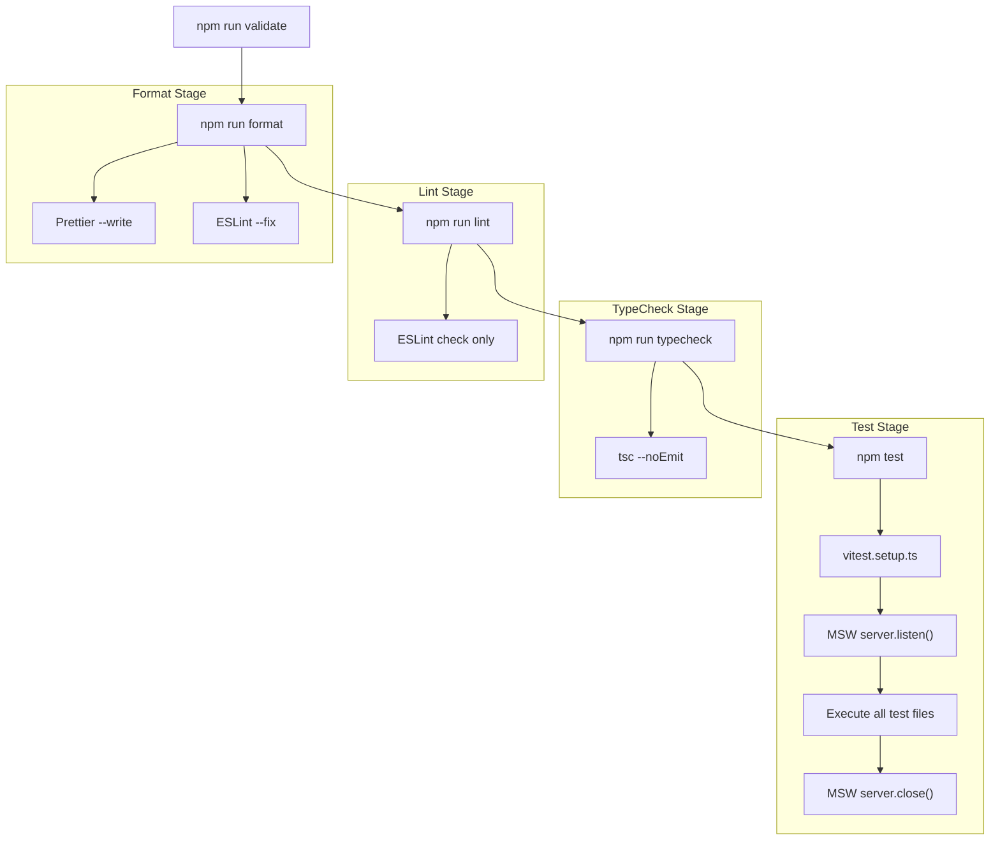
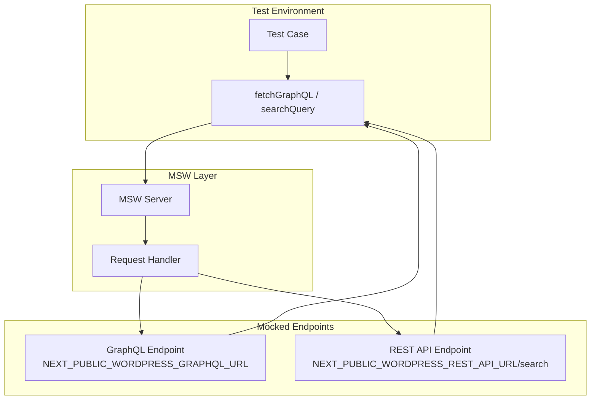
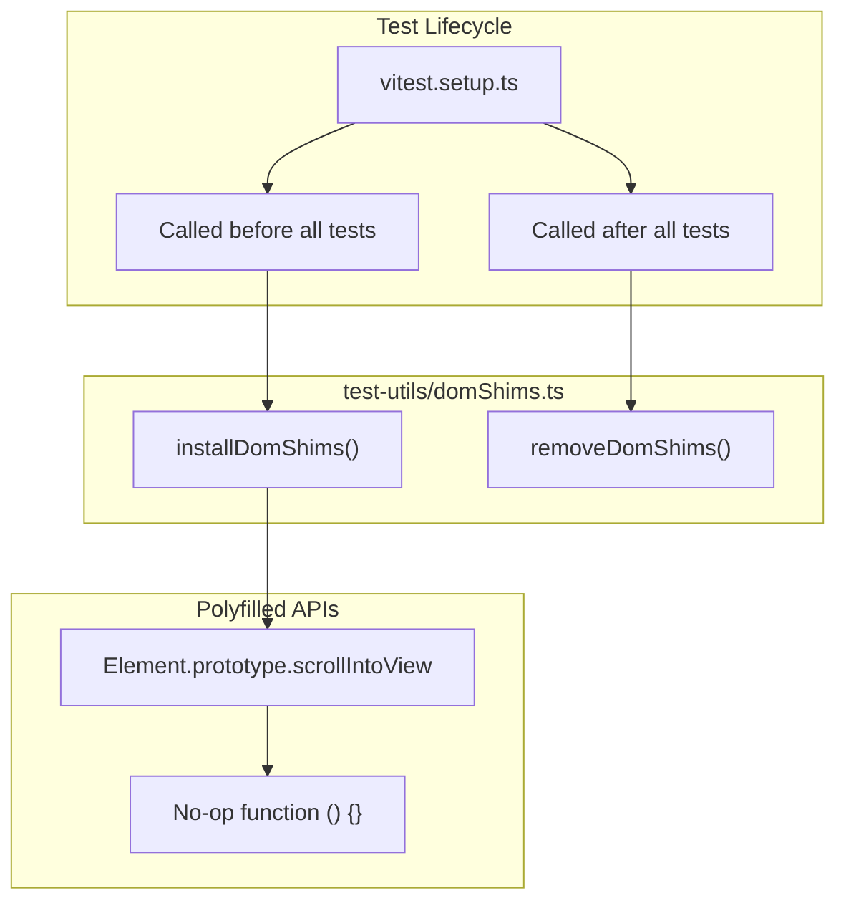

---
layout: default
title: Testing Infrastructure
parent: Testing
nav_order: 1
---

# Testing Infrastructure

> **Relevant source files**
> * [AGENTS.md](https://github.com/gregrickaby/nextjs-wordpress/blob/63f3f2f5/AGENTS.md)
> * [CONTRIBUTING.md](https://github.com/gregrickaby/nextjs-wordpress/blob/63f3f2f5/CONTRIBUTING.md)
> * [README.md](https://github.com/gregrickaby/nextjs-wordpress/blob/63f3f2f5/README.md)
> * [components/CommentForm.test.tsx](https://github.com/gregrickaby/nextjs-wordpress/blob/63f3f2f5/components/CommentForm.test.tsx)
> * [components/Footer.test.tsx](https://github.com/gregrickaby/nextjs-wordpress/blob/63f3f2f5/components/Footer.test.tsx)
> * [components/Header.test.tsx](https://github.com/gregrickaby/nextjs-wordpress/blob/63f3f2f5/components/Header.test.tsx)
> * [components/SearchForm.test.tsx](https://github.com/gregrickaby/nextjs-wordpress/blob/63f3f2f5/components/SearchForm.test.tsx)
> * [lib/functions.test.ts](https://github.com/gregrickaby/nextjs-wordpress/blob/63f3f2f5/lib/functions.test.ts)
> * [lib/queries/getAllPosts.test.ts](https://github.com/gregrickaby/nextjs-wordpress/blob/63f3f2f5/lib/queries/getAllPosts.test.ts)
> * [lib/queries/getPostBySlug.test.ts](https://github.com/gregrickaby/nextjs-wordpress/blob/63f3f2f5/lib/queries/getPostBySlug.test.ts)
> * [package-lock.json](https://github.com/gregrickaby/nextjs-wordpress/blob/63f3f2f5/package-lock.json)
> * [package.json](https://github.com/gregrickaby/nextjs-wordpress/blob/63f3f2f5/package.json)
> * [test-utils/domShims.ts](https://github.com/gregrickaby/nextjs-wordpress/blob/63f3f2f5/test-utils/domShims.ts)
> * [vitest.config.ts](https://github.com/gregrickaby/nextjs-wordpress/blob/63f3f2f5/vitest.config.ts)

This document describes the testing infrastructure for the Next.js WordPress headless application. It covers the testing frameworks, configuration, utilities, and tooling that enable test-driven development practices.

**Scope:** This page focuses on the technical setup of the testing infrastructure, including Vitest configuration, MSW v2 integration, test utilities, and coverage reporting. For information about writing tests and best practices, see [Writing Tests](/gregrickaby/nextjs-wordpress/8.2-writing-tests). For coverage requirements and reporting, see [Test Coverage](/gregrickaby/nextjs-wordpress/8.3-test-coverage).

---

## Testing Stack Overview

The application uses a modern testing stack designed for Next.js 16 applications with React 19 Server Components:

| Tool | Version | Purpose |
| --- | --- | --- |
| Vitest | ^4.0.14 | Fast unit test framework with SWC plugin |
| React Testing Library | ^16.3.0 | Component testing with user-centric queries |
| MSW v2 | ^2.12.3 | HTTP request mocking via Service Worker API |
| jest-axe | ^10.0.0 | Accessibility testing (WCAG 2.1 AA compliance) |
| @testing-library/jest-dom | ^6.9.1 | Custom matchers for DOM assertions |
| @testing-library/user-event | ^14.6.1 | Simulates user interactions |
| @vitest/ui | ^4.0.14 | Interactive UI for test debugging |
| @vitest/coverage-v8 | ^4.0.14 | V8-based code coverage reporting |

**Sources:** [package.json L37-L71](https://github.com/gregrickaby/nextjs-wordpress/blob/63f3f2f5/package.json#L37-L71)

---

## Testing Architecture

### Test Stack Integration



**Sources:** [vitest.config.ts L1-L46](https://github.com/gregrickaby/nextjs-wordpress/blob/63f3f2f5/vitest.config.ts#L1-L46)

 [vitest.setup.ts](https://github.com/gregrickaby/nextjs-wordpress/blob/63f3f2f5/vitest.setup.ts)

 (referenced), [test-utils/index.ts](https://github.com/gregrickaby/nextjs-wordpress/blob/63f3f2f5/test-utils/index.ts)

 (referenced), [package.json L42-L59](https://github.com/gregrickaby/nextjs-wordpress/blob/63f3f2f5/package.json#L42-L59)

---

## Vitest Configuration

The test runner is configured in `vitest.config.ts` with settings optimized for Next.js applications:

### Core Configuration



**Key Configuration:**

| Setting | Value | Purpose |
| --- | --- | --- |
| `environment` | `'jsdom'` | Browser-like DOM environment for React testing |
| `globals` | `true` | Enables global test APIs (describe, it, expect) |
| `setupFiles` | `'./vitest.setup.ts'` | Global test setup executed before all tests |
| `environmentOptions.jsdom.url` | `'http://localhost:3000'` | Base URL for `window.location` in tests |

**Sources:** [vitest.config.ts L10-L25](https://github.com/gregrickaby/nextjs-wordpress/blob/63f3f2f5/vitest.config.ts#L10-L25)

### Path Alias Resolution

The configuration includes Next.js path alias mapping for consistent imports:

* **Alias:** `@` → `./` (project root)
* **Purpose:** Matches Next.js `tsconfig.json` paths for seamless imports

**Sources:** [vitest.config.ts L12-L15](https://github.com/gregrickaby/nextjs-wordpress/blob/63f3f2f5/vitest.config.ts#L12-L15)

### Exclusion Patterns

Tests exclude certain directories and file types to focus on application code:

**Excluded from Test Discovery:**

```
**/.{idea,git,cache,output,temp}/**
**/dist/**
**/node_modules/**
**/{karma,rollup,webpack,vite,vitest,jest,ava,babel,nyc,cypress,tsup,build}.config.*
```

**Excluded from Coverage:**

```markdown
**/*.config.*          # Configuration files
**/*.d.ts              # Type declaration files
**/*.{spec,test}.{ts,tsx}  # Test files themselves
**/{codegen,generated}.ts  # Auto-generated files
**/{scripts,test-utils,types}/**  # Utility directories
```

**Sources:** [vitest.config.ts L26-L43](https://github.com/gregrickaby/nextjs-wordpress/blob/63f3f2f5/vitest.config.ts#L26-L43)

---

## Global Test Setup

### Setup File Architecture



The global setup file configures the test environment before any tests run:

**Environment Variables:**

```
process.env.NEXT_PUBLIC_WORDPRESS_GRAPHQL_URL = 'https://blog.nextjswp.com/graphql'
process.env.NEXT_PUBLIC_WORDPRESS_REST_API_URL = 'https://blog.nextjswp.com/wp-json/wp/v2'
```

These match the production WordPress backend URLs for consistency in mocking.

**MSW Server Lifecycle:**

1. `beforeAll()` - Starts MSW server to intercept HTTP requests
2. `afterEach()` - Resets handlers to default state between tests
3. `afterAll()` - Shuts down MSW server after all tests complete

**DOM Shims:**

The setup installs polyfills for missing jsdom APIs:

* `Element.prototype.scrollIntoView` - Provides no-op implementation for React Testing Library

**Sources:** [test-utils/domShims.ts L1-L21](https://github.com/gregrickaby/nextjs-wordpress/blob/63f3f2f5/test-utils/domShims.ts#L1-L21)

 [AGENTS.md L326-L329](https://github.com/gregrickaby/nextjs-wordpress/blob/63f3f2f5/AGENTS.md#L326-L329)

---

## Test Utilities Module

### Centralized Test Utilities

The `@/test-utils` module provides a single import location for all testing dependencies, ensuring consistent configuration across tests:



**Critical Pattern:** All tests MUST import from `@/test-utils`, never directly from testing libraries:

```javascript
// ✅ CORRECT
import {render, screen, user, server, http, HttpResponse} from '@/test-utils'

// ❌ WRONG
import {render, screen} from '@testing-library/react'
import userEvent from '@testing-library/user-event'
```

**Pre-configured User Instance:**

The module exports a pre-configured `user` instance that eliminates duplicate `userEvent.setup()` calls:

```javascript
// Exported from @/test-utils
export const user = userEvent.setup()
```

This provides:

* Consistent user event configuration across all tests
* Single source of truth for interaction simulation
* Eliminates boilerplate in every test file

**Sources:** [AGENTS.md L292-L320](https://github.com/gregrickaby/nextjs-wordpress/blob/63f3f2f5/AGENTS.md#L292-L320)

 [components/SearchForm.test.tsx L2](https://github.com/gregrickaby/nextjs-wordpress/blob/63f3f2f5/components/SearchForm.test.tsx#L2-L2)

 [components/CommentForm.test.tsx L2](https://github.com/gregrickaby/nextjs-wordpress/blob/63f3f2f5/components/CommentForm.test.tsx#L2-L2)

---

## MSW v2 HTTP Mocking

### Request Interception Architecture

```mermaid
sequenceDiagram
  participant Test Case
  participant Component/Function
  participant fetch()
  participant MSW Server
  participant Request Handler
  participant HttpResponse

  note over MSW Server: beforeAll: server.listen()
  Test Case->>Test Case: server.use(handler)
  Test Case->>Component/Function: Call function/render
  Component/Function->>fetch(): fetch(GRAPHQL_URL, {body: query})
  fetch()->>MSW Server: Request intercepted
  MSW Server->>Request Handler: Match URL + method
  Request Handler->>HttpResponse: HttpResponse.json(data)
  HttpResponse->>MSW Server: Return response
  MSW Server->>Component/Function: Mocked response
  Component/Function->>Test Case: Result returned
  note over MSW Server: afterEach: server.resetHandlers()
```

**MSW v2 replaces traditional fetch mocking:**

| ❌ Never Do This | ✅ Always Do This |
| --- | --- |
| `global.fetch = vi.fn()` | Use MSW request handlers |
| `vi.mock('node-fetch')` | Use `server.use()` in tests |
| `fetchMock.mockResponse()` | Use `http.post()` + `HttpResponse` |

**Critical Rule:** Never mock `global.fetch` directly. MSW v2 provides service worker-based interception that works across all HTTP clients.

**Sources:** [AGENTS.md L322-L353](https://github.com/gregrickaby/nextjs-wordpress/blob/63f3f2f5/AGENTS.md#L322-L353)

 [lib/functions.test.ts L1-L135](https://github.com/gregrickaby/nextjs-wordpress/blob/63f3f2f5/lib/functions.test.ts#L1-L135)

### Default Handlers

Default MSW handlers are configured for common WordPress API endpoints:



Tests override these defaults using `server.use()` for specific test cases.

**Sources:** [AGENTS.md L391-L413](https://github.com/gregrickaby/nextjs-wordpress/blob/63f3f2f5/AGENTS.md#L391-L413)

### Request Handler Patterns

**GraphQL Endpoint Mocking:**

```javascript
server.use(
  http.post(process.env.NEXT_PUBLIC_WORDPRESS_GRAPHQL_URL, () => {
    return HttpResponse.json({
      data: {posts: {nodes: [{title: 'Test Post'}]}}
    })
  })
)
```

**REST API Endpoint Mocking:**

```javascript
server.use(
  http.get(`${process.env.NEXT_PUBLIC_WORDPRESS_REST_API_URL}/search`, () => {
    return HttpResponse.json([{id: 1, title: 'Test'}])
  })
)
```

**Error Response Mocking:**

```javascript
server.use(
  http.post(process.env.NEXT_PUBLIC_WORDPRESS_GRAPHQL_URL, () => {
    return new HttpResponse(null, {status: 500})
  })
)
```

**Sources:** [lib/functions.test.ts L18-L31](https://github.com/gregrickaby/nextjs-wordpress/blob/63f3f2f5/lib/functions.test.ts#L18-L31)

 [lib/functions.test.ts L143-L168](https://github.com/gregrickaby/nextjs-wordpress/blob/63f3f2f5/lib/functions.test.ts#L143-L168)

 [lib/functions.test.ts L60-L71](https://github.com/gregrickaby/nextjs-wordpress/blob/63f3f2f5/lib/functions.test.ts#L60-L71)

---

## Coverage Configuration

### Coverage Reporting



**Coverage Inclusion:**

Only application code is included in coverage metrics:

* `**/*.{ts,tsx}` - All TypeScript and TSX files

**Coverage Exclusion:**

The following are excluded from coverage:

* `**/*.config.*` - Configuration files (next.config.ts, vitest.config.ts, etc.)
* `**/*.d.ts` - Type declaration files
* `**/*.{spec,test}.{ts,tsx}` - Test files themselves
* `**/{codegen,generated}.ts` - Auto-generated GraphQL types
* `**/{scripts,test-utils,types}/**` - Utility and tooling directories

**Sources:** [vitest.config.ts L32-L44](https://github.com/gregrickaby/nextjs-wordpress/blob/63f3f2f5/vitest.config.ts#L32-L44)

### Coverage Reporters

Four coverage reporters are configured for different use cases:

| Reporter | Output | Use Case |
| --- | --- | --- |
| `text` | Console | Quick feedback during development |
| `json` | `coverage/coverage-final.json` | CI/CD integration and tooling |
| `html` | `coverage/index.html` | Interactive browser-based report |
| `lcov` | `coverage/lcov.info` | SonarQube and coverage badges |

**Sources:** [vitest.config.ts L43](https://github.com/gregrickaby/nextjs-wordpress/blob/63f3f2f5/vitest.config.ts#L43-L43)

---

## Test Execution Scripts

### Available Commands



**Command Reference:**

| Command | Execution | Use Case |
| --- | --- | --- |
| `npm test` | `vitest run` | Run all tests once (CI/CD, pre-commit) |
| `npm run test:watch` | `vitest` | Watch mode for active development |
| `npm run test:ui` | `vitest --ui` | Interactive UI for debugging |
| `npm run test:coverage` | `vitest run --coverage` | Generate coverage report |
| `npm run validate` | `format → lint → typecheck → test` | Complete pre-merge validation |

**Sources:** [package.json L24-L29](https://github.com/gregrickaby/nextjs-wordpress/blob/63f3f2f5/package.json#L24-L29)

### Test Execution Flow



The validation pipeline runs all quality checks in sequence:

1. **Format** - Auto-fixes code style issues
2. **Lint** - Checks for code quality violations
3. **TypeCheck** - Verifies TypeScript compilation
4. **Test** - Runs complete test suite with MSW

**Sources:** [package.json L29](https://github.com/gregrickaby/nextjs-wordpress/blob/63f3f2f5/package.json#L29-L29)

 [AGENTS.md L179-L194](https://github.com/gregrickaby/nextjs-wordpress/blob/63f3f2f5/AGENTS.md#L179-L194)

---

## Test File Organization

### Co-location Pattern

All test files are co-located with the code they test:

```markdown
components/
  Header.tsx
  Header.test.tsx          # ✅ Component test next to component
  SearchForm.tsx
  SearchForm.test.tsx      # ✅ Component test next to component
  CommentForm.tsx
  CommentForm.test.tsx     # ✅ Component test next to component
  Footer.tsx
  Footer.test.tsx          # ✅ Component test next to component

lib/
  functions.ts
  functions.test.ts        # ✅ Function test next to function
  queries/
    getPostBySlug.ts
    getPostBySlug.test.ts  # ✅ Query test next to query
    getAllPosts.ts
    getAllPosts.test.ts    # ✅ Query test next to query
```

**Benefits:**

* Easy to find related tests
* Clear 1:1 mapping between code and tests
* Enforces test-driven development
* Simplifies refactoring

**Sources:** [CONTRIBUTING.md L122-L130](https://github.com/gregrickaby/nextjs-wordpress/blob/63f3f2f5/CONTRIBUTING.md#L122-L130)

 [components/Header.test.tsx](https://github.com/gregrickaby/nextjs-wordpress/blob/63f3f2f5/components/Header.test.tsx)

 [lib/queries/getAllPosts.test.ts](https://github.com/gregrickaby/nextjs-wordpress/blob/63f3f2f5/lib/queries/getAllPosts.test.ts)

---

## Integration Points

### Next.js Integration

The testing infrastructure integrates with Next.js features:

| Next.js Feature | Test Support | Implementation |
| --- | --- | --- |
| Server Components | ✅ Async rendering | `await Component()` before render |
| App Router | ✅ Route testing | jsdom URL configuration |
| Path Aliases | ✅ `@/` imports | vitest.config.ts alias resolution |
| Environment Variables | ✅ `.env` mocking | vitest.setup.ts variable injection |

**Sources:** [vitest.config.ts L12-L15](https://github.com/gregrickaby/nextjs-wordpress/blob/63f3f2f5/vitest.config.ts#L12-L15)

 [components/Header.test.tsx L33-L35](https://github.com/gregrickaby/nextjs-wordpress/blob/63f3f2f5/components/Header.test.tsx#L33-L35)

### WordPress API Integration

Tests mock WordPress GraphQL and REST API endpoints:



**Mocked Endpoints:**

* `https://blog.nextjswp.com/graphql` - WordPress GraphQL API
* `https://blog.nextjswp.com/wp-json/wp/v2/search` - WordPress REST API search

**Sources:** [lib/functions.test.ts L19](https://github.com/gregrickaby/nextjs-wordpress/blob/63f3f2f5/lib/functions.test.ts#L19-L19)

 [lib/functions.test.ts L163](https://github.com/gregrickaby/nextjs-wordpress/blob/63f3f2f5/lib/functions.test.ts#L163-L163)

---

## DOM Shims and Polyfills

### Missing jsdom APIs

The jsdom environment does not implement all browser APIs. Custom shims provide compatibility:



**Implemented Shims:**

| API | Implementation | Reason |
| --- | --- | --- |
| `Element.prototype.scrollIntoView` | No-op function | Not implemented in jsdom, required by React Testing Library |

**Sources:** [test-utils/domShims.ts L1-L21](https://github.com/gregrickaby/nextjs-wordpress/blob/63f3f2f5/test-utils/domShims.ts#L1-L21)

---

## Related Pages

For more information about testing:

* **[Writing Tests](/gregrickaby/nextjs-wordpress/8.2-writing-tests)** - Test patterns, examples, and best practices
* **[Test Coverage](/gregrickaby/nextjs-wordpress/8.3-test-coverage)** - Coverage requirements, reports, and analysis
* **[Development Environment](/gregrickaby/nextjs-wordpress/7-development-environment)** - Editor setup and development tools
* **[Code Quality Tools](/gregrickaby/nextjs-wordpress/7.2-code-quality-tools)** - ESLint, Prettier, and SonarQube configuration