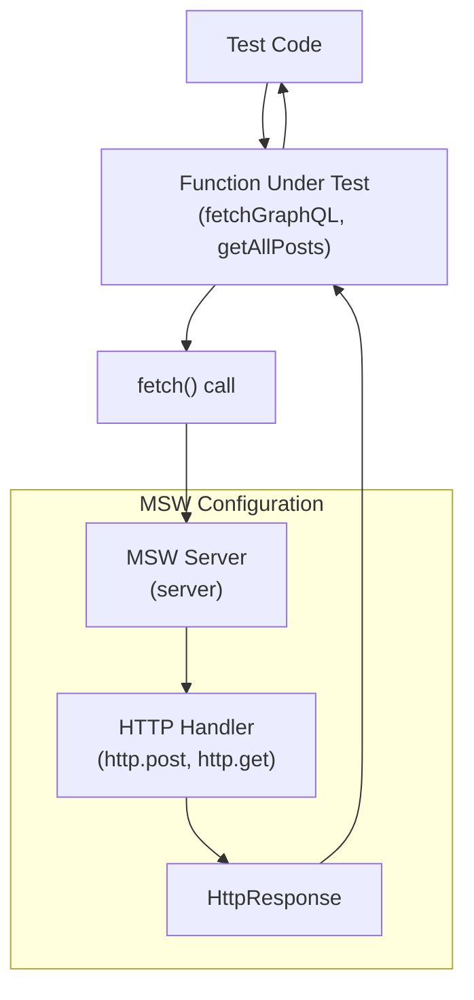
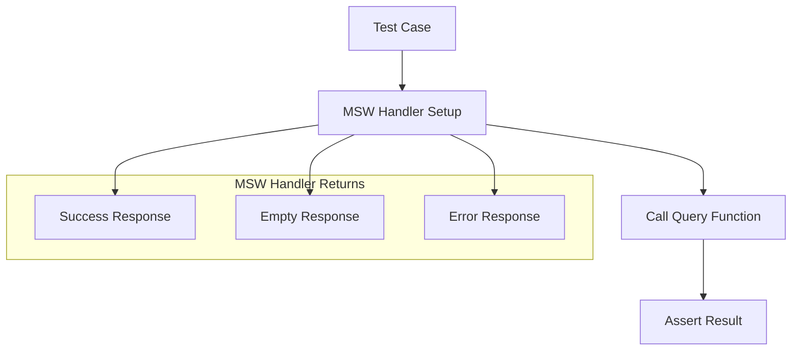

# Writing Tests

> **Relevant source files**
> * [AGENTS.md](https://github.com/gregrickaby/nextjs-wordpress/blob/63f3f2f5/AGENTS.md)
> * [CONTRIBUTING.md](https://github.com/gregrickaby/nextjs-wordpress/blob/63f3f2f5/CONTRIBUTING.md)
> * [README.md](https://github.com/gregrickaby/nextjs-wordpress/blob/63f3f2f5/README.md)
> * [components/CommentForm.test.tsx](https://github.com/gregrickaby/nextjs-wordpress/blob/63f3f2f5/components/CommentForm.test.tsx)
> * [components/Footer.test.tsx](https://github.com/gregrickaby/nextjs-wordpress/blob/63f3f2f5/components/Footer.test.tsx)
> * [components/Header.test.tsx](https://github.com/gregrickaby/nextjs-wordpress/blob/63f3f2f5/components/Header.test.tsx)
> * [components/SearchForm.test.tsx](https://github.com/gregrickaby/nextjs-wordpress/blob/63f3f2f5/components/SearchForm.test.tsx)
> * [lib/functions.test.ts](https://github.com/gregrickaby/nextjs-wordpress/blob/63f3f2f5/lib/functions.test.ts)
> * [lib/mutations/createComment.test.ts](https://github.com/gregrickaby/nextjs-wordpress/blob/63f3f2f5/lib/mutations/createComment.test.ts)
> * [lib/queries/getAllBooks.test.ts](https://github.com/gregrickaby/nextjs-wordpress/blob/63f3f2f5/lib/queries/getAllBooks.test.ts)
> * [lib/queries/getAllPages.test.ts](https://github.com/gregrickaby/nextjs-wordpress/blob/63f3f2f5/lib/queries/getAllPages.test.ts)
> * [lib/queries/getAllPosts.test.ts](https://github.com/gregrickaby/nextjs-wordpress/blob/63f3f2f5/lib/queries/getAllPosts.test.ts)
> * [lib/queries/getBookBySlug.test.ts](https://github.com/gregrickaby/nextjs-wordpress/blob/63f3f2f5/lib/queries/getBookBySlug.test.ts)
> * [lib/queries/getCategoryBySlug.test.ts](https://github.com/gregrickaby/nextjs-wordpress/blob/63f3f2f5/lib/queries/getCategoryBySlug.test.ts)
> * [lib/queries/getPageBySlug.test.ts](https://github.com/gregrickaby/nextjs-wordpress/blob/63f3f2f5/lib/queries/getPageBySlug.test.ts)
> * [lib/queries/getPostBySlug.test.ts](https://github.com/gregrickaby/nextjs-wordpress/blob/63f3f2f5/lib/queries/getPostBySlug.test.ts)
> * [lib/queries/getPreview.test.ts](https://github.com/gregrickaby/nextjs-wordpress/blob/63f3f2f5/lib/queries/getPreview.test.ts)
> * [lib/queries/getTagBySlug.test.ts](https://github.com/gregrickaby/nextjs-wordpress/blob/63f3f2f5/lib/queries/getTagBySlug.test.ts)
> * [test-utils/domShims.ts](https://github.com/gregrickaby/nextjs-wordpress/blob/63f3f2f5/test-utils/domShims.ts)
> * [vitest.config.ts](https://github.com/gregrickaby/nextjs-wordpress/blob/63f3f2f5/vitest.config.ts)

## Purpose and Scope

This document provides practical guidance on writing unit and integration tests for the Next.js WordPress headless frontend. It covers test patterns for components, GraphQL queries, mutations, and utility functions. For information about the testing infrastructure setup (Vitest, MSW, jest-axe), see [Testing Infrastructure](/gregrickaby/nextjs-wordpress/8.1-testing-infrastructure). For coverage requirements and generating coverage reports, see [Test Coverage](/gregrickaby/nextjs-wordpress/8.3-test-coverage).

All code changes must include co-located tests. This project follows test-driven development practices with a target of 80%+ coverage on critical paths.

---

## Test File Organization

Tests are co-located with the code they test using the `.test.ts` or `.test.tsx` extension. This makes tests easy to find and ensures they stay synchronized with implementation changes.

**Test File Structure:**

```
components/
  ├── Header.tsx
  ├── Header.test.tsx
  ├── Footer.tsx
  ├── Footer.test.tsx
  ├── SearchForm.tsx
  ├── SearchForm.test.tsx
  ├── CommentForm.tsx
  └── CommentForm.test.tsx

lib/
  ├── functions.ts
  ├── functions.test.ts
  ├── queries/
  │   ├── getAllPosts.ts
  │   ├── getAllPosts.test.ts
  │   ├── getPostBySlug.ts
  │   ├── getPostBySlug.test.ts
  │   ├── getBookBySlug.ts
  │   └── getBookBySlug.test.ts
  └── mutations/
      ├── createComment.ts
      └── createComment.test.ts
```

**Test File Naming Convention:**

| Source File | Test File | Description |
| --- | --- | --- |
| `Header.tsx` | `Header.test.tsx` | Component tests |
| `getAllPosts.ts` | `getAllPosts.test.ts` | Query function tests |
| `createComment.ts` | `createComment.test.ts` | Mutation function tests |
| `functions.ts` | `functions.test.ts` | Utility function tests |

Sources: [components/Header.test.tsx L1](https://github.com/gregrickaby/nextjs-wordpress/blob/63f3f2f5/components/Header.test.tsx#L1-L1)

 [lib/queries/getAllPosts.test.ts L1](https://github.com/gregrickaby/nextjs-wordpress/blob/63f3f2f5/lib/queries/getAllPosts.test.ts#L1-L1)

 [lib/mutations/createComment.test.ts L1](https://github.com/gregrickaby/nextjs-wordpress/blob/63f3f2f5/lib/mutations/createComment.test.ts#L1-L1)

 [lib/functions.test.ts L1](https://github.com/gregrickaby/nextjs-wordpress/blob/63f3f2f5/lib/functions.test.ts#L1-L1)

---

## Test Utilities Module

**Critical: Always import test utilities from `@/test-utils`, never directly from libraries.**

The `@/test-utils` module provides pre-configured exports that ensure consistent test setup across the entire codebase.

**Available Exports:**

| Export | Type | Purpose |
| --- | --- | --- |
| `render` | Function | Custom render with providers |
| `renderHook` | Function | Hook testing with providers |
| `screen` | Object | Query elements in rendered output |
| `waitFor` | Function | Wait for async assertions |
| `user` | Object | Pre-configured `userEvent.setup()` |
| `server` | Object | MSW server instance |
| `http` | Object | MSW HTTP request handlers |
| `HttpResponse` | Class | MSW response constructor |

**Correct Import Pattern:**

```javascript
// ✅ CORRECT - Import from test-utils
import {render, screen, user, server, http, HttpResponse} from '@/test-utils'
import {axe} from 'jest-axe'

// ❌ WRONG - Never import directly from libraries
import {render, screen} from '@testing-library/react'
import userEvent from '@testing-library/user-event'
```

**Why Use Pre-configured `user`?**

The `user` export is a pre-configured `userEvent.setup()` instance. This ensures:

* Consistent user interaction setup across all tests
* No duplicate `userEvent.setup()` calls
* Single source of truth for test configuration
* Easier to update user-event options globally

Sources: [AGENTS.md L293-L323](https://github.com/gregrickaby/nextjs-wordpress/blob/63f3f2f5/AGENTS.md#L293-L323)

 [CONTRIBUTING.md L208-L227](https://github.com/gregrickaby/nextjs-wordpress/blob/63f3f2f5/CONTRIBUTING.md#L208-L227)

---

## Component Testing Patterns

### Basic Component Test Structure

Component tests verify rendering, user interactions, and accessibility. Tests use React Testing Library's user-centric queries (`getByRole`, `getByLabelText`, etc.).

**Basic Component Test Pattern:**

```javascript
import ComponentName from '@/components/ComponentName'
import {render, screen, user} from '@/test-utils'
import {axe} from 'jest-axe'

describe('ComponentName', () => {
  it('should render component elements', () => {
    render(<ComponentName />)
    expect(screen.getByRole('button')).toBeInTheDocument()
  })

  it('should handle user interaction', async () => {
    render(<ComponentName />)
    await user.click(screen.getByRole('button'))
    expect(screen.getByText('Success')).toBeInTheDocument()
  })

  it('should have no accessibility violations', async () => {
    const {container} = render(<ComponentName />)
    const results = await axe(container)
    expect(results).toHaveNoViolations()
  })
})
```

Sources: [AGENTS.md L364-L383](https://github.com/gregrickaby/nextjs-wordpress/blob/63f3f2f5/AGENTS.md#L364-L383)

 [CONTRIBUTING.md L133-L159](https://github.com/gregrickaby/nextjs-wordpress/blob/63f3f2f5/CONTRIBUTING.md#L133-L159)

### Client Component Testing

Client components with form handling and state management follow the same pattern. The `user` export handles all user interactions.

**SearchForm Test Example:**

[components/SearchForm.test.tsx L10-L24](https://github.com/gregrickaby/nextjs-wordpress/blob/63f3f2f5/components/SearchForm.test.tsx#L10-L24)

 demonstrates rendering and user input:

```javascript
it('should render search input', () => {
  render(<SearchForm />)
  const searchInput = screen.getByRole('searchbox')
  expect(searchInput).toBeInTheDocument()
})

it('should handle user input', async () => {
  render(<SearchForm />)
  const searchInput = screen.getByRole('searchbox')
  await user.type(searchInput, 'test query')
  expect(searchInput).toHaveValue('test query')
})
```

**CommentForm Test Example:**

[components/CommentForm.test.tsx L20-L34](https://github.com/gregrickaby/nextjs-wordpress/blob/63f3f2f5/components/CommentForm.test.tsx#L20-L34)

 shows testing multiple form fields:

```javascript
it('should handle user input in all fields', async () => {
  render(<CommentForm {...mockProps} />)

  const nameInput = screen.getByLabelText(/name/i)
  const emailInput = screen.getByLabelText(/email/i)
  const commentInput = screen.getByLabelText(/comment/i)

  await user.type(nameInput, 'John Doe')
  await user.type(emailInput, 'john@example.com')
  await user.type(commentInput, 'This is a test comment')

  expect(nameInput).toHaveValue('John Doe')
  expect(emailInput).toHaveValue('john@example.com')
  expect(commentInput).toHaveValue('This is a test comment')
})
```

Sources: [components/SearchForm.test.tsx L1-L235](https://github.com/gregrickaby/nextjs-wordpress/blob/63f3f2f5/components/SearchForm.test.tsx#L1-L235)

 [components/CommentForm.test.tsx L1-L256](https://github.com/gregrickaby/nextjs-wordpress/blob/63f3f2f5/components/CommentForm.test.tsx#L1-L256)

### Async Server Component Testing

Server Components are async functions. Tests must await the component before rendering.

**Header Test Example:**

[components/Header.test.tsx L32-L40](https://github.com/gregrickaby/nextjs-wordpress/blob/63f3f2f5/components/Header.test.tsx#L32-L40)

 demonstrates the async pattern:

```javascript
it('should render the header with site branding', async () => {
  // Server Components are async - must await
  const HeaderComponent = await Header()
  render(HeaderComponent)

  const header = screen.getByRole('heading', {level: 1})
  expect(header).toBeInTheDocument()
})
```

**Pattern:**

1. Await the component: `const Component = await ServerComponent()`
2. Render the result: `render(Component)`
3. Assert on rendered output

Sources: [components/Header.test.tsx L1-L48](https://github.com/gregrickaby/nextjs-wordpress/blob/63f3f2f5/components/Header.test.tsx#L1-L48)

 [AGENTS.md L417-L434](https://github.com/gregrickaby/nextjs-wordpress/blob/63f3f2f5/AGENTS.md#L417-L434)

---

## MSW v2 HTTP Mocking Patterns

**Critical: Never mock `global.fetch`. Always use MSW v2 for HTTP interception.**

MSW (Mock Service Worker) intercepts HTTP requests at the network level. The `server` instance is configured globally in [vitest.setup.ts](https://github.com/gregrickaby/nextjs-wordpress/blob/63f3f2f5/vitest.setup.ts)

 and resets handlers between tests automatically.

### MSW Request Interception Flow



**Diagram: MSW v2 Request Interception Flow**

This diagram shows how MSW intercepts `fetch()` calls made by functions under test. The MSW server matches requests against registered handlers and returns mock responses without making actual network requests.

Sources: [AGENTS.md L322-L353](https://github.com/gregrickaby/nextjs-wordpress/blob/63f3f2f5/AGENTS.md#L322-L353)

 [CONTRIBUTING.md L230-L246](https://github.com/gregrickaby/nextjs-wordpress/blob/63f3f2f5/CONTRIBUTING.md#L230-L246)

### Basic MSW Handler Pattern

Override default handlers for specific test cases using `server.use()`.

**Success Response Example:**

[lib/functions.test.ts L17-L31](https://github.com/gregrickaby/nextjs-wordpress/blob/63f3f2f5/lib/functions.test.ts#L17-L31)

 shows successful data fetching:

```javascript
it('should fetch GraphQL data successfully', async () => {
  server.use(
    http.post(`${process.env.NEXT_PUBLIC_WORDPRESS_GRAPHQL_URL}`, () => {
      return HttpResponse.json({
        data: {
          posts: {
            nodes: [
              {id: '1', title: 'Post 1'},
              {id: '2', title: 'Post 2'}
            ]
          }
        }
      })
    })
  )

  const response = await fetchGraphQL(testQuery)
  expect(response.data.posts.nodes).toHaveLength(2)
})
```

**Error Response Example:**

[lib/functions.test.ts L60-L71](https://github.com/gregrickaby/nextjs-wordpress/blob/63f3f2f5/lib/functions.test.ts#L60-L71)

 demonstrates network error handling:

```javascript
it('should handle network errors', async () => {
  server.use(
    http.post(`${process.env.NEXT_PUBLIC_WORDPRESS_GRAPHQL_URL}`, () => {
      return HttpResponse.error()
    })
  )

  const response = await fetchGraphQL(testQuery)
  expect(response).toBeDefined()
})
```

Sources: [lib/functions.test.ts L1-L274](https://github.com/gregrickaby/nextjs-wordpress/blob/63f3f2f5/lib/functions.test.ts#L1-L274)

### GraphQL Error Responses

GraphQL can return errors in the response body while maintaining a 200 status code.

**GraphQL Error Pattern:**

[lib/functions.test.ts L39-L58](https://github.com/gregrickaby/nextjs-wordpress/blob/63f3f2f5/lib/functions.test.ts#L39-L58)

 shows GraphQL error handling:

```javascript
it('should handle GraphQL errors', async () => {
  server.use(
    http.post(`${process.env.NEXT_PUBLIC_WORDPRESS_GRAPHQL_URL}`, () => {
      return HttpResponse.json({
        errors: [
          {
            message: 'GraphQL error',
            extensions: {code: 'INTERNAL_SERVER_ERROR'}
          }
        ]
      })
    })
  )

  const response = await fetchGraphQL(testQuery)
  expect(response.errors?.[0].message).toBe('GraphQL error')
})
```

Sources: [lib/functions.test.ts L39-L58](https://github.com/gregrickaby/nextjs-wordpress/blob/63f3f2f5/lib/functions.test.ts#L39-L58)

### HTTP Status Code Errors

Test functions that handle non-200 HTTP status codes.

**Status Code Error Pattern:**

[lib/functions.test.ts L124-L134](https://github.com/gregrickaby/nextjs-wordpress/blob/63f3f2f5/lib/functions.test.ts#L124-L134)

 demonstrates empty response handling:

```javascript
it('should handle empty response body', async () => {
  server.use(
    http.post(`${process.env.NEXT_PUBLIC_WORDPRESS_GRAPHQL_URL}`, () => {
      return new HttpResponse(null, {status: 200})
    })
  )

  const response = await fetchGraphQL(testQuery)
  expect(response).toBeDefined()
})
```

[lib/queries/getPostBySlug.test.ts L77-L92](https://github.com/gregrickaby/nextjs-wordpress/blob/63f3f2f5/lib/queries/getPostBySlug.test.ts#L77-L92)

 shows 404 error handling:

```javascript
it('should return null on API error', async () => {
  server.use(
    http.post(`${process.env.NEXT_PUBLIC_WORDPRESS_GRAPHQL_URL}`, () => {
      return HttpResponse.json(
        {errors: [{message: 'Post not found'}]},
        {status: 404}
      )
    })
  )

  const post = await getPostBySlug('error-post')
  expect(post).toBeNull()
})
```

Sources: [lib/functions.test.ts L124-L134](https://github.com/gregrickaby/nextjs-wordpress/blob/63f3f2f5/lib/functions.test.ts#L124-L134)

 [lib/queries/getPostBySlug.test.ts L77-L92](https://github.com/gregrickaby/nextjs-wordpress/blob/63f3f2f5/lib/queries/getPostBySlug.test.ts#L77-L92)

### Capturing Request Data

Verify that functions send correct variables to GraphQL endpoints.

**Request Capture Pattern:**

[lib/functions.test.ts L73-L92](https://github.com/gregrickaby/nextjs-wordpress/blob/63f3f2f5/lib/functions.test.ts#L73-L92)

 demonstrates variable verification:

```javascript
it('should send variables with the query', async () => {
  let capturedBody: any

  server.use(
    http.post(
      `${process.env.NEXT_PUBLIC_WORDPRESS_GRAPHQL_URL}`,
      async ({request}) => {
        capturedBody = await request.json()
        return HttpResponse.json({
          data: {post: {id: '1', title: 'Test'}}
        })
      }
    )
  )

  const variables = {slug: 'test-post'}
  await fetchGraphQL(testQuery, variables)

  expect(capturedBody.variables).toEqual(variables)
})
```

Sources: [lib/functions.test.ts L73-L92](https://github.com/gregrickaby/nextjs-wordpress/blob/63f3f2f5/lib/functions.test.ts#L73-L92)

 [lib/mutations/createComment.test.ts L113-L160](https://github.com/gregrickaby/nextjs-wordpress/blob/63f3f2f5/lib/mutations/createComment.test.ts#L113-L160)

---

## GraphQL Query Testing Patterns

Query function tests verify data fetching, transformation, and error handling. All query functions should return `[]` or `null` on errors for graceful degradation.

### Query Test Structure



**Diagram: Query Test Flow**

Each query function test follows this pattern: setup MSW handler, call the query function, assert on the result. Tests should cover success, empty, and error scenarios.

Sources: [lib/queries/getAllPosts.test.ts L1-L93](https://github.com/gregrickaby/nextjs-wordpress/blob/63f3f2f5/lib/queries/getAllPosts.test.ts#L1-L93)

 [lib/queries/getPostBySlug.test.ts L1-L93](https://github.com/gregrickaby/nextjs-wordpress/blob/63f3f2f5/lib/queries/getPostBySlug.test.ts#L1-L93)

### Testing Collection Queries

Collection queries (e.g., `getAllPosts`, `getAllBooks`) return arrays and should handle empty results gracefully.

**getAllPosts Test Pattern:**

[lib/queries/getAllPosts.test.ts L6-L43](https://github.com/gregrickaby/nextjs-wordpress/blob/63f3f2f5/lib/queries/getAllPosts.test.ts#L6-L43)

 shows successful fetching:

```javascript
it('should fetch all posts successfully', async () => {
  server.use(
    http.post(`${process.env.NEXT_PUBLIC_WORDPRESS_GRAPHQL_URL}`, () => {
      return HttpResponse.json({
        data: {
          posts: {
            nodes: [
              {
                id: 'cG9zdDox',
                databaseId: 1,
                title: 'Test Post 1',
                slug: 'test-post-1'
              },
              {
                id: 'cG9zdDoy',
                databaseId: 2,
                title: 'Test Post 2',
                slug: 'test-post-2'
              }
            ]
          }
        }
      })
    })
  )

  const posts = await getAllPosts()
  expect(posts).toHaveLength(2)
  expect(posts[0].title).toBe('Test Post 1')
})
```

[lib/queries/getAllPosts.test.ts L45-L61](https://github.com/gregrickaby/nextjs-wordpress/blob/63f3f2f5/lib/queries/getAllPosts.test.ts#L45-L61)

 demonstrates empty result handling:

```javascript
it('should return empty array when no posts are found', async () => {
  server.use(
    http.post(`${process.env.NEXT_PUBLIC_WORDPRESS_GRAPHQL_URL}`, () => {
      return HttpResponse.json({
        data: {posts: {nodes: []}}
      })
    })
  )

  const posts = await getAllPosts()
  expect(posts).toEqual([])
})
```

Sources: [lib/queries/getAllPosts.test.ts L1-L93](https://github.com/gregrickaby/nextjs-wordpress/blob/63f3f2f5/lib/queries/getAllPosts.test.ts#L1-L93)

 [lib/queries/getAllBooks.test.ts L1-L101](https://github.com/gregrickaby/nextjs-wordpress/blob/63f3f2f5/lib/queries/getAllBooks.test.ts#L1-L101)

### Testing Single Item Queries

Single item queries (e.g., `getPostBySlug`, `getBookBySlug`) return a single object or `null`.

**getPostBySlug Test Pattern:**

[lib/queries/getPostBySlug.test.ts L42-L59](https://github.com/gregrickaby/nextjs-wordpress/blob/63f3f2f5/lib/queries/getPostBySlug.test.ts#L42-L59)

 shows successful fetching:

```javascript
it('should fetch post by slug successfully', async () => {
  server.use(
    http.post(`${process.env.NEXT_PUBLIC_WORDPRESS_GRAPHQL_URL}`, () => {
      return HttpResponse.json({
        data: {post: mockPost}
      })
    })
  )

  const post = await getPostBySlug('test-post')

  expect(post).toBeDefined()
  expect(post?.title).toBe('Test Post')
  expect(post?.author?.node?.name).toBe('Test Author')
})
```

[lib/queries/getPostBySlug.test.ts L61-L75](https://github.com/gregrickaby/nextjs-wordpress/blob/63f3f2f5/lib/queries/getPostBySlug.test.ts#L61-L75)

 demonstrates not found handling:

```javascript
it('should return null when post is not found', async () => {
  server.use(
    http.post(`${process.env.NEXT_PUBLIC_WORDPRESS_GRAPHQL_URL}`, () => {
      return HttpResponse.json({
        data: {post: null}
      })
    })
  )

  const post = await getPostBySlug('non-existent')
  expect(post).toBeNull()
})
```

Sources: [lib/queries/getPostBySlug.test.ts L1-L93](https://github.com/gregrickaby/nextjs-wordpress/blob/63f3f2f5/lib/queries/getPostBySlug.test.ts#L1-L93)

 [lib/queries/getBookBySlug.test.ts L1-L97](https://github.com/gregrickaby/nextjs-wordpress/blob/63f3f2f5/lib/queries/getBookBySlug.test.ts#L1-L97)

 [lib/queries/getPageBySlug.test.ts L1-L100](https://github.com/gregrickaby/nextjs-wordpress/blob/63f3f2f5/lib/queries/getPageBySlug.test.ts#L1-L100)

### Testing Queries with Parameters

Some queries accept parameters like limits or filters.

**getTagBySlug with Limit Parameter:**

[lib/queries/getTagBySlug.test.ts L51-L80](https://github.com/gregrickaby/nextjs-wordpress/blob/63f3f2f5/lib/queries/getTagBySlug.test.ts#L51-L80)

 tests custom limit:

```javascript
it('should handle custom limit parameter', async () => {
  server.use(
    http.post(`${process.env.NEXT_PUBLIC_WORDPRESS_GRAPHQL_URL}`, () => {
      return HttpResponse.json({
        data: {
          posts: {
            nodes: [
              {
                databaseId: 1,
                title: 'Tagged Post 1',
                slug: 'tagged-post-1'
              }
            ]
          }
        }
      })
    })
  )

  const posts = await getTagBySlug('test-tag', 5)
  expect(posts).toHaveLength(1)
})
```

[lib/queries/getTagBySlug.test.ts L97-L117](https://github.com/gregrickaby/nextjs-wordpress/blob/63f3f2f5/lib/queries/getTagBySlug.test.ts#L97-L117)

 verifies default parameter:

```javascript
it('should use default limit of 10', async () => {
  server.use(
    http.post(
      `${process.env.NEXT_PUBLIC_WORDPRESS_GRAPHQL_URL}`,
      async ({request}) => {
        const body = (await request.json()) as {query: string}
        expect(body.query).toContain('first: 10')

        return HttpResponse.json({
          data: {posts: {nodes: []}}
        })
      }
    )
  )

  await getTagBySlug('test-tag')
})
```

Sources: [lib/queries/getTagBySlug.test.ts L1-L118](https://github.com/gregrickaby/nextjs-wordpress/blob/63f3f2f5/lib/queries/getTagBySlug.test.ts#L1-L118)

 [lib/queries/getCategoryBySlug.test.ts L1-L96](https://github.com/gregrickaby/nextjs-wordpress/blob/63f3f2f5/lib/queries/getCategoryBySlug.test.ts#L1-L96)

### Testing Preview Queries

Preview queries use authentication and may throw errors instead of returning null.

**getPreview Test Pattern:**

[lib/queries/getPreview.test.ts L52-L70](https://github.com/gregrickaby/nextjs-wordpress/blob/63f3f2f5/lib/queries/getPreview.test.ts#L52-L70)

 shows successful preview:

```javascript
it('should fetch preview post successfully', async () => {
  server.use(
    http.post(`${process.env.NEXT_PUBLIC_WORDPRESS_GRAPHQL_URL}`, () => {
      return HttpResponse.json({
        data: {post: mockPreviewPost}
      })
    })
  )

  const post = await getPreview('1')

  expect(post).toBeDefined()
  expect(post.title).toBe('Preview Post')
  expect(post.tags?.nodes).toHaveLength(1)
})
```

[lib/queries/getPreview.test.ts L72-L85](https://github.com/gregrickaby/nextjs-wordpress/blob/63f3f2f5/lib/queries/getPreview.test.ts#L72-L85)

 demonstrates error behavior:

```javascript
it('should handle API errors gracefully', async () => {
  server.use(
    http.post(`${process.env.NEXT_PUBLIC_WORDPRESS_GRAPHQL_URL}`, () => {
      return HttpResponse.json(
        {errors: [{message: 'Preview not found'}]},
        {status: 404}
      )
    })
  )

  await expect(getPreview('999')).rejects.toThrow()
})
```

Sources: [lib/queries/getPreview.test.ts L1-L102](https://github.com/gregrickaby/nextjs-wordpress/blob/63f3f2f5/lib/queries/getPreview.test.ts#L1-L102)

---

## GraphQL Mutation Testing Patterns

Mutation tests verify data creation and update operations. Mutations typically use form data and may have side effects.

### Mutation Test Structure

**createComment Test Pattern:**

[lib/mutations/createComment.test.ts L14-L47](https://github.com/gregrickaby/nextjs-wordpress/blob/63f3f2f5/lib/mutations/createComment.test.ts#L14-L47)

 shows successful comment creation:

```javascript
it('should create a comment successfully', async () => {
  server.use(
    http.post(`${process.env.NEXT_PUBLIC_WORDPRESS_GRAPHQL_URL}`, () => {
      return HttpResponse.json({
        data: {
          createComment: {
            success: true,
            comment: {
              author: {
                node: {
                  name: 'Test User',
                  email: 'test@example.com',
                  url: 'https://example.com'
                }
              },
              content: '<p>This is a test comment</p>',
              date: '2024-01-01T00:00:00'
            }
          }
        }
      })
    })
  )

  const result = await createComment(mockCommentData)

  expect(result.success).toBe(true)
  expect(result.comment.author.node.name).toBe('Test User')
})
```

[lib/mutations/createComment.test.ts L84-L101](https://github.com/gregrickaby/nextjs-wordpress/blob/63f3f2f5/lib/mutations/createComment.test.ts#L84-L101)

 tests error handling:

```javascript
it('should handle API errors gracefully', async () => {
  server.use(
    http.post(`${process.env.NEXT_PUBLIC_WORDPRESS_GRAPHQL_URL}`, () => {
      return HttpResponse.json(
        {errors: [{message: 'Comment creation failed'}]},
        {status: 400}
      )
    })
  )

  await expect(createComment(mockCommentData)).rejects.toThrow()
})
```

Sources: [lib/mutations/createComment.test.ts L1-L161](https://github.com/gregrickaby/nextjs-wordpress/blob/63f3f2f5/lib/mutations/createComment.test.ts#L1-L161)

### Testing Mutation Variables

Verify that mutations send correct variables to the GraphQL endpoint.

**Variable Verification Pattern:**

[lib/mutations/createComment.test.ts L113-L160](https://github.com/gregrickaby/nextjs-wordpress/blob/63f3f2f5/lib/mutations/createComment.test.ts#L113-L160)

 captures and verifies variables:

```javascript
it('should pass correct variables to GraphQL mutation', async () => {
  server.use(
    http.post(
      `${process.env.NEXT_PUBLIC_WORDPRESS_GRAPHQL_URL}`,
      async ({request}) => {
        const body = (await request.json()) as {
          variables: {
            authorName: string
            authorEmail: string
            authorUrl: string
            comment: string
            postID: string
          }
        }

        expect(body.variables.authorName).toBe('Test User')
        expect(body.variables.authorEmail).toBe('test@example.com')
        expect(body.variables.authorUrl).toBe('https://example.com')
        expect(body.variables.comment).toBe('This is a test comment')
        expect(body.variables.postID).toBe('1')

        return HttpResponse.json({
          data: {createComment: {success: true, comment: {...}}}
        })
      }
    )
  )

  await createComment(mockCommentData)
})
```

Sources: [lib/mutations/createComment.test.ts L113-L160](https://github.com/gregrickaby/nextjs-wordpress/blob/63f3f2f5/lib/mutations/createComment.test.ts#L113-L160)

---

## Accessibility Testing Patterns

All components must pass accessibility validation using `jest-axe`. This ensures WCAG 2.1 AA compliance.

### Basic Accessibility Test

**Standard Pattern:**

```javascript
import {axe} from 'jest-axe'

it('should have no accessibility violations', async () => {
  const {container} = render(<ComponentName />)
  const results = await axe(container)
  expect(results).toHaveNoViolations()
})
```

**Examples:**

[components/SearchForm.test.tsx L230-L235](https://github.com/gregrickaby/nextjs-wordpress/blob/63f3f2f5/components/SearchForm.test.tsx#L230-L235)

:

```javascript
it('should have no accessibility violations', async () => {
  const {container} = render(<SearchForm />)
  const results = await axe(container)
  expect(results).toHaveNoViolations()
})
```

[components/CommentForm.test.tsx L251-L255](https://github.com/gregrickaby/nextjs-wordpress/blob/63f3f2f5/components/CommentForm.test.tsx#L251-L255)

:

```javascript
it('should have no accessibility violations', async () => {
  const {container} = render(<CommentForm {...mockProps} />)
  const results = await axe(container)
  expect(results).toHaveNoViolations()
})
```

Sources: [components/SearchForm.test.tsx L230-L235](https://github.com/gregrickaby/nextjs-wordpress/blob/63f3f2f5/components/SearchForm.test.tsx#L230-L235)

 [components/CommentForm.test.tsx L251-L255](https://github.com/gregrickaby/nextjs-wordpress/blob/63f3f2f5/components/CommentForm.test.tsx#L251-L255)

 [components/Header.test.tsx L42-L47](https://github.com/gregrickaby/nextjs-wordpress/blob/63f3f2f5/components/Header.test.tsx#L42-L47)

 [components/Footer.test.tsx L14-L18](https://github.com/gregrickaby/nextjs-wordpress/blob/63f3f2f5/components/Footer.test.tsx#L14-L18)

---

## User Interaction Testing Patterns

Test user interactions using the pre-configured `user` export from `@/test-utils`. This ensures consistent user event handling across all tests.

### Form Input Testing

**Typing Pattern:**

[components/SearchForm.test.tsx L17-L24](https://github.com/gregrickaby/nextjs-wordpress/blob/63f3f2f5/components/SearchForm.test.tsx#L17-L24)

 shows basic typing:

```javascript
it('should handle user input', async () => {
  render(<SearchForm />)

  const searchInput = screen.getByRole('searchbox')
  await user.type(searchInput, 'test query')

  expect(searchInput).toHaveValue('test query')
})
```

**Multiple Field Pattern:**

[components/CommentForm.test.tsx L20-L34](https://github.com/gregrickaby/nextjs-wordpress/blob/63f3f2f5/components/CommentForm.test.tsx#L20-L34)

 handles multiple inputs:

```javascript
it('should handle user input in all fields', async () => {
  render(<CommentForm {...mockProps} />)

  const nameInput = screen.getByLabelText(/name/i)
  const emailInput = screen.getByLabelText(/email/i)
  const commentInput = screen.getByLabelText(/comment/i)

  await user.type(nameInput, 'John Doe')
  await user.type(emailInput, 'john@example.com')
  await user.type(commentInput, 'This is a test comment')

  expect(nameInput).toHaveValue('John Doe')
  expect(emailInput).toHaveValue('john@example.com')
  expect(commentInput).toHaveValue('This is a test comment')
})
```

Sources: [components/SearchForm.test.tsx L17-L24](https://github.com/gregrickaby/nextjs-wordpress/blob/63f3f2f5/components/SearchForm.test.tsx#L17-L24)

 [components/CommentForm.test.tsx L20-L34](https://github.com/gregrickaby/nextjs-wordpress/blob/63f3f2f5/components/CommentForm.test.tsx#L20-L34)

### Button Click Testing

**Click Pattern:**

[components/SearchForm.test.tsx L44-L59](https://github.com/gregrickaby/nextjs-wordpress/blob/63f3f2f5/components/SearchForm.test.tsx#L44-L59)

 demonstrates button clicks:

```javascript
it('should reset search when reset button is clicked', async () => {
  render(<SearchForm />)

  const searchInput = screen.getByRole('searchbox')
  const resetButton = screen.getByRole('button', {name: /reset/i})

  // Type something
  await user.type(searchInput, 'test query')
  expect(searchInput).toHaveValue('test query')

  // Click reset
  await user.click(resetButton)

  // Input should be cleared
  expect(searchInput).toHaveValue('')
})
```

Sources: [components/SearchForm.test.tsx L44-L59](https://github.com/gregrickaby/nextjs-wordpress/blob/63f3f2f5/components/SearchForm.test.tsx#L44-L59)

### Form Submission Testing

**Submission Pattern:**

[components/CommentForm.test.tsx L36-L84](https://github.com/gregrickaby/nextjs-wordpress/blob/63f3f2f5/components/CommentForm.test.tsx#L36-L84)

 shows form submission with MSW:

```javascript
it('should submit comment successfully', async () => {
  server.use(
    http.post(
      `${process.env.NEXT_PUBLIC_WORDPRESS_GRAPHQL_URL}`,
      async ({request}) => {
        const body = (await request.json()) as {query: string}

        if (body.query.includes('createComment')) {
          return HttpResponse.json({
            data: {
              createComment: {
                success: true,
                comment: {
                  id: 'cG9zdDox',
                  content: 'This is a test comment'
                }
              }
            }
          })
        }

        return HttpResponse.json({data: {}})
      }
    )
  )

  render(<CommentForm {...mockProps} />)

  // Fill in the form
  await user.type(screen.getByLabelText(/name/i), 'John Doe')
  await user.type(screen.getByLabelText(/email/i), 'john@example.com')
  await user.type(screen.getByLabelText(/website/i), 'https://example.com')
  await user.type(screen.getByLabelText(/comment/i), 'This is a test comment')

  // Submit the form
  const submitButton = screen.getByRole('button', {name: /submit/i})
  await user.click(submitButton)

  // Wait for success message
  expect(
    await screen.findByText(/thank you john doe/i, {}, {timeout: 3000})
  ).toBeInTheDocument()
})
```

Sources: [components/CommentForm.test.tsx L36-L84](https://github.com/gregrickaby/nextjs-wordpress/blob/63f3f2f5/components/CommentForm.test.tsx#L36-L84)

---

## Common Test Patterns

### Testing Component Props

**Required Props Pattern:**

[components/CommentForm.test.tsx L217-L229](https://github.com/gregrickaby/nextjs-wordpress/blob/63f3f2f5/components/CommentForm.test.tsx#L217-L229)

 verifies required attributes:

```javascript
it('should require all fields before submission', () => {
  render(<CommentForm {...mockProps} />)

  const nameInput = screen.getByLabelText(/name/i)
  const emailInput = screen.getByLabelText(/email/i)
  const websiteInput = screen.getByLabelText(/website/i)
  const commentInput = screen.getByLabelText(/comment/i)

  expect(nameInput).toBeRequired()
  expect(emailInput).toBeRequired()
  expect(websiteInput).toBeRequired()
  expect(commentInput).toBeRequired()
})
```

Sources: [components/CommentForm.test.tsx L217-L229](https://github.com/gregrickaby/nextjs-wordpress/blob/63f3f2f5/components/CommentForm.test.tsx#L217-L229)

### Testing Validation Attributes

**Email Validation Pattern:**

[components/CommentForm.test.tsx L231-L241](https://github.com/gregrickaby/nextjs-wordpress/blob/63f3f2f5/components/CommentForm.test.tsx#L231-L241)

 checks input validation:

```javascript
it('should validate email format', () => {
  render(<CommentForm {...mockProps} />)

  const emailInput = screen.getByLabelText(/email/i)

  expect(emailInput).toHaveAttribute('type', 'email')
  expect(emailInput).toHaveAttribute(
    'pattern',
    String.raw`[a-z0-9._%+-]+@[a-z0-9.-]+\.[a-z]{2,4}$`
  )
})
```

Sources: [components/CommentForm.test.tsx L231-L241](https://github.com/gregrickaby/nextjs-wordpress/blob/63f3f2f5/components/CommentForm.test.tsx#L231-L241)

### Testing Conditional Rendering

**Conditional Display Pattern:**

[components/SearchForm.test.tsx L78-L95](https://github.com/gregrickaby/nextjs-wordpress/blob/63f3f2f5/components/SearchForm.test.tsx#L78-L95)

 tests conditional messages:

```javascript
it('should display no results message when search returns empty', async () => {
  const mockFetch = vi.fn()
  globalThis.fetch = mockFetch.mockResolvedValue({
    ok: true,
    json: async () => []
  })

  render(<SearchForm />)

  const searchInput = screen.getByRole('searchbox')
  await user.type(searchInput, 'nonexistent')

  // Wait for search to complete and show no results
  await waitFor(
    () => expect(screen.getByText(/no results found/i)).toBeInTheDocument(),
    {timeout: 2000}
  )
})
```

Sources: [components/SearchForm.test.tsx L78-L95](https://github.com/gregrickaby/nextjs-wordpress/blob/63f3f2f5/components/SearchForm.test.tsx#L78-L95)

### Testing Error States

**Error Handling Pattern:**

[components/CommentForm.test.tsx L86-L123](https://github.com/gregrickaby/nextjs-wordpress/blob/63f3f2f5/components/CommentForm.test.tsx#L86-L123)

 verifies error display:

```javascript
it('should display error message on submission failure', async () => {
  server.use(
    http.post(
      `${process.env.NEXT_PUBLIC_WORDPRESS_GRAPHQL_URL}`,
      async ({request}) => {
        const body = (await request.json()) as {query: string}

        if (body.query.includes('createComment')) {
          return HttpResponse.json({
            data: {
              createComment: {
                success: false,
                comment: null
              }
            }
          })
        }

        return HttpResponse.json({data: {}})
      }
    )
  )

  render(<CommentForm {...mockProps} />)

  await user.type(screen.getByLabelText(/name/i), 'John Doe')
  await user.type(screen.getByLabelText(/email/i), 'john@example.com')
  await user.type(screen.getByLabelText(/website/i), 'https://example.com')
  await user.type(screen.getByLabelText(/comment/i), 'This is a test comment')

  const submitButton = screen.getByRole('button', {name: /submit/i})
  await user.click(submitButton)

  // Wait for error message
  expect(
    await screen.findByText(/there was an error/i, {}, {timeout: 3000})
  ).toBeInTheDocument()
})
```

Sources: [components/CommentForm.test.tsx L86-L123](https://github.com/gregrickaby/nextjs-wordpress/blob/63f3f2f5/components/CommentForm.test.tsx#L86-L123)

---

## Test Organization Best Practices

### Describe Blocks and Test Names

Use descriptive test names that explain expected behavior. Group related tests using `describe` blocks.

**Organization Pattern:**

```javascript
describe('FunctionName', () => {
  describe('success scenarios', () => {
    it('should fetch data successfully', async () => {
      // Test implementation
    })

    it('should handle empty results', async () => {
      // Test implementation
    })
  })

  describe('error scenarios', () => {
    it('should return null on API error', async () => {
      // Test implementation
    })

    it('should handle network errors', async () => {
      // Test implementation
    })
  })
})
```

Sources: [lib/functions.test.ts L5-L135](https://github.com/gregrickaby/nextjs-wordpress/blob/63f3f2f5/lib/functions.test.ts#L5-L135)

 [lib/queries/getAllPosts.test.ts L5-L93](https://github.com/gregrickaby/nextjs-wordpress/blob/63f3f2f5/lib/queries/getAllPosts.test.ts#L5-L93)

### Test Data Setup

Define reusable mock data at the top of the test file.

**Mock Data Pattern:**

[lib/queries/getPostBySlug.test.ts L6-L40](https://github.com/gregrickaby/nextjs-wordpress/blob/63f3f2f5/lib/queries/getPostBySlug.test.ts#L6-L40)

 demonstrates mock setup:

```javascript
describe('getPostBySlug', () => {
  const mockPost = {
    id: 'cG9zdDox',
    databaseId: 1,
    title: 'Test Post',
    slug: 'test-post',
    excerpt: 'Test excerpt',
    content: '<p>Test content</p>',
    date: '2024-01-01T00:00:00',
    author: {
      node: {name: 'Test Author'}
    },
    categories: {
      nodes: [{name: 'Test Category', slug: 'test-category'}]
    },
    featuredImage: {
      node: {
        sourceUrl: 'https://example.com/image.jpg',
        altText: 'Test image'
      }
    }
  }

  it('should fetch post by slug successfully', async () => {
    server.use(
      http.post(`${process.env.NEXT_PUBLIC_WORDPRESS_GRAPHQL_URL}`, () => {
        return HttpResponse.json({data: {post: mockPost}})
      })
    )

    const post = await getPostBySlug('test-post')
    expect(post?.title).toBe('Test Post')
  })
})
```

Sources: [lib/queries/getPostBySlug.test.ts L6-L59](https://github.com/gregrickaby/nextjs-wordpress/blob/63f3f2f5/lib/queries/getPostBySlug.test.ts#L6-L59)

 [lib/mutations/createComment.test.ts L6-L13](https://github.com/gregrickaby/nextjs-wordpress/blob/63f3f2f5/lib/mutations/createComment.test.ts#L6-L13)

### Test Cleanup

Use `afterEach` to restore mocks and avoid test pollution.

**Cleanup Pattern:**

[components/SearchForm.test.tsx L6-L8](https://github.com/gregrickaby/nextjs-wordpress/blob/63f3f2f5/components/SearchForm.test.tsx#L6-L8)

 shows mock restoration:

```javascript
describe('SearchForm', () => {
  afterEach(() => {
    vi.restoreAllMocks()
  })

  // Tests...
})
```

Sources: [components/SearchForm.test.tsx L6-L8](https://github.com/gregrickaby/nextjs-wordpress/blob/63f3f2f5/components/SearchForm.test.tsx#L6-L8)

---

## Testing Code-to-Test Entity Mapping

```mermaid
flowchart TD

FUNCTIONS["lib/functions.ts"]
FUNCTIONS_TEST["lib/functions.test.ts"]
CREATECOMMENT["lib/mutations/createComment.ts"]
CREATECOMMENT_TEST["lib/mutations/createComment.test.ts"]
GETALLPOSTS["lib/queries/getAllPosts.ts"]
GETALLPOSTS_TEST["lib/queries/getAllPosts.test.ts"]
GETPOSTBYSLUG["lib/queries/getPostBySlug.ts"]
GETPOSTBYSLUG_TEST["lib/queries/getPostBySlug.test.ts"]
GETBOOKBYSLUG["lib/queries/getBookBySlug.ts"]
GETBOOKBYSLUG_TEST["lib/queries/getBookBySlug.test.ts"]
HEADER_TSX["components/Header.tsx"]
HEADER_TEST["components/Header.test.tsx"]
FOOTER_TSX["components/Footer.tsx"]
FOOTER_TEST["components/Footer.test.tsx"]
SEARCH_TSX["components/SearchForm.tsx"]
SEARCH_TEST["components/SearchForm.test.tsx"]
COMMENT_TSX["components/CommentForm.tsx"]
COMMENT_TEST["components/CommentForm.test.tsx"]

subgraph subGraph3 ["Function Tests"]
    FUNCTIONS
    FUNCTIONS_TEST
    FUNCTIONS --> FUNCTIONS_TEST
end

subgraph subGraph2 ["Mutation Tests"]
    CREATECOMMENT
    CREATECOMMENT_TEST
    CREATECOMMENT --> CREATECOMMENT_TEST
end

subgraph subGraph1 ["Query Tests"]
    GETALLPOSTS
    GETALLPOSTS_TEST
    GETPOSTBYSLUG
    GETPOSTBYSLUG_TEST
    GETBOOKBYSLUG
    GETBOOKBYSLUG_TEST
    GETALLPOSTS --> GETALLPOSTS_TEST
    GETPOSTBYSLUG --> GETPOSTBYSLUG_TEST
    GETBOOKBYSLUG --> GETBOOKBYSLUG_TEST
end

subgraph subGraph0 ["Component Tests"]
    HEADER_TSX
    HEADER_TEST
    FOOTER_TSX
    FOOTER_TEST
    SEARCH_TSX
    SEARCH_TEST
    COMMENT_TSX
    COMMENT_TEST
    HEADER_TSX --> HEADER_TEST
    FOOTER_TSX --> FOOTER_TEST
    SEARCH_TSX --> SEARCH_TEST
    COMMENT_TSX --> COMMENT_TEST
end
```



**Diagram: Source Code to Test File Mapping**

This diagram maps each source file to its co-located test file. The naming convention is consistent: `FileName.tsx` has a test file `FileName.test.tsx` (or `.ts` for TypeScript files). This co-location makes tests easy to find and maintain.

Sources: All test files referenced in diagram

---

## Summary

### Required Test Coverage

All code changes must include tests for:

| Code Type | Required Tests | Return Value on Error |
| --- | --- | --- |
| Component | Render, interaction, accessibility | N/A |
| Query function | Success, empty, error | `[]` or `null` |
| Mutation function | Success, error, variables | Throw error |
| Utility function | Success, edge cases, errors | Varies by function |

### Key Testing Rules

1. **Always import from `@/test-utils`** - Never import directly from `@testing-library/react` or other libraries
2. **Use pre-configured `user`** - Don't call `userEvent.setup()` directly
3. **Never mock `global.fetch`** - Always use MSW v2 for HTTP mocking
4. **Test accessibility** - Every component must pass `jest-axe` validation
5. **Co-locate tests** - Test files must be adjacent to source files
6. **Use descriptive names** - Test names should explain expected behavior
7. **Return gracefully** - Query functions return `[]` or `null` on errors, not throw
8. **Await Server Components** - Must await async Server Components before rendering

### Common Commands

| Command | Purpose |
| --- | --- |
| `npm test` | Run all tests once |
| `npm run test:watch` | Watch mode for active development |
| `npm run test:ui` | Interactive UI for debugging |
| `npm run test:coverage` | Generate coverage report |
| `npm run validate` | Complete validation suite |

Sources: [README.md L367-L382](https://github.com/gregrickaby/nextjs-wordpress/blob/63f3f2f5/README.md#L367-L382)

 [AGENTS.md L84-L96](https://github.com/gregrickaby/nextjs-wordpress/blob/63f3f2f5/AGENTS.md#L84-L96)

 [CONTRIBUTING.md L44-L56](https://github.com/gregrickaby/nextjs-wordpress/blob/63f3f2f5/CONTRIBUTING.md#L44-L56)

 [vitest.config.ts L1-L46](https://github.com/gregrickaby/nextjs-wordpress/blob/63f3f2f5/vitest.config.ts#L1-L46)