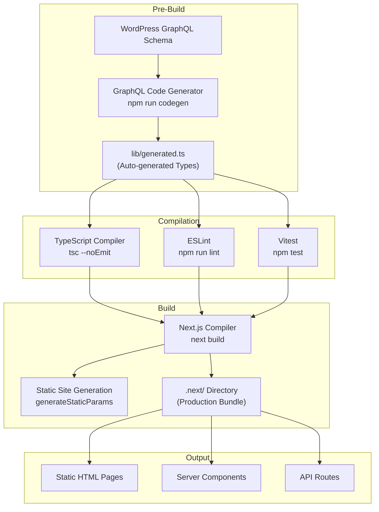
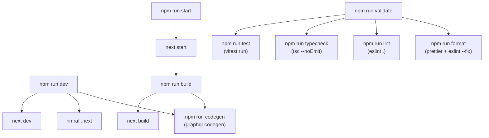
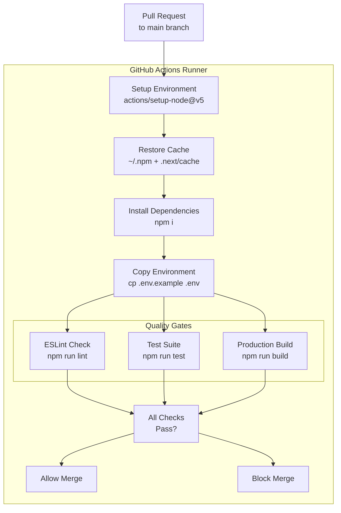
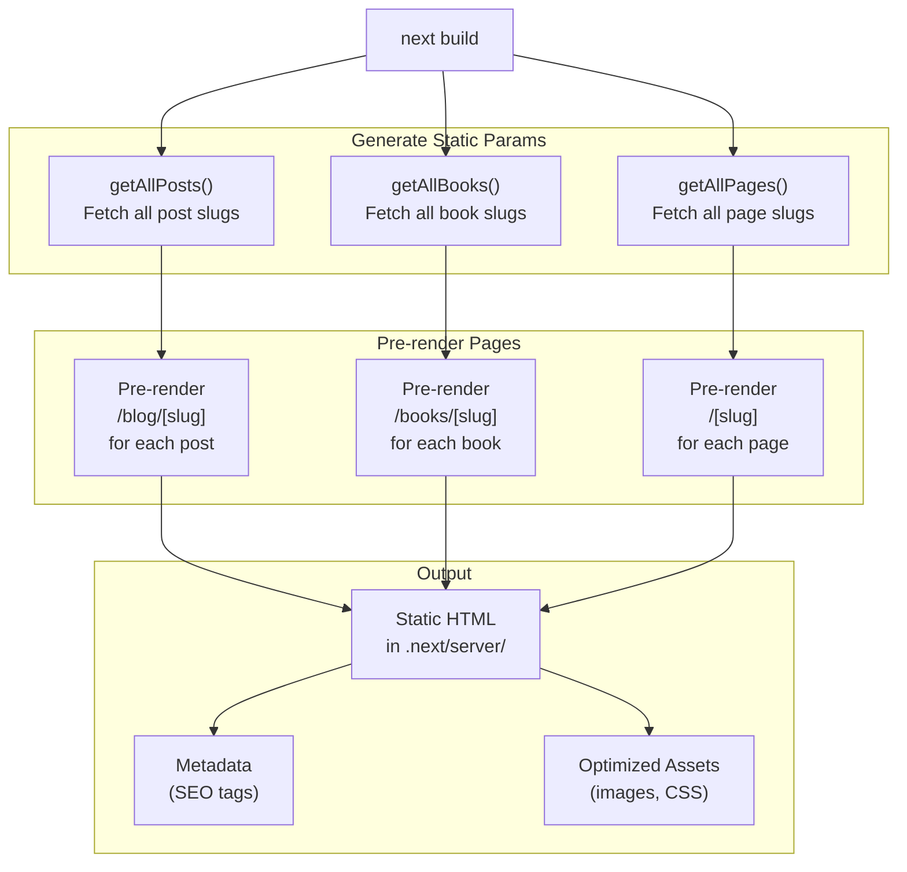
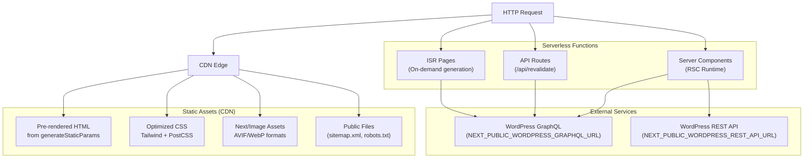
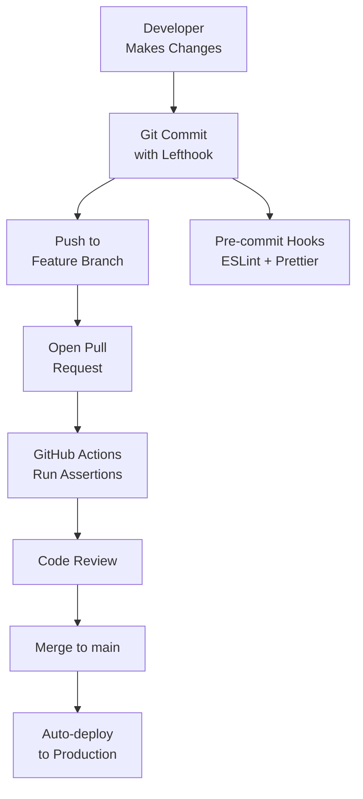

# Build and Deployment

> **Relevant source files**
> * [.github/workflows/assertions.yml](https://github.com/gregrickaby/nextjs-wordpress/blob/63f3f2f5/.github/workflows/assertions.yml)
> * [AGENTS.md](https://github.com/gregrickaby/nextjs-wordpress/blob/63f3f2f5/AGENTS.md)
> * [CONTRIBUTING.md](https://github.com/gregrickaby/nextjs-wordpress/blob/63f3f2f5/CONTRIBUTING.md)
> * [README.md](https://github.com/gregrickaby/nextjs-wordpress/blob/63f3f2f5/README.md)
> * [package-lock.json](https://github.com/gregrickaby/nextjs-wordpress/blob/63f3f2f5/package-lock.json)
> * [package.json](https://github.com/gregrickaby/nextjs-wordpress/blob/63f3f2f5/package.json)

This document provides an overview of the build process, continuous integration pipeline, and deployment strategies for the Next.js WordPress headless frontend. It covers the compilation workflow from source code to production artifacts, automated quality checks, and deployment considerations.

**Scope:**

* Build process overview and npm scripts
* CI/CD pipeline architecture with GitHub Actions
* Static generation strategies for posts, pages, and books
* Production deployment considerations and caching

**Related Pages:**

* For detailed build steps and TypeScript compilation, see [Build Process](/gregrickaby/nextjs-wordpress/9.1-build-process)
* For GitHub Actions workflows and automation, see [CI/CD Pipeline](/gregrickaby/nextjs-wordpress/9.2-cicd-pipeline)
* For `generateStaticParams` and SSG configuration, see [Static Generation](/gregrickaby/nextjs-wordpress/9.3-static-generation)

---

## Build System Overview

The build system consists of three primary stages: **code generation**, **compilation**, and **bundling**. Each stage transforms source code and produces artifacts required for production deployment.

**Build Pipeline Stages**



**Sources:** [package.json L16-L29](https://github.com/gregrickaby/nextjs-wordpress/blob/63f3f2f5/package.json#L16-L29)

 [README.md L40-L46](https://github.com/gregrickaby/nextjs-wordpress/blob/63f3f2f5/README.md#L40-L46)

 [AGENTS.md L82-L96](https://github.com/gregrickaby/nextjs-wordpress/blob/63f3f2f5/AGENTS.md#L82-L96)

---

## npm Script Architecture

The project uses npm scripts to orchestrate build tasks. Scripts are composed with dependencies to ensure correct execution order.

| Script | Command | Purpose | Dependencies |
| --- | --- | --- | --- |
| `dev` | `npm run codegen && rimraf .next && next dev` | Start development server | Runs `codegen` first, cleans `.next` cache |
| `build` | `npm run codegen && next build` | Production build | Runs `codegen` first, then Next.js build |
| `codegen` | `graphql-codegen --config codegen.ts` | Generate TypeScript types from GraphQL schema | Reads `codegen.ts` configuration |
| `lint` | `eslint .` | Run ESLint checks | None |
| `test` | `vitest run` | Execute test suite | None |
| `typecheck` | `npx tsc --noEmit` | Verify TypeScript compilation | None |
| `validate` | `npm run format && npm run lint && npm run typecheck && npm run test` | Complete validation suite | Runs format, lint, typecheck, test in sequence |
| `sonar` | `bash ./scripts/sonar-analysis.sh` | SonarQube code analysis | None |
| `start` | `next start` | Start production server | Requires prior `build` |

**Sources:** [package.json L16-L29](https://github.com/gregrickaby/nextjs-wordpress/blob/63f3f2f5/package.json#L16-L29)

 [AGENTS.md L82-L96](https://github.com/gregrickaby/nextjs-wordpress/blob/63f3f2f5/AGENTS.md#L82-L96)

---

## npm Script Dependency Graph

Understanding script composition helps optimize development and CI workflows.



**Sources:** [package.json L16-L29](https://github.com/gregrickaby/nextjs-wordpress/blob/63f3f2f5/package.json#L16-L29)

---

## Continuous Integration Pipeline

The CI pipeline enforces code quality through automated checks on every pull request. It uses GitHub Actions with aggressive caching to minimize build times.

**GitHub Actions Workflow**



**Sources:** [.github/workflows/assertions.yml L1-L49](https://github.com/gregrickaby/nextjs-wordpress/blob/63f3f2f5/.github/workflows/assertions.yml#L1-L49)

---

## CI Cache Strategy

Caching is critical for CI performance. The pipeline caches both npm dependencies and Next.js build artifacts.

**Cache Configuration**

| Cache Key | Path | Purpose | Invalidation |
| --- | --- | --- | --- |
| `${{ runner.os }}-nextjs-${{ hashFiles('**/package-lock.json') }}-${{ hashFiles('**/*.js', '**/*.jsx', '**/*.ts', '**/*.tsx') }}` | `~/.npm``.next/cache` | Preserve npm packages and Next.js incremental cache | Changes to `package-lock.json` or source files |
| Restore keys: `${{ runner.os }}-nextjs-${{ hashFiles('**/package-lock.json') }}-` | Same | Partial match fallback | Changes to `package-lock.json` only |

The cache uses a hierarchical key structure:

1. **Full match**: OS + package-lock hash + source file hashes (most specific)
2. **Partial match**: OS + package-lock hash (fallback)
3. **No match**: Fresh install (cold start)

**Sources:** [.github/workflows/assertions.yml L26-L33](https://github.com/gregrickaby/nextjs-wordpress/blob/63f3f2f5/.github/workflows/assertions.yml#L26-L33)

---

## Build Process Stages

The build process executes in three distinct stages, each with specific responsibilities.

### Stage 1: Code Generation

GraphQL Code Generator introspects the WordPress GraphQL schema and generates TypeScript types before any compilation occurs.

**Execution:**

```
npm run codegen
```

**Input:**

* `codegen.ts` - Configuration file
* WordPress GraphQL endpoint (from `NEXT_PUBLIC_WORDPRESS_GRAPHQL_URL`)

**Output:**

* `lib/generated.ts` - Auto-generated TypeScript types for WordPress entities

**Purpose:**

* Provides type safety for GraphQL queries and mutations
* Ensures frontend types match WordPress schema
* Enables IDE autocomplete for WordPress data structures

This stage is **always executed first** in both `dev` and `build` scripts to ensure types are current.

**Sources:** [package.json L17-L19](https://github.com/gregrickaby/nextjs-wordpress/blob/63f3f2f5/package.json#L17-L19)

 [AGENTS.md L81-L89](https://github.com/gregrickaby/nextjs-wordpress/blob/63f3f2f5/AGENTS.md#L81-L89)

 [README.md L41](https://github.com/gregrickaby/nextjs-wordpress/blob/63f3f2f5/README.md#L41-L41)

### Stage 2: Quality Validation

Before building production artifacts, the CI pipeline validates code quality through multiple checks.

**Checks (executed in parallel in CI):**

1. **ESLint** - Code style and patterns
2. **Vitest** - Unit and integration tests
3. **TypeScript** - Type checking (runs implicitly during build)

**Execution:**

```markdown
npm run lint    # ESLint validation
npm run test    # Run test suite
npm run build   # Includes TypeScript check
```

In local development, use `npm run validate` to run the complete validation suite sequentially.

**Sources:** [.github/workflows/assertions.yml L41-L48](https://github.com/gregrickaby/nextjs-wordpress/blob/63f3f2f5/.github/workflows/assertions.yml#L41-L48)

 [package.json L29](https://github.com/gregrickaby/nextjs-wordpress/blob/63f3f2f5/package.json#L29-L29)

### Stage 3: Next.js Build

The final stage compiles TypeScript, optimizes assets, and generates static pages.

**Execution:**

```
npm run build
```

**Build Steps:**

1. TypeScript compilation (TSC type checking)
2. Bundle optimization with webpack/Turbopack
3. Static page generation via `generateStaticParams`
4. Server component compilation
5. Asset optimization (images, fonts, CSS)

**Output:**

* `.next/` directory containing: * `static/` - Static assets with content hashes * `server/` - Server component bundles * `cache/` - Build cache for incremental builds

**Sources:** [package.json L17](https://github.com/gregrickaby/nextjs-wordpress/blob/63f3f2f5/package.json#L17-L17)

 [README.md L11](https://github.com/gregrickaby/nextjs-wordpress/blob/63f3f2f5/README.md#L11-L11)

---

## Static Generation Strategy

The application uses Next.js Static Site Generation (SSG) to pre-render pages at build time. Dynamic routes use `generateStaticParams` to define which pages to generate.

**Static vs Dynamic Routes**

| Route Pattern | Type | Strategy | Function |
| --- | --- | --- | --- |
| `/` | Static | Pre-rendered | No `generateStaticParams` needed |
| `/blog/[slug]` | Dynamic | SSG with `generateStaticParams` | Fetches all post slugs at build time |
| `/books/[slug]` | Dynamic | SSG with `generateStaticParams` | Fetches all book slugs at build time |
| `/[slug]` | Dynamic | SSG with `generateStaticParams` | Fetches all page slugs at build time |
| `/api/revalidate` | API Route | Runtime | Not pre-rendered |

**Static Generation Flow**



For detailed implementation of `generateStaticParams`, see [Static Generation](/gregrickaby/nextjs-wordpress/9.3-static-generation).

**Sources:** [README.md L31](https://github.com/gregrickaby/nextjs-wordpress/blob/63f3f2f5/README.md#L31-L31)

 [README.md L167-L181](https://github.com/gregrickaby/nextjs-wordpress/blob/63f3f2f5/README.md#L167-L181)

---

## Production Deployment Architecture

The application is designed for deployment on serverless platforms like Vercel or Netlify. The architecture supports both static files and server-side rendering.

**Deployment Components**



**Sources:** [next.config.ts](https://github.com/gregrickaby/nextjs-wordpress/blob/63f3f2f5/next.config.ts)

 [lib/config.ts](https://github.com/gregrickaby/nextjs-wordpress/blob/63f3f2f5/lib/config.ts)

---

## Environment Variables for Deployment

Production deployments require environment variables to be configured in the hosting platform.

**Required Variables**

| Variable | Purpose | Example | Required |
| --- | --- | --- | --- |
| `NEXT_PUBLIC_WORDPRESS_GRAPHQL_URL` | WordPress GraphQL endpoint | `https://blog.site.com/graphql` | Yes |
| `NEXT_PUBLIC_WORDPRESS_REST_API_URL` | WordPress REST API endpoint | `https://blog.site.com/wp-json/wp/v2` | Yes |
| `NEXTJS_PREVIEW_SECRET` | Preview mode authentication | Any random string | Yes |
| `NEXTJS_REVALIDATION_SECRET` | On-demand revalidation auth | Any random string | Yes |
| `NEXTJS_AUTH_REFRESH_TOKEN` | JWT token for draft content | From WordPress GraphQL mutation | Optional |

**Security Notes:**

* Never commit secrets to version control
* Secrets must match corresponding `wp-config.php` constants in WordPress
* Refresh token only needed if preview mode is required
* All secrets should be cryptographically random strings

**Sources:** [README.md L64-L87](https://github.com/gregrickaby/nextjs-wordpress/blob/63f3f2f5/README.md#L64-L87)

 [README.md L146-L161](https://github.com/gregrickaby/nextjs-wordpress/blob/63f3f2f5/README.md#L146-L161)

 [README.md L185-L222](https://github.com/gregrickaby/nextjs-wordpress/blob/63f3f2f5/README.md#L185-L222)

---

## Production Considerations

### Rate Limiting

The revalidation API includes basic in-memory rate limiting (10 requests/minute per IP). This is insufficient for production in serverless environments.

**Recommended Solutions:**

* Use Redis (Upstash) for distributed rate limiting
* Use Vercel KV for edge-compatible rate limiting
* Configure CDN-level rate limiting

**Sources:** [README.md L389-L394](https://github.com/gregrickaby/nextjs-wordpress/blob/63f3f2f5/README.md#L389-L394)

### Caching Strategy

The application uses Next.js Incremental Static Regeneration (ISR) with on-demand revalidation.

**Cache Configuration:**

* `revalidate: 3600` - Pages revalidate every hour (configurable in `lib/config.ts`)
* On-demand revalidation via `/api/revalidate` webhook
* Cache tags: `graphql`, post/page/book slugs, content type tags

For detailed caching architecture, see [Caching and Revalidation](/gregrickaby/nextjs-wordpress/3.3-caching-and-revalidation).

**Sources:** [lib/config.ts](https://github.com/gregrickaby/nextjs-wordpress/blob/63f3f2f5/lib/config.ts)

 [README.md L31](https://github.com/gregrickaby/nextjs-wordpress/blob/63f3f2f5/README.md#L31-L31)

### Build Performance

**Optimization Techniques:**

1. **Incremental builds** - Next.js caches unchanged pages
2. **npm cache** - CI caches `~/.npm` to avoid reinstalls
3. **Build cache** - CI preserves `.next/cache` between runs
4. **Parallel checks** - Lint, test, and build can run in parallel
5. **GraphQL codegen cache** - Generated types only regenerate when schema changes

**Sources:** [.github/workflows/assertions.yml L26-L33](https://github.com/gregrickaby/nextjs-wordpress/blob/63f3f2f5/.github/workflows/assertions.yml#L26-L33)

---

## Deployment Workflow

A typical deployment follows this workflow:



**Steps:**

1. Developer commits code (lefthook runs pre-commit checks)
2. Push triggers GitHub Actions assertions workflow
3. CI validates: lint, test, build
4. Code review by maintainer
5. Merge to `main` triggers production deployment (platform-specific)

**Sources:** [.github/workflows/assertions.yml L1-L49](https://github.com/gregrickaby/nextjs-wordpress/blob/63f3f2f5/.github/workflows/assertions.yml#L1-L49)

 [CONTRIBUTING.md L59-L90](https://github.com/gregrickaby/nextjs-wordpress/blob/63f3f2f5/CONTRIBUTING.md#L59-L90)

---

## Next Steps

* **[Build Process](/gregrickaby/nextjs-wordpress/9.1-build-process)** - Detailed breakdown of TypeScript compilation and Next.js build
* **[CI/CD Pipeline](/gregrickaby/nextjs-wordpress/9.2-cicd-pipeline)** - In-depth GitHub Actions workflow configuration
* **[Static Generation](/gregrickaby/nextjs-wordpress/9.3-static-generation)** - Implementation details for `generateStaticParams` and SSG

**Sources:** [package.json L1-L72](https://github.com/gregrickaby/nextjs-wordpress/blob/63f3f2f5/package.json#L1-L72)

 [README.md L1-L420](https://github.com/gregrickaby/nextjs-wordpress/blob/63f3f2f5/README.md#L1-L420)

 [.github/workflows/assertions.yml L1-L49](https://github.com/gregrickaby/nextjs-wordpress/blob/63f3f2f5/.github/workflows/assertions.yml#L1-L49)

 [AGENTS.md L1-L508](https://github.com/gregrickaby/nextjs-wordpress/blob/63f3f2f5/AGENTS.md#L1-L508)

 [CONTRIBUTING.md L1-L290](https://github.com/gregrickaby/nextjs-wordpress/blob/63f3f2f5/CONTRIBUTING.md#L1-L290)