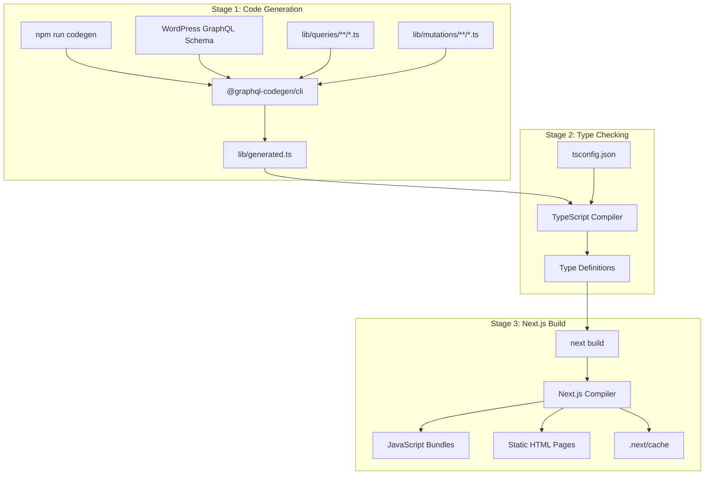
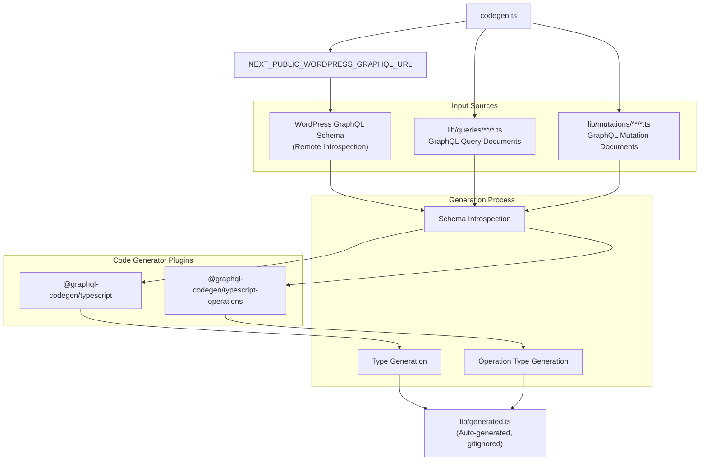
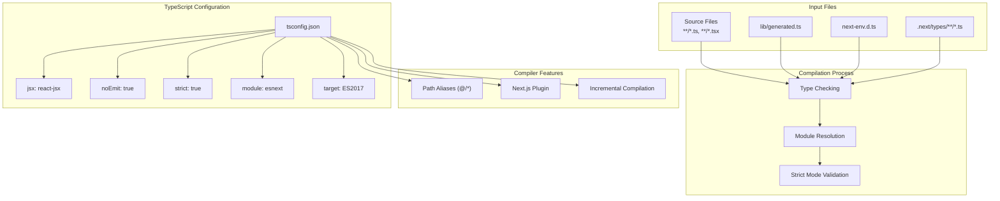
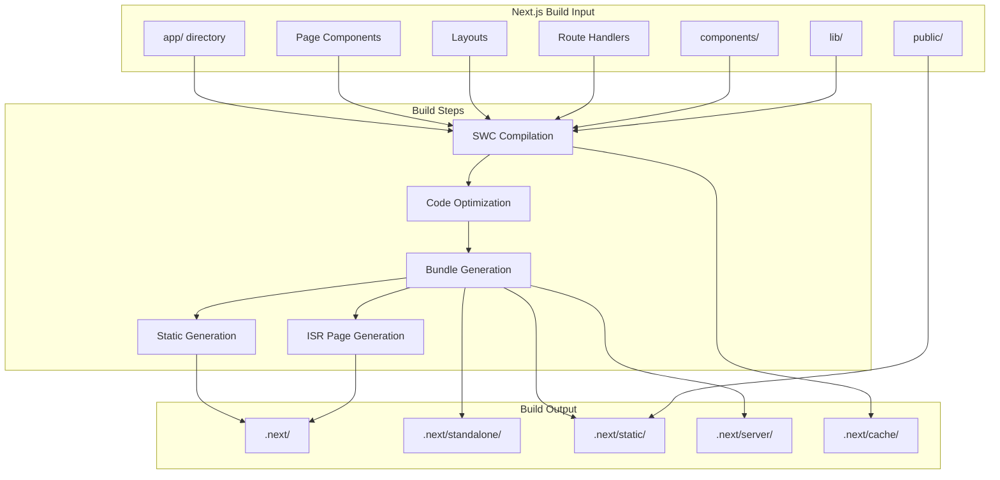
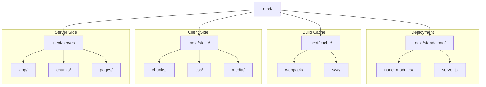

---
layout: default
title: Build Process
parent: Build and Deployment
nav_order: 1
---

# Build Process

> **Relevant source files**
> * [.nvmrc](https://github.com/gregrickaby/nextjs-wordpress/blob/63f3f2f5/.nvmrc)
> * [app/feed.xml/route.ts](https://github.com/gregrickaby/nextjs-wordpress/blob/63f3f2f5/app/feed.xml/route.ts)
> * [app/robots.ts](https://github.com/gregrickaby/nextjs-wordpress/blob/63f3f2f5/app/robots.ts)
> * [app/sitemap.ts](https://github.com/gregrickaby/nextjs-wordpress/blob/63f3f2f5/app/sitemap.ts)
> * [codegen.ts](https://github.com/gregrickaby/nextjs-wordpress/blob/63f3f2f5/codegen.ts)
> * [eslint.config.mjs](https://github.com/gregrickaby/nextjs-wordpress/blob/63f3f2f5/eslint.config.mjs)
> * [package-lock.json](https://github.com/gregrickaby/nextjs-wordpress/blob/63f3f2f5/package-lock.json)
> * [package.json](https://github.com/gregrickaby/nextjs-wordpress/blob/63f3f2f5/package.json)
> * [tsconfig.json](https://github.com/gregrickaby/nextjs-wordpress/blob/63f3f2f5/tsconfig.json)

## Purpose and Scope

This document describes the build process for the Next.js WordPress headless application, including GraphQL code generation, TypeScript compilation, and Next.js production build steps. It covers the tooling, configuration, and sequence of operations that transform source code into production-ready artifacts.

For information about continuous integration and automated builds, see [CI/CD Pipeline](/gregrickaby/nextjs-wordpress/9.2-cicd-pipeline). For details on static site generation and pre-rendering strategies, see [Static Generation](/gregrickaby/nextjs-wordpress/9.3-static-generation).

---

## Build Pipeline Overview

The build process consists of three sequential stages: GraphQL code generation, TypeScript compilation, and Next.js bundling. Each stage depends on the successful completion of the previous stage.



**Build Pipeline Stages**

The build command executes as: `npm run codegen && next build`

Sources: [package.json L17](https://github.com/gregrickaby/nextjs-wordpress/blob/63f3f2f5/package.json#L17-L17)

---

## Build Script Commands

The application provides several npm scripts for building and validation:

| Script | Command | Purpose |
| --- | --- | --- |
| `build` | `npm run codegen && next build` | Full production build |
| `codegen` | `graphql-codegen --config codegen.ts` | Generate TypeScript types from GraphQL |
| `dev` | `npm run codegen && rimraf .next && next dev` | Development server with code generation |
| `typecheck` | `npx tsc --noEmit` | Type checking without emitting files |
| `lint` | `eslint .` | Lint source code |
| `format` | `eslint --fix && prettier '**/*.{...}' --write` | Format and fix code |
| `test` | `vitest run` | Run unit tests |
| `validate` | `npm run format && npm run lint && npm run typecheck && npm run test` | Full validation pipeline |

Sources: [package.json L16-L29](https://github.com/gregrickaby/nextjs-wordpress/blob/63f3f2f5/package.json#L16-L29)

---

## Stage 1: GraphQL Code Generation

### Code Generation Configuration

The GraphQL code generator introspects the WordPress GraphQL schema and generates TypeScript types for all queries and mutations. This occurs before every build and development server start.



**Code Generation Flow**

The generator reads the configuration from `codegen.ts` and connects to the WordPress GraphQL endpoint specified in the environment variable.

### Configuration Details

The code generation configuration is defined in [codegen.ts L4-L21](https://github.com/gregrickaby/nextjs-wordpress/blob/63f3f2f5/codegen.ts#L4-L21)

:

| Configuration Option | Value | Purpose |
| --- | --- | --- |
| `schema` | `process.env.NEXT_PUBLIC_WORDPRESS_GRAPHQL_URL` | WordPress GraphQL endpoint URL |
| `documents` | `['lib/queries/**/*.ts', 'lib/mutations/**/*.ts']` | GraphQL operation documents |
| `generates['./lib/generated.ts']` | TypeScript output file | Generated types destination |
| `plugins` | `['typescript', 'typescript-operations']` | Code generator plugins |
| `avoidOptionals` | `false` | Generate optional properties |
| `maybeValue` | `'T \| null'` | Type for nullable values |
| `skipTypename` | `true` | Omit `__typename` field |
| `enumsAsTypes` | `true` | Generate enums as union types |
| `ignoreNoDocuments` | `true` | Don't error if no documents found |

The generated file `lib/generated.ts` is excluded from version control via `.gitignore` and must be regenerated in each environment.

Sources: [codegen.ts L1-L21](https://github.com/gregrickaby/nextjs-wordpress/blob/63f3f2f5/codegen.ts#L1-L21)

 [package.json L18](https://github.com/gregrickaby/nextjs-wordpress/blob/63f3f2f5/package.json#L18-L18)

### Code Generator Dependencies

The code generation process uses these npm packages:

* `@graphql-codegen/cli` (v6.1.0) - CLI tool for code generation
* `@graphql-codegen/typescript` (v5.0.6) - Generates TypeScript type definitions
* `@graphql-codegen/typescript-operations` (v5.0.6) - Generates types for GraphQL operations

Sources: [package.json L38-L40](https://github.com/gregrickaby/nextjs-wordpress/blob/63f3f2f5/package.json#L38-L40)

---

## Stage 2: TypeScript Compilation

### TypeScript Compiler Configuration

The TypeScript compiler validates types and ensures type safety throughout the build process. The compiler is configured via `tsconfig.json` with Next.js-specific settings.



**TypeScript Compilation Process**

The compiler reads configuration, type checks all source files, resolves modules using path aliases, and validates strict mode requirements.

### Key TypeScript Settings

Configuration from [tsconfig.json L1-L35](https://github.com/gregrickaby/nextjs-wordpress/blob/63f3f2f5/tsconfig.json#L1-L35)

:

| Setting | Value | Purpose |
| --- | --- | --- |
| `target` | `ES2017` | JavaScript version for output |
| `lib` | `["dom", "dom.iterable", "esnext"]` | Type definitions to include |
| `strict` | `true` | Enable all strict type checking |
| `noEmit` | `true` | Don't emit JavaScript files (Next.js handles this) |
| `module` | `esnext` | Use ES modules |
| `moduleResolution` | `bundler` | Modern bundler resolution |
| `jsx` | `react-jsx` | New JSX transform |
| `incremental` | `true` | Enable incremental compilation |
| `baseUrl` | `.` | Base directory for module resolution |
| `paths['@/*']` | `["./*"]` | Path alias for imports |
| `types` | `["vitest/globals", "@testing-library/jest-dom"]` | Additional type definitions |

The `noEmit: true` setting means TypeScript only performs type checking without generating output files. The actual JavaScript bundling is handled by Next.js compiler (SWC).

Sources: [tsconfig.json L2-L25](https://github.com/gregrickaby/nextjs-wordpress/blob/63f3f2f5/tsconfig.json#L2-L25)

### Type Checking Command

Type checking can be run independently of the build:

```
npx tsc --noEmit
```

This validates all TypeScript files without emitting output, useful for CI/CD validation.

Sources: [package.json L28](https://github.com/gregrickaby/nextjs-wordpress/blob/63f3f2f5/package.json#L28-L28)

---

## Stage 3: Next.js Build Process

### Next.js Build Architecture

The Next.js build process compiles the application, generates static pages, optimizes assets, and creates production-ready bundles.



**Next.js Build Steps**

The build process transforms source code into optimized production artifacts in the `.next` directory.

### Build Configuration

Next.js build behavior is controlled by `next.config.ts` settings (not shown in provided files) and environment variables. The build produces several types of outputs:

| Output Type | Location | Purpose |
| --- | --- | --- |
| Server bundles | `.next/server/` | Server-side code for SSR and API routes |
| Static assets | `.next/static/` | JavaScript bundles, CSS, images |
| HTML pages | `.next/server/app/` | Pre-rendered HTML pages |
| Build cache | `.next/cache/` | Incremental build cache |
| Standalone | `.next/standalone/` | Self-contained deployment package |

### Static Asset Generation

The build process generates several static assets automatically:

* **RSS Feed**: Generated via [app/feed.xml/route.ts L10-L57](https://github.com/gregrickaby/nextjs-wordpress/blob/63f3f2f5/app/feed.xml/route.ts#L10-L57)
* **Sitemap**: Generated via [app/sitemap.ts L26-L45](https://github.com/gregrickaby/nextjs-wordpress/blob/63f3f2f5/app/sitemap.ts#L26-L45)
* **Robots.txt**: Generated via [app/robots.ts L9-L17](https://github.com/gregrickaby/nextjs-wordpress/blob/63f3f2f5/app/robots.ts#L9-L17)

These route handlers are executed during build to create static files.

Sources: [app/feed.xml/route.ts L1-L58](https://github.com/gregrickaby/nextjs-wordpress/blob/63f3f2f5/app/feed.xml/route.ts#L1-L58)

 [app/sitemap.ts L1-L46](https://github.com/gregrickaby/nextjs-wordpress/blob/63f3f2f5/app/sitemap.ts#L1-L46)

 [app/robots.ts L1-L18](https://github.com/gregrickaby/nextjs-wordpress/blob/63f3f2f5/app/robots.ts#L1-L18)

---

## Build Dependencies

### Core Build Tools

The build process relies on these primary dependencies:

| Package | Version | Purpose |
| --- | --- | --- |
| `next` | ^16.0.6 | Next.js framework and build system |
| `react` | ^19.2.0 | React library |
| `react-dom` | ^19.2.0 | React DOM rendering |
| `typescript` | ^5.9.3 | TypeScript compiler |

### Build-time DevDependencies

Development dependencies used during build:

| Package | Version | Purpose |
| --- | --- | --- |
| `@graphql-codegen/cli` | ^6.1.0 | GraphQL code generation CLI |
| `@graphql-codegen/typescript` | ^5.0.6 | TypeScript type generator |
| `@graphql-codegen/typescript-operations` | ^5.0.6 | Operation type generator |
| `babel-plugin-react-compiler` | ^1.0.0 | React compiler plugin |
| `rimraf` | ^6.1.2 | Cross-platform directory removal |
| `dotenv` | ^17.2.3 | Environment variable loading |

### Styling and Asset Processing

| Package | Version | Purpose |
| --- | --- | --- |
| `tailwindcss` | ^4.1.17 | Utility-first CSS framework |
| `@tailwindcss/postcss` | ^4.1.17 | Tailwind PostCSS integration |
| `postcss` | ^8.5.6 | CSS transformation tool |
| `postcss-import` | ^16.1.1 | PostCSS import plugin |
| `autoprefixer` | ^10.4.22 | CSS vendor prefix automation |

Sources: [package.json L31-L71](https://github.com/gregrickaby/nextjs-wordpress/blob/63f3f2f5/package.json#L31-L71)

---

## Build Artifacts

### Output Directory Structure



**Build Output Structure**

The `.next` directory contains all build artifacts organized by purpose.

### Generated File Types

| File Type | Location | Purpose |
| --- | --- | --- |
| `.js` bundles | `.next/static/chunks/` | JavaScript code split into chunks |
| `.css` files | `.next/static/css/` | Compiled and optimized CSS |
| `.html` files | `.next/server/app/` | Pre-rendered HTML pages |
| `.json` manifests | `.next/` | Build manifests and metadata |
| Route handlers | `.next/server/app/` | API route handler functions |
| Server components | `.next/server/app/` | React Server Components |

The `.next` directory is excluded from version control and must be regenerated in each environment.

---

## Development vs Production Builds

### Development Build Process

The development command includes additional steps:

```
npm run codegen && rimraf .next && next dev
```

This performs:

1. GraphQL code generation (`npm run codegen`)
2. Clean removal of `.next` directory (`rimraf .next`)
3. Start Next.js development server (`next dev`)

The development server enables:

* Fast Refresh for instant updates
* Source maps for debugging
* Unoptimized builds for faster compilation
* Detailed error messages

Sources: [package.json L19](https://github.com/gregrickaby/nextjs-wordpress/blob/63f3f2f5/package.json#L19-L19)

### Production Build Process

The production command optimizes for deployment:

```
npm run codegen && next build
```

This performs:

1. GraphQL code generation
2. Full Next.js production build with optimizations

The production build includes:

* Code minification and compression
* Tree shaking to remove unused code
* Image optimization
* Route pre-rendering (SSG/ISR)
* Bundle splitting for optimal loading

Sources: [package.json L17](https://github.com/gregrickaby/nextjs-wordpress/blob/63f3f2f5/package.json#L17-L17)

---

## Build Validation

### Pre-build Validation

The `validate` command runs all quality checks before building:

```
npm run format && npm run lint && npm run typecheck && npm run test
```

This executes:

1. **Format**: ESLint fixes and Prettier formatting
2. **Lint**: ESLint validation
3. **Typecheck**: TypeScript type checking
4. **Test**: Vitest unit tests

Sources: [package.json L29](https://github.com/gregrickaby/nextjs-wordpress/blob/63f3f2f5/package.json#L29-L29)

### Code Quality Tools

| Tool | Configuration File | Purpose |
| --- | --- | --- |
| ESLint | `eslint.config.mjs` | Code linting and error detection |
| Prettier | `.prettierrc` | Code formatting |
| TypeScript | `tsconfig.json` | Type checking |
| Vitest | `vitest.config.ts` | Unit testing |

The ESLint configuration extends Next.js recommended rules and Prettier config:

Sources: [eslint.config.mjs L1-L33](https://github.com/gregrickaby/nextjs-wordpress/blob/63f3f2f5/eslint.config.mjs#L1-L33)

 [package.json L29](https://github.com/gregrickaby/nextjs-wordpress/blob/63f3f2f5/package.json#L29-L29)

---

## Environment Requirements

### Required Environment Variables

The build process requires these environment variables:

| Variable | Purpose | Required For |
| --- | --- | --- |
| `NEXT_PUBLIC_WORDPRESS_GRAPHQL_URL` | WordPress GraphQL endpoint | Code generation, runtime queries |
| `WORDPRESS_APPLICATION_PASSWORD` | WordPress authentication | Preview mode, mutations |
| `REVALIDATION_SECRET` | On-demand revalidation security | Webhook revalidation |

The GraphQL endpoint must be accessible during build for schema introspection.

Sources: [codegen.ts L5](https://github.com/gregrickaby/nextjs-wordpress/blob/63f3f2f5/codegen.ts#L5-L5)

### Node.js Version

The application requires Node.js v24 as specified in [.nvmrc L1](https://github.com/gregrickaby/nextjs-wordpress/blob/63f3f2f5/.nvmrc#L1-L1)

Runtime dependencies specify Node.js >= 18 for various packages, but the project standardizes on v24 for consistency.

Sources: [.nvmrc L1](https://github.com/gregrickaby/nextjs-wordpress/blob/63f3f2f5/.nvmrc#L1-L1)

---

## Build Performance Optimization

### Caching Strategies

The build process uses multiple caching layers:

1. **Next.js Build Cache**: Incremental builds in `.next/cache/`
2. **TypeScript Incremental**: `tsconfig.json` enables incremental compilation
3. **SWC Cache**: Rust-based compiler caching
4. **npm Package Cache**: Package-lock ensures consistent dependencies

### Incremental Builds

TypeScript incremental compilation is enabled via [tsconfig.json L15](https://github.com/gregrickaby/nextjs-wordpress/blob/63f3f2f5/tsconfig.json#L15-L15)

 storing build information between compilations for faster subsequent builds.

### Dependency Resolution

The `package-lock.json` file locks all dependency versions to exact versions, ensuring reproducible builds across environments. This prevents "works on my machine" issues.

Sources: [tsconfig.json L15](https://github.com/gregrickaby/nextjs-wordpress/blob/63f3f2f5/tsconfig.json#L15-L15)

 [package-lock.json L1-L50](https://github.com/gregrickaby/nextjs-wordpress/blob/63f3f2f5/package-lock.json#L1-L50)

---

## Troubleshooting Common Build Issues

### GraphQL Code Generation Failures

**Symptom**: `npm run codegen` fails with connection error

**Causes**:

* Missing or incorrect `NEXT_PUBLIC_WORDPRESS_GRAPHQL_URL`
* WordPress GraphQL endpoint not accessible
* Network connectivity issues

**Solution**: Verify environment variable and WordPress availability

### TypeScript Compilation Errors

**Symptom**: Build fails with type errors

**Causes**:

* Outdated `lib/generated.ts` (not regenerated after schema changes)
* Missing type definitions
* Strict mode violations

**Solution**: Run `npm run codegen` to regenerate types

### Build Cache Issues

**Symptom**: Stale or inconsistent builds

**Solution**: Clear build cache:

```
rimraf .next
npm run build
```

Sources: [package.json L17-L19](https://github.com/gregrickaby/nextjs-wordpress/blob/63f3f2f5/package.json#L17-L19)