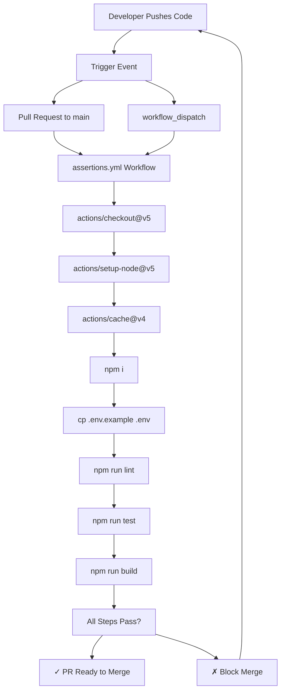
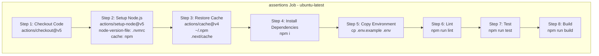
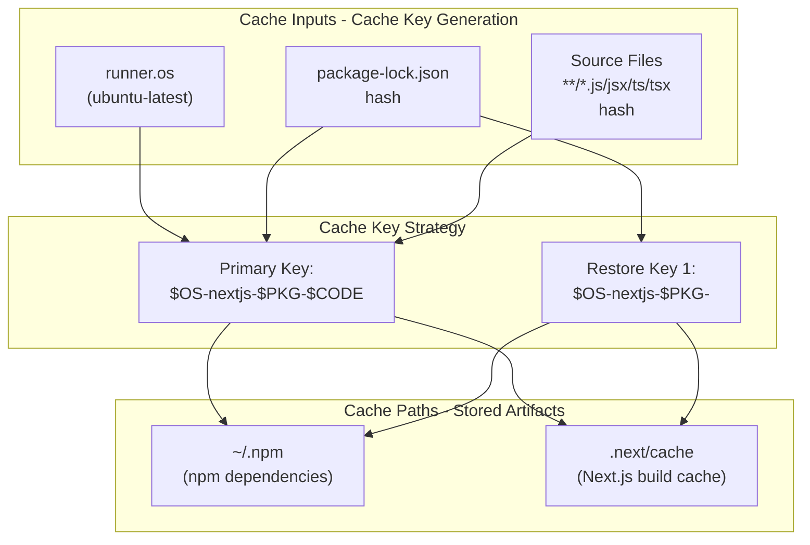
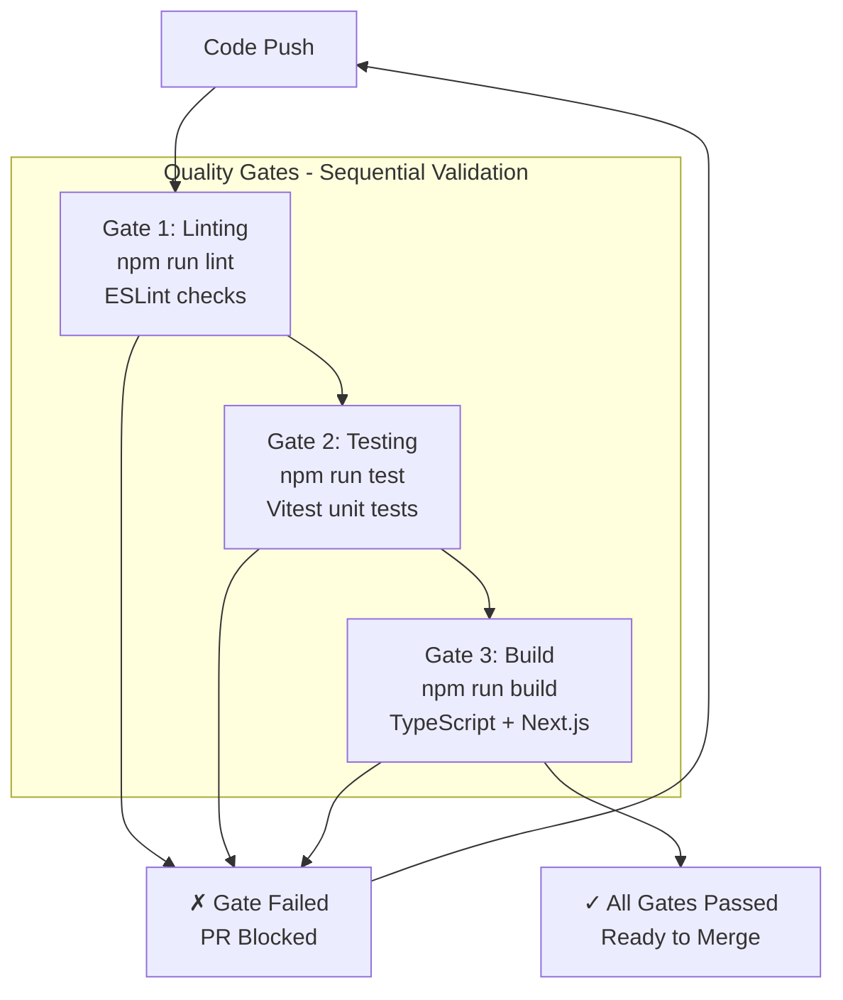
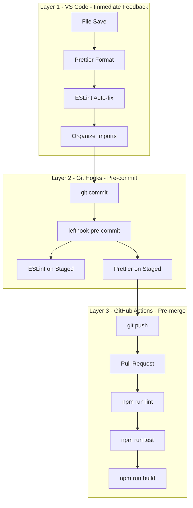

---
layout: default
title: CI/CD Pipeline
parent: Build and Deployment
nav_order: 2
---

# CI/CD Pipeline

> **Relevant source files**
> * [.github/workflows/assertions.yml](https://github.com/gregrickaby/nextjs-wordpress/blob/63f3f2f5/.github/workflows/assertions.yml)
> * [AGENTS.md](https://github.com/gregrickaby/nextjs-wordpress/blob/63f3f2f5/AGENTS.md)
> * [CONTRIBUTING.md](https://github.com/gregrickaby/nextjs-wordpress/blob/63f3f2f5/CONTRIBUTING.md)
> * [README.md](https://github.com/gregrickaby/nextjs-wordpress/blob/63f3f2f5/README.md)
> * [package-lock.json](https://github.com/gregrickaby/nextjs-wordpress/blob/63f3f2f5/package-lock.json)
> * [package.json](https://github.com/gregrickaby/nextjs-wordpress/blob/63f3f2f5/package.json)

This document describes the GitHub Actions continuous integration (CI) pipeline that validates code quality, runs tests, and ensures builds succeed before code can be merged. The CI pipeline enforces quality gates automatically on every pull request to the `main` branch.

**Scope:** This page covers the automated CI/CD pipeline using GitHub Actions. For local validation workflows, see [Git Hooks](/gregrickaby/nextjs-wordpress/7.3-git-hooks). For detailed information about individual quality tools, see [Code Quality Tools](/gregrickaby/nextjs-wordpress/7.2-code-quality-tools). For build process details, see [Build Process](/gregrickaby/nextjs-wordpress/9.1-build-process).

---

## Overview

The project uses a single GitHub Actions workflow named **Assertions** that runs automatically on pull requests to `main`. The workflow performs linting, testing, and building to ensure code quality before merge. It uses aggressive caching to minimize build times and enforces strict quality gates.

**Key Characteristics:**

* **Single workflow file:** [.github/workflows/assertions.yml L1-L49](https://github.com/gregrickaby/nextjs-wordpress/blob/63f3f2f5/.github/workflows/assertions.yml#L1-L49)
* **Trigger:** Pull requests to `main` branch and manual workflow dispatch
* **Runner:** `ubuntu-latest`
* **Node version:** Determined by [.nvmrc](https://github.com/gregrickaby/nextjs-wordpress/blob/63f3f2f5/.nvmrc)  file
* **Quality gates:** Linting, testing, and successful build required for merge

Sources: [.github/workflows/assertions.yml L1-L49](https://github.com/gregrickaby/nextjs-wordpress/blob/63f3f2f5/.github/workflows/assertions.yml#L1-L49)

 [README.md L1-L420](https://github.com/gregrickaby/nextjs-wordpress/blob/63f3f2f5/README.md#L1-L420)

 [AGENTS.md L1-L508](https://github.com/gregrickaby/nextjs-wordpress/blob/63f3f2f5/AGENTS.md#L1-L508)

---

## Workflow Architecture

### Complete CI/CD Flow



**Sources:** [.github/workflows/assertions.yml L1-L49](https://github.com/gregrickaby/nextjs-wordpress/blob/63f3f2f5/.github/workflows/assertions.yml#L1-L49)

 [package.json L16-L29](https://github.com/gregrickaby/nextjs-wordpress/blob/63f3f2f5/package.json#L16-L29)

---

### Workflow Job Steps

The workflow executes a single job named `assertions` with the following steps in sequence:



**Step Details:**

| Step | Action/Command | Purpose | Failure Impact |
| --- | --- | --- | --- |
| 1 | `actions/checkout@v5` | Clone repository code | Cannot proceed |
| 2 | `actions/setup-node@v5` | Install Node.js from `.nvmrc` | Cannot proceed |
| 3 | `actions/cache@v4` | Restore npm and Next.js cache | Slower builds (non-blocking) |
| 4 | `npm i` | Install dependencies | Cannot proceed |
| 5 | `cp .env.example .env` | Create environment file | Build may fail |
| 6 | `npm run lint` | ESLint code quality check | **Blocks merge** |
| 7 | `npm run test` | Vitest unit tests | **Blocks merge** |
| 8 | `npm run build` | Next.js production build | **Blocks merge** |

**Sources:** [.github/workflows/assertions.yml L18-L48](https://github.com/gregrickaby/nextjs-wordpress/blob/63f3f2f5/.github/workflows/assertions.yml#L18-L48)

 [package.json L16-L29](https://github.com/gregrickaby/nextjs-wordpress/blob/63f3f2f5/package.json#L16-L29)

---

## Workflow Configuration

### Trigger Configuration

The workflow triggers on two events:

```yaml
on:
  pull_request:
    branches: [main]
  workflow_dispatch:
```

**Event Details:**

| Event | Trigger Condition | Use Case |
| --- | --- | --- |
| `pull_request` | Any PR targeting `main` branch | Automatic validation before merge |
| `workflow_dispatch` | Manual trigger from GitHub UI | Manual testing, debugging, re-runs |

**Sources:** [.github/workflows/assertions.yml L3-L9](https://github.com/gregrickaby/nextjs-wordpress/blob/63f3f2f5/.github/workflows/assertions.yml#L3-L9)

### Permissions

The workflow runs with minimal permissions:

```yaml
permissions:
  contents: read
```

This restricts the workflow to read-only access to repository contents, following the principle of least privilege. The workflow cannot write to the repository, create releases, or modify issues.

**Sources:** [.github/workflows/assertions.yml L11-L12](https://github.com/gregrickaby/nextjs-wordpress/blob/63f3f2f5/.github/workflows/assertions.yml#L11-L12)

---

## Caching Strategy

### Cache Configuration

The workflow uses aggressive caching to minimize build times:



**Cache Key Composition:**

The primary cache key includes three components:

1. **Operating System:** `${{ runner.os }}` - Always `Linux` on `ubuntu-latest`
2. **Dependency Hash:** `${{ hashFiles('**/package-lock.json') }}` - Changes when dependencies change
3. **Source Code Hash:** `${{ hashFiles('**/*.js', '**/*.jsx', '**/*.ts', '**/*.tsx') }}` - Changes when source files change

**Cache Restoration Logic:**

* **Exact match on primary key:** Full cache hit, fastest builds
* **Partial match on restore key:** Restores npm cache but rebuilds Next.js cache
* **No match:** Full installation and build, slowest (first run)

**Sources:** [.github/workflows/assertions.yml L26-L33](https://github.com/gregrickaby/nextjs-wordpress/blob/63f3f2f5/.github/workflows/assertions.yml#L26-L33)

### Cache Paths

Two directories are cached:

```go
~/.npm                    # npm package cache
.next/cache              # Next.js build artifacts
```

**Cache Benefits:**

| Cached Item | Speeds Up | Typical Savings |
| --- | --- | --- |
| `~/.npm` | `npm i` step | 30-60 seconds |
| `.next/cache` | Next.js build | 1-3 minutes |

The combination of both caches can reduce CI time from ~5 minutes to ~2 minutes on repeated runs.

**Sources:** [.github/workflows/assertions.yml L28-L30](https://github.com/gregrickaby/nextjs-wordpress/blob/63f3f2f5/.github/workflows/assertions.yml#L28-L30)

---

## Quality Gates

### Validation Steps

Each quality gate must pass for the PR to be mergeable:



**Sources:** [.github/workflows/assertions.yml L41-L48](https://github.com/gregrickaby/nextjs-wordpress/blob/63f3f2f5/.github/workflows/assertions.yml#L41-L48)

 [package.json L16-L29](https://github.com/gregrickaby/nextjs-wordpress/blob/63f3f2f5/package.json#L16-L29)

### Lint Gate

**Command:** `npm run lint`

Executes ESLint on the entire codebase using the configuration in `eslint.config.mjs`:

```
"lint": "eslint ."
```

**What It Checks:**

* TypeScript type errors via `@typescript-eslint`
* React best practices via `eslint-config-next`
* Code formatting compatibility via `eslint-config-prettier`
* Custom project rules

**Failure Examples:**

* Unused variables
* Missing return types
* Incorrect React hooks usage
* Type mismatches

**Sources:** [package.json L21](https://github.com/gregrickaby/nextjs-wordpress/blob/63f3f2f5/package.json#L21-L21)

 [.github/workflows/assertions.yml L41-L42](https://github.com/gregrickaby/nextjs-wordpress/blob/63f3f2f5/.github/workflows/assertions.yml#L41-L42)

### Test Gate

**Command:** `npm run test`

Runs the complete Vitest test suite in CI mode:

```
"test": "vitest run"
```

**What It Executes:**

* All unit tests in `*.test.ts` and `*.test.tsx` files
* Component tests with React Testing Library
* MSW v2 API mocks for GraphQL queries
* Accessibility tests with jest-axe

**Failure Examples:**

* Test assertions fail
* Component rendering errors
* API mock mismatches
* Accessibility violations

**Coverage Requirement:**

The project targets 80%+ test coverage, though this is not enforced in CI. Coverage can be generated locally with `npm run test:coverage`.

**Sources:** [package.json L24](https://github.com/gregrickaby/nextjs-wordpress/blob/63f3f2f5/package.json#L24-L24)

 [.github/workflows/assertions.yml L44-L45](https://github.com/gregrickaby/nextjs-wordpress/blob/63f3f2f5/.github/workflows/assertions.yml#L44-L45)

 [CONTRIBUTING.md L96-L264](https://github.com/gregrickaby/nextjs-wordpress/blob/63f3f2f5/CONTRIBUTING.md#L96-L264)

### Build Gate

**Command:** `npm run build`

Performs a complete production build:

```
"build": "npm run codegen && next build"
```

**Build Process:**

1. **GraphQL Code Generation:** `npm run codegen` generates TypeScript types from WordPress GraphQL schema
2. **Next.js Build:** `next build` compiles and bundles the application

**What It Validates:**

* TypeScript compilation succeeds
* All imports resolve correctly
* GraphQL schema is accessible and valid
* React Server Components render without errors
* Static generation (SSG) succeeds for configured routes
* Build output is production-ready

**Failure Examples:**

* TypeScript type errors
* Missing dependencies
* GraphQL schema unreachable (fails codegen)
* Invalid GraphQL queries
* React component errors during SSR
* Build size exceeds limits

**Sources:** [package.json L17-L18](https://github.com/gregrickaby/nextjs-wordpress/blob/63f3f2f5/package.json#L17-L18)

 [.github/workflows/assertions.yml L47-L48](https://github.com/gregrickaby/nextjs-wordpress/blob/63f3f2f5/.github/workflows/assertions.yml#L47-L48)

---

## Integration with Development Workflow

### Multi-Layer Validation Strategy

The CI pipeline is the final validation layer in a three-tier quality enforcement system:



**Validation Layers:**

| Layer | Tool | Scope | When | Can Skip? |
| --- | --- | --- | --- | --- |
| 1 | VS Code | Current file | On save | Yes (user can disable) |
| 2 | lefthook | Staged files | On commit | No (git hook) |
| 3 | GitHub Actions | All files | On push | No (required for merge) |

**Progressive Validation Benefits:**

* **Fast feedback loop:** Developers catch issues immediately in VS Code
* **Commit quality:** Git hooks prevent broken commits from entering history
* **Merge protection:** CI ensures all code meets standards before merge
* **Cost optimization:** Earlier validation prevents expensive CI runs for trivial issues

**Sources:** [.github/workflows/assertions.yml L1-L49](https://github.com/gregrickaby/nextjs-wordpress/blob/63f3f2f5/.github/workflows/assertions.yml#L1-L49)

 [AGENTS.md L172-L220](https://github.com/gregrickaby/nextjs-wordpress/blob/63f3f2f5/AGENTS.md#L172-L220)

 [lefthook.yml](https://github.com/gregrickaby/nextjs-wordpress/blob/63f3f2f5/lefthook.yml)

### Local Validation Command

Developers can run the complete CI validation suite locally:

```
npm run validate
```

This command executes all CI checks in sequence:

```
"validate": "npm run format && npm run lint && npm run typecheck && npm run test"
```

**Validation Steps:**

1. **Format:** `npm run format` - Auto-fix Prettier and ESLint issues
2. **Lint:** `npm run lint` - Verify ESLint rules
3. **Typecheck:** `npm run typecheck` - Run TypeScript compiler without emitting files
4. **Test:** `npm run test` - Execute all unit tests

Running `npm run validate` before pushing ensures the CI pipeline will pass, reducing failed CI runs and feedback loop time.

**Sources:** [package.json L29](https://github.com/gregrickaby/nextjs-wordpress/blob/63f3f2f5/package.json#L29-L29)

 [AGENTS.md L178-L191](https://github.com/gregrickaby/nextjs-wordpress/blob/63f3f2f5/AGENTS.md#L178-L191)

 [CONTRIBUTING.md L50-L56](https://github.com/gregrickaby/nextjs-wordpress/blob/63f3f2f5/CONTRIBUTING.md#L50-L56)

---

## SonarQube Integration

### Optional Code Quality Analysis

While not part of the automated CI pipeline, the project includes SonarQube integration for comprehensive code quality analysis:

```
npm run sonar
```

This executes the script at [scripts/sonar-analysis.sh](https://github.com/gregrickaby/nextjs-wordpress/blob/63f3f2f5/scripts/sonar-analysis.sh)

:

```
"sonar": "bash ./scripts/sonar-analysis.sh"
```

**SonarQube Analysis Scope:**

* **Code Smells:** Maintainability issues and anti-patterns
* **Security Vulnerabilities:** Potential security risks
* **Code Coverage:** Validates test coverage meets standards
* **Technical Debt:** Quantifies cost of fixing issues
* **Duplications:** Identifies duplicate code blocks

**When to Run:**

* End of feature development (not on every commit)
* Before major releases
* During code review for large PRs
* Manual quality audits

**Dashboard Access:**

Results are available at `http://localhost:9000/dashboard?id=Next.js-WordPress` when SonarQube is running locally.

**Sources:** [package.json L22](https://github.com/gregrickaby/nextjs-wordpress/blob/63f3f2f5/package.json#L22-L22)

 [AGENTS.md L192-L206](https://github.com/gregrickaby/nextjs-wordpress/blob/63f3f2f5/AGENTS.md#L192-L206)

 [README.md L40-L47](https://github.com/gregrickaby/nextjs-wordpress/blob/63f3f2f5/README.md#L40-L47)

---

## Node.js Version Management

### Node Version File

The CI workflow uses the Node.js version specified in [.nvmrc](https://github.com/gregrickaby/nextjs-wordpress/blob/63f3f2f5/.nvmrc)

:

```yaml
- uses: actions/setup-node@v5
  with:
    node-version-file: '.nvmrc'
    cache: 'npm'
```

**Version Consistency:**

* **Local development:** Developers use `nvm use` to load version from `.nvmrc`
* **CI environment:** GitHub Actions reads the same `.nvmrc` file
* **Production:** Deployment platforms should also respect `.nvmrc`

This ensures identical Node.js versions across all environments, preventing "works on my machine" issues.

**Sources:** [.github/workflows/assertions.yml L21-L24](https://github.com/gregrickaby/nextjs-wordpress/blob/63f3f2f5/.github/workflows/assertions.yml#L21-L24)

 [README.md L59-L62](https://github.com/gregrickaby/nextjs-wordpress/blob/63f3f2f5/README.md#L59-L62)

---

## Environment Configuration

### CI Environment Setup

The workflow creates a minimal environment file from the example:

```yaml
- name: Copy .env
  run: cp .env.example .env
```

**Why This Works:**

* The build process requires environment variables to exist
* [.env.example](https://github.com/gregrickaby/nextjs-wordpress/blob/63f3f2f5/.env.example)  contains placeholder values that allow the build to succeed
* GraphQL codegen and Next.js build can proceed with mock values
* Actual WordPress data is not needed for build validation

**Variables in .env.example:**

```
NEXT_PUBLIC_WORDPRESS_GRAPHQL_URL="https://blog.nextjswp.com/graphql"
NEXT_PUBLIC_WORDPRESS_REST_API_URL="https://blog.nextjswp.com/wp-json/wp/v2"
NEXTJS_PREVIEW_SECRET="preview"
NEXTJS_REVALIDATION_SECRET="revalidate"
```

**Sources:** [.github/workflows/assertions.yml L38-L39](https://github.com/gregrickaby/nextjs-wordpress/blob/63f3f2f5/.github/workflows/assertions.yml#L38-L39)

 [README.md L64-L87](https://github.com/gregrickaby/nextjs-wordpress/blob/63f3f2f5/README.md#L64-L87)

---

## CI Performance Characteristics

### Build Time Analysis

**Typical CI Run Times:**

| Scenario | Duration | Cache State |
| --- | --- | --- |
| First run (no cache) | 4-6 minutes | Cold cache, full npm install and build |
| Dependency change | 3-4 minutes | Partial cache hit (npm), rebuild Next.js |
| Code change only | 2-3 minutes | Full cache hit, incremental rebuild |
| Cache hit + no changes | 1-2 minutes | Full cache hit, minimal rebuild |

**Time Breakdown (Approximate):**

```

```

**Performance Optimization:**

* **Caching** reduces dependencies installation from 60s to 20s
* **Next.js build cache** reduces build time from 180s to 60s
* **Sequential steps** allow early failure on lint/test errors

**Sources:** [.github/workflows/assertions.yml L26-L48](https://github.com/gregrickaby/nextjs-wordpress/blob/63f3f2f5/.github/workflows/assertions.yml#L26-L48)

---

## Failure Scenarios and Debugging

### Common Failure Patterns

**Lint Failures:**

```yaml
Error: npm run lint exited with code 1
```

**Resolution:**

1. Run `npm run lint` locally to see errors
2. Fix linting issues or run `npm run format` to auto-fix
3. Commit fixes and push

**Test Failures:**

```yaml
Error: npm run test exited with code 1
```

**Resolution:**

1. Run `npm test` locally to reproduce
2. Fix failing tests
3. Ensure MSW v2 handlers match actual GraphQL schema
4. Verify test assertions are correct

**Build Failures:**

```yaml
Error: npm run build exited with code 1
```

**Common Causes:**

* TypeScript type errors (run `npm run typecheck`)
* GraphQL codegen failures (schema unreachable or invalid)
* Missing dependencies (run `npm i`)
* Invalid React Server Components

**Resolution:**

1. Run `npm run build` locally
2. Check TypeScript errors with `npm run typecheck`
3. Verify GraphQL schema accessibility
4. Fix errors and test build locally

**Sources:** [.github/workflows/assertions.yml L41-L48](https://github.com/gregrickaby/nextjs-wordpress/blob/63f3f2f5/.github/workflows/assertions.yml#L41-L48)

 [AGENTS.md L172-L220](https://github.com/gregrickaby/nextjs-wordpress/blob/63f3f2f5/AGENTS.md#L172-L220)

---

## Comparison with Production Deployment

### CI vs Production Differences

**What CI Validates:**

* ✓ Code lints without errors
* ✓ All tests pass
* ✓ Application builds successfully
* ✓ TypeScript compiles without errors
* ✓ GraphQL schema is accessible

**What CI Does NOT Validate:**

* ✗ Runtime behavior in production environment
* ✗ Performance with real WordPress data
* ✗ Edge Function execution on Vercel
* ✗ ISR and on-demand revalidation
* ✗ Actual image optimization
* ✗ Real WordPress API responses

**CI Limitations:**

The CI pipeline uses mock environment variables from `.env.example`, which means:

* GraphQL codegen connects to the example WordPress site
* Tests use MSW v2 mocks, not real API calls
* Build succeeds with placeholder data
* Actual WordPress content structure may differ

**Production Deployment:**

For production deployment considerations, see [Build Process](/gregrickaby/nextjs-wordpress/9.1-build-process). Production environments require:

* Real WordPress URLs in environment variables
* Valid authentication tokens for preview functionality
* Proper revalidation secrets
* WordPress plugins configured correctly

**Sources:** [.github/workflows/assertions.yml L38-L39](https://github.com/gregrickaby/nextjs-wordpress/blob/63f3f2f5/.github/workflows/assertions.yml#L38-L39)

 [README.md L385-L395](https://github.com/gregrickaby/nextjs-wordpress/blob/63f3f2f5/README.md#L385-L395)

---

## Related Workflows

This repository currently has a single GitHub Actions workflow. Future workflows may include:

**Potential Future Additions:**

* **Dependency updates:** Automated Dependabot or Renovate PRs
* **Deployment:** Automated deployment to staging/production
* **Security scanning:** Dependency vulnerability scanning
* **Performance testing:** Lighthouse CI for performance metrics
* **Visual regression:** Screenshot comparison tests

Currently, deployment to Vercel occurs automatically via Vercel's GitHub integration, which operates independently of GitHub Actions.

**Sources:** [.github/workflows/](https://github.com/gregrickaby/nextjs-wordpress/blob/63f3f2f5/.github/workflows/)

 [README.md L385-L395](https://github.com/gregrickaby/nextjs-wordpress/blob/63f3f2f5/README.md#L385-L395)