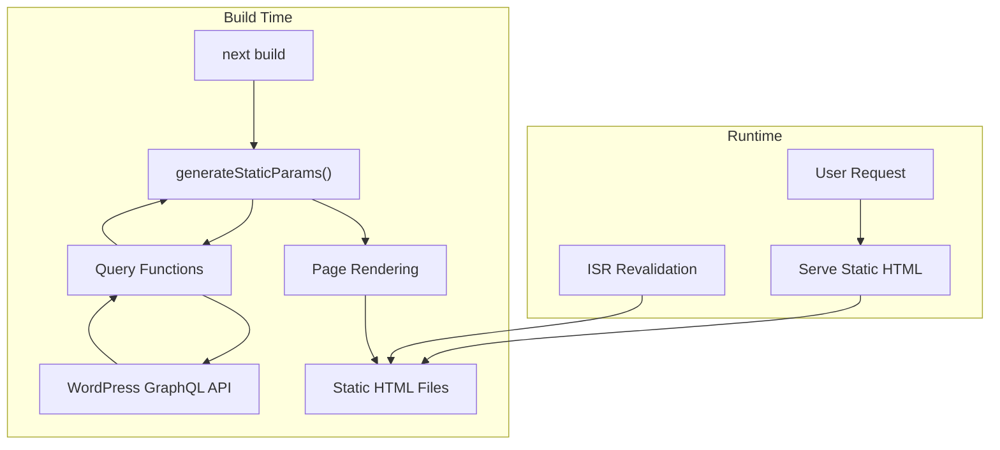
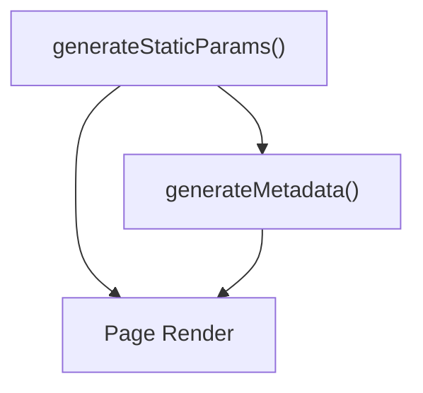
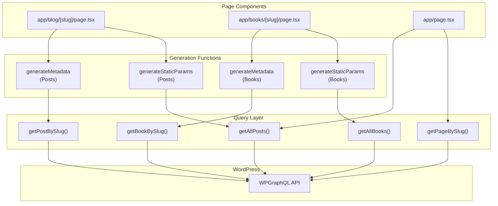
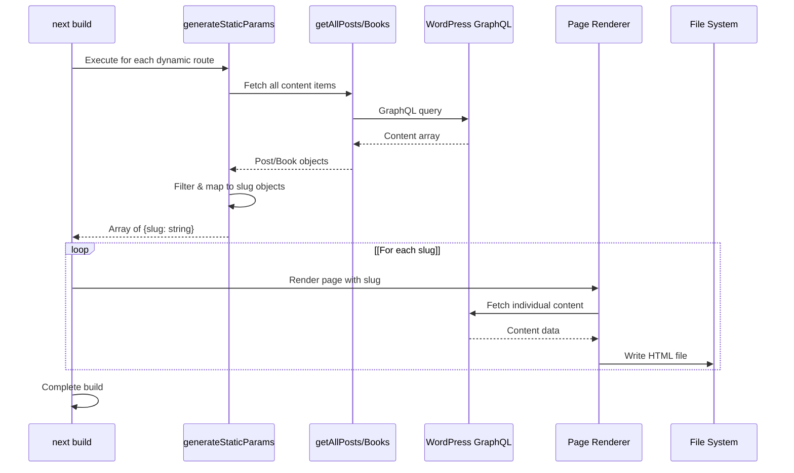
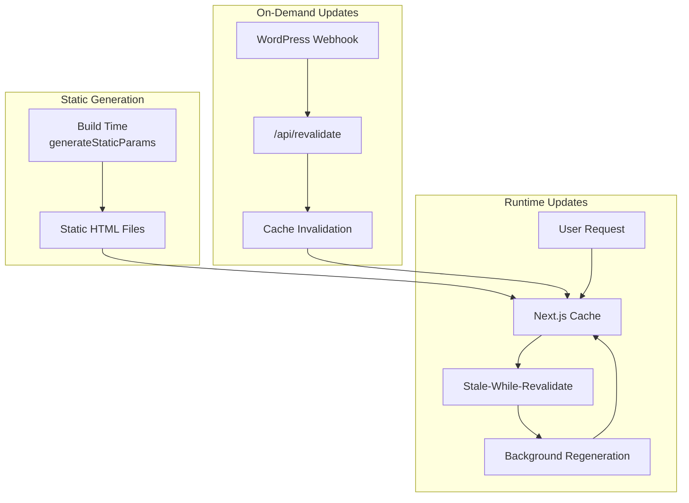

---
layout: default
title: Static Generation
parent: Build and Deployment
nav_order: 3
---

# Static Generation

> **Relevant source files**
> * [AGENTS.md](https://github.com/gregrickaby/nextjs-wordpress/blob/63f3f2f5/AGENTS.md)
> * [CONTRIBUTING.md](https://github.com/gregrickaby/nextjs-wordpress/blob/63f3f2f5/CONTRIBUTING.md)
> * [README.md](https://github.com/gregrickaby/nextjs-wordpress/blob/63f3f2f5/README.md)
> * app/[slug]/page.tsx
> * app/blog/[slug]/page.tsx
> * app/books/[slug]/page.tsx
> * [app/layout.tsx](https://github.com/gregrickaby/nextjs-wordpress/blob/63f3f2f5/app/layout.tsx)
> * [app/page.tsx](https://github.com/gregrickaby/nextjs-wordpress/blob/63f3f2f5/app/page.tsx)
> * [components/CommentForm.tsx](https://github.com/gregrickaby/nextjs-wordpress/blob/63f3f2f5/components/CommentForm.tsx)
> * [components/Footer.tsx](https://github.com/gregrickaby/nextjs-wordpress/blob/63f3f2f5/components/Footer.tsx)
> * [components/Header.tsx](https://github.com/gregrickaby/nextjs-wordpress/blob/63f3f2f5/components/Header.tsx)
> * [lib/mutations/createComment.ts](https://github.com/gregrickaby/nextjs-wordpress/blob/63f3f2f5/lib/mutations/createComment.ts)
> * [next.config.ts](https://github.com/gregrickaby/nextjs-wordpress/blob/63f3f2f5/next.config.ts)

## Purpose and Scope

This document explains how the Next.js WordPress application implements Static Site Generation (SSG) using the `generateStaticParams` function to pre-render dynamic routes at build time. It covers the implementation patterns for posts, books, and other content types, and how these static pages integrate with the caching and revalidation system.

For information about the build process and TypeScript compilation, see [Build Process](/gregrickaby/nextjs-wordpress/9.1-build-process). For caching strategies and on-demand revalidation, see [Caching and Revalidation](/gregrickaby/nextjs-wordpress/3.3-caching-and-revalidation). For page routing architecture, see [Pages and Routing](/gregrickaby/nextjs-wordpress/4.1-pages-and-routing).

---

## Overview

Static Generation in this application uses Next.js 16's `generateStaticParams` function to pre-render pages at build time. This approach generates HTML for all known content during the build process, resulting in instant page loads and optimal SEO performance.

The application statically generates:

| Content Type | Route Pattern | Function Location |
| --- | --- | --- |
| Blog Posts | `/blog/[slug]` | app/blog/[slug]/page.tsx:16-31 |
| Books | `/books/[slug]` | app/books/[slug]/page.tsx:13-28 |
| Homepage | `/` | [app/page.tsx L13-L64](https://github.com/gregrickaby/nextjs-wordpress/blob/63f3f2f5/app/page.tsx#L13-L64) <br>  (no params) |

**Sources:** [README.md L31](https://github.com/gregrickaby/nextjs-wordpress/blob/63f3f2f5/README.md#L31-L31)

 app/blog/[slug]/page.tsx:1-141, app/books/[slug]/page.tsx:1-84

---

## Static Generation Architecture

### System Flow Diagram



**Sources:** app/blog/[slug]/page.tsx:16-31, app/books/[slug]/page.tsx:13-28, [README.md L31](https://github.com/gregrickaby/nextjs-wordpress/blob/63f3f2f5/README.md#L31-L31)

---

## generateStaticParams Function

The `generateStaticParams` function is an async function that returns an array of objects representing all dynamic routes to be pre-rendered at build time.

### Function Signature Pattern

```javascript
export async function generateStaticParams() {
  // Fetch all content items
  const items = await getAllContent()
  
  // Return empty array if no data
  if (!items) {
    return []
  }
  
  // Map to slug objects, filtering out nulls
  return items
    .filter((item) => item.slug)
    .map((item) => ({
      slug: item.slug as string
    }))
}
```

**Sources:** app/blog/[slug]/page.tsx:16-31, app/books/[slug]/page.tsx:13-28

---

## Implementation by Content Type

### Blog Posts Static Generation

The blog post route at `/blog/[slug]` generates static pages for all published posts.

**Implementation:**

app/blog/[slug]/page.tsx:16-31

```javascript
export async function generateStaticParams() {
  // Get all blog posts.
  const posts = await getAllPosts()

  // No posts? Bail...
  if (!posts) {
    return []
  }

  // Return the slugs for each post.
  return posts
    .filter((post) => post.slug)
    .map((post) => ({
      slug: post.slug as string
    }))
}
```

**Key Characteristics:**

* Calls `getAllPosts()` to fetch all published posts from WordPress
* Returns empty array (`[]`) if no posts exist (graceful degradation)
* Filters out posts without slugs before mapping
* Type assertion (`as string`) ensures TypeScript compatibility

**Sources:** app/blog/[slug]/page.tsx:16-31, [lib/queries/getAllPosts.ts](https://github.com/gregrickaby/nextjs-wordpress/blob/63f3f2f5/lib/queries/getAllPosts.ts)

 (referenced)

### Books Static Generation

The books route at `/books/[slug]` follows an identical pattern for custom post types.

**Implementation:**

app/books/[slug]/page.tsx:13-28

```javascript
export async function generateStaticParams() {
  // Get a list of all books.
  const books = await getAllBooks()

  // No books? Bail...
  if (!books) {
    return []
  }

  // Return the slugs for each book.
  return books
    .filter((book) => book.slug)
    .map((book) => ({
      slug: book.slug as string
    }))
}
```

**Sources:** app/books/[slug]/page.tsx:13-28, [lib/queries/getAllBooks.ts](https://github.com/gregrickaby/nextjs-wordpress/blob/63f3f2f5/lib/queries/getAllBooks.ts)

 (referenced)

---

## Metadata Generation

Each statically generated page also implements `generateMetadata` to provide SEO metadata at build time. This function runs for each route returned by `generateStaticParams`.

### Metadata Generation Pattern



**Implementation for Posts:**

app/blog/[slug]/page.tsx:38-56

```javascript
export async function generateMetadata({
  params
}: DynamicPageProps): Promise<Metadata | null> {
  // Get the slug from the params.
  const {slug} = await params

  // Get the blog post.
  const post = await getPostBySlug(slug)

  // No post? Bail...
  if (!post) {
    return {}
  }

  return {
    title: post.seo?.title ?? '',
    description: post.seo?.metaDesc ?? ''
  }
}
```

**Key Characteristics:**

* Receives the same `params` as the page component
* Fetches individual post data using `getPostBySlug(slug)`
* Returns empty object (`{}`) if post not found
* Uses Yoast SEO fields from WordPress via `post.seo` property
* Utilizes nullish coalescing (`??`) for null safety

**Sources:** app/blog/[slug]/page.tsx:38-56, app/books/[slug]/page.tsx:35-53

---

## Code Entity Mapping

### Static Generation Code Flow



**Sources:** app/blog/[slug]/page.tsx:1-141, app/books/[slug]/page.tsx:1-84, [app/page.tsx L1-L65](https://github.com/gregrickaby/nextjs-wordpress/blob/63f3f2f5/app/page.tsx#L1-L65)

---

## Static vs Dynamic Routes

The application uses a hybrid approach with both static and dynamic route generation.

### Route Classification

| Route | Type | Has generateStaticParams | Behavior |
| --- | --- | --- | --- |
| `/` | Static | No | Always pre-rendered |
| `/blog/[slug]` | Static (SSG) | Yes | Pre-rendered at build |
| `/books/[slug]` | Static (SSG) | Yes | Pre-rendered at build |
| `/[slug]` | Dynamic (SSR) | No | Generated on-demand |
| `/blog/tag/[slug]` | Dynamic (SSR) | No | Generated on-demand |
| `/blog/category/[slug]` | Dynamic (SSR) | No | Generated on-demand |

**Static Routes:**

* Pre-rendered during `next build`
* Served as static HTML files
* Instant page loads
* Optimal for SEO

**Dynamic Routes:**

* Generated on first request
* Cached using ISR
* Allow for infinite possible routes (tags, categories)
* Updated via on-demand revalidation

**Sources:** app/blog/[slug]/page.tsx:1-141, app/books/[slug]/page.tsx:1-84, app/[slug]/page.tsx:1-119

---

## Build-Time Generation Process

### Build Execution Flow



**Build Steps:**

1. **Discovery Phase** * Next.js discovers all routes with `generateStaticParams` * Executes each function to get list of routes to pre-render
2. **Data Fetching Phase** * `generateStaticParams` calls query functions (`getAllPosts`, `getAllBooks`) * Query functions fetch data from WordPress GraphQL API * Returns array of content items with slugs
3. **Route Mapping Phase** * Filters out items without valid slugs * Maps to required format: `[{slug: string}, {slug: string}, ...]` * Handles empty responses gracefully with empty array
4. **Rendering Phase** * Next.js renders each page component with the provided slug * Page fetches individual content via `getPostBySlug` or `getBookBySlug` * `generateMetadata` runs for each route to generate SEO tags
5. **Output Phase** * Static HTML files written to `.next/server/pages/` directory * JSON data files written for client-side navigation * Metadata included in HTML head

**Sources:** app/blog/[slug]/page.tsx:16-31, [README.md L47-L56](https://github.com/gregrickaby/nextjs-wordpress/blob/63f3f2f5/README.md#L47-L56)

 [AGENTS.md L84-L96](https://github.com/gregrickaby/nextjs-wordpress/blob/63f3f2f5/AGENTS.md#L84-L96)

---

## Integration with ISR and Revalidation

Static generation works in conjunction with Incremental Static Regeneration (ISR) and on-demand revalidation to keep content fresh.

### Revalidation Strategy



**Revalidation Configuration:**

The application uses a global revalidation time set in configuration:

[lib/config.ts](https://github.com/gregrickaby/nextjs-wordpress/blob/63f3f2f5/lib/config.ts)

 (referenced in documentation)

```javascript
const config = {
  revalidation: 3600 // 1 hour
}
```

**Behavior:**

* Pages built at build time are served from cache
* After `revalidation` period (3600 seconds), Next.js serves stale content while regenerating in background
* WordPress content changes trigger on-demand revalidation via webhook
* Revalidation API invalidates specific paths and cache tags

**Sources:** [README.md L119-L128](https://github.com/gregrickaby/nextjs-wordpress/blob/63f3f2f5/README.md#L119-L128)

 [lib/config.ts](https://github.com/gregrickaby/nextjs-wordpress/blob/63f3f2f5/lib/config.ts)

 (referenced), [Caching and Revalidation](/gregrickaby/nextjs-wordpress/3.3-caching-and-revalidation) (related)

---

## Next.js 16 Async Params Pattern

All dynamic routes in the application follow Next.js 16's async params pattern, where `params` must be awaited before use.

### Implementation Pattern

app/blog/[slug]/page.tsx:63-73

```javascript
export default async function Post({params}: Readonly<DynamicPageProps>) {
  // Get the slug from the params.
  const {slug} = await params

  // Fetch a single post from WordPress.
  const post = await getPostBySlug(slug)

  // No post? Bail...
  if (!post) {
    notFound()
  }
  
  // ... render component
}
```

**Key Characteristics:**

* `params` is typed as `Promise<{slug: string}>` via `DynamicPageProps`
* Must await params before accessing properties
* Same pattern used in `generateMetadata` and page components
* Consistent across all dynamic routes

**Sources:** app/blog/[slug]/page.tsx:63-73, app/books/[slug]/page.tsx:60-70, [README.md L169-L182](https://github.com/gregrickaby/nextjs-wordpress/blob/63f3f2f5/README.md#L169-L182)

 [AGENTS.md L100-L112](https://github.com/gregrickaby/nextjs-wordpress/blob/63f3f2f5/AGENTS.md#L100-L112)

---

## Error Handling and Edge Cases

### Null Safety Patterns

The static generation functions implement defensive programming for edge cases:

**Pattern 1: Empty Content Array**

```
if (!posts) {
  return []  // Return empty array instead of throwing
}
```

**Pattern 2: Missing Slugs**

```javascript
return posts
  .filter((post) => post.slug)  // Filter out null/undefined slugs
  .map((post) => ({
    slug: post.slug as string   // Type assertion for filtered values
  }))
```

**Pattern 3: Missing Post Data**

```
if (!post) {
  return {}  // Return empty metadata object
}
```

### Build Failure Scenarios

| Scenario | Behavior | Recovery |
| --- | --- | --- |
| WordPress unavailable | Build fails | Fix WordPress connection, retry build |
| Empty posts/books | Build succeeds, returns `[]` | No static pages generated |
| Individual post fails | Build succeeds, skips that post | Other posts still generated |
| Invalid slugs | Filtered out via `.filter()` | Only valid slugs processed |

**Sources:** app/blog/[slug]/page.tsx:16-31, app/books/[slug]/page.tsx:13-28, [README.md L334-L339](https://github.com/gregrickaby/nextjs-wordpress/blob/63f3f2f5/README.md#L334-L339)

---

## Performance Considerations

### Build Time Optimization

Static generation impacts build time based on content volume:

**Calculation:**

```
Build Time ≈ (Number of Posts × Query Time) + (Number of Books × Query Time) + Render Time
```

**Optimization Strategies:**

1. **Filtered Generation** * Filter out items without slugs early: app/blog/[slug]/page.tsx:27 * Return empty array quickly if no data: app/blog/[slug]/page.tsx:21-23
2. **Efficient Queries** * Query functions use minimal field selection * GraphQL queries optimized for build-time execution * Caching applied via `fetchGraphQL` utility
3. **Parallel Processing** * Next.js builds pages in parallel * Multiple slugs processed concurrently * Limited by CPU cores and memory

**Trade-offs:**

| Approach | Build Time | Runtime Performance | Freshness |
| --- | --- | --- | --- |
| Full SSG | Longer (pre-render all) | Fastest (static HTML) | Stalest (until revalidation) |
| Dynamic SSR | Fastest (no pre-render) | Slower (generate on-demand) | Freshest (real-time) |
| Hybrid (this app) | Moderate | Fast (static + ISR) | Moderate (ISR + webhooks) |

**Sources:** [README.md L31](https://github.com/gregrickaby/nextjs-wordpress/blob/63f3f2f5/README.md#L31-L31)

 app/blog/[slug]/page.tsx:16-31

---

## Summary

### Key Implementation Points

1. **`generateStaticParams` Function** * Located in dynamic route page components: app/blog/[slug]/page.tsx:16-31, app/books/[slug]/page.tsx:13-28 * Returns array of objects with slug properties * Filters out invalid/missing slugs * Returns empty array for graceful degradation
2. **Metadata Generation** * Co-located `generateMetadata` function runs for each static route * Fetches individual content for SEO data * Uses Yoast SEO fields from WordPress * Returns empty object if content not found
3. **Next.js 16 Patterns** * Async params must be awaited: `const {slug} = await params` * Consistent typing via `DynamicPageProps` type * Null safety with nullish coalescing (`??`)
4. **Integration Points** * Works with ISR for runtime updates * Integrates with on-demand revalidation via webhook * Complements dynamic routes for infinite content (tags, categories)

**Sources:** app/blog/[slug]/page.tsx:1-141, app/books/[slug]/page.tsx:1-84, [README.md L31](https://github.com/gregrickaby/nextjs-wordpress/blob/63f3f2f5/README.md#L31-L31)

 [AGENTS.md L100-L112](https://github.com/gregrickaby/nextjs-wordpress/blob/63f3f2f5/AGENTS.md#L100-L112)