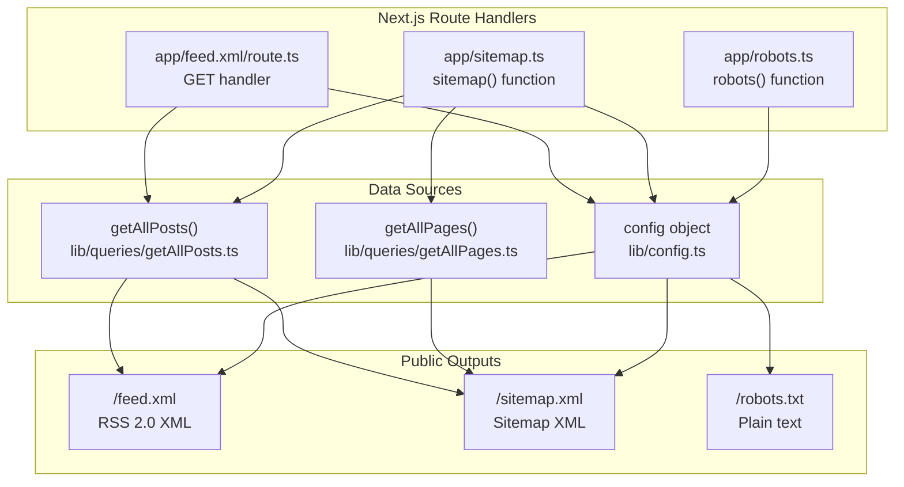
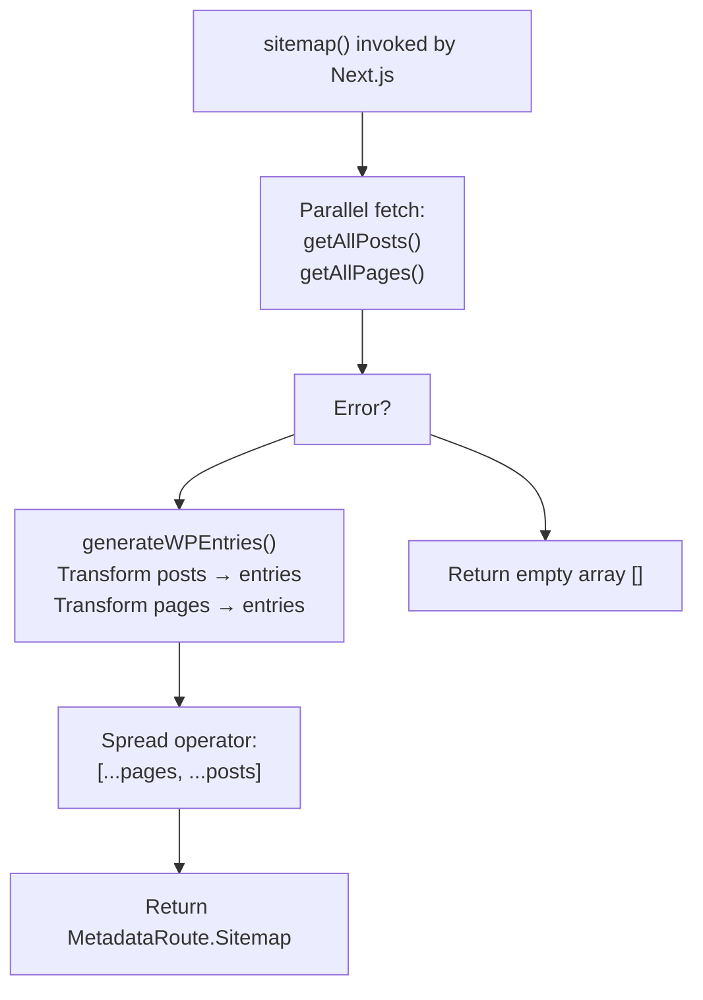
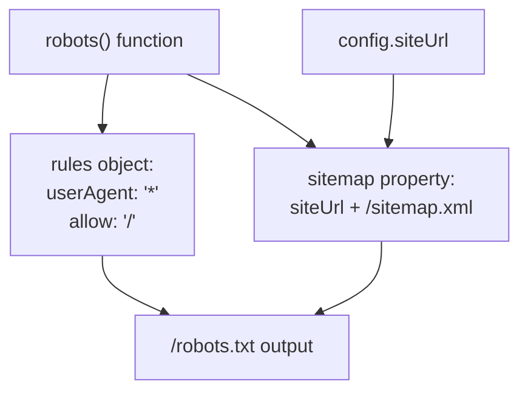
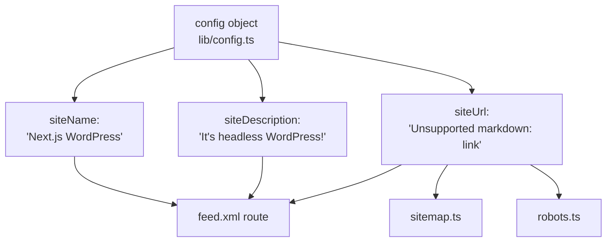
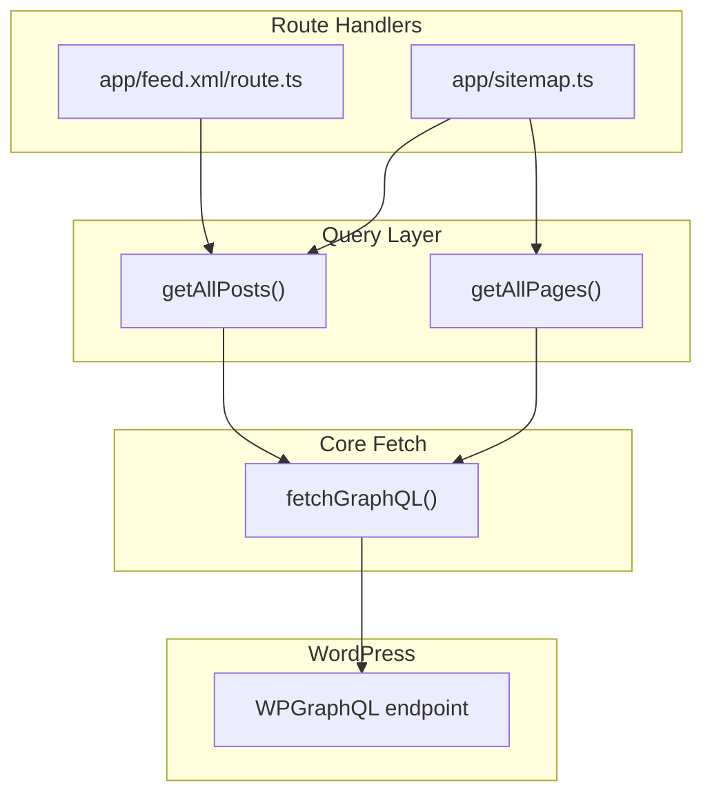

# SEO and Public Files

> **Relevant source files**
> * [AGENTS.md](https://github.com/gregrickaby/nextjs-wordpress/blob/63f3f2f5/AGENTS.md)
> * [CONTRIBUTING.md](https://github.com/gregrickaby/nextjs-wordpress/blob/63f3f2f5/CONTRIBUTING.md)
> * [README.md](https://github.com/gregrickaby/nextjs-wordpress/blob/63f3f2f5/README.md)
> * [app/feed.xml/route.ts](https://github.com/gregrickaby/nextjs-wordpress/blob/63f3f2f5/app/feed.xml/route.ts)
> * [app/robots.ts](https://github.com/gregrickaby/nextjs-wordpress/blob/63f3f2f5/app/robots.ts)
> * [app/sitemap.ts](https://github.com/gregrickaby/nextjs-wordpress/blob/63f3f2f5/app/sitemap.ts)
> * [codegen.ts](https://github.com/gregrickaby/nextjs-wordpress/blob/63f3f2f5/codegen.ts)

## Purpose and Scope

This document covers the generation of public SEO-related files in the Next.js application: RSS feed, sitemap, and robots.txt. These files are generated dynamically using Next.js route handlers and metadata conventions to provide search engines and RSS readers with structured information about site content.

For general page metadata and Open Graph tags, see [Layouts and Metadata](/gregrickaby/nextjs-wordpress/4.3-layouts-and-metadata). For static page generation strategies, see [Static Generation](/gregrickaby/nextjs-wordpress/9.3-static-generation).

---

## Overview

The application generates three types of public SEO files, each serving a distinct purpose for search engines and content aggregators:

| File | Path | Purpose | Format | Update Strategy |
| --- | --- | --- | --- | --- |
| RSS Feed | `/feed.xml` | Content syndication for RSS readers | XML 2.0 | Dynamic, fetches latest posts on each request |
| Sitemap | `/sitemap.xml` | URL discovery for search engine crawlers | XML sitemap protocol | Dynamic, includes all posts and pages |
| Robots.txt | `/robots.txt` | Crawler directives and sitemap location | Plain text | Static configuration |

**Diagram: Public SEO Files Architecture**



Sources: [app/feed.xml/route.ts L1-L58](https://github.com/gregrickaby/nextjs-wordpress/blob/63f3f2f5/app/feed.xml/route.ts#L1-L58)

 [app/sitemap.ts L1-L46](https://github.com/gregrickaby/nextjs-wordpress/blob/63f3f2f5/app/sitemap.ts#L1-L46)

 [app/robots.ts L1-L18](https://github.com/gregrickaby/nextjs-wordpress/blob/63f3f2f5/app/robots.ts#L1-L18)

---

## RSS Feed Generation

The RSS feed is generated via a Next.js route handler that produces an XML 2.0 feed containing all published posts.

### Route Handler Implementation

The feed is served from `/feed.xml` using a `GET` route handler located at [app/feed.xml/route.ts L1-L58](https://github.com/gregrickaby/nextjs-wordpress/blob/63f3f2f5/app/feed.xml/route.ts#L1-L58)

 The handler executes the following workflow:

**Diagram: RSS Feed Generation Flow**

```

```

Sources: [app/feed.xml/route.ts L10-L57](https://github.com/gregrickaby/nextjs-wordpress/blob/63f3f2f5/app/feed.xml/route.ts#L10-L57)

### RSS Feed Structure

The generated RSS feed includes the following elements:

| Element | Source | Example |
| --- | --- | --- |
| `<title>` | `config.siteName` | "Next.js WordPress" |
| `<description>` | `config.siteDescription` | "It's headless WordPress!" |
| `<link>` | `config.siteUrl` | "[https://nextjswp.com](https://nextjswp.com)" |
| `<pubDate>` | `new Date().toUTCString()` | Current timestamp |
| `<ttl>` | Hard-coded | "60" (minutes) |

For each post, an `<item>` element contains:

| Item Element | Source | Sanitization |
| --- | --- | --- |
| `<title>` | `post.title` | `escape()` function |
| `<description>` | `post.excerpt` | `escape()` function |
| `<link>` | `${config.siteUrl}/blog/${post.slug}` | URL construction |
| `<guid>` | `${config.siteUrl}/blog/${post.slug}` | URL construction |
| `<pubDate>` | `new Date(post.date).toUTCString()` | Date conversion |

The `escape()` function from `xml-escape` package ensures all content is properly XML-encoded, preventing injection vulnerabilities and XML syntax errors. See [app/feed.xml/route.ts L3](https://github.com/gregrickaby/nextjs-wordpress/blob/63f3f2f5/app/feed.xml/route.ts#L3-L3)

 and [app/feed.xml/route.ts L38-L39](https://github.com/gregrickaby/nextjs-wordpress/blob/63f3f2f5/app/feed.xml/route.ts#L38-L39)

### Null Safety

The feed handler uses nullish coalescing operators to handle missing data gracefully:

```
escape(post.title ?? '')
escape(post.excerpt ?? '')
new Date(post.date ?? '').toUTCString()
```

If no posts are returned from `getAllPosts()`, the handler returns a plain XML response stating "No posts found." See [app/feed.xml/route.ts L14-L21](https://github.com/gregrickaby/nextjs-wordpress/blob/63f3f2f5/app/feed.xml/route.ts#L14-L21)

Sources: [app/feed.xml/route.ts L10-L57](https://github.com/gregrickaby/nextjs-wordpress/blob/63f3f2f5/app/feed.xml/route.ts#L10-L57)

---

## Sitemap Generation

The sitemap is generated using Next.js metadata conventions via the `sitemap()` function exported from [app/sitemap.ts L1-L46](https://github.com/gregrickaby/nextjs-wordpress/blob/63f3f2f5/app/sitemap.ts#L1-L46)

 Unlike the RSS feed, the sitemap includes both posts and pages.

### Sitemap Function

The `sitemap()` function returns a `Promise<MetadataRoute.Sitemap>`, which Next.js automatically converts to `sitemap.xml`. The implementation follows this pattern:

**Diagram: Sitemap Generation Flow**



Sources: [app/sitemap.ts L26-L45](https://github.com/gregrickaby/nextjs-wordpress/blob/63f3f2f5/app/sitemap.ts#L26-L45)

### Entry Generation Helper

The `generateWPEntries()` helper function transforms WordPress posts or pages into sitemap entries. Located at [app/sitemap.ts L10-L19](https://github.com/gregrickaby/nextjs-wordpress/blob/63f3f2f5/app/sitemap.ts#L10-L19)

 it maps each item to the following structure:

| Property | Value | Description |
| --- | --- | --- |
| `url` | `${config.siteUrl}${urlPrefix}${item.slug}` | Full canonical URL |
| `changeFrequency` | `'monthly'` | Expected update frequency |
| `priority` | `0.5` | Relative priority (0.0 - 1.0) |

The `urlPrefix` parameter differentiates between content types:

* Posts: `/blog/` prefix (e.g., `https://nextjswp.com/blog/hello-world`)
* Pages: `/` prefix (e.g., `https://nextjswp.com/about`)

### Error Handling

The sitemap function wraps all operations in a try-catch block. On error, it:

1. Logs the error to console: `console.error('Error generating sitemap:', error)`
2. Returns an empty array: `return []`

This ensures the site remains functional even if WordPress is unreachable. See [app/sitemap.ts L41-L44](https://github.com/gregrickaby/nextjs-wordpress/blob/63f3f2f5/app/sitemap.ts#L41-L44)

### Sitemap Entry Ordering

The final sitemap concatenates entries in this order:

```javascript
const sitemap = [...pages, ...posts]
```

Pages appear before posts in the sitemap output. See [app/sitemap.ts L37](https://github.com/gregrickaby/nextjs-wordpress/blob/63f3f2f5/app/sitemap.ts#L37-L37)

Sources: [app/sitemap.ts L1-L46](https://github.com/gregrickaby/nextjs-wordpress/blob/63f3f2f5/app/sitemap.ts#L1-L46)

---

## Robots.txt Generation

The `robots.txt` file is generated using Next.js metadata conventions via the `robots()` function exported from [app/robots.ts L1-L18](https://github.com/gregrickaby/nextjs-wordpress/blob/63f3f2f5/app/robots.ts#L1-L18)

 This is a simple, static configuration that does not fetch data from WordPress.

### Robots Configuration

The `robots()` function returns a `MetadataRoute.Robots` object with the following structure:

| Property | Value | Purpose |
| --- | --- | --- |
| `rules.userAgent` | `'*'` | Apply to all crawlers |
| `rules.allow` | `'/'` | Allow crawling of all paths |
| `sitemap` | `${config.siteUrl}/sitemap.xml` | Sitemap location for crawlers |

**Diagram: Robots.txt Structure**



Sources: [app/robots.ts L9-L17](https://github.com/gregrickaby/nextjs-wordpress/blob/63f3f2f5/app/robots.ts#L9-L17)

### Generated Output

Next.js converts the returned object into this plain text format:

```yaml
User-agent: *
Allow: /

Sitemap: https://nextjswp.com/sitemap.xml
```

The sitemap URL is dynamically constructed from `config.siteUrl` to ensure environment consistency (development, staging, production). See [app/robots.ts L15](https://github.com/gregrickaby/nextjs-wordpress/blob/63f3f2f5/app/robots.ts#L15-L15)

Sources: [app/robots.ts L1-L18](https://github.com/gregrickaby/nextjs-wordpress/blob/63f3f2f5/app/robots.ts#L1-L18)

---

## Configuration Dependencies

All three public file generators depend on the centralized configuration object located at `lib/config.ts`:

| Config Property | Used By | Purpose |
| --- | --- | --- |
| `siteName` | RSS feed | `<title>` element |
| `siteDescription` | RSS feed | `<description>` element |
| `siteUrl` | RSS feed, sitemap, robots.txt | Base URL for all absolute URLs |

**Diagram: Configuration Flow**



Sources: [app/feed.xml/route.ts L1](https://github.com/gregrickaby/nextjs-wordpress/blob/63f3f2f5/app/feed.xml/route.ts#L1-L1)

 [app/sitemap.ts L1](https://github.com/gregrickaby/nextjs-wordpress/blob/63f3f2f5/app/sitemap.ts#L1-L1)

 [app/robots.ts L1](https://github.com/gregrickaby/nextjs-wordpress/blob/63f3f2f5/app/robots.ts#L1-L1)

---

## Data Fetching Pattern

Both the RSS feed and sitemap fetch WordPress content using the same query functions from the data access layer:

| Function | File | Returns | Used By |
| --- | --- | --- | --- |
| `getAllPosts()` | `lib/queries/getAllPosts.ts` | `Post[]` | RSS feed, sitemap |
| `getAllPages()` | `lib/queries/getAllPages.ts` | `Page[]` | Sitemap only |

These functions use `fetchGraphQL()` internally, which means they benefit from Next.js automatic request memoization and caching. For details on the caching strategy, see [Caching and Revalidation](/gregrickaby/nextjs-wordpress/3.3-caching-and-revalidation).

**Diagram: Data Flow for Public Files**



Sources: [app/feed.xml/route.ts L2](https://github.com/gregrickaby/nextjs-wordpress/blob/63f3f2f5/app/feed.xml/route.ts#L2-L2)

 [app/sitemap.ts L2-L3](https://github.com/gregrickaby/nextjs-wordpress/blob/63f3f2f5/app/sitemap.ts#L2-L3)

---

## Request Behavior

### RSS Feed

* **Route**: `/feed.xml`
* **Method**: `GET`
* **Caching**: No explicit caching; relies on Next.js automatic fetch memoization
* **Content-Type**: `application/xml; charset=utf-8`
* **Revalidation**: On-demand via WordPress webhooks (see [On-Demand Revalidation](/gregrickaby/nextjs-wordpress/6.3-on-demand-revalidation))

The feed is regenerated on every request, fetching the latest posts from WordPress. See [app/feed.xml/route.ts L10-L57](https://github.com/gregrickaby/nextjs-wordpress/blob/63f3f2f5/app/feed.xml/route.ts#L10-L57)

### Sitemap

* **Route**: `/sitemap.xml`
* **Method**: GET (handled automatically by Next.js)
* **Caching**: Leverages Next.js metadata route caching
* **Content-Type**: `application/xml` (set by Next.js)
* **Revalidation**: Subject to Next.js revalidation rules

The sitemap is treated as a metadata route by Next.js, which may apply different caching rules than standard route handlers. See [app/sitemap.ts L26-L45](https://github.com/gregrickaby/nextjs-wordpress/blob/63f3f2f5/app/sitemap.ts#L26-L45)

### Robots.txt

* **Route**: `/robots.txt`
* **Method**: GET (handled automatically by Next.js)
* **Caching**: Static configuration, highly cacheable
* **Content-Type**: `text/plain` (set by Next.js)
* **Revalidation**: Not required (static content)

The robots.txt file is essentially static and does not require revalidation. See [app/robots.ts L9-L17](https://github.com/gregrickaby/nextjs-wordpress/blob/63f3f2f5/app/robots.ts#L9-L17)

Sources: [app/feed.xml/route.ts L10-L57](https://github.com/gregrickaby/nextjs-wordpress/blob/63f3f2f5/app/feed.xml/route.ts#L10-L57)

 [app/sitemap.ts L26-L45](https://github.com/gregrickaby/nextjs-wordpress/blob/63f3f2f5/app/sitemap.ts#L26-L45)

 [app/robots.ts L9-L17](https://github.com/gregrickaby/nextjs-wordpress/blob/63f3f2f5/app/robots.ts#L9-L17)

---

## Best Practices

### XML Sanitization

Always use the `xml-escape` package to sanitize user-generated content before including it in XML output:

```javascript
import escape from 'xml-escape'

escape(post.title ?? '')  // Prevents XML injection
```

This is critical for preventing XML syntax errors and potential security vulnerabilities. See [app/feed.xml/route.ts L3-L39](https://github.com/gregrickaby/nextjs-wordpress/blob/63f3f2f5/app/feed.xml/route.ts#L3-L39)

### Null Safety

Use nullish coalescing operators for all nullable fields:

```
post.title ?? ''
post.excerpt ?? ''
post.date ?? ''
```

This prevents runtime errors when WordPress returns incomplete data. See [app/feed.xml/route.ts L38-L42](https://github.com/gregrickaby/nextjs-wordpress/blob/63f3f2f5/app/feed.xml/route.ts#L38-L42)

### Error Handling

Return graceful fallbacks instead of throwing errors:

* RSS feed: Return "No posts found" message
* Sitemap: Return empty array `[]`
* Robots.txt: No error handling needed (static)

This ensures the application remains functional even when WordPress is unreachable. See [app/feed.xml/route.ts L14-L21](https://github.com/gregrickaby/nextjs-wordpress/blob/63f3f2f5/app/feed.xml/route.ts#L14-L21)

 and [app/sitemap.ts L41-L44](https://github.com/gregrickaby/nextjs-wordpress/blob/63f3f2f5/app/sitemap.ts#L41-L44)

### Configuration Centralization

Always use the centralized `config` object for site-wide settings. Never hard-code URLs or site names in individual files. See [app/feed.xml/route.ts L1](https://github.com/gregrickaby/nextjs-wordpress/blob/63f3f2f5/app/feed.xml/route.ts#L1-L1)

 [app/sitemap.ts L1](https://github.com/gregrickaby/nextjs-wordpress/blob/63f3f2f5/app/sitemap.ts#L1-L1)

 [app/robots.ts L1](https://github.com/gregrickaby/nextjs-wordpress/blob/63f3f2f5/app/robots.ts#L1-L1)

Sources: [app/feed.xml/route.ts L1-L58](https://github.com/gregrickaby/nextjs-wordpress/blob/63f3f2f5/app/feed.xml/route.ts#L1-L58)

 [app/sitemap.ts L1-L46](https://github.com/gregrickaby/nextjs-wordpress/blob/63f3f2f5/app/sitemap.ts#L1-L46)

 [app/robots.ts L1-L18](https://github.com/gregrickaby/nextjs-wordpress/blob/63f3f2f5/app/robots.ts#L1-L18)