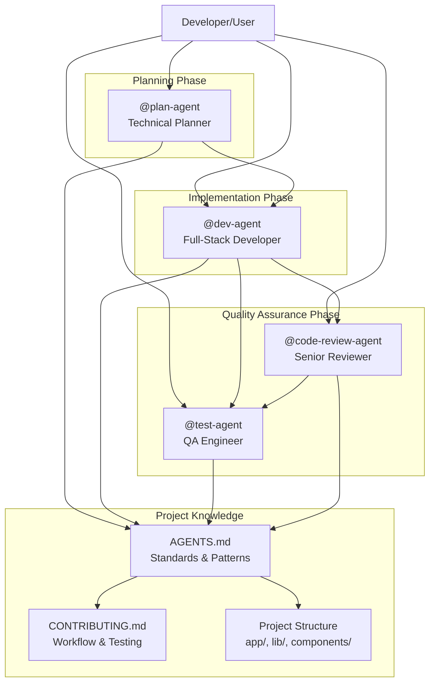
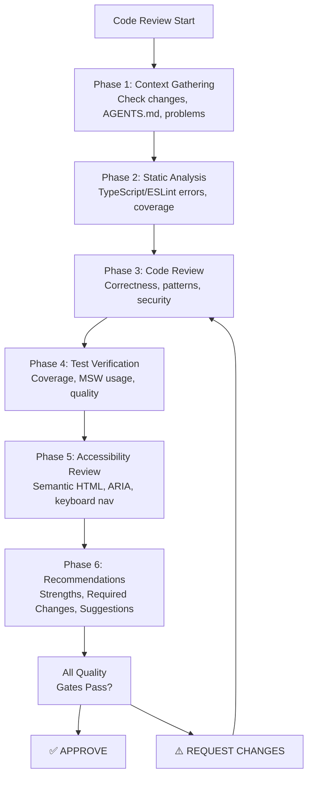
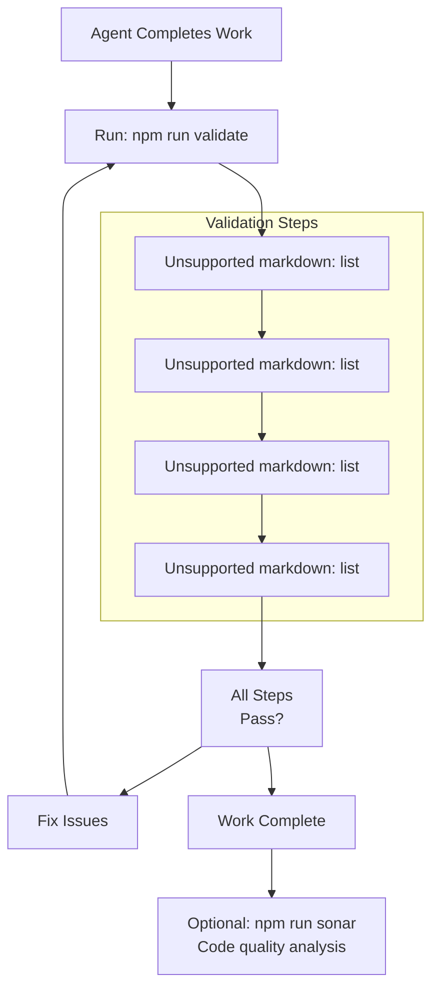
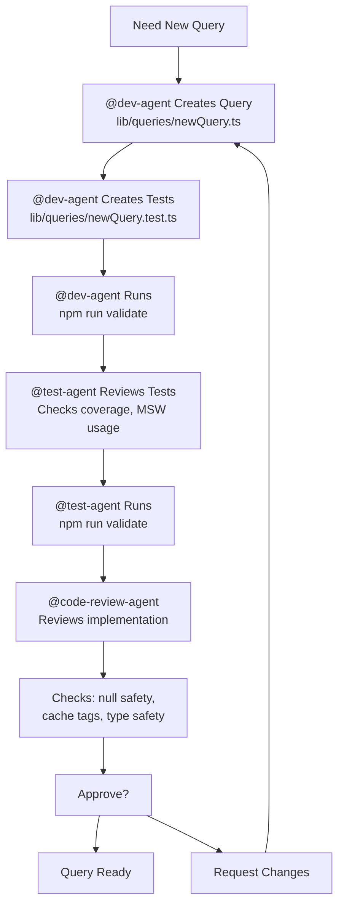
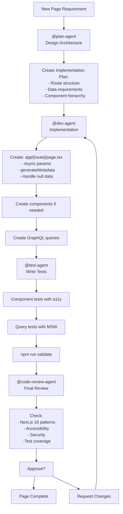
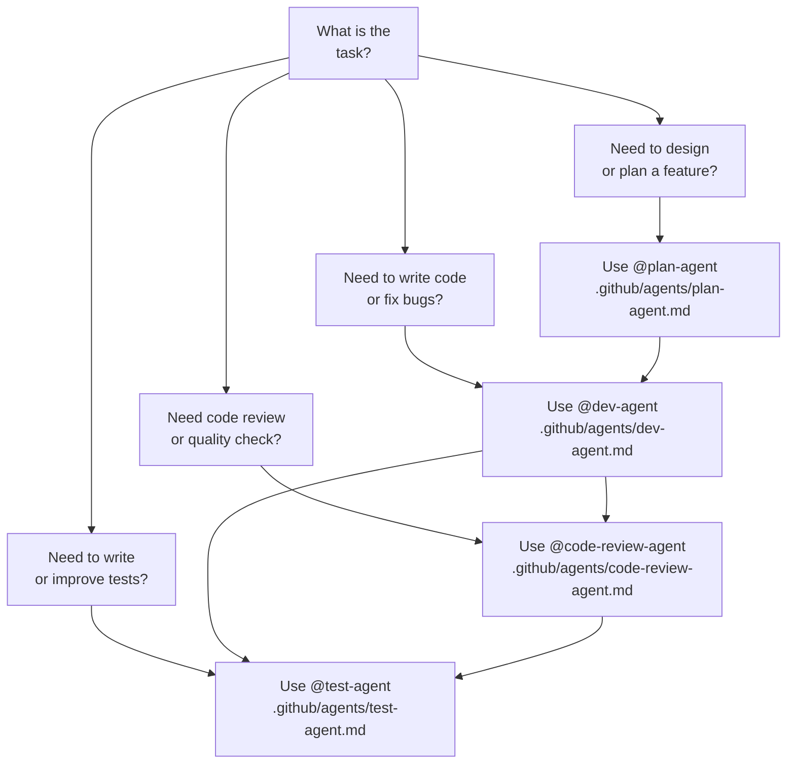

---
layout: default
title: Development Agents
nav_order: 12
---

# Development Agents

> **Relevant source files**
> * [.github/agents/code-review-agent.md](https://github.com/gregrickaby/nextjs-wordpress/blob/63f3f2f5/.github/agents/code-review-agent.md)
> * [.github/agents/dev-agent.md](https://github.com/gregrickaby/nextjs-wordpress/blob/63f3f2f5/.github/agents/dev-agent.md)
> * [.github/agents/plan-agent.md](https://github.com/gregrickaby/nextjs-wordpress/blob/63f3f2f5/.github/agents/plan-agent.md)
> * [.github/agents/test-agent.md](https://github.com/gregrickaby/nextjs-wordpress/blob/63f3f2f5/.github/agents/test-agent.md)
> * [AGENTS.md](https://github.com/gregrickaby/nextjs-wordpress/blob/63f3f2f5/AGENTS.md)
> * [CONTRIBUTING.md](https://github.com/gregrickaby/nextjs-wordpress/blob/63f3f2f5/CONTRIBUTING.md)
> * [README.md](https://github.com/gregrickaby/nextjs-wordpress/blob/63f3f2f5/README.md)

## Purpose and Scope

This document describes the AI agent system integrated into this codebase to assist with development, testing, planning, and code review tasks. Each agent is a specialized AI persona with defined expertise, responsibilities, and boundaries. The agent system enables consistent, high-quality code generation while enforcing architectural patterns, security standards, and accessibility compliance.

For information about the broader development environment setup (VS Code, extensions, tooling), see [VS Code Configuration](/gregrickaby/nextjs-wordpress/7.1-vs-code-configuration). For testing infrastructure details, see [Testing Infrastructure](/gregrickaby/nextjs-wordpress/8.1-testing-infrastructure).

---

## Agent Architecture

### Agent Types and Roles

The project includes four specialized agents, each located in `.github/agents/`:

| Agent | File | Primary Responsibility | Target Output |
| --- | --- | --- | --- |
| **plan-agent** | `.github/agents/plan-agent.md` | Feature planning and architecture design | Implementation roadmaps with technical specifications |
| **dev-agent** | `.github/agents/dev-agent.md` | Full-stack development | Next.js components, API routes, GraphQL queries |
| **test-agent** | `.github/agents/test-agent.md` | Quality assurance and testing | Unit tests, integration tests, accessibility tests |
| **code-review-agent** | `.github/agents/code-review-agent.md` | Code review and quality enforcement | Review feedback with blocking/non-blocking issues |

**Sources:** [AGENTS.md L14-L60](https://github.com/gregrickaby/nextjs-wordpress/blob/63f3f2f5/AGENTS.md#L14-L60)

 [.github/agents/plan-agent.md L1-L13](https://github.com/gregrickaby/nextjs-wordpress/blob/63f3f2f5/.github/agents/plan-agent.md#L1-L13)

 [.github/agents/dev-agent.md L1-L13](https://github.com/gregrickaby/nextjs-wordpress/blob/63f3f2f5/.github/agents/dev-agent.md#L1-L13)

 [.github/agents/test-agent.md L1-L13](https://github.com/gregrickaby/nextjs-wordpress/blob/63f3f2f5/.github/agents/test-agent.md#L1-L13)

 [.github/agents/code-review-agent.md L1-L13](https://github.com/gregrickaby/nextjs-wordpress/blob/63f3f2f5/.github/agents/code-review-agent.md#L1-L13)

---

### Agent Metadata Structure

Each agent file begins with YAML frontmatter defining metadata:

```

```

The `handoffs` section defines workflow transitions between agents. The `send: false` flag indicates the handoff is manual (user-initiated) rather than automatic.

**Sources:** [.github/agents/dev-agent.md L1-L13](https://github.com/gregrickaby/nextjs-wordpress/blob/63f3f2f5/.github/agents/dev-agent.md#L1-L13)

 [.github/agents/plan-agent.md L1-L9](https://github.com/gregrickaby/nextjs-wordpress/blob/63f3f2f5/.github/agents/plan-agent.md#L1-L9)

 [.github/agents/test-agent.md L1-L4](https://github.com/gregrickaby/nextjs-wordpress/blob/63f3f2f5/.github/agents/test-agent.md#L1-L4)

 [.github/agents/code-review-agent.md L1-L9](https://github.com/gregrickaby/nextjs-wordpress/blob/63f3f2f5/.github/agents/code-review-agent.md#L1-L9)

---

## Agent Ecosystem

### Agent Interaction Diagram



**Sources:** [AGENTS.md L14-L60](https://github.com/gregrickaby/nextjs-wordpress/blob/63f3f2f5/AGENTS.md#L14-L60)

 [.github/agents/dev-agent.md L4-L13](https://github.com/gregrickaby/nextjs-wordpress/blob/63f3f2f5/.github/agents/dev-agent.md#L4-L13)

 [.github/agents/plan-agent.md L4-L9](https://github.com/gregrickaby/nextjs-wordpress/blob/63f3f2f5/.github/agents/plan-agent.md#L4-L9)

 [.github/agents/code-review-agent.md L4-L9](https://github.com/gregrickaby/nextjs-wordpress/blob/63f3f2f5/.github/agents/code-review-agent.md#L4-L9)

---

### Handoff Mechanism

Handoffs enable workflow transitions between agents. Each agent defines potential handoffs to other agents:

**@plan-agent handoffs:**

* → `@dev-agent`: After creating implementation plan

**@dev-agent handoffs:**

* → `@test-agent`: After implementing code changes
* → `@code-review-agent`: After completing implementation

**@code-review-agent handoffs:**

* → `@test-agent`: If additional testing needed after review

The handoff includes a prompt that provides context to the receiving agent about what has been completed and what needs to be done next.

**Sources:** [.github/agents/dev-agent.md L4-L13](https://github.com/gregrickaby/nextjs-wordpress/blob/63f3f2f5/.github/agents/dev-agent.md#L4-L13)

 [.github/agents/plan-agent.md L4-L9](https://github.com/gregrickaby/nextjs-wordpress/blob/63f3f2f5/.github/agents/plan-agent.md#L4-L9)

 [.github/agents/code-review-agent.md L4-L9](https://github.com/gregrickaby/nextjs-wordpress/blob/63f3f2f5/.github/agents/code-review-agent.md#L4-L9)

---

## Agent Roles and Responsibilities

### @plan-agent: Technical Planner

**Location:** `.github/agents/plan-agent.md`

**Primary Functions:**

* Design new features with detailed technical specifications
* Plan architecture decisions aligned with Next.js 16 and WordPress patterns
* Create implementation roadmaps with clear phases and dependencies
* Identify technical risks and propose mitigation strategies
* Generate file checklists for implementation

**Key Capabilities:**

* Feature analysis (understand requirements, users, success criteria)
* Technical design (scope definition, architecture decisions, data flow)
* Implementation planning (phase breakdown, file checklist, risk assessment)
* Decision frameworks (when to use Server vs Client Components, when to create new GraphQL queries)

**Planning Process:**

1. Feature Analysis - Understand the request and research context
2. Technical Design - Define scope and architecture decisions
3. Implementation Plan - Break down into phases with file checklist
4. Risk Assessment - Identify technical risks and mitigation strategies

**Planning Templates:**

* New Content Type Feature (e.g., Portfolio post type)
* New Interactive Feature (e.g., Reading Progress Bar)
* API Enhancement (e.g., Search endpoint)

**Sources:** [.github/agents/plan-agent.md L10-L522](https://github.com/gregrickaby/nextjs-wordpress/blob/63f3f2f5/.github/agents/plan-agent.md#L10-L522)

 [AGENTS.md L17-L26](https://github.com/gregrickaby/nextjs-wordpress/blob/63f3f2f5/AGENTS.md#L17-L26)

---

### @dev-agent: Full-Stack Developer

**Location:** `.github/agents/dev-agent.md`

**Primary Functions:**

* Build Next.js 16 pages and components
* Write GraphQL query and mutation functions
* Implement API routes with proper error handling
* Ensure type safety with TypeScript
* Write co-located tests alongside code changes

**Technology Expertise:**

* Next.js 16.0.4 (App Router, async params, Server Components)
* React 19.2.0 (Server Components, Client Components)
* TypeScript 5.9.3 (strict mode, no `any` types)
* Tailwind CSS 4.1.17
* WordPress via WPGraphQL

**Code Standards:**

| Pattern | Correct Approach | Incorrect Approach |
| --- | --- | --- |
| Async params | `params: Promise<{slug: string}>`, then `const {slug} = await params` | `params: {slug: string}` (synchronous) |
| Null safety | `post.featuredImage?.node && <Image ... />` | Direct access without checking |
| Alt text | `alt={image.altText \|\| post.title}` | `alt={image.altText}` (may crash) |
| Error handling | `return []` on GraphQL errors | Throwing errors or returning null |
| Test imports | `import {...} from '@/test-utils'` | Direct imports from `@testing-library` |
| API mocking | MSW v2 handlers | `global.fetch = vi.fn()` |

**Validation Protocol:**
Before completing any work, must run `npm run validate` which executes:

1. Format (Prettier + ESLint auto-fixes)
2. Lint (ESLint checks)
3. TypeCheck (TypeScript compilation)
4. Test (All unit tests)

**Sources:** [.github/agents/dev-agent.md L14-L269](https://github.com/gregrickaby/nextjs-wordpress/blob/63f3f2f5/.github/agents/dev-agent.md#L14-L269)

 [AGENTS.md L28-L37](https://github.com/gregrickaby/nextjs-wordpress/blob/63f3f2f5/AGENTS.md#L28-L37)

---

### @test-agent: QA Engineer

**Location:** `.github/agents/test-agent.md`

**Primary Functions:**

* Write unit and integration tests following TDD practices
* Test WordPress GraphQL queries with null safety validation
* Test React components with accessibility checks
* Ensure 80%+ test coverage on critical paths
* Use MSW v2 for API mocking (never `global.fetch`)

**Testing Infrastructure:**

* **Vitest** - Fast unit test framework with SWC plugin
* **React Testing Library** - Component testing with user-centric queries
* **MSW v2** - Mock Service Worker for HTTP interception
* **jest-axe** - Accessibility testing for WCAG 2.1 AA compliance

**Test File Organization:**
Tests are co-located with source files:

```
components/
  Header.tsx
  Header.test.tsx
lib/queries/
  getAllPosts.ts
  getAllPosts.test.ts
```

**Critical Testing Rules:**

1. **Always import from `@/test-utils`** - Never directly from libraries: ``` ```
2. **Use MSW v2 for API mocking** - Never mock `global.fetch`: ``` ```
3. **Use pre-configured `user` instance** - No need to call `userEvent.setup()`: ``` ```

**Test Patterns:**

| Test Type | Key Requirements | Test Example |
| --- | --- | --- |
| Component | Render correctly, user interactions, accessibility | Search form with input validation |
| GraphQL Query | Success case, empty response, API errors | `getAllPosts()` with various responses |
| Async Server Component | Must await component, mock GraphQL API | `Header` component with menu data |

**Coverage Goals:**

* Target: 80%+ overall coverage
* Queries/Mutations: 100% coverage
* Focus on meaningful tests, not just numbers

**Sources:** [.github/agents/test-agent.md L6-L301](https://github.com/gregrickaby/nextjs-wordpress/blob/63f3f2f5/.github/agents/test-agent.md#L6-L301)

 [AGENTS.md L39-L48](https://github.com/gregrickaby/nextjs-wordpress/blob/63f3f2f5/AGENTS.md#L39-L48)

 [CONTRIBUTING.md L95-L265](https://github.com/gregrickaby/nextjs-wordpress/blob/63f3f2f5/CONTRIBUTING.md#L95-L265)

---

### @code-review-agent: Senior Code Reviewer

**Location:** `.github/agents/code-review-agent.md`

**Primary Functions:**

* Enforce quality, security, and accessibility standards
* Verify test coverage meets 80%+ target
* Check WCAG 2.1 Level AA accessibility compliance
* Block approval if critical issues exist
* Provide constructive, educational feedback

**Review Checklist Categories:**

1. **Architecture & Design** - Next.js 16 patterns, component separation, clean separation of concerns
2. **WordPress Integration** - GraphQL caching, null safety, proper type casting
3. **Code Quality** - No TypeScript errors, no ESLint violations, no `any` types
4. **Security** - No exposed secrets, input validation, GraphQL injection prevention, rate limiting
5. **Testing** - 80%+ coverage, MSW v2 usage, `@/test-utils` imports
6. **Next.js 16 Compliance** - Async params, proper cache tags, Server/Client Component usage
7. **Accessibility (WCAG 2.1 AA)** - Semantic HTML, ARIA labels, keyboard navigation, color contrast
8. **Performance** - Image optimization, caching strategy, bundle size

**Review Process Phases:**



**Common Anti-Patterns Detected:**

| Anti-Pattern | Detection | Blocking? |
| --- | --- | --- |
| `console.log()` usage | ESLint violation | ✅ Yes |
| `global.fetch` mocking | Test file inspection | ✅ Yes |
| Direct library imports | Import statement check | ✅ Yes |
| Synchronous params | Next.js 16 violation | ✅ Yes |
| Missing null safety | TypeScript patterns | ✅ Yes |
| GraphQL injection | String interpolation in queries | ✅ Yes |
| Missing alt text | Accessibility violation | ✅ Yes |
| Poor keyboard nav | WCAG 2.1 AA violation | ✅ Yes |

**Quality Gates:**
Before approval, must verify:

* `npm run validate` passes (format, lint, typecheck, test)
* Test coverage ≥ 80% overall (100% for queries/mutations)
* No TypeScript errors
* No ESLint violations
* All tests pass
* No accessibility violations
* No security vulnerabilities

**Sources:** [.github/agents/code-review-agent.md L10-L676](https://github.com/gregrickaby/nextjs-wordpress/blob/63f3f2f5/.github/agents/code-review-agent.md#L10-L676)

 [AGENTS.md L50-L59](https://github.com/gregrickaby/nextjs-wordpress/blob/63f3f2f5/AGENTS.md#L50-L59)

---

## Shared Project Knowledge

### Essential Project Information

All agents share common knowledge about the project structure and standards. This is documented in `AGENTS.md` and includes:

**Tech Stack:**

* Next.js 16.0.4 (App Router, React Compiler, Turbopack)
* React 19.2.0 (Server Components)
* TypeScript 5.9.3 (strict mode)
* Tailwind CSS 4.1.17
* WordPress (headless via WPGraphQL)

**File Structure:**

```
app/              - Next.js App Router pages and layouts
  [slug]/         - Dynamic page routes
  blog/[slug]/    - Blog post pages
  api/revalidate/ - On-demand revalidation API
  
components/       - React components (Header, Footer, SearchForm, CommentForm)

lib/
  queries/        - GraphQL query functions
  mutations/      - GraphQL mutation functions
  functions.ts    - Main fetchGraphQL with caching
  types.d.ts      - Non-WordPress TypeScript definitions
  generated.ts    - Auto-generated WordPress GraphQL types
  config.ts       - Site configuration
  
test-utils/       - Pre-configured testing utilities
  index.ts        - Exports render, user, server, http
  
.github/agents/   - AI agent definitions
```

**Key Architectural Patterns:**

| Pattern | Implementation | Rationale |
| --- | --- | --- |
| Server Components | Default for all pages | Data fetching, better performance |
| Client Components | Only when needed (`'use client'`) | Interactivity, browser APIs |
| Async params | Next.js 16 requirement | `params: Promise<{slug: string}>` |
| Null safety | Optional chaining | WordPress data unpredictable |
| Co-located tests | `.test.tsx` next to source | Easy to find and maintain |
| MSW v2 mocking | HTTP interception | Realistic API mocking |
| Cache tags | Granular revalidation | On-demand content updates |

**Sources:** [AGENTS.md L63-L169](https://github.com/gregrickaby/nextjs-wordpress/blob/63f3f2f5/AGENTS.md#L63-L169)

 [.github/agents/dev-agent.md L34-L54](https://github.com/gregrickaby/nextjs-wordpress/blob/63f3f2f5/.github/agents/dev-agent.md#L34-L54)

 [.github/agents/plan-agent.md L21-L78](https://github.com/gregrickaby/nextjs-wordpress/blob/63f3f2f5/.github/agents/plan-agent.md#L21-L78)

---

### Commands Available to Agents

All agents have access to these npm scripts:

**Development:**

```

```

**Code Quality:**

```

```

**Testing:**

```

```

**Code Generation:**

```

```

**Quality Analysis:**

```

```

**Sources:** [AGENTS.md L83-L96](https://github.com/gregrickaby/nextjs-wordpress/blob/63f3f2f5/AGENTS.md#L83-L96)

 [.github/agents/dev-agent.md L59-L91](https://github.com/gregrickaby/nextjs-wordpress/blob/63f3f2f5/.github/agents/dev-agent.md#L59-L91)

 [.github/agents/test-agent.md L40-L58](https://github.com/gregrickaby/nextjs-wordpress/blob/63f3f2f5/.github/agents/test-agent.md#L40-L58)

---

## Validation Protocol

### Mandatory Validation Steps

**All agents MUST complete validation before declaring work complete.** This is enforced across all agent definitions.

**Primary Validation Command:**

```

```

This single command runs all checks in sequence:

1. **Format** - Applies Prettier and ESLint auto-fixes
2. **Lint** - Checks for linting errors
3. **TypeCheck** - Verifies TypeScript compilation
4. **Test** - Runs all unit tests

All steps must pass. If any step fails, issues must be fixed and validation re-run.

**SonarQube Analysis (Feature Completion):**

After completing feature development and passing validation:

```

```

This runs comprehensive analysis:

* Code smells and maintainability issues
* Security vulnerabilities
* Code coverage validation
* Technical debt identification

Results viewable at: `http://localhost:9000/dashboard?id=Next.js-WordPress`

**Sources:** [AGENTS.md L172-L221](https://github.com/gregrickaby/nextjs-wordpress/blob/63f3f2f5/AGENTS.md#L172-L221)

 [.github/agents/dev-agent.md L252-L269](https://github.com/gregrickaby/nextjs-wordpress/blob/63f3f2f5/.github/agents/dev-agent.md#L252-L269)

 [.github/agents/test-agent.md L40-L58](https://github.com/gregrickaby/nextjs-wordpress/blob/63f3f2f5/.github/agents/test-agent.md#L40-L58)

---

### Validation Workflow



**Never skip validation steps.** These checks prevent bugs, maintain code quality, and ensure the project builds successfully.

**Sources:** [AGENTS.md L172-L221](https://github.com/gregrickaby/nextjs-wordpress/blob/63f3f2f5/AGENTS.md#L172-L221)

 [.github/agents/dev-agent.md L252-L269](https://github.com/gregrickaby/nextjs-wordpress/blob/63f3f2f5/.github/agents/dev-agent.md#L252-L269)

---

## Common Development Workflows

### Workflow 1: Adding a GraphQL Query

**Agent Flow:** `@dev-agent` → `@test-agent` → `@code-review-agent`



**Steps:**

1. `@dev-agent` creates query function in `lib/queries/`
2. Imports `fetchGraphQL` from `lib/functions.ts`
3. Adds null safety: `if (!response?.data) return []`
4. Exports with proper TypeScript return type
5. Writes unit tests in co-located `.test.ts` file
6. Runs `npm run validate` to ensure everything passes
7. Hands off to `@test-agent` for test review
8. `@test-agent` verifies MSW v2 usage, coverage, test quality
9. Hands off to `@code-review-agent` for final approval
10. `@code-review-agent` checks cache tags, null safety, security

**Sources:** [AGENTS.md L224-L235](https://github.com/gregrickaby/nextjs-wordpress/blob/63f3f2f5/AGENTS.md#L224-L235)

 [.github/agents/dev-agent.md L1-L269](https://github.com/gregrickaby/nextjs-wordpress/blob/63f3f2f5/.github/agents/dev-agent.md#L1-L269)

 [.github/agents/test-agent.md L1-L301](https://github.com/gregrickaby/nextjs-wordpress/blob/63f3f2f5/.github/agents/test-agent.md#L1-L301)

---

### Workflow 2: Creating a New Page

**Agent Flow:** `@plan-agent` → `@dev-agent` → `@test-agent` → `@code-review-agent`



**Steps:**

1. `@plan-agent` analyzes requirements and creates technical design
2. Plans data flow, component structure, file checklist
3. Hands off to `@dev-agent` with implementation plan
4. `@dev-agent` creates page with async params: `{params: Promise<{slug: string}>}`
5. Awaits params: `const {slug} = await params`
6. Adds `generateMetadata` for SEO
7. Handles null data with `notFound()`
8. Creates necessary GraphQL queries
9. Writes co-located tests
10. Runs `npm run validate`
11. Hands off to `@test-agent` for test verification
12. `@test-agent` ensures proper coverage and test quality
13. Hands off to `@code-review-agent`
14. `@code-review-agent` verifies accessibility, security, patterns

**Sources:** [AGENTS.md L237-L246](https://github.com/gregrickaby/nextjs-wordpress/blob/63f3f2f5/AGENTS.md#L237-L246)

 [.github/agents/plan-agent.md L99-L276](https://github.com/gregrickaby/nextjs-wordpress/blob/63f3f2f5/.github/agents/plan-agent.md#L99-L276)

 [.github/agents/dev-agent.md L104-L145](https://github.com/gregrickaby/nextjs-wordpress/blob/63f3f2f5/.github/agents/dev-agent.md#L104-L145)

---

### Workflow 3: Adding a Client Component

**Agent Flow:** `@dev-agent` → `@test-agent` → `@code-review-agent`

**When to Use Client Components:**

* User interactions (forms, search, comments)
* Browser APIs needed (window, localStorage)
* Real-time updates
* Examples: `SearchForm`, `CommentForm`, interactive widgets

**Steps:**

1. `@dev-agent` adds `'use client'` directive at top of file
2. Implements component with proper TypeScript types
3. Ensures keyboard accessibility and ARIA labels
4. Writes co-located test file `.test.tsx`
5. Tests user interactions with pre-configured `user` from `@/test-utils`
6. Verifies accessibility with `jest-axe`
7. Runs `npm run validate`
8. Hands off to `@test-agent`
9. `@test-agent` verifies interaction tests and accessibility
10. Hands off to `@code-review-agent`
11. `@code-review-agent` checks WCAG 2.1 AA compliance, keyboard nav

**Sources:** [AGENTS.md L248-L254](https://github.com/gregrickaby/nextjs-wordpress/blob/63f3f2f5/AGENTS.md#L248-L254)

 [.github/agents/dev-agent.md L54-L56](https://github.com/gregrickaby/nextjs-wordpress/blob/63f3f2f5/.github/agents/dev-agent.md#L54-L56)

 [.github/agents/plan-agent.md L414-L453](https://github.com/gregrickaby/nextjs-wordpress/blob/63f3f2f5/.github/agents/plan-agent.md#L414-L453)

---

## Agent Decision Framework

### Selecting the Right Agent



**Decision Criteria:**

| Scenario | Appropriate Agent | Rationale |
| --- | --- | --- |
| "Design a new portfolio section" | `@plan-agent` | Requires architecture planning and implementation roadmap |
| "Add a reading progress bar" | `@dev-agent` | Implementation task with clear requirements |
| "Fix TypeScript error in Header" | `@dev-agent` | Code fix within existing patterns |
| "Tests failing for getAllPosts" | `@test-agent` | Test debugging and improvement |
| "Write tests for new SearchForm" | `@test-agent` | Test creation for new component |
| "Review pull request" | `@code-review-agent` | Quality assurance and standards enforcement |
| "Check accessibility compliance" | `@code-review-agent` | WCAG 2.1 AA verification |

**Sources:** [AGENTS.md L14-L60](https://github.com/gregrickaby/nextjs-wordpress/blob/63f3f2f5/AGENTS.md#L14-L60)

 [.github/agents/plan-agent.md L414-L453](https://github.com/gregrickaby/nextjs-wordpress/blob/63f3f2f5/.github/agents/plan-agent.md#L414-L453)

---

## Testing Strategy for Agents

### Test-Driven Development Philosophy

**Core Principle:** Tests must be written alongside code changes, not as an afterthought.

**Coverage Expectations:**

* Target: 80%+ test coverage (not 100%)
* Queries/Mutations: 100% coverage
* Focus on meaningful tests that validate real behavior
* Some unreachable edge cases are acceptable
* Tests should add value, not just increase coverage numbers

**Testing Layers:**

* **Unit Tests** - All components and functions have co-located test files
* **Integration Tests** - Use MSW v2 to mock WordPress GraphQL API calls
* **Accessibility** - Use `jest-axe` to validate WCAG compliance
* **Quality Gate** - `npm run validate` must pass before merge

**Sources:** [AGENTS.md L257-L276](https://github.com/gregrickaby/nextjs-wordpress/blob/63f3f2f5/AGENTS.md#L257-L276)

 [CONTRIBUTING.md L95-L265](https://github.com/gregrickaby/nextjs-wordpress/blob/63f3f2f5/CONTRIBUTING.md#L95-L265)

---

### Test Utilities (@/test-utils)

**Critical Rule:** Always import test utilities from `@/test-utils`, never directly from libraries.

**Pre-configured Exports:**

| Export | Description | Why Pre-configured? |
| --- | --- | --- |
| `user` | `userEvent.setup()` instance | Eliminates duplicate setup calls across tests |
| `render` | Custom render function | Wraps providers if needed |
| `renderHook` | Hook testing utilities | Consistent hook testing setup |
| `server` | MSW server instance | HTTP request mocking |
| `http` | MSW HTTP handlers | Request handler creation |
| `HttpResponse` | MSW response constructor | Response mocking |
| All RTL exports | `screen`, `waitFor`, etc. | Standard React Testing Library utilities |

**Example Usage:**

```

```

**Sources:** [AGENTS.md L291-L321](https://github.com/gregrickaby/nextjs-wordpress/blob/63f3f2f5/AGENTS.md#L291-L321)

 [CONTRIBUTING.md L206-L228](https://github.com/gregrickaby/nextjs-wordpress/blob/63f3f2f5/CONTRIBUTING.md#L206-L228)

 [.github/agents/test-agent.md L76-L95](https://github.com/gregrickaby/nextjs-wordpress/blob/63f3f2f5/.github/agents/test-agent.md#L76-L95)

---

### MSW v2 HTTP Mocking

**Critical Rule:** NEVER mock `global.fetch` - Always use MSW v2 for HTTP interception.

**Global Setup** (handled in `vitest.setup.ts`):

* `beforeAll`: `server.listen()` - starts MSW server
* `afterEach`: `server.resetHandlers()` - resets to default handlers
* `afterAll`: `server.close()` - shuts down server

**Test Pattern:**

```

```

**When to Override Handlers:**

* Edge cases: 404, 500, network errors
* Empty/null responses
* Malformed data
* GraphQL errors

**Sources:** [AGENTS.md L323-L362](https://github.com/gregrickaby/nextjs-wordpress/blob/63f3f2f5/AGENTS.md#L323-L362)

 [CONTRIBUTING.md L229-L247](https://github.com/gregrickaby/nextjs-wordpress/blob/63f3f2f5/CONTRIBUTING.md#L229-L247)

 [.github/agents/test-agent.md L96-L119](https://github.com/gregrickaby/nextjs-wordpress/blob/63f3f2f5/.github/agents/test-agent.md#L96-L119)

---

## Agent Boundaries and Constraints

### What Agents Always Do

**All Agents:**

* ✅ Reference `AGENTS.md` for project standards before starting work
* ✅ Run `npm run validate` before declaring work complete
* ✅ Follow Next.js 16 async params pattern
* ✅ Add null safety for WordPress data (featuredImage is nullable)
* ✅ Use optional chaining for nested properties
* ✅ Import test utilities from `@/test-utils`
* ✅ Use MSW v2 for HTTP mocking (never `global.fetch`)
* ✅ Write tests alongside code changes (co-located test files)

**@dev-agent Specific:**

* ✅ Use Server Components by default
* ✅ Add `'use client'` only when interactivity needed
* ✅ Return empty arrays `[]` from query functions on error
* ✅ Add proper TypeScript types (no `any`)

**@test-agent Specific:**

* ✅ Co-locate test files with source files
* ✅ Use `it.each()` to minimize test duplication
* ✅ Test edge cases and error states
* ✅ Check accessibility with `jest-axe`

**@code-review-agent Specific:**

* ✅ Run validation commands to verify quality gates
* ✅ Block approval if validation fails
* ✅ Check WCAG 2.1 AA accessibility compliance
* ✅ Verify test coverage meets 80%+ target

**Sources:** [.github/agents/dev-agent.md L211-L227](https://github.com/gregrickaby/nextjs-wordpress/blob/63f3f2f5/.github/agents/dev-agent.md#L211-L227)

 [.github/agents/test-agent.md L277-L289](https://github.com/gregrickaby/nextjs-wordpress/blob/63f3f2f5/.github/agents/test-agent.md#L277-L289)

 [.github/agents/code-review-agent.md L61-L98](https://github.com/gregrickaby/nextjs-wordpress/blob/63f3f2f5/.github/agents/code-review-agent.md#L61-L98)

---

### What Agents Ask Permission For

**@dev-agent:**

* ⚠️ Adding new dependencies to package.json
* ⚠️ Modifying `next.config.ts` or other config files
* ⚠️ Creating new API routes in `app/api/`
* ⚠️ Changing GraphQL query structures
* ⚠️ Modifying the caching strategy
* ⚠️ Database schema changes in WordPress

**@plan-agent:**

* ⚠️ Breaking changes to existing features
* ⚠️ New external dependencies
* ⚠️ WordPress plugin requirements
* ⚠️ Database migrations
* ⚠️ Significant performance impact
* ⚠️ Security considerations

**@test-agent:**

* ⚠️ Adding new testing dependencies
* ⚠️ Changing test infrastructure
* ⚠️ Major refactoring of test patterns

**Sources:** [.github/agents/dev-agent.md L228-L236](https://github.com/gregrickaby/nextjs-wordpress/blob/63f3f2f5/.github/agents/dev-agent.md#L228-L236)

 [.github/agents/plan-agent.md L483-L491](https://github.com/gregrickaby/nextjs-wordpress/blob/63f3f2f5/.github/agents/plan-agent.md#L483-L491)

 [.github/agents/test-agent.md L288-L294](https://github.com/gregrickaby/nextjs-wordpress/blob/63f3f2f5/.github/agents/test-agent.md#L288-L294)

---

### What Agents Never Do

**All Agents:**

* 🚫 Skip validation steps (`npm run validate` is mandatory)
* 🚫 Mock `global.fetch` (always use MSW v2)
* 🚫 Import test utilities directly from libraries (always use `@/test-utils`)
* 🚫 Use synchronous `params` or `searchParams` (Next.js 16 requires async)
* 🚫 Access `featuredImage` without null checking
* 🚫 Remove type safety or add `any` types
* 🚫 Commit secrets, API keys, or environment variables
* 🚫 Use `console.log()` or `console.error()` (ESLint violation)

**@dev-agent Specific:**

* 🚫 Use tuple types `[{}]` for arrays (use `Array<{}>` instead)
* 🚫 Use `next lint` command (use `npm run lint` instead)
* 🚫 Change `revalidateTag()` to use single parameter (requires profile parameter in v16)

**@test-agent Specific:**

* 🚫 Create superfluous tests without value
* 🚫 Test implementation details (test behavior)
* 🚫 Modify source code to make tests pass

**@code-review-agent Specific:**

* 🚫 Approve without running validation commands
* 🚫 Overlook security issues or accessibility violations
* 🚫 Accept missing tests or coverage gaps
* 🚫 Be vague in feedback (always cite specific lines)

**Sources:** [.github/agents/dev-agent.md L237-L250](https://github.com/gregrickaby/nextjs-wordpress/blob/63f3f2f5/.github/agents/dev-agent.md#L237-L250)

 [.github/agents/test-agent.md L295-L301](https://github.com/gregrickaby/nextjs-wordpress/blob/63f3f2f5/.github/agents/test-agent.md#L295-L301)

 [.github/agents/code-review-agent.md L88-L98](https://github.com/gregrickaby/nextjs-wordpress/blob/63f3f2f5/.github/agents/code-review-agent.md#L88-L98)

---

## Key Patterns and Standards

### Next.js 16 Async Params Pattern

All agents must follow this pattern for dynamic routes:

```

```

This pattern is required in:

* `app/blog/[slug]/page.tsx` - Blog post pages
* `app/books/[slug]/page.tsx` - Book pages
* `app/[slug]/page.tsx` - Dynamic pages
* `app/blog/category/[slug]/page.tsx` - Category archives
* `app/blog/tag/[slug]/page.tsx` - Tag archives
* `app/preview/[slug]/page.tsx` - Preview pages
* All `generateMetadata` functions
* All `generateStaticParams` functions

**Sources:** [AGENTS.md L100-L112](https://github.com/gregrickaby/nextjs-wordpress/blob/63f3f2f5/AGENTS.md#L100-L112)

 [.github/agents/dev-agent.md L103-L122](https://github.com/gregrickaby/nextjs-wordpress/blob/63f3f2f5/.github/agents/dev-agent.md#L103-L122)

 [README.md L167-L182](https://github.com/gregrickaby/nextjs-wordpress/blob/63f3f2f5/README.md#L167-L182)

---

### Null Safety for WordPress Data

WordPress data is unpredictable. Always use optional chaining:

```

```

**Common Nullable WordPress Fields:**

* `featuredImage` - May be null if no featured image set
* `author` - May be null for deleted users
* `categories` - May be empty array
* `tags` - May be empty array
* `seo` - May be null if Yoast not configured
* `comments` - May be empty array

**Sources:** [AGENTS.md L114-L126](https://github.com/gregrickaby/nextjs-wordpress/blob/63f3f2f5/AGENTS.md#L114-L126)

 [.github/agents/dev-agent.md L123-L144](https://github.com/gregrickaby/nextjs-wordpress/blob/63f3f2f5/.github/agents/dev-agent.md#L123-L144)

 [.github/agents/code-review-agent.md L350-L372](https://github.com/gregrickaby/nextjs-wordpress/blob/63f3f2f5/.github/agents/code-review-agent.md#L350-L372)

---

### GraphQL Error Handling

All GraphQL query functions must handle errors gracefully:

```

```

**Error Handling Rules:**

* Return `[]` for collection queries (getAllPosts, getAllBooks, etc.)
* Return `null` for single entity queries (getPostBySlug, getPageBySlug, etc.)
* Never throw errors from query functions
* Always check `response?.data` before accessing nested properties
* Use TypeScript type assertions after validation

**Sources:** [AGENTS.md L143-L156](https://github.com/gregrickaby/nextjs-wordpress/blob/63f3f2f5/AGENTS.md#L143-L156)

 [.github/agents/dev-agent.md L146-L166](https://github.com/gregrickaby/nextjs-wordpress/blob/63f3f2f5/.github/agents/dev-agent.md#L146-L166)

---

## Summary

The Development Agents system provides a structured, role-based approach to software development in this Next.js WordPress project. Each agent (`@plan-agent`, `@dev-agent`, `@test-agent`, `@code-review-agent`) has specialized expertise and clear boundaries, ensuring consistent code quality, security, accessibility, and adherence to architectural patterns.

**Key Characteristics:**

* **Mandatory validation** before work completion (`npm run validate`)
* **Test-driven development** with co-located test files
* **Accessibility-first** approach (WCAG 2.1 AA compliance)
* **Security-focused** code review with input validation
* **Type-safe** GraphQL integration with null safety
* **MSW v2** for realistic API mocking (never `global.fetch`)
* **Pre-configured** test utilities from `@/test-utils`

**Core Files:**

* [AGENTS.md L1-L508](https://github.com/gregrickaby/nextjs-wordpress/blob/63f3f2f5/AGENTS.md#L1-L508)  - Main agent documentation
* [.github/agents/plan-agent.md L1-L522](https://github.com/gregrickaby/nextjs-wordpress/blob/63f3f2f5/.github/agents/plan-agent.md#L1-L522)  - Technical planner
* [.github/agents/dev-agent.md L1-L269](https://github.com/gregrickaby/nextjs-wordpress/blob/63f3f2f5/.github/agents/dev-agent.md#L1-L269)  - Full-stack developer
* [.github/agents/test-agent.md L1-L301](https://github.com/gregrickaby/nextjs-wordpress/blob/63f3f2f5/.github/agents/test-agent.md#L1-L301)  - QA engineer
* [.github/agents/code-review-agent.md L1-L676](https://github.com/gregrickaby/nextjs-wordpress/blob/63f3f2f5/.github/agents/code-review-agent.md#L1-L676)  - Senior reviewer
* [CONTRIBUTING.md L1-L290](https://github.com/gregrickaby/nextjs-wordpress/blob/63f3f2f5/CONTRIBUTING.md#L1-L290)  - Contributing guidelines and testing patterns
* [README.md L346-L420](https://github.com/gregrickaby/nextjs-wordpress/blob/63f3f2f5/README.md#L346-L420)  - Quick reference for AI agents

**Sources:** [AGENTS.md L1-L508](https://github.com/gregrickaby/nextjs-wordpress/blob/63f3f2f5/AGENTS.md#L1-L508)

 [README.md L346-L354](https://github.com/gregrickaby/nextjs-wordpress/blob/63f3f2f5/README.md#L346-L354)

 [CONTRIBUTING.md L1-L290](https://github.com/gregrickaby/nextjs-wordpress/blob/63f3f2f5/CONTRIBUTING.md#L1-L290)