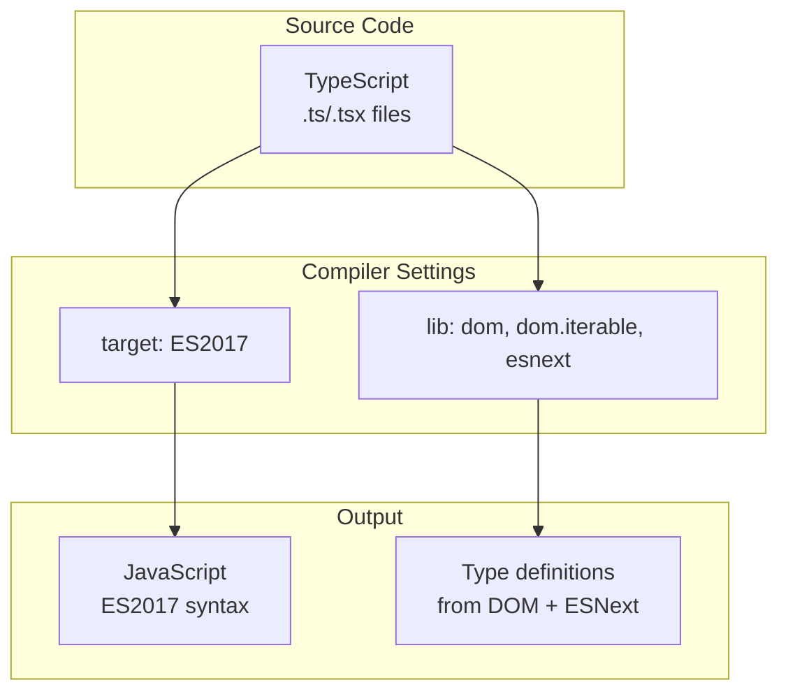
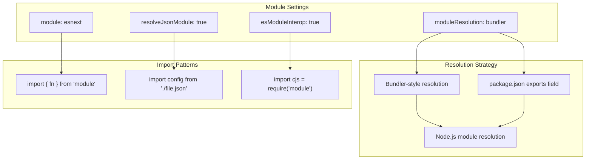
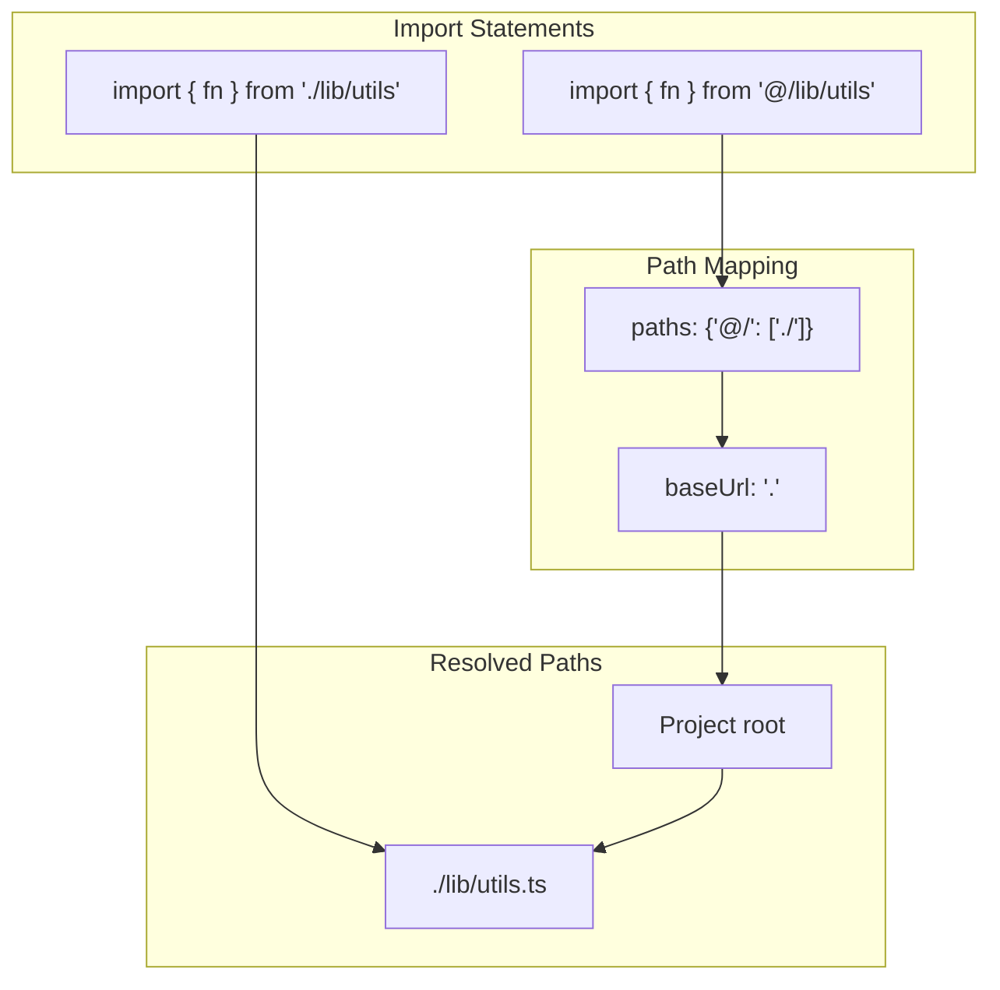
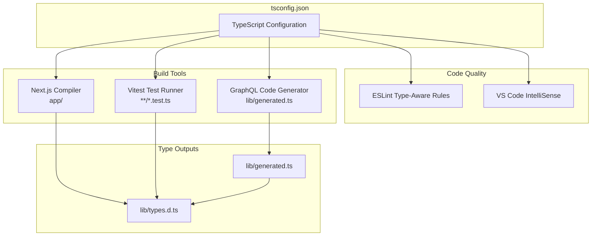
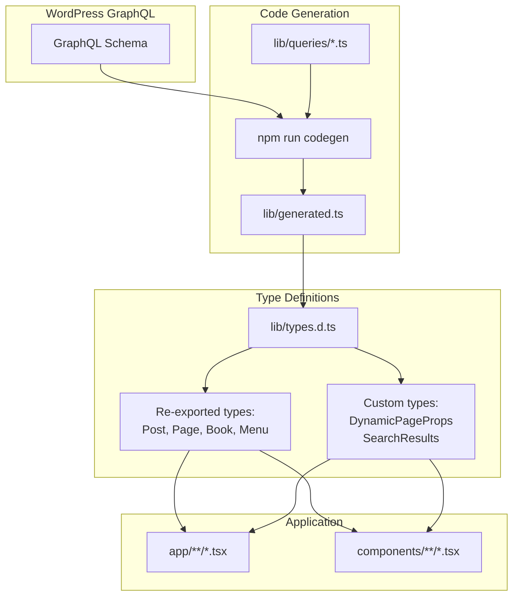

# TypeScript Configuration

> **Relevant source files**
> * [.nvmrc](https://github.com/gregrickaby/nextjs-wordpress/blob/63f3f2f5/.nvmrc)
> * [eslint.config.mjs](https://github.com/gregrickaby/nextjs-wordpress/blob/63f3f2f5/eslint.config.mjs)
> * [lib/types.d.ts](https://github.com/gregrickaby/nextjs-wordpress/blob/63f3f2f5/lib/types.d.ts)
> * [tsconfig.json](https://github.com/gregrickaby/nextjs-wordpress/blob/63f3f2f5/tsconfig.json)

This document covers the TypeScript compiler configuration in `tsconfig.json`, including compiler options, path mappings, and integration with Next.js, Vitest, and other build tools. For information about the type system architecture and GraphQL code generation, see [Type System](/gregrickaby/nextjs-wordpress/3.1-type-system).

## Overview

The TypeScript configuration at [tsconfig.json L1-L36](https://github.com/gregrickaby/nextjs-wordpress/blob/63f3f2f5/tsconfig.json#L1-L36)

 defines how the TypeScript compiler processes the codebase. The configuration is optimized for Next.js 16 with App Router, enabling strict type checking while supporting modern ECMAScript features and JSX transformation.

**Sources:** [tsconfig.json L1-L36](https://github.com/gregrickaby/nextjs-wordpress/blob/63f3f2f5/tsconfig.json#L1-L36)

## Configuration Structure

The `tsconfig.json` file contains three main sections:

| Section | Purpose | Lines |
| --- | --- | --- |
| `compilerOptions` | TypeScript compiler behavior and output settings | [tsconfig.json L2-L25](https://github.com/gregrickaby/nextjs-wordpress/blob/63f3f2f5/tsconfig.json#L2-L25) |
| `include` | Files and patterns to include in compilation | [tsconfig.json L27-L33](https://github.com/gregrickaby/nextjs-wordpress/blob/63f3f2f5/tsconfig.json#L27-L33) |
| `exclude` | Files and patterns to exclude from compilation | [tsconfig.json L34](https://github.com/gregrickaby/nextjs-wordpress/blob/63f3f2f5/tsconfig.json#L34-L34) |

**Sources:** [tsconfig.json L1-L36](https://github.com/gregrickaby/nextjs-wordpress/blob/63f3f2f5/tsconfig.json#L1-L36)

## Compiler Options

### Target and Library Configuration



**Target and Library Settings**

The [tsconfig.json L3](https://github.com/gregrickaby/nextjs-wordpress/blob/63f3f2f5/tsconfig.json#L3-L3)

 setting `"target": "ES2017"` compiles TypeScript to ES2017 JavaScript syntax, providing broad browser compatibility while supporting async/await natively. The [tsconfig.json L4](https://github.com/gregrickaby/nextjs-wordpress/blob/63f3f2f5/tsconfig.json#L4-L4)

 `lib` array specifies three type definition libraries:

* `dom` - Browser DOM APIs (Document, Window, Element, etc.)
* `dom.iterable` - Iterable DOM collections (NodeList, HTMLCollection)
* `esnext` - Latest ECMAScript features and proposals

**Sources:** [tsconfig.json L3-L4](https://github.com/gregrickaby/nextjs-wordpress/blob/63f3f2f5/tsconfig.json#L3-L4)

### Strict Type Checking

The [tsconfig.json L7](https://github.com/gregrickaby/nextjs-wordpress/blob/63f3f2f5/tsconfig.json#L7-L7)

 setting `"strict": true` enables all strict type checking options, including:

* `strictNullChecks` - Null and undefined are not assignable to other types
* `strictFunctionTypes` - Function parameter contravariance checking
* `strictBindCallApply` - Strict checking of bind, call, and apply
* `strictPropertyInitialization` - Class properties must be initialized
* `noImplicitThis` - Error on 'this' with implicit 'any' type
* `alwaysStrict` - Parse in strict mode and emit "use strict"

**Sources:** [tsconfig.json L7](https://github.com/gregrickaby/nextjs-wordpress/blob/63f3f2f5/tsconfig.json#L7-L7)

### Module Configuration



**Module System Settings**

| Option | Value | Purpose |
| --- | --- | --- |
| [module](https://github.com/gregrickaby/nextjs-wordpress/blob/63f3f2f5/module) | `esnext` | Emit ESM imports/exports |
| [moduleResolution](https://github.com/gregrickaby/nextjs-wordpress/blob/63f3f2f5/moduleResolution) | `bundler` | Use bundler-specific resolution rules |
| [esModuleInterop](https://github.com/gregrickaby/nextjs-wordpress/blob/63f3f2f5/esModuleInterop) | `true` | Allow default imports from CommonJS modules |
| [resolveJsonModule](https://github.com/gregrickaby/nextjs-wordpress/blob/63f3f2f5/resolveJsonModule) | `true` | Enable importing .json files |

The `"moduleResolution": "bundler"` setting [tsconfig.json L11](https://github.com/gregrickaby/nextjs-wordpress/blob/63f3f2f5/tsconfig.json#L11-L11)

 is specifically designed for bundlers like Next.js/Webpack, respecting `package.json` `exports` fields and allowing extension-less imports.

**Sources:** [tsconfig.json L9-L12](https://github.com/gregrickaby/nextjs-wordpress/blob/63f3f2f5/tsconfig.json#L9-L12)

### JSX and React Configuration

The [tsconfig.json L14](https://github.com/gregrickaby/nextjs-wordpress/blob/63f3f2f5/tsconfig.json#L14-L14)

 setting `"jsx": "react-jsx"` enables the new JSX transform introduced in React 17+. This eliminates the need to import React in every file that uses JSX:

```javascript
// No longer needed:
// import React from 'react'

export function Component() {
  return <div>Hello</div>
}
```

The [tsconfig.json L13](https://github.com/gregrickaby/nextjs-wordpress/blob/63f3f2f5/tsconfig.json#L13-L13)

 `"isolatedModules": true` setting ensures each file can be safely transpiled independently by tools like esbuild or swc, which is required for Next.js fast refresh.

**Sources:** [tsconfig.json L13-L14](https://github.com/gregrickaby/nextjs-wordpress/blob/63f3f2f5/tsconfig.json#L13-L14)

### Build Performance

| Option | Value | Purpose |
| --- | --- | --- |
| [noEmit](https://github.com/gregrickaby/nextjs-wordpress/blob/63f3f2f5/noEmit) | `true` | Don't emit JavaScript files (Next.js handles compilation) |
| [incremental](https://github.com/gregrickaby/nextjs-wordpress/blob/63f3f2f5/incremental) | `true` | Enable incremental compilation with `.tsbuildinfo` cache |
| [skipLibCheck](https://github.com/gregrickaby/nextjs-wordpress/blob/63f3f2f5/skipLibCheck) | `true` | Skip type checking of declaration files |
| [allowJs](https://github.com/gregrickaby/nextjs-wordpress/blob/63f3f2f5/allowJs) | `true` | Allow JavaScript files in the project |

The [tsconfig.json L8](https://github.com/gregrickaby/nextjs-wordpress/blob/63f3f2f5/tsconfig.json#L8-L8)

 `"noEmit": true` setting prevents TypeScript from emitting JavaScript files because Next.js handles all compilation through its own build pipeline.

**Sources:** [tsconfig.json L5-L15](https://github.com/gregrickaby/nextjs-wordpress/blob/63f3f2f5/tsconfig.json#L5-L15)

## Path Mappings and Module Resolution



The [tsconfig.json L21-L24](https://github.com/gregrickaby/nextjs-wordpress/blob/63f3f2f5/tsconfig.json#L21-L24)

 path mapping configuration provides import aliasing:

```json
{
  "baseUrl": ".",
  "paths": {
    "@/*": ["./*"]
  }
}
```

This allows imports using the `@/` prefix to resolve from the project root:

```javascript
// Instead of:
import {fetchGraphQL} from '../../../lib/fetch-graphql'

// Use:
import {fetchGraphQL} from '@/lib/fetch-graphql'
```

The pattern is used extensively throughout the codebase in components and pages.

**Sources:** [tsconfig.json L21-L24](https://github.com/gregrickaby/nextjs-wordpress/blob/63f3f2f5/tsconfig.json#L21-L24)

## Type Definitions

The [tsconfig.json L25](https://github.com/gregrickaby/nextjs-wordpress/blob/63f3f2f5/tsconfig.json#L25-L25)

 `types` array explicitly includes type definitions for testing frameworks:

```
"types": ["vitest/globals", "@testing-library/jest-dom"]
```

This enables:

* **vitest/globals**: Global test functions (`describe`, `it`, `expect`, `vi`) without imports
* **@testing-library/jest-dom**: Custom matchers (`toBeInTheDocument`, `toHaveTextContent`)

These types augment the global namespace and are available in all test files. See [Testing Infrastructure](/gregrickaby/nextjs-wordpress/8.1-testing-infrastructure) for more details on test setup.

**Sources:** [tsconfig.json L25](https://github.com/gregrickaby/nextjs-wordpress/blob/63f3f2f5/tsconfig.json#L25-L25)

## Next.js Integration

```mermaid
flowchart TD

PLUGIN["plugins: [{ name: 'next' }]"]
TYPEGEN["Type Generation"]
VALIDATION["Route Validation"]
LINKCHECK["Link Type Checking"]
NEXTENV["next-env.d.ts"]
NEXTTYPES[".next/types/**/*.ts"]
DEVTYPES[".next/dev/types/**/*.ts"]
LINK[""]
ROUTER["useRouter()"]
PARAMS["params, searchParams"]

PLUGIN --> TYPEGEN
PLUGIN --> VALIDATION
PLUGIN --> LINKCHECK
TYPEGEN --> NEXTENV
TYPEGEN --> NEXTTYPES
TYPEGEN --> DEVTYPES
VALIDATION --> LINK
VALIDATION --> ROUTER
LINKCHECK --> PARAMS

subgraph subGraph3 ["Type-Safe Routing"]
    LINK
    ROUTER
    PARAMS
end

subgraph subGraph2 ["Generated Types"]
    NEXTENV
    NEXTTYPES
    DEVTYPES
end

subgraph subGraph1 ["Next.js Type Plugin"]
    TYPEGEN
    VALIDATION
    LINKCHECK
end

subgraph tsconfig.json ["tsconfig.json"]
    PLUGIN
end
```

The [tsconfig.json L16-L19](https://github.com/gregrickaby/nextjs-wordpress/blob/63f3f2f5/tsconfig.json#L16-L19)

 Next.js plugin configuration enables Next.js-specific TypeScript features:

```
"plugins": [
  {
    "name": "next"
  }
]
```

This plugin provides:

* Type checking for Next.js-specific APIs (App Router, Server Components)
* Auto-generated types for route parameters and search params
* Type-safe `Link` component `href` validation
* Type definitions for Next.js configuration

**Sources:** [tsconfig.json L16-L19](https://github.com/gregrickaby/nextjs-wordpress/blob/63f3f2f5/tsconfig.json#L16-L19)

## Include and Exclude Patterns

### Include Patterns

The [tsconfig.json L27-L33](https://github.com/gregrickaby/nextjs-wordpress/blob/63f3f2f5/tsconfig.json#L27-L33)

 `include` array specifies which files TypeScript should process:

```
"include": [
  "next-env.d.ts",
  "**/*.ts",
  "**/*.tsx",
  ".next/types/**/*.ts",
  ".next/dev/types/**/*.ts"
]
```

| Pattern | Matches |
| --- | --- |
| `next-env.d.ts` | Next.js type declarations |
| `**/*.ts` | All TypeScript files in the project |
| `**/*.tsx` | All React TypeScript files |
| `.next/types/**/*.ts` | Generated types from Next.js build |
| `.next/dev/types/**/*.ts` | Generated types from Next.js dev server |

The `.next/types/` directories are generated by Next.js at build time and contain route-specific type definitions for dynamic segments.

**Sources:** [tsconfig.json L27-L33](https://github.com/gregrickaby/nextjs-wordpress/blob/63f3f2f5/tsconfig.json#L27-L33)

### Exclude Patterns

The [tsconfig.json L34](https://github.com/gregrickaby/nextjs-wordpress/blob/63f3f2f5/tsconfig.json#L34-L34)

 `exclude` array specifies the only directory to exclude:

```
"exclude": ["node_modules"]
```

All other exclusions are handled by the TypeScript compiler automatically or through other configuration files like `.gitignore` and [eslint.config.mjs L18-L29](https://github.com/gregrickaby/nextjs-wordpress/blob/63f3f2f5/eslint.config.mjs#L18-L29)

**Sources:** [tsconfig.json L34](https://github.com/gregrickaby/nextjs-wordpress/blob/63f3f2f5/tsconfig.json#L34-L34)

## Integration with Other Tools



### Next.js Compiler

Next.js reads `tsconfig.json` to:

* Configure the SWC TypeScript transformer
* Generate route-specific types in `.next/types/`
* Enable type checking during development and build

### GraphQL Code Generator

The [codegen.ts](https://github.com/gregrickaby/nextjs-wordpress/blob/63f3f2f5/codegen.ts)

 file uses `tsconfig.json` settings to ensure generated types at [lib/generated.ts](https://github.com/gregrickaby/nextjs-wordpress/blob/63f3f2f5/lib/generated.ts)

 are compatible with the project's TypeScript configuration. See [Type System](/gregrickaby/nextjs-wordpress/3.1-type-system) for details.

### Vitest

Vitest respects `tsconfig.json` for:

* Transforming TypeScript test files
* Resolving path aliases (`@/*`)
* Providing global type definitions ([tsconfig.json L25](https://github.com/gregrickaby/nextjs-wordpress/blob/63f3f2f5/tsconfig.json#L25-L25) )

See [Testing Infrastructure](/gregrickaby/nextjs-wordpress/8.1-testing-infrastructure) for Vitest configuration details.

### ESLint

ESLint uses TypeScript type information for advanced rules through the `@typescript-eslint` parser, which reads `tsconfig.json` to understand the project structure.

**Sources:** [tsconfig.json L1-L36](https://github.com/gregrickaby/nextjs-wordpress/blob/63f3f2f5/tsconfig.json#L1-L36)

 [eslint.config.mjs L1-L33](https://github.com/gregrickaby/nextjs-wordpress/blob/63f3f2f5/eslint.config.mjs#L1-L33)

## Node.js Version Constraint

While not part of `tsconfig.json`, the [.nvmrc L1](https://github.com/gregrickaby/nextjs-wordpress/blob/63f3f2f5/.nvmrc#L1-L1)

 file specifies Node.js version 24, which influences TypeScript's compatibility decisions. The `ES2017` target [tsconfig.json L3](https://github.com/gregrickaby/nextjs-wordpress/blob/63f3f2f5/tsconfig.json#L3-L3)

 is conservative enough to work with Node.js 24's native JavaScript capabilities.

**Sources:** [.nvmrc L1](https://github.com/gregrickaby/nextjs-wordpress/blob/63f3f2f5/.nvmrc#L1-L1)

## Common Patterns

### Type Definition Workflow



The [lib/types.d.ts L1-L27](https://github.com/gregrickaby/nextjs-wordpress/blob/63f3f2f5/lib/types.d.ts#L1-L27)

 file demonstrates the type definition pattern:

1. **Re-export generated types** [lib/types.d.ts L2](https://github.com/gregrickaby/nextjs-wordpress/blob/63f3f2f5/lib/types.d.ts#L2-L2) : WordPress types from `lib/generated.ts`
2. **Define custom types** [lib/types.d.ts L5-L26](https://github.com/gregrickaby/nextjs-wordpress/blob/63f3f2f5/lib/types.d.ts#L5-L26) : Application-specific interfaces like `DynamicPageProps`, `SearchResults`, `GraphQLResponse`
3. **Import in application code**: All pages and components import from `lib/types.d.ts`, not directly from `lib/generated.ts`

This pattern provides a stable API facade over generated code, which may change frequently when the WordPress schema updates.

**Sources:** [lib/types.d.ts L1-L27](https://github.com/gregrickaby/nextjs-wordpress/blob/63f3f2f5/lib/types.d.ts#L1-L27)

### Path Alias Usage

The `@/*` path alias [tsconfig.json L22-L24](https://github.com/gregrickaby/nextjs-wordpress/blob/63f3f2f5/tsconfig.json#L22-L24)

 is used consistently throughout the codebase:

```javascript
// In app/page.tsx
import {getAllPosts} from '@/lib/queries/get-all-posts'
import type {Post} from '@/lib/types'

// In lib/queries/get-post-by-slug.ts
import {fetchGraphQL} from '@/lib/fetch-graphql'
```

All imports from `lib/`, `app/`, or `components/` should use the `@/` prefix for consistency.

**Sources:** [tsconfig.json L22-L24](https://github.com/gregrickaby/nextjs-wordpress/blob/63f3f2f5/tsconfig.json#L22-L24)

## Configuration Validation

TypeScript configuration is validated at multiple stages:

| Stage | Tool | Validation |
| --- | --- | --- |
| Editor | VS Code | Real-time type checking with [TypeScript plugin](/gregrickaby/nextjs-wordpress/7.1-vs-code-configuration) |
| Pre-commit | Lefthook | Type checking via `npm run build` in [lefthook.yml](/gregrickaby/nextjs-wordpress/7.3-git-hooks) |
| CI | GitHub Actions | Full type check in [.github/workflows/ci.yml](/gregrickaby/nextjs-wordpress/9.2-cicd-pipeline) |
| Build | Next.js | Type errors prevent production build |

Any misconfiguration in `tsconfig.json` will cause immediate failures in the development environment.

**Sources:** [tsconfig.json L1-L36](https://github.com/gregrickaby/nextjs-wordpress/blob/63f3f2f5/tsconfig.json#L1-L36)